# 2025년 12월

[← 2025년](README.md)

### 12월 3일 (수) 10:47 · Upstage 가 발표와 부스로 AWS re: Invent에 참여중입니다…

Upstage 가 발표와 부스로 AWS re: Invent에 참여중입니다. re: Invent에 참여중이시면 저희 부스 (Kiosk-1717)에 꼭 들러주시고 저희 글로벌 팀 멤버들을 만나보셔요! 멋진 소식들이 많습니다!!

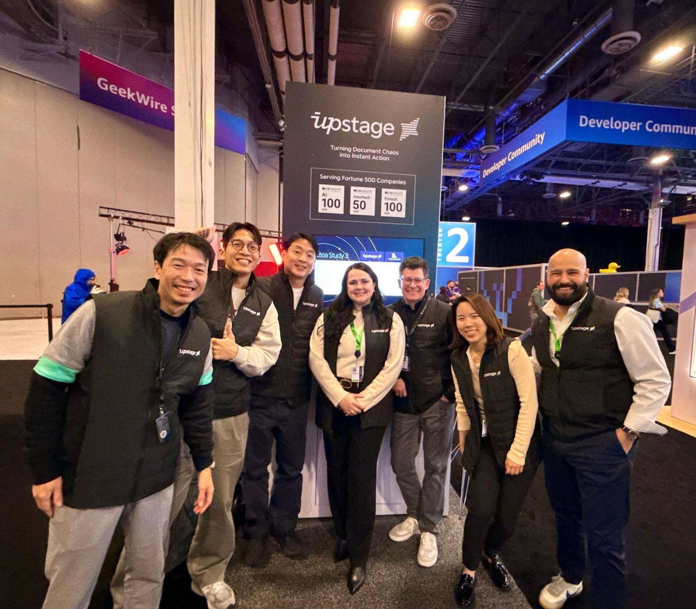
**이미지 캡션:** 일곱 명의 성인 남녀가 실내 행사장에서 단체 사진을 찍고 있으며, 모두 검은색 조끼를 입고 있으며 조끼에는 "upstage"라는 로고가 새겨져 있습니다. 왼쪽에서부터 첫 번째 남성은 30대 후반에서 40대 초반으로 보이며, 밝은 회색 바지와 검은색 조끼, 회색 긴팔 티셔츠를 입고 환하게 웃고 있습니다. 두 번째 남성은 20대 후반에서 30대 초반으로 보이며, 회색 바지와 검은색 조끼, 흰색 긴팔 티셔츠를 입고 엄지손가락을 치켜들고 웃고 있습니다. 세 번째 남성은 20대 후반에서 30대 초반으로 보이며, 회색 바지와 검은색 조끼, 흰색 긴팔 티셔츠를 입고 미소를 짓고 있습니다. 네 번째는 20대 후반에서 30대 초반으로 보이는 여성으로, 검은색 바지와 검은색 조끼, 흰색 블라우스를 입고 카메라를 응시하며 미소를 짓고 있습니다. 다섯 번째는 30대 초반으로 보이는 남성으로, 회색 바지와 검은색 조끼, 흰색 긴팔 티셔츠를 입고 카메라를 응시하며 미소를 짓고 있습니다. 여섯 번째는 20대 후반에서 30대 초반으로 보이는 여성으로, 검은색 바지와 검은색 조끼, 베이지색 긴팔 티셔츠를 입고 카메라를 응시하며 미소를 짓고 있습니다. 일곱 번째는 30대 후반에서 40대 초반으로 보이는 남성으로, 네이비색 바지와 검은색 조끼, 흰색 셔츠를 입고 카메라를 응시하며 환하게 웃고 있습니다. 배경에는 "upstage"라고 적힌 큰 검은색 간판이 보이며, 그 아래에는 "Turning Document Chaos into Instant Action"이라는 문구와 함께 "Serving Fortune 500 Companies"라는 문구와 함께 AI, Insurtech, Fintech 분야에서 각각 100, 50, 100개의 회사를 서비스하고 있다는 내용이 적혀 있습니다. 또한 "GeekWire"와 "Developer Community"라는 글자가 보이는 현수막도 있습니다. 전체적으로 행사장 분위기이며, 사람들은 친근하고 긍정적인 표정을 짓고 있습니다.바지와 검은색 조끼, 흰색 긴팔 티셔츠를 입고 미소를 짓고 있습니다. 네 번째는 20대 후반에서 30대 초반으로 보이는 여성으로, 검은색 바지와 검은색 조끼, 흰색 블라우스를 입고 카메라를 응시하며 미소를 짓고 있습니다. 다섯 번째는 30대 초반으로 보이는 남성으로, 회색 바지와 검은색 조끼, 흰색 긴팔 티셔츠를 입고 카메라를 응시하며 미소를 짓고 있습니다. 여섯 번째는 20대 후반에서 30대 초반으로 보이는 여성으로, 검은색 바지와 검은색 조끼, 베이지색 긴팔 티셔츠를 입고 카메라를 응시하며 미소를 짓고 있습니다. 일곱 번째는 30대 후반에서 40대 초반으로 보이는 남성으로, 네이비색 바지와 검은색 조끼, 흰색 셔츠를 입고 카메라를 응시하며 환하게 웃고 있습니다. 배경에는 "upstage"라고 적힌 큰 검은색 간판이 보이며, 그 아래에는 "Turning Document Chaos into Instant Action"이라는 문구와 함께 "Serving Fortune 500 Companies"라는 문구와 함께 AI, Insurtech, Fintech 분야에서 각각 100, 50, 100개의 회사를 서비스하고 있다는 내용이 적혀 있습니다. 또한 "GeekWire"와 "Developer Community"라는 글자가 보이는 현수막도 있습니다. 전체적으로 행사장 분위기이며, 사람들은 친근하고 긍정적인 표정을 짓고 있습니다.
 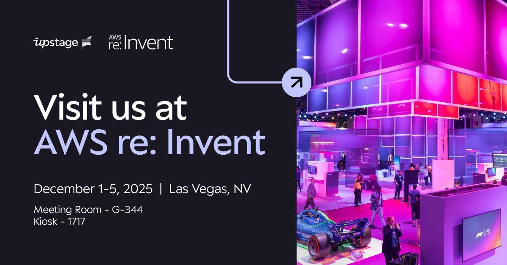
**이미지 캡션:** 이 이미지는 AWS re:Invent 행사 홍보물로, 왼쪽에는 행사에 대한 정보가, 오른쪽에는 행사장 내부의 모습이 담겨 있습니다. 왼쪽에는 "upstage"와 "AWS re:Invent" 로고가 보이며, "Visit us at AWS re: Invent"라는 문구가 흰색과 보라색으로 크게 쓰여 있습니다. 그 아래에는 행사 날짜인 "December 1-5, 2025"와 장소인 "Las Vegas, NV"가 명시되어 있으며, 미팅룸 번호 "G-344"와 키오스크 번호 "1717"도 안내되어 있습니다. 오른쪽 배경에는 보라색과 분홍색 조명이 켜진 현대적인 디자인의 행사장 내부가 보입니다. 여러 개의 부스와 전시물, 그리고 사람들이 행사장을 둘러보고 있는 모습이 희미하게 보이며, 포뮬러 1 경주차 모형도 눈에 띕니다. 전반적으로 미래지향적이고 활기찬 분위기를 연출하고 있습니다.경에는 보라색과 분홍색 조명이 켜진 현대적인 디자인의 행사장 내부가 보입니다. 여러 개의 부스와 전시물, 그리고 사람들이 행사장을 둘러보고 있는 모습이 희미하게 보이며, 포뮬러 1 경주차 모형도 눈에 띕니다. 전반적으로 미래지향적이고 활기찬 분위기를 연출하고 있습니다.

### 12월 4일 (목) 21:40 · Upstage, 조달청 ‘생성형 AI 업무 지원 서비스’ 첫 공급사로 공…

Upstage, 조달청 ‘생성형 AI 업무 지원 서비스’ 첫 공급사로 공급 계약을 체결했습니다.

이제 https://space.upstage.ai/ 와 똑같은 서비스, 즉 문서를 올리고 검색, 질의응답, 정보 추출·요약 등 다양한 업무를 완전히 분리된 공무전용망에서 안전하게 처리할 수 있습니다.

많이 사용해주세요!

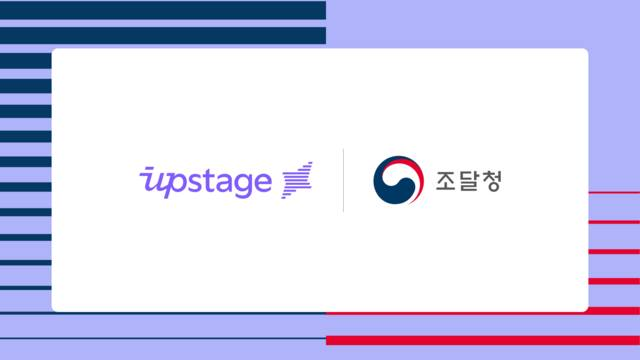
**이미지 캡션:** 이 이미지는 두 개의 로고가 나란히 배치된 그래픽 디자인으로, 왼쪽에는 보라색 글씨로 'upstage'라는 텍스트와 함께 별 모양의 추상적인 아이콘이 있고, 오른쪽에는 태극 문양과 함께 '조달청'이라는 텍스트가 있다. 배경은 연보라색이며, 상단과 하단에는 짙은 파란색과 빨간색 줄무늬가 교차하는 디자인 요소가 있다. 전체적으로 깔끔하고 현대적인 느낌을 주며, 두 기관의 협력이나 파트너십을 나타내는 것으로 보인다. 사람이나 구체적인 장소는 보이지 않는다.

### 12월 4일 (목) 21:40 · Sung Kim shared a link.

🔗 <https://n.news.naver.com/article/029/0002997451?sid=105>

### 12월 8일 (월) 15:48 · #NeurIPS2025 논문들 누가 썼나 정보인데요. HKUST·칭화대·…

#NeurIPS2025 논문들 누가 썼나 정보인데요. HKUST·칭화대·베이징대·Zhejiang대 등 중국 대학들 대단합니다. 싱가포르도 규모에 비해 상당히 훌륭하고 KAIST도 축하드립니다!

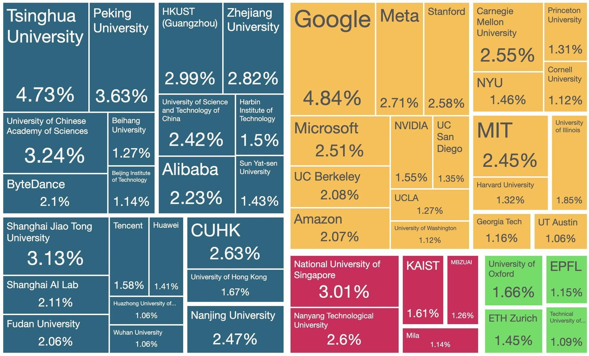
**이미지 캡션:** 이 이미지는 다양한 대학 및 기술 기업의 순위를 나타내는 트리맵 차트입니다. 각 사각형의 크기는 해당 기관의 순위를 나타내며, 기관 이름과 백분율이 표시되어 있습니다. 왼쪽에는 Tsinghua University가 4.73%로 가장 큰 사각형을 차지하고 있으며, 그 뒤를 Peking University(3.63%), University of Chinese Academy of Sciences(3.24%), Shanghai Jiao Tong University(3.13%) 등이 따릅니다. 중앙에는 Google이 4.84%로 가장 큰 사각형을 차지하고 있으며, 그 뒤를 Meta(2.71%), Microsoft(2.51%), Amazon(2.07%) 등이 따릅니다. 오른쪽에는 MIT가 2.45%로 가장 큰 사각형을 차지하고 있으며, 그 뒤를 Carnegie Mellon University(2.55%), Stanford(2.58%), University of Illinois(1.85%) 등이 따릅니다. 이 차트는 연구 및 기술 분야에서 각 기관의 영향력이나 성과를 시각적으로 보여주는 것으로 보입니다. 차트에는 사람이나 특정 장소는 나타나지 않으며, 텍스트는 기관 이름과 백분율로 구성되어 있습니다. 전반적인 분위기는 정보 전달에 초점을 맞춘 분석적이고 객관적인 느낌을 줍니다.4.84%로 가장 큰 사각형을 차지하고 있으며, 그 뒤를 Meta(2.71%), Microsoft(2.51%), Amazon(2.07%) 등이 따릅니다. 오른쪽에는 MIT가 2.45%로 가장 큰 사각형을 차지하고 있으며, 그 뒤를 Carnegie Mellon University(2.55%), Stanford(2.58%), University of Illinois(1.85%) 등이 따릅니다. 이 차트는 연구 및 기술 분야에서 각 기관의 영향력이나 성과를 시각적으로 보여주는 것으로 보입니다. 차트에는 사람이나 특정 장소는 나타나지 않으며, 텍스트는 기관 이름과 백분율로 구성되어 있습니다. 전반적인 분위기는 정보 전달에 초점을 맞춘 분석적이고 객관적인 느낌을 줍니다.

### 12월 8일 (월) 15:48 · Sung Kim shared a link.

🔗 <https://www.linkedin.com/posts/pierre-alexandre-balland-20b75b13_who-pushed-the-ai-frontier-at-neurips-2025-activity-7403119036496162817-vRPE/>

### 12월 12일 (금) 11:18 · 와~ Upstage #SolarPro2 가 Works AI 대표 모델로 …

와~ Upstage #SolarPro2 가 Works AI 대표 모델로 선정되었습니다. Works AI는 사용하는 만큼만 비용을 내는 AI 서비스로, 기업 계정으로도 연동이 되며, 이를 통해 업무에 큰 도움을 받을 수 있습니다.

https://wrks.ai 에서 바로 Solar-Pro2와 함께 사용해보세요!

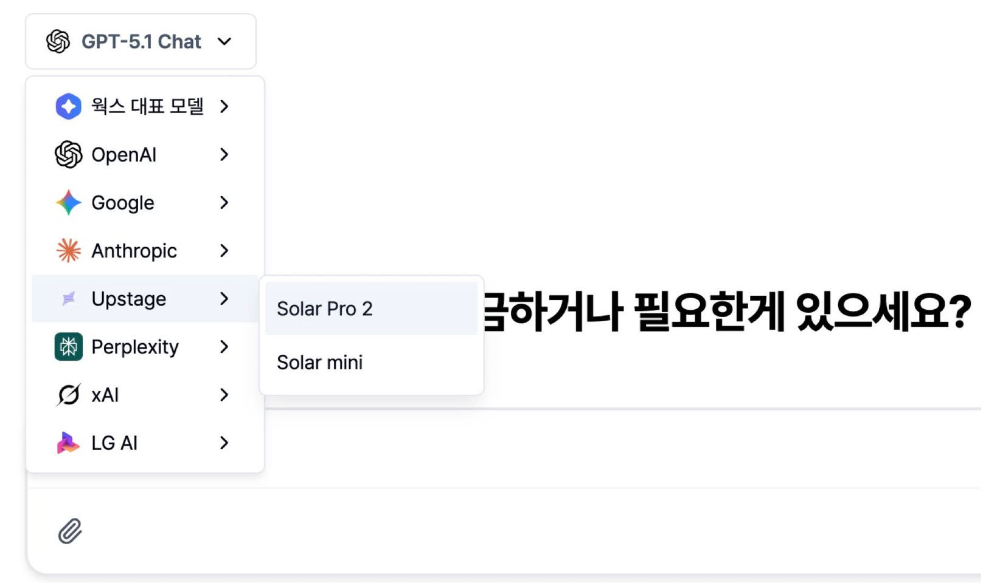
**이미지 캡션:** 이 이미지는 인공지능 챗봇 인터페이스의 일부를 보여줍니다. 화면 왼쪽에는 다양한 AI 모델 제공업체 목록이 드롭다운 메뉴 형태로 표시되어 있으며, 각 항목에는 로고와 함께 "웍스 대표 모델", "OpenAI", "Google", "Anthropic", "Upstage", "Perplexity", "xAI", "LG AI"와 같은 이름이 한국어로 적혀 있습니다. 현재 "Upstage" 항목이 선택되어 있으며, 이에 따라 "Solar Pro 2"와 "Solar mini"라는 두 가지 모델이 추가로 표시되는 하위 메뉴가 나타나 있습니다. 화면 오른쪽에는 "급하거나 필요한게 있으세요?"라는 한국어 문구가 검은색 굵은 글씨로 쓰여 있어, 사용자에게 질문을 하도록 유도하는 것으로 보입니다. 전반적으로 깔끔하고 현대적인 디자인의 디지털 인터페이스이며, 사용자가 다양한 AI 모델 중에서 선택하고 질문을 입력할 수 있는 환경을 나타냅니다.메뉴가 나타나 있습니다. 화면 오른쪽에는 "급하거나 필요한게 있으세요?"라는 한국어 문구가 검은색 굵은 글씨로 쓰여 있어, 사용자에게 질문을 하도록 유도하는 것으로 보입니다. 전반적으로 깔끔하고 현대적인 디자인의 디지털 인터페이스이며, 사용자가 다양한 AI 모델 중에서 선택하고 질문을 입력할 수 있는 환경을 나타냅니다.

### 12월 13일 (토) 21:28 · 📷 사진 (1장)

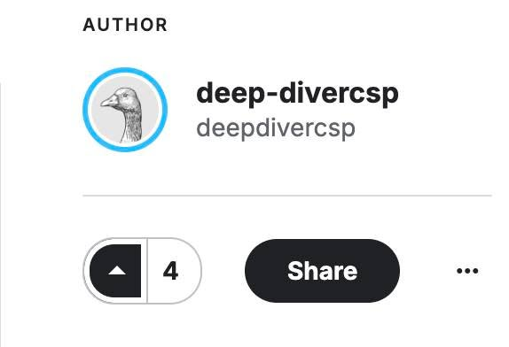
**이미지 캡션:** 이 사진은 "AUTHOR"라는 제목 아래에 작성자 정보를 보여줍니다. 작성자는 파란색 원 안에 그려진 오리 그림을 프로필 사진으로 사용하고 있으며, 그 옆에는 "deep-divercsp"라는 사용자 이름과 "deepdivercsp"라는 아이디가 표시되어 있습니다. 그 아래에는 위쪽 화살표 모양 버튼과 숫자 "4"가 있는 버튼이 있고, 그 옆에는 "Share"라고 적힌 검은색 버튼과 점 세 개가 있습니다. 전체적으로 깔끔하고 현대적인 디자인의 인터페이스 화면으로 보이며, 게시물의 작성자 정보와 공유 기능을 나타내고 있습니다.내고 있습니다.

### 12월 15일 (월) 14:54 · #SolarOpen100B 모델 카드를 공개합니다. 이번 과기정통부, N…

#SolarOpen100B 모델 카드를 공개합니다. 이번 과기정통부, NIPA, NIA, IITP 등의 지원으로 만든 독자 파운데이션 1차 모델을 공개합니다. https://huggingface.co/upstage/Solar-Open-100B

Upstage에서 그동안의 노하우를 부어 from scratch로 만든 100B 모델이고 깜짝 놀랄 만한 성능을 가지고 있습니다. 우선 모델 카드 공개 후, 올해 안에 Apache-2.0 라이선스로 오픈 웨이트, 그리고 쉽게 사용할 수 있도록 API도 공개합니다.

미리 Like와 Follow해 주시면 모델이 나오자마자 제일 빠르게 알려드리겠습니다!

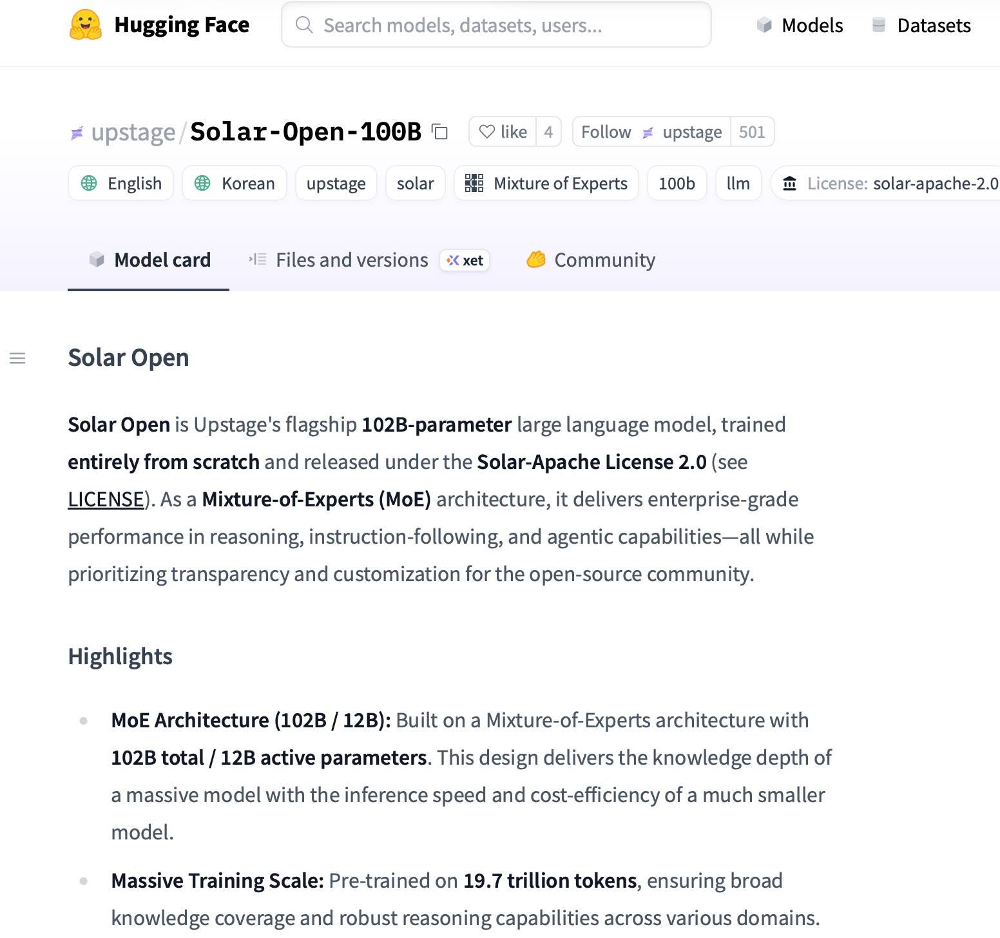
**이미지 캡션:** 이 이미지는 Hugging Face 웹사이트의 한 페이지를 보여주며, "upstage/Solar-Open-100B"라는 이름의 대규모 언어 모델에 대한 정보를 담고 있습니다. 화면 상단에는 Hugging Face 로고와 검색창, 그리고 "Models", "Datasets" 메뉴가 보입니다. 중앙에는 모델 이름과 함께 "like", "Follow" 버튼, 그리고 모델의 태그들이 나열되어 있습니다. 태그로는 "English", "Korean", "upstage", "solar", "Mixture of Experts", "100b", "llm", "License: solar-apache-2.0" 등이 있습니다. 그 아래에는 "Model card", "Files and versions", "Community" 탭이 있으며, 현재 "Model card"가 선택되어 있습니다. "Model card" 섹션에는 "Solar Open"이라는 제목과 함께 모델에 대한 상세 설명이 제공됩니다. 설명에 따르면, Solar Open은 Upstage의 플래그십 102B-파라미터 대규모 언어 모델로, 처음부터 훈련되었으며 Solar-Apache License 2.0에 따라 배포됩니다. Mixture-of-Experts (MoE) 아키텍처를 사용하여 추론, 지시 따르기, 에이전트 기능 등에서 엔터프라이즈급 성능을 제공하며, 투명성과 오픈소스 커뮤니티를 위한 맞춤 설정을 우선시합니다. "Highlights" 섹션에서는 MoE 아키텍처의 특징과 19.7조 개의 토큰으로 사전 훈련된 대규모 학습 규모에 대해 설명하고 있습니다. 전반적으로 기술적인 정보를 제공하는 웹페이지의 모습이며, 특별한 인물이나 배경은 보이지 않습니다.s", "100b", "llm", "License: solar-apache-2.0" 등이 있습니다. 그 아래에는 "Model card", "Files and versions", "Community" 탭이 있으며, 현재 "Model card"가 선택되어 있습니다. "Model card" 섹션에는 "Solar Open"이라는 제목과 함께 모델에 대한 상세 설명이 제공됩니다. 설명에 따르면, Solar Open은 Upstage의 플래그십 102B-파라미터 대규모 언어 모델로, 처음부터 훈련되었으며 Solar-Apache License 2.0에 따라 배포됩니다. Mixture-of-Experts (MoE) 아키텍처를 사용하여 추론, 지시 따르기, 에이전트 기능 등에서 엔터프라이즈급 성능을 제공하며, 투명성과 오픈소스 커뮤니티를 위한 맞춤 설정을 우선시합니다. "Highlights" 섹션에서는 MoE 아키텍처의 특징과 19.7조 개의 토큰으로 사전 훈련된 대규모 학습 규모에 대해 설명하고 있습니다. 전반적으로 기술적인 정보를 제공하는 웹페이지의 모습이며, 특별한 인물이나 배경은 보이지 않습니다.

### 12월 16일 (화) 10:30 · 존경하는 임문영 부위원장님과 위원회에서 정말 많은 수고해 주셔서 ‘「대한…

존경하는 임문영 부위원장님과 위원회에서 정말 많은 수고해 주셔서 ‘「대한민국 인공지능 행동계획(안)」’이 공개되었습니다. 1월 4일까지 의견을 받고 있다고 하는데요. 98개 과제 재미있는 것이 정말 많습니다. 여러분들이 하시는 일과 연관되는 것이 무엇이고 그 내용이 몇 페이지 어디에 나오는지 궁금하시다면 UpstageAI Space를 사용해보세요. https://space.upstage.ai/share/a0bff2f2-f4c4-49cb-92a3-9ad14971bb57

저희 회사 연관은 무엇인지, 그리고 바우처 사업 관련이 있어 출처를 클릭하니 정확하게 그 내용 블록을 보여줍니다.

여러분이 참고하고 싶은 파일을 올리고 관련 질문을 하면 성실한 답과 함께 그 내용이 몇 페이지 어느 부분인지 정확하게 볼 수 있어 자료 활용도를 매우 높여줍니다.

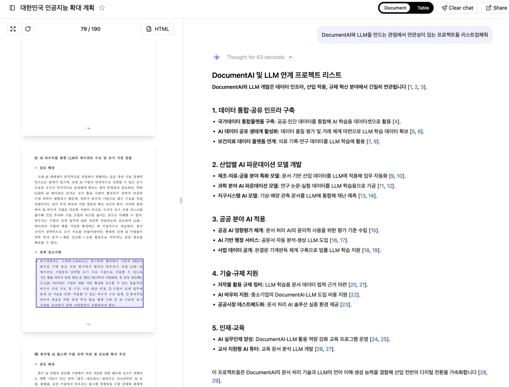
**이미지 캡션:** 이 문서는 대한민국 인공지능 확대 계획의 일부로, DocumentAI와 LLM(거대 언어 모델)을 연계한 프로젝트 리스트를 제시하고 있다. 왼쪽에는 계획의 배경과 정책 권고사항이, 오른쪽에는 DocumentAI와 LLM 연계 프로젝트 리스트가 상세하게 설명되어 있다. 프로젝트 리스트는 데이터 통합·공유 인프라 구축, 산업별 AI 파운데이션 모델 개발, 공공 분야 AI 적용, 기술·규제 지원, 인재·교육 등 다섯 가지 주요 영역으로 나뉘어 있으며, 각 영역별로 구체적인 프로젝트 내용과 관련 연구들이 번호로 표시되어 있다. 전반적으로 인공지능 기술의 발전과 산업 적용을 촉진하기 위한 국가적 차원의 계획과 구체적인 실행 방안을 담고 있다.되어 있다. 전반적으로 인공지능 기술의 발전과 산업 적용을 촉진하기 위한 국가적 차원의 계획과 구체적인 실행 방안을 담고 있다.

### 12월 16일 (화) 10:31 · Sung Kim shared a link.

🔗 <https://www.aikorea.go.kr/web/board/brdDetail.do?menu_cd=000010&num=136&currentPage=1&searchData=&searchText=>

### 12월 17일 (수) 15:10 · 조선일보에서 주최한 교육 콘퍼런스에 서울대 총장님, 카이스트 총장님, 포…

조선일보에서 주최한 교육 콘퍼런스에 서울대 총장님, 카이스트 총장님, 포항공대 총장님과 백준호 대표님과 함께 AI 인재 생태계 구축에 대한 80분 대담에 참여했습니다.

저는 딱 두 가지 말씀드렸는데요.

1. 학부/대학원 1년을 전체를 할애하여 (예: 학부 3학년, 대학원 4년 차) 회사에서 일하게 해달라. 이를 학사 과정으로 인정해 달라. 월급을 많이 주게 해달라: 회사 50%와 학교/정부 재원 마련. 실제 회사에서는 경력 있는 신입을 찾으니 졸업 후 취업에 도움이 되고 진정한 산학 연계를 이룰 수 있다.

2. 청년들에게 지금의 AI 시대가 오히려 좋은 기회이다. 여러분들을 따르는 전문가 20명을 데리고 있다고 생각해 봐라. 무엇이라도 할 수 있다. AI가 여러분들을 따르는 20명, 50명, 100명의 충실한 전문가가 되어 줄 것이다. 하고 싶은 일을 지금 하라!

AI 시대 미래를 선도하는 교육을 함께 만들자는 마음으로 위 학교들과 업스테이지도 많은 협력을 하기로 했습니다.

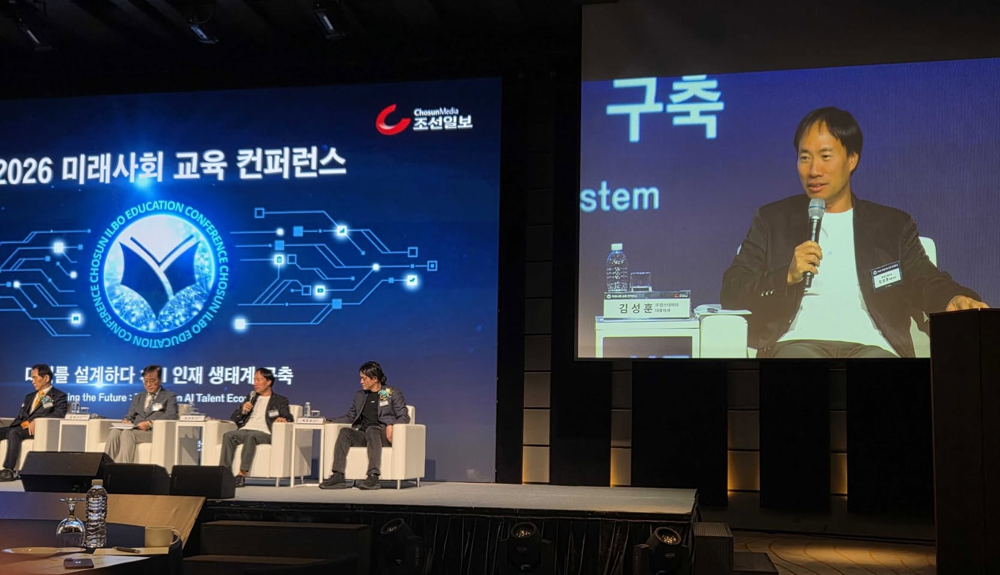
**이미지 캡션:** 이 사진은 "2026 미래사회 교육 컨퍼런스"라는 행사의 한 장면을 담고 있으며, 무대 양쪽에 대형 스크린이 설치되어 있습니다. 왼쪽 스크린에는 "2026 미래사회 교육 컨퍼런스"라는 제목과 함께 Chosun Media 조선일보 로고, 그리고 책 모양의 그래픽과 함께 디지털 회로를 연상시키는 디자인이 보입니다. 또한 "이를 설계하다: 인재 생태계 구축"이라는 문구와 "Building the Future: AI Talent Ecosystem"이라는 영어 문구도 함께 표시되어 있습니다. 무대 위에는 네 명의 남성이 흰색 의자에 앉아 있으며, 이들은 패널 토론에 참여하는 것으로 보입니다. 가장 왼쪽 남성은 검은색 정장에 노란색 넥타이를 착용하고 있으며, 가운데 두 남성은 정장을 입고 있습니다. 가장 오른쪽 남성은 검은색 재킷에 검은색 바지를 입고 있으며, 독특한 디자인의 장식이 달린 재킷을 입고 있습니다. 오른쪽 스크린에는 "구축 system"이라는 문구와 함께 한 남성이 마이크를 잡고 발표하는 모습이 비춰지고 있습니다. 이 남성은 검은색 재킷에 흰색 티셔츠를 입고 있으며, 이름표에는 "김성훈"이라고 적혀 있습니다. 그는 약 40대에서 50대로 보이는 성인 남성이며, 약간 미소를 띠고 있습니다. 전체적으로 행사의 진지하고 전문적인 분위기를 느낄 수 있으며, 미래 사회 교육과 AI 인재 양성에 대한 논의가 이루어지고 있음을 짐작할 수 있습니다. 무대 앞쪽에는 조명 장치와 함께 테이블 위에 물병, 컵 등이 놓여 있습니다.이 흰색 의자에 앉아 있으며, 이들은 패널 토론에 참여하는 것으로 보입니다. 가장 왼쪽 남성은 검은색 정장에 노란색 넥타이를 착용하고 있으며, 가운데 두 남성은 정장을 입고 있습니다. 가장 오른쪽 남성은 검은색 재킷에 검은색 바지를 입고 있으며, 독특한 디자인의 장식이 달린 재킷을 입고 있습니다. 오른쪽 스크린에는 "구축 system"이라는 문구와 함께 한 남성이 마이크를 잡고 발표하는 모습이 비춰지고 있습니다. 이 남성은 검은색 재킷에 흰색 티셔츠를 입고 있으며, 이름표에는 "김성훈"이라고 적혀 있습니다. 그는 약 40대에서 50대로 보이는 성인 남성이며, 약간 미소를 띠고 있습니다. 전체적으로 행사의 진지하고 전문적인 분위기를 느낄 수 있으며, 미래 사회 교육과 AI 인재 양성에 대한 논의가 이루어지고 있음을 짐작할 수 있습니다. 무대 앞쪽에는 조명 장치와 함께 테이블 위에 물병, 컵 등이 놓여 있습니다.
 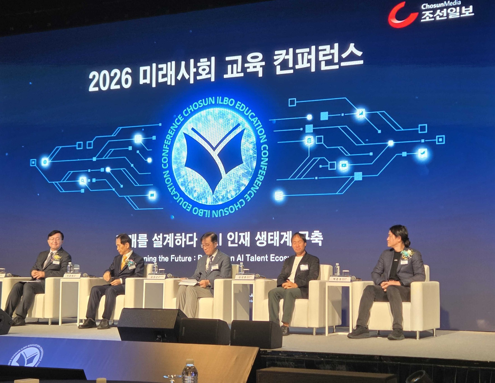
**이미지 캡션:** 이 사진은 "2026 미래사회 교육 컨퍼런스"라는 행사의 한 장면을 담고 있으며, 무대 배경에는 파란색 바탕에 디지털 회로를 형상화한 그래픽과 함께 "2026 미래사회 교육 컨퍼런스"라는 문구가 크게 쓰여 있습니다. 중앙에는 "CHOSUN ILBO EDUCATION CONFERENCE"라는 문구가 원형으로 둘러싸인 책 모양의 로고가 있습니다. 무대 위에는 다섯 명의 성인 남성이 흰색 의자에 앉아 패널 토론에 참여하고 있습니다. 왼쪽부터 첫 번째 남성은 검은색 정장에 넥타이를 매고 있으며, 두 번째 남성은 검은색 정장에 노란색 넥타이를 착용하고 있습니다. 세 번째 남성은 회색 정장에 넥타이를 매고 있으며, 네 번째 남성은 검은색 재킷에 녹색 바지를 입고 있습니다. 다섯 번째 남성은 검은색 재킷에 검은색 바지를 입고 있으며, 두 사람 모두 옷깃에 꽃 모양의 배지를 달고 있습니다. 모두 정면을 응시하거나 좌우를 보며 진지한 표정을 짓고 있으며, 일부는 손을 들거나 책을 보고 있습니다. 무대 앞쪽에는 행사의 주제인 "미래를 설계하다: AI 인재 생태계 구축"이라는 문구가 한국어와 영어로 적혀 있습니다. 전반적으로 진지하고 학술적인 분위기이며, 미래 교육과 인재 양성에 대한 논의가 이루어지고 있음을 알 수 있습니다.색 정장에 노란색 넥타이를 착용하고 있습니다. 세 번째 남성은 회색 정장에 넥타이를 매고 있으며, 네 번째 남성은 검은색 재킷에 녹색 바지를 입고 있습니다. 다섯 번째 남성은 검은색 재킷에 검은색 바지를 입고 있으며, 두 사람 모두 옷깃에 꽃 모양의 배지를 달고 있습니다. 모두 정면을 응시하거나 좌우를 보며 진지한 표정을 짓고 있으며, 일부는 손을 들거나 책을 보고 있습니다. 무대 앞쪽에는 행사의 주제인 "미래를 설계하다: AI 인재 생태계 구축"이라는 문구가 한국어와 영어로 적혀 있습니다. 전반적으로 진지하고 학술적인 분위기이며, 미래 교육과 인재 양성에 대한 논의가 이루어지고 있음을 알 수 있습니다.

### 12월 17일 (수) 16:37 · 조금 좋은 것이 아니라 #글로벌1등 인 Upstage Document P…

조금 좋은 것이 아니라 #글로벌1등 인 Upstage Document Parse 제품에서 더 강화된 Document Parse Enhanced mode를 출시합니다. 

정말 복잡한 표 구조, 여러 페이지에 걸친 테이블, 차트·이미지, 체크박스까지. 기존 방식으로는 처리하기 어려웠던 문서를 모두 맡겨 주세요.

1월 27일까지 Standard 가격($0.01/page)으로 Enhanced mode를 직접 테스트해볼 수 있습니다.

👉 내 문서로 직접 테스트해보기 (Playground): https://go.upstage.ai/4s6xVII
👉 자세한 내용은 블로그를 통해 확인해보세요:  https://go.upstage.ai/4qbzTph

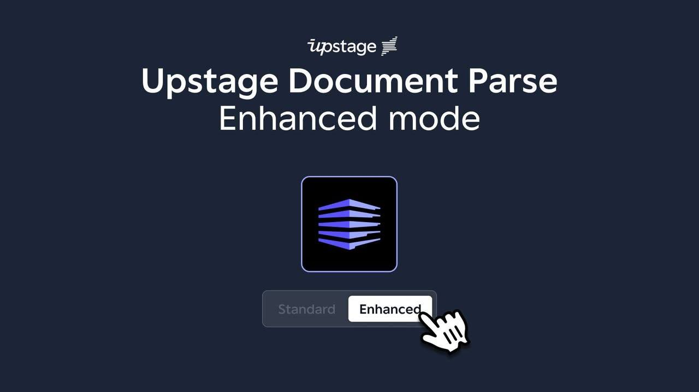
**이미지 캡션:** 어두운 남색 배경에 흰색 글씨로 "Upstage Document Parse Enhanced mode"라는 문구가 중앙 상단에 표시되어 있으며, 그 아래에는 파란색 계열의 층층이 쌓인 듯한 추상적인 아이콘이 있다. 아이콘 아래에는 "Standard"와 "Enhanced"라는 두 개의 버튼이 나란히 있으며, "Enhanced" 버튼이 선택되어 흰색으로 강조되어 있고, 오른쪽 하단에는 손가락 모양의 커서가 "Enhanced" 버튼을 클릭하려는 듯한 모습으로 그려져 있다. 전체적으로 깔끔하고 현대적인 디자인으로, 소프트웨어 기능이나 모드를 소개하는 화면으로 보인다.프트웨어 기능이나 모드를 소개하는 화면으로 보인다.
 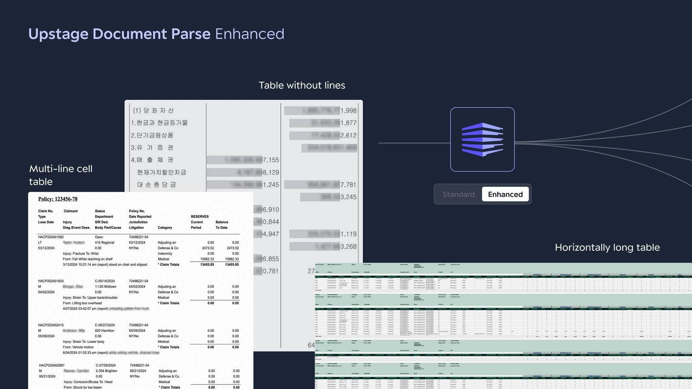
**이미지 캡션:** 이 이미지는 "Upstage Document Parse Enhanced"라는 제목의 프레젠테이션 또는 보고서의 일부로 보이며, 문서 파싱 및 데이터 추출 기술을 시연하는 내용을 담고 있습니다. 이미지의 왼쪽 상단에는 "Upstage Document Parse Enhanced"라는 큰 제목이 보라색 배경 위에 흰색 글씨로 쓰여 있습니다. 그 아래에는 "Multi-line cell table"이라는 텍스트가 있으며, 이는 여러 줄로 구성된 셀을 가진 표를 나타냅니다. 이 표는 "Policy: 123456-78"이라는 제목 아래에 있으며, 청구 번호, 피보험자, 상태, 부서, 보험 증권 번호, 보고 날짜, 관할권, 범주, 현재 기간 및 총액 등의 열을 포함하는 상세한 데이터를 보여줍니다. 각 행은 특정 사고 또는 청구에 대한 정보를 담고 있으며, 부상 유형, 발생 날짜, 사고 설명 등이 기재되어 있습니다. 이미지의 중앙에는 "Table without lines"라는 제목과 함께 선이 없는 표 형식의 데이터가 표시됩니다. 이 표는 한국어로 된 항목들, 예를 들어 "(1) 당좌자산", "1. 현금과 현금등가물", "2. 단기금융상품", "3. 유가증권", "4. 매출채권", "현재가치할인차금", "대손충당금" 등을 포함하고 있으며, 각 항목 옆에는 숫자 값이 나열되어 있습니다. 이 데이터는 재무 또는 회계 관련 정보로 추정됩니다. 오른쪽에는 "Standard"와 "Enhanced"라는 두 개의 버튼이 있으며, "Enhanced" 버튼이 선택되어 강조 표시되어 있습니다. 그 옆에는 추상적인 보라색 건물 모양의 아이콘이 있습니다. 이 부분은 문서 파싱 기술의 표준 모드와 향상된 모드를 비교하거나, 향상된 모드의 기능을 강조하는 것으로 보입니다. 또한, "Horizontally long table"이라는 텍스트와 함께 가로로 긴 표의 일부가 하단에 표시되어 있습니다. 이 표 역시 많은 열과 행으로 구성되어 있으며, 상세한 데이터를 담고 있는 것으로 보입니다. 전반적으로 이 이미지는 문서에서 복잡한 데이터를 추출하고 구조화하는 Upstage의 기술을 보여주며, 특히 여러 줄로 구성된 셀과 선이 없는 표 형식의 데이터를 효과적으로 처리하는 능력을 강조하고 있습니다. 이미지의 분위기는 전문적이고 기술 중심적이며, 데이터 분석 및 처리 솔루션에 대한 정보를 전달하는 데 중점을 두고 있습니다. 이미지에는 특정 인물은 보이지 않으며, 장소는 디지털 인터페이스 또는 프레젠테이션 환경으로 추정됩니다.라는 제목 아래에 있으며, 청구 번호, 피보험자, 상태, 부서, 보험 증권 번호, 보고 날짜, 관할권, 범주, 현재 기간 및 총액 등의 열을 포함하는 상세한 데이터를 보여줍니다. 각 행은 특정 사고 또는 청구에 대한 정보를 담고 있으며, 부상 유형, 발생 날짜, 사고 설명 등이 기재되어 있습니다. 이미지의 중앙에는 "Table without lines"라는 제목과 함께 선이 없는 표 형식의 데이터가 표시됩니다. 이 표는 한국어로 된 항목들, 예를 들어 "(1) 당좌자산", "1. 현금과 현금등가물", "2. 단기금융상품", "3. 유가증권", "4. 매출채권", "현재가치할인차금", "대손충당금" 등을 포함하고 있으며, 각 항목 옆에는 숫자 값이 나열되어 있습니다. 이 데이터는 재무 또는 회계 관련 정보로 추정됩니다. 오른쪽에는 "Standard"와 "Enhanced"라는 두 개의 버튼이 있으며, "Enhanced" 버튼이 선택되어 강조 표시되어 있습니다. 그 옆에는 추상적인 보라색 건물 모양의 아이콘이 있습니다. 이 부분은 문서 파싱 기술의 표준 모드와 향상된 모드를 비교하거나, 향상된 모드의 기능을 강조하는 것으로 보입니다. 또한, "Horizontally long table"이라는 텍스트와 함께 가로로 긴 표의 일부가 하단에 표시되어 있습니다. 이 표 역시 많은 열과 행으로 구성되어 있으며, 상세한 데이터를 담고 있는 것으로 보입니다. 전반적으로 이 이미지는 문서에서 복잡한 데이터를 추출하고 구조화하는 Upstage의 기술을 보여주며, 특히 여러 줄로 구성된 셀과 선이 없는 표 형식의 데이터를 효과적으로 처리하는 능력을 강조하고 있습니다. 이미지의 분위기는 전문적이고 기술 중심적이며, 데이터 분석 및 처리 솔루션에 대한 정보를 전달하는 데 중점을 두고 있습니다. 이미지에는 특정 인물은 보이지 않으며, 장소는 디지털 인터페이스 또는 프레젠테이션 환경으로 추정됩니다.
 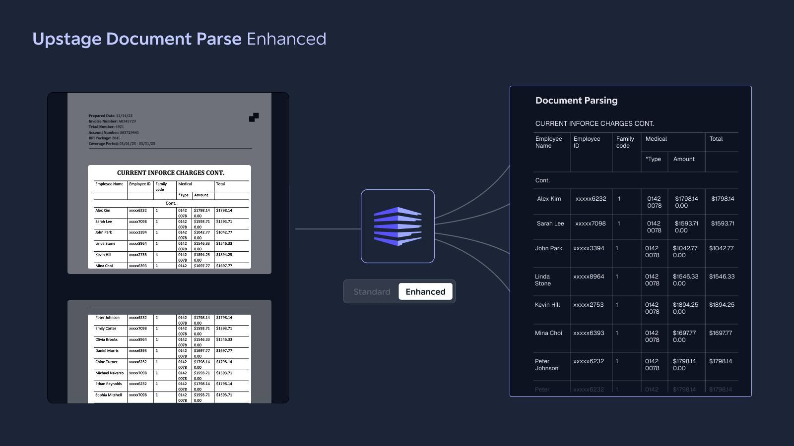
**이미지 캡션:** 이 이미지는 "Upstage Document Parse Enhanced"라는 제목의 디지털 인터페이스를 보여주며, 문서 파싱 기능을 시각적으로 설명하고 있습니다. 왼쪽에는 두 개의 문서 이미지가 표시되어 있으며, 위쪽 문서는 "Prepared Date: 11/14/23", "Invoice Number: A8345729", "Trial Number: 4921", "Account Number: 5803729441", "Bill Package: 2045", "Coverage Period: 01/01/25 - 01/31/25"와 같은 헤더 정보와 함께 "CURRENT INFORCE CHARGES CONT."라는 제목의 표를 포함하고 있습니다. 이 표는 "Employee Name", "Employee ID", "Family code", "Medical *Type", "Amount", "Total" 열로 구성되어 있으며, Alex Kim, Sarah Lee, John Park, Linda Stone, Kevin Hill, Mina Choi 등의 직원 이름과 관련 정보가 나열되어 있습니다. 아래쪽 문서도 유사한 형식의 표를 보여주며, Peter Johnson, Emily Carter, Olivia Brooks, Daniel Morris, Chloe Turner, Michael Navarro, Ethan Reynolds, Sophia Mitchell 등의 직원 이름이 포함되어 있습니다. 중앙에는 파란색과 보라색 계열의 겹쳐진 사각형 모양의 아이콘이 있으며, 이 아이콘에서 여러 개의 선이 오른쪽으로 뻗어 나가고 있습니다. 이 아이콘 아래에는 "Standard"와 "Enhanced"라는 두 개의 버튼이 있으며, "Enhanced" 버튼이 선택되어 강조 표시되어 있습니다. 오른쪽에는 "Document Parsing"이라는 제목과 함께 "CURRENT INFORCE CHARGES CONT."라는 표가 다시 표시되어 있으며, 이 표는 왼쪽 문서의 표와 유사한 내용을 담고 있습니다. 이 표에는 Alex Kim, Sarah Lee, John Park, Linda Stone, Kevin Hill, Mina Choi, Peter Johnson 등의 직원 이름과 관련 정보가 상세하게 나열되어 있습니다. 전체적으로 이 이미지는 문서에서 정보를 추출하고 분석하는 "Upstage Document Parse Enhanced"라는 기술의 작동 방식을 보여주는 것으로 보이며, "Enhanced" 모드가 문서 파싱에 더 나은 결과를 제공함을 시사합니다. 이미지의 분위기는 기술적이고 정보 중심적이며, 깔끔하고 현대적인 디자인을 특징으로 합니다.31/25"와 같은 헤더 정보와 함께 "CURRENT INFORCE CHARGES CONT."라는 제목의 표를 포함하고 있습니다. 이 표는 "Employee Name", "Employee ID", "Family code", "Medical *Type", "Amount", "Total" 열로 구성되어 있으며, Alex Kim, Sarah Lee, John Park, Linda Stone, Kevin Hill, Mina Choi 등의 직원 이름과 관련 정보가 나열되어 있습니다. 아래쪽 문서도 유사한 형식의 표를 보여주며, Peter Johnson, Emily Carter, Olivia Brooks, Daniel Morris, Chloe Turner, Michael Navarro, Ethan Reynolds, Sophia Mitchell 등의 직원 이름이 포함되어 있습니다. 중앙에는 파란색과 보라색 계열의 겹쳐진 사각형 모양의 아이콘이 있으며, 이 아이콘에서 여러 개의 선이 오른쪽으로 뻗어 나가고 있습니다. 이 아이콘 아래에는 "Standard"와 "Enhanced"라는 두 개의 버튼이 있으며, "Enhanced" 버튼이 선택되어 강조 표시되어 있습니다. 오른쪽에는 "Document Parsing"이라는 제목과 함께 "CURRENT INFORCE CHARGES CONT."라는 표가 다시 표시되어 있으며, 이 표는 왼쪽 문서의 표와 유사한 내용을 담고 있습니다. 이 표에는 Alex Kim, Sarah Lee, John Park, Linda Stone, Kevin Hill, Mina Choi, Peter Johnson 등의 직원 이름과 관련 정보가 상세하게 나열되어 있습니다. 전체적으로 이 이미지는 문서에서 정보를 추출하고 분석하는 "Upstage Document Parse Enhanced"라는 기술의 작동 방식을 보여주는 것으로 보이며, "Enhanced" 모드가 문서 파싱에 더 나은 결과를 제공함을 시사합니다. 이미지의 분위기는 기술적이고 정보 중심적이며, 깔끔하고 현대적인 디자인을 특징으로 합니다.
 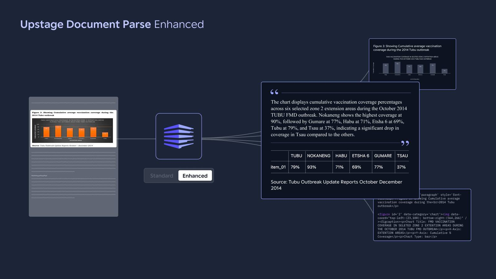
**이미지 캡션:** 이 이미지는 "Upstage Document Parse Enhanced"라는 제목의 디지털 인터페이스를 보여줍니다. 왼쪽 상단에는 "Upstage Document Parse Enhanced"라는 텍스트가 있고, 그 아래에는 문서 파싱을 나타내는 추상적인 보라색 아이콘이 있습니다. 아이콘 옆에는 "Standard"와 "Enhanced"라는 두 개의 버튼이 있으며, "Enhanced" 버튼이 강조 표시되어 있습니다. 이미지의 오른쪽에는 두 개의 정보 창이 있습니다. 위쪽 창에는 "Figure 3: Showing Cumulative average vaccination coverage during the 2014 Tubu outbreak"라는 제목의 막대 그래프가 포함되어 있으며, 이 그래프는 2014년 투부 구제역 발생 당시 6개 지역의 누적 평균 백신 접종률을 보여줍니다. 그래프 아래에는 "Source: Tubu Outbreak Update Reports October December 2014"라는 출처 정보가 있습니다. 아래쪽 창에는 인용 부호와 함께 그래프에 대한 설명 텍스트가 있으며, 이 텍스트는 6개 지역의 백신 접종률을 비교하고 투부 지역의 접종률이 다른 지역에 비해 현저히 낮다는 점을 강조합니다. 이 창에는 또한 지역별 백신 접종률을 보여주는 표가 포함되어 있습니다. 이미지의 배경은 어두운 색조이며, 정보 창과 아이콘은 밝은 색상으로 강조되어 있습니다. 전체적으로 이 이미지는 문서 분석 및 정보 시각화 도구의 기능을 보여주는 것으로 보입니다.Cumulative average vaccination coverage during the 2014 Tubu outbreak"라는 제목의 막대 그래프가 포함되어 있으며, 이 그래프는 2014년 투부 구제역 발생 당시 6개 지역의 누적 평균 백신 접종률을 보여줍니다. 그래프 아래에는 "Source: Tubu Outbreak Update Reports October December 2014"라는 출처 정보가 있습니다. 아래쪽 창에는 인용 부호와 함께 그래프에 대한 설명 텍스트가 있으며, 이 텍스트는 6개 지역의 백신 접종률을 비교하고 투부 지역의 접종률이 다른 지역에 비해 현저히 낮다는 점을 강조합니다. 이 창에는 또한 지역별 백신 접종률을 보여주는 표가 포함되어 있습니다. 이미지의 배경은 어두운 색조이며, 정보 창과 아이콘은 밝은 색상으로 강조되어 있습니다. 전체적으로 이 이미지는 문서 분석 및 정보 시각화 도구의 기능을 보여주는 것으로 보입니다.

### 12월 18일 (목) 09:27 · Upstage 공동 창업자로 교육 부문 대표를 맡고 있는 Henny So…

Upstage 공동 창업자로 교육 부문 대표를 맡고 있는 Henny Son 세바시 이야기를 들어보세요.

학부는 문과였지만, “나를 분석하는 힘”을 통해 AI 생태계에 뛰어든 그녀는 “전공이 아니라 문제를 정의하는 것이 혁신을 만든다”는 메시지를 전합니다. 전공과 상관없이 자기 강점을 찾아 AI에 접목하시는 분들이 꼭 필요한 시점입니다.

개인적으로 저도 너무 재미있게 들었습니다. 선시청, 후고민!

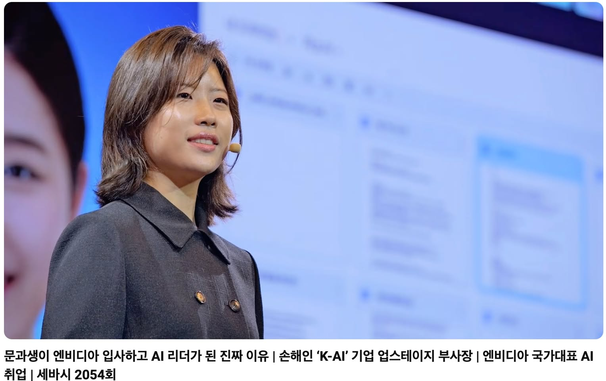
**이미지 캡션:** 이 사진은 한 명의 젊은 성인 여성 발표자가 무대에서 연설하는 모습을 담고 있습니다. 여성은 20대 후반에서 30대 초반으로 보이며, 짧은 갈색 머리에 자연스러운 화장을 하고 있습니다. 그녀는 검은색 재킷을 입고 있으며, 재킷에는 두 개의 금색 단추가 달려 있습니다. 발표자는 마이크를 착용하고 있으며, 입가에는 미소를 띠고 밝고 자신감 있는 표정으로 청중을 바라보고 있습니다. 배경에는 파란색 조명과 함께 흐릿하게 보이는 컴퓨터 화면 또는 스크린이 있으며, 화면에는 텍스트와 그래픽 요소가 포함되어 있습니다. 사진 하단에는 "문과생이 엔비디아 입사하고 AI 리더가 된 진짜 이유 | 손해인 'K-AI' 기업 업스테이지 부사장 | 엔비디아 국가대표 AI 취업 | 세바시 2054회"라는 한국어 텍스트가 보입니다. 전체적으로 전문적이고 교육적인 분위기를 풍기는 행사 장면입니다.진 하단에는 "문과생이 엔비디아 입사하고 AI 리더가 된 진짜 이유 | 손해인 'K-AI' 기업 업스테이지 부사장 | 엔비디아 국가대표 AI 취업 | 세바시 2054회"라는 한국어 텍스트가 보입니다. 전체적으로 전문적이고 교육적인 분위기를 풍기는 행사 장면입니다.

### 12월 18일 (목) 17:21 · #짜장면테스트 #누가잘하나 요즈음 많이 공유되는 짜장면 테스트인데요. 어…

#짜장면테스트 #누가잘하나 요즈음 많이 공유되는 짜장면 테스트인데요. 어떤 모델의 결과가 가장 한국 어머니의 마음을 잘 이해하고 그 마음을 잘 표현했나요? 아래 4가지 결과 각각의 *이모티콘*을 잘 보시고 하나를 선택해보셔요. (24시간 후에 모델명 공개합니다.)
---
어려서부터 우리 집은 가난했었고남들 다하는 외식 몇 번 한 적이 없었고일터에 나가신 어머니 집에 없으면언제나 혼자서 끓여 먹었던 라면그러다 라면이 너무 지겨워서맛있는 것 좀 먹자고 대들었었어그러자 어머님이 마지못해 꺼내신숨겨두신 비상금으로 시켜주신자장면 하나에 너무나 행복했었어하지만 어머님은 왠지 드시질 않았어어머님은 자장면이 싫다고 하셨어어머님은 자장면이 싫다고 하셨어야이-야-야그렇게 살아가고 그렇게 후회하고 눈물도 흘리고야-하이-야-야그렇게 살아가고 너무나 아프고 하지만 다시 웃고중학교 1학년 때 도시락 까먹을 때다 같이 함께 모여 도시락 뚜껑을 열었는데부자집 아들녀석이 나에게 화를 냈어반찬이 그게 뭐냐며 나에게 뭐라고 했어창피했어 그만 눈물이 났어그러자 그 녀석은 내가 운다며 놀려댔어참을 수 없어서 얼굴로 날아간 내 주먹에일터에 계시던 어머님은 또다시 학교에불려오셨어 아니 또 끌려오셨어다시는 이런 일이 없을 거라며 비셨어그 녀석 어머니께 고개를 숙여 비셨어(우리 어머니가 비셨어)야이-야-야그렇게 살아가고 그렇게 후회하고 눈물도 흘리고야-하이-야-야그렇게 살아가고 너무나 아프고 하지만 다시 웃고아버님없이 마침내 우리는 해냈어마침내 조그만 식당을 하나 갖게 됬어그리 크진 않았지만 행복했어주름진 어머니 눈가엔 눈물이 고였어어머니와 내 이름의 앞 글자를 따서식당 이름을 짓고 고사를 지내고밤이 깊어가도 아무도 떠날 줄 모르고사람들의 축하는 계속되었고자정이 다되서야 돌아갔어피곤하셨는지 어머님은 어느새 깊이잠이 들어버리시고는 깨지 않으셨어다시는난 당신을 사랑했어요한 번도 말을 못 했지만사랑해요 이젠 편히 쉬어요내가 없는 세상에서 영원토록야이-야-야그렇게 살아가고 그렇게 후회하고 눈물도 흘리고야-하이-야-야그렇게 살아가고 너무나 아프고 하지만 다시 웃고야이-야-야그렇게 살아가고 그렇게 후회하고 눈물도 흘리고야-하이-야-야그렇게 살아가고 너무나 아프고
=========
위 노래 가사에서 어머니가 짜장면이 싫다고 한 이유는?

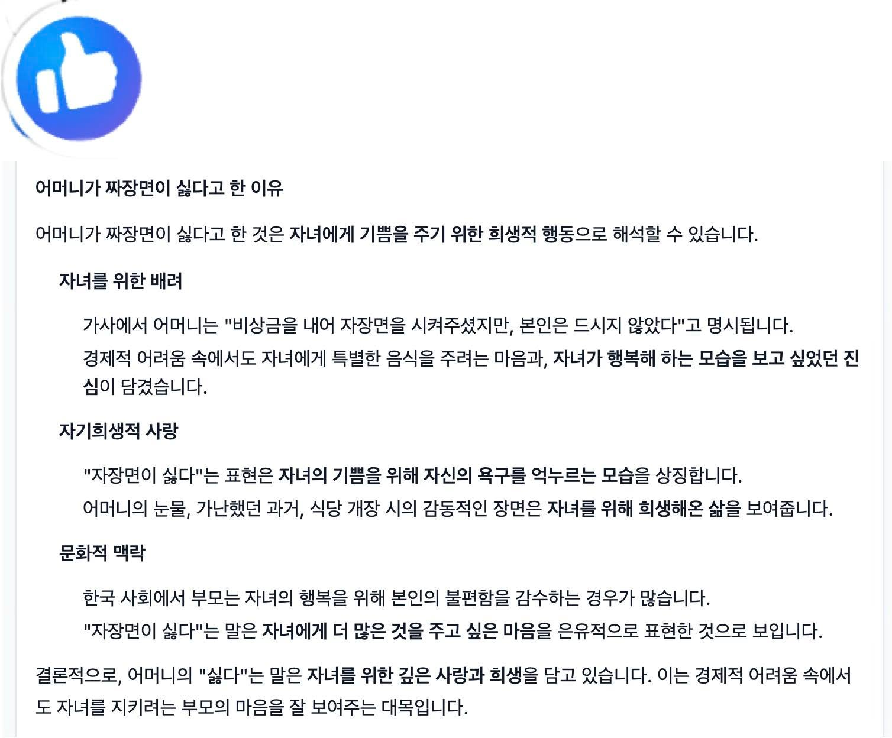
**이미지 캡션:** 이 이미지는 한국어로 작성된 텍스트 문서로, "어머니가 짜장면이 싫다고 한 이유"라는 제목 아래 어머니의 희생적인 사랑과 관련된 내용을 설명하고 있습니다. 문서의 상단에는 파란색 배경에 흰색 엄지척 이모티콘이 있는 로고가 있습니다. 본문은 크게 세 부분으로 나뉘어 있으며, 첫 번째 부분은 "자녀를 위한 배려"라는 소제목으로 어머니가 경제적 어려움 속에서도 자녀에게 짜장면을 사주었지만 자신은 먹지 않았다는 일화를 소개합니다. 두 번째 부분은 "자기희생적 사랑"이라는 소제목으로, 어머니가 짜장면을 싫다고 표현한 것이 자녀의 기쁨을 위해 자신의 욕구를 억누르는 자기희생적인 행동을 상징한다고 설명하며, 어머니의 눈물이나 과거의 어려움 등을 언급합니다. 마지막 부분은 "문화적 맥락"이라는 소제목으로, 한국 사회에서 부모가 자녀의 행복을 위해 자신을 희생하는 문화적 배경을 설명하며, "자장면이 싫다"는 표현이 자녀에게 더 많은 것을 주고 싶은 마음을 은유적으로 나타낸 것이라고 해석합니다. 전반적으로 이 문서는 어머니의 헌신적인 사랑과 희생을 강조하며, 경제적 어려움 속에서도 자녀를 지키려는 부모의 마음을 잘 보여주는 내용입니다.것이 자녀의 기쁨을 위해 자신의 욕구를 억누르는 자기희생적인 행동을 상징한다고 설명하며, 어머니의 눈물이나 과거의 어려움 등을 언급합니다. 마지막 부분은 "문화적 맥락"이라는 소제목으로, 한국 사회에서 부모가 자녀의 행복을 위해 자신을 희생하는 문화적 배경을 설명하며, "자장면이 싫다"는 표현이 자녀에게 더 많은 것을 주고 싶은 마음을 은유적으로 나타낸 것이라고 해석합니다. 전반적으로 이 문서는 어머니의 헌신적인 사랑과 희생을 강조하며, 경제적 어려움 속에서도 자녀를 지키려는 부모의 마음을 잘 보여주는 내용입니다.
 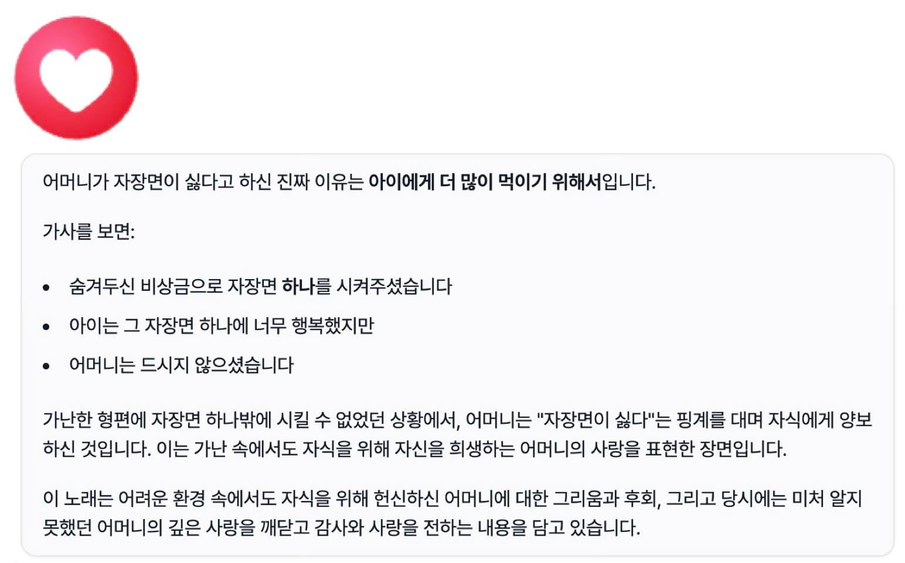
**이미지 캡션:** 화면 상단에는 빨간색 하트 모양의 아이콘이 있고, 그 아래에는 어머니가 자장면을 싫어한다고 말한 진짜 이유가 아이에게 더 많이 먹이기 위해서라는 내용의 글이 있습니다. 이어서 가사를 보면, 어머니가 숨겨둔 비상금으로 자장면을 시켜주셨고 아이는 행복했지만 어머니는 드시지 않았다는 내용이 나옵니다. 가난한 형편에 자장면 하나밖에 시킬 수 없었던 상황에서 어머니는 자장면이 싫다는 핑계를 대며 자식에게 양보하셨고, 이는 가난 속에서도 자식을 위해 자신을 희생하는 어머니의 사랑을 표현한 장면이라고 설명합니다. 마지막으로 이 노래는 어려운 환경 속에서도 자식을 위해 헌신하신 어머니에 대한 그리움과 후회, 그리고 당시에는 미처 알지 못했던 어머니의 깊은 사랑을 깨닫고 감사와 사랑을 전하는 내용을 담고 있다고 마무리합니다.로 이 노래는 어려운 환경 속에서도 자식을 위해 헌신하신 어머니에 대한 그리움과 후회, 그리고 당시에는 미처 알지 못했던 어머니의 깊은 사랑을 깨닫고 감사와 사랑을 전하는 내용을 담고 있다고 마무리합니다.
 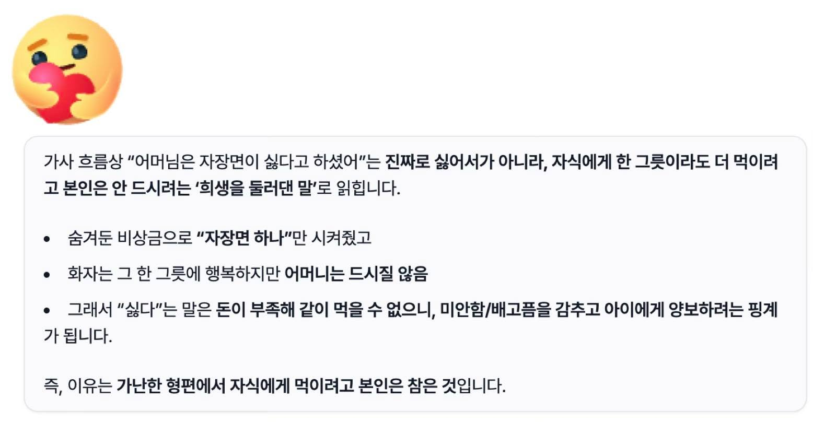
**이미지 캡션:** 이미지 상단에는 붉은색 하트를 안고 있는 노란색 이모티콘이 있습니다. 이모티콘은 눈을 감고 부드러운 미소를 짓고 있으며, 사랑과 애정을 표현하는 듯합니다. 그 아래에는 흰색 배경에 한국어로 된 텍스트가 있습니다. 텍스트는 어머니의 희생적인 사랑에 대한 이야기로, 어머니가 자장면을 싫어한다고 말하는 것은 사실은 자녀에게 한 그릇이라도 더 먹이기 위한 핑계이며, 어머니는 숨겨둔 비상금으로 자녀에게 자장면을 사주고 자신은 먹지 않는다는 내용입니다. 또한, 어머니가 "싫다"고 말하는 것은 돈이 부족하여 함께 먹을 수 없다는 미안함과 배고픔을 감추고 자녀에게 양보하려는 핑계라고 설명합니다. 전반적으로 따뜻하고 감동적인 분위기를 자아냅니다. 없다는 미안함과 배고픔을 감추고 자녀에게 양보하려는 핑계라고 설명합니다. 전반적으로 따뜻하고 감동적인 분위기를 자아냅니다.
 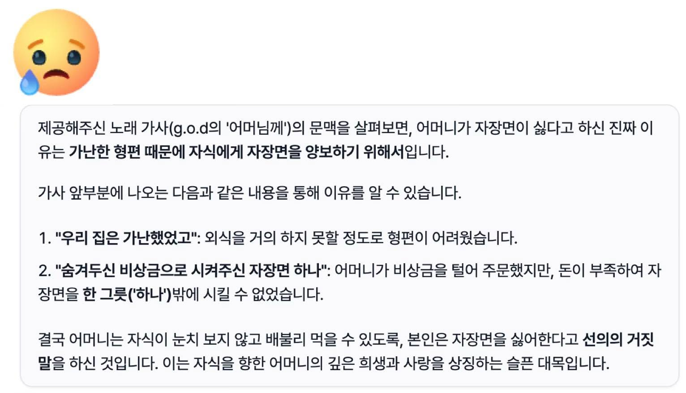
**이미지 캡션:** 이 이미지는 슬픈 감정을 나타내는 이모티콘과 함께, g.o.d의 노래 '어머님께' 가사에 대한 분석 내용을 담고 있습니다. 분석 내용은 어머니가 자장면을 싫다고 하신 진짜 이유가 자식에게 자장면을 양보하기 위한 희생 때문이라는 것을 설명합니다. 가사 내용을 인용하여 당시 집안 형편이 매우 어려워 외식을 거의 하지 못했으며, 어머니가 비상금을 털어 자장면을 주문했지만 돈이 부족해 한 그릇밖에 시키지 못했다는 점을 강조합니다. 결국 어머니는 자식이 눈치 보지 않고 배불리 먹을 수 있도록 자신은 자장면을 싫어한다고 거짓말을 하셨다는 내용으로, 이는 자식을 향한 어머니의 깊은 희생과 사랑을 보여주는 슬픈 대목이라고 설명하고 있습니다. 거짓말을 하셨다는 내용으로, 이는 자식을 향한 어머니의 깊은 희생과 사랑을 보여주는 슬픈 대목이라고 설명하고 있습니다.

### 12월 22일 (월) 11:43 · 대한민국 AI의 미래, Upstage 함께합니다!

대한민국 AI의 미래, Upstage 함께합니다!

대한민국 과학기술정보통신부가 주최하고 정보통신산업진흥원 (NIPA)가 주관하는‘독자 AI 파운데이션 모델 프로젝트’ 1차 발표회에 여러분 모두를 초대 합니다. 🚀 5개 정예팀 중 하나로서 저희 업스테이지 컨소시엄이 공들여 만든 Solar-Open-100B 모델과 생생한 시연을 직접 확인하실 수 있습니다.

* 일시: 2025년 12월 30일(화) 14:30~16:30
* 장소: 코엑스 3F 오디토리움
* 내용: 업스테이지 컨소시엄 AI 모델 및 시연 (체험부스 운영 10:00~17:00)

글로벌 시장을 향한 업스테이지의 담대한 도전을 현장에서 함께 응원해 주세요! 

이미지 QR로 선등록, 후고민!

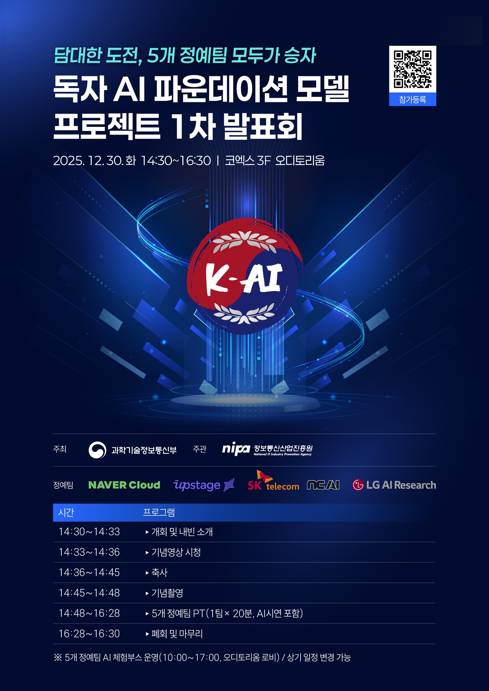
**이미지 캡션:** 이 포스터는 "독자 AI 파운데이션 모델 프로젝트 1차 발표회"를 알리는 행사 안내문으로, 담대한 도전 끝에 5개의 정예팀 모두가 승자가 되었음을 강조하고 있다. 행사는 2025년 12월 30일 화요일 오후 2시 30분부터 4시 30분까지 코엑스 3층 오디토리움에서 개최된다. 포스터 중앙에는 태극 문양을 형상화한 원형 로고 안에 "K-AI"라는 글자가 흰색으로 쓰여 있으며, 그 주변으로 월계관 모양의 장식이 둘러져 있다. 배경은 푸른색 계열의 추상적인 디자인으로, 빛나는 선들이 미래지향적인 분위기를 연출한다. 포스터 상단에는 "담대한 도전, 5개 정예팀 모두가 승자"라는 문구가, 그 아래에는 행사 제목인 "독자 AI 파운데이션 모델 프로젝트 1차 발표회"가 크고 굵은 글씨로 쓰여 있다. 우측 상단에는 QR 코드가 있고, 그 아래에는 "참가등록"이라는 파란색 버튼이 있다. 하단에는 행사를 주최하는 과학기술정보통신부와 주관하는 정보통신산업진흥원(NIPA)의 로고 및 명칭이 표기되어 있으며, 정예팀으로는 NAVER Cloud, Upstage, SK telecom, NC AI, LG AI Research가 참여함을 알리고 있다. 행사 프로그램은 시간대별로 상세하게 안내되어 있으며, 개회 및 내빈 소개, 기념 영상 시청, 축사, 기념 촬영, 5개 정예팀의 발표(각 20분, AI 시연 포함), 폐회 및 마무리 순으로 진행된다. 또한, 행사 당일 오디토리움 로비에서 오전 10시부터 오후 5시까지 5개 정예팀의 AI 체험 부스가 운영될 예정이며, 일정은 변경될 수 있다는 안내 문구가 포함되어 있다. 전체적으로 첨단 기술과 혁신을 상징하는 디자인과 명확한 정보 전달을 통해 행사의 중요성과 기대감을 높이고 있다. 포스터 상단에는 "담대한 도전, 5개 정예팀 모두가 승자"라는 문구가, 그 아래에는 행사 제목인 "독자 AI 파운데이션 모델 프로젝트 1차 발표회"가 크고 굵은 글씨로 쓰여 있다. 우측 상단에는 QR 코드가 있고, 그 아래에는 "참가등록"이라는 파란색 버튼이 있다. 하단에는 행사를 주최하는 과학기술정보통신부와 주관하는 정보통신산업진흥원(NIPA)의 로고 및 명칭이 표기되어 있으며, 정예팀으로는 NAVER Cloud, Upstage, SK telecom, NC AI, LG AI Research가 참여함을 알리고 있다. 행사 프로그램은 시간대별로 상세하게 안내되어 있으며, 개회 및 내빈 소개, 기념 영상 시청, 축사, 기념 촬영, 5개 정예팀의 발표(각 20분, AI 시연 포함), 폐회 및 마무리 순으로 진행된다. 또한, 행사 당일 오디토리움 로비에서 오전 10시부터 오후 5시까지 5개 정예팀의 AI 체험 부스가 운영될 예정이며, 일정은 변경될 수 있다는 안내 문구가 포함되어 있다. 전체적으로 첨단 기술과 혁신을 상징하는 디자인과 명확한 정보 전달을 통해 행사의 중요성과 기대감을 높이고 있다.

### 12월 23일 (화) 21:35 · 왜 우리는 파운데이션 모델에 집중해야 하는지? 아직 늦지 않았는지? 왜 …

왜 우리는 파운데이션 모델에 집중해야 하는지? 아직 늦지 않았는지? 왜  Upstage 같은 스타트업에 더 많은 지원을 해야 하는지? 왜 글로벌에 집중해야 하는지?

그리고 궁극적으로 어떻게 해야 #AI3강 이 될 수 있는지에 대한 제 생각을 정리해 발표했습니다.

https://youtu.be/as7UZfnLAwE?si=KCdFpDBJGLiiDW0-&t=1103

멋진 자리를 만들어 주신 KBS ‘AI토피아’에 큰 감사드립니다!

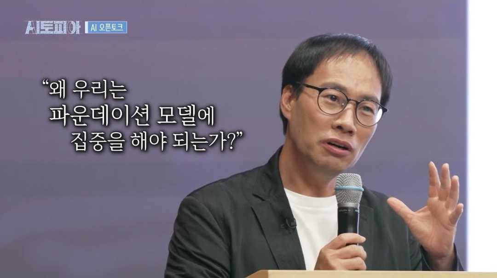
**이미지 캡션:** 이 사진은 중년의 동양인 남성이 마이크를 들고 강연하는 모습을 담고 있습니다. 남성은 검은색 안경을 착용하고 있으며, 검은색 재킷 안에 흰색 티셔츠를 입고 있습니다. 그의 표정은 진지하며, 오른손을 들어 무언가를 설명하는 듯한 제스처를 취하고 있습니다. 배경에는 보라색과 흰색의 추상적인 디자인이 있으며, 왼쪽 상단에는 "시토피아 AI 오픈토크"라는 로고와 함께 "왜 우리는 파운데이션 모델에 집중을 해야 되는가?"라는 질문이 한국어로 쓰여 있습니다. 전체적으로 지적인 토론이나 강연의 한 장면으로 보이며, AI 기술에 대한 논의가 이루어지고 있음을 짐작할 수 있습니다.기술에 대한 논의가 이루어지고 있음을 짐작할 수 있습니다.
 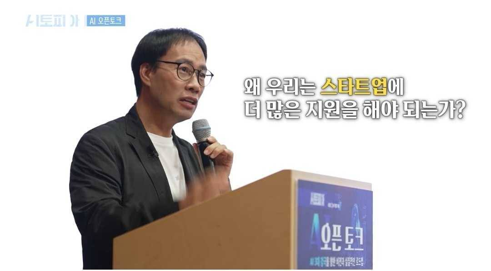
**이미지 캡션:** 한 명의 성인 남성이 안경을 쓰고 검은색 재킷과 흰색 티셔츠를 입고 마이크를 잡고 연설하고 있으며, 그의 뒤에는 "왜 우리는 스타트업에 더 많은 지원을 해야 되는가?"라는 질문이 적힌 흰색 배경이 있고, 그의 앞에는 "오픈토크"라고 적힌 파란색 로고가 있는 연단이 보인다.
 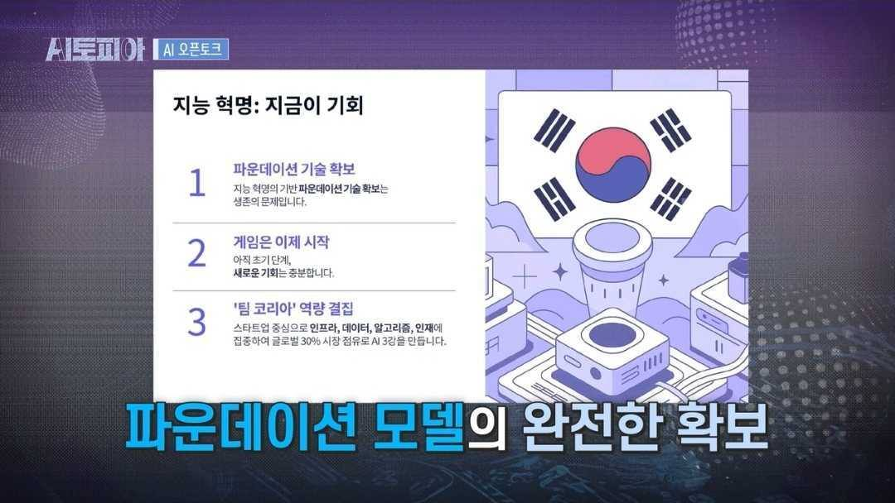
**이미지 캡션:** 이 이미지는 한국의 AI 기술 발전 현황과 미래 전략을 다루는 방송 화면의 일부로 보입니다. 화면 왼쪽 상단에는 "시토피아 AI 오픈토크"라는 프로그램 제목이 보이고, 그 아래에는 "지능 혁명: 지금이 기회"라는 소제목과 함께 세 가지 주요 내용이 번호로 구분되어 제시됩니다. 첫 번째 항목은 "파운데이션 기술 확보"로, 지능 혁명의 기반이 되는 파운데이션 기술 확보가 생존의 문제임을 강조합니다. 두 번째 항목은 "게임은 이제 시작"으로, 아직 초기 단계이지만 새로운 기회가 충분함을 시사합니다. 세 번째 항목은 "'팀 코리아' 역량 결집"으로, 스타트업 중심으로 인프라, 데이터, 알고리즘, 인재에 집중하여 글로벌 시장 점유율 30%를 달성하고 AI 3강을 만들겠다는 목표를 제시합니다. 화면 오른쪽에는 태극기가 그려진 일러스트가 있으며, 그 주변에는 다양한 AI 관련 기기들이 추상적으로 표현되어 있습니다. 화면 하단에는 "파운데이션 모델의 완전한 확보"라는 문구가 크게 강조되어 있습니다. 전반적으로 진지하고 미래지향적인 분위기를 띠고 있으며, 한국의 AI 기술 경쟁력 강화에 대한 의지를 보여줍니다. "'팀 코리아' 역량 결집"으로, 스타트업 중심으로 인프라, 데이터, 알고리즘, 인재에 집중하여 글로벌 시장 점유율 30%를 달성하고 AI 3강을 만들겠다는 목표를 제시합니다. 화면 오른쪽에는 태극기가 그려진 일러스트가 있으며, 그 주변에는 다양한 AI 관련 기기들이 추상적으로 표현되어 있습니다. 화면 하단에는 "파운데이션 모델의 완전한 확보"라는 문구가 크게 강조되어 있습니다. 전반적으로 진지하고 미래지향적인 분위기를 띠고 있으며, 한국의 AI 기술 경쟁력 강화에 대한 의지를 보여줍니다.
 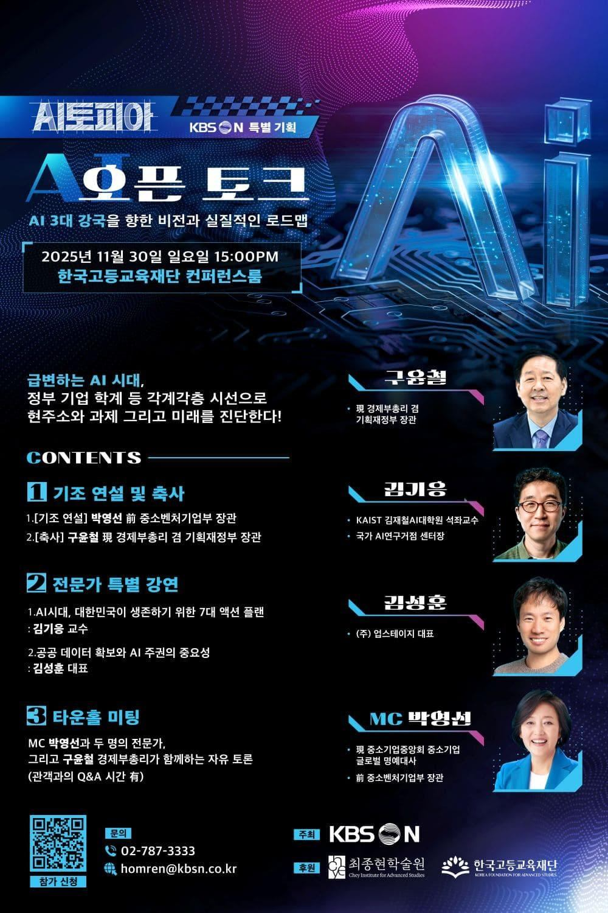
**이미지 캡션:** 이 포스터는 "AI 토피아: 오픈 토크"라는 제목의 행사를 홍보하며, AI 3대 강국을 향한 비전과 실질적인 로드맵을 주제로 2025년 11월 30일 일요일 오후 3시에 한국고등교육재단 컨퍼런스룸에서 개최된다. 포스터의 배경은 푸른색과 보라색이 어우러진 추상적인 디자인으로, AI 칩셋과 회로 기판을 연상시키는 패턴이 그려져 있으며, 중앙에는 빛나는 3D 형태의 'AI' 로고가 배치되어 있다. 왼쪽 상단에는 "AI토피아"라는 글자와 "KBSN 특별 기획"이라는 문구가 보인다. 행사 내용은 기조 연설 및 축사, 전문가 특별 강연, 타운홀 미팅으로 구성되어 있으며, 각 세션별 연사들의 이름과 소속이 명시되어 있다. 기조 연설은 박영선 전 중소벤처기업부 장관이, 축사는 구윤철 현 경제부총리 겸 기획재정부 장관이 맡는다. 특별 강연에는 김기웅 교수가 'AI 시대, 대한민국이 생존하기 위한 7대 액션 플랜'을 주제로, 김성훈 대표가 '공공 데이터 확보와 AI 주권의 중요성'을 주제로 강연한다. 타운홀 미팅은 MC 박영선과 구윤철 경제부총리, 그리고 김성훈 대표가 함께 자유 토론을 진행하며 관객과의 질의응답 시간도 포함된다. 포스터 오른쪽에는 각 연사들의 사진이 작게 배치되어 있으며, 구윤철 경제부총리는 정장을 입고 미소를 짓고 있고, 김기웅 교수는 안경을 쓰고 차분한 표정이며, 김성훈 대표는 캐주얼한 복장으로 활짝 웃고 있다. MC 박영선은 파란색 재킷을 입고 밝게 웃고 있다. 포스터 하단에는 문의 전화번호와 이메일 주소, 그리고 주최 및 후원 기관으로 KBSN, 최종현학술원, 한국고등교육재단이 표기되어 있다. 전체적으로 미래지향적이고 전문적인 분위기를 풍기며, AI 기술의 중요성과 미래 전망에 대한 깊이 있는 논의가 이루어질 것임을 암시한다.전문가 특별 강연, 타운홀 미팅으로 구성되어 있으며, 각 세션별 연사들의 이름과 소속이 명시되어 있다. 기조 연설은 박영선 전 중소벤처기업부 장관이, 축사는 구윤철 현 경제부총리 겸 기획재정부 장관이 맡는다. 특별 강연에는 김기웅 교수가 'AI 시대, 대한민국이 생존하기 위한 7대 액션 플랜'을 주제로, 김성훈 대표가 '공공 데이터 확보와 AI 주권의 중요성'을 주제로 강연한다. 타운홀 미팅은 MC 박영선과 구윤철 경제부총리, 그리고 김성훈 대표가 함께 자유 토론을 진행하며 관객과의 질의응답 시간도 포함된다. 포스터 오른쪽에는 각 연사들의 사진이 작게 배치되어 있으며, 구윤철 경제부총리는 정장을 입고 미소를 짓고 있고, 김기웅 교수는 안경을 쓰고 차분한 표정이며, 김성훈 대표는 캐주얼한 복장으로 활짝 웃고 있다. MC 박영선은 파란색 재킷을 입고 밝게 웃고 있다. 포스터 하단에는 문의 전화번호와 이메일 주소, 그리고 주최 및 후원 기관으로 KBSN, 최종현학술원, 한국고등교육재단이 표기되어 있다. 전체적으로 미래지향적이고 전문적인 분위기를 풍기며, AI 기술의 중요성과 미래 전망에 대한 깊이 있는 논의가 이루어질 것임을 암시한다.

### 12월 24일 (수) 16:53 · 여러분이 글을 많이 작성하신다면 #EditUp MS Word Add-in…

여러분이 글을 많이 작성하신다면 #EditUp MS Word Add-ins를 설치해보셔요. 워드에서 작성하는 모든 글을 아름답고 흠이 없게 만들어줍니다.

조선일보, 조선비즈, 조선뉴스프레스, 이투데이가 사용 중이며, 경향신문, 오마이뉴스 등 많은 곳에 도입될 예정입니다. 안정된 트래픽 관리를 위해 지금은 기관별 B2B로만 제공합니다. 필요하신 분들은 https://www.upstage.ai/contact-us 로 바로 연락주셔요!

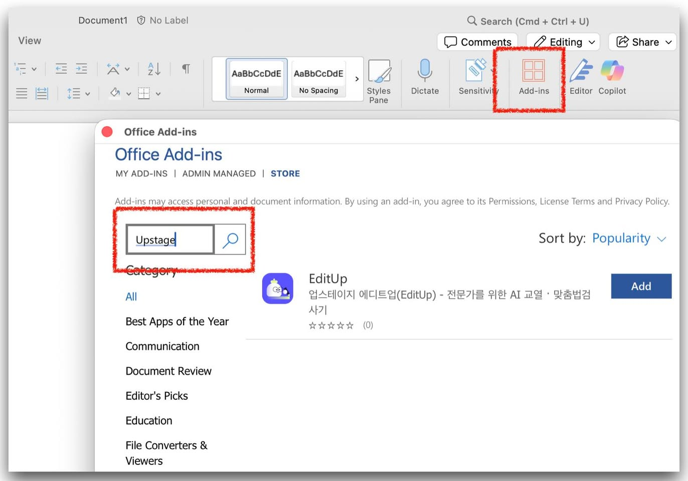
**이미지 캡션:** 이 화면은 컴퓨터 화면으로, 워드 프로세서 프로그램의 애드인(Add-ins) 스토어 또는 관리 페이지를 보여줍니다. 상단에는 문서 제목 "Document1"과 "No Label"이 표시되어 있으며, 검색창과 함께 "Comments", "Editing", "Share" 등의 메뉴가 보입니다. 그 아래에는 "View" 메뉴와 텍스트 서식 관련 아이콘들이 나열되어 있습니다. 화면 중앙에는 "Office Add-ins"라는 제목과 함께 "MY ADD-INS", "ADMIN MANAGED", "STORE" 옵션이 있습니다. "Add-ins may access personal and document information. By using an add-in, you agree to its Permissions, License Terms and Privacy Policy."라는 안내 문구가 보입니다. 빨간색 테두리로 강조된 검색창에는 "Upstage"라는 텍스트가 입력되어 있고, 그 옆에는 돋보기 모양의 검색 아이콘이 있습니다. 왼쪽에는 "Category"라는 제목 아래 "All", "Best Apps of the Year", "Communication", "Document Review", "Editor's Picks", "Education", "File Converters & Viewers" 등의 카테고리 목록이 있습니다. 오른쪽에는 "Sort by: Popularity"라는 정렬 옵션과 함께 "EditUp"이라는 애드인 정보가 표시되어 있으며, 해당 애드인의 아이콘, 이름, 설명("업스테이지 에디트업(EditUp) - 전문가를 위한 AI 교열ㆍ맞춤법검사기"), 별점 평가("☆☆☆☆☆ (0)")가 보이고, "Add" 버튼이 있습니다. 전체적으로 프로그램 내에서 추가 기능을 검색하고 관리하는 인터페이스를 보여주는 화면입니다.니다. "Add-ins may access personal and document information. By using an add-in, you agree to its Permissions, License Terms and Privacy Policy."라는 안내 문구가 보입니다. 빨간색 테두리로 강조된 검색창에는 "Upstage"라는 텍스트가 입력되어 있고, 그 옆에는 돋보기 모양의 검색 아이콘이 있습니다. 왼쪽에는 "Category"라는 제목 아래 "All", "Best Apps of the Year", "Communication", "Document Review", "Editor's Picks", "Education", "File Converters & Viewers" 등의 카테고리 목록이 있습니다. 오른쪽에는 "Sort by: Popularity"라는 정렬 옵션과 함께 "EditUp"이라는 애드인 정보가 표시되어 있으며, 해당 애드인의 아이콘, 이름, 설명("업스테이지 에디트업(EditUp) - 전문가를 위한 AI 교열ㆍ맞춤법검사기"), 별점 평가("☆☆☆☆☆ (0)")가 보이고, "Add" 버튼이 있습니다. 전체적으로 프로그램 내에서 추가 기능을 검색하고 관리하는 인터페이스를 보여주는 화면입니다.
 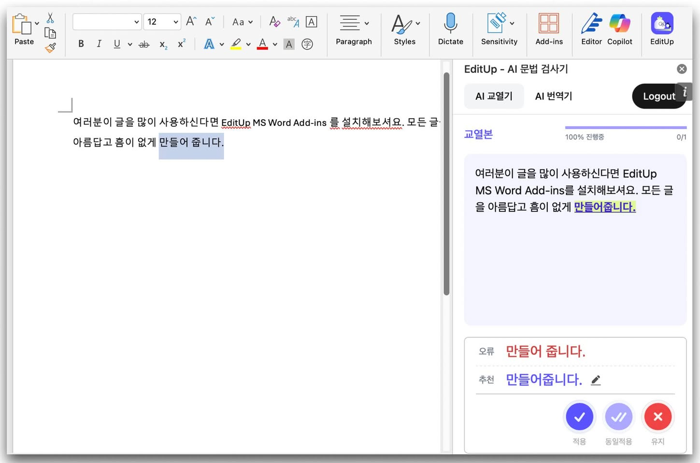
**이미지 캡션:** 이 이미지는 컴퓨터 화면의 일부를 보여주며, 워드 프로세서 프로그램의 인터페이스와 AI 기반 문법 검사기 플러그인이 활성화된 상태를 나타냅니다. 화면 왼쪽에는 워드 프로세서의 일반적인 편집 도구 모음이 보이며, 'Paste', 'BIU' 서식 옵션, 글꼴 크기 조절, 정렬 옵션 등이 있습니다. 중앙에는 "여러분이 글을 많이 사용하신다면 EditUp MS Word Add-ins를 설치해보셔요. 모든 글을 아름답고 흠이 없게 만들어 줍니다."라는 문장이 입력되어 있으며, 일부 텍스트는 파란색으로 강조 표시되어 있습니다. 화면 오른쪽에는 'EditUp - AI 문법 검사기'라는 제목의 사이드바가 열려 있으며, 'AI 교열기'와 'AI 번역기' 탭이 있습니다. 현재 'AI 교열기' 탭이 선택되어 있으며, "교열본"이라는 섹션 아래에 원본 텍스트와 동일한 내용이 표시되고 있습니다. 진행률은 100%로 표시되어 있으며, 오류는 0개, 검토할 내용은 1개임을 나타냅니다. 하단에는 '오류'와 '추천' 섹션이 있으며, '만들어 줍니다.'라는 텍스트가 오류로 표시되고, '만들어줍니다.'라는 텍스트가 추천으로 제시되어 있습니다. 추천 텍스트 옆에는 연필 모양 아이콘이 있어 수정이 가능함을 암시합니다. 또한, '적용', '동일 적용', '유지'라는 버튼과 함께 체크 표시, 체크 표시와 슬래시가 있는 아이콘, X 표시 아이콘이 있어 검토 결과를 적용하거나 무시하는 옵션을 제공합니다. 전반적으로, 이 화면은 사용자가 워드 프로세서에서 글을 작성하고 AI 도구를 사용하여 문법 및 스타일을 검토하고 수정하는 과정을 보여줍니다.습니다. 화면 오른쪽에는 'EditUp - AI 문법 검사기'라는 제목의 사이드바가 열려 있으며, 'AI 교열기'와 'AI 번역기' 탭이 있습니다. 현재 'AI 교열기' 탭이 선택되어 있으며, "교열본"이라는 섹션 아래에 원본 텍스트와 동일한 내용이 표시되고 있습니다. 진행률은 100%로 표시되어 있으며, 오류는 0개, 검토할 내용은 1개임을 나타냅니다. 하단에는 '오류'와 '추천' 섹션이 있으며, '만들어 줍니다.'라는 텍스트가 오류로 표시되고, '만들어줍니다.'라는 텍스트가 추천으로 제시되어 있습니다. 추천 텍스트 옆에는 연필 모양 아이콘이 있어 수정이 가능함을 암시합니다. 또한, '적용', '동일 적용', '유지'라는 버튼과 함께 체크 표시, 체크 표시와 슬래시가 있는 아이콘, X 표시 아이콘이 있어 검토 결과를 적용하거나 무시하는 옵션을 제공합니다. 전반적으로, 이 화면은 사용자가 워드 프로세서에서 글을 작성하고 AI 도구를 사용하여 문법 및 스타일을 검토하고 수정하는 과정을 보여줍니다.

### 12월 31일 (수) 05:46 · 독자 AI 파운데이션 모델 프로젝트 1차 발표 Upstage 영상:

독자 AI 파운데이션 모델 프로젝트 1차 발표 Upstage 영상: https://www.youtube.com/live/fLBh97ls--Q?si=oE0TaMCzL76ZcgbQ&t=5129

Solar-Open-100B(일명 tripod)를 소개하고 이를 활용한 기본 Chat, Search, Slide, 그리고 Deep Research 시연을 하고 왔습니다.

*정부 지원* 즉 여러분의 세금으로 마련한 GPU라 막중한 책임감으로 1분 1초의 GPU 시간을 아끼고 최대한 활용하면서 모델을 학습시키고 있습니다.

Solar-Open 모델은 12월 31일 밤까지 더 학습할 예정이라 구체적인 지표등은 1월 초에 허깅페이스 등을 통해 공개될 예정입니다.

시연에서 보여 드린 Solar-Open API와 주요 서비스들은 1월 15일 이후 공개될 예정입니다. 많이 사용해주세요.

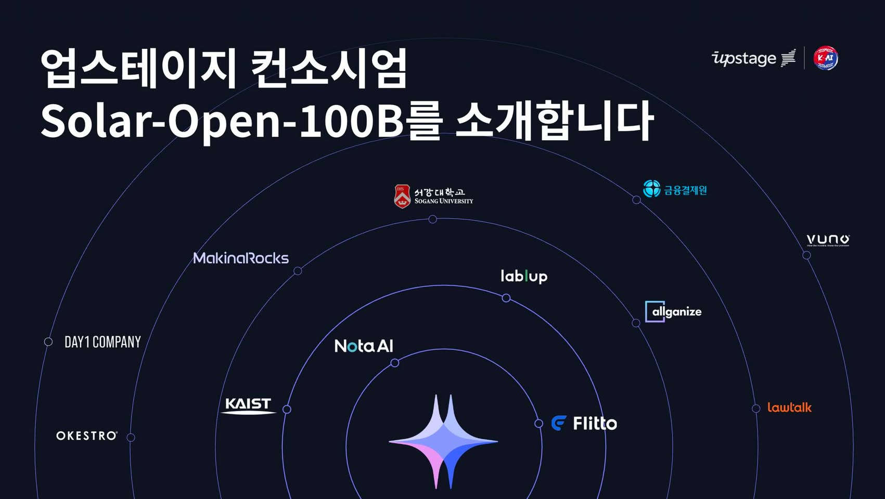
**이미지 캡션:** 이 이미지는 "업스테이지 컨소시엄 Solar-Open-100B를 소개합니다"라는 제목의 프레젠테이션 또는 홍보 자료의 일부로 보이며, 어두운 배경에 여러 기업 및 기관의 로고와 이름이 원형으로 배치되어 있습니다. 중앙에는 네 개의 뾰족한 별 모양의 그래픽이 있으며, 이를 중심으로 여러 개의 보라색 원형 선이 퍼져나가는 형태로 디자인되었습니다. 가장 상단에는 "upstage"와 "KAI" 로고가 있으며, 그 아래에 "서강대학교 SOGANG UNIVERSITY" 로고가 있습니다. 원형 선을 따라 "MakinaRocks", "DAY1 COMPANY", "OKESTRO", "KAIST", "Nota.AI", "lablup", "Flitto", "allganize", "lawtalk", "vuno", 그리고 "금융결제원"이라는 텍스트와 로고들이 배치되어 있습니다. 전체적으로 기술, 혁신, 협력을 강조하는 현대적이고 전문적인 분위기를 풍깁니다. 사람이나 특정 인물은 보이지 않으며, 장소는 명확히 특정되지 않지만 디지털 또는 기술 관련 행사나 발표회에서 사용될 법한 배경입니다.cks", "DAY1 COMPANY", "OKESTRO", "KAIST", "Nota.AI", "lablup", "Flitto", "allganize", "lawtalk", "vuno", 그리고 "금융결제원"이라는 텍스트와 로고들이 배치되어 있습니다. 전체적으로 기술, 혁신, 협력을 강조하는 현대적이고 전문적인 분위기를 풍깁니다. 사람이나 특정 인물은 보이지 않으며, 장소는 명확히 특정되지 않지만 디지털 또는 기술 관련 행사나 발표회에서 사용될 법한 배경입니다.
 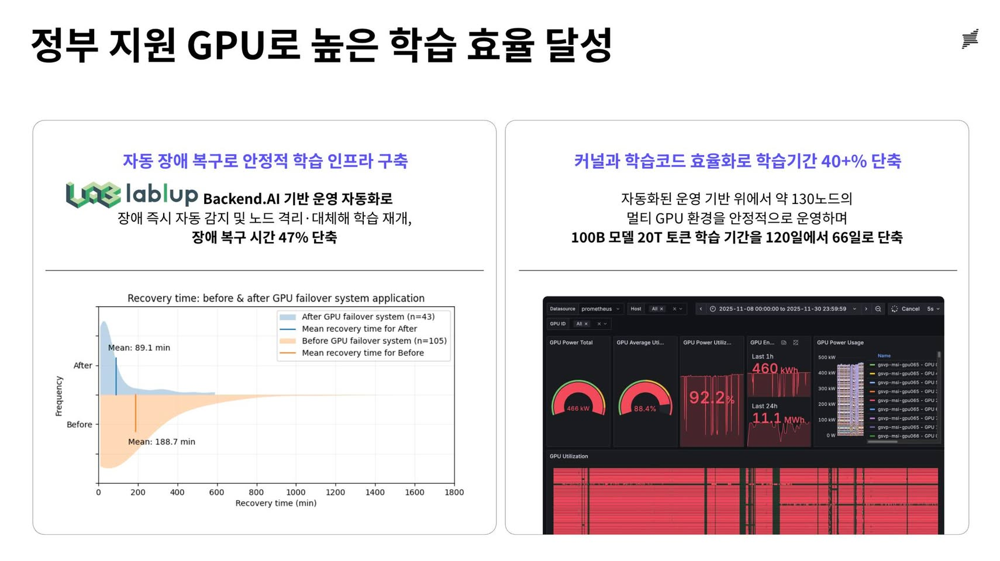
**이미지 캡션:** 이 이미지는 정부 지원 GPU를 활용하여 학습 효율을 높이는 두 가지 사례를 보여주는 두 개의 패널로 구성되어 있습니다. 왼쪽 패널은 "자동 장애 복구 안정적 학습 인프라 구축"이라는 제목 아래 Lablup Backend.AI를 사용하여 장애 발생 시 자동 감지 및 노드 격리, 대체해 학습 재개를 통해 장애 복구 시간을 47% 단축했다는 내용을 설명하고 있습니다. 이 패널에는 GPU 장애 복구 시스템 적용 전후의 복구 시간을 비교하는 그래프가 포함되어 있으며, 복구 전 평균 복구 시간은 188.7분, 복구 후 평균 복구 시간은 89.1분으로 나타납니다. 오른쪽 패널은 "커널과 학습코드 효율화로 학습기간 40+% 단축"이라는 제목 아래 자동화된 운영 기반 위에서 약 130노드의 멀티 GPU 환경을 안정적으로 운영하여 100B 모델 20T 토큰 학습 시간을 120일에서 66일로 단축했다는 내용을 설명합니다. 이 패널에는 GPU 총 전력, 평균 사용률, 전력 사용량, GPU 사용률 등을 보여주는 대시보드 화면이 포함되어 있으며, 특히 GPU 사용률 그래프는 붉은색 막대로 표시되어 GPU가 활발하게 사용되고 있음을 나타냅니다. 전반적으로 이미지는 기술적인 성과를 시각적으로 전달하며, 데이터와 그래프를 통해 구체적인 수치를 제시하고 있습니다. 평균 복구 시간은 89.1분으로 나타납니다. 오른쪽 패널은 "커널과 학습코드 효율화로 학습기간 40+% 단축"이라는 제목 아래 자동화된 운영 기반 위에서 약 130노드의 멀티 GPU 환경을 안정적으로 운영하여 100B 모델 20T 토큰 학습 시간을 120일에서 66일로 단축했다는 내용을 설명합니다. 이 패널에는 GPU 총 전력, 평균 사용률, 전력 사용량, GPU 사용률 등을 보여주는 대시보드 화면이 포함되어 있으며, 특히 GPU 사용률 그래프는 붉은색 막대로 표시되어 GPU가 활발하게 사용되고 있음을 나타냅니다. 전반적으로 이미지는 기술적인 성과를 시각적으로 전달하며, 데이터와 그래프를 통해 구체적인 수치를 제시하고 있습니다.
 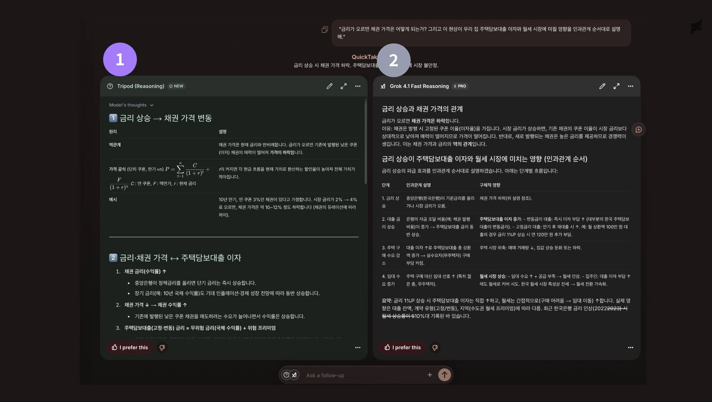
**이미지 캡션:** 이 이미지는 금융 시장의 금리 변동과 그에 따른 채권 가격, 주택담보대출 이자, 월세 시장의 관계를 설명하는 내용을 담고 있으며, 왼쪽에는 'Tripod (Reasoning)'라는 제목의 AI 모델의 생각 과정이, 오른쪽에는 'Grok 4.1 Fast Reasoning PRO'라는 제목의 AI의 분석 결과가 표시되어 있습니다. 왼쪽의 'Tripod (Reasoning)' 부분에서는 금리 상승이 채권 가격에 미치는 영향에 대한 원리, 역관계, 가격 공식, 그리고 예시를 설명하고 있으며, 이어서 금리와 채권 가격, 주택담보대출 이자의 관계를 설명하며, 주택담보대출 이자와 월세 시장에 미치는 영향에 대한 단계별 설명을 제시하고 있습니다. 오른쪽의 'Grok 4.1 Fast Reasoning PRO' 부분에서는 금리 상승과 채권 가격의 관계를 명확히 설명하고, 금리 상승이 주택담보대출 이자와 월세 시장에 미치는 영향에 대한 인과관계 순서별 설명을 구체적인 영향과 함께 제시하고 있습니다. 마지막으로 요약 부분에서는 금리 상승이 주택담보대출 이자와 월세에 미치는 영향을 종합적으로 설명하며, 최근 한국은행의 금리 인상 사례를 언급하고 있습니다. 전체적으로 복잡한 금융 시장의 원리를 시각적으로 이해하기 쉽게 구성한 정보성 콘텐츠입니다., 주택담보대출 이자의 관계를 설명하며, 주택담보대출 이자와 월세 시장에 미치는 영향에 대한 단계별 설명을 제시하고 있습니다. 오른쪽의 'Grok 4.1 Fast Reasoning PRO' 부분에서는 금리 상승과 채권 가격의 관계를 명확히 설명하고, 금리 상승이 주택담보대출 이자와 월세 시장에 미치는 영향에 대한 인과관계 순서별 설명을 구체적인 영향과 함께 제시하고 있습니다. 마지막으로 요약 부분에서는 금리 상승이 주택담보대출 이자와 월세에 미치는 영향을 종합적으로 설명하며, 최근 한국은행의 금리 인상 사례를 언급하고 있습니다. 전체적으로 복잡한 금융 시장의 원리를 시각적으로 이해하기 쉽게 구성한 정보성 콘텐츠입니다.
 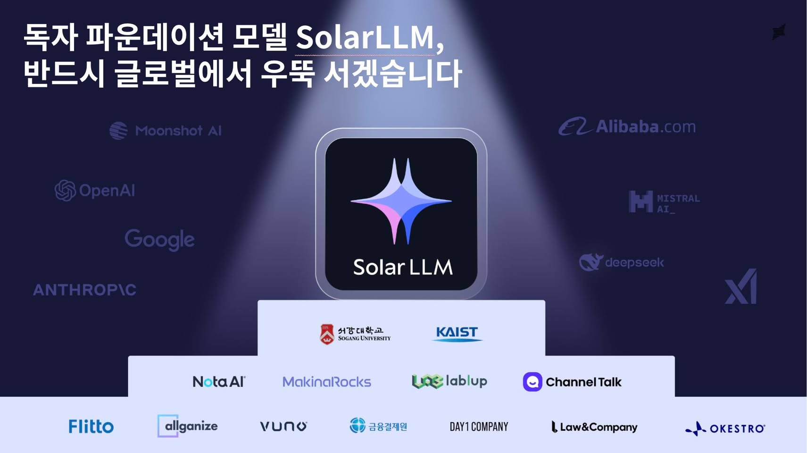
**이미지 캡션:** 이 이미지는 "독자 파운데이션 모델 SolarLLM, 반드시 글로벌에서 우뚝 서겠습니다"라는 한국어 문구가 상단에 크게 쓰여 있으며, 그 아래에 Solar LLM이라는 로고가 중앙에 배치되어 있습니다. 로고는 네 개의 빛나는 별 모양이 모여 있는 형태로, 보라색과 분홍색이 혼합된 색상입니다. 배경은 어두운 남색이며, 왼쪽 상단에는 빛이 비추는 듯한 효과가 있습니다. 로고 주변과 배경에는 다양한 기업 및 기관의 로고들이 배치되어 있는데, 왼쪽에는 Moonshot AI, OpenAI, Google, ANTHROPIC\C가 있으며, 오른쪽에는 Alibaba.com, Mistral AI, deepseek, XI가 있습니다. 하단에는 흰색 배경 위에 또 다른 기업 로고들이 나열되어 있으며, 서강대학교, KAIST, Nota AI, MakinaRocks, Lablup, Channel Talk, Flitto, allganize, Vuno, 금융결제원, DAY1 COMPANY, Law&Company, OKESTRO 등이 보입니다. 이 이미지는 Solar LLM이라는 인공지능 모델의 발표 또는 홍보를 위한 것으로 보이며, 다양한 파트너사들과 함께 글로벌 시장에서 경쟁하겠다는 의지를 나타내는 분위기입니다. 이미지에는 사람이 등장하지 않으며, 전체적으로 기술적이고 진취적인 느낌을 줍니다.IC\C가 있으며, 오른쪽에는 Alibaba.com, Mistral AI, deepseek, XI가 있습니다. 하단에는 흰색 배경 위에 또 다른 기업 로고들이 나열되어 있으며, 서강대학교, KAIST, Nota AI, MakinaRocks, Lablup, Channel Talk, Flitto, allganize, Vuno, 금융결제원, DAY1 COMPANY, Law&Company, OKESTRO 등이 보입니다. 이 이미지는 Solar LLM이라는 인공지능 모델의 발표 또는 홍보를 위한 것으로 보이며, 다양한 파트너사들과 함께 글로벌 시장에서 경쟁하겠다는 의지를 나타내는 분위기입니다. 이미지에는 사람이 등장하지 않으며, 전체적으로 기술적이고 진취적인 느낌을 줍니다.
