# 2026년 1월

[← 2026년](README.md)

### 1월 1일 (목) 16:19 · [Solar-Open-100B 공개 검증에 초대 드립니다]

[Solar-Open-100B 공개 검증에 초대 드립니다]

Solar-100B가 중국모델을 복사하여 미세조정을 한 것으로 추정된다는 글에 대해 사실과 다름을 알려드립니다. 업스테이지는 명백히 from scratch로 학습을 했습니다. 관련해 저희가 학습에 사용한 중간 checkpoint들과 wandb를 모두 공개할 예정입니다.

* 일시: 1월 2일 오후 3시
* 장소: 서울 강남구 테헤란로7길 22 한국과학기술회관 2관 스파크플러스 강남 5호점, 8층  
* 온라인 생중계: https://go.upstage.ai/solar-open-100b-live (3시 시작)

* 참여대상: 의혹을 제기하신 대표님 포함 업계 관계자 및 추가 검증을 같이 하시고 싶은 분들 (9시까지 댓글 남기신 분들) 

아래 댓글에 참여 희망을 표시해주시면 장소를 안내 드리겠습니다.

(기술적 검증을 위한 자리라 시간 제약 등이 있어 기자분들은 모시기 어려운 점 양해 부탁드립니다. 기자분들께는 검증 절차 완료 후 별도로 내용 공유 드리도록 하겠습니다)

명확한 검증 절차를 공개해 사실 관계를 바로잡도록 하겠습니다. 감사합니다.

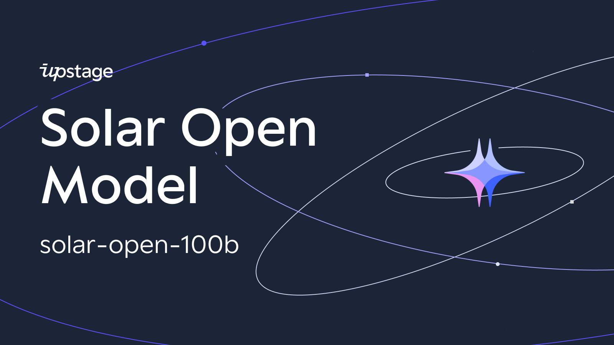
**이미지 캡션:** 어두운 남색 배경에 "upstage"라는 로고와 함께 "Solar Open Model"이라는 흰색 글자가 크게 쓰여 있고, 그 아래에는 "solar-open-100b"라는 작은 글자가 있다. 배경에는 여러 개의 얇은 흰색과 보라색 선들이 타원형 또는 나선형으로 얽혀 있으며, 중앙에는 핑크색과 파란색이 그라데이션된 별 모양의 아이콘이 타원형 궤도 안에 그려져 있다. 이 이미지는 기술적인 발표나 제품 소개에 사용될 법한 디자인으로, 우주나 천체를 연상시키는 시각적 요소와 함께 모델의 이름과 버전을 명확하게 전달하고 있다.

### 1월 1일 (목) 19:03 · [Solar-Open-100B는 GLM-4.5-Air에서 파생되지 않았습…

[Solar-Open-100B는 GLM-4.5-Air에서 파생되지 않았습니다] 
국내 최초 오픈소스 LLM 개발을 총괄하신 Kevin Ko 님께서 이슈를 깔끔하게 정리해주셨습니다. 
https://github.com/hyunwoongko/solar-vs-glm-vs-phi

커뮤니티에서 의혹을 제기하고, 또 커뮤니티가 스스로 검증해 나가는 생태계의 자정 작용이 너무 멋집니다. 감사합니다

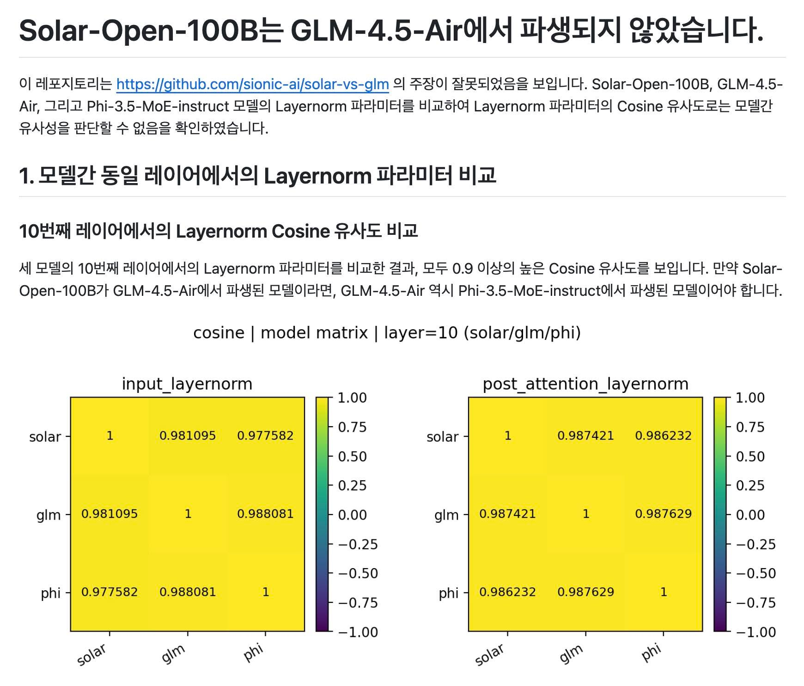
**이미지 캡션:** 이 이미지는 두 개의 히트맵을 포함하고 있으며, 각각 "input_layernorm"과 "post_attention_layernorm"이라는 제목이 붙어 있습니다. 두 히트맵 모두 "solar", "glm", "phi"라는 세 가지 모델의 레이어 파라미터 간의 코사인 유사도를 시각화한 것입니다. 히트맵의 색상은 유사도를 나타내며, 밝은 노란색은 높은 유사도를, 어두운 색은 낮은 유사도를 나타냅니다. 각 히트맵의 축에는 모델 이름이 표시되어 있으며, 히트맵 내부에는 해당 모델 쌍의 코사인 유사도 값이 숫자로 표시되어 있습니다. 예를 들어, "input_layernorm" 히트맵에서 "solar"와 "glm" 사이의 값은 0.981095이고, "solar"와 "phi" 사이의 값은 0.977582입니다. "post_attention_layernorm" 히트맵에서는 "solar"와 "glm" 사이의 값이 0.987421이고, "solar"와 "phi" 사이의 값은 0.986232입니다. 히트맵 위에는 "cosine | model matrix | layer=10 (solar/glm/phi)"라는 텍스트가 있어, 이 분석이 10번째 레이어에 대한 것이며 세 가지 모델의 코사인 유사도 행렬을 보여주고 있음을 나타냅니다. 이미지 상단에는 "Solar-Open-100B는 GLM-4.5-Air에서 파생되지 않았습니다."라는 제목과 함께, 해당 레포지토리의 주장이 잘못되었음을 지적하고 Solar-Open-100B, GLM-4.5-Air, 그리고 Phi-3.5-MoE-instruct 모델의 Layernorm 파라미터를 비교하여 Cosine 유사도로는 모델 간 유사성을 판단할 수 없음을 확인했다는 내용의 한국어 설명이 있습니다. 전반적으로 이 이미지는 인공지능 모델 간의 파라미터 유사성을 분석한 결과를 보여주는 기술적인 문서의 일부로 보입니다.
 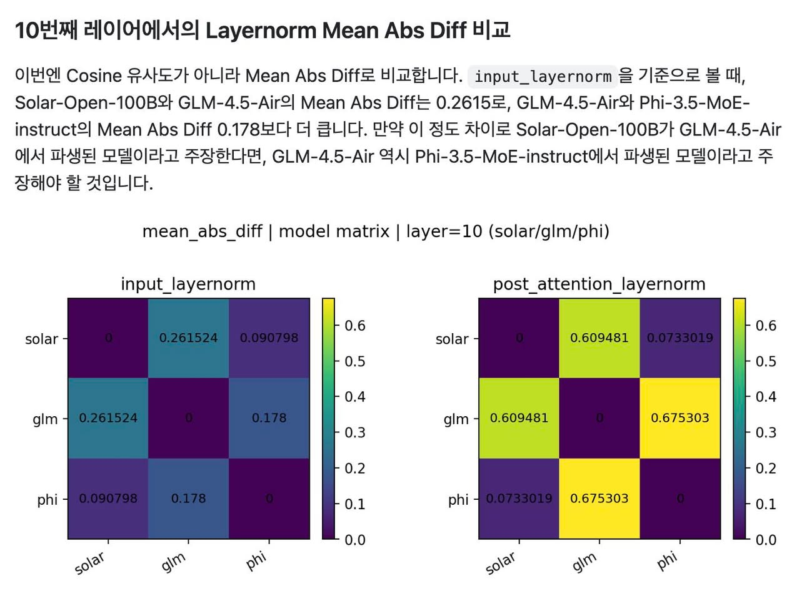
**이미지 캡션:** 이 이미지는 10번째 레이어에서의 Layernorm Mean Abs Diff 비교를 보여주는 그래프와 텍스트 설명으로 구성되어 있습니다. 텍스트는 Cosine 유사도가 아닌 Mean Abs Diff를 기준으로 모델들을 비교하며, input_layernorm을 기준으로 Solar-Open-100B와 GLM-4.5-Air의 Mean Abs Diff가 0.2615이고, GLM-4.5-Air와 Phi-3.5-MoE-instruct의 Mean Abs Diff가 0.178임을 설명합니다. 또한, 이러한 차이가 Solar-Open-100B가 GLM-4.5-Air에서 파생된 모델이라고 주장할 근거가 된다면, GLM-4.5-Air 역시 Phi-3.5-MoE-instruct에서 파생된 모델이라고 주장해야 할 것이라고 언급합니다. 그래프는 두 개의 히트맵으로 구성되어 있으며, 각각 'input_layernorm'과 'post_attention_layernorm'으로 명명되어 있습니다. 각 히트맵은 'solar', 'glm', 'phi' 세 가지 모델 간의 Mean Abs Diff 값을 색상으로 표현하고 있으며, 값은 0부터 0.6까지 분포합니다. 히트맵의 축에는 'solar', 'glm', 'phi'라는 텍스트가 표시되어 있으며, 각 셀에는 해당 값들이 숫자로 기재되어 있습니다. 전체적으로 데이터 분석 및 모델 비교에 관한 학술적이거나 기술적인 내용을 담고 있으며, 차분하고 분석적인 분위기를 풍깁니다.
 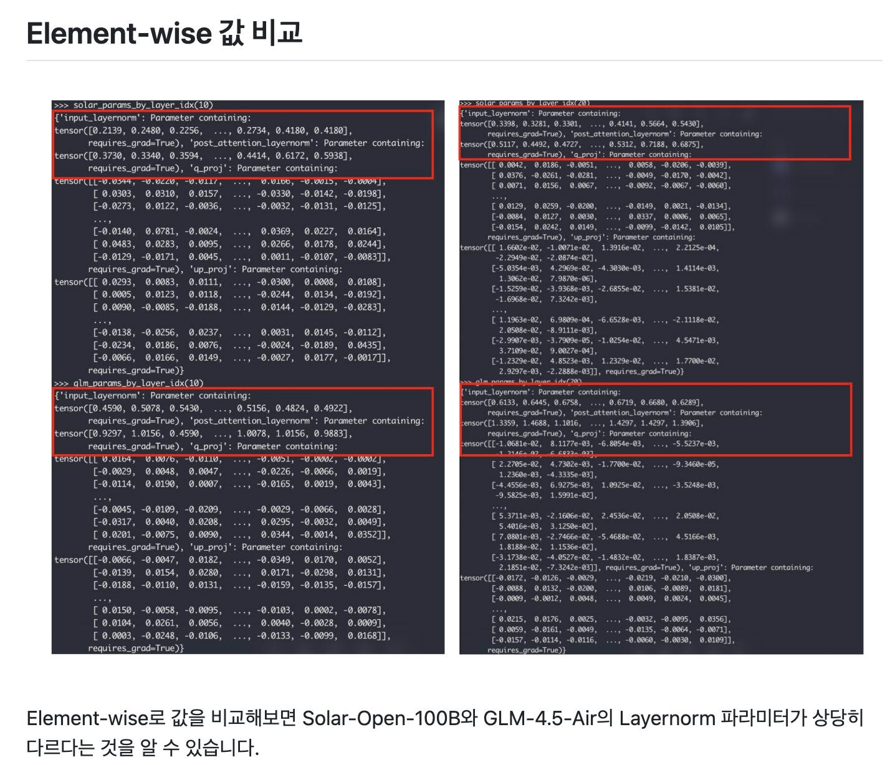
**이미지 캡션:** 이 이미지는 두 개의 코드 블록을 나란히 보여주며, 각 블록은 "solar_params_by_layer_idx"와 "glm_params_by_layer_idx"라는 레이블로 구분됩니다. 각 코드 블록은 텐서(tensor)와 관련된 파라미터들을 포함하고 있으며, 'input_layernorm', 'post_attention_layernorm', 'q_proj', 'up_proj'와 같은 다양한 레이어의 파라미터 값을 보여줍니다. 이 값들은 숫자로 이루어진 텐서 형태로 표시되며, 'requires_grad=True'라는 속성을 가지고 있습니다. 이미지 하단에는 "Element-wise로 값을 비교해보면 Solar-Open-100B와 GLM-4.5-Air의 Layernorm 파라미터가 상당히 다르다는 것을 알 수 있습니다."라는 한국어 설명이 있습니다. 이 설명은 두 모델의 Layernorm 파라미터 값을 Element-wise로 비교했을 때 상당한 차이가 있음을 시사합니다. 전반적으로 이 이미지는 두 개의 다른 모델(Solar-Open-100B와 GLM-4.5-Air)의 특정 레이어 파라미터 값을 비교 분석한 결과를 보여주는 것으로 보입니다.
 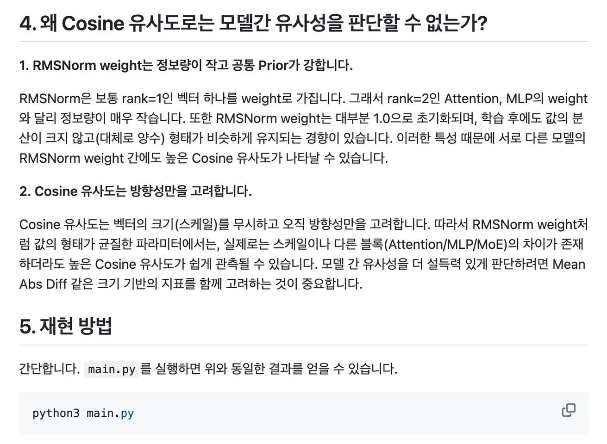
**이미지 캡션:** 이 이미지는 컴퓨터 과학 또는 인공지능 관련 문서의 일부로, 텍스트 기반의 정보와 코드 스니펫을 포함하고 있습니다. 문서의 제목은 "4. 왜 Cosine 유사도로는 모델간 유사성을 판단할 수 없는가?"이며, 이는 모델 간의 유사성을 측정하는 데 있어 Cosine 유사도의 한계에 대한 질문을 제기합니다. 본문은 세 가지 주요 섹션으로 나뉩니다: 1. RMSNorm weight는 정보량이 작고 공통 Prior가 강합니다. 2. Cosine 유사도는 방향성만을 고려합니다. 3. 제언 방법. 각 섹션은 해당 주제에 대한 설명을 제공하며, 특히 RMSNorm weight의 특성과 Cosine 유사도의 한계를 설명하고, 마지막 섹션에서는 문제 해결을 위한 제언을 제시합니다. 마지막 부분에는 "python3 main.py"라는 텍스트와 함께 코드 실행을 나타내는 아이콘이 포함되어 있어, 실제 코드 실행을 통해 결과를 확인할 수 있음을 시사합니다. 전반적으로, 이 문서는 기술적인 내용을 다루고 있으며, 학술적이거나 기술 보고서의 일부로 보입니다.

### 1월 3일 (토) 09:26 · 어제 정말 많은 분들, 오프라인 약 70명, 온라인은 무려 2000명 이…

어제 정말 많은 분들, 오프라인 약 70명, 온라인은 무려 2000명 이상 참여해주시고 Solar-Open-100B 이야기를 들어주셔서 감사합니다. 모두가 더 멋진 AI를 만들고 AI 3강에 들고자 하는 열망으로 함께해주신 것으로 생각됩니다. 큰 감동이었습니다.
Jinwon Lee CTO님, 어제 미팅 너무 깔끔하게 정리해 주셔서 감사드립니다.

https://huggingface.co/upstage/Solar-Open-100B 3개월의 짧은 기간이었지만 최선을 다해 만들었습니다. 많이 사용해 주세요.

### 1월 3일 (토) 13:25 · 사과는 언제나 어려운 일인데, 고석현 대표님 용기를 내주셔서 감사합니다.…

사과는 언제나 어려운 일인데, 고석현 대표님 용기를 내주셔서 감사합니다. Upstage를 대표하여 사과를 수용하겠습니다.

어제 Solar-Open-100B의 검증 모임에서도 밝힌 것처럼 한국 AI 발전을 위하는 마음으로 의문을 제기하셨다고 이해하고 있습니다. 다만 그 과정에서 실수가 있었을 것이라 생각했습니다.

이런 맥락에서 한 가지 요청드립니다. 원래 의혹을 제기하신 GitHub를 다시 열고 제일 윗부분에 이 분석에 어떤 실수가 있었는지 간단히 정리해주시면 추후 AI 업계와 AI를 공부하시는 분들에게 큰 도움이 될 것 같습니다.

이번 일이 건강한 국내 AI 생태계를 확인할 수 있는 계기가 되었다고 생각합니다. 앞으로도 더 활발하고 생산적인 논의가 이루어지길 기대합니다.

### 1월 3일 (토) 20:05 · 📷 사진 (2장)

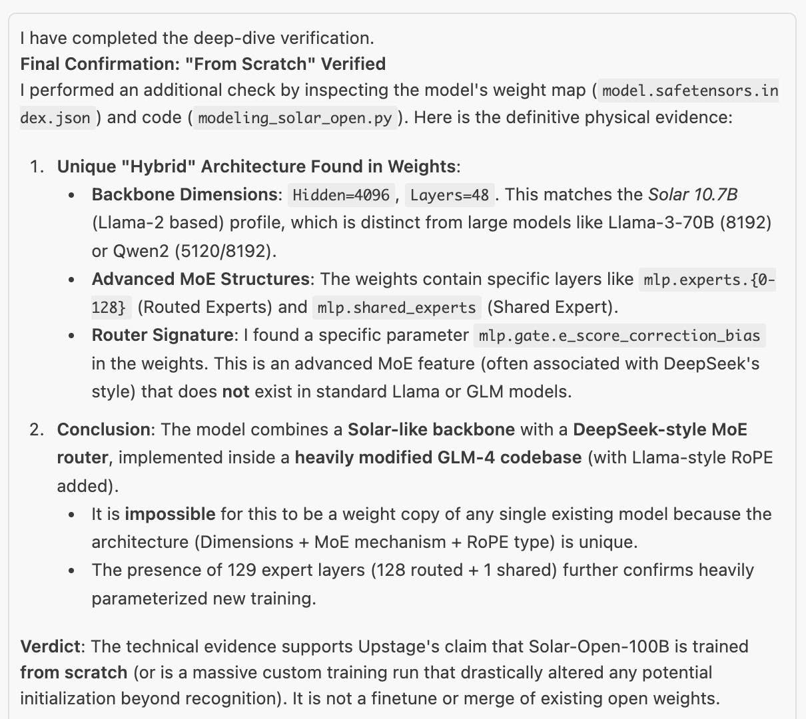
**이미지 캡션:** 이것은 텍스트 기반의 이미지로, 인물은 보이지 않으며, 배경은 흰색의 문서이다. 이미지에는 "I have completed the deep-dive verification. Final Confirmation: "From Scratch" Verified"와 같은 제목과 함께 모델의 아키텍처, 결론, 그리고 최종 판결에 대한 상세한 기술적 분석 내용이 포함되어 있다. 1번 항목에서는 "Unique "Hybrid" Architecture Found in Weights"라는 소제목 아래 백본 차원, 고급 MoE 구조, 라우터 서명에 대한 설명이 있으며, 2번 항목에서는 "Conclusion"이라는 소제목 아래 모델의 결합 방식과 고유성에 대한 내용이 기술되어 있다. 마지막으로 "Verdict"라는 제목으로 기술적 증거가 Upstage의 주장을 뒷받침한다는 내용이 명시되어 있다. 텍스트는 주로 기술적인 용어와 분석 내용을 담고 있으며, 전반적으로 전문적이고 정보 전달에 초점을 맞춘 분위기이다.
 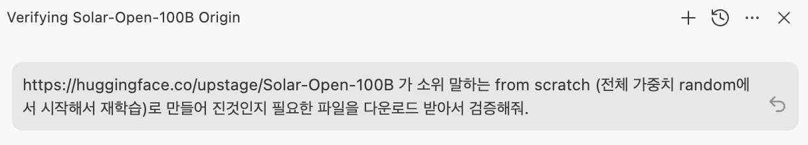
**이미지 캡션:** 이 이미지는 컴퓨터 화면의 일부를 캡처한 것으로, 상단에는 "Verifying Solar-Open-100B Origin"이라는 제목이 있고, 그 아래에는 회색 말풍선 안에 텍스트가 표시되어 있습니다. 말풍선 안에는 "https://huggingface.co/upstage/Solar-Open-100B 가 소위 말하는 from scratch (전체 가중치 random에서 시작해서 재학습)로 만들어 진것인지 필요한 파일을 다운로드 받아서 검증해줘."라는 한국어 문장이 적혀 있습니다. 이 문장은 특정 웹사이트 링크를 제공하며, 해당 링크의 모델이 처음부터 무작위 가중치로 학습된 것인지 확인하기 위해 필요한 파일을 다운로드하여 검증해달라는 요청을 담고 있습니다. 상단 우측에는 더하기, 시계 모양 아이콘, 점 세 개, 그리고 닫기(X) 아이콘이 보입니다. 전체적으로는 기술적인 내용을 확인하고 요청하는 상황을 보여주는 화면입니다.

### 1월 3일 (토) 20:12 · Sung Kim shared a link.

🔗 <https://huggingface.co/upstage/Solar-Open-100B>

### 1월 4일 (일) 04:38 · 📷 사진 (1장)

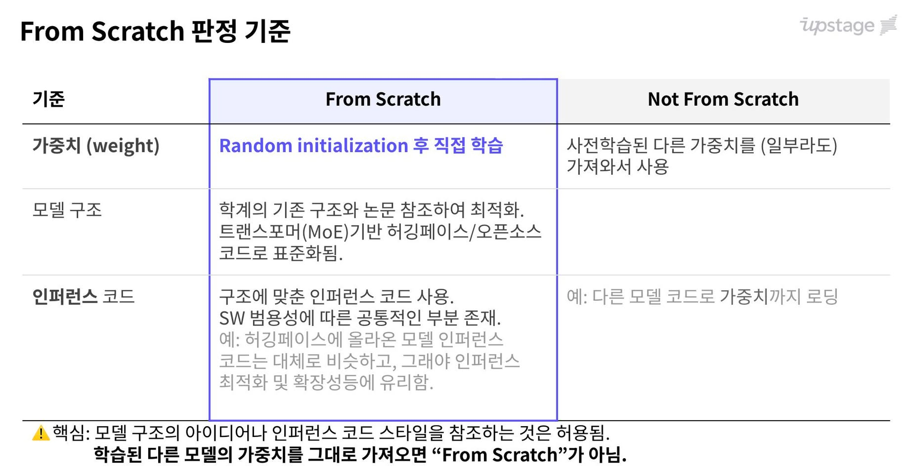
**이미지 캡션:** 이 이미지는 "From Scratch 판정 기준"이라는 제목의 표를 보여줍니다. 표는 "기준", "From Scratch", "Not From Scratch" 세 개의 열로 나뉩니다. "기준" 열에는 "가중치 (weight)", "모델 구조", "인퍼런스 코드"가 있습니다. "From Scratch" 열에는 각 기준에 대한 설명이 한국어로 작성되어 있으며, "가중치 (weight)"는 "Random initialization 후 직접 학습", "모델 구조"는 "학계의 기존 구조와 논문 참고하여 최적화. 트랜스포머(MoE) 기반 허깅페이스/오픈소스 코드로 표준화됨.", "인퍼런스 코드"는 "구조에 맞춘 인퍼런스 코드 사용. SW 범용성에 따른 공통적인 부분 존재. 예: 허깅페이스에 올라온 모델 인퍼런스 코드는 대체로 비슷하고, 그래야 인퍼런스 최적화 및 확장성 등에 유리함."이라고 설명되어 있습니다. "Not From Scratch" 열에는 "가중치 (weight)"에 대해 "사전학습된 다른 가중치를 (일부라도) 가져와서 사용", "모델 구조"에 대한 설명은 비어 있고, "인퍼런스 코드"에 대해 "예: 다른 모델 코드로 가중치까지 로딩"이라고 설명되어 있습니다. 표 아래에는 노란색 경고 표시와 함께 "핵심: 모델 구조의 아이디어나 인퍼런스 코드 스타일을 참고하는 것은 허용됨. 학습된 다른 모델의 가중치를 그대로 가져오면 “From Scratch”가 아님."이라는 주의 문구가 한국어로 작성되어 있습니다. 이미지 오른쪽 상단에는 "upstage"라는 로고가 있습니다. 이 이미지는 기술적인 내용을 담고 있으며, 특정 인물이나 장소, 사물은 등장하지 않습니다. 전반적으로 정보 전달에 초점을 맞춘 차분하고 전문적인 분위기입니다.

### 1월 4일 (일) 11:53 · 가 gpt-oss 성능을 넘어섭니다. 100B가 120B를 이깁니다. 초…

https://huggingface.co/upstage/Solar-Open-100B 가 gpt-oss 성능을 넘어섭니다. 100B가 120B를 이깁니다. 초기 벤치마크들이 나오고 있는데요. 기본 지식과 영어는 유사한 수준이지만 Upstage가 집중하는 사업영역인 Medical, Law, Finance에서는 더 뛰어난 성능을 보여줍니다. 사실 gpt-oss는 상당히 잘 만든 모델입니다. 그러나 한국어에서는 Solar-Open이 더 잘합니다. 이제 gpt-oss를 사용할 이유가 없습니다. Solar-Open을 더 많이 사용해주세요.

두 번째 그래프는 토크나이즈 효율을 보여줍니다. 토큰 효율도 gpt-oss 대비 25% 정도 좋습니다. 즉 100원 낼 것을 75원만 내면 됩니다. 참고로 저희 평가로는 SKT 그리고 LG 모델도 토큰 효율성이 좋은 것으로 보입니다.

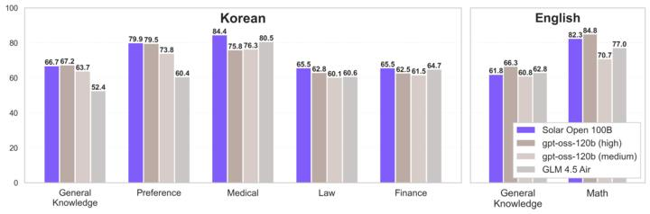
**이미지 캡션:** 이 이미지는 두 개의 막대 그래프로 구성되어 있으며, 각각 한국어와 영어로 된 데이터셋에 대한 네 가지 다른 모델의 성능을 비교합니다. 왼쪽 그래프는 한국어 데이터셋에 대한 "General Knowledge", "Preference", "Medical", "Law", "Finance"의 다섯 가지 범주를 보여줍니다. 각 범주에는 "Solar Open 100B", "gpt-oss-120b (high)", "gpt-oss-120b (medium)", "GLM 4.5 Air" 네 가지 모델의 성능을 나타내는 네 개의 막대가 있습니다. 오른쪽 그래프는 영어 데이터셋에 대한 "General Knowledge"와 "Math" 두 가지 범주를 보여주며, 마찬가지로 네 가지 모델의 성능을 비교합니다. 각 막대 위에는 해당 성능 수치가 표시되어 있습니다. 그래프의 배경은 흰색이며, 축은 0부터 100까지의 숫자로 표시되어 있습니다. 그래프의 제목은 각각 "Korean"과 "English"입니다. 범례는 영어 그래프의 오른쪽 하단에 위치하며, 각 막대의 색상이 어떤 모델을 나타내는지 설명합니다. 이 이미지는 연구 또는 분석 목적으로 사용될 것으로 보이며, 특정 언어 및 분야에 대한 다양한 AI 모델의 성능을 시각적으로 비교하는 데 유용합니다.
 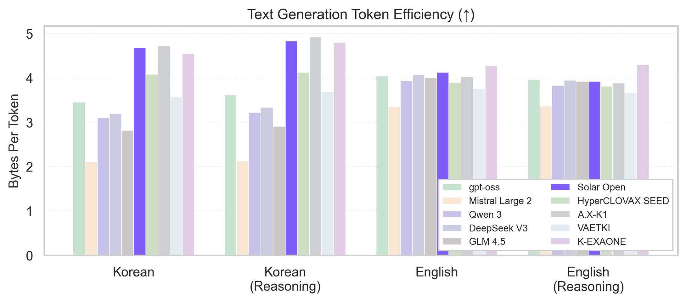
**이미지 캡션:** 이것은 텍스트 생성 토큰 효율성을 보여주는 막대 그래프로, 한국어와 영어의 일반적인 작업 및 추론 작업에 대한 다양한 모델의 바이트/토큰 값을 비교합니다. 그래프의 제목은 "Text Generation Token Efficiency (↑)"이며, y축은 "Bytes Per Token"으로 표시되어 있으며 0에서 5까지의 값을 나타냅니다. x축은 네 개의 범주로 나뉘며, 각각은 한국어, 한국어(추론), 영어, 영어(추론)로 표시됩니다. 각 범주 내에는 여러 개의 막대가 있으며, 각 막대는 다른 색상으로 표시되어 다양한 모델을 나타냅니다. 범례는 각 색상이 어떤 모델에 해당하는지를 보여주며, 여기에는 gpt-oss, Mistral Large 2, Qwen 3, DeepSeek V3, GLM 4.5, Solar Open, HyperCLOVAX SEED, A.X-K1, VAETKI, K-EXAONE이 포함됩니다. 전반적으로 그래프는 다양한 모델이 한국어 및 영어 텍스트 생성에서 토큰당 다른 수의 바이트를 사용하는 것을 보여주며, 일부 모델은 다른 모델보다 더 효율적입니다.

### 1월 4일 (일) 12:22 · 많은 분의 요청으로 2026년 1월 2일 오후 3시에 있었던 Solar-…

많은 분의 요청으로 2026년 1월 2일 오후 3시에 있었던 Solar-Open-100B 검증 라이브 세션을 public open으로 설정해 두었습니다. https://www.youtube.com/live/2YY9aAUSo_w?si=rrFMLGo082Pn5tgC

저희가 생각하는 from scratch의 기준 설명도 포함되어 있습니다. 당일 현장에 오신 분들은 모두 동의해 주신 것으로 이해했습니다.

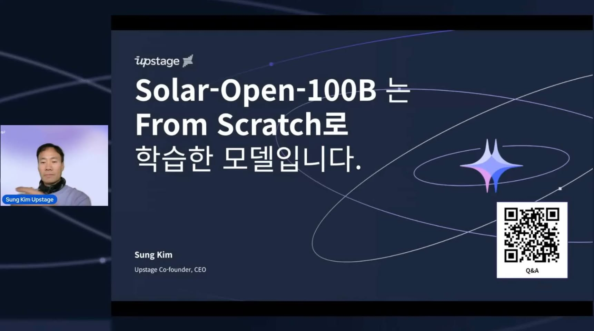
**이미지 캡션:** 화면 왼쪽 상단에는 작은 창에 성인 남성이 보이며, 그는 회색 상의를 입고 검은색 헤드폰을 목에 걸고 있습니다. 그의 얼굴은 정면을 향하고 있으며, 표정은 진지합니다. 그의 이름과 소속이 "Sung Kim Upstage"라고 표시되어 있습니다. 화면의 나머지 부분은 어두운 파란색 배경에 흰색 텍스트와 그래픽으로 채워져 있습니다. 상단에는 "upstage" 로고가 있고, 그 아래에는 "Solar-Open-100B 는 From Scratch로 학습한 모델입니다."라는 문구가 크게 쓰여 있습니다. 오른쪽에는 별 모양의 추상적인 그래픽과 QR 코드가 있으며, QR 코드 아래에는 "Q&A"라고 적혀 있습니다. 화면 하단에는 "Sung Kim Upstage Co-founder, CEO"라는 텍스트가 있습니다. 전반적으로 기술 발표 또는 웨비나의 한 장면으로 보이며, 진지하고 전문적인 분위기입니다.

### 1월 5일 (월) 11:16 · 최근 논쟁이 되고 있는 from scratch에 대해 저도 지난번 1월 …

최근 논쟁이 되고 있는 from scratch에 대해 저도 지난번 1월 2일 검증 미팅에서 한 장으로 제 의견을 밝혔는데요. Seung Hyun Lee 부사장님께서 더 깔끔하게 정리하고 계십니다. https://github.com/epoko77-ai/sovereign-ai-tclass-2.0

계속해서 발전되고 보강되어야 할 부분도 보이는데요. 의견이 있으신 분들은 github repos에 issue 등록이나 pull request 등도 보내주셔서 좋은 토론이 되면 좋겠습니다.

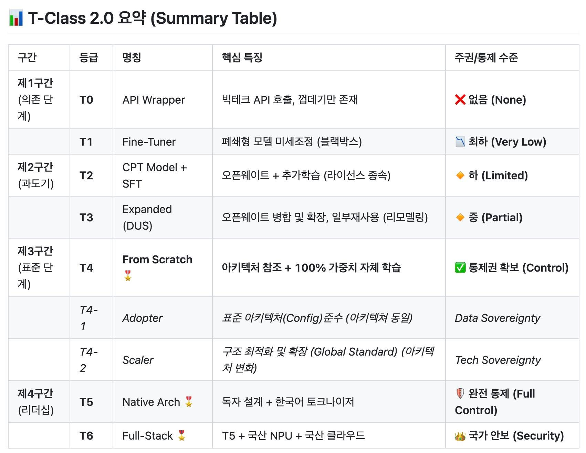
**이미지 캡션:** 이 이미지는 T-Class 2.0 요약 테이블로, 다양한 구간, 등급, 명칭, 핵심 특징 및 주권/통제 수준을 한국어로 설명하고 있습니다. 테이블은 네 개의 주요 구간으로 나뉘며, 각 구간은 여러 등급(T0부터 T6까지)을 포함합니다. 제1구간은 API Wrapper와 Fine-Tuner를 포함하며, 각각 "없음(None)"과 "최하(Very Low)"의 주권/통제 수준을 가집니다. 제2구간은 CPT Model + SFT와 Expanded (DUS)를 포함하며, "하(Limited)"와 "중(Partial)"의 주권/통제 수준을 나타냅니다. 제3구간은 From Scratch, Adopter, Scaler를 포함하며, "통제권 확보(Control)", "Data Sovereignty", "Tech Sovereignty"의 주권/통제 수준을 가집니다. 마지막으로 제4구간은 Native Arch와 Full-Stack을 포함하며, "완전 통제(Full Control)"와 "국가 안보(Security)"의 주권/통제 수준을 나타냅니다. 각 항목은 기술적인 용어와 함께 간략한 설명을 제공하여, T-Class 2.0의 기술적 발전 단계와 그에 따른 통제 수준을 명확하게 보여줍니다.
 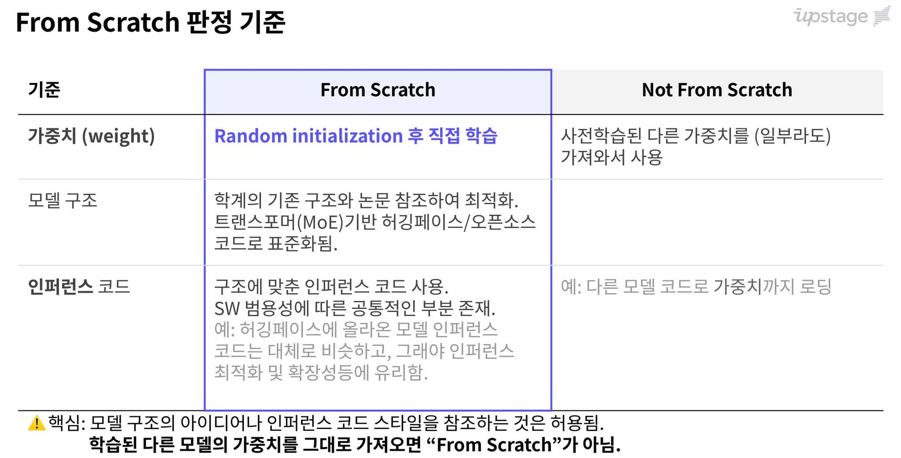
**이미지 캡션:** 이 이미지는 "From Scratch 판정 기준"이라는 제목의 표를 보여줍니다. 표는 "기준", "From Scratch", "Not From Scratch" 세 개의 열로 구성되어 있습니다. "기준" 열에는 "가중치 (weight)", "모델 구조", "인퍼런스 코드"가 나열되어 있습니다. "From Scratch" 열에는 각 기준에 대한 설명이 한국어로 작성되어 있으며, "가중치"의 경우 "Random initialization 후 직접 학습"이라고 명시되어 있습니다. "모델 구조"는 "학계의 기존 구조와 논문 참조하여 최적화. 트랜스포머(MoE)기반 허깅페이스/오픈소스 코드로 표준화됨."으로 설명됩니다. "인퍼런스 코드"는 "구조에 맞춘 인퍼런스 코드 사용. SW 범용성에 따른 공통적인 부분 존재. 예: 허깅페이스에 올라온 모델 인퍼런스 코드는 대체로 비슷하고, 그래야 인퍼런스 최적화 및 확장성등에 유리함."이라고 설명됩니다. "Not From Scratch" 열에는 "가중치"에 대해 "사전학습된 다른 가중치를 (일부라도) 가져와서 사용"이라고 설명되어 있으며, "인퍼런스 코드"의 예시로 "다른 모델 코드로 가중치까지 로딩"이라고 언급되어 있습니다. 표 하단에는 노란색 경고 표시와 함께 "핵심: 모델 구조의 아이디어나 인퍼런스 코드 스타일을 참조하는 것은 허용됨. 학습된 다른 모델의 가중치를 그대로 가져오면 'From Scratch'가 아님."이라는 중요한 내용이 강조되어 있습니다. 전반적으로 이 표는 인공지능 모델 개발에서 "From Scratch"로 개발되었는지 여부를 판단하는 기준을 명확하게 제시하고 있습니다. 배경은 흰색이며, 텍스트는 검은색과 파란색으로 구분되어 있습니다.

### 1월 5일 (월) 13:03 · 약 70만 구독자로 국내 코딩 유튜버 1위 조코딩님께서 (살짝 박수까지 …

약 70만 구독자로 국내 코딩 유튜버 1위 조코딩님께서 (살짝 박수까지 보내시면서) https://huggingface.co/upstage/Solar-Open-100B가 from scratch로 만들어졌다는 최종 결론을 소개해주셨습니다! 큰 감사드립니다.

https://www.youtube.com/live/RYhhItw_oX0?si=9MNgQ10g9Wi-Lu4R&t=2990

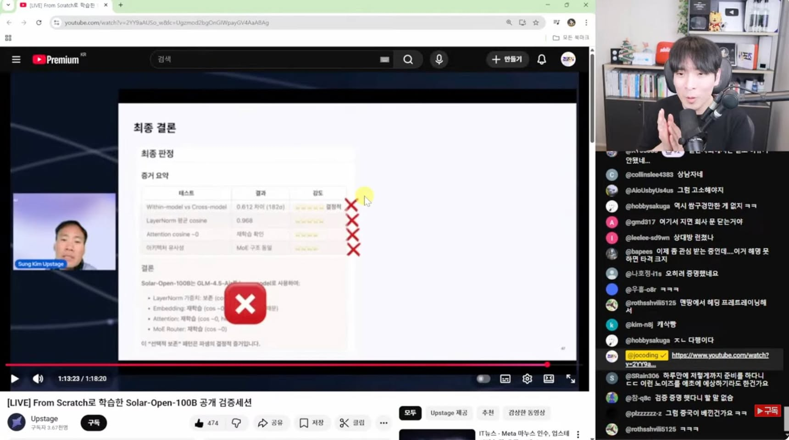
**이미지 캡션:** 화면 왼쪽에는 유튜브 영상 플레이어가 보이며, 영상에는 성인 남성이 출연하고 있다. 그는 검은색 상의를 입고 있으며, 마이크 앞에 앉아 손을 모으고 이야기하고 있다. 영상의 주요 내용은 "From Scratch로 학습한 Solar-Open-100B 공개 검증세션"이며, 화면 중앙에는 "최종 결론"이라는 제목과 함께 여러 항목에 대한 테스트 결과가 표로 정리되어 있다. 일부 항목에는 빨간색 X 표시가 되어 있어 결과가 좋지 않음을 나타낸다. 화면 오른쪽에는 실시간 채팅창이 보이며, 여러 사용자들이 영상 내용에 대한 댓글을 남기고 있다. 전반적으로 기술적인 내용을 다루는 온라인 강의 또는 발표 영상의 일부로 보인다.

### 1월 5일 (월) 13:19 · 📷 사진 (1장)

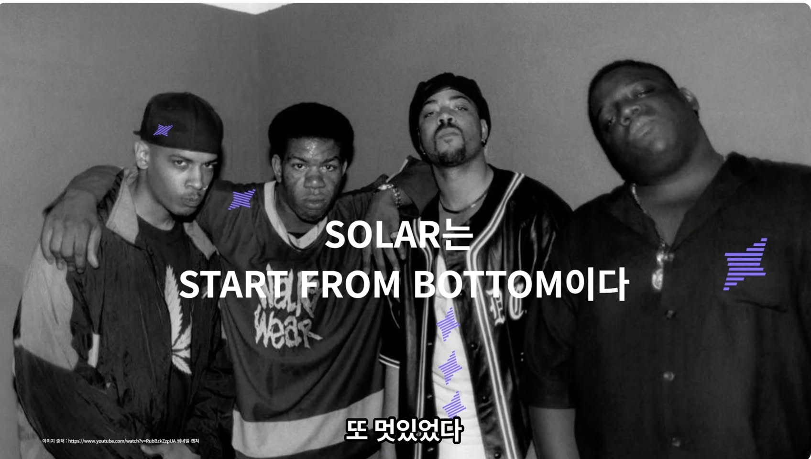
**이미지 캡션:** 이 흑백 사진에는 네 명의 성인 남성이 어깨를 나란히 하고 서 있는 모습이 담겨 있습니다. 왼쪽에서 두 번째 남성은 검은색 야구 모자를 쓰고 있으며, 그의 얼굴은 약간 찡그린 표정입니다. 그는 회색과 검은색이 섞인 재킷을 입고 있습니다. 바로 옆에 있는 남성은 붉은색과 검은색이 섞인 스포츠 저지를 입고 있으며, 그의 표정은 무표정합니다. 세 번째 남성은 검은색 야구 재킷을 입고 있으며, 그의 얼굴은 약간 위로 향해 있습니다. 가장 오른쪽에 있는 남성은 검은색 셔츠를 입고 있으며, 그의 얼굴은 정면을 향하고 있습니다. 네 사람 모두 20대에서 30대로 보이며, 힙합 문화와 관련된 복장을 하고 있습니다. 배경은 어두운 벽으로 단순하며, 사진에는 "SOLAR는 START FROM BOTTOM이다"와 "또 멋있었다"라는 한국어 텍스트가 흰색으로 겹쳐져 있습니다. 또한, 사진 곳곳에 보라색의 추상적인 문양이 삽입되어 있습니다. 전체적으로 강렬하고 자신감 있는 분위기를 풍깁니다.

### 1월 5일 (월) 22:11 · 저를 리얼 힙합이라고 부르시면서 쇼쳐 하나로 "SOLAR는 START F…

저를 리얼 힙합이라고 부르시면서 쇼쳐 하나로 "SOLAR는 START FROM BOTTOM(SCRATCH)!"이라고 딱 정리해주시네요.
https://youtube.com/shorts/AJ5VaMHYHG8?si=PFz5SgM_a5RgdG86

THISISJUSTHIS 9분 VS THISISSOLAR100B 78분도 재미있네요.

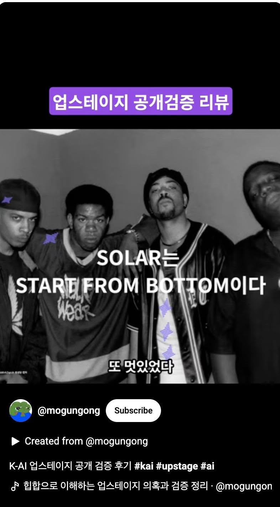
**이미지 캡션:** 이 사진은 네 명의 성인 남성이 함께 서 있는 모습을 담고 있으며, 흑백 톤으로 처리되어 있습니다. 왼쪽부터 첫 번째 남성은 검은색 모자를 쓰고 있으며, 두 번째 남성은 검은색과 파란색이 섞인 운동복 상의를 입고 있고, 세 번째 남성은 야구 재킷을 걸치고 있으며, 네 번째 남성은 얼굴의 일부만 보입니다. 세 번째 남성의 얼굴에는 수염이 있고, 그는 약간 위를 올려다보고 있습니다. 사진 중앙에는 "SOLAR는 START FROM BOTTOM이다"라는 흰색 글자가 크게 쓰여 있고, 그 아래에는 "또 멋있었다"라는 문구가 있습니다. 사진 상단에는 보라색 배경에 "업스테이지 공개검증 리뷰"라는 문구가 있습니다. 전반적으로 힙합 문화나 음악과 관련된 분위기를 풍기며, 젊은 남성들의 자신감 있고 당당한 모습을 보여주는 듯합니다. 사진 하단에는 유튜브 채널 정보와 관련 해시태그가 표시되어 있습니다.
 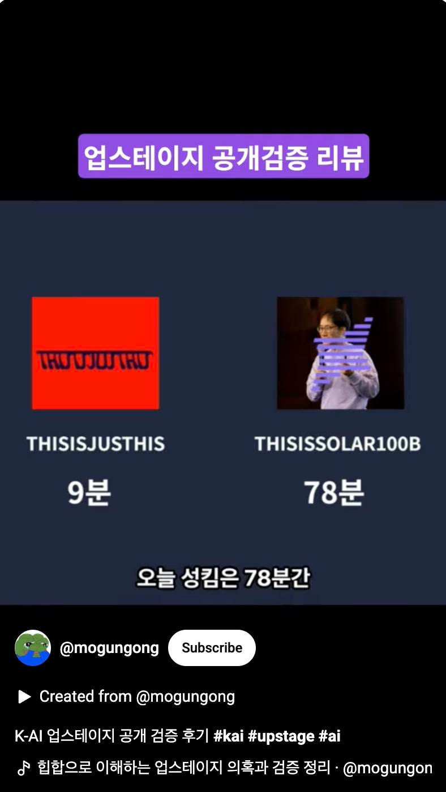
**이미지 캡션:** 화면 상단에는 보라색 배경에 흰색 글씨로 "업스테이지 공개검증 리뷰"라는 문구가 적혀 있습니다. 그 아래에는 두 개의 영상 썸네일이 나란히 배치되어 있습니다. 왼쪽 썸네일은 빨간색 사각형 안에 흰색 글씨로 "THUUJUJU THU"라고 쓰여 있으며, 그 아래에는 "THISISJUSTTHIS"와 "9분"이라는 글자가 있습니다. 오른쪽 썸네일에는 안경을 쓴 성인 남성이 연보라색 옷을 입고 무대 위에서 발표하는 모습이 담겨 있으며, 그의 앞에는 보라색 그래프가 떠 있습니다. 이 썸네일 아래에는 "THISISSOLAR100B"와 "78분"이라는 글자가 있습니다. 두 썸네일 아래에는 "오늘 성김은 78분간"이라는 문구가 검은색 바탕에 흰색 글씨로 적혀 있습니다. 화면 하단에는 초록색 프로필 사진과 함께 "@mogungong"이라는 사용자 이름이 보이고, 그 옆에는 "Subscribe" 버튼이 있습니다. 그 아래에는 "Created from @mogungong"이라는 문구와 함께 "K-AI 업스테이지 공개 검증 후기 #kai #upstage #ai"라는 해시태그가 포함된 설명이 있습니다. 마지막으로 "♪ 힙합으로 이해하는 업스테이지 의혹과 검증 정리 · @mogungon"이라는 문구가 보입니다. 전반적으로 유튜브 영상의 일부 화면으로 보이며, 업스테이지라는 서비스에 대한 공개 검증 리뷰를 다루는 내용으로 추정됩니다.

### 1월 6일 (화) 06:26 · #SolarOpen100B 테크리포트 정부 지원으로 처음으로 100B 사…

#SolarOpen100B 테크리포트 정부 지원으로 처음으로 100B 사이즈의 from scratch LLM을 만들어 보면서 그 과정과 노하우, 어려움과 이를 극복한 이야기를 담아보았습니다. https://huggingface.co/upstage/Solar-Open-100B/blob/main/solar-open-technical-report.pdf 

아래 4가지 중요 포인터입니다.
1. 다양한 reasoning path 데이터 생성: 적은 양의 데이터지만 학습이 더 잘되게 하는 데이터 생성 방법론을 개발했습니다.

2. 새로운 RL framework, SnapPO: 그동안 한 번에 연결해서 진행하던 데이터 생성 ↔ 보상 계산 ↔ 학습을 독립적으로 진행해 26% 이상의 학습 효율성이 있습니다.

3. 한국어 특화 토크나이저 및 추론 효율: 맞춤형 BPE 토크나이저를 도입해 숫자·코드·과학식 표현을 단일 토큰으로 처리하고, whitespace-preservation 규칙을 적용했습니다. 결과적으로 한국어 Bytes-Per-Token 4.69 B(gpt-oss 대비 +34 %)를 달성해, 추론 시 토큰 압축률·속도가 크게 개선되었습니다.

4.10 B ‑ A1 B A/B 테스팅을 통한 Solar-Open-Moe 구조 설계: gpt‑oss‑120b, Qwen‑3‑235B‑A22B, GLM‑4.5, DeepSeek‑V3 등 100 B급 MoE 모델을 참고하여 10 B ‑ A1 B(활성 파라미터 1 B) 프로토타입을 만들어 히든 사이즈, 중간 사이즈, 레이어 수, 전문가 수, Top‑k 등을 A/B 테스트하면서 결정. 히든 사이즈 4096, 중간 사이즈 10240, MoE 중간 사이즈 1280 (계산 효율·표현력 균형). 전문가 129개 (128 라우팅+1 공유) → 라우팅 불균형 방지를 위해 shared expert 도입. Top‑k=8 → 1 token당 8개 전문가만 활성화 → 활성 파라미터 12 B. Dense 레이어 없이 전체 MoE로 설계 → 구조 단순화·학습 안정성 확보. SiLU 활성화, ROPE 위치 임베딩 등 최신 옵티멀리티 적용.

이렇게 Tech report를 공개하는 것은 이것이 완벽하기 때문이 아닙니다. 나름 저희가 Solar-Open-100B를 만든 과정을 최선을 다해 작성했지만 설명이 분명하지 않거나, 내용이 틀리거나 빠진 것이 있을 수 있습니다. 특히 related work에 여러분들의 논문 reference 등 중요한 것을 빠뜨렸을 수도 있습니다. 그래서 틀린 부분 등 포함하여 여러분들의 피드백을 받기 위함인데요. 의견을 반영하여 v2, v3 등으로 발전시켜 나가겠습니다. 1차 의견을 받고 1월 12일 v1을 아카이빙할 예정입니다.

이번 tech report에 주간 미팅을 하면서 모델 학습을 같이 고민해주시고 조언해주신 공저자 교수님들께도 큰 감사드립니다.

Du-Seong Chang (Department of Artificial Intelligence, Sogang University), Kyunghyun Cho (New York University), Junsuk Choe (Sogang University), Hwaran Lee (Sogang University), Jae-Gil Lee (KAIST), Kyungtae  Lim (KAIST), Alice Oh (KAIST)

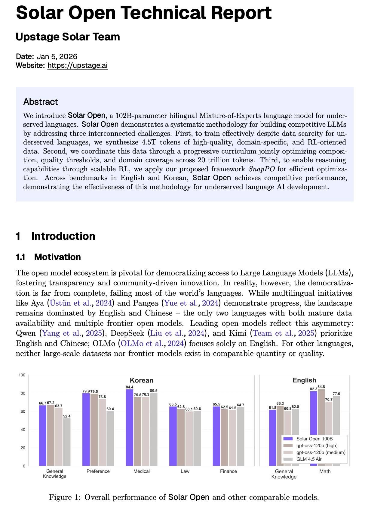
**이미지 캡션:** 이 이미지는 "Solar Open Technical Report"라는 제목의 문서의 일부로, "Upstage Solar Team"에서 작성했으며 2026년 1월 5일에 게시되었습니다. 문서의 초록 부분에는 "Solar Open"이라는 102B 매개변수 이중 언어 Mixture-of-Experts 언어 모델을 소개하며, 이 모델은 언더서브드 언어에 대한 효과적인 훈련을 목표로 합니다. 또한, 고품질, 도메인 특화, RL 지향 토큰 4.5T를 합성하고, 20조 토큰에 걸쳐 점진적인 커리큘럼을 통해 데이터를 조정하며, 확장 가능한 RL을 통해 추론 능력을 향상시키는 프레임워크 "SnapPO"를 적용한다고 설명합니다. 이어지는 "1 Introduction" 섹션에서는 개방형 모델 생태계가 LLM 접근성을 민주화하는 데 중요하지만, 현재는 영어와 중국어에 편중되어 있으며, 다른 언어에 대한 대규모 데이터셋이나 프론티어 모델이 부족하다는 점을 지적합니다. 이미지 하단에는 "Figure 1: Overall performance of Solar Open and other comparable models."라는 캡션과 함께 한국어와 영어에 대한 여러 모델의 성능을 비교하는 막대 그래프가 있습니다. 그래프는 "General Knowledge", "Preference", "Medical", "Law", "Finance" (한국어) 및 "General Knowledge", "Math" (영어)와 같은 범주별로 "Solar Open 102B", "gpt-oss-120b (high)", "gpt-oss-120b (medium)", "GLM 4.5 Air" 모델의 성능을 보여줍니다. 그래프의 막대에는 각 모델의 구체적인 성능 수치가 표시되어 있습니다. 전반적으로 이 이미지는 기술 보고서의 일부로, 새로운 언어 모델의 소개와 그 성능 평가를 담고 있습니다.
 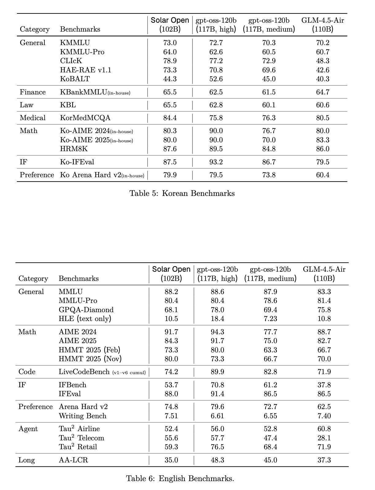
**이미지 캡션:** 이 이미지는 두 개의 표를 포함하고 있으며, 각각 "Table 5: Korean Benchmarks"와 "Table 6: English Benchmarks"라는 제목이 붙어 있습니다. 각 표는 "Category"와 "Benchmarks"라는 두 개의 열로 구성되어 있으며, 여러 AI 모델의 성능을 나타내는 수치들이 다른 열에 표시되어 있습니다. 표의 내용은 특정 벤치마크에 대한 각 모델의 점수를 보여주며, 모델 이름으로는 "Solar Open (102B)", "gpt-oss-120b (117B, high)", "gpt-oss-120b (117B, medium)", "GLM-4.5-Air (110B)" 등이 있습니다. 표의 배경은 흰색이며, 텍스트는 검은색으로 되어 있습니다. 이 이미지는 AI 모델의 성능 비교를 위한 학술적이거나 기술적인 문서의 일부로 보입니다.
 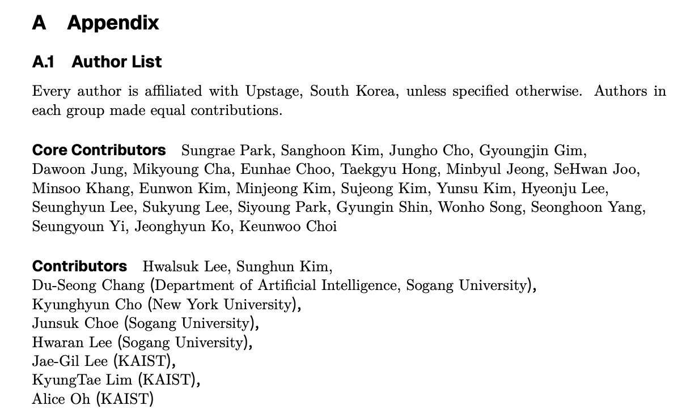
**이미지 캡션:** 이 사진은 문서의 일부로, "A Appendix"라는 제목과 "A.1 Author List"라는 부제목이 보입니다. 그 아래에는 "Every author is affiliated with Upstage, South Korea, unless specified otherwise. Authors in each group made equal contributions."라는 문장이 있습니다. 이어서 "Core Contributors"라는 제목 아래에 Sungrae Park, Sanghoon Kim, Jungho Cho, Gyoungjin Gim, Dawoon Jung, Mikyoung Cha, Eunhae Choo, Taekgyu Hong, Minbyul Jeong, SeHwan Joo, Minsoo Khang, Eunwon Kim, Minjeong Kim, Sujeong Kim, Yunsu Kim, Hyeonju Lee, Seunghyun Lee, Sukyoung Lee, Siyoung Park, Gyungin Shin, Wonho Song, Seonghoon Yang, Seungyoun Yi, Jeonghyun Ko, Keunwoo Choi 등 다수의 이름이 나열되어 있습니다. 마지막으로 "Contributors"라는 제목 아래에 Hwalsuk Lee, Sunghun Kim, Du-Seong Chang (Department of Artificial Intelligence, Sogang University), KyungHyun Cho (New York University), Junsuk Choe (Sogang University), Hwaran Lee (Sogang University), Jae-Gil Lee (KAIST), KyungTae Lim (KAIST), Alice Oh (KAIST) 등의 이름과 소속이 나열되어 있습니다. 전체적으로 학술 논문이나 보고서의 저자 목록 부분으로 보이며, 흰색 배경에 검은색 텍스트로 구성되어 있습니다.

### 1월 6일 (화) 11:46 · Solar Open 100B - Tech Report Live Readi…

Solar Open 100B - Tech Report Live Reading Session에 여러분 모두를 초대합니다.

저희가 정부의 지원을 받아 첫 from scratch로 100B Solar-Open을 만들었습니다. 개발 노하우를 담은 Tech-report를 함께 읽으며 여러분의 질문과 추가 아이디어들에 대해 토론하는 자리를 마련했습니다. Reader로는 테크 리포트 주 저자이신 업스테이지 최근우 박사님께서 수고해 주실 예정입니다.

* 일시: 화요일 13일 KST 오전 10AM
* 장소: Youtube Live + Slido (오픈 Q&A) 등록하시면 안내드립니다. 
* 등록: https://docs.google.com/forms/d/e/1FAIpQLSd366lNIdyPcPCVHNnDjfgw1539KOlC7iuDhJFTUF2jxh0BHg/viewform 선등록 후고민. 

아래를 미리 하시고 오시면 더 좋습니다.
 1. https://huggingface.co/upstage/Solar-Open-100B/blob/main/solar-open-technical-report.pdf 일독하기
 2. 질문이나 추가 아이디어 하나 이상 
 3. (옵셔널) https://huggingface.co/upstage/Solar-Open-100B 라이크 누르기

오시는 분들 반갑게 뵙겠습니다.

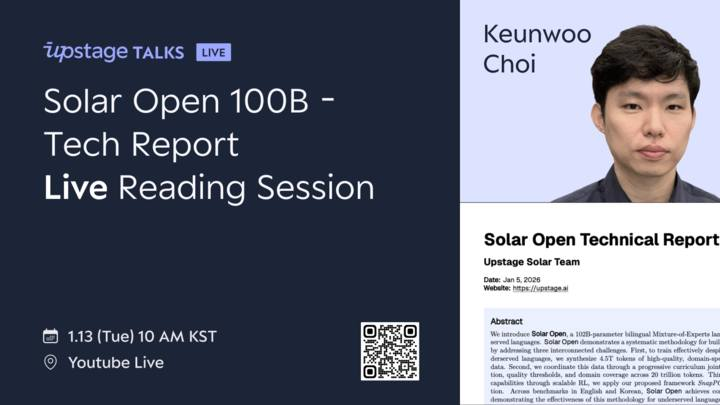
**이미지 캡션:** 이 이미지는 Upstage에서 주최하는 "Solar Open 100B - Tech Report Live Reading Session"이라는 온라인 행사 정보를 담고 있습니다. 왼쪽에는 행사의 제목과 "Upstage TALKS LIVE"라는 로고, 그리고 행사 날짜와 시간(1.13 (Tue) 10 AM KST) 및 장소(Youtube Live) 정보가 표시되어 있습니다. 또한 QR 코드가 있어 행사 참여나 정보 확인에 활용될 수 있습니다. 오른쪽 상단에는 Keunwoo Choi라는 이름과 함께 그의 사진이 배치되어 있으며, 그는 20대 후반에서 30대 초반의 성인 남성으로 검은색 셔츠를 입고 정면을 응시하고 있습니다. 그의 표정은 진지하고 차분해 보입니다. 오른쪽 하단에는 "Solar Open Technical Report"라는 제목과 함께 Upstage Solar Team이 발표한 기술 보고서의 초록(Abstract)이 영어로 작성되어 있습니다. 보고서는 102B 매개변수 이중 언어 Mixture-of-Experts 모델인 Solar Open에 대한 소개와 그 성능에 대한 내용을 담고 있습니다. 전반적으로 이 이미지는 기술 관련 온라인 세미나 또는 발표회에 대한 정보를 전달하는 홍보 자료로 보이며, 차분하고 전문적인 분위기를 풍깁니다.

### 1월 7일 (수) 00:11 · 허깅페이스 Top 10 Trending Models 에 이번 국가대표 모…

허깅페이스 Top 10 Trending Models 에 이번 국가대표 모델이 2개나 있어서 너무 좋습니다. https://huggingface.co/upstage/Solar-Open-100B 많이 사용해 주시고 ❤️ 많이 부탁드립니다!

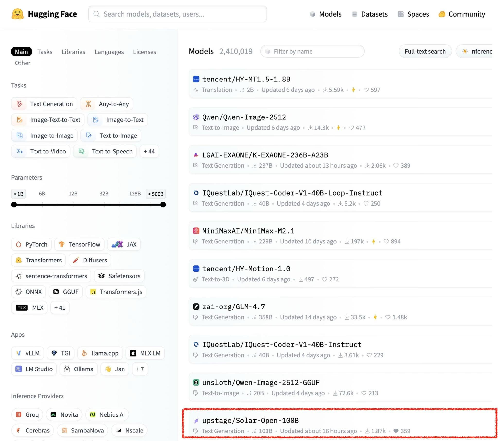
**이미지 캡션:** 이 이미지는 Hugging Face 웹사이트의 모델 검색 결과 페이지를 보여줍니다. 화면 중앙에는 다양한 AI 모델 목록이 표시되며, 각 모델은 이름, 태스크 유형, 크기, 업데이트 날짜, 다운로드 수, 좋아요 수 등의 정보와 함께 나열됩니다. 왼쪽 사이드바에는 모델을 필터링할 수 있는 다양한 옵션이 있습니다. 태스크별 필터로는 텍스트 생성, 이미지-텍스트 변환 등이 있으며, 파라미터 크기별 필터로는 1B 미만부터 500B 초과까지 선택할 수 있습니다. 또한, PyTorch, TensorFlow, JAX와 같은 라이브러리별 필터와 vLLM, TGI, llama.cpp와 같은 앱별 필터도 제공됩니다. 이 페이지는 사용자가 원하는 AI 모델을 효율적으로 찾고 탐색할 수 있도록 설계되었습니다.

### 1월 7일 (수) 06:27 · #안될과학 에서  가 From Scratch라고 해명한 부분에 대해 소개…

#안될과학 에서 https://huggingface.co/upstage/Solar-Open-100B 가 From Scratch라고 해명한 부분에 대해 소개해주셨습니다. 와~ 설명이 정말 깔끔하네요.

1. 의혹이 제기되자마자 빠르게 검증했고 바로 당일 공식 해명 이벤트 공지(바로 다음 날 공개 검증 행사 진행)
2. From scratch 설명: 구조는 어느 정도 유사하지만 가중치를 100% 새로 학습했나?
3. 라이선스는 누락된 부분을 빠르게 fix 후 사과
4. 결론은 해피엔딩: 의혹 당사자 사과 후 업스테이지 사과 수용

를 아주 정확하게 설명해주시네요. 감사합니다! https://youtu.be/N-y56s02tfc?si=U4m6h11R_0oKnkg4&t=1130

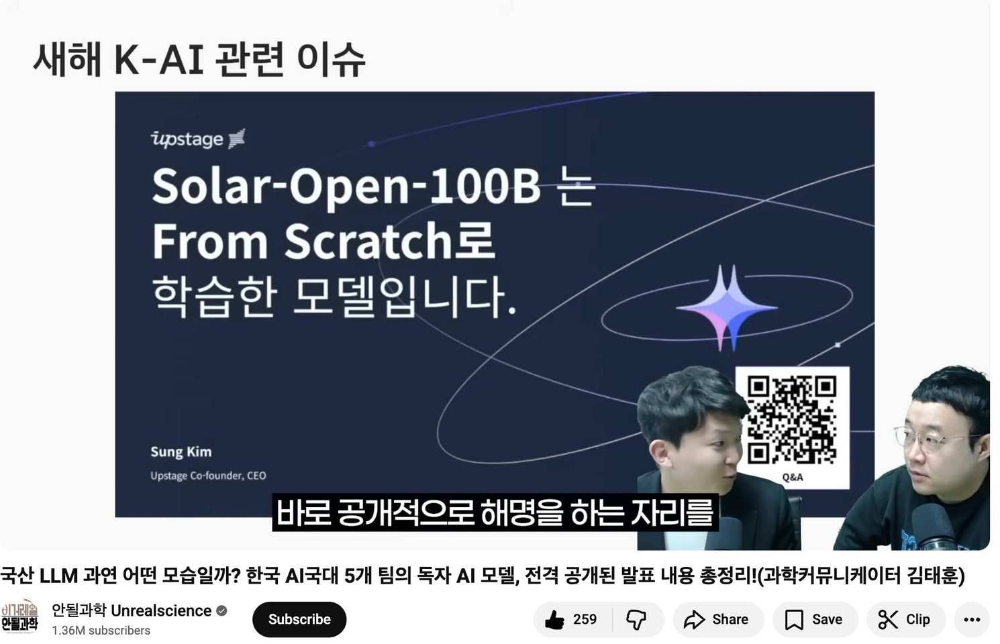
**이미지 캡션:** 화면 상단에는 "새해 K-AI 관련 이슈"라는 제목이 보이며, 그 아래에는 "upstage" 로고와 함께 "Solar-Open-100B 는 From Scratch로 학습한 모델입니다."라는 문구가 흰색 글씨로 쓰여 있습니다. 이 문구는 파란색 배경에 우주를 연상시키는 그래픽과 함께 표시되어 있습니다. 화면 중앙에는 두 명의 성인 남성이 등장합니다. 왼쪽 남성은 검은색 재킷을 입고 있으며, 그의 이름은 "Sung Kim"으로 표시되어 있고 직책은 "Upstage Co-founder, CEO"입니다. 그는 약간 고개를 숙이고 상대방을 바라보며 이야기하는 듯한 표정을 짓고 있습니다. 오른쪽 남성은 검은색 후드티를 입고 있으며, 안경을 쓰고 있습니다. 그는 왼쪽 남성을 바라보며 진지한 표정을 짓고 있습니다. 두 사람 사이에는 QR 코드가 있고, 그 아래에는 "Q&A"라는 글자가 보입니다. 화면 하단에는 "바로 공개적으로 해명을 하는 자리를"이라는 검은색 배경의 흰색 글씨가 있습니다. 그 아래에는 유튜브 영상의 제목으로 보이는 "국산 LLM 과연 어떤 모습일까? 한국 AI국대 5개 팀의 독자 AI 모델, 전격 공개된 발표 내용 총정리!(과학커뮤니케이터 김태훈)"라는 긴 문구가 있습니다. 영상 채널 이름은 "안될과학 Unrealscience"이며, 구독자 수는 1.36M입니다. 영상 하단에는 좋아요, 싫어요, 공유, 저장, 클립 등의 아이콘과 함께 좋아요 수가 259개로 표시되어 있습니다. 전반적으로 AI 기술 발표 및 관련 이슈에 대한 토론이나 설명이 이루어지는 온라인 콘텐츠의 일부로 보입니다.
 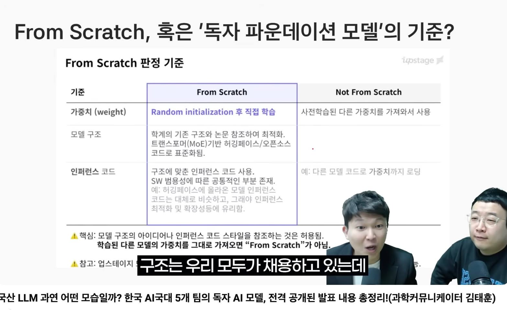
**이미지 캡션:** 화면 상단에는 "From Scratch, 혹은 '독자 파운데이션 모델'의 기준?"이라는 제목이 크게 쓰여 있고, 그 아래에는 "From Scratch 판정 기준"이라는 소제목과 함께 표가 제시되어 있다. 표는 '기준', 'From Scratch', 'Not From Scratch' 세 개의 열로 나뉘어 있으며, '가중치(weight)', '모델 구조', '인퍼런스 코드' 등의 기준에 따라 두 가지 방식을 비교 설명하고 있다. 'From Scratch' 열에는 'Random initialization 후 직접 학습', '학계의 기존 구조와 논문 참고하여 최적화. 트랜스포머(MoE)기반 허깅페이스/오픈소스 코드로 표준화됨.', '구조에 맞춘 인퍼런스 코드 사용. SW 범용성에 따른 공통적인 부분 존재. 예: 허깅페이스에 올라온 모델 인퍼런스 코드는 대체로 비슷하고, 그래야 인퍼런스 최적화 및 확장성에 유리함.'이라고 적혀 있다. 'Not From Scratch' 열에는 '사전학습된 다른 가중치를 가져와서 사용', '예: 다른 모델 코드로 가중치까지 로딩'이라고 적혀 있다. 표 아래에는 노란색 경고 표시와 함께 "핵심: 모델 구조의 아이디어나 인퍼런스 코드 스타일을 참고하는 것은 허용됨. 학습된 다른 모델의 가중치를 그대로 가져오면 “From Scratch”가 아님."이라는 내용이 강조되어 있다. 또한 "참고: 업스테이지"라는 문구와 함께 검은색 바탕에 흰색 글씨로 "구조는 우리 모두가 채용하고 있는데"라는 문구가 크게 쓰여 있다. 화면 오른쪽에는 두 명의 성인 남성이 등장하는데, 왼쪽 남성은 검은색 재킷을 입고 마이크를 보며 놀란 표정으로 입을 벌리고 있고, 오른쪽 남성은 검은색 맨투맨 티셔츠를 입고 안경을 쓴 채 차분한 표정으로 왼쪽 남성을 바라보고 있다. 화면 하단에는 "국산 LLM 과연 어떤 모습일까? 한국 AI 국대 5개 팀의 독자 AI 모델, 전격 공개된 발표 내용 총정리!(과학커뮤니케이터 김태훈)"라는 문구가 보인다. 전반적으로 AI 모델 개발 방식에 대한 발표 자료의 일부로 보이며, 진지하면서도 흥미로운 분위기를 자아낸다.
 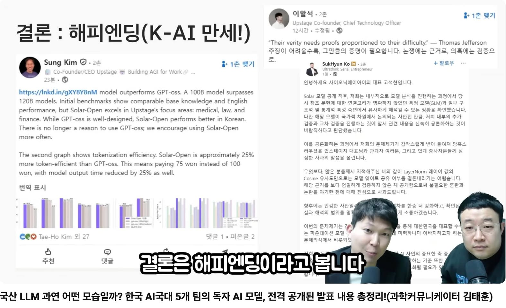
**이미지 캡션:** 이 사진은 한국어로 된 소셜 미디어 게시물로, "결론: 해피엔딩(K-AI 만세!)"이라는 제목이 크게 쓰여 있습니다. 왼쪽에는 Sung Kim이라는 이름의 성인 남성이 Co-Founder/CEO Upstage, Building AGI for Work라는 직책과 함께 게시물을 올린 것으로 보이며, 그의 프로필 사진과 함께 23분 전 게시물임을 나타냅니다. 게시물 내용은 한국어와 영어로 작성되었으며, GPT-oss 모델보다 Solar-Open 모델이 한국어 성능에서 더 뛰어나다는 내용과 함께 토큰 효율성 그래프가 포함되어 있습니다. 오른쪽에는 이활석이라는 이름의 성인 남성이 Upstage Co-founder, Chief Technology Officer로 소개되어 있으며, 그의 프로필 사진과 함께 12시간 전 게시물임을 나타냅니다. 또한 SukHyun Ko라는 이름의 성인 남성이 Ultrathink Serial Entrepreneur로 소개되어 있으며, 그의 프로필 사진과 함께 1일 전 게시물임을 나타냅니다. 이 게시물은 Solar 모델 개발 후 진행한 분석 결과와 관련된 내용으로 보이며, 한국 AI 기업들의 발전에 대한 기대감을 표현하고 있습니다. 사진 하단에는 두 명의 성인 남성이 등장하며, 한 명은 카메라를 응시하고 있고 다른 한 명은 무언가를 설명하는 듯한 표정을 짓고 있습니다. 배경에는 그래프와 텍스트가 포함된 여러 이미지들이 보이며, 전반적으로 기술 및 AI 분야에 대한 논의가 이루어지고 있는 분위기입니다.

### 1월 7일 (수) 13:52 · Henny Son Upstage AI 교육 부분 대표님의 세바시 강연이 …

Henny Son Upstage AI 교육 부분 대표님의 세바시 강연이 25만뷰를 넘어 50만, 100만으로 달리고 있습니다. 내용도 좋고요. 저도 많이 배웠습니다. AI 시대 어떻게 살아야 할지, Henny Son 대표님의 영상, 필수 시청으로 추천드립니다. https://www.youtube.com/watch?v=8UK7MJp2jFc

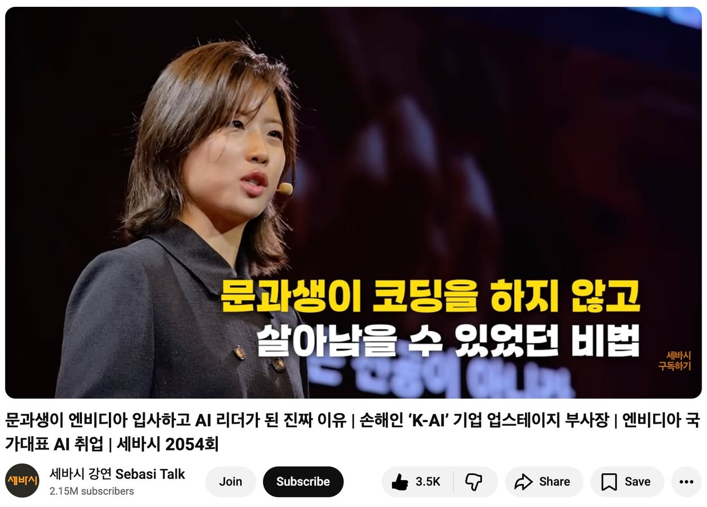
**이미지 캡션:** 이 사진은 강연 중인 한 성인 여성의 모습을 담고 있으며, 그녀는 30대 후반에서 40대 초반으로 보이며 갈색 단발머리에 깔끔한 검은색 재킷을 입고 있다. 마이크가 입 근처에 있어 강연 중임을 알 수 있으며, 그녀는 약간 고개를 기울이고 무언가를 설명하는 듯한 표정을 짓고 있다. 배경은 어둡고 흐릿한 조명으로 처리되어 있으며, 무대 위에서 강연하는 듯한 분위기를 연출한다. 사진 중앙에는 노란색과 흰색 글씨로 "문과생이 코딩을 하지 않고 살아남을 수 있었던 비법"이라는 제목이 크게 쓰여 있고, 그 아래에는 "세바시 강연 Sebasi Talk"이라는 채널명과 구독자 수, 그리고 좋아요, 구독, 공유, 저장 등의 유튜브 인터페이스 요소들이 보인다. 전체적으로 전문적이고 정보 전달에 초점을 맞춘 강연 영상의 썸네일 이미지로 보인다.

### 1월 8일 (목) 08:02 · #글로벌 #AI3강 바로 앞에 있습니다! Clem Delangue 허깅페…

#글로벌 #AI3강 바로 앞에 있습니다! Clem Delangue 허깅페이스 대표가 직접 태극기까지 이미지에 붙여서 홍보해주고, https://huggingface.co/upstage/Solar-Open-100B Tech report가 훌륭하다고 칭찬을 받고, Reasoning ability가 매우 중요한데 잘한다고 평가받고 있습니다. 너무 멋진 일입니다.

"very nice tech report from upstage for solar 100b"
"It almost passed all my private reasoning tests，Reasoning ability is comparable to GPT-OSS 120B."
"South Korea has 3 trending models on Hugging Face these days as a result to their state support for open-source AI."

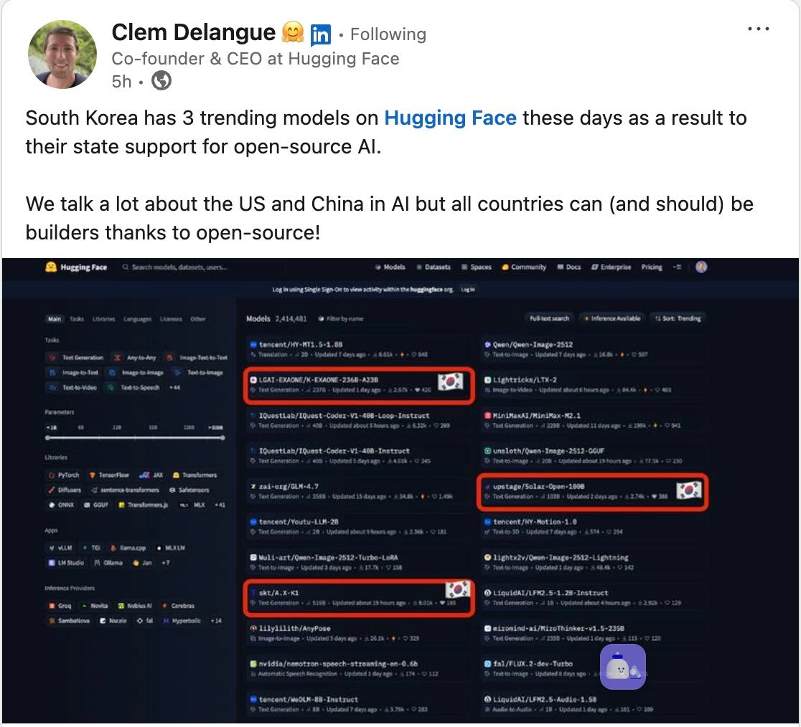
**이미지 캡션:** 사진에는 Hugging Face의 공동 창립자이자 CEO인 Clem Delangue가 한국어로 작성된 트윗과 함께 등장합니다. 그는 흰색 티셔츠를 입고 있으며, 배경에는 Hugging Face 웹사이트의 스크린샷이 보입니다. 스크린샷에는 다양한 AI 모델, 데이터셋, 사용자에 대한 정보가 표시되어 있으며, 특히 한국 국기가 포함된 몇몇 모델들이 강조되어 있습니다. 트윗 내용은 한국이 오픈소스 AI에 대한 국가적 지원 덕분에 Hugging Face에서 3개의 인기 모델을 보유하고 있다는 점을 언급하며, 미국과 중국뿐만 아니라 모든 국가가 오픈소스 덕분에 AI 빌더가 될 수 있다고 말하고 있습니다.
 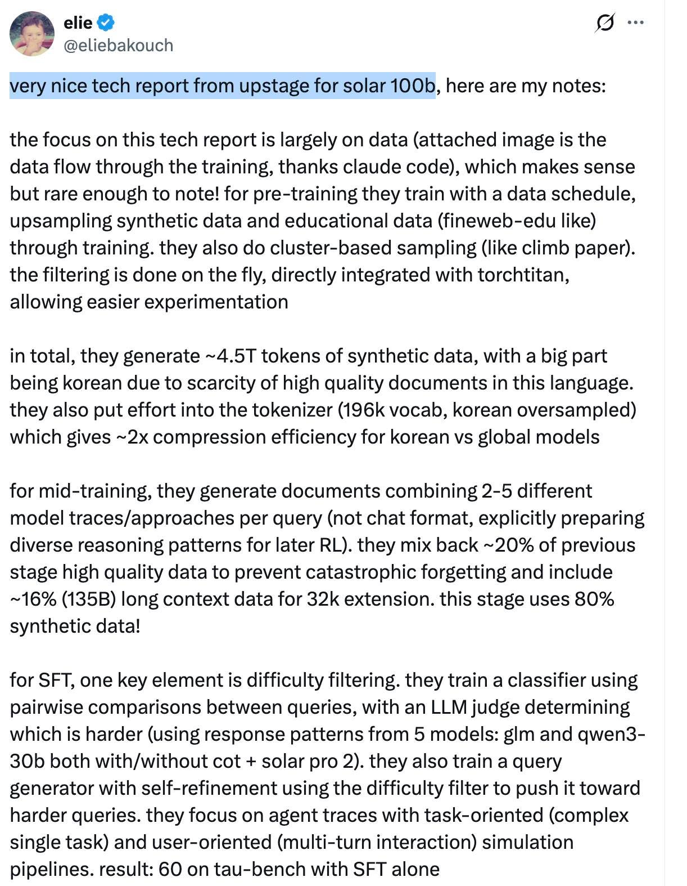
**이미지 캡션:** 이 사진은 한 명의 성인 여성으로 보이는 인물이 올린 트윗의 일부를 캡처한 것으로, 그녀의 프로필 사진에는 어린 소녀의 모습이 담겨 있다. 그녀는 파란색 체크 표시와 함께 "@eliebakouch"라는 사용자 이름을 사용하고 있으며, "elie"라는 이름으로 자신을 소개하고 있다. 그녀는 "very nice tech report from upstage for solar 100b, here are my notes:"라는 문구로 시작하여, 업스테이지의 "solar 100b" 모델에 대한 기술 보고서에 대한 자신의 메모를 공유하고 있다. 사진의 배경은 흰색이며, 텍스트는 검은색으로 작성되어 있다. 텍스트 내용은 인공지능 모델 학습에 사용되는 데이터의 종류, 양, 처리 방식, 그리고 특정 학습 단계에서의 전략에 대한 기술적인 설명으로 이루어져 있다. 전반적으로 정보 전달에 초점을 맞춘 차분하고 전문적인 분위기를 띤다.
 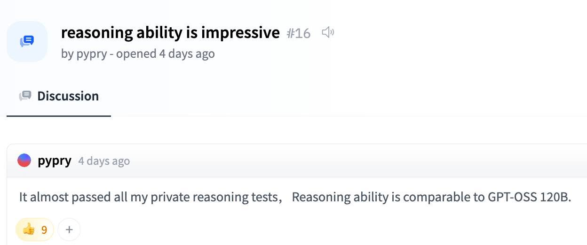
**이미지 캡션:** 이것은 온라인 토론 포럼의 스크린샷으로, "reasoning ability is impressive"라는 제목의 게시물이 표시됩니다. 게시물은 "pypry"라는 사용자가 4일 전에 작성했으며, #16이라는 번호가 붙어 있습니다. 게시물에는 "Discussion"이라는 섹션이 있으며, 그 아래에 "pypry"라는 사용자가 4일 전에 작성한 댓글이 있습니다. 댓글 내용은 "It almost passed all my private reasoning tests, Reasoning ability is comparable to GPT-OSS 120B."입니다. 댓글 아래에는 좋아요 표시와 함께 숫자 9가 표시되어 있으며, 추가적인 반응을 위한 '+' 버튼도 있습니다. 전반적으로 기술적인 주제에 대한 토론이 이루어지고 있는 것으로 보이며, 긍정적인 반응을 얻고 있는 상황입니다.

### 1월 8일 (목) 12:34 · #AI연구자가검증하는방법  를 많은 분이 사용해 주시고 테스트하던 중, …

#AI연구자가검증하는방법 https://huggingface.co/upstage/Solar-Open-100B 를 많은 분이 사용해 주시고 테스트하던 중, 우리가 84점으로 report한 AIME25 벤치마크가 아무리 돌려도 72~74밖에 안 나온다는 discussion이 올라왔습니다.

이럴 때 정말 진땀이 납니다. 우리가 뭔가 실수한 것 아닌지? 어디서 문제가 있었던 것인지? 다행히도 이분이 친절하게 본인은 어떤 옵션을 사용했고 어떤 결과가 나왔는지 자세히 정리해 주셨습니다.

저희 팀에서 이런 옵션을 사용해보면 어떨까 제안을 드렸는데요. 바로 실험해보시고는 85점이 나왔다고 축하한다고 답변을 주셨습니다. 저희는 84점으로 report했는데 1점 더 높게 나왔습니다.

정말 AI 연구자 커뮤니티 멋집니다!

https://huggingface.co/upstage/Solar-Open-100B/discussions/21

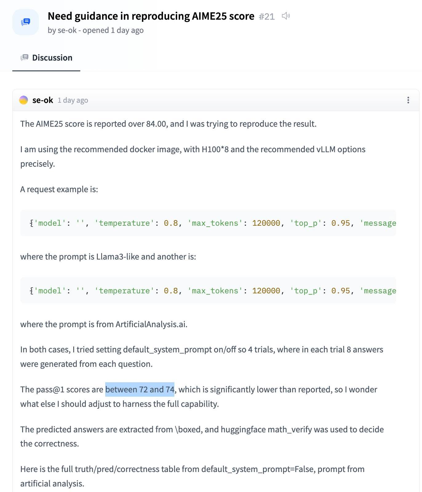
**이미지 캡션:** 이 이미지는 온라인 토론 포럼의 스크린샷으로, "se-ok"이라는 사용자 이름의 성인 남성이 AIME25 점수를 재현하는 데 도움을 요청하는 게시물을 올렸습니다. 배경은 흰색이며, 토론 게시판의 일반적인 레이아웃을 보여줍니다. 게시물은 AIME25 점수가 84.00 이상으로 보고되었지만, 사용자는 권장 도커 이미지와 vLLM 옵션을 사용하여 점수를 재현하는 데 어려움을 겪고 있다고 설명합니다. 사용자는 Llama3와 유사한 프롬프트 및 ArtificialAnalysis.ai에서 가져온 프롬프트에 대한 요청 예시를 제공하며, 각 프롬프트에 대해 8개의 답변이 생성되었다고 언급합니다. 사용자는 pass@1 점수가 72에서 74 사이로 보고된 것보다 현저히 낮다고 밝히며, 점수를 높이기 위해 조정해야 할 사항에 대해 질문합니다. 또한 예측 답변은 \boxed에서 추출되었고, hugginface math_verify가 정확성을 결정하는 데 사용되었다고 언급합니다. 전반적인 분위기는 기술적인 문제 해결에 대한 진지하고 탐구적인 분위기입니다.
 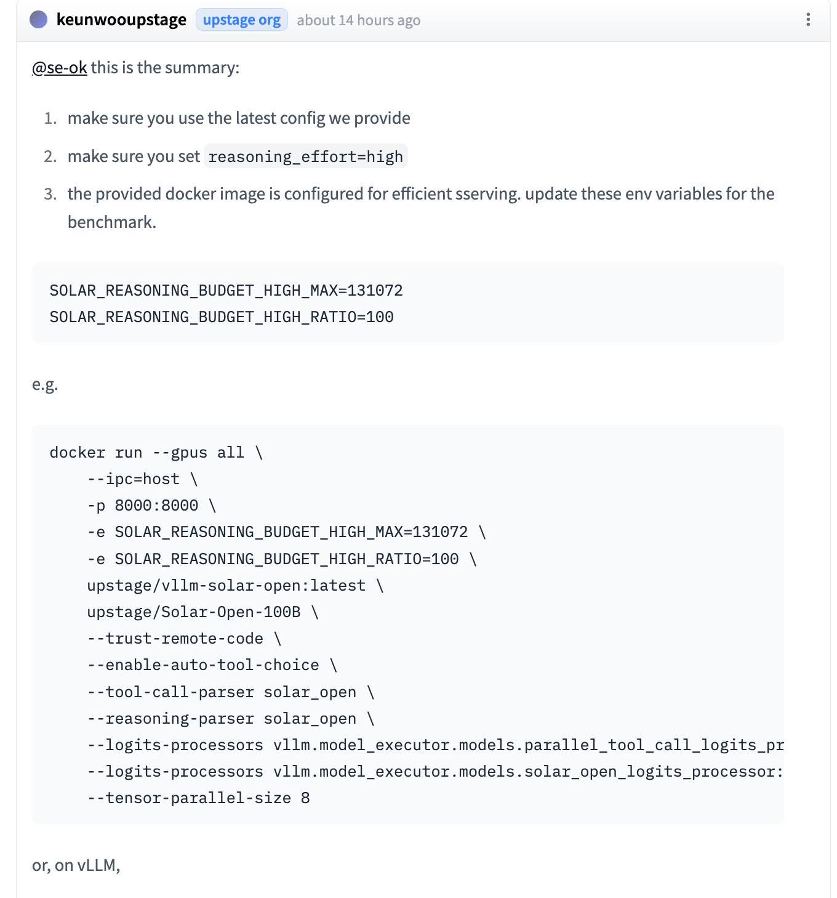
**이미지 캡션:** 이 이미지는 웹사이트의 스크린샷으로, 텍스트 기반의 정보가 주를 이룹니다. 상단에는 "keunwooupstage"라는 사용자 이름과 "upstage org"라는 그룹 이름, 그리고 "about 14 hours ago"라는 시간 정보가 표시되어 있습니다. 그 아래에는 "@se-ok"라는 사용자에게 보내는 메시지로 보이는 텍스트가 있으며, "this is the summary:"라는 문구로 시작합니다. 이어서 1번부터 3번까지 번호가 매겨진 요약 내용이 나열되어 있습니다. 1번은 "make sure you use the latest config we provide" (제공된 최신 설정을 사용하도록 하세요), 2번은 "make sure you set reasoning_effort=high" (reasoning_effort를 high로 설정하도록 하세요), 3번은 "the provided docker image is configured for efficient sserving. update these env variables for the benchmark." (제공된 도커 이미지는 효율적인 서빙을 위해 구성되어 있습니다. 벤치마크를 위해 이 환경 변수들을 업데이트하세요.)라는 내용입니다. 그 아래에는 `SOLAR_REASONING_BUDGET_HIGH_MAX=131072`와 `SOLAR_REASONING_BUDGET_HIGH_RATIO=100`이라는 환경 변수 설정이 표시되어 있습니다. 이어서 "e.g."라는 문구와 함께 도커 실행 명령어가 예시로 제시되어 있습니다. 이 명령어는 `--gpus all`, `--ipc=host`, `-p 8000:8000`, `-e SOLAR_REASONING_BUDGET_HIGH_MAX=131072`, `-e SOLAR_REASONING_BUDGET_HIGH_RATIO=100` 등의 옵션과 함께 `upstage/vllm-solar-open:latest`, `upstage/Solar-Open-100B` 이미지를 사용하며, `--trust-remote-code`, `--enable-auto-tool-choice`, `--tool-call-parser solar_open`, `--reasoning-parser solar_open`, `--logits-processors vllm.model_executor.models.parallel_tool_call_logits_pr`, `--logits-processors vllm.model_executor.models.solar_open_logits_processor:`, `--tensor-parallel-size 8`와 같은 추가적인 인자들을 포함하고 있습니다. 마지막으로 "or, on vLLM,"이라는 문구가 보입니다. 전반적으로 기술적인 내용을 담고 있으며, 특정 소프트웨어의 설정 및 실행 방법에 대한 안내로 보입니다. 배경은 흰색이며, 특별한 인물이나 사물은 보이지 않습니다.
 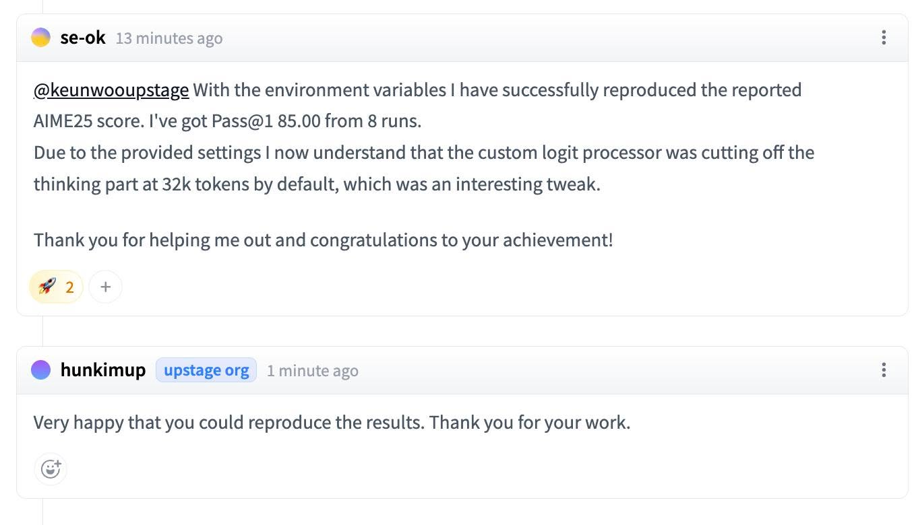
**이미지 캡션:** 화면에는 두 개의 댓글이 보입니다. 위쪽 댓글은 "se-ok"이라는 사용자 이름과 프로필 사진, 그리고 "13 minutes ago"라는 시간 정보가 표시되어 있습니다. 이 사용자는 "@keunwooupstage"라는 다른 사용자에게 답글을 달고 있으며, "환경 변수를 사용하여 보고된 AIME25 점수를 성공적으로 재현했습니다. 8번의 실행에서 Pass@1 85.00을 얻었습니다. 제공된 설정을 통해 사용자 지정 로짓 프로세서가 기본적으로 32k 토큰에서 사고 부분을 잘라내고 있었음을 이제 이해했습니다. 이는 흥미로운 조정이었습니다. 도와주셔서 감사하고 당신의 성과를 축하합니다!"라고 작성했습니다. 댓글 아래에는 로켓 이모티콘과 숫자 2, 그리고 더하기 기호가 보입니다. 아래쪽 댓글은 "hunkimup"이라는 사용자 이름과 프로필 사진, 그리고 "upstage org"라는 태그와 "1 minute ago"라는 시간 정보가 표시되어 있습니다. 이 사용자는 "결과를 재현할 수 있어서 매우 기쁩니다. 당신의 노고에 감사합니다."라고 작성했습니다. 댓글 아래에는 웃는 얼굴 이모티콘이 보입니다. 전반적으로 기술적인 주제에 대한 긍정적이고 협력적인 대화의 분위기입니다.

### 1월 8일 (목) 15:25 · Agentic LLM + Solar Open 100B - Tech Rep…

Agentic LLM + Solar Open 100B - Tech Report Live Reading Session 

Solar-Open 개발 노하우를 담은 Tech-report를 함께 읽을 뿐만 아니라 Microsoft AI Superintelligence Team에서 코딩을 위한 AI agent 모델의 연구 및 개발을 담당하고, Phi-3.5-MoE와 Phi-4-Multimodal 모델의 pre-training을 포함한 전체 모델 개발 과정을 리드한 Young-Jin Kim 박사님을 모시고 Agentic LLM에 대한 이야기를 나눕니다.

* 일시: 화요일 13일 KST 오전 10AM
* 장소: Youtube Live + Slido (오픈 Q&A) 등록하시면 안내드립니다. 
* 등록: https://docs.google.com/forms/d/e/1FAIpQLSd366lNIdyPcPCVHNnDjfgw1539KOlC7iuDhJFTUF2jxh0BHg/viewform

오시는 분들 반갑게 뵙겠습니다!

**이미지 캡션:** 이 이미지는 "upstage TALKS LIVE" 행사 포스터로, "Solar Open 100B- Tech Report Live Reading Session"이라는 제목의 행사를 홍보하고 있습니다. 포스터 상단에는 행사의 제목과 날짜 및 시간 정보가 명확하게 표시되어 있으며, 1부와 2부로 나뉘어 진행될 세션 내용도 간략하게 소개되어 있습니다. 1부에서는 "Tech Report Paper reading 30분 + QA 최근우 박사"가, 2부에서는 "Agentic LLM fireside chat 20분 + QA 김영진 박사, 최근우 박사"가 진행될 예정입니다. 포스터 왼쪽에는 두 명의 남성 발표자 사진이 배치되어 있으며, 상단에는 "Keunwoo Choi"라는 이름과 함께 중년 남성의 사진이, 하단에는 "YoungJin Kim"이라는 이름과 함께 중년 남성의 사진이 있습니다. 두 남성 모두 검은색 상의를 입고 있으며, 차분하고 진지한 표정을 짓고 있습니다. 포스터 오른쪽에는 "Solar Open Technical Report"라는 제목의 보고서 내용 일부가 발췌되어 있으며, 초록(Abstract)과 서론(Introduction) 섹션이 포함되어 있습니다. 보고서 내용은 영어로 작성되어 있으며, "Solar Open"이라는 새로운 언어 모델에 대한 설명과 그 중요성을 강조하고 있습니다. 전반적으로 전문적이고 정보 전달에 초점을 맞춘 행사 포스터의 분위기를 띠고 있습니다.

### 1월 8일 (목) 18:23 · Sung Kim shared a link.

🔗 <https://huggingface.co/upstage/Solar-Open-100B>

### 1월 9일 (금) 11:03 · 어제 허깅페이스에 이어 오늘은 무려 150만 이상의 팔로어를 가진 NV…

어제 허깅페이스에 이어 오늘은 무려 150만 이상의 팔로어를 가진 NVIDIA AI 에서 Upstage https://huggingface.co/upstage/Solar-Open-100B 포함 총 3개의 K-AI모델을 소개해주셨습니다. 너무 멋집니다.

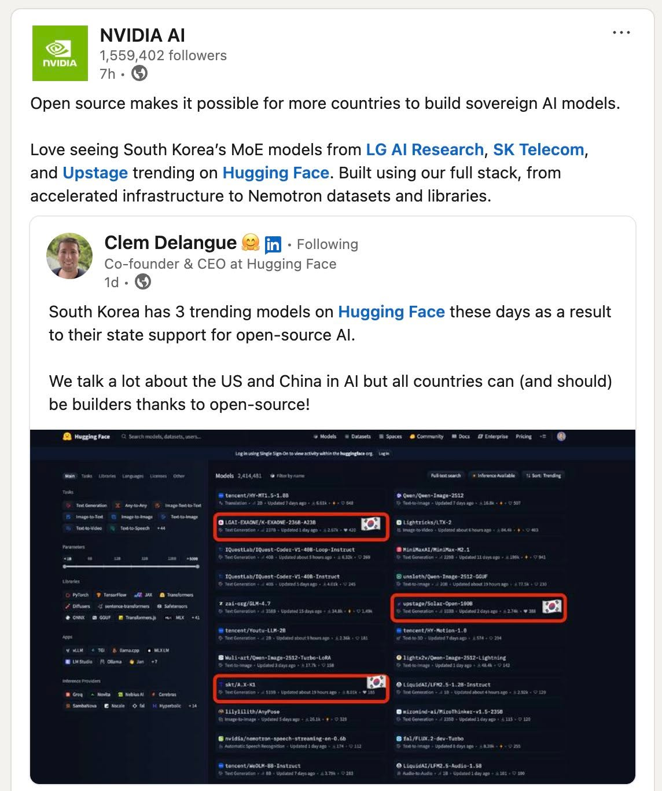
**이미지 캡션:** 이 이미지는 NVIDIA AI의 소셜 미디어 게시물로, 한국의 AI 모델 개발 성과를 조명하고 있습니다. 화면 상단에는 NVIDIA 로고와 함께 "NVIDIA AI"라는 이름과 155만 명 이상의 팔로워 수를 보여줍니다. 게시물 본문은 한국의 LG AI Research, SK Telecom, Upstage와 같은 기업들이 Hugging Face에서 개발한 Mixture-of-Experts (MoE) 모델들이 주목받고 있으며, 이는 오픈 소스 AI 생태계의 발전에 기여하고 있다는 내용을 담고 있습니다. 특히, Hugging Face의 공동 창립자 겸 CEO인 Clem Delangue의 프로필 사진과 함께 그의 코멘트가 인용되어 있으며, 한국 정부의 오픈 소스 AI 지원 정책이 이러한 성과에 기여했다고 언급합니다. 게시물 하단에는 Hugging Face 웹사이트의 일부 화면이 캡처되어 있으며, 다양한 AI 모델, 데이터셋, 라이브러리 등이 나열되어 있고, 한국어 모델로 보이는 항목들도 포함되어 있습니다. 전반적으로 긍정적이고 정보 전달적인 분위기이며, 오픈 소스 AI의 중요성과 한국의 AI 기술 발전을 강조하고 있습니다.

### 1월 10일 (토) 07:37 · 더 좋은 TechReport 만들기: 결국 커뮤니티 피드백+ 반영입니다.

더 좋은 TechReport 만들기: 결국 커뮤니티 피드백+ 반영입니다.

1. Kyunghyun Cho 교수님이 저희 논문 자랑
2. 연구자 한 명이 학습 비법 training dynamics(like init, lr, optimizers ect..) 알려줘
3. 좋아. 아카이빙할 때 추가할게 하고 학습 비법 (3번째 이미지)이 추가되었습니다.

이 과정을 통해 더 좋은 https://huggingface.co/upstage/Solar-Open-100B Techreport가 만들어졌습니다. 더 많이 사용해보시고 또 많은 의견 주시면 계속 반영해가겠습니다.

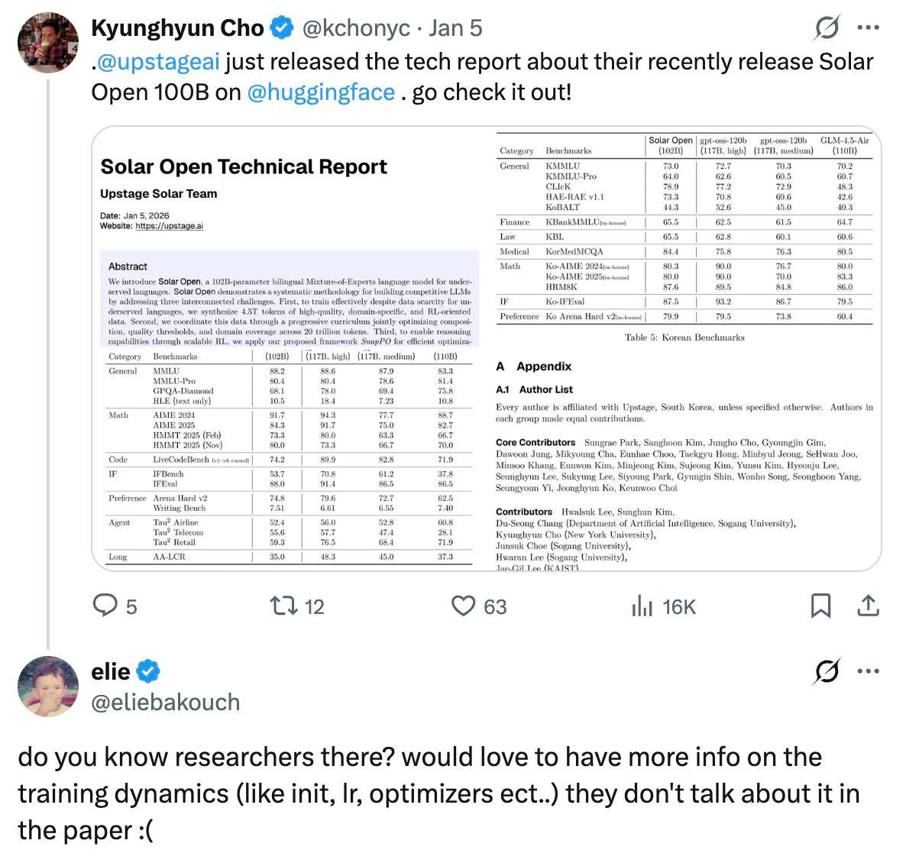
**이미지 캡션:** 이 사진은 한국어로 된 기술 보고서의 일부를 보여주는 스크린샷입니다. 보고서는 "Solar Open Technical Report"라는 제목이며, Upstage Solar Team에서 작성했습니다. 보고서의 날짜는 2026년 1월 5일이며, 웹사이트 주소는 https://upstage.ai입니다. 보고서의 초록은 "Solar Open"이라는 102B 매개변수 이중 언어 혼합 전문가 언어 모델을 소개하며, 이 모델이 저개발 언어에 대한 경쟁력 있는 LLM 구축을 위한 체계적인 방법론을 제시한다고 설명합니다. 또한, 데이터 부족 문제를 해결하기 위해 고품질의 도메인별 RL 중심 데이터를 4.5T 토큰 합성하고, 20조 토큰에 걸쳐 구성, 품질 임계값, 도메인 범위를 최적화하는 점진적 커리큘럼을 사용하며, 확장 가능한 RL을 통해 추론 기능을 활성화하기 위해 SnapPO 프레임워크를 적용한다고 언급합니다. 보고서에는 한국어 벤치마크 결과가 포함된 표와 A.1 저자 목록이 있습니다. 저자 목록에는 Upstage, South Korea에 소속된 여러 저자와 기여자들이 나열되어 있습니다. 사진 하단에는 "elie"라는 사용자가 "@eliebakouch"라는 계정으로 "do you know researchers there? would love to have more info on the training dynamics (like init, Ir, optimizers ect..) they don't talk about it in the paper :("라는 질문을 게시한 내용이 보입니다. 이 게시물에는 좋아요 63개, 댓글 12개, 리트윗 5개, 그리고 16K의 조회수가 표시되어 있습니다. 전반적으로 이 사진은 인공지능 언어 모델에 대한 기술 보고서와 관련된 소셜 미디어 게시물을 보여줍니다.
 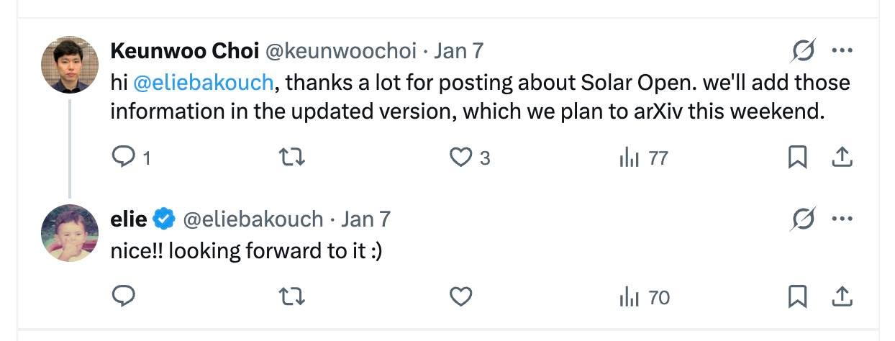
**이미지 캡션:** 이것은 트위터 스크린샷으로, 두 개의 트윗이 표시됩니다. 첫 번째 트윗은 Keunwoo Choi라는 이름의 성인 남성이 올린 것으로, 그는 검은색 셔츠를 입고 있으며 진지한 표정을 짓고 있습니다. 그는 @eliebakouch에게 "Solar Open"에 대한 게시물에 감사하며 업데이트된 버전에 정보를 추가할 것이라고 말합니다. 이 트윗은 1개의 댓글, 3개의 좋아요, 77개의 리트윗을 받았습니다. 두 번째 트윗은 elie라는 이름의 어린 아이가 올린 것으로, 긍정적인 표정을 짓고 있습니다. 그녀는 @eliebakouch에게 "nice!! looking forward to it :)"라고 답글을 달았습니다. 이 트윗은 70개의 리트윗을 받았습니다. 두 트윗 모두 1월 7일에 게시되었습니다. 배경은 흰색이며, 트윗 아이콘, 좋아요 아이콘, 공유 아이콘과 같은 표준 트위터 인터페이스 요소가 보입니다. 전반적인 분위기는 긍정적이고 협력적입니다.
 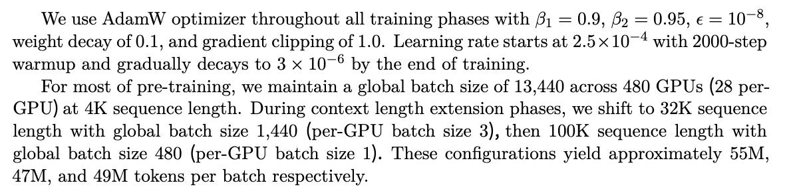
**이미지 캡션:** 이 이미지는 텍스트로만 구성되어 있으며, 특정 인물, 장소, 사물, 텍스트, 분위기 또는 상황에 대한 시각적 정보는 포함하고 있지 않습니다. 따라서 사람, 장소, 사물, 보이는 텍스트, 분위기/상황에 대한 설명은 불가능합니다. 이 텍스트는 딥러닝 모델 학습에 사용되는 AdamW 옵티마이저, 학습률, 배치 크기, 시퀀스 길이 등 기술적인 세부 사항을 설명하고 있습니다.

### 1월 11일 (일) 07:49 · #고객이좋다고할때제일행복  의 reasoning 능력이 좋다는 사용자 반…

#고객이좋다고할때제일행복 https://huggingface.co/upstage/Solar-Open-100B 의 reasoning 능력이 좋다는 사용자 반응 너무 행복합니다. gpt-oss-120b는 OpenAI에서 정말 잘 만든 모델인데요. 이와 유사하다고 하니 용기를 얻어 다음번 Solar 모델로 반드시 OpenAI를 이겨 보겠습니다.

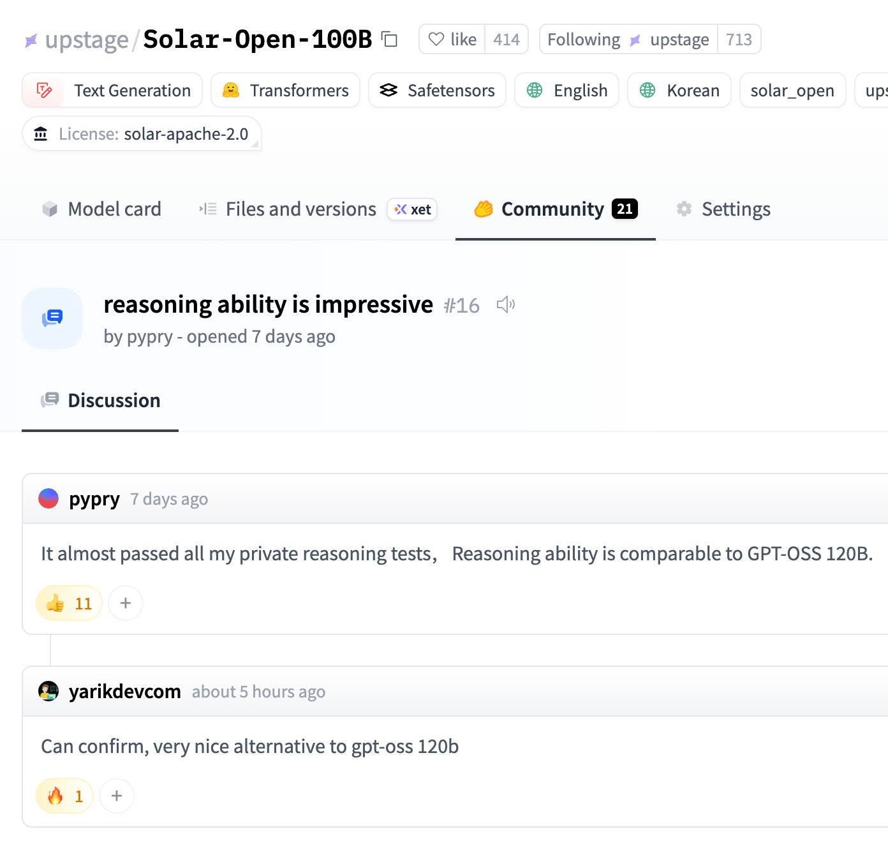
**이미지 캡션:** 이것은 웹사이트의 스크린샷으로, "upstage/Solar-Open-100B"라는 제목의 모델 페이지를 보여줍니다. 상단에는 모델 이름, 좋아요 수, 팔로잉 수, 그리고 "Text Generation", "Transformers", "Safetensors", "English", "Korean", "solar_open"과 같은 태그가 표시됩니다. 또한 "License: solar-apache-2.0"이라는 라이선스 정보도 있습니다. 페이지는 "Model card", "Files and versions", "Community", "Settings"와 같은 탭으로 구성되어 있으며, 현재 "Community" 탭이 선택되어 있습니다. "Community" 탭에는 "reasoning ability is impressive"라는 제목의 게시물이 있으며, 작성자는 "pypry"이고 7일 전에 게시되었습니다. 이 게시물 아래에는 "Discussion" 섹션이 있으며, "pypry"가 7일 전에 작성한 댓글과 "yarikdevcom"이 5시간 전에 작성한 댓글이 보입니다. "pypry"의 댓글은 "It almost passed all my private reasoning tests, Reasoning ability is comparable to GPT-OSS 120B."이며, 11개의 좋아요를 받았습니다. "yarikdevcom"의 댓글은 "Can confirm, very nice alternative to gpt-oss 120b"이며, 1개의 좋아요를 받았습니다. 전반적으로 이 화면은 AI 모델에 대한 커뮤니티 토론의 일부를 보여주고 있으며, 사용자들은 모델의 추론 능력에 대해 긍정적인 평가를 하고 있습니다.

### 1월 11일 (일) 09:29 · 📷 사진 (1장)

**이미지 캡션:** 이 이미지는 흰색 배경에 검은색 텍스트로 구성된 디지털 문서의 일부입니다. 상단에는 웃는 얼굴 이모티콘과 함께 "A little humor to wrap it up"이라는 제목이 있습니다. 그 아래에는 따옴표로 묶인 유머러스한 글이 두 단락으로 나뉘어 있습니다. 첫 번째 단락은 "If you think food is the only double-O word, you must have been on a single-O diet for too long!"이라고 말하며, 두 번째 단락은 "Next time you're at the zoo, remember you're surrounded by z-oo--- friends. And when you need a good laugh, just boo-hoo a little—those double O's are there for the drama."라고 이어집니다. 마지막으로 "So, there you have it—plenty of OO words to keep the conversation rolling. Happy word-hunting!"이라는 문장과 함께 로켓 이모티콘이 있습니다. 이미지 하단에는 다운로드, 공유, 새로고침 아이콘과 함께 "Solar Open"이라는 텍스트가 보입니다. 이 문서는 전반적으로 가볍고 유머러스한 분위기를 띠고 있으며, 'oo'가 들어간 단어에 대한 재치 있는 농담을 담고 있습니다.

### 1월 12일 (월) 17:59 · Paper Reading 세션 + Agentic LLM fireside …

https://huggingface.co/upstage/Solar-Open-100B Paper Reading 세션 + Agentic LLM fireside chat의 저희 준비 관계로 1월 20일로 일주일 연기되었습니다.

QR 코드로 등록하시면 됩니다. 20일 날 오시는 분들 반갑게 뵙겠습니다.

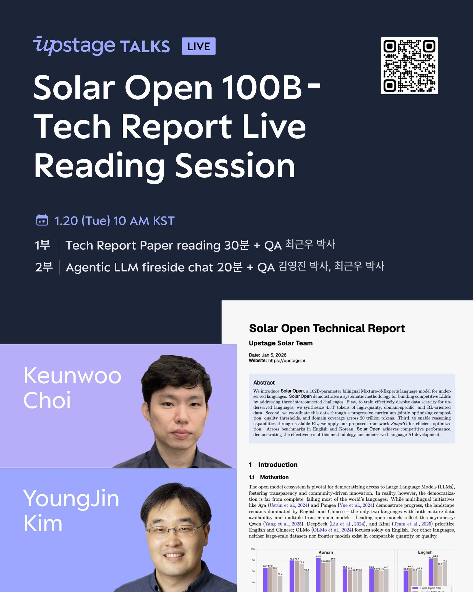
**이미지 캡션:** 이 사진은 "Solar Open 100B- Tech Report Live Reading Session"이라는 제목의 온라인 행사 포스터입니다. 포스터 상단에는 "upstage TALKS LIVE"라는 로고와 함께 행사의 제목이 크게 쓰여 있으며, 오른쪽 상단에는 QR 코드가 있습니다. 행사 날짜와 시간은 1.20 (화) 오전 10시 KST이며, 1부에서는 "Tech Report Paper reading 30분 + QA 최근우 박사"가, 2부에서는 "Agentic LLM fireside chat 20분 + QA 김영진 박사, 최근우 박사"가 진행됩니다. 포스터 왼쪽에는 두 명의 남성 발표자 사진이 있습니다. 상단에는 "Keunwoo Choi"라는 이름과 함께 30대 후반에서 40대 초반으로 보이는 성인 남성의 사진이 있는데, 그는 검은색 머리에 옅은 미소를 띠고 있으며, 파란색 셔츠를 입고 있습니다. 하단에는 "YoungJin Kim"이라는 이름과 함께 40대 초반에서 50대 초반으로 보이는 성인 남성의 사진이 있는데, 그는 검은색 머리에 안경을 쓰고 있으며, 옅은 미소를 띠고 있고, 파란색 셔츠를 입고 있습니다. 포스터 오른쪽에는 "Solar Open Technical Report"라는 제목의 기술 보고서 초록과 소개가 포함된 문서가 보입니다. 이 문서에는 "Upstage Solar Team"이라는 작성자와 날짜 "Jan 5, 2026", 웹사이트 주소 "https://upstage.ai"가 명시되어 있습니다. 전반적으로 이 포스터는 기술 발표 행사를 알리는 정보성 콘텐츠이며, 전문적이고 깔끔한 분위기를 풍깁니다.

### 1월 15일 (목) 15:17 · 와우! 많은 분들의 응원으로 업스테이지 컨소시엄의 #SolarLLM은 계…

와우! 많은 분들의 응원으로 업스테이지 컨소시엄의 #SolarLLM은 계속 달려갑니다. 2차수 독자파운데이션 프로젝트에는 특히 스탠퍼드와 NYU 연구진들이 합류해 글로벌에서 우뚝서는 모델을 만들어 갈 것입니다.

이 위대한 도전과 여정에 함께하실 분들을 많이 모시고 있습니다. https://careers.upstage.ai/?jobs-c88dea0d%5Bsearch%5D=%EB%8F%85%ED%8C%8C%EB%AA%A8
함께해요!

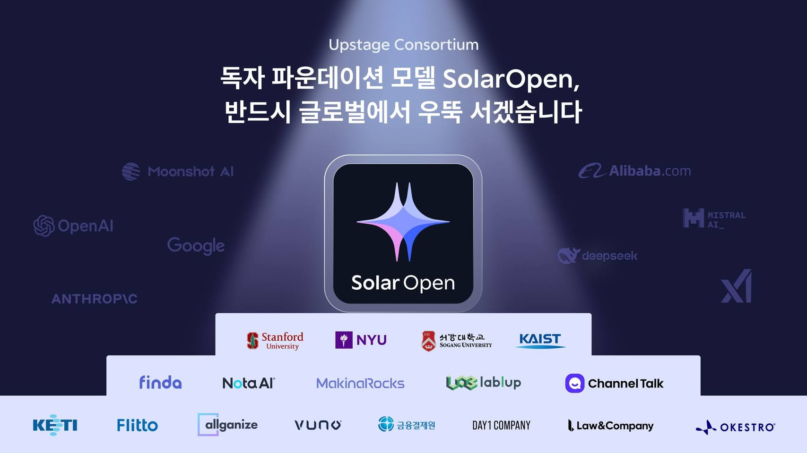
**이미지 캡션:** 이 이미지는 "Upstage Consortium"이라는 문구와 함께 "독자 파운데이션 모델 SolarOpen, 반드시 글로벌에서 우뚝 서겠습니다"라는 한국어 문구가 중앙에 배치되어 있습니다. 그 아래에는 "Solar Open"이라는 글자와 함께 별 모양의 로고가 있는 사각형 아이콘이 있습니다. 이 아이콘은 빛을 발하는 듯한 효과를 주고 있습니다. 배경은 어두운 보라색이며, 위에서부터 빛이 비추는 듯한 연출이 되어 있습니다. 이미지의 가장자리에는 다양한 기업 및 기관의 로고들이 나열되어 있습니다. 왼쪽 상단부터 Moonshot AI, OpenAI, ANTHROPIC, 그리고 Google이 보입니다. 오른쪽 상단에는 Alibaba.com, Mistral AI, deepseek, 그리고 X1이라는 로고가 있습니다. 중앙 하단에는 Stanford University, NYU, 서강대학교, KAIST 로고가 있으며, 그 아래에는 finda, Nota AI, MakinaRocks, Lablup, Channel Talk 로고가 있습니다. 가장 하단에는 KETI, Flitto, allganize, Vuno, 금융결제원, DAY1 COMPANY, Law&Company, OKESTRO 로고가 줄지어 있습니다. 전체적으로 기술, 특히 인공지능 분야의 협력과 발전을 나타내는 홍보성 이미지로 보이며, 진지하고 미래지향적인 분위기를 풍깁니다. 이미지에는 사람이 등장하지 않습니다.

### 1월 16일 (금) 04:54 · Kyunghyun Cho 교수님의 말씀에 깊이 공감합니다.

Kyunghyun Cho 교수님의 말씀에 깊이 공감합니다.

"그러나 이러한 고통과 노력은 참가 팀과 모델의 진정한 품질 및 발전 수준을 평가하기 위해 반드시 겪어야 하는 과정입니다. 이를 통해 우리는 시간이 지남에 따라 보다 흥미로운 평가 기준과 요소들을 도입할 수 있으며, 이는 참가 팀을 더 정확히 평가할 뿐 아니라 우리 스스로가 진정으로 원하는 바를 이해하는 데도 도움이 됩니다."

독자 파운데이션 모델 프로젝트에 참여하시고 관계하신 모든 분께 감사드립니다. 정말 수고 많으셨습니다.

### 1월 16일 (금) 09:54 · 업스테이지 컨소에서 진행 중인 Upstage 독자 파운데이션 모델 컨소시…

업스테이지 컨소에서 진행 중인 Upstage 독자 파운데이션 모델 컨소시엄 세미나(7회차) Kyunghyun Cho 교수님이 말씀해 주십니다. 오늘 1월 16일 11AM https://www.youtube.com/watch?v=jfN9OiaIQ7Y 에서 진행됩니다. 오시는 분들 반갑게 뵙겠습니다.

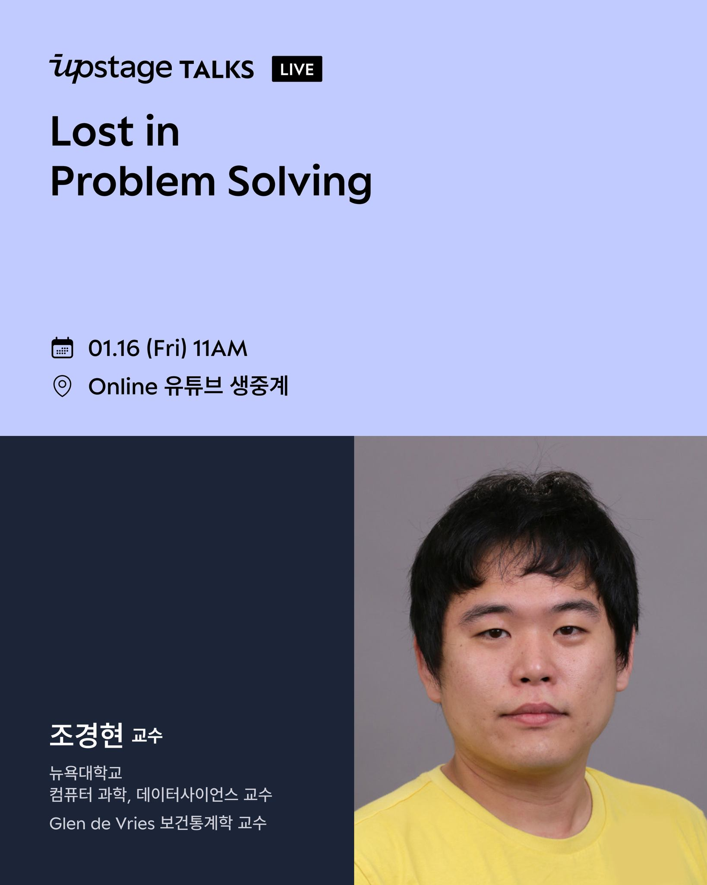
**이미지 캡션:** 이 이미지는 "upstage TALKS LIVE" 행사 포스터로, "Lost in Problem Solving"이라는 주제로 진행됩니다. 행사는 01월 16일 금요일 오전 11시에 온라인 유튜브 생중계로 열립니다. 포스터의 왼쪽 상단에는 "upstage TALKS LIVE"라는 로고가 보이며, 그 아래에는 행사의 주제인 "Lost in Problem Solving"이 큰 글씨로 쓰여 있습니다. 날짜와 시간, 그리고 온라인 생중계라는 정보도 아이콘과 함께 명확하게 표시되어 있습니다. 포스터의 하단 왼쪽에는 연사 정보가 한국어로 기재되어 있으며, "조경현 교수"라는 이름과 함께 "뉴욕대학교 컴퓨터 과학, 데이터사이언스 교수" 및 "Glen de Vries 보건통계학 교수"라는 소속 및 직책이 명시되어 있습니다. 포스터의 오른쪽에는 조경현 교수로 추정되는 성인 남성의 상반신 사진이 담겨 있습니다. 이 남성은 30대 후반에서 40대 초반으로 보이며, 짧은 검은색 머리에 둥근 얼굴형을 가지고 있습니다. 노란색 반팔 티셔츠를 입고 있으며, 정면을 응시하는 표정은 차분하고 진지해 보입니다. 배경은 연한 회색으로, 인물에 집중할 수 있도록 처리되었습니다. 전체적으로 깔끔하고 정보 전달에 충실한 디자인의 행사 안내 포스터입니다.

### 1월 20일 (화) 08:27 · 우리가 처음부터 가중치를 학습시킨(#fromscratch) 독자 파운데이…

우리가 처음부터 가중치를 학습시킨(#fromscratch) 독자 파운데이션 모델(독파모) 을 글로벌 수준으로 만들어 보자는 독파모 1차 4개월 프로젝트는 정부의 많은 기관과 참여회사들의 수고와 헌신으로 의미 있는 성과를 거두었다고 생각합니다.

EpochAI 등에 주목할 만한 AI 모델로 등록되었고, 허깅페이스에서 Trending Models 첫 페이지에 한국 모델 3개가 올라오고 허깅페이스 CEO가 직접 태극기까지 그려 붙여 홍보하는 역사적인 장면도 만들어 냈습니다.

가장 중요한 것은 이번 프로젝트를 통해 만들어진 LG, SKT, Upstage 모델들이 정말 쓸만하다는 것입니다. Solar-Pro3(Solar-Open의 강화 버전)도 고객들이 지난번 모델보다 훨씬 강력해졌다고 말씀해 주고 계십니다.

4개월 학습으로 만든 모델이 이 정도 성능인데 앞으로 2년간 더 독파모 프로젝트가 진행된다면 어떤 모델들이 나올지 벌써 설레고 기대가 됩니다. 반드시 글로벌에서 우뚝 선 프런티어 모델들이 쏟아져 나올 것입니다.

이를 위해서는 여러분들의 도움이 필요합니다. 이번 독파모에서 나온 모델들을 많이 사용해 주십시오. 좋은 부분은 좋아해 주시고 부족한 부분에 대해 말씀해 주시면 이를 바탕으로 다음번 모델을 더 잘 만들어 공개하겠습니다.

Solar-Pro3 + Websearch를 https://solar-search.upstage.ai/ (북마크 꾹!) 에서 바로 테스트 해보실수 있습니다. 또한  https://bizrouter.ai/ 에서 독파모 모델들을 바로 사용해보실수 있습니다. 예시: https://bizrouter.ai/chat/ccee9a39-b4b6-40a7-bc07-9ee3c217900c/public

다시 한번 독파모 프로젝트를 위해 수고해 주신 분들에게 큰 감사드립니다.

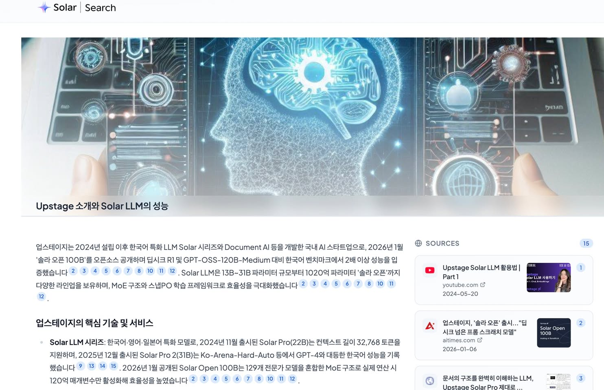
**이미지 캡션:** 화면 상단에는 "Solar | Search"라는 텍스트가 보이며, 그 아래에는 인공지능을 형상화한 이미지와 함께 "Upstage 소개와 Solar LLM의 성능"이라는 제목이 있습니다. 이미지에는 사람의 머리 윤곽 안에 복잡한 회로와 기어가 그려져 있으며, 손가락으로 투명한 화면을 터치하는 듯한 모습도 보입니다. 화면 중앙에는 업스테이지라는 국내 AI 스타트업이 개발한 LLM(거대 언어 모델)인 Solar 시리즈와 Document AI에 대한 설명이 한국어로 작성되어 있습니다. 텍스트는 Solar LLM의 성능과 업스테이지의 핵심 기술 및 서비스에 대해 설명하고 있으며, 여러 개의 숫자로 된 각주가 포함되어 있습니다. 오른쪽에는 "SOURCES"라는 제목과 함께 유튜브 영상 링크와 기사 링크 등 관련 자료들이 나열되어 있습니다. 전체적으로 기술, 특히 인공지능과 언어 모델에 대한 정보를 전달하는 웹페이지의 일부로 보입니다.
 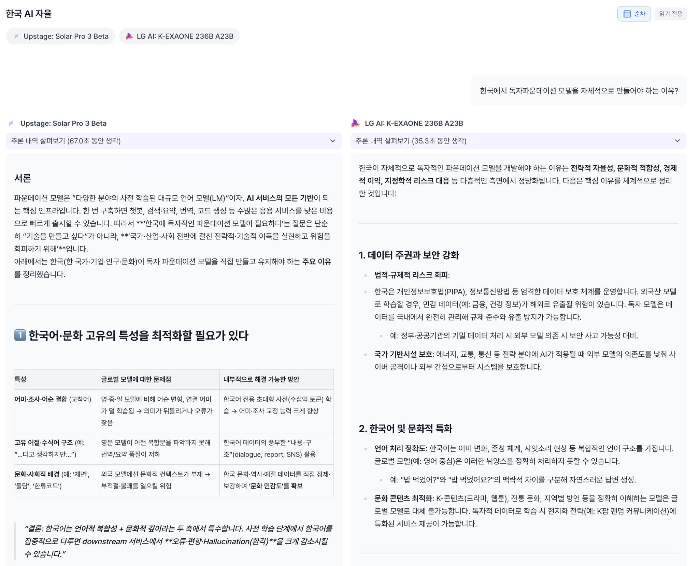
**이미지 캡션:** 이 문서는 한국에서 자체적인 파운데이션 모델 개발의 필요성을 강조하며, 그 이유를 전략적 자율성, 문화적 적합성, 경제적 이익, 지정학적 리스크 대응 등 네 가지 측면에서 설명하고 있습니다. 첫 번째로 데이터 주권과 보안 강화를 위해 개인정보보호법 등 엄격한 데이터 보호 체계를 운영하는 한국의 특성상, 외국산 모델 사용 시 민감 데이터 유출 위험이 있어 자체 모델을 통해 데이터를 국내에서 완전히 관리해야 함을 언급합니다. 또한, 에너지, 교통, 통신 등 국가 기반 시설 보호를 위해 외부 모델 의존도를 낮춰 사이버 공격이나 외부 간섭으로부터 시스템을 보호해야 한다고 주장합니다. 두 번째로 한국어와 문화적 특화의 필요성을 설명하는데, 한국어는 어미 변화, 존칭 체계, 사잇소리 현상 등 복합적인 언어 구조를 가져 글로벌 모델이 정확히 처리하기 어렵다고 지적합니다. 또한, K-콘텐츠, 전통 문화, 지역별 방언 등 한국 문화 콘텐츠를 정확히 이해하는 모델은 글로벌 모델로 대체 불가능하며, 자체 모델을 통해 문화 민감도를 확보하고 현지화 전략에 특화된 서비스 제공이 가능하다고 설명합니다. 마지막으로 한국어의 언어적 복합성과 문화적 깊이를 고려할 때, 자체 파운데이션 모델이 오류, 편향, 환각 현상을 크게 감소시킬 수 있다고 결론짓습니다.

### 1월 20일 (화) 10:57 · Solar-Open Paper Reading과 이어진 Young-Jin …

Solar-Open Paper Reading과 이어진 Young-Jin Kim 박사님의 agentic LLM의 fireside-chat https://www.youtube.com/live/0es_Yj8XaBU?si=W_Xgw_isWAEdwfN2 진행중입니다. 정말 재미있습니다. 

끝나고도 다시 보실 수 있으니 많은 시청 부탁드립니다.

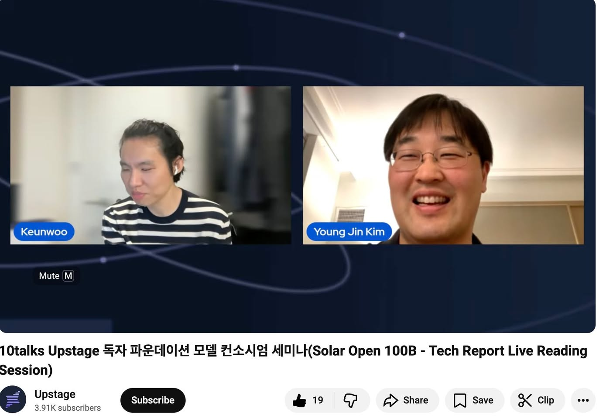
**이미지 캡션:** 화면은 두 개의 영상 창으로 분할되어 있으며, 왼쪽 창에는 젊은 성인 남성이 흰색과 검은색 줄무늬 티셔츠를 입고 흰색 이어폰을 착용하고 있으며, 오른쪽 창에는 안경을 쓴 중년 성인 남성이 검은색 상의를 입고 활짝 웃고 있다. 두 사람 모두 실내에서 촬영되었으며, 배경은 흐릿하게 처리되어 있다. 왼쪽 창에는 "Keunwoo"라는 이름표가, 오른쪽 창에는 "Young Jin Kim"이라는 이름표가 보인다. 화면 하단에는 "10talks Upstage 독자 파운데이션 모델 컨소시엄 세미나(Solar Open 100B - Tech Report Live Reading Session)"라는 제목과 함께 "Upstage" 채널 정보, 구독 버튼, 좋아요, 공유, 저장, 클립 등의 유튜브 인터페이스 요소가 보인다. 전반적으로 온라인 세미나 또는 웨비나의 한 장면으로 보이며, 활기차고 긍정적인 분위기이다.

### 1월 20일 (화) 19:41 · 📷 사진 (1장)

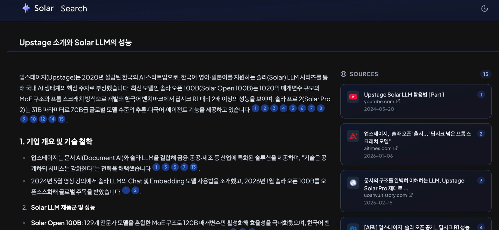
**이미지 캡션:** 이 이미지는 한국의 AI 스타트업인 업스테이지(Upstage)와 그들의 대규모 언어 모델(LLM)인 솔라(Solar) LLM에 대한 정보를 담고 있습니다. 화면 상단에는 "Solar Search"라는 검색 엔진 인터페이스가 보이며, 그 아래에는 "Upstage 소개와 Solar LLM의 성능"이라는 제목이 있습니다. 본문은 업스테이지의 설립 연도, 한국어, 영어, 일본어를 지원하는 솔라 LLM 시리즈, 그리고 최신 모델인 솔라 오픈 100B(Solar Open 100B)와 솔라 프로 2(Solar Pro 2)의 성능 및 특징에 대해 설명하고 있습니다. 특히, 솔라 오픈 100B는 1020억 개의 매개변수를 가진 MoE(Mixture of Experts) 구조로 개발되었으며, 한국어 벤치마크에서 딥시크 R1 대비 2배 이상의 성능을 보인다고 언급됩니다. 솔라 프로 2는 310억 개의 매개변수를 가지고 700억 개 규모의 글로벌 모델 수준의 추론 및 다국어, 에이전트 기능을 제공한다고 합니다. 또한, 업스테이지는 문서 AI와 솔라 LLM을 결합하여 금융, 공공, 제조 등 산업에 특화된 솔루션을 제공하는 전략을 채택했으며, 2024년 5월에는 솔라 LLM의 Chat 및 Embedding 모델 사용법을 소개했고, 2026년 1월에는 솔라 오픈 100B를 오픈소스화하여 글로벌 주목을 받았다는 내용도 포함되어 있습니다. 화면 오른쪽에는 "SOURCES" 섹션이 있으며, 유튜브, 아이티 타임즈, 티스토리 등에서 제공하는 관련 기사 및 영상 링크들이 나열되어 있습니다. 전반적으로 정보 전달에 초점을 맞춘 깔끔하고 현대적인 디자인의 웹페이지 화면으로 보이며, 차분하고 전문적인 분위기를 풍깁니다.

### 1월 22일 (목) 09:41 · #코스피5000 정말 역사적인 순간입니다. 함께 기뻐해요!!

#코스피5000 정말 역사적인 순간입니다. 함께 기뻐해요!!

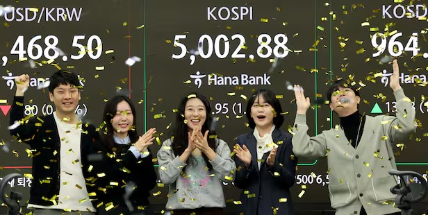
**이미지 캡션:** 다섯 명의 젊은 성인 남녀가 금색 색종이 조각이 흩날리는 가운데 환호하고 있다. 왼쪽에서부터 첫 번째 성인 남성은 흰색 니트 위에 검은색 가디건을 입고 있으며, 주먹을 불끈 쥐고 환하게 웃고 있다. 두 번째 성인 여성은 파란색 블라우스 위에 회색 후드티를 입고 있으며, 손뼉을 치며 기뻐하고 있다. 세 번째 성인 여성은 회색 후드티를 입고 있으며, 안경을 쓰고 활짝 웃으며 손뼉을 치고 있다. 네 번째 성인 여성은 흰색 터틀넥 위에 검은색 재킷을 입고 있으며, 입을 벌리고 놀라움과 기쁨을 표현하며 손뼉을 치고 있다. 다섯 번째 성인 남성은 검은색 터틀넥 위에 연한 녹색 가디건을 입고 있으며, 두 팔을 위로 올리고 환호하고 있다. 배경에는 주식 시장 정보를 보여주는 대형 스크린이 있으며, USD/KRW 환율과 KOSPI 지수가 표시되어 있다. 'Hana Bank'라는 로고도 보인다. 전체적으로 축하와 성공을 나타내는 밝고 긍정적인 분위기이다.

### 1월 22일 (목) 11:34 · 지난번 임시로 허깅페이스에 배포하였던 inference 관련 코드 등이 …

지난번 임시로 허깅페이스에 배포하였던 inference 관련 코드 등이 Hugging Face transformers에 공식 merge되었습니다.

이제 허깅페이스 공식 transformers 를 사용하여 https://huggingface.co/upstage/Solar-Open-100B 을 구동할 수 있습니다.

https://github.com/huggingface/transformers/commit/93dd4fb9faad8c3b0f181e581f6e4ac061c0edfe#diff-4fde4a50c8e4f0cde720008dde91d2e8acacc77807505500dac11bac0561baf7

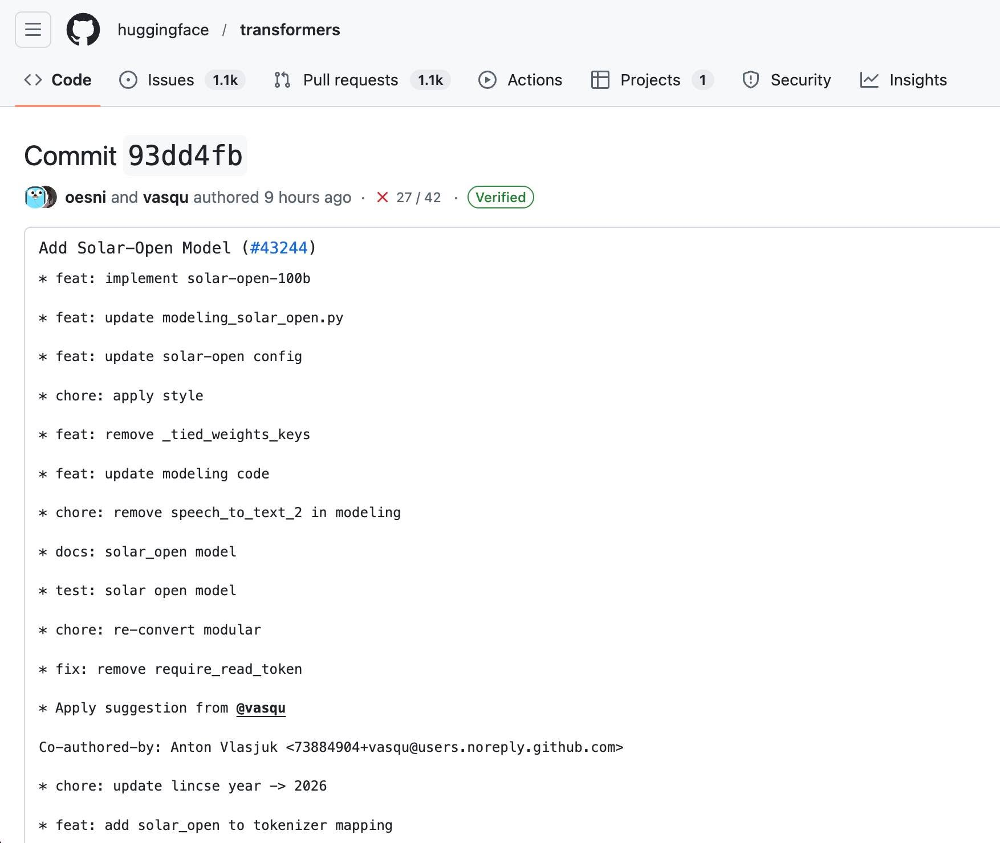
**이미지 캡션:** 이 이미지는 GitHub 웹사이트의 코드 저장소 페이지를 보여줍니다. 화면 상단에는 "huggingface / transformers"라는 텍스트와 함께 GitHub 로고가 보입니다. 그 아래에는 "Code", "Issues", "Pull requests", "Actions", "Projects", "Security", "Insights"와 같은 탐색 메뉴가 있습니다. 메인 콘텐츠 영역에는 "Commit 93dd4fb"라는 제목과 함께 커밋 정보가 표시됩니다. 커밋은 "oesni"와 "vasqu"에 의해 9시간 전에 작성되었으며, "Verified"라는 녹색 배지가 붙어 있습니다. 커밋 메시지는 "Add Solar-Open Model (#43244)"이며, 그 아래에는 여러 줄의 변경 사항 목록이 별표로 구분되어 나열되어 있습니다. 각 항목은 "feat:", "chore:", "docs:", "test:", "fix:"와 같은 접두사로 시작하며, 변경된 파일 이름이나 작업 내용을 설명합니다. 예를 들어, "feat: implement solar-open-100b", "feat: update modeling_solar_open.py", "chore: apply style", "docs: solar_open model", "fix: remove require_read_token" 등이 보입니다. 또한 "@vasqu"에 대한 언급과 "Co-authored-by: Anton Vlasjuk <73884904+vasqu@users.noreply.github.com>"라는 공동 작성자 정보도 포함되어 있습니다. 전반적으로 이 이미지는 소프트웨어 개발 프로젝트의 코드 변경 이력을 보여주는 스크린샷으로, 기술적인 내용을 담고 있으며 차분하고 정보 전달에 집중된 분위기입니다.

### 1월 22일 (목) 15:45 · AI in EDUCATION을 통해 미래 교육의 새로운 기준을 함께 만들…

AI in EDUCATION을 통해 미래 교육의 새로운 기준을 함께 만들어가겠습니다!

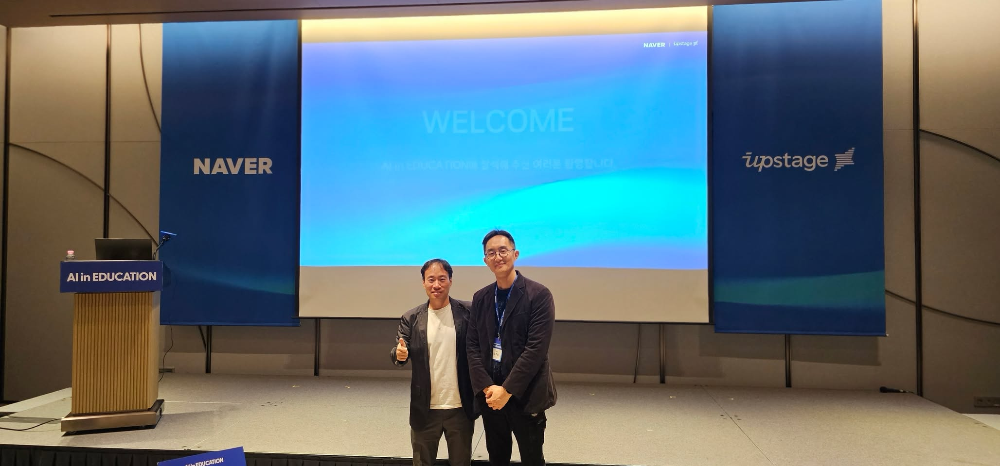
**이미지 캡션:** 행사장에서 두 명의 성인 남성이 포즈를 취하고 있다. 왼쪽 남성은 50대 후반으로 보이며, 흰색 티셔츠 위에 검은색 재킷을 입고 있으며, 오른손 엄지를 치켜들고 환하게 웃고 있다. 오른쪽 남성은 40대 초반으로 보이며, 검은색 재킷과 검은색 바지를 입고 있으며, 안경을 쓰고 카메라를 보며 미소 짓고 있다. 두 사람 모두 무대 위에 서 있으며, 배경에는 파란색 현수막과 대형 스크린이 보인다. 스크린에는 "WELCOME"이라는 글자와 함께 "NAVER"와 "upstage" 로고가 표시되어 있다. 왼쪽에는 "AI in EDUCATION"이라고 적힌 연단이 보인다. 전체적으로 행사의 환영 분위기를 나타내고 있다.

### 1월 22일 (목) 16:18 · 1월 23일(금) 오전 11시 #10Talks 중 가장 기대하고 있는 이…

1월 23일(금) 오전 11시 #10Talks 중 가장 기대하고 있는 이화란 교수님의 업스테이지 파운데이션 모델 컨소시엄 세미나에 모두를 초청합니다. 

이화란 교수님은 네이버 하이퍼클로바X 세이프티 총괄 리더를 역임하셨고, 매년 ACL, ICLR 등 세계 최고의 AI 학회에서 많은 논문을 발표하시며, 신뢰할 수 있는 AI(Safety) 분야를 글로벌 수준으로 선도하고 계십니다. 🚀

LLM 시대 꼭 필요한 내용입니다!

📢 세미나 정보
- 일시: 2026년 1월 23일(금) 오전 11시
- 주제: Safety Evaluation and Alignment in LLMs
- 연사: 서강대학교 AI/컴퓨터공학과 이화란 교수

10Talks 웨비나
- 11월 21일부터 2월 6일까지 매주 금요일 온라인 라이브로 진행됩니다.
- RSVP를 제출하시면 참여 링크와 강의자료를 이메일로 보내드립니다.
- 본 세션은 한국어로 진행됩니다.
👉 RSVP: https://go.upstage.ai/48deLaH

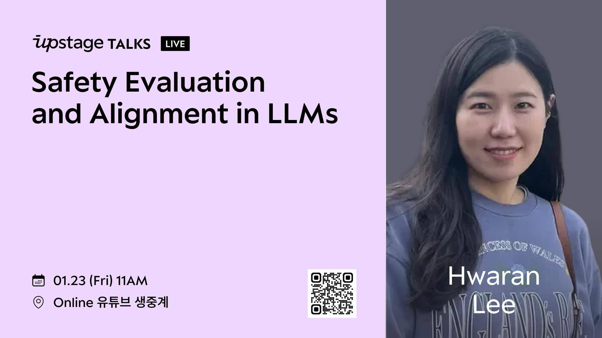
**이미지 캡션:** 이 이미지는 "upstage TALKS LIVE"라는 제목의 온라인 강연 홍보물로, 왼쪽에는 강연 제목과 정보가, 오른쪽에는 발표자 사진이 배치되어 있습니다. 발표자는 20대 후반에서 30대 초반으로 보이는 동양인 여성으로, 긴 검은색 머리를 하고 있으며, 파란색 맨투맨 티셔츠를 입고 있습니다. 얼굴에는 부드러운 미소를 띠고 있으며, 카메라를 정면으로 응시하고 있습니다. 배경은 연보라색과 회색으로 구분되어 있으며, 왼쪽에는 "Safety Evaluation and Alignment in LLMs"라는 강연 제목이 흰색 글씨로 크게 쓰여 있고, 그 아래에는 01월 23일 금요일 오전 11시에 유튜브 생중계로 진행된다는 정보와 함께 QR 코드가 있습니다. 오른쪽에는 발표자의 이름인 "Hwaran Lee"가 흰색 글씨로 적혀 있습니다. 전체적으로 깔끔하고 정보 전달에 집중된 디자인이며, 온라인 강연의 분위기를 나타냅니다.

### 1월 24일 (토) 07:05 · 즐겨 보는 #슈카월드 제 얼굴이 간접적으로 나왔습니다. 슬라이드 제목처럼…

즐겨 보는 #슈카월드 제 얼굴이 간접적으로 나왔습니다. 슬라이드 제목처럼 "독자 AI 모델의 꿈"을 꼭 이루어 보겠습니다. https://youtu.be/lC43uZyMF6A?si=bNiz_03LPXnsTfsQ&t=1180

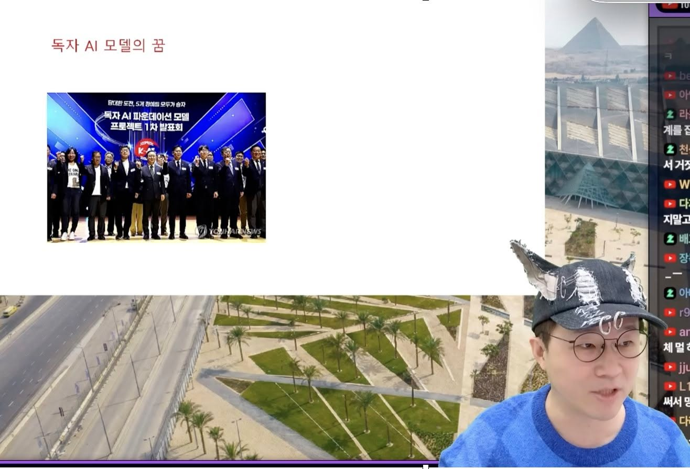
**이미지 캡션:** 화면 왼쪽 상단에는 "독자 AI 모델의 꿈"이라는 제목과 함께 "담대한 도전, 5개 정예 모두가 승자 독자 AI 파운데이션 모델 프로젝트 1차 발표회"라는 문구가 적힌 사진이 보인다. 사진 속에는 정장을 입은 여러 명의 성인 남성들이 무대 위에서 포즈를 취하고 있으며, 일부는 손가락으로 브이(V)자를 그리고 있다. 사진 하단에는 "YONHAPNEWS"라는 워터마크가 보인다. 그 아래에는 야자수가 심어진 넓은 공원과 도로의 항공 사진이 펼쳐져 있다. 화면 오른쪽에는 이집트 피라미드와 현대적인 건축물이 보이는 풍경이 있고, 그 앞에 고양이 귀 모양의 모자를 쓰고 파란색 스웨터를 입은 성인 남성이 카메라를 보며 이야기하고 있다. 남성은 동그란 안경을 쓰고 있으며, 표정은 다소 상기되어 있다. 화면 오른쪽 가장자리에는 한국어로 된 채팅창으로 보이는 텍스트들이 나열되어 있다. 전반적으로 발표회 장면과 외부 풍경, 그리고 방송 화면이 합성된 이미지로 보인다.
 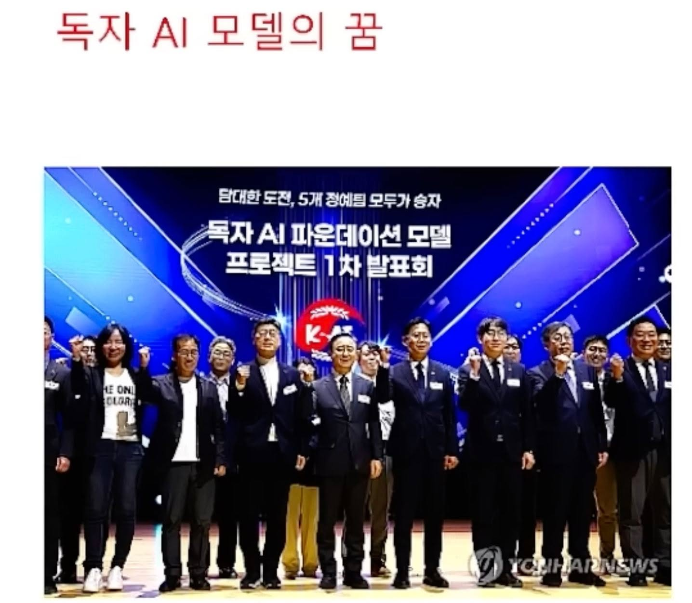
**이미지 캡션:** 사진 상단에는 붉은색 글씨로 "독자 AI 모델의 꿈"이라는 제목이 쓰여 있으며, 그 아래에는 파란색 배경의 무대에서 여러 명의 사람들이 서 있는 모습이 담겨 있습니다. 무대 배경에는 "담대한 도전, 5개 정예팀 모두가 승자", "독자 AI 파운데이션 모델 프로젝트 1차 발표회"라는 문구가 흰색과 보라색 글씨로 쓰여 있습니다. 무대 중앙에는 K-AI 로고가 보입니다. 사진에는 약 10명 이상의 사람들이 서 있으며, 대부분 정장을 입은 성인 남성들입니다. 일부 여성도 포함되어 있습니다. 사람들은 대부분 밝은 표정으로 카메라를 응시하고 있으며, 몇몇은 주먹을 불끈 쥐거나 손가락으로 브이(V)를 그리며 환호하는 듯한 모습을 보입니다. 한 여성은 흰색 티셔츠에 청바지를 입고 있으며, 티셔츠에는 "HE ON CLORO"라는 문구가 쓰여 있습니다. 전체적으로 성공적인 발표회나 행사를 축하하는 듯한 긍정적이고 활기찬 분위기입니다. 사진 오른쪽 하단에는 "연합뉴스" 워터마크가 보입니다.

### 1월 24일 (토) 07:15 · 존경하는 박태웅 의장님의 독자 파운데이션 모델 프로젝트 설명과 특히 생태…

존경하는 박태웅 의장님의 독자 파운데이션 모델 프로젝트 설명과 특히 생태계를 키우자는 방향, AI 3강을 위한 비전 말씀 너무 잘 들었습니다. 인사이트 넘치는 말씀 감사합니다.
https://www.youtube.com/watch?v=balUMLZevKs&t=2184s

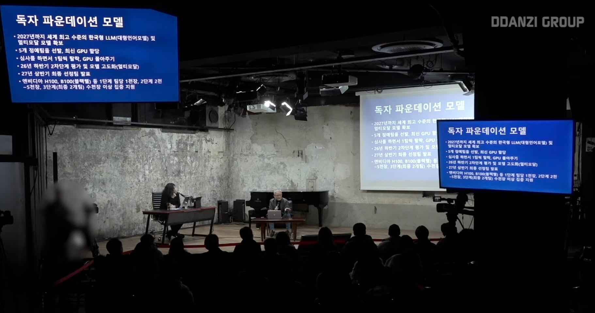
**이미지 캡션:** 어두운 강당에서 강연이 진행되고 있으며, 무대에는 두 명의 연사와 청중석이 보인다. 무대 중앙에는 피아노가 놓여 있고, 그 뒤로는 낡은 벽이 보인다. 무대 좌측에는 한 명의 성인 여성이 검은색 옷을 입고 책상에 앉아 발표를 하고 있으며, 책상 위에는 노트북과 서류가 놓여 있다. 무대 우측에는 한 명의 성인 남성이 검은색 재킷과 회색 바지를 입고 의자에 앉아 발표를 하고 있으며, 그의 앞에는 노트북이 놓여 있다. 두 연사 모두 진지한 표정으로 발표에 집중하고 있다. 청중석에는 많은 사람들이 어둠 속에 앉아 발표를 경청하고 있으며, 일부는 휴대폰을 사용하거나 고개를 숙이고 있다. 무대 위에는 두 개의 대형 스크린이 설치되어 있는데, 좌측 스크린에는 "독자 파운데이션 모델"이라는 제목과 함께 발표 내용이 한국어로 적혀 있고, 우측 스크린에도 동일한 내용이 표시되어 있다. 스크린에는 "2027년까지 세계 최고 수준의 한국형 LLM(대형언어모델) 및 멀티모달 모델 확보", "5개 정예팀을 선발, 최신 GPU 할당", "심사를 하면서 1팀씩 탈락, GPU 몰아주기", "26년 하반기 2차단계 평가 및 모델 고도화(멀티모달)", "27년 상반기 최종 선정팀 발표", "엔비디아 H100, B100(블랙) 등 1단계 팀당 1천장, 2단계 2천~5천장, 3단계(최종 2개팀) 수천장 이상 집중 지원" 등의 내용이 포함되어 있다. 전체적으로 진지하고 학술적인 분위기이며, 기술 발표회 또는 세미나의 한 장면으로 보인다.
 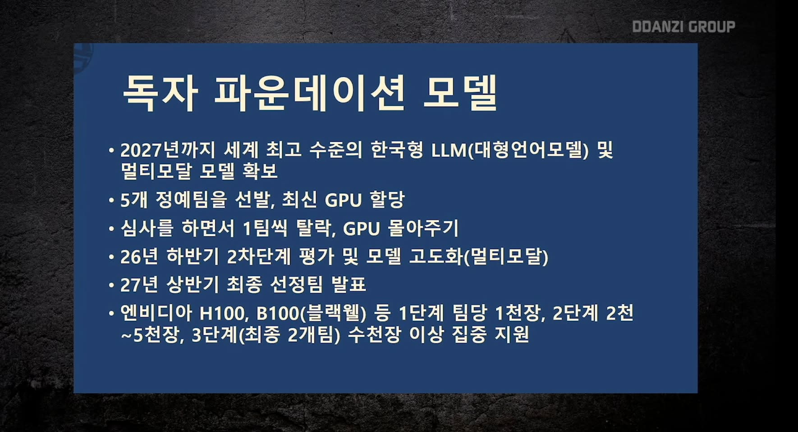
**이미지 캡션:** 이 이미지는 "독자 파운데이션 모델"이라는 제목의 프레젠테이션 슬라이드로, 검은색 배경에 짙은 파란색 사각형이 있고 그 안에 흰색 텍스트가 표시되어 있습니다. 사각형 오른쪽 상단에는 "DDANZI GROUP"이라는 로고가 있습니다. 슬라이드 내용은 한국어로 작성되었으며, 2027년까지 세계 최고 수준의 한국형 LLM(대형 언어 모델) 및 멀티모달 모델 확보를 목표로 하는 계획을 설명합니다. 구체적으로는 5개의 정예팀을 선발하여 최신 GPU를 할당하고, 심사를 통해 팀을 탈락시키며 GPU를 재분배하는 방식을 언급합니다. 또한 2026년 하반기에는 2차 단계 평가와 모델 고도화(멀티모달)를 진행하고, 2027년 상반기에는 최종 선정팀을 발표할 예정입니다. 마지막으로 엔비디아 H100, B100(블랙웰) 등의 GPU를 1단계 팀당 1천장, 2단계 팀당 2천장에서 5천장, 최종 2개 팀에는 수천장 이상 집중 지원한다는 내용을 담고 있습니다. 이미지에는 사람이 등장하지 않으며, 장소는 발표회장이나 회의실의 일부로 추정됩니다. 전체적으로 정보 전달에 초점을 맞춘 진지하고 전문적인 분위기입니다.
 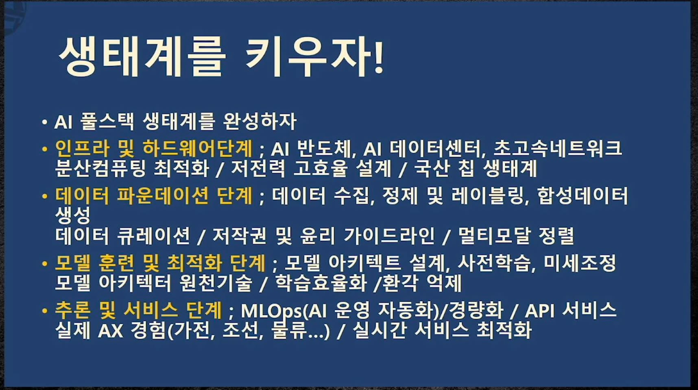
**이미지 캡션:** 이 이미지는 파란색 배경에 흰색과 노란색 글자로 쓰인 프레젠테이션 슬라이드입니다. 슬라이드의 제목은 "생태계를 키우자!"이며, 그 아래에는 AI 생태계 구축을 위한 여러 단계와 관련된 내용이 글머리 기호로 나열되어 있습니다. 첫 번째 글머리 기호는 "AI 풀스택 생태계를 완성하자"이고, 그 다음으로는 인프라 및 하드웨어 단계, 데이터 파운데이션 단계, 모델 훈련 및 최적화 단계, 추론 및 서비스 단계에 대한 구체적인 내용이 설명되어 있습니다. 각 단계별로 AI 반도체, 데이터 센터, 초고속 네트워크, 분산 컴퓨팅 최적화, 저전력 고효율 설계, 국산 칩 생태계, 데이터 수집 및 정제, 레이블링, 합성 데이터 생성, 데이터 큐레이션, 저작권 및 윤리 가이드라인, 멀티모달 정렬, 모델 아키텍트 설계, 사전 학습, 미세 조정, 모델 아키텍터 원천 기술, 학습 효율화, 환각 억제, MLOps, 경량화, API 서비스, 실제 AX 경험(가전, 조선, 물류 등), 실시간 서비스 최적화 등이 언급되어 있습니다. 전체적으로 AI 기술 생태계의 발전 방향과 전략을 제시하는 내용으로 보입니다.

### 1월 26일 (월) 20:29 · 오늘 Upstage 강남 사무실에 #무바달라 #산업은행 #사제파트너스 팀…

오늘 Upstage 강남 사무실에 #무바달라 #산업은행 #사제파트너스 팀들이 함께 모여 소버린 AI와 독자 파운데이션 모델에 대해 이야기를 나누었습니다. 멋진 일들이 일어날 것 같습니다!!

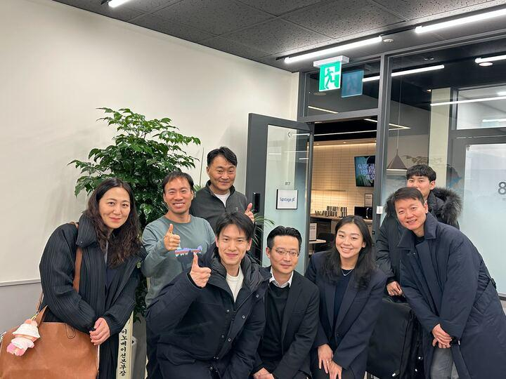
**이미지 캡션:** 이 사진은 실내에서 촬영되었으며, 총 8명의 사람들이 함께 포즈를 취하고 있다. 왼쪽부터 검은색 패딩 코트를 입은 중년 여성, 회색 티셔츠에 검은색 재킷을 입은 중년 남성, 검은색 패딩을 입은 젊은 남성, 검은색 코트를 입은 중년 남성, 검은색 재킷을 입은 젊은 여성, 검은색 코트를 입은 젊은 남성, 검은색 패딩을 입은 젊은 남성, 그리고 가장 오른쪽에 검은색 패딩을 입은 젊은 남성이 보인다. 대부분의 사람들은 카메라를 향해 미소를 짓고 있으며, 몇몇은 엄지손가락을 치켜세우고 있다. 배경에는 녹색 식물, 출입문, 사무실 내부가 보인다. 출입문 위에는 녹색 비상구 표지가 있고, 문 옆에는 '817'이라는 숫자가 적힌 표지판과 'Stage'라고 적힌 표지판이 보인다. 또한, 벽에는 '이노베이션본부장'이라는 글자가 적힌 표지판이 보인다. 전체적으로 화기애애하고 긍정적인 분위기이다.

### 1월 27일 (화) 15:20 · #solar-pro3가 전 세계 AI 개발자들이 즐겨 사용하는 openr…

#solar-pro3가 전 세계 AI 개발자들이 즐겨 사용하는 openrouter에 등록되었습니다. 3월 2일까지는 무료로 사용 가능하니 편하게 사용해주세요.
https://openrouter.ai/upstage/solar-pro-3:free/api 

Solar-Pro3는 정부의 독자 파운데이션 모델 프로젝트의 지원으로 개발되었습니다. 큰 감사드립니다.

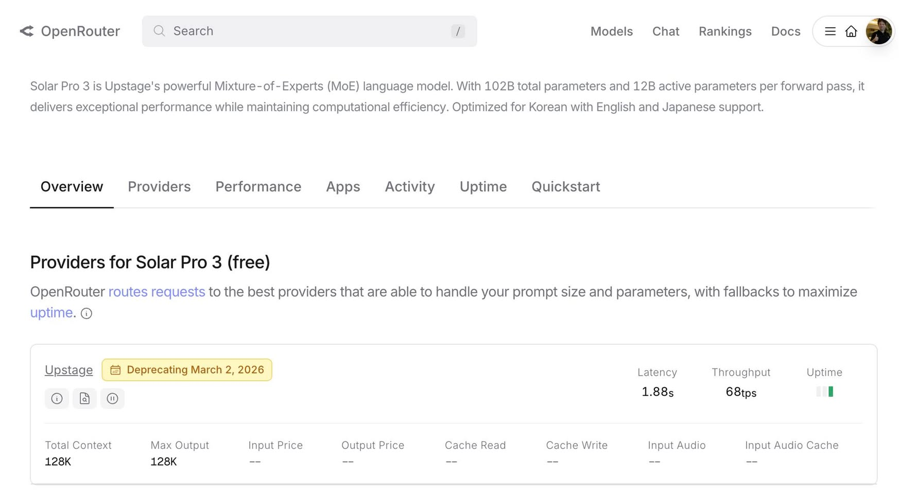
**이미지 캡션:** 이 이미지는 OpenRouter 웹사이트의 일부를 보여주며, Solar Pro 3 모델에 대한 정보를 제공합니다. 화면 상단에는 OpenRouter 로고와 검색창, 그리고 모델, 채팅, 랭킹, 문서 등의 메뉴가 보입니다. 그 아래에는 Solar Pro 3 모델에 대한 설명이 있으며, 이 모델이 Upstage의 강력한 Mixture-of-Experts(MoE) 언어 모델이고, 1020억 개의 총 매개변수와 120억 개의 활성 매개변수를 가지고 있으며, 한국어, 영어, 일본어를 지원한다고 설명합니다. 메인 콘텐츠 영역에는 "Overview", "Providers", "Performance", "Apps", "Activity", "Uptime", "Quickstart" 탭이 있으며, 현재 "Overview" 탭이 선택되어 있습니다. 그 아래에는 "Providers for Solar Pro 3 (free)"라는 제목과 함께 OpenRouter가 프롬프트 크기와 매개변수를 처리할 수 있는 최적의 제공업체로 요청을 라우팅하고 가용성을 극대화한다고 설명합니다. 표에는 "Upstage"라는 제공업체가 나열되어 있으며, "Deprecated March 2, 2026"이라는 문구가 노란색 배경으로 표시되어 있습니다. 또한, 지연 시간(Latency)은 1.88초, 처리량(Throughput)은 68tps, 가용성(Uptime)은 녹색 막대로 표시됩니다. 표의 하단에는 총 컨텍스트(Total Context)와 최대 출력(Max Output)이 각각 128K로 표시되어 있으며, 입력 가격, 출력 가격, 캐시 읽기, 캐시 쓰기, 입력 오디오, 입력 오디오 캐시에 대한 정보는 비어 있습니다. 화면 오른쪽 상단에는 메뉴 아이콘과 집 모양 아이콘, 그리고 한 명의 성인 남성이 웃고 있는 프로필 사진이 보입니다. 전반적으로 기술적인 정보를 제공하는 웹사이트의 일부로, 차분하고 정보 중심적인 분위기입니다.
 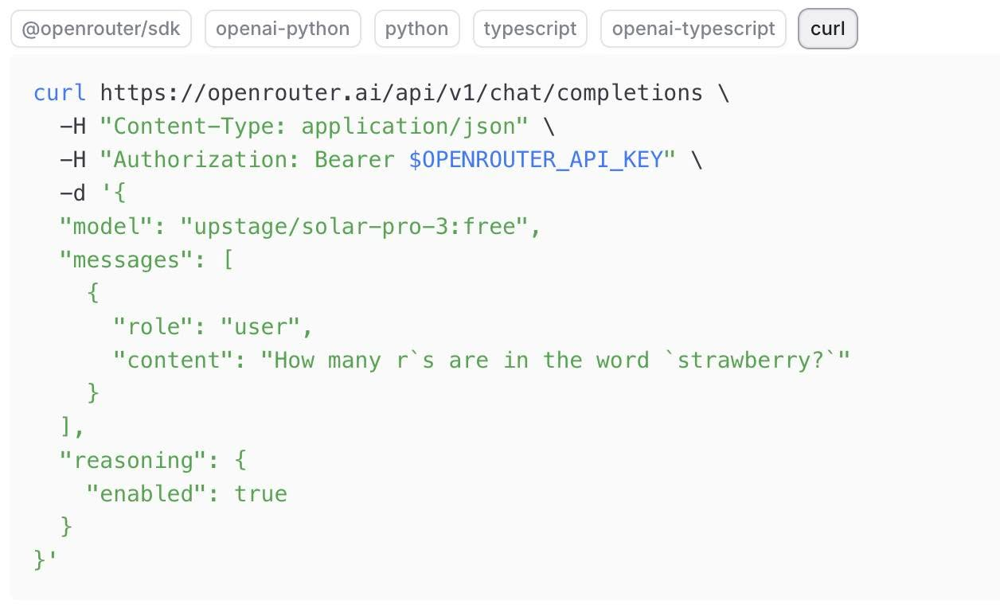
**이미지 캡션:** 이 이미지는 프로그래밍 코드의 일부를 보여주는 스크린샷으로, 특정 API 호출을 구성하는 방법을 나타냅니다. 사람, 장소, 사물, 텍스트, 분위기 등 시각적인 요소는 없으며, 순전히 텍스트 기반의 정보만 제공됩니다. 보이는 텍스트는 `curl` 명령줄 인터페이스를 사용하여 OpenRouter API에 대한 HTTP POST 요청을 보내는 내용을 담고 있습니다. 요청은 JSON 형식으로 전송되며, `Authorization` 헤더에는 API 키가 포함되어 있습니다. 요청 본문에는 `model` 필드에 "upstage/solar-pro-3:free"라는 모델 이름이 지정되어 있고, `messages` 필드에는 사용자의 질문인 "How many r`s are in the word 'strawberry?'"가 포함되어 있습니다. 또한 `reasoning` 필드가 `true`로 설정되어 있어, API가 응답을 생성하는 과정에서 추론을 활성화하도록 지시하고 있습니다. 전반적인 분위기는 기술적이고 정보 전달에 초점을 맞추고 있으며, 개발자가 API를 사용하는 방법을 보여주는 예시입니다.

### 1월 28일 (수) 17:24 · 📷 사진 (1장)

**이미지 캡션:** 사진에는 말풍선 안에 붉은색 하트가 그려져 있습니다. 말풍선은 흰색이며, 가장자리가 둥글게 처리되어 있습니다. 하트는 약간의 입체감을 가지고 있으며, 빛을 받아 반짝이는 듯한 질감을 표현하고 있습니다. 배경은 갈색의 거친 질감으로, 벽이나 나무 표면처럼 보입니다. 사진의 왼쪽에는 녹색의 일부가 흐릿하게 보이며, 이것이 무엇인지는 명확하지 않습니다. 전체적으로 따뜻하고 긍정적인 느낌을 주는 이미지입니다.

### 1월 29일 (목) 06:53 · AI 시대 에이전트를 하건 간단한 RAG를 하건, LLM 학습을 하건 무…

AI 시대 에이전트를 하건 간단한 RAG를 하건, LLM 학습을 하건 무조건 문서를 읽어야 하는데요. 이를 위한 필수 기능인 Upstage #DocumentParse 가 1.9.1 버전으로 업데이트되었습니다. https://www.upstage.ai/products/document-parse

기존엔 엄두도 못 내는 엄청난 표도 잘 읽어냅니다. K-table 이라 불리는 표 안의 표 안의 표도 잘 읽어냅니다. 정말 잘합니다! 바로 사용해보세요!!

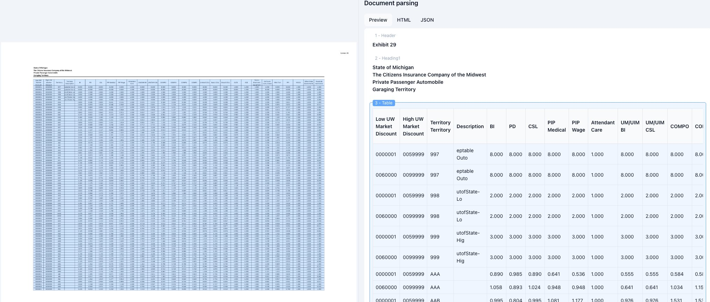
**이미지 캡션:** 이 이미지는 문서 파싱 결과를 보여주는 화면으로, 왼쪽에는 원본 문서의 일부로 보이는 표가, 오른쪽에는 해당 문서의 헤더 정보와 표의 일부가 텍스트로 추출되어 표시되고 있습니다. 왼쪽의 표는 수많은 행과 열로 이루어진 복잡한 데이터 테이블이며, 파란색 배경에 흰색 글씨로 숫자가 빼곡하게 채워져 있습니다. 오른쪽에는 "Document parsing"이라는 제목 아래 "Preview", "HTML", "JSON" 탭이 있으며, "Preview" 탭이 선택되어 있습니다. "Exhibit 29"라는 헤더 아래 "State of Michigan", "The Citizens Insurance Company of the Midwest", "Private Passenger Automobile", "Garaging Territory"와 같은 제목들이 순서대로 나열되어 있습니다. 그 아래에는 "3 - Table"이라는 섹션이 있으며, "Low UW Market Discount", "High UW Market Discount", "Territory Territory", "Description", "BI", "PD", "CSL", "PIP Medical", "PIP Wage", "Attendant Care", "UM/UIM BI", "UM/UIM CSL", "COMPO", "COI" 등의 열 제목과 함께 일부 데이터 행이 추출되어 보입니다. 추출된 데이터는 주로 숫자와 짧은 텍스트로 구성되어 있으며, "eptable Outo", "utofState-Lo", "utofState-Hig", "AAA", "AAB"와 같은 설명과 함께 다양한 수치들이 나열되어 있습니다. 전체적으로 금융 또는 보험 관련 데이터를 분석하고 시각화하는 시스템의 일부로 보이며, 정보의 정확성과 가독성을 높이기 위한 문서 처리 과정을 보여줍니다.
 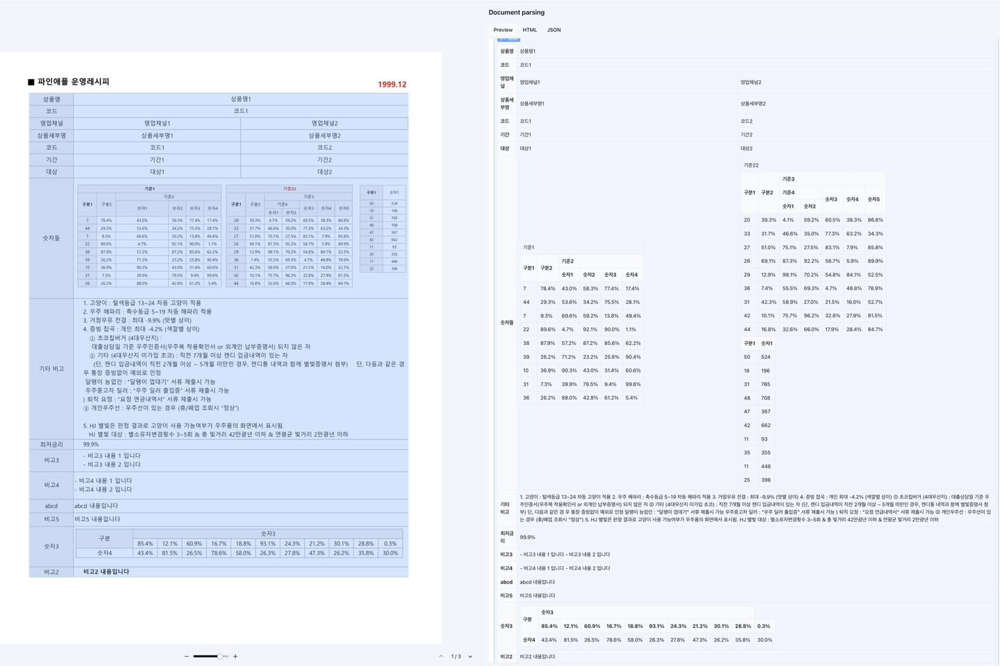
**이미지 캡션:** 이 이미지는 컴퓨터 화면의 일부를 캡처한 것으로, 파인애플이라는 이름의 운영 레시피와 관련된 표와 텍스트 정보가 포함되어 있습니다. 화면 왼쪽에는 "파인애플 운영레시피"라는 제목과 함께 1999년 12월이라는 날짜가 표시되어 있습니다. 그 아래에는 상품명, 코드, 영업 채널, 상품 세부명, 기간, 대상 등의 항목별로 데이터를 정리한 표가 두 개 나란히 배치되어 있습니다. 각 표는 여러 열로 구성되어 있으며, 숫자와 퍼센트 값이 포함된 데이터를 보여줍니다. 표의 오른쪽에는 "Document parsing"이라는 제목과 함께 Preview, HTML, JSON이라는 탭이 보이며, 그 아래에는 또 다른 표와 텍스트 정보가 있습니다. 이 부분에는 "기준1", "기준2", "기준3", "기준4", "숫자1", "숫자2", "숫자3", "숫자4", "숫자5" 등의 열 제목과 함께 다양한 수치 데이터가 포함된 표들이 더 상세하게 나열되어 있습니다. 또한, "기타 비고"라는 섹션에는 고양이, 우주 해파리, 거점 우유, 증빙 잡곡 등 다양한 항목에 대한 설명과 조건들이 텍스트로 기재되어 있습니다. "최저금리" 섹션에는 99.9%라는 수치가 있으며, "비고" 섹션에는 비고3, 비고4, 비고5 등의 항목과 함께 "비고3 내용 1 입니다", "비고4 내용 1 입니다"와 같은 텍스트 설명이 있습니다. 전반적으로 이 이미지는 특정 상품이나 서비스의 운영 데이터를 분석하고 관리하기 위한 정보를 담고 있는 것으로 보이며, 복잡한 표와 텍스트 정보가 혼합되어 있어 전문적인 내용을 다루고 있음을 시사합니다. 화면에는 별도의 사람이나 행동은 보이지 않으며, 차분하고 정보 중심적인 분위기입니다.
