# 2026년 3월

[← 2026년](README.md)

### 3월 3일 (화) 10:10 · 독파모 과제로 만들어진 #SolarPro3 모델이 OpenRouter 연…

독파모 과제로 만들어진 #SolarPro3 모델이 OpenRouter 연결 후 하루에 9B 토큰이 사용되는 등 큰 인기를 끌고 있습니다. 그동안 진행되던 무료 테스트를 종료하고 오늘부터 정식 서비스에 들어갑니다. 계속해서 많이 사용해주세요.

https://openrouter.ai/upstage/solar-pro-3

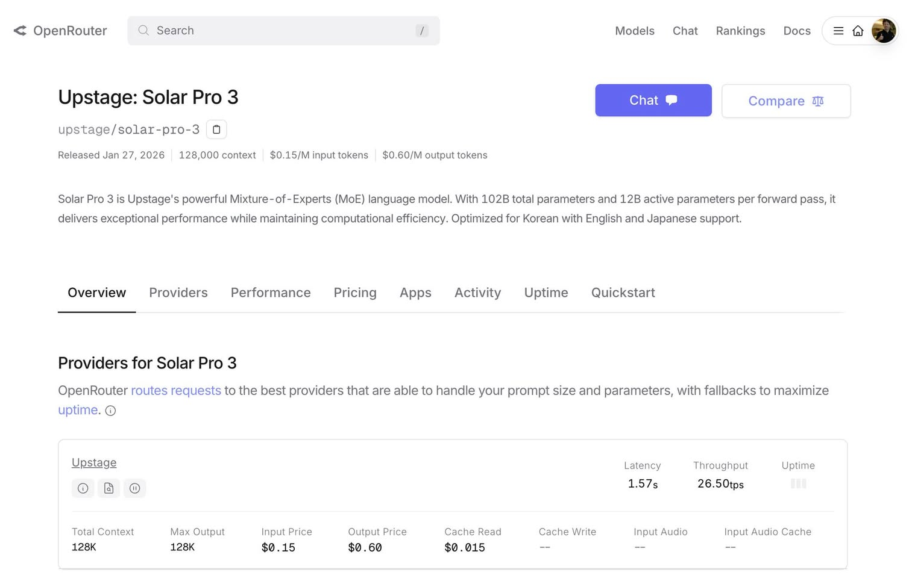
**이미지 캡션:** 이것은 OpenRouter 웹사이트의 스크린샷으로, Upstage의 Solar Pro 3 언어 모델에 대한 정보를 보여줍니다. 화면 상단에는 OpenRouter 로고와 검색창이 있으며, 오른쪽에는 모델, 채팅, 랭킹, 문서 메뉴와 함께 사용자 프로필 아이콘이 있습니다. 중앙에는 "Upstage: Solar Pro 3"라는 제목과 함께 모델의 ID, 출시일, 컨텍스트 창 크기, 입력 및 출력 토큰당 비용이 표시됩니다. 그 아래에는 Solar Pro 3에 대한 설명이 있는데, 이는 Upstage의 강력한 Mixture-of-Experts(MoE) 언어 모델이며 1020억 개의 총 매개변수와 120억 개의 활성 매개변수를 가지고 있어 뛰어난 성능을 제공하며 한국어, 영어, 일본어를 지원한다고 설명합니다. 그 아래에는 개요, 제공업체, 성능, 가격, 앱, 활동, 가동 시간, 빠른 시작과 같은 탭 메뉴가 있으며 현재 "개요" 탭이 선택되어 있습니다. "개요" 탭 아래에는 "Solar Pro 3용 제공업체"라는 제목과 함께 OpenRouter가 프롬프트 크기와 매개변수를 처리할 수 있는 최적의 제공업체로 요청을 라우팅하며 가동 시간을 최대화하기 위한 폴백을 제공한다는 설명이 있습니다. 마지막으로 Upstage 제공업체의 세부 정보가 표 형태로 표시되며, 총 컨텍스트, 최대 출력, 입력 가격, 출력 가격, 캐시 읽기, 캐시 쓰기, 입력 오디오, 입력 오디오 캐시와 같은 항목과 함께 지연 시간 1.57초, 처리량 26.50tps, 가동 시간 표시기가 나타납니다. 전반적으로 이 화면은 AI 모델 제공 플랫폼에서 특정 언어 모델의 기술 사양과 가격 정보를 보여주는 정보성 페이지입니다.ure-of-Experts(MoE) 언어 모델이며 1020억 개의 총 매개변수와 120억 개의 활성 매개변수를 가지고 있어 뛰어난 성능을 제공하며 한국어, 영어, 일본어를 지원한다고 설명합니다. 그 아래에는 개요, 제공업체, 성능, 가격, 앱, 활동, 가동 시간, 빠른 시작과 같은 탭 메뉴가 있으며 현재 "개요" 탭이 선택되어 있습니다. "개요" 탭 아래에는 "Solar Pro 3용 제공업체"라는 제목과 함께 OpenRouter가 프롬프트 크기와 매개변수를 처리할 수 있는 최적의 제공업체로 요청을 라우팅하며 가동 시간을 최대화하기 위한 폴백을 제공한다는 설명이 있습니다. 마지막으로 Upstage 제공업체의 세부 정보가 표 형태로 표시되며, 총 컨텍스트, 최대 출력, 입력 가격, 출력 가격, 캐시 읽기, 캐시 쓰기, 입력 오디오, 입력 오디오 캐시와 같은 항목과 함께 지연 시간 1.57초, 처리량 26.50tps, 가동 시간 표시기가 나타납니다. 전반적으로 이 화면은 AI 모델 제공 플랫폼에서 특정 언어 모델의 기술 사양과 가격 정보를 보여주는 정보성 페이지입니다.

### 3월 4일 (수) 10:55 · "첨단 기술이 현대전을 과학전의 양상으로 바꾸는 상황에서 미국의이란 공습…

"첨단 기술이 현대전을 과학전의 양상으로 바꾸는 상황에서 미국의이란 공습을 통해 AI가 본격적으로 사람의 목숨을 빼앗는데 이용되기 시작한 것입니다." 

너무나 안타까운 일입니다.

스스로를 지키고 국가 생존을 위해서라도, 그리고 인간을 지키는 좋은 AI를 만들기 위해서라도 자체 AI 기술 확보는 선택이 아닌 필수가 되고 있습니다.

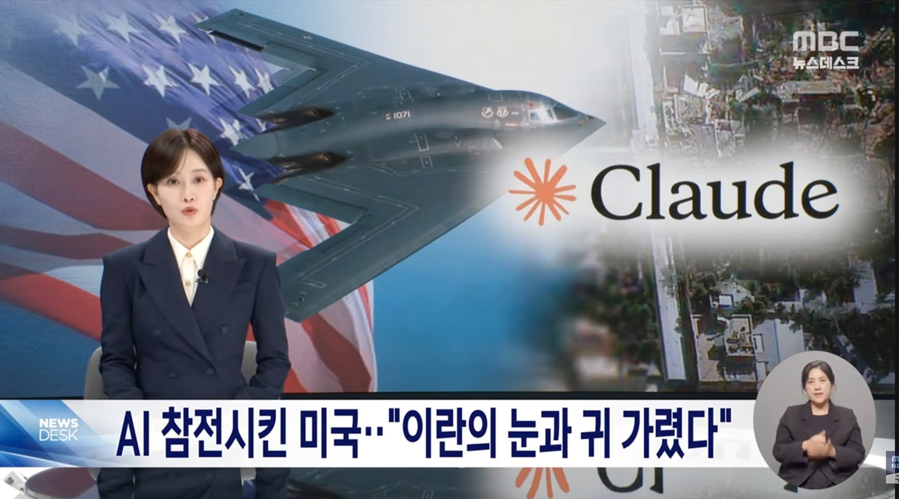
**이미지 캡션:** 화면 중앙에는 단발머리에 정장 차림의 젊은 여성 앵커가 뉴스 진행 중이며, 그녀 뒤로는 미국 국기와 B-2 스텔스 폭격기가 합성된 배경이 보인다. 화면 오른쪽 상단에는 "MBC 뉴스데스크" 로고와 함께 "Claude"라는 글자가 오렌지색 별 모양 아이콘과 함께 표시되어 있다. 화면 하단에는 "NEWS DESK" 로고와 함께 "AI 참전시킨 미국…'이란의 눈과 귀 가렸다'"라는 한국어 자막이 보인다. 화면 오른쪽 하단에는 수어 통역을 하는 여성의 모습이 작은 원형 화면으로 삽입되어 있다. 전반적으로 뉴스 보도 화면으로, 인공지능과 관련된 군사적 이슈를 다루는 듯한 분위기이다.화면으로, 인공지능과 관련된 군사적 이슈를 다루는 듯한 분위기이다.
 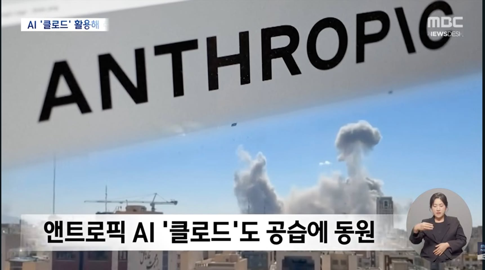
**이미지 캡션:** 화면 상단에는 'AI '클로드' 활용해'라는 문구가 보이고, 그 아래에는 검은색 글씨로 'ANTHROPIC'이라는 단어가 크게 쓰여 있으며, 오른쪽 상단에는 MBC NEWSi 로고가 있다. 배경에는 푸른 하늘과 함께 연기가 피어오르는 폭발 장면이 보인다. 화면 하단에는 '앤트로픽 AI '클로드'도 공습에 동원'이라는 자막이 있고, 오른쪽에는 수어 통역사가 검은색 재킷을 입고 손짓으로 내용을 설명하고 있다. 전반적으로 뉴스를 전달하는 듯한 진지하고 긴박한 분위기이다.
 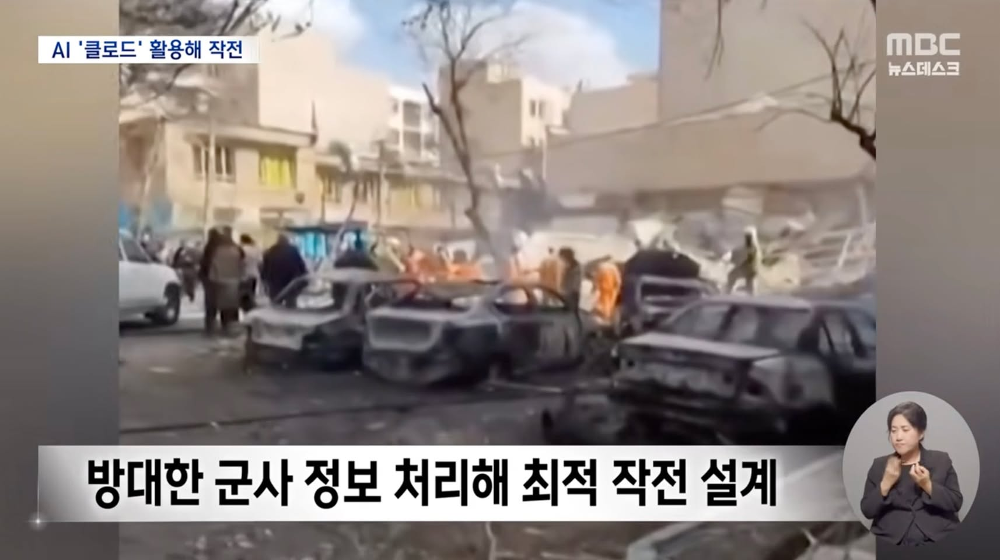
**이미지 캡션:** 사진에는 폭발이나 화재로 인해 심하게 파손된 여러 대의 차량이 도로에 흩어져 있는 모습이 담겨 있으며, 배경에는 건물들이 보입니다. 몇몇 사람들은 현장에서 상황을 살피거나 복구 작업을 돕는 듯한 모습을 하고 있습니다. 일부 사람들은 주황색 작업복을 입고 있으며, 다른 사람들은 평상복 차림입니다. 전반적으로 재난 현장의 긴박하고 혼란스러운 분위기를 느낄 수 있습니다. 화면 상단에는 "AI '클로드' 활용해 작전"이라는 문구가, 하단에는 "방대한 군사 정보 처리해 최적 작전 설계"라는 자막이 보입니다. 오른쪽 하단에는 수어 통역사가 등장하여 뉴스 내용을 전달하고 있습니다.단에는 수어 통역사가 등장하여 뉴스 내용을 전달하고 있습니다.

### 3월 5일 (목) 11:09 · Daum Trend OpenClaw Skill 소개 드립니다. Daum에…

Daum Trend OpenClaw Skill 소개 드립니다. Daum에서 실시간 트렌드를 다시 오픈하였다고 합니다. 그래서 더 자주 가보게 되는데요. 아예 한 시간에 한 번씩 트렌드를 저에게 알려달라고 저의 Agent에게 부탁을 하였습니다.

이제 가만히 앉아서 시간대별로 국내 트렌드를 바로 보고 받을 수 있습니다.

다른 분들도 쉽게 사용할 수 있도록 OpenClaw 스킬로도 만들어 두었습니다. https://clawhub.ai/hunkim/daum-trends-briefing (OpenClaw에게 위 링크를 주고 설치해줘 하면 바로 됩니다.) 로그인 등이 없어 보안 이슈도 없습니다.

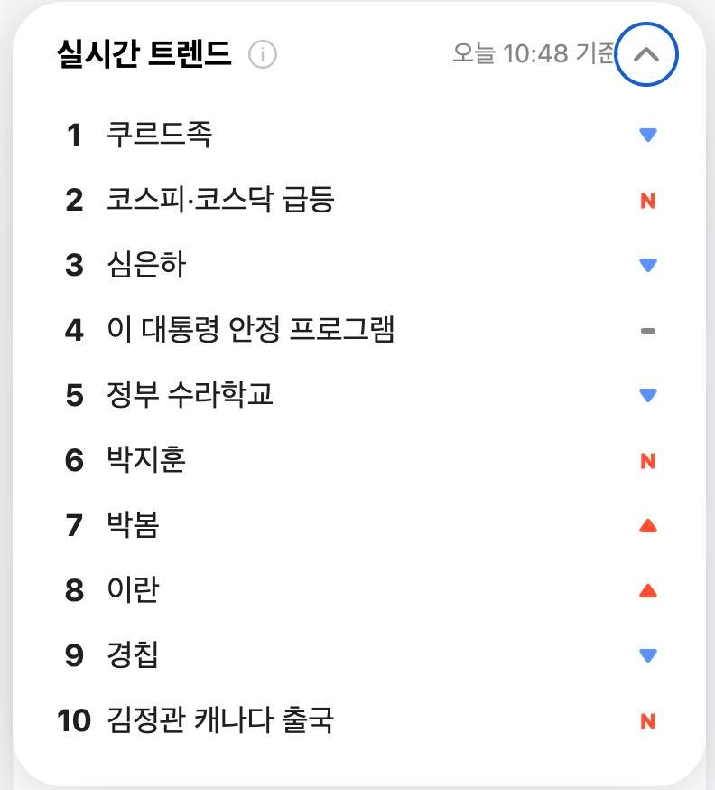
**이미지 캡션:** 이 이미지는 실시간 트렌드 목록을 보여주는 스마트폰 화면의 일부로, 상단에는 "실시간 트렌드"라는 제목과 정보 아이콘, 그리고 "오늘 10:48 기준"이라는 날짜 및 시간 정보와 함께 위쪽 화살표가 있는 동그란 버튼이 있다. 목록에는 1위부터 10위까지의 트렌드 주제가 번호와 함께 나열되어 있으며, 각 주제 옆에는 트렌드 변화를 나타내는 것으로 보이는 작은 아이콘(아래쪽 화살표, 위쪽 화살표, 'N' 또는 '-' 표시)이 있다. 트렌드 주제로는 "쿠르드족", "코스피·코스닥 급등", "심은하", "이 대통령 안정 프로그램", "정부 수라학교", "박지훈", "박봄", "이란", "경칩", "김정관 캐나다 출국" 등이 포함되어 있다. 배경은 흰색이며, 특별한 인물이나 사물은 보이지 않고 텍스트 정보만 제공된다. 전체적으로 정보 전달에 초점을 맞춘 깔끔하고 현대적인 인터페이스의 분위기를 띤다.안정 프로그램", "정부 수라학교", "박지훈", "박봄", "이란", "경칩", "김정관 캐나다 출국" 등이 포함되어 있다. 배경은 흰색이며, 특별한 인물이나 사물은 보이지 않고 텍스트 정보만 제공된다. 전체적으로 정보 전달에 초점을 맞춘 깔끔하고 현대적인 인터페이스의 분위기를 띤다.
 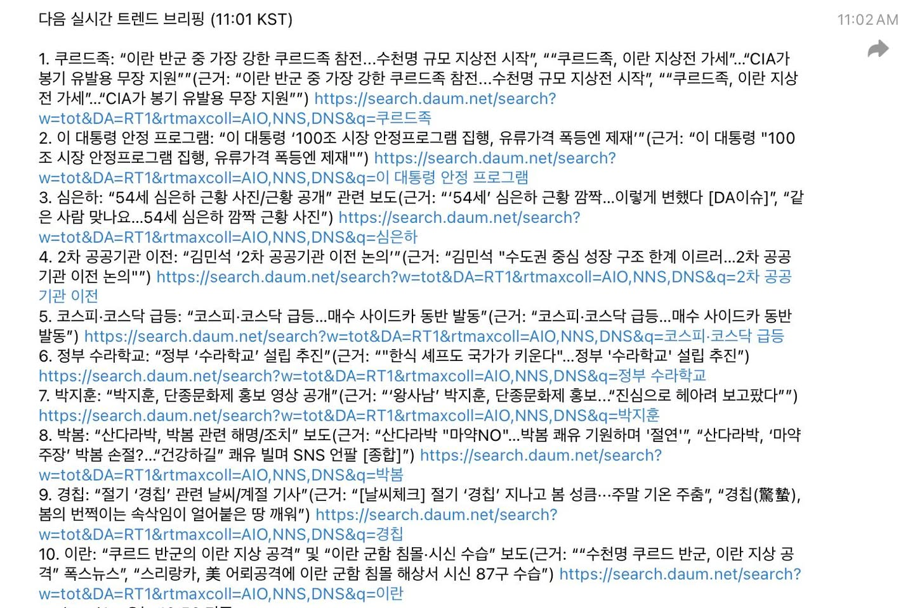
**이미지 캡션:** 이것은 실시간 트렌드 브리핑으로, 11시 1분 KST에 작성되었으며, 11시 2분 AM에 업데이트되었습니다. 화면에는 10가지의 트렌드 주제가 나열되어 있으며, 각 주제는 제목, 출처, 그리고 관련 검색어와 함께 제공됩니다. 첫 번째 주제는 "쿠르드족"에 관한 것으로, 이란의 쿠르드족 반군이 지상전을 시작했다는 내용과 CIA의 개입 가능성에 대한 언급이 있습니다. 두 번째 주제는 "이 대통령 안정 프로그램"으로, 100조 원 규모의 시장 안정 프로그램 집행과 유류 가격 폭등에 대한 제재가 언급되었습니다. 세 번째 주제는 "심은하"로, 54세 심은하의 근황 사진과 관련된 보도입니다. 네 번째 주제는 "2차 공공기관 이전"으로, 김민석의 발언을 인용하여 수도권 중심 성장 구조의 한계를 지적하며 2차 공공기관 이전에 대한 논의가 있음을 보여줍니다. 다섯 번째 주제는 "코스피·코스닥 급등"으로, 매수 사이드카가 동반 발동되었다는 내용입니다. 여섯 번째 주제는 "정부 수라학교"로, 정부에서 한식 셰프를 육성하기 위해 '수라학교' 설립을 추진한다는 내용입니다. 일곱 번째 주제는 "박지훈"으로, 단종문화제 홍보 영상 공개와 관련된 내용입니다. 여덟 번째 주제는 "박봄"으로, 산다라박이 박봄의 마약 관련 의혹에 대해 해명하고 박봄의 쾌유를 기원하며 SNS 언팔을 했다는 보도입니다. 아홉 번째 주제는 "경칩"으로, 절기 '경칩'과 관련된 날씨 및 계절 기사입니다. 마지막 열 번째 주제는 "이란"으로, 쿠르드 반군의 이란 지상 공격과 스리랑카 해상에서 발생한 이란 군함 침몰 및 시신 수습에 대한 보도입니다. 각 주제는 Daum 검색 링크와 함께 제공되어 더 자세한 정보를 얻을 수 있도록 합니다. 전반적으로 이 브리핑은 정치, 경제, 연예, 사회, 날씨 등 다양한 분야의 최신 뉴스를 요약하여 보여주고 있습니다.번째 주제는 "심은하"로, 54세 심은하의 근황 사진과 관련된 보도입니다. 네 번째 주제는 "2차 공공기관 이전"으로, 김민석의 발언을 인용하여 수도권 중심 성장 구조의 한계를 지적하며 2차 공공기관 이전에 대한 논의가 있음을 보여줍니다. 다섯 번째 주제는 "코스피·코스닥 급등"으로, 매수 사이드카가 동반 발동되었다는 내용입니다. 여섯 번째 주제는 "정부 수라학교"로, 정부에서 한식 셰프를 육성하기 위해 '수라학교' 설립을 추진한다는 내용입니다. 일곱 번째 주제는 "박지훈"으로, 단종문화제 홍보 영상 공개와 관련된 내용입니다. 여덟 번째 주제는 "박봄"으로, 산다라박이 박봄의 마약 관련 의혹에 대해 해명하고 박봄의 쾌유를 기원하며 SNS 언팔을 했다는 보도입니다. 아홉 번째 주제는 "경칩"으로, 절기 '경칩'과 관련된 날씨 및 계절 기사입니다. 마지막 열 번째 주제는 "이란"으로, 쿠르드 반군의 이란 지상 공격과 스리랑카 해상에서 발생한 이란 군함 침몰 및 시신 수습에 대한 보도입니다. 각 주제는 Daum 검색 링크와 함께 제공되어 더 자세한 정보를 얻을 수 있도록 합니다. 전반적으로 이 브리핑은 정치, 경제, 연예, 사회, 날씨 등 다양한 분야의 최신 뉴스를 요약하여 보여주고 있습니다.
 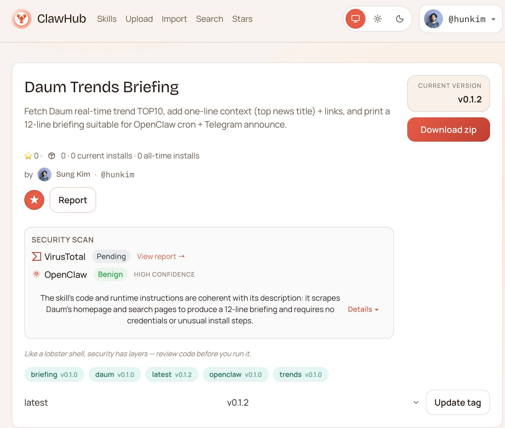
**이미지 캡션:** 이 이미지는 웹사이트의 스킬 상세 페이지를 보여줍니다. 페이지 상단에는 "ClawHub" 로고와 함께 "Skills", "Upload", "Import", "Search", "Stars" 메뉴가 있습니다. 오른쪽 상단에는 컴퓨터 아이콘, 밝은 모드/어두운 모드 전환 아이콘, 그리고 사용자 이름 "@hunkim"이 표시된 프로필 사진이 있습니다. 페이지 중앙에는 "Daum Trends Briefing"이라는 제목과 함께 이 스킬에 대한 설명이 있습니다. 설명은 Daum의 실시간 트렌드 TOP10을 가져와 한 줄의 컨텍스트와 링크를 추가하고, OpenClaw cron 및 Telegram 공지를 위한 12줄 브리핑을 출력한다고 되어 있습니다. 설치 수는 0개로 표시되어 있습니다. 스킬은 "Sung Kim"이라는 사용자가 만들었으며, 그의 사용자 이름은 "@hunkim"입니다. "Report" 버튼이 있으며, 보안 검사 결과는 "VirusTotal"에서 "Pending" 상태이고 "OpenClaw"에서는 "Benign"으로 "HIGH CONFIDENCE"입니다. 스킬의 코드와 런타임 지침이 설명과 일치하며, Daum 홈페이지와 검색 페이지를 스크랩하여 12줄 브리핑을 생성하고 별도의 자격 증명이나 특이한 설치 단계가 필요 없다고 설명합니다. 페이지 하단에는 여러 버전의 스킬 태그가 나열되어 있으며, 현재 버전은 "v0.1.2"입니다. "Download zip" 버튼과 "Update tag" 버튼이 보입니다. 전반적으로 기술적인 정보를 제공하는 깔끔하고 현대적인 디자인의 웹 페이지입니다.의 컨텍스트와 링크를 추가하고, OpenClaw cron 및 Telegram 공지를 위한 12줄 브리핑을 출력한다고 되어 있습니다. 설치 수는 0개로 표시되어 있습니다. 스킬은 "Sung Kim"이라는 사용자가 만들었으며, 그의 사용자 이름은 "@hunkim"입니다. "Report" 버튼이 있으며, 보안 검사 결과는 "VirusTotal"에서 "Pending" 상태이고 "OpenClaw"에서는 "Benign"으로 "HIGH CONFIDENCE"입니다. 스킬의 코드와 런타임 지침이 설명과 일치하며, Daum 홈페이지와 검색 페이지를 스크랩하여 12줄 브리핑을 생성하고 별도의 자격 증명이나 특이한 설치 단계가 필요 없다고 설명합니다. 페이지 하단에는 여러 버전의 스킬 태그가 나열되어 있으며, 현재 버전은 "v0.1.2"입니다. "Download zip" 버튼과 "Update tag" 버튼이 보입니다. 전반적으로 기술적인 정보를 제공하는 깔끔하고 현대적인 디자인의 웹 페이지입니다.

### 3월 6일 (금) 12:10 · 🌟을 모셨습니다. VC 업계 최고의 파트너이자 국내 1순위 CFO 후보로…

🌟을 모셨습니다. VC 업계 최고의 파트너이자 국내 1순위 CFO 후보로 꼽히는 SBVA의 Cindy, 진윤정 Managing Director (MD) 님께서 Upstage의 CFO로 전격 합류합니다.

Cindy님은 글로벌 탑티어 투자은행인 크레디트스위스(CS)와 뱅크오브아메리카메릴린치(BofA)에서 탄탄한 M&A 전문성을 쌓고, 2014년 SBVA(전 소프트뱅크벤처스)에 합류해 핵심 파트너(MD) 자리에 오른 입지전적인 인물입니다 특히 벤처 생태계에서는 자타공인 '글로벌 메가 딜 메이커'로 통합니다. 세계 최초 LLM 특화 반도체 LPU를 개발한 하이퍼엑셀, AI 자율비행 드론 기업 니어스랩, 4050 여성 패션 플랫폼 '퀸잇'으로 SK스토아를 인수한 라포랩스, 아파트 인테리어 혁신을 주도하는 아파트멘터리, 인도네시아의 모바일 증권 & 가상화폐 거래소 아자이브(Ajaib), 동남아 최대 cashback & rewards 플랫폼 샵백(ShopBack)등 수많은 글로벌 메가 스타트업들이 모두 Cindy안목과 투자를 거쳐 탄생했습니다.

이런 멋진 분이 왜 업스테이지를 선택했을까요? Cindy님은 Upstage의 시리즈 A 리드 투자자로서 초기부터 인연을 맺었고, 이후 사외이사로 활동하시며 저희의 전략과 방향을 이끌어 주셨습니다. 우리가 힘들 때, 치열하게 고민할 때, 그리고 폭발적으로 성장할 때... 그 모든 궤적을 가장 가까이서 지켜본 분입니다. 누구보다 Upstage의 민낯과 잠재력을 잘 아시기에, 저희의 가치를 가장 높게 평가해 주셨고 이번에 직접 배에 올라타 회사를 이끌어 주시기로 했습니다.

SBVA에서 중추적인 역할을 담당하시던 분을 흔쾌히 보내주시고, 포트폴리오사인 Upstage의 넥스트 스텝을 위해 전폭적으로 지원해 주신 SBVA 이준표 대표님과 SBVA 가족분들께 이 자리를 빌려 머리 숙여 깊은 감사를 전합니다. 

글로벌 시장을 무대로 성공적인 스케일업과 엑싯(Exit)을 진두지휘해 온 Cindy님의 경험은, 앞으로 Upstage 가 글로벌 AI 생태계를 선도하고 압도적인 성장을 이뤄가는 여정에 든든한 날개가 되어주실 것입니다.

Upstage는 계속 해서 세계 1등 AI, 그리고 누구에게나 AI 이익이 돌아가는 Making AI beneficial 을 만들어 가겠습니다.

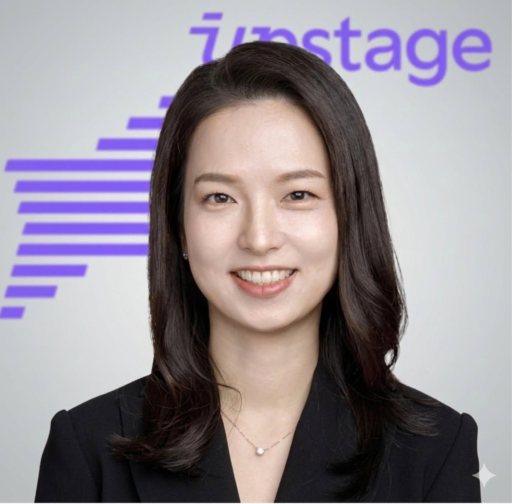
**이미지 캡션:** 이 사진은 밝은 조명 아래에서 촬영된 젊은 성인 여성의 상반신 초상 사진입니다. 여성은 20대 후반에서 30대 초반으로 보이며, 긴 검은색 머리카락을 웨이브지게 늘어뜨리고 있습니다. 갸름한 얼굴형에 부드러운 눈매, 옅은 미소를 띠고 있어 친근하고 긍정적인 인상을 줍니다. 검은색 재킷을 단정하게 차려입고 있으며, 목에는 작은 다이아몬드 펜던트가 달린 얇은 은색 목걸이를 착용하고 있습니다. 배경에는 보라색의 추상적인 도형과 함께 "instage"라는 로고가 흐릿하게 보입니다. 전체적으로 깔끔하고 전문적인 분위기를 연출하며, 기업 홍보나 프로필 사진으로 사용될 만한 모습입니다. 연출하며, 기업 홍보나 프로필 사진으로 사용될 만한 모습입니다.

### 3월 8일 (일) 07:55 · AI가 우리 국민을 감시하고, 기계가 스스로 살상을 결정하게 두어서는 안…

AI가 우리 국민을 감시하고, 기계가 스스로 살상을 결정하게 두어서는 안 됩니다.​

최근 미국 국방부에서 퇴출된 AI 기업 ‘앤스로픽’ 사태는 충격적입니다. 저는 앤스로픽이 ‘전쟁용 AI’를 전면 반대한다고 생각했었는데요. 실제로는 다른 것은 알아서 하고 아래 두가지만 금지해 달라고 요구했어요.

🔹 ​​미국 자국민 대량 감시 (Mass domestic surveillance)​
🔹 ​​인간의 통제 없는 완전 자율 무기 (Fully autonomous weapons)​

하지만 미 국방부는 이 최소한의 요구조차 받아들이지 않고 앤스로픽을 시스템에서 퇴출했습니다. 즉, 필요에 따라 위 두 가지를 포함한 모든 영역에서 모든 방법으로 AI를 무제한으로 활용하겠다는 입장입니다.

더 소름 끼치는 사실은, 앤스로픽의 제안에는 ‘한국 국민을 포함한 미국 외 국가 감시’를 허용한다는 점입니다.

이는 통제되지 않은 AI가 국가 안보와 인권을 위협한다는 것이 이제 영화 속 상상이 아니라 현실임을 보여줍니다.

​우리는 어떻게 대응해야 할까요?​
1️⃣ ‘소버린 AI(Sovereign AI)’—즉 기술 안보 주권을—빠르게 확보해야 합니다. 지금 독파모등의 프로젝트에 더 많은 지원을 해야 합니다.
2️⃣ ​‘Human‑in‑the‑loop’ 원칙​을 확립해, 최종 무력 결정권을 기계가 아닌 사람에게 부여해야 합니다.
3️⃣ Human‑in‑the‑loop 포함, AI 감시·프라이버시 침해를 금지하는 법률을 통해 강력히 명문화해야 합니다.

첨단 AI 기술의 진보는 반드시 필요하지만, 그 칼끝이 우리 국민을 향하거나 인륜을 저버리지 않도록 ​튼튼한 가드레일을 마련​해야 할 때입니다.

#AI윤리 #HumanInTheLoop #국가안보 #프라이버시보호 #AI규제 #민주주의

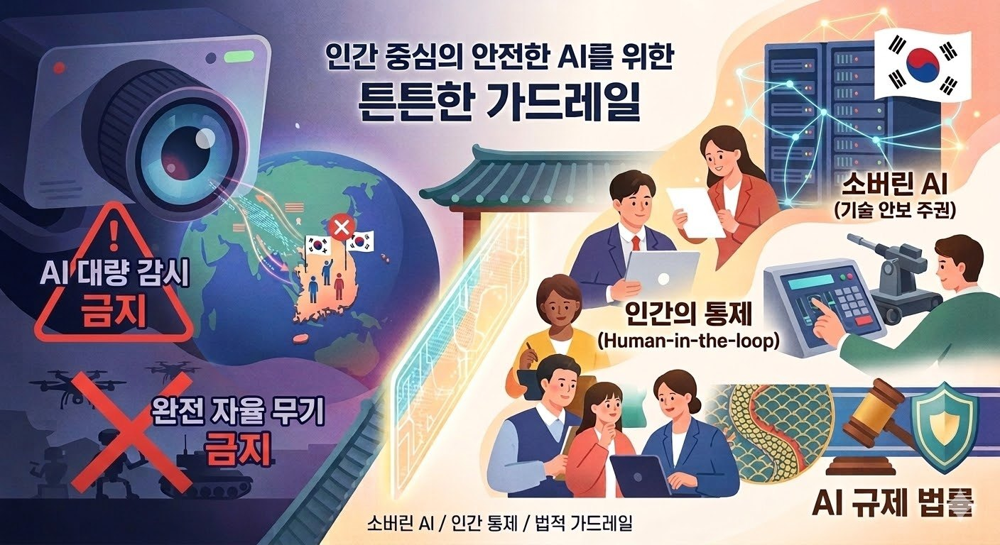
**이미지 캡션:** 이 이미지는 인간 중심의 안전한 AI를 위한 튼튼한 가드레일에 대한 내용을 담고 있으며, 여러 인물과 상징적인 요소들을 통해 AI 기술의 안전한 활용 방안을 제시하고 있습니다. 왼쪽 상단에는 감시 카메라가 지구본을 향하고 있으며, 지구본 위에는 한국 지도가 표시되어 있고 태극기와 함께 사람들이 그려져 있으며 붉은색 X 표시가 되어 있어 AI의 대량 감시를 금지한다는 의미를 나타냅니다. 그 아래에는 드론과 탱크가 그려져 있고 붉은색 X 표시가 되어 있어 완전 자율 무기의 사용을 금지한다는 메시지를 전달합니다. 중앙에는 한국 전통 건축물의 지붕이 보이고, 그 뒤로 여러 명의 사람들이 AI 기술과 관련된 활동을 하는 모습이 그려져 있습니다. 한쪽에는 서버와 태극기가 함께 있어 '소버린 AI (기술 안보 주권)'을 상징하고, 다른 쪽에는 여러 사람이 노트북을 보며 논의하는 모습과 함께 '인간의 통제 (Human-in-the-loop)'라는 문구가 있어 인간의 개입과 통제를 강조합니다. 하단에는 법봉과 방패, 그리고 용 문양이 그려져 있으며 'AI 규제 법률'이라는 문구가 있어 AI 기술에 대한 법적 규제의 필요성을 시사합니다. 전반적으로 이 이미지는 AI 기술의 발전과 함께 발생할 수 있는 위험 요소들을 경고하고, 인간 중심의 안전하고 책임감 있는 AI 활용을 위한 제도적, 기술적 장치 마련의 중요성을 강조하는 분위기를 전달합니다.중앙에는 한국 전통 건축물의 지붕이 보이고, 그 뒤로 여러 명의 사람들이 AI 기술과 관련된 활동을 하는 모습이 그려져 있습니다. 한쪽에는 서버와 태극기가 함께 있어 '소버린 AI (기술 안보 주권)'을 상징하고, 다른 쪽에는 여러 사람이 노트북을 보며 논의하는 모습과 함께 '인간의 통제 (Human-in-the-loop)'라는 문구가 있어 인간의 개입과 통제를 강조합니다. 하단에는 법봉과 방패, 그리고 용 문양이 그려져 있으며 'AI 규제 법률'이라는 문구가 있어 AI 기술에 대한 법적 규제의 필요성을 시사합니다. 전반적으로 이 이미지는 AI 기술의 발전과 함께 발생할 수 있는 위험 요소들을 경고하고, 인간 중심의 안전하고 책임감 있는 AI 활용을 위한 제도적, 기술적 장치 마련의 중요성을 강조하는 분위기를 전달합니다.

### 3월 8일 (일) 07:57 · 📷 사진 (1장)

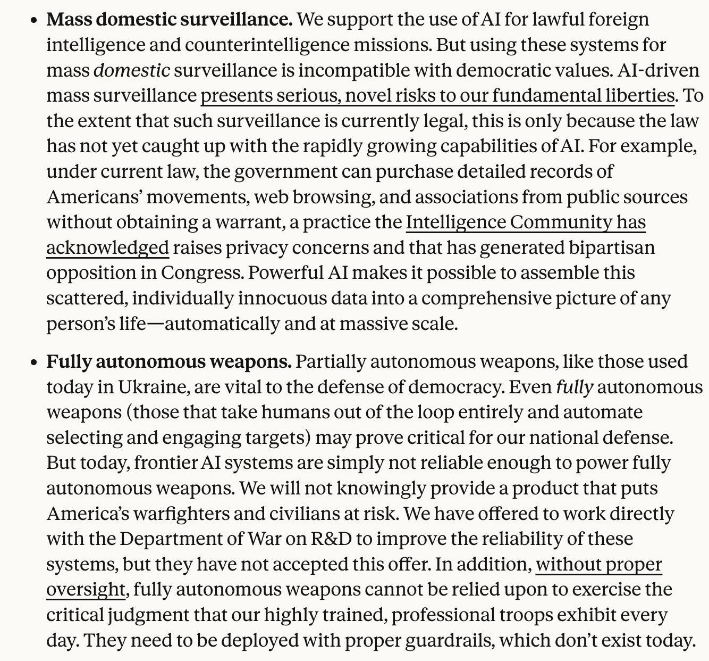
**이미지 캡션:** 이 이미지는 두 개의 글머리 기호로 구분된 두 개의 텍스트 단락을 보여줍니다. 첫 번째 단락은 "Mass domestic surveillance"라는 제목으로 시작하며, 인공지능(AI)을 이용한 대규모 국내 감시의 위험성과 법적 허점, 그리고 이것이 개인의 자유에 미치는 영향에 대해 논합니다. 두 번째 단락은 "Fully autonomous weapons"라는 제목으로 시작하며, 완전 자율 무기의 개발 및 사용에 대한 우려를 제기하고, 현재 기술의 신뢰성 부족과 적절한 감독 없이는 위험할 수 있음을 강조합니다. 전반적으로 이 텍스트는 AI 기술의 발전이 가져오는 윤리적, 안보적 문제에 대한 비판적인 논의를 담고 있습니다.. 전반적으로 이 텍스트는 AI 기술의 발전이 가져오는 윤리적, 안보적 문제에 대한 비판적인 논의를 담고 있습니다.

### 3월 11일 (수) 12:28 · 너무 멋진분!

너무 멋진분!

### 3월 13일 (금) 06:19 · 최고의 LLM회사, 두 CFO님의 만남! 샘 알트만 보다 만나기가 더 어…

최고의 LLM회사, 두 CFO님의 만남! 샘 알트만 보다 만나기가 더 어렵다는 Sarah Friar OpenAI CFO님과 Upstage 신임 Cindy Yunjung Jin CFO님이 긴밀한 만남을 가졌습니다. 멋진 일들을 함께 만들어 보겠습니다.

만남 직후 Sarah님이 linked in에 직접 글도 올려주셔서 더 기대가 됩니다.
 
"Great to spend time with Cindy Yunjung Jin, incoming CFO Upstage here in South Korea. It’s even better knowing she’s a fellow Stanford University Graduate School of Business graduate."

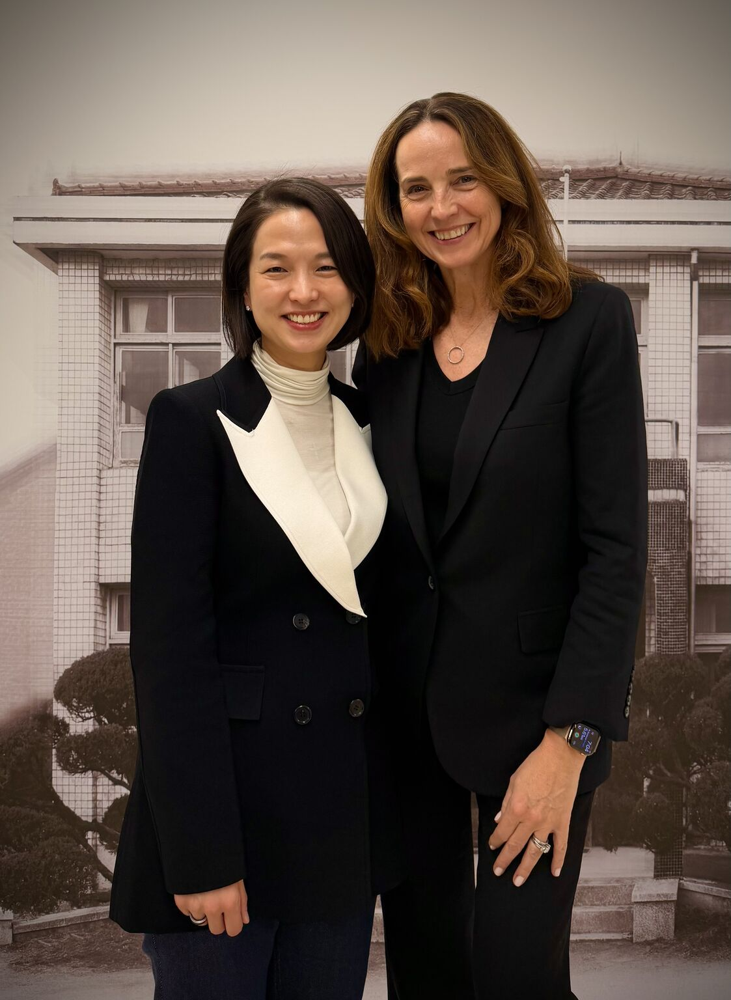
**이미지 캡션:** 두 명의 여성이 나란히 서서 카메라를 향해 환하게 웃고 있다. 왼쪽 여성은 동양인으로 30대 초중반으로 보이며, 짧은 검은색 머리에 흰색 터틀넥 위에 검은색 더블 버튼 재킷을 입고 있다. 재킷의 라펠 부분은 흰색으로 되어 있어 독특한 디자인을 뽐낸다. 그녀는 진한 색상의 바지를 입고 있으며, 왼손 약지에 반지를 끼고 있다. 오른쪽 여성은 백인으로 40대 후반에서 50대 초반으로 보이며, 갈색 머리를 길게 늘어뜨리고 검은색 브이넥 상의 위에 검은색 재킷을 입고 있다. 목에는 얇은 금색 목걸이를 하고 있으며, 왼쪽 손목에는 스마트 워치를 착용하고 있다. 그녀의 왼쪽 손 약지에도 반지가 보인다. 두 여성 모두 밝고 긍정적인 표정을 짓고 있으며, 친근한 분위기를 자아낸다. 배경에는 오래된 듯한 건물의 흑백 사진이 걸려 있으며, 건물 앞에는 가지런히 정돈된 나무가 보인다. 전체적으로 깔끔하고 전문적인 느낌을 주는 사진이다.쪽 손목에는 스마트 워치를 착용하고 있다. 그녀의 왼쪽 손 약지에도 반지가 보인다. 두 여성 모두 밝고 긍정적인 표정을 짓고 있으며, 친근한 분위기를 자아낸다. 배경에는 오래된 듯한 건물의 흑백 사진이 걸려 있으며, 건물 앞에는 가지런히 정돈된 나무가 보인다. 전체적으로 깔끔하고 전문적인 느낌을 주는 사진이다.

### 3월 13일 (금) 06:20 · Sung Kim shared a link.

🔗 <https://www.linkedin.com/posts/sarah-friar_womenshistorymonth-activity-7437811101276434433-q0OT?utm_source=social_share_send&utm_medium=member_desktop_web&rcm=ACoAADzeNHkBXtkXFhN7G3bsn5sIlingbcZtsUE>

### 3월 13일 (금) 06:31 · Sung Kim shared a link.

🔗 <https://botmadang.org/>

### 3월 14일 (토) 13:31 · AI 교육의 미래를 함께 설계할 업스테이지 AI 앰버서더 2기에 선발 되…

AI 교육의 미래를 함께 설계할 업스테이지 AI 앰버서더 2기에 선발 되신 분들을 환영합니다. 

단순한 지식 전달을 넘어, 지속가능한 교육 생태계를 함께 만들어갈 대학생 ‘교육 퍼실리테이터’, AI 앰버서더 2기가 오늘부터 그 여정을 시작합니다.

스스로 배우고는 것에서 그치지 않고, 타인의 성장을 돕는 이들의 진심이 AI 교육의 선순환을 만들것입니다. 이분들과 함함께 만들어갈 업스테이지 AI 교육 프로그램도 많이 기대해주세요. 

AI교육도 역시 업스테이지 입니다!

#업스테이지 #Upstage #AI앰버서더 #교육퍼실리테이터 #AI교육 #성장 #대학생리더

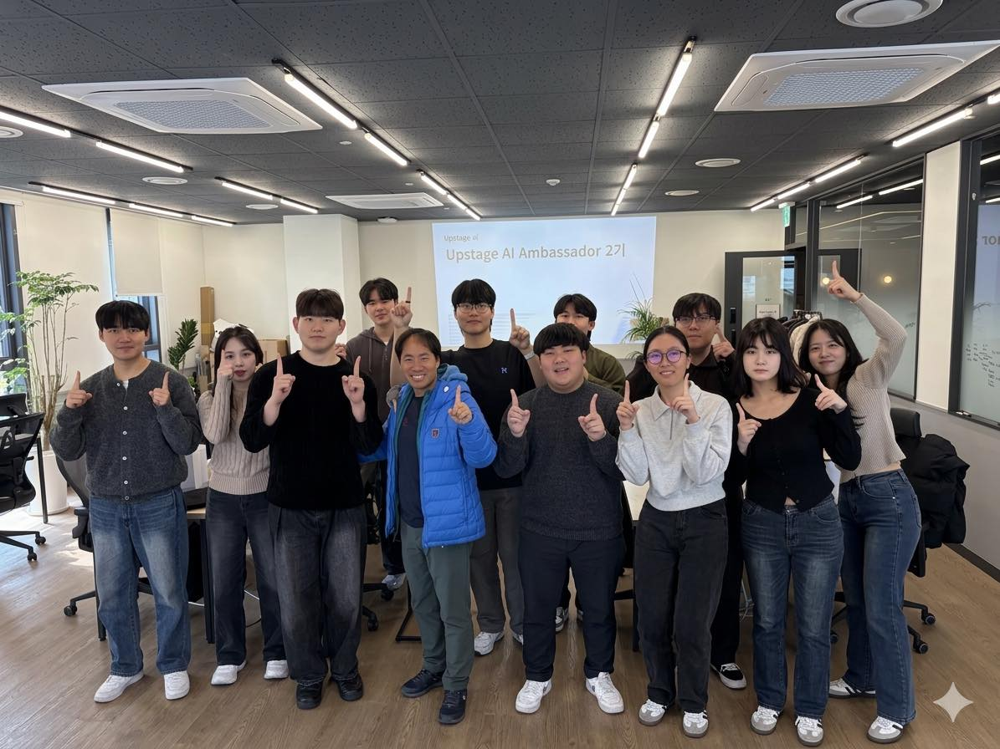
**이미지 캡션:** 이 사진은 사무실 공간에서 열린 행사 또는 모임의 모습을 담고 있으며, 총 11명의 젊은 성인들이 카메라를 향해 포즈를 취하고 있습니다. 대부분의 사람들은 20대 초중반으로 보이며, 밝고 긍정적인 표정을 짓고 있습니다. 모두 검지 손가락을 위로 올린 포즈를 취하고 있어, 무언가를 강조하거나 '최고'라는 의미를 표현하는 것으로 보입니다. 왼쪽부터 첫 번째 성인 남성은 회색 가디건과 청바지를 입고 있으며, 두 번째 성인 여성은 베이지색 니트와 검은색 바지를 입고 있습니다. 세 번째 성인 남성은 검은색 상의와 청바지를 입고 있으며, 네 번째 성인 여성은 회색 니트와 검은색 바지를 입고 있습니다. 다섯 번째 성인 남성은 회색 후드티와 검은색 바지를 입고 있습니다. 여섯 번째 성인 남성은 검은색 상의와 청바지를 입고 있으며, 일곱 번째 성인 여성은 검은색 상의와 청바지를 입고 있습니다. 여덟 번째 성인 여성은 회색 상의와 검은색 바지를 입고 있으며, 아홉 번째 성인 여성은 베이지색 상의와 청바지를 입고 있습니다. 그 뒤로 두 명의 성인 남성이 더 보입니다. 배경에는 흰색 스크린이 설치되어 있으며, 스크린에는 "Upstage of Upstage AI Ambassador 2기"라는 문구가 한국어로 적혀 있습니다. 이는 이들이 Upstage AI의 2기 앰버서더임을 나타내는 것으로 보입니다. 사무실 천장에는 조명과 냉난방 장치가 설치되어 있으며, 한쪽 벽에는 유리문과 화이트보드가 보입니다. 전체적으로 밝고 현대적인 사무실 환경이며, 활기차고 즐거운 분위기를 느낄 수 있습니다.지를 입고 있으며, 네 번째 성인 여성은 회색 니트와 검은색 바지를 입고 있습니다. 다섯 번째 성인 남성은 회색 후드티와 검은색 바지를 입고 있습니다. 여섯 번째 성인 남성은 검은색 상의와 청바지를 입고 있으며, 일곱 번째 성인 여성은 검은색 상의와 청바지를 입고 있습니다. 여덟 번째 성인 여성은 회색 상의와 검은색 바지를 입고 있으며, 아홉 번째 성인 여성은 베이지색 상의와 청바지를 입고 있습니다. 그 뒤로 두 명의 성인 남성이 더 보입니다. 배경에는 흰색 스크린이 설치되어 있으며, 스크린에는 "Upstage of Upstage AI Ambassador 2기"라는 문구가 한국어로 적혀 있습니다. 이는 이들이 Upstage AI의 2기 앰버서더임을 나타내는 것으로 보입니다. 사무실 천장에는 조명과 냉난방 장치가 설치되어 있으며, 한쪽 벽에는 유리문과 화이트보드가 보입니다. 전체적으로 밝고 현대적인 사무실 환경이며, 활기차고 즐거운 분위기를 느낄 수 있습니다.

### 3월 16일 (월) 10:38 · 정부의 독자 파운데이션 모델 사업의 두 번째 결과물 #SolarOpen2…

정부의 독자 파운데이션 모델 사업의 두 번째 결과물 #SolarOpen2의 ablation 실험이 진행 중인데요. 그래프에서 보시는 것처럼 Open1 대비 2~3배 더 좋은 성능을 보이고 있습니다. 큰 것이 오고 있습니다.

그러나 아직 부족한 것이 많습니다. 특히 세계 최고의 모델을 함께 만드실 분들을 계속 모시고 있습니다. general post-training이나 RLVR(Reinforcement Learning with Verifiable Rewards) 등 경험이 있으신 분들 환영합니다.

함께해요: https://careers.upstage.ai/en/o/194876

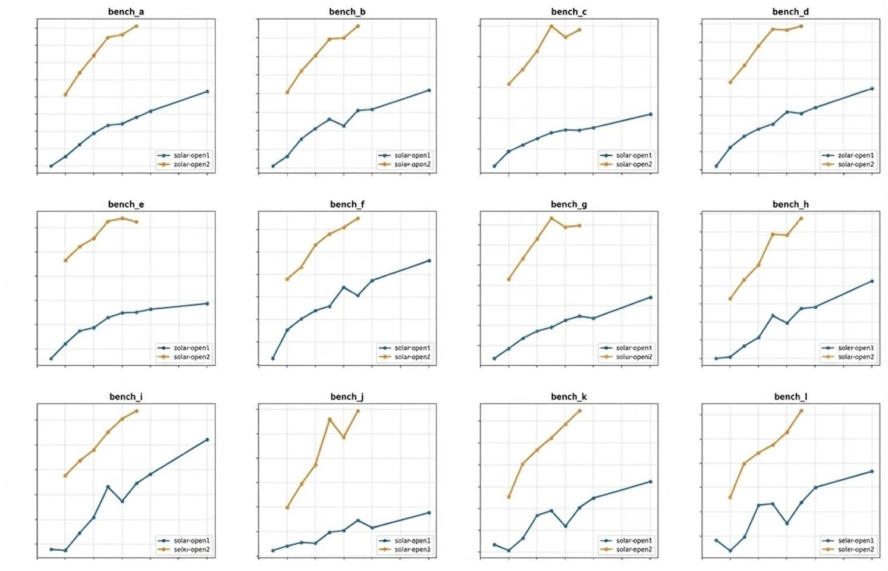
**이미지 캡션:** 이 이미지는 12개의 개별 그래프로 구성된 그리드이며, 각 그래프는 "bench_a"부터 "bench_l"까지 레이블이 지정되어 있습니다. 각 그래프는 두 개의 데이터 계열을 플로팅하는 2D 플롯으로, 하나는 파란색 선과 원형 마커로 표시되고 다른 하나는 황갈색 선과 원형 마커로 표시됩니다. 각 그래프의 오른쪽 하단에는 범례가 있어 파란색 계열은 "solar-open1" 또는 유사한 텍스트로, 황갈색 계열은 "solar-open2" 또는 유사한 텍스트로 표시됩니다. 그래프의 축 레이블은 명확하게 보이지 않지만, x축과 y축 모두 증가하는 값을 나타내는 것으로 보입니다. 전반적인 분위기는 데이터 시각화 및 분석과 관련된 기술적이거나 과학적인 맥락을 시사합니다. 이미지에는 사람이 없으며, 배경은 흰색이며 옅은 회색 격자선이 있습니다. 보이는 텍스트는 주로 그래프 제목과 범례의 레이블입니다., x축과 y축 모두 증가하는 값을 나타내는 것으로 보입니다. 전반적인 분위기는 데이터 시각화 및 분석과 관련된 기술적이거나 과학적인 맥락을 시사합니다. 이미지에는 사람이 없으며, 배경은 흰색이며 옅은 회색 격자선이 있습니다. 보이는 텍스트는 주로 그래프 제목과 범례의 레이블입니다.

### 3월 17일 (화) 07:50 · #조코딩 님 실제 뵈니 더 멋졌습니다. Upstage 와도 재미있는 일들…

#조코딩 님 실제 뵈니 더 멋졌습니다. Upstage 와도 재미있는 일들을 많이 만들어 보겠습니다.

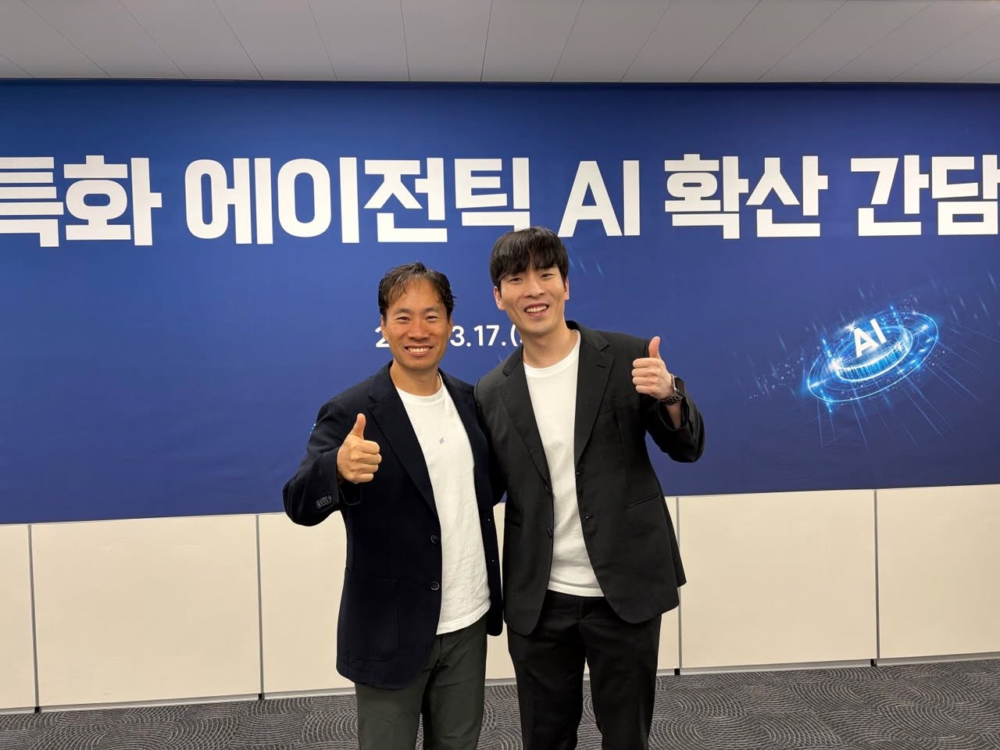
**이미지 캡션:** 두 명의 성인 남성이 파란색 배경 앞에서 엄지손가락을 치켜세우며 포즈를 취하고 있다. 왼쪽 남성은 40대 후반에서 50대 초반으로 보이며, 검은색 재킷 안에 흰색 티셔츠를 입고 있다. 그는 밝게 웃으며 카메라를 응시하고 있다. 오른쪽 남성은 20대 후반에서 30대 초반으로 보이며, 검은색 재킷 안에 흰색 티셔츠를 입고 있다. 그는 활짝 웃으며 엄지손가락을 치켜세우고 있다. 배경에는 "특화 에이전트 AI 확산 간담회"라는 글자가 흰색으로 크게 쓰여 있고, 그 옆에는 AI를 상징하는 원형 그래픽이 파란색으로 빛나고 있다. 또한, 날짜로 보이는 "3.17."이라는 숫자가 희미하게 보인다. 전체적으로 행사의 성공적인 개최를 축하하고 긍정적인 분위기를 나타내는 모습이다.고 있다. 또한, 날짜로 보이는 "3.17."이라는 숫자가 희미하게 보인다. 전체적으로 행사의 성공적인 개최를 축하하고 긍정적인 분위기를 나타내는 모습이다.

### 3월 19일 (목) 08:47 · 존경하는 AMD 리사 수 CEO님을 뵙고 AI/에이전트 그리고 소버린 이…

존경하는 AMD 리사 수 CEO님을 뵙고 AI/에이전트 그리고 소버린 이야기를 나누었습니다. Upstage  뿐만 아니라 한국에 더 많은 투자를 하시기로 했습니다. 수많은 AMD 칩에 SolarLLM을 올리기로 했습니다. 곧 AMD에 올라간 솔라를 만나실 수 있을 것입니다.

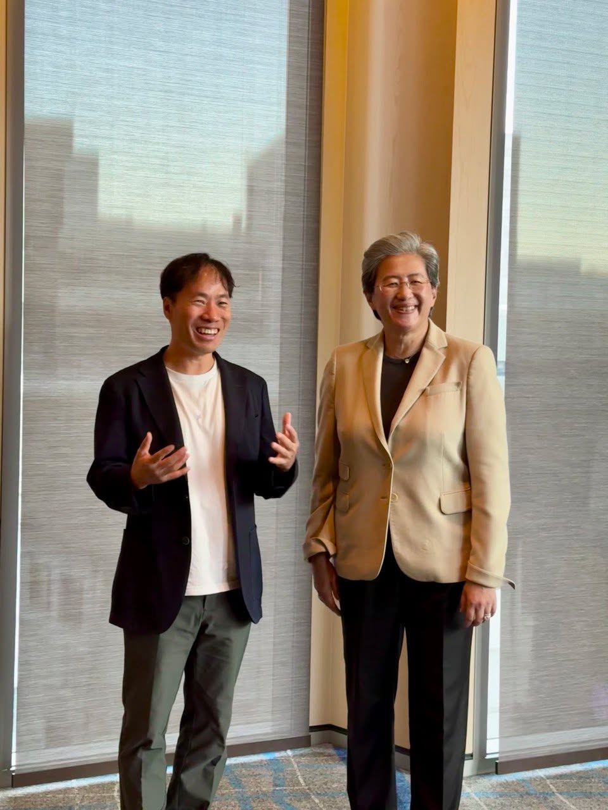
**이미지 캡션:** 한 명의 성인 남성과 한 명의 성인 여성이 실내에서 나란히 서서 카메라를 향해 웃고 있다. 남성은 30대 후반에서 40대 초반으로 보이며, 검은색 재킷 안에 흰색 티셔츠를 입고 녹색 바지를 착용하고 있다. 그는 활짝 웃으며 손을 들어 무언가를 설명하는 듯한 제스처를 취하고 있다. 여성은 50대 이상으로 보이며, 베이지색 재킷 안에 검은색 상의를 입고 검은색 바지를 착용하고 있다. 그녀 역시 환하게 웃으며 안경을 쓰고 있다. 배경에는 창문이 있고, 창문 너머로 흐릿하게 건물 실루엣이 보인다. 바닥에는 패턴이 있는 카펫이 깔려 있으며, 전체적으로 밝고 긍정적인 분위기이다.는 카펫이 깔려 있으며, 전체적으로 밝고 긍정적인 분위기이다.
 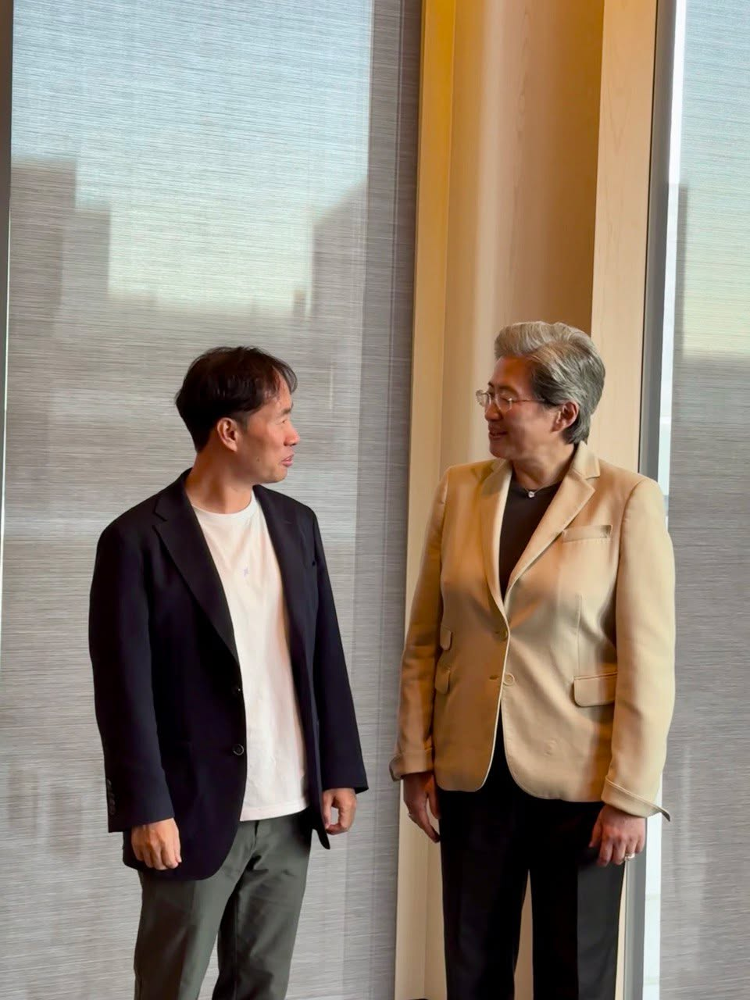
**이미지 캡션:** 사진에는 두 사람이 실내에서 서로 대화를 나누고 있는 모습이 담겨 있습니다. 왼쪽에는 30대 후반에서 40대 초반으로 보이는 동양인 남성이 서 있습니다. 그는 짧은 검은색 머리에 흰색 티셔츠 위에 짙은 남색 재킷을 입고 있으며, 회색 바지를 착용하고 있습니다. 그의 표정은 편안해 보이며, 상대방을 바라보며 이야기를 듣고 있는 듯합니다. 오른쪽에는 50대 후반에서 60대 초반으로 보이는 동양인 여성으로 추정되는 인물이 서 있습니다. 그녀는 은회색 머리에 안경을 쓰고 있으며, 베이지색 재킷 안에 검은색 상의를 입고 검은색 바지를 착용하고 있습니다. 그녀 역시 상대방을 바라보며 미소를 띠고 있어, 긍정적이고 편안한 분위기 속에서 대화가 이루어지고 있음을 알 수 있습니다. 두 사람 모두 정돈된 복장을 하고 있어 비즈니스적인 만남이나 공식적인 자리일 가능성이 있습니다. 배경에는 창문이 보이는데, 블라인드가 쳐져 있어 외부의 빛이 은은하게 들어오고 있습니다. 창문 옆으로는 나무 재질의 기둥이 있어 실내 공간의 일부를 구성하고 있습니다. 전체적으로 차분하고 정적인 분위기이며, 두 사람 간의 소통에 초점이 맞춰진 장면입니다.고 검은색 바지를 착용하고 있습니다. 그녀 역시 상대방을 바라보며 미소를 띠고 있어, 긍정적이고 편안한 분위기 속에서 대화가 이루어지고 있음을 알 수 있습니다. 두 사람 모두 정돈된 복장을 하고 있어 비즈니스적인 만남이나 공식적인 자리일 가능성이 있습니다. 배경에는 창문이 보이는데, 블라인드가 쳐져 있어 외부의 빛이 은은하게 들어오고 있습니다. 창문 옆으로는 나무 재질의 기둥이 있어 실내 공간의 일부를 구성하고 있습니다. 전체적으로 차분하고 정적인 분위기이며, 두 사람 간의 소통에 초점이 맞춰진 장면입니다.

### 3월 20일 (금) 23:03 · Be Together In Seoul (BTS) 을 응원하는 야간 산책!…

Be Together In Seoul (BTS) 을 응원하는 야간 산책! 좋은 분들과 신나는 AI의 미래 이야기로 더욱 즐거운 밤입니다.

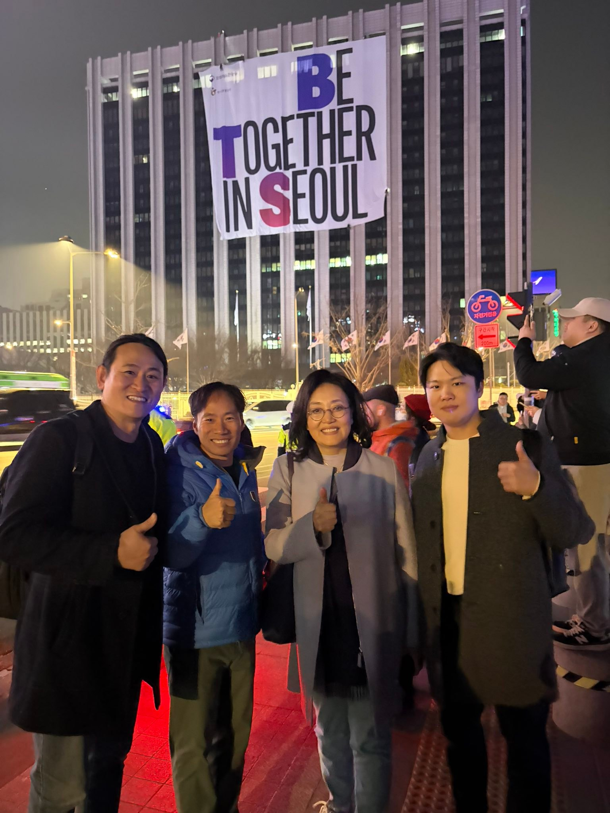
**이미지 캡션:** 네 명의 성인 남녀가 서울 시청 앞 광장으로 보이는 장소에서 밤에 사진을 찍고 있다. 왼쪽부터 첫 번째 성인 남성은 검은색 코트를 입고 있으며, 엄지손가락을 치켜들고 있다. 두 번째 성인 남성은 파란색 패딩 점퍼에 카키색 바지를 입고 있으며, 환하게 웃으며 엄지손가락을 치켜들고 있다. 세 번째 성인 여성은 회색 코트에 청바지를 입고 있으며, 안경을 쓰고 미소를 지으며 엄지손가락을 치켜들고 있다. 네 번째 성인 남성은 회색 코트에 검은색 바지를 입고 있으며, 엄지손가락을 치켜들고 있다. 배경에는 서울 시청 건물로 보이는 큰 건물이 있고, 건물에는 "BE TOGETHER IN SEOUL"이라고 적힌 대형 현수막이 걸려 있다. 현수막의 글자는 보라색과 분홍색으로 그라데이션 되어 있다. 주변에는 가로등 불빛과 차량 불빛이 보이며, 다른 사람들도 희미하게 보인다. 전체적으로 긍정적이고 활기찬 분위기이다.로 보이는 큰 건물이 있고, 건물에는 "BE TOGETHER IN SEOUL"이라고 적힌 대형 현수막이 걸려 있다. 현수막의 글자는 보라색과 분홍색으로 그라데이션 되어 있다. 주변에는 가로등 불빛과 차량 불빛이 보이며, 다른 사람들도 희미하게 보인다. 전체적으로 긍정적이고 활기찬 분위기이다.
 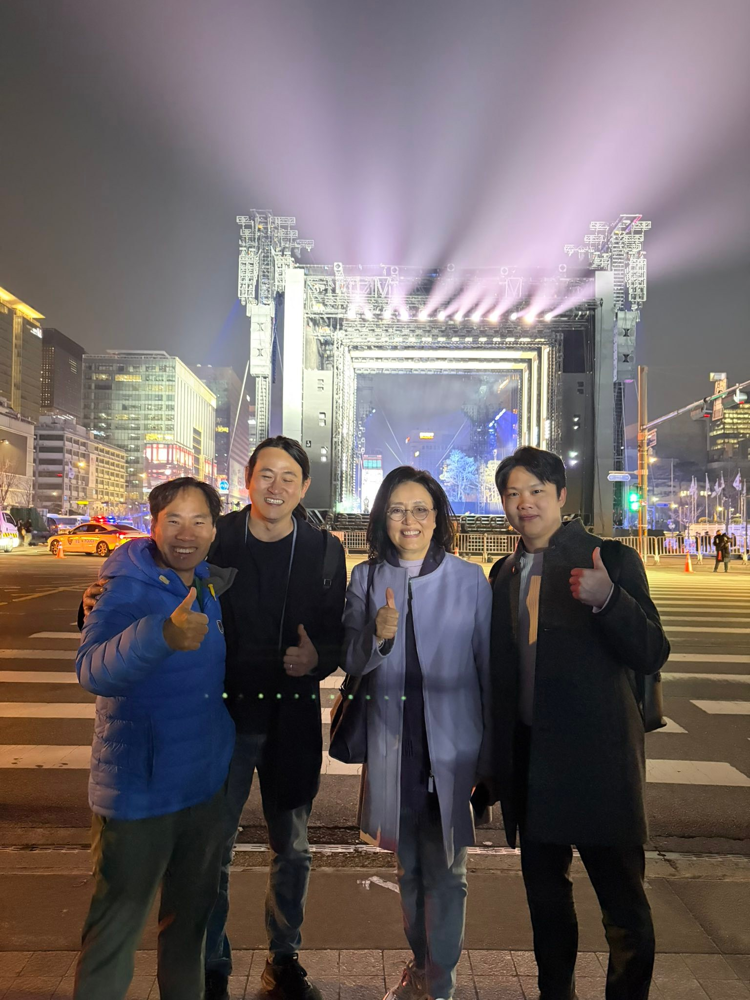
**이미지 캡션:** 네 명의 사람이 밤에 야외 무대 앞에서 포즈를 취하고 있다. 왼쪽에서부터 파란색 패딩 점퍼를 입은 중년 남성, 검은색 코트를 입은 젊은 남성, 연보라색 코트를 입은 중년 여성, 그리고 검은색 코트를 입은 젊은 남성이 서 있다. 모두 엄지손가락을 치켜들고 있으며, 밝고 긍정적인 표정을 짓고 있다. 배경에는 거대한 야외 무대가 조명으로 환하게 빛나고 있으며, 무대 위에는 구조물과 스크린이 보인다. 주변에는 도시의 건물들과 차량 불빛, 그리고 신호등이 보인다. 전체적으로 축제나 공연을 즐기러 온 듯한 활기찬 분위기이다.이다.

### 3월 22일 (일) 09:54 · 세상에서 가장 아름다운 달리기 길, 홍콩 central을 달립니다.

세상에서 가장 아름다운 달리기 길, 홍콩 central을 달립니다.

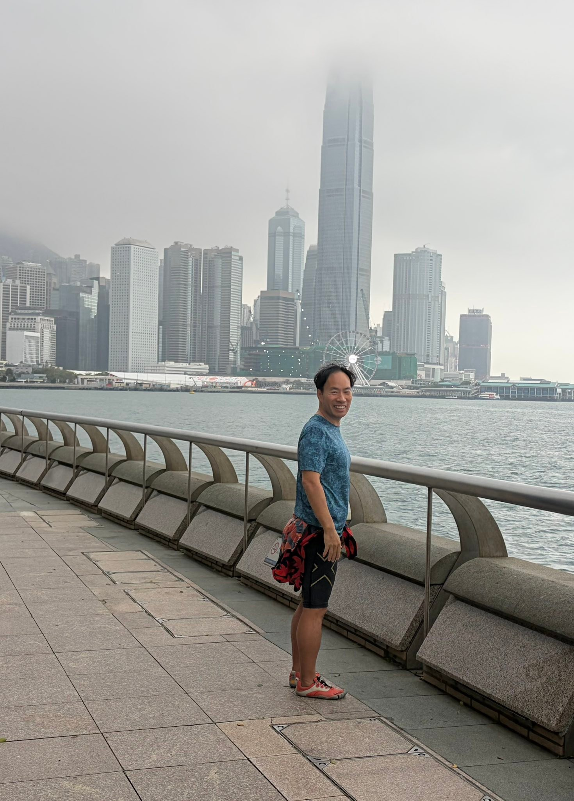
**이미지 캡션:** 흐린 날씨의 홍콩 해변 산책로에서 한 성인 남성이 카메라를 보며 웃고 있다. 남성은 40대 후반에서 50대 초반으로 보이며, 짧은 머리에 동양적인 외모를 하고 있다. 그는 파란색 반팔 티셔츠와 검은색 반바지, 그리고 허리에 붉은색 체크무늬 셔츠를 둘러매고 있다. 발에는 주황색 운동화를 신고 있다. 남성은 산책로를 따라 늘어선 난간 옆에 서 있으며, 난간 너머로는 잔잔한 바다가 펼쳐져 있다. 배경에는 안개에 희미하게 가려진 홍콩의 고층 빌딩들이 스카이라인을 이루고 있으며, 그중 가장 높은 빌딩은 구름에 일부 가려져 있다. 맑지 않은 날씨와 도시의 풍경이 어우러져 다소 차분하면서도 활기찬 분위기를 자아낸다.려져 있다. 맑지 않은 날씨와 도시의 풍경이 어우러져 다소 차분하면서도 활기찬 분위기를 자아낸다.
 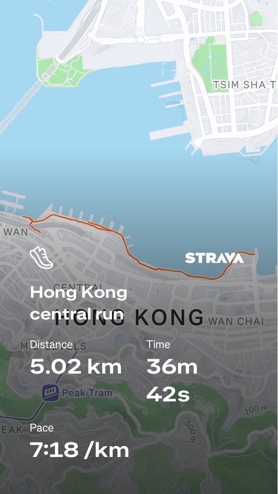
**이미지 캡션:** 이 이미지는 홍콩 센트럴 지역에서 달리기 기록을 보여주는 화면 캡처입니다. 화면 상단에는 홍콩의 지도와 바다가 보이며, 지도 위에는 주황색 선으로 달리기 경로가 표시되어 있습니다. "STRAVA"라는 로고가 보이며, 이는 운동 기록 앱임을 나타냅니다. 화면 중앙에는 "Hong Kong central run"이라는 문구가 크게 적혀 있고, 그 아래에는 달리기 거리, 시간, 페이스 정보가 표시되어 있습니다. 거리는 5.02km, 시간은 36분 42초, 페이스는 7:18/km입니다. "Peak Tram"이라는 아이콘과 텍스트도 보입니다. 배경에는 산악 지형과 도로망이 그려져 있으며, 100m와 300m 높이 표시도 보입니다. 전체적으로 활동적인 분위기를 나타내며, 운동 기록을 공유하거나 확인하는 상황으로 보입니다. 사람의 모습은 보이지 않습니다.콘과 텍스트도 보입니다. 배경에는 산악 지형과 도로망이 그려져 있으며, 100m와 300m 높이 표시도 보입니다. 전체적으로 활동적인 분위기를 나타내며, 운동 기록을 공유하거나 확인하는 상황으로 보입니다. 사람의 모습은 보이지 않습니다.

### 3월 23일 (월) 22:18 · 글로벌 유명 투자자들이 모이는 Milken Institute Global…

글로벌 유명 투자자들이 모이는 Milken Institute Global Investors' Symposium Hong Kong 2026 에서 "AI Ahead and the Future of Innovation" 세션 스피커로 참여하였습니다. 

Bloomberg 의 유명한 Daybreak Asia 프로그램의 진행자인 Annabelle 의 탁월한 모데레이션으로 너무 즐거웠는데요. 라이다 1등 회사 Hesai LiDAR 의 대표, Cisco 아시아 대표, ViTai Robotics 창업자, AI PC를 추진중인 Lenovo CFO님등의 이야기들에서 많이 배웠습니다. 

AI의 지능이 생각보다 빠르게 발전하고 있고 OpenClaw처럼 디지털상의 tool, 또는 피지컬 AI의 실제 tool과 연결되면서 폭발력이 생겨나고 있다는 점에는 모두가 공감하였습니다.

저는 David Li의 데이터 분류를 이어 받아 특히 3P 데이터, 디바이스 그리고 각각에 필요한 LLM에 대해 이야기 했는데요. 즉 Public data, (회사별) Proprietary data, (개인별) Personal data 를 구분해서 관리해야 하고 각각의 P별로 적절한 디바이스및 LLM의 구성이 필요하다는 이야기를 하였고 많이 공감해주셨습니다. 그리고 Proprietary와 Personal 데이터를 나라별회사별로 잘 관리하고 구축하는 것이 AI시대 가장 중요한 일이라고 이야기 하였습니다.

특히 마무리 발언으로 2026년은 스스로 진화하는 지능이 시작되는 원년이고 이를 통해 급속도로 발전된 지능을 앞으로 더 많이 만나게 될것이라고 했습니다. 그래서 우리 모두가 준비해야 한다고 말씀드렸습니다.

물론 중간 중간 Upstage가 이런 지능의 발전시대, 특히 아시아 국가들을 도울수 있다는 사업소개도 했습니다. 이어진 미디어들과 인터뷰등도 좋은 질문들과 대한 민국의 AI3강을 위한 노력, 그리고 Upstage 자랑으로 즐거운 하루였습니다.

Upstage 는 계속해서 더 많은 글로벌 투자 유치와, 그리고 궁극적으로는 더 많은 글로벌 AI 성과들을 만들어 보겠습니다.

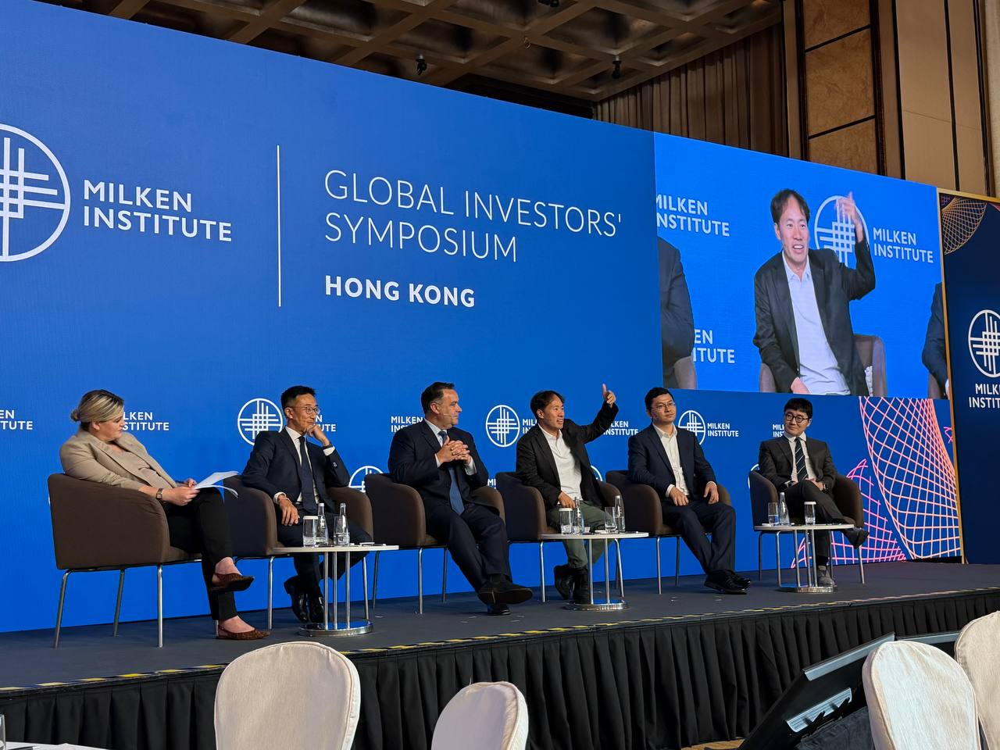
**이미지 캡션:** 행사장에 설치된 대형 스크린에는 'MILKEN INSTITUTE GLOBAL INVESTORS' SYMPOSIUM HONG KONG'이라는 문구가 파란색 배경에 흰색 글씨로 크게 쓰여 있으며, 스크린 중앙에는 한 명의 성인 남성이 마이크를 잡고 손가락으로 무언가를 가리키며 열정적으로 발언하는 모습이 비춰지고 있습니다. 무대 위에는 여러 명의 패널이 좌석에 앉아 토론에 참여하고 있으며, 왼쪽부터 금발의 여성 한 명과 정장을 입은 성인 남성 세 명이 보입니다. 여성은 갈색 재킷과 검은색 바지를 입고 서류를 보고 있으며, 남성들은 각기 다른 색상의 정장을 착용하고 있습니다. 맨 왼쪽의 성인 남성은 흰색 셔츠에 검은색 재킷을 입고 엄지손가락을 치켜세우고 있으며, 그 옆의 성인 남성은 검은색 정장에 흰색 셔츠를 입고 팔짱을 끼고 있습니다. 가장 오른쪽의 성인 남성은 검은색 정장에 흰색 셔츠, 녹색 줄무늬 넥타이를 착용하고 있습니다. 무대 앞쪽에는 여러 개의 물병과 테이블이 놓여 있으며, 전체적으로 진지하고 전문적인 분위기의 투자 심포지엄 현장임을 알 수 있습니다.있으며, 남성들은 각기 다른 색상의 정장을 착용하고 있습니다. 맨 왼쪽의 성인 남성은 흰색 셔츠에 검은색 재킷을 입고 엄지손가락을 치켜세우고 있으며, 그 옆의 성인 남성은 검은색 정장에 흰색 셔츠를 입고 팔짱을 끼고 있습니다. 가장 오른쪽의 성인 남성은 검은색 정장에 흰색 셔츠, 녹색 줄무늬 넥타이를 착용하고 있습니다. 무대 앞쪽에는 여러 개의 물병과 테이블이 놓여 있으며, 전체적으로 진지하고 전문적인 분위기의 투자 심포지엄 현장임을 알 수 있습니다.
 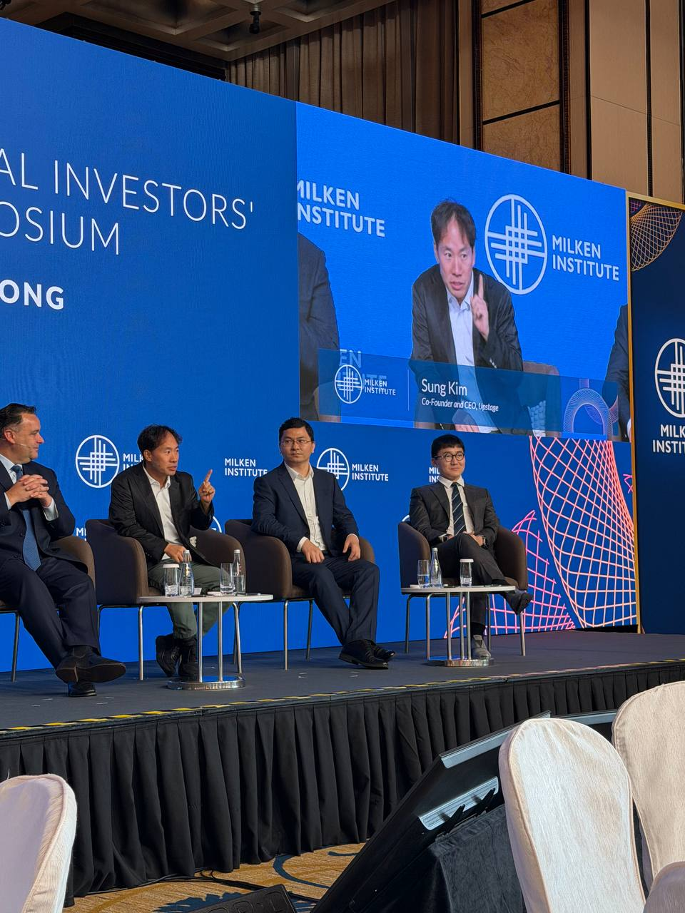
**이미지 캡션:** 네 명의 성인 남성이 무대 위에 앉아 패널 토론에 참여하고 있으며, 배경에는 파란색 스크린이 설치되어 있습니다. 스크린에는 "MILKEN INSTITUTE"라는 로고와 함께 "GLOBAL INVESTORS' SYMPOSIUM"이라는 글자가 크게 쓰여 있습니다. 왼쪽에서부터 첫 번째 남성은 검은색 정장을 입고 있으며, 두 번째 남성은 검은색 정장에 흰색 셔츠를 입고 있습니다. 세 번째 남성은 검은색 정장에 흰색 셔츠를 입고 있으며, 네 번째 남성은 검은색 정장에 흰색 셔츠와 넥타이를 착용하고 있습니다. 세 번째 남성의 스크린에는 "Sung Kim Co-Founder and CEO, Upstage"라고 적혀 있습니다. 네 명 모두 진지한 표정으로 토론에 집중하고 있으며, 테이블 위에는 물병과 컵이 놓여 있습니다. 전체적으로 전문적이고 학술적인 분위기를 풍깁니다. 남성의 스크린에는 "Sung Kim Co-Founder and CEO, Upstage"라고 적혀 있습니다. 네 명 모두 진지한 표정으로 토론에 집중하고 있으며, 테이블 위에는 물병과 컵이 놓여 있습니다. 전체적으로 전문적이고 학술적인 분위기를 풍깁니다.
 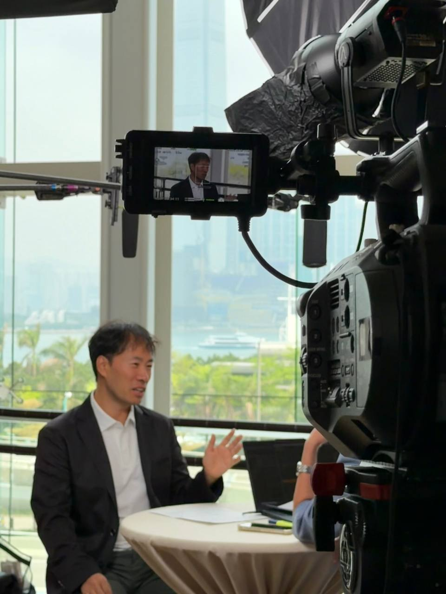
**이미지 캡션:** 이 사진은 한 성인 남성이 인터뷰를 받고 있는 장면을 담고 있으며, 그는 40대 후반에서 50대 초반으로 보이는 외모에 검은색 재킷과 흰색 셔츠를 착용하고 있다. 남성은 테이블에 앉아 오른손을 들어 무언가를 설명하는 듯한 표정으로 카메라를 응시하고 있으며, 그의 표정은 진지하면서도 약간의 미소를 띠고 있다. 배경에는 통유리창 너머로 도시 풍경과 바다가 보이며, 이는 고급스러운 실내 공간임을 암시한다. 테이블 위에는 서류와 휴대폰, 펜 등이 놓여 있고, 전면에 보이는 것은 촬영 장비로 보이는 카메라와 조명이다. 전체적으로 전문적인 인터뷰나 촬영이 진행되는 분위기이며, 밝고 깨끗한 조명 아래 차분하고 집중된 상황이 연출되고 있다. 전체적으로 전문적인 인터뷰나 촬영이 진행되는 분위기이며, 밝고 깨끗한 조명 아래 차분하고 집중된 상황이 연출되고 있다.
 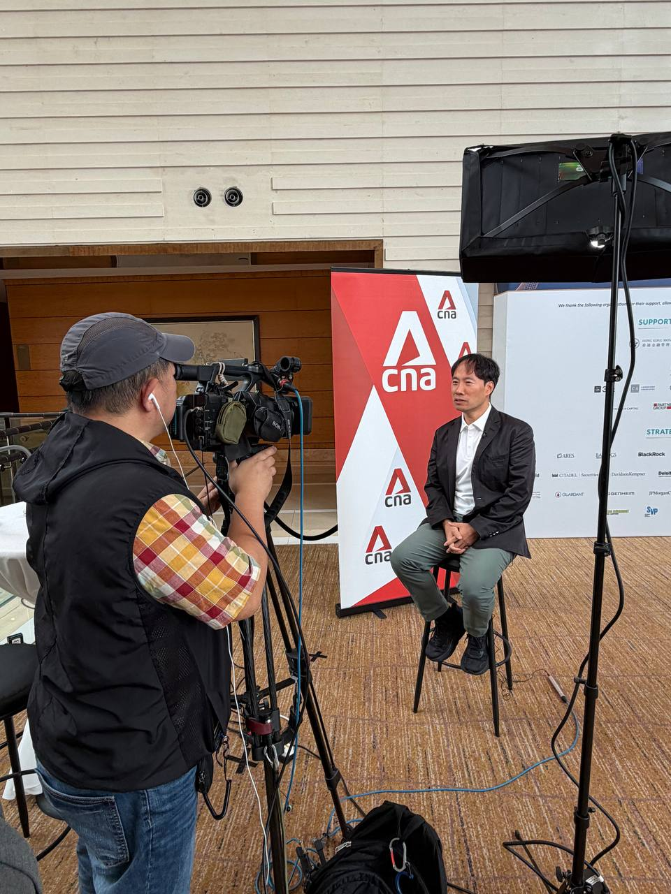
**이미지 캡션:** 한 성인 남성이 인터뷰를 받고 있으며, 그는 40대 후반에서 50대 초반으로 보이며 검은색 재킷과 녹색 바지를 입고 있다. 그는 카메라를 향해 약간 고개를 돌리고 있으며, 표정은 차분하고 진지하다. 배경에는 "cna" 로고가 크게 새겨진 빨간색 배너와 여러 기업 로고가 있는 흰색 배너가 보인다. 조명 장비와 카메라 장비도 보이며, 이는 인터뷰가 방송이나 뉴스 촬영의 일부임을 시사한다. 장소는 실내이며, 갈색 카펫이 깔려 있고 벽은 나무 패널로 마감되어 있다. 전반적으로 전문적이고 공식적인 분위기이다.

### 3월 24일 (화) 22:07 · 독파모 모델을 더 강화한 Solar-Pro3 업데이트 버전이 공개되었습니…

독파모 모델을 더 강화한 Solar-Pro3 업데이트 버전이 공개되었습니다. Pro2에 비래 agentic 능력이 많이 향상되었습니다.

https://console.upstage.ai/ 에서 solar-pro3라는 이름으로 계속 사용할 수 있습니다. https://openrouter.ai/upstage/solar-pro-3 에서도 편하게 사용하실 수 있고 https://bizrouter.ai/models 에서도 제공이 됩니다.

많이 사용해주시는 만큼 더 빠르게 성능을 올려보겠습니다.

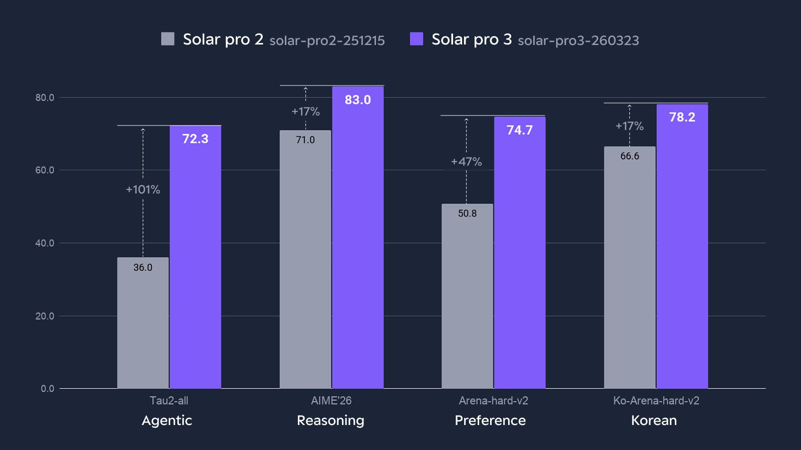
**이미지 캡션:** 이 이미지는 네 개의 그룹으로 나뉜 막대 그래프로, 각 그룹은 두 개의 막대로 구성되어 있으며, 하나는 회색이고 다른 하나는 보라색입니다. 그래프의 제목은 "Solar pro 2 solar-pro2-251215"와 "Solar pro 3 solar-pro3-260323"이며, 회색 막대는 "Solar pro 2"를, 보라색 막대는 "Solar pro 3"를 나타냅니다. x축에는 네 개의 범주가 있으며, 각각 "Agentic", "Reasoning", "Preference", "Korean"으로 레이블이 지정되어 있습니다. y축은 0에서 80까지의 숫자로 표시되어 있으며, 이는 측정값을 나타냅니다. 각 막대 위에는 해당 값이 숫자로 표시되어 있으며, 일부 막대 사이에는 백분율로 표시된 증가율도 있습니다. 예를 들어, "Agentic" 범주에서 회색 막대는 36.0이고 보라색 막대는 72.3이며, 이는 101% 증가를 나타냅니다. "Reasoning" 범주에서는 회색 막대가 71.0이고 보라색 막대가 83.0이며, 17% 증가를 나타냅니다. "Preference" 범주에서는 회색 막대가 50.8이고 보라색 막대가 74.7이며, 47% 증가를 나타냅니다. 마지막으로 "Korean" 범주에서는 회색 막대가 66.6이고 보라색 막대가 78.2이며, 17% 증가를 나타냅니다. 그래프는 어두운 배경에 밝은 색상의 막대와 텍스트로 구성되어 있어 깔끔하고 전문적인 느낌을 줍니다. 이 그래프는 두 가지 다른 모델("Solar pro 2"와 "Solar pro 3")의 성능을 네 가지 다른 작업("Agentic", "Reasoning", "Preference", "Korean")에 대해 비교하는 것으로 보입니다.어 있습니다. y축은 0에서 80까지의 숫자로 표시되어 있으며, 이는 측정값을 나타냅니다. 각 막대 위에는 해당 값이 숫자로 표시되어 있으며, 일부 막대 사이에는 백분율로 표시된 증가율도 있습니다. 예를 들어, "Agentic" 범주에서 회색 막대는 36.0이고 보라색 막대는 72.3이며, 이는 101% 증가를 나타냅니다. "Reasoning" 범주에서는 회색 막대가 71.0이고 보라색 막대가 83.0이며, 17% 증가를 나타냅니다. "Preference" 범주에서는 회색 막대가 50.8이고 보라색 막대가 74.7이며, 47% 증가를 나타냅니다. 마지막으로 "Korean" 범주에서는 회색 막대가 66.6이고 보라색 막대가 78.2이며, 17% 증가를 나타냅니다. 그래프는 어두운 배경에 밝은 색상의 막대와 텍스트로 구성되어 있어 깔끔하고 전문적인 느낌을 줍니다. 이 그래프는 두 가지 다른 모델("Solar pro 2"와 "Solar pro 3")의 성능을 네 가지 다른 작업("Agentic", "Reasoning", "Preference", "Korean")에 대해 비교하는 것으로 보입니다.

### 3월 26일 (목) 11:15 · 싱가포르 최대 글로벌 뉴스채널 CNA(Channel News Asia)에…

싱가포르 최대 글로벌 뉴스채널 CNA(Channel News Asia)에 출연하여
- 지금 시대에 국가가 AI 기술을 갖는 것은 중요하며
- 이를 위해 미래 AI의 오일이라고 할 수 있는 자국의 데이터를 지키는 일이 시급하며
- Upstage가 대한민국뿐만 아니라 다른 나라의 AI 기술 주도권을 가져다준다

는 이야기를 하였습니다.

존경하는 Kyung-Hoon Bae 부총리님의 "자체적 파운데이션 모델의 필요성", "글로벌 톱 수준으로 만들겠다"는 말씀과 한·싱 AI 커넥트 서밋도 소개되었습니다.

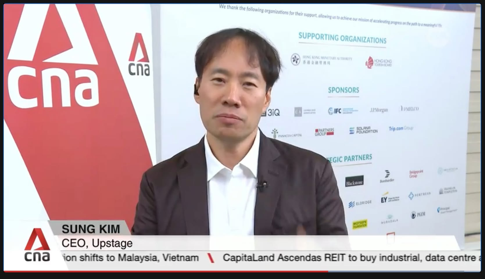
**이미지 캡션:** 화면 중앙에는 중년의 동양인 남성이 흰색 셔츠 위에 어두운 색 재킷을 입고 카메라를 응시하고 있다. 남성은 짧은 검은색 머리에 귀에는 이어폰을 착용하고 있으며, 표정은 진지하다. 그의 왼쪽 뒤로는 빨간색 배경에 흰색 글씨로 'cna' 로고가 크게 새겨져 있고, 오른쪽 뒤로는 흰색 배경에 여러 기업 로고와 함께 'SUPPORTING ORGANIZATIONS', 'SPONSORS', 'STRATEGIC PARTNERS'라는 글자가 보인다. 화면 하단에는 'SUNG KIM CEO, Upstage'라는 정보와 함께 'cna' 로고가 다시 나타나고, 그 아래로 'ion shifts to Malaysia, Vietnam'과 'CapitaLand Ascendas REIT to buy industrial, data centre a'와 같은 뉴스 기사 일부가 보인다. 전반적으로 인터뷰나 뉴스 보도 장면으로 보이며, 진지하고 전문적인 분위기이다.'cna' 로고가 다시 나타나고, 그 아래로 'ion shifts to Malaysia, Vietnam'과 'CapitaLand Ascendas REIT to buy industrial, data centre a'와 같은 뉴스 기사 일부가 보인다. 전반적으로 인터뷰나 뉴스 보도 장면으로 보이며, 진지하고 전문적인 분위기이다.
 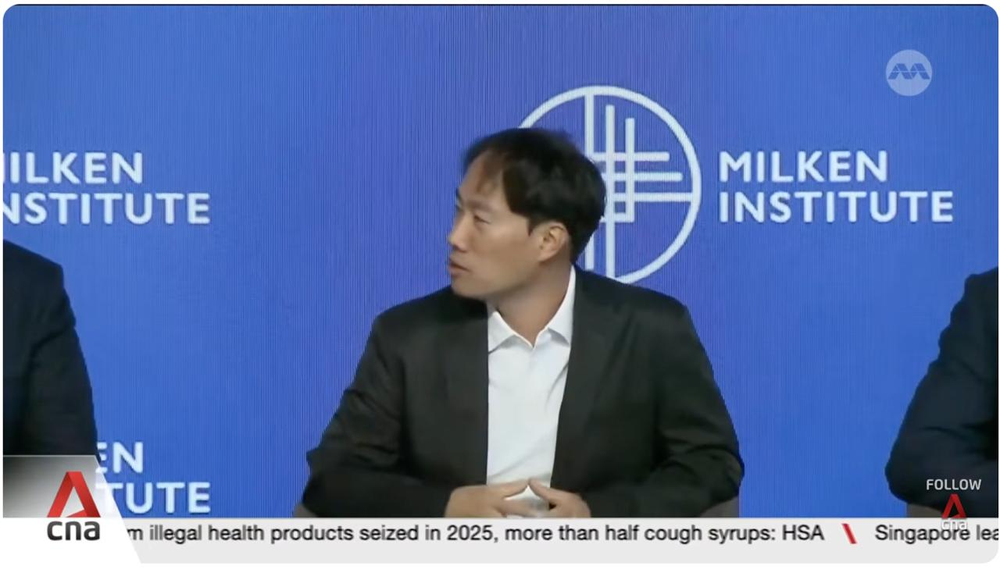
**이미지 캡션:** 푸른색 배경에 흰색 글씨로 "MILKEN INSTITUTE"라고 적힌 현수막이 걸려 있고, 그 앞에 검은색 정장을 입은 40대 중반의 동양인 남성이 앉아 있다. 남성은 흰색 셔츠 위에 검은색 재킷을 입고 있으며, 두 손을 가지런히 모으고 있다. 그의 표정은 진지하며, 시선은 화면 왼쪽을 향하고 있다. 남성의 왼쪽과 오른쪽에는 다른 두 사람이 앉아 있지만, 그들의 모습은 일부만 보인다. 화면 하단에는 "cna"라는 로고와 함께 "m illegal health products seized in 2025, more than half cough syrups: HSA Singapore lea"라는 자막이 보인다. 전반적으로 공식적인 행사나 토론회 장면으로 보이며, 진지하고 전문적인 분위기이다. than half cough syrups: HSA Singapore lea"라는 자막이 보인다. 전반적으로 공식적인 행사나 토론회 장면으로 보이며, 진지하고 전문적인 분위기이다.
 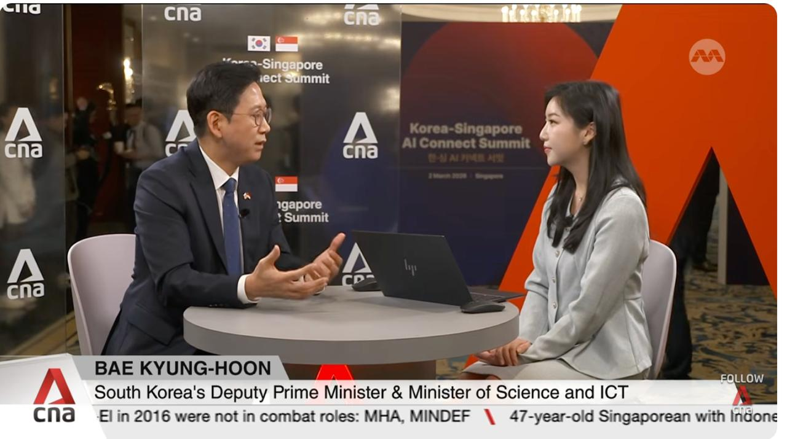
**이미지 캡션:** 이 사진은 한국의 배기훈 부총리 겸 과학기술정보통신부 장관과 싱가포르의 한 여성 인터뷰 진행자가 한국-싱가포르 AI 커넥트 서밋 행사에서 대담하는 모습을 담고 있다. 배기훈 장관은 40대 후반에서 50대 초반으로 보이는 성인 남성으로, 검은색 정장에 파란색 넥타이를 착용하고 안경을 쓰고 있으며, 손짓을 하며 열정적으로 이야기하는 표정이다. 여성 인터뷰 진행자는 30대 초반에서 40대 초반으로 보이는 성인 여성으로, 회색 재킷을 입고 차분한 표정으로 장관의 이야기를 듣고 있다. 배경에는 "Korea-Singapore AI Connect Summit"이라는 문구와 함께 한국과 싱가포르 국기가 보이며, 행사의 공식 로고와 CNA 방송사의 로고도 함께 노출되어 있다. 테이블 위에는 노트북과 마우스가 놓여 있어 인터뷰가 진행 중임을 알 수 있다. 전반적으로 진지하고 전문적인 분위기 속에서 기술 및 국제 협력에 대한 논의가 이루어지고 있는 상황으로 보인다. 하단에는 배기훈 장관의 이름과 직책, 그리고 다른 뉴스 헤드라인이 자막으로 표시되어 있다.ore AI Connect Summit"이라는 문구와 함께 한국과 싱가포르 국기가 보이며, 행사의 공식 로고와 CNA 방송사의 로고도 함께 노출되어 있다. 테이블 위에는 노트북과 마우스가 놓여 있어 인터뷰가 진행 중임을 알 수 있다. 전반적으로 진지하고 전문적인 분위기 속에서 기술 및 국제 협력에 대한 논의가 이루어지고 있는 상황으로 보인다. 하단에는 배기훈 장관의 이름과 직책, 그리고 다른 뉴스 헤드라인이 자막으로 표시되어 있다.
 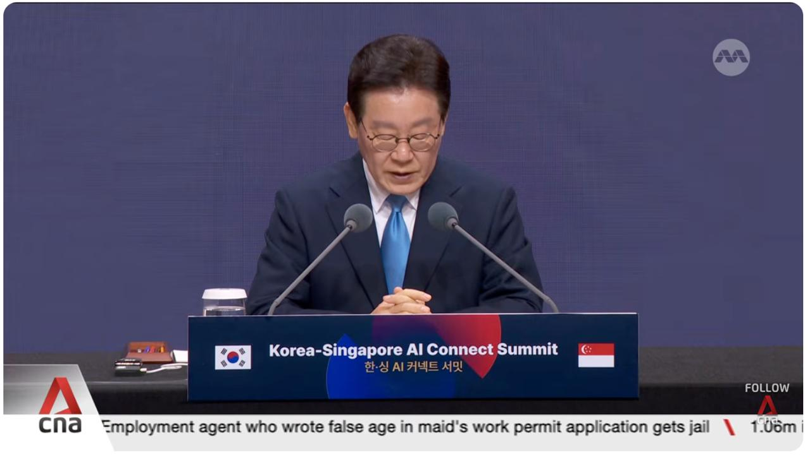
**이미지 캡션:** 한 성인 남성이 연단 뒤에 서서 마이크에 대고 말하고 있으며, 그의 앞에는 "Korea-Singapore AI Connect Summit"이라고 적힌 배너가 놓여 있고, 한국과 싱가포르 국기가 각각 표시되어 있습니다. 남성은 안경을 쓰고 있으며, 네이비색 정장에 파란색 넥타이를 착용하고 있습니다. 그의 표정은 진지하며, 두 손을 앞으로 모으고 있습니다. 배경은 보라색이며, 화면 오른쪽 상단에는 "AA" 로고가 보입니다. 화면 하단에는 "cna" 로고와 함께 "Employment agent who wrote false age in maid's work permit application gets jail"이라는 영어 자막이 표시되어 있습니다. 전반적으로 공식적인 행사나 발표회 분위기입니다.alse age in maid's work permit application gets jail"이라는 영어 자막이 표시되어 있습니다. 전반적으로 공식적인 행사나 발표회 분위기입니다.

### 3월 26일 (목) 11:15 · Sung Kim shared a link.

🔗 <https://youtu.be/uShKs4M3Jvg?si=9mfTBhfJTwwuBDDL>

### 3월 31일 (화) 13:14 · 서울에서 진달래가 자장 이쁜곳중 하나인 청계산 진달래능선 (포근함과 부드…

서울에서 진달래가 자장 이쁜곳중 하나인 청계산 진달래능선 (포근함과 부드러운 흙길)! 이번주가 절정일것 같습니다.

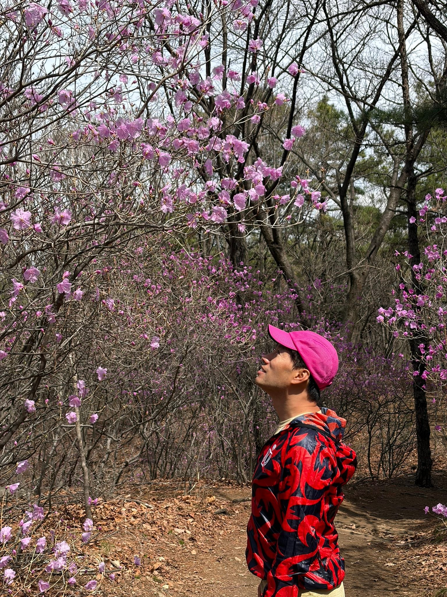
**이미지 캡션:** 한 성인 남성이 분홍색 야구 모자와 빨간색과 검은색 패턴의 바람막이를 입고 숲길을 걷고 있다. 남성은 고개를 들어 분홍색 진달래 꽃을 감상하고 있으며, 그의 표정은 평화롭고 경이로운 듯하다. 배경에는 분홍색 진달래 꽃이 만발한 나무들과 앙상한 나뭇가지들이 얽혀 있고, 숲 바닥에는 낙엽이 깔려 있다. 전체적으로 봄의 싱그러움과 자연의 아름다움을 느끼게 하는 평화로운 분위기이다.
 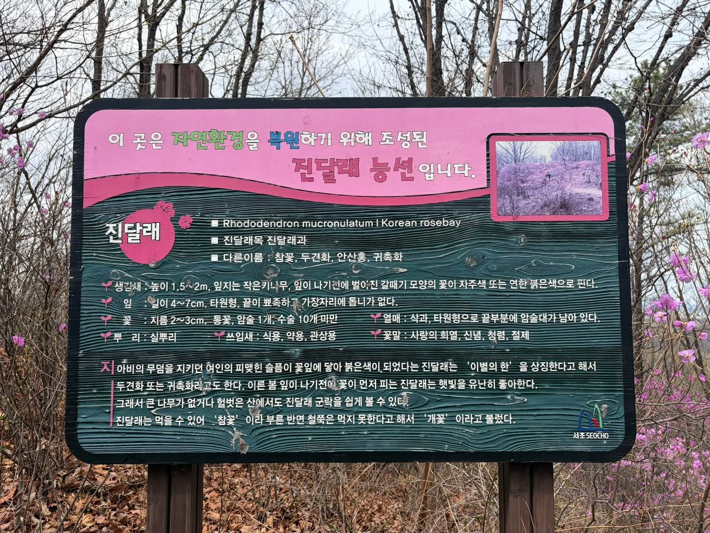
**이미지 캡션:** 이 사진은 진달래에 대한 정보를 담고 있는 안내판을 보여줍니다. 안내판은 분홍색과 녹색으로 디자인되었으며, 상단에는 "이 곳은 자연환경을 복원하기 위해 조성된 진달래 능선 입니다."라는 문구가 쓰여 있습니다. 중앙에는 '진달래'라는 글자와 함께 진달래 꽃이 핀 풍경 사진이 작게 삽입되어 있습니다. 안내판의 주요 내용은 진달래의 학명, 다른 이름, 생김새, 잎, 꽃, 열매, 뿌리, 쓰임새, 꽃말에 대한 설명입니다. 또한, 진달래의 유래와 관련된 이야기, 햇빛을 좋아하는 특성, 그리고 진달래와 철쭉의 차이점에 대한 설명도 포함되어 있습니다. 안내판 하단에는 '서초 SEOCHO'라는 글자가 보입니다. 배경으로는 나뭇가지가 앙상한 나무들과 흐린 하늘이 보이며, 안내판 주변에는 분홍색 진달래 꽃이 피어 있는 모습이 일부 보입니다. 전체적으로 자연의 아름다움을 알리고 보존하려는 의도를 담고 있는 안내판입니다.한 설명도 포함되어 있습니다. 안내판 하단에는 '서초 SEOCHO'라는 글자가 보입니다. 배경으로는 나뭇가지가 앙상한 나무들과 흐린 하늘이 보이며, 안내판 주변에는 분홍색 진달래 꽃이 피어 있는 모습이 일부 보입니다. 전체적으로 자연의 아름다움을 알리고 보존하려는 의도를 담고 있는 안내판입니다.
