# 2026년 4월

[← 2026년](README.md)

### 4월 2일 (목) 20:02 · 마크롱 프랑스 대통령 방한팀과 함께온 Mistral CEO와 멤버들을 오…

마크롱 프랑스 대통령 방한팀과 함께온 Mistral CEO와 멤버들을 오늘 2번이나 만났습니다. 오전에도 만나고 저녁에도 따로 만나서 #모두를위한AI 를 함께 만드는 협업에 대해 토론하고 다음 방향을 논의 하였습니다. 

함께 만들 멋진 일들이 기대 됩니다.

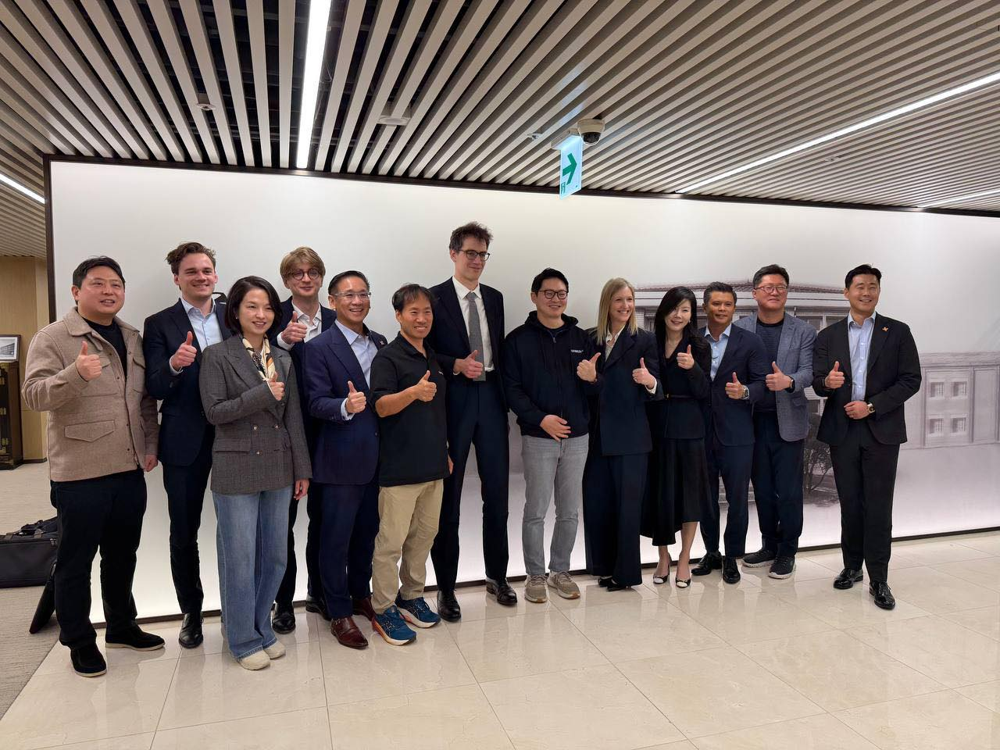

### 4월 3일 (금) 10:49 · (긴글) 퓨리오사AI가 개최한 '레니게이드 2026 서밋' 정말 멋졌습니…

(긴글) 퓨리오사AI가 개최한 '레니게이드 2026 서밋' 정말 멋졌습니다. 2세대 AI 칩 ‘레니게이드(RNGD)’ 양산 축하 드립니다! 

저는 "Al Tokenomics on NPU in Sovereign Deployments & Beyond" 제목의 패널에 참여하였습니다. 존경하는 차지호의원, 임우영 원장님, 백준호 대표님과 함께 하면서 많이 배웠는데요. 

제가 답변 드린 토크노믹스가 왜 중요한지, 그리고 서비스 하는 입장에서 GPU 비용이 얼마나 나오는지에 대해 아래와 같이 이야기 하였습니다.

---
질문: [김성훈 대표] 대표님, 먼저 Tokenomics가 무엇인지 간단히 설명해 주시겠습니까? 그리고 Tokenomics 관점에서 효율적인 인퍼런스 칩, 즉 NPU가 왜 중요한지 말씀 부탁드립니다.

---
토크노믹스는 AI/LLM 토큰의 경제학을 가리키는 말이며, 토큰이 활발하게 소비·유통돼야 한다는 원리를 말합니다. (경제가 살아나려면 돈이 많이 돌아야 한다는 이야기, 들어 보셨죠?)

이제 사람의 지능보다 뛰어는 인공지능을 얼마나 잘 활용하는가가 그 공동체의 경쟁력을 좌우하게 됩니다.

그래서 AI 강국이 되려면, AI 3강이 되려면 양질의 AI 토큰이 많이 생성되고 소비돼야 합니다. 이것이 토크노믹스의 핵심입니다. 

그럼 토큰을 많이 돌리려면 어떻게 해야 할까요?— 바로 ​토크노믹스를 달성하기 위해서는 4가지가 필요합니다.

[상위 레벨 4가지 축]

​1. 전 국민의 AI 이해·사용 갈망​: 전 국민이 AI에 대해 잘 알고, 실제로 사용하려는 욕구가 있어야 합니다. 대한민국은 이미 ​그 부분이 충분히 준비돼 있습니다​. 대단한 민족이죠!

​2. 대단한 AI 서비스:​ IT 에서 네이버·다음 같은 ​전 국민이 일상적으로 쓰는 서비스​가 필요합니다. AI가 생활에 스며들어야 비로소 토큰이 활발히 움직입니다.

3. ​뛰어난 LLM(언어 모델)​: 지능을 담당하는 ​최고의 LLM​이 있어야 합니다. 우리에게는 ​업스테이지 Solar​나 ​LG 엑사원​ 같은 모델이 있고 열심히 하고 있습니다.

4. ​AI 반도체​: 보통은 LLM이 제일 중요하다고 할텐데 오늘 같은 자리에서는 ​반도체​가 가장 중요한 요소라 할 수 있습니다. LLM을 ​저렴하고 빠르게, 많이 돌릴 수 있는 AI Chip이 많이  필요합니다. 퓨리오사 대표님 잘 부탁드립니다.

[“마중물”이 없으면 토크노믹스는 돌지 않는다]
모든 요소가 갖춰져도 토큰이 스스로 순환하지는 않습니다. 초기 단계에서는 공공*정부가 나서서 이 수레바퀴를 몇 번 돌려줘야​ 합니다. 펌프로 비유하자면 ​마중물​이 필요하듯이, 정부가 토큰을 ‘펌프질’해 주어야 비로소 토크노믹스가 흐르게 됩니다.

[마무리]
암튼 토크노믹스, 즉 우리 사회에서 양질의 토큰이 돌아가야 AI가 살고, AI 시대 토크노믹스가 정착돼야 우리나라가 살아갑니다.

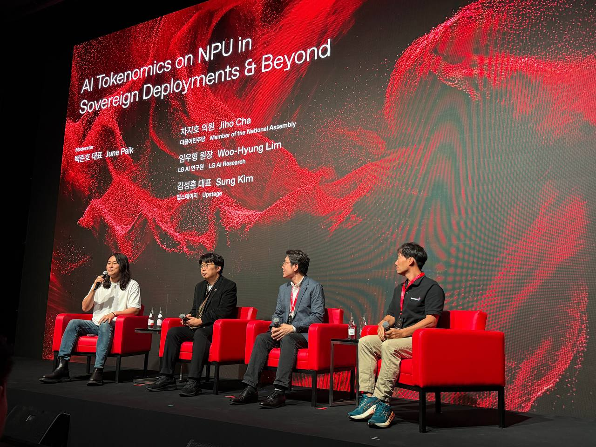

### 4월 5일 (일) 12:32 · 첫 남한산성 한바퀴! 너무 멋진 코스 입니다. 봄 산달리기 하시는 분들에…

첫 남한산성 한바퀴! 너무 멋진 코스 입니다. 봄 산달리기 하시는 분들에게 강추 합니다.

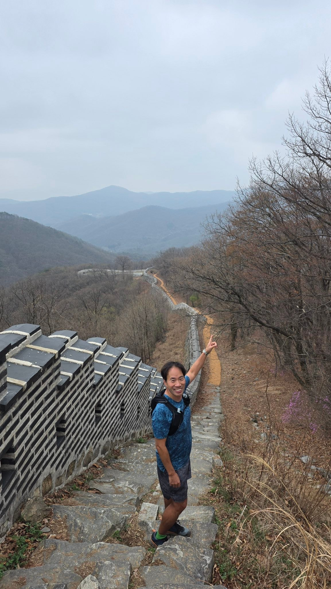 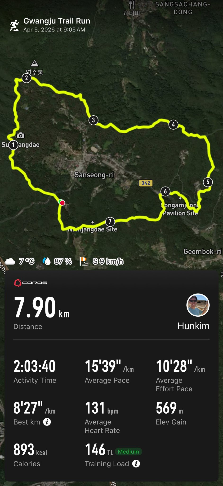

### 4월 6일 (월) 08:01 · 석촌호수 꽃길 코스 너무 멋집니다. 이글 보시는 모든 분들 꽃길만 걸으시…

석촌호수 꽃길 코스 너무 멋집니다. 이글 보시는 모든 분들 꽃길만 걸으시길 기원합니다.

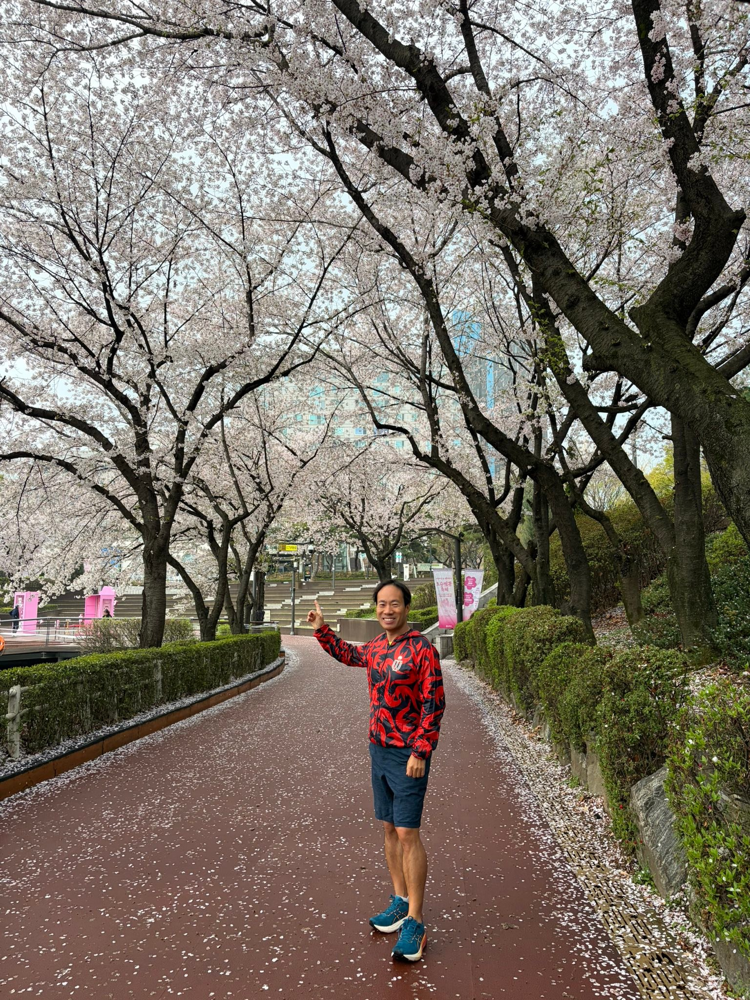 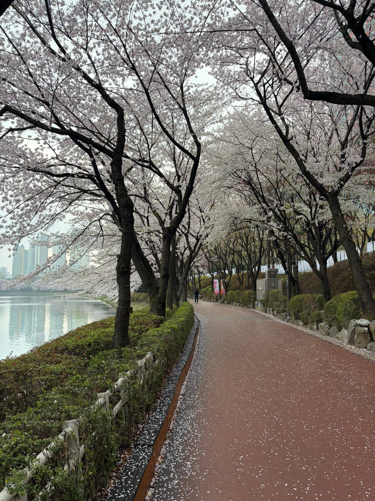 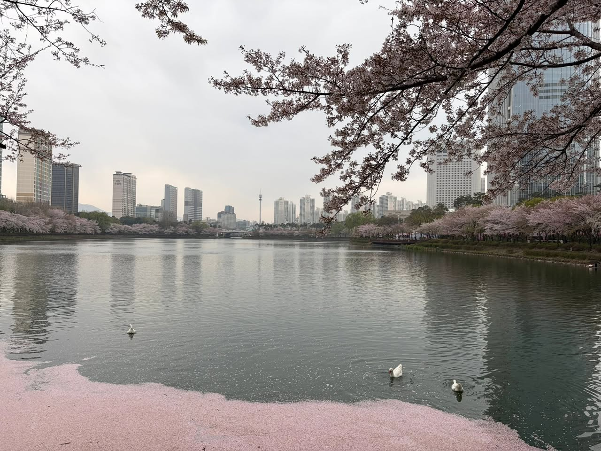 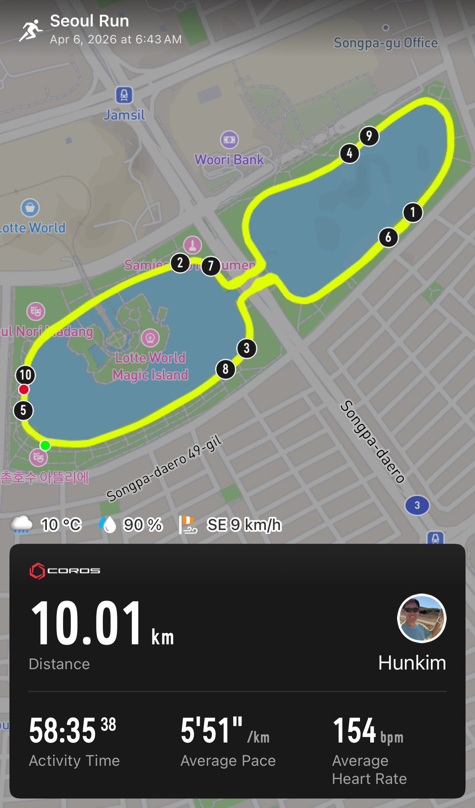

### 4월 7일 (화) 18:04 · AMD 미국팀의 한국 방문을 환영합니다! GPU와 Solar 모델 그리고…

AMD 미국팀의 한국 방문을 환영합니다! GPU와 Solar 모델 그리고 연구 협력등 포괄적 파터너쉽의 가능성을 논의 하였습니다. 꿈에 한걸음 더 다가갑니다!

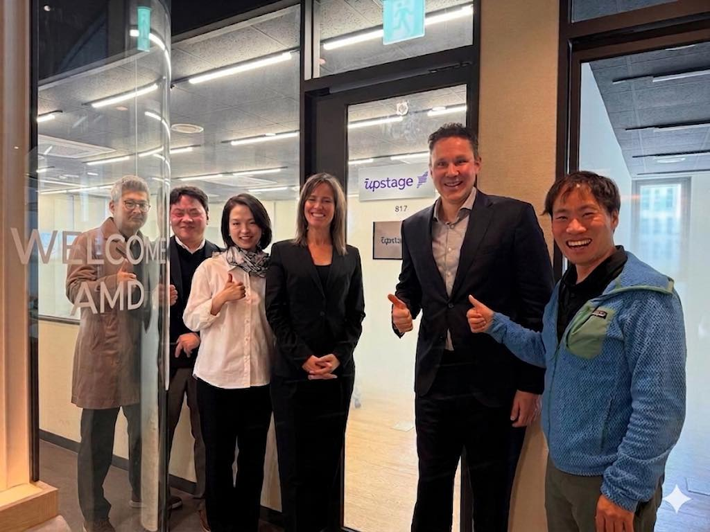

### 4월 10일 (금) 10:29 · Upstage 독파모 컨소에 참여중인 Stanford 대학 한승주님이 연…

Upstage 독파모 컨소에 참여중인 Stanford 대학 한승주님이 연구 결과를 발표합니다. 합성 QA 쌍과 합성 문서를 결합하여 상호 보완적인 학습 신호를 제공하는 방법인 Synthetic Mixed Training, 그리고 문서의 다양성을 높이고 스케일링 특성을 더욱 강화한 질문 조건부 문서 생성 기법인 Focal Rewriting 기법까지, 데이터가 부족한 환경에서도 모델 성능을 끌어올리는 실용적인 방법론을 소개합니다. 

함께 해요!

🎙 연사 소개: 한승주 - Stanford Ph.D. 과정 · 전 NVIDIA Research
📅 일시: 4월 17일 금요일 오전 11시
📍 장소: Youtube (신청 완료하시면 참석 링크를 메일로 보내드립니다.)
▶️ 참석 신청: https://go.upstage.ai/upstalk-seungju-fb

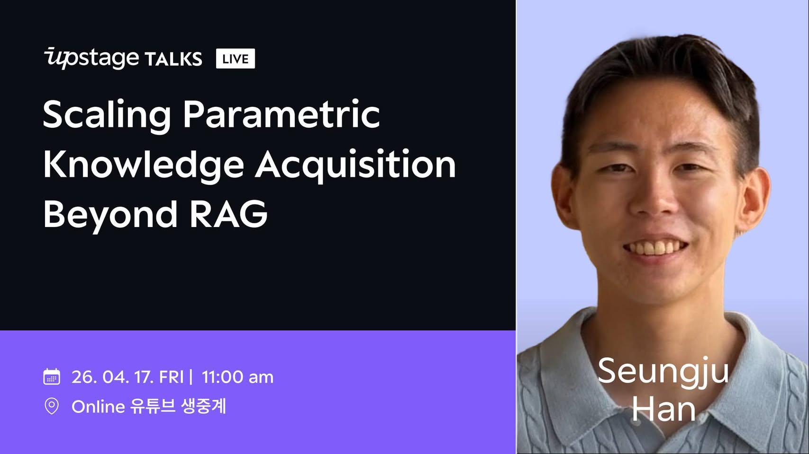

### 4월 13일 (월) 20:05 · 바쁘신 중에 저희 AI 스타트업의 어려움을 직접 청취해주시고 많이 공감해…

바쁘신 중에 저희 AI 스타트업의 어려움을 직접 청취해주시고 많이 공감해 주셔서 감사합니다. Jung-Woo Ha 수석님과 AI 3강에 대한 열망과 비전에 대해 함께 이야기할 수 있어서 너무 신나고 즐거운 저녁이였습니다. K-AI에 대한 열망으로 뺏지도 드렸는데 꼭 달아 주시고요.

저도 오늘 점심을 못먹어 저녁을 정말 맛있게 먹었는데요. 심지어 라이너 대표님은 오늘 저녁이 첫끼라고 하시더라고요. 이렇게 힘들게 집중해서 달리고 있는 스타트업 대표들에게 오늘 미팅은 정말 큰 힘이 되었습니다.

함께 해주신 라이너 김진우 대표님, 모티프 임정환 대표님, 베슬 안재만 대표님 감사합니다. 좋은 이야기 많이 주셔서 저도 많이 배웠습니다.

또 자주 뵈어요!

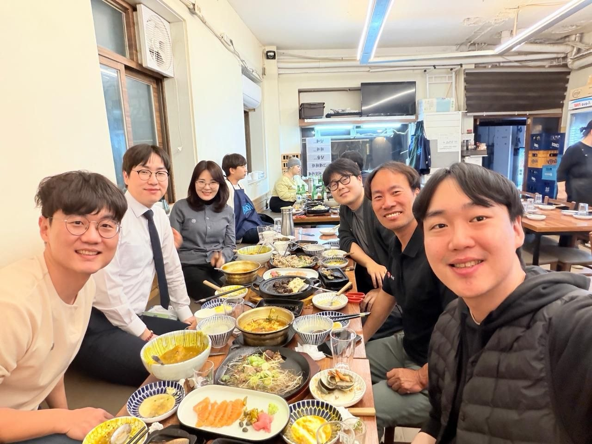 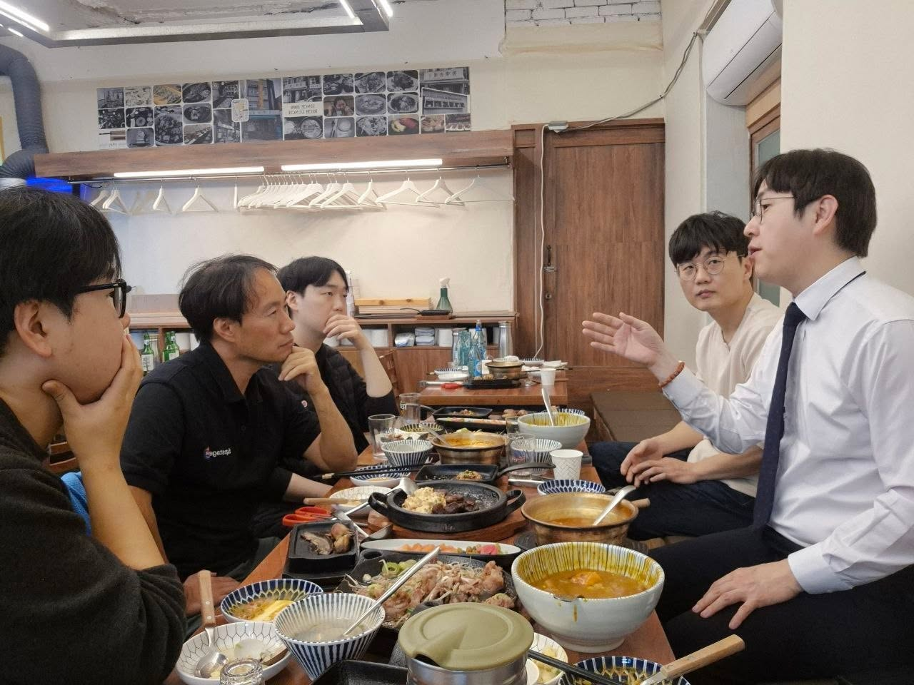 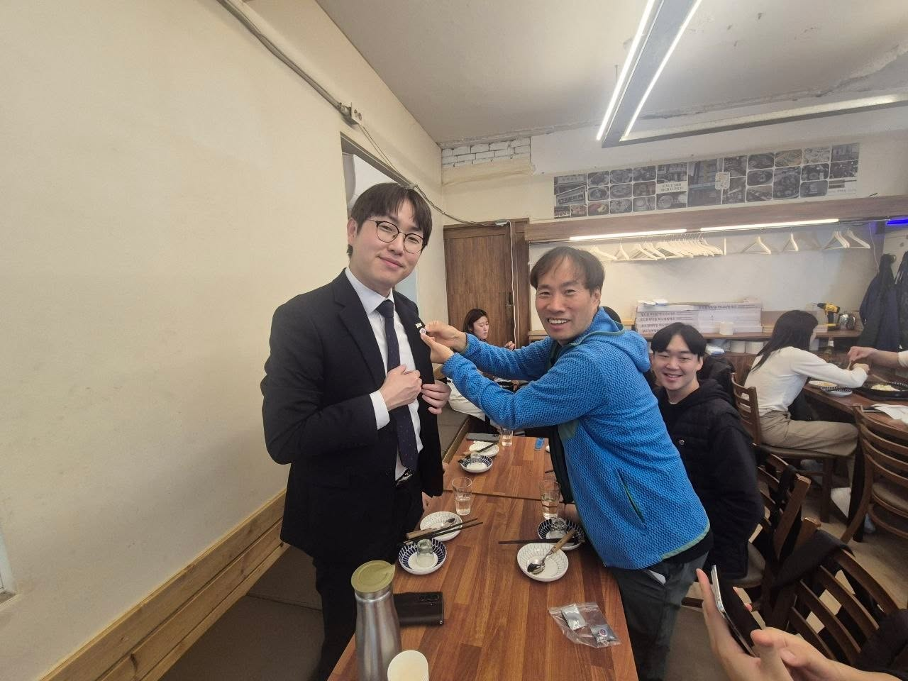 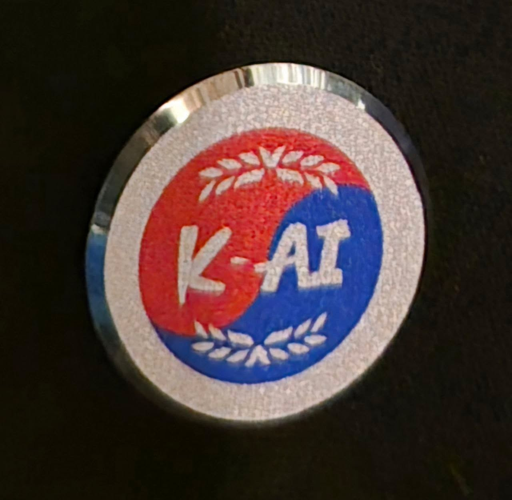

### 4월 14일 (화) 09:34 · 대한민국 AI의 위상이 가파르게 높아지고 있습니다. 세계에서 가장 공신력…

대한민국 AI의 위상이 가파르게 높아지고 있습니다. 세계에서 가장 공신력 있는 리포트 중 하나인 스탠포드 AI INDEX REPORT의 Notable AI 부문에서 대한민국이 당당히 3위를 차지했습니다. 저희 SolarLLM 모델도 기여를 했는데요.

이 모두가 독자파운데이션 모델 프로젝트 덕분입니다. Kyung-Hoon Bae 부총리님, 류제명 차관님, 김경만 실장님, 최동원 국장님, 이소라 과장님, 이현우 사무관님 등 정말 수고 많으셨고 또 축하 드립니다.

업스테이지는 올해도 내년에도 Notable AI 모델들을 계속 만들어 나가겠습니다.

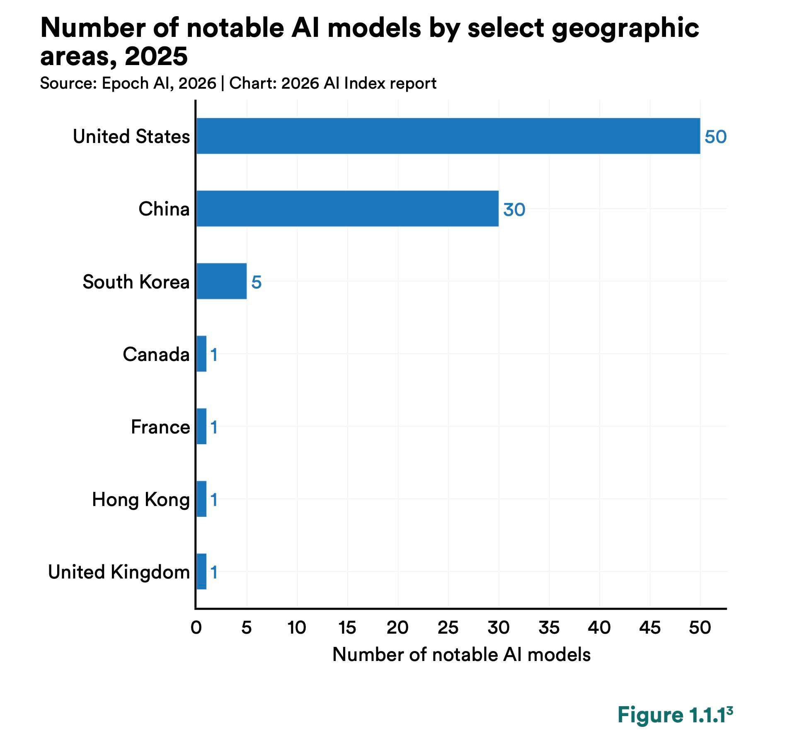

### 4월 15일 (수) 07:00 · 오늘부터 제 명함이 바뀝니다. #업스테이지 #시리즈C #유니콘

오늘부터 제 명함이 바뀝니다. #업스테이지 #시리즈C #유니콘

Upstage는 이번 시리즈C를 통해 유니콘이라 불리는 기업 가치 1조원 이상의 회사가 되었습니다. 개인적으로도 매우 기쁜 날입니다. Upstage를 믿고 계속 지원해주신 투자자분들, 저희 제품을 사용해 주신 많은 고객, 그리고 응원해 주신 모든 분들 덕분입니다. 큰 감사와 감사를 드립니다. 

Upstage는 기업 가치 1조를 넘어 매출 1조를 돌파하는 회사가 되기 위해 계속 앞으로 전진하겠습니다.

관련기사: "韓 AI개발사 ‘유니콘 1호’…업스테이지의 ‘초지능’ 도전" https://v.daum.net/v/5jX1yZLxTJ

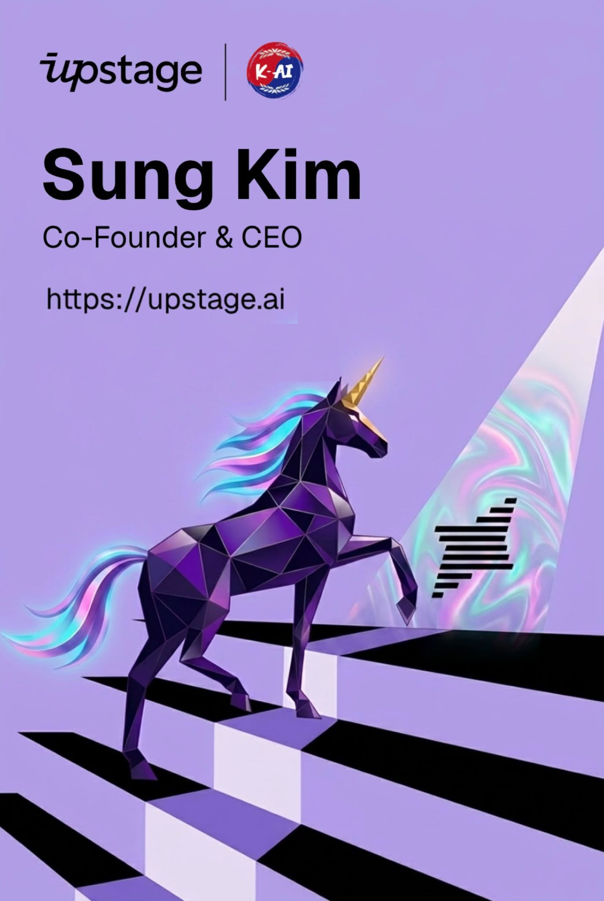

### 4월 18일 (토) 10:39 · 좋은 분과 한강 달리기 너무 좋은 날씨 입니다! #12K #한강런

좋은 분과 한강 달리기 너무 좋은 날씨 입니다! #12K #한강런

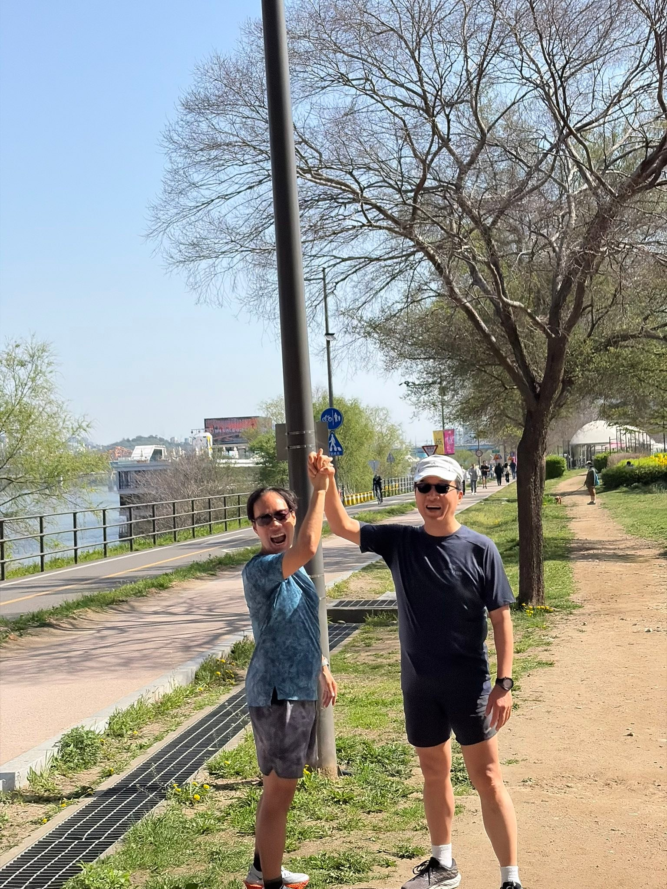 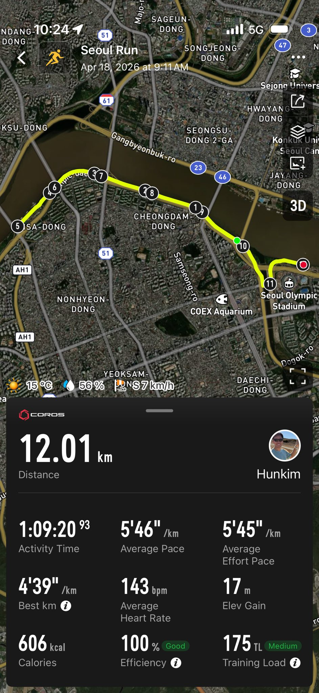

### 4월 23일 (목) 19:08 · AWS Summit Seoul 2026에 초대합니다. 함기호 대표님, J…

AWS Summit Seoul 2026에 초대합니다. 함기호 대표님, Jason Vice President 등과 함께 재미있는 이야기를 준비했습니다.

5월 20일(수)~21일(목) | 코엑스 컨벤션 센터 오시는 분들 모두 뵙겠습니다. 선등록 후 고민: https://pages.awscloud.com/aws-summit-seoul-2026-registration.html

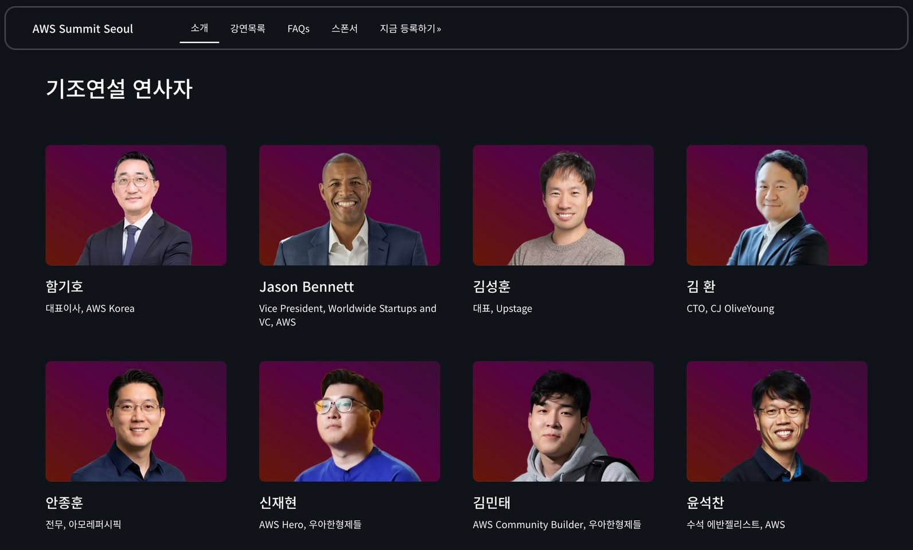 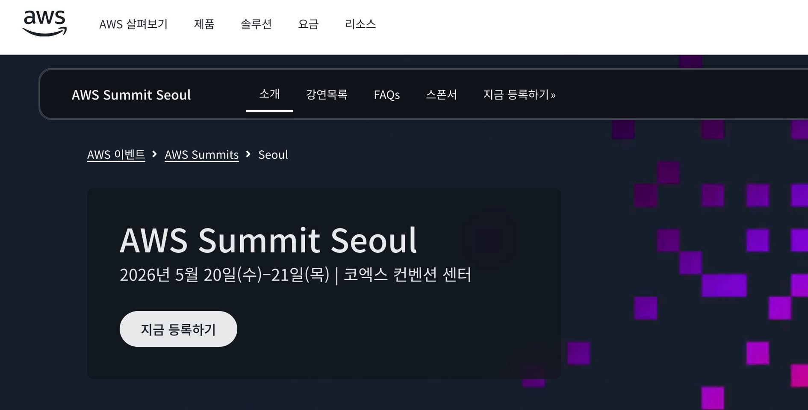

### 4월 26일 (일) 21:34 · 와~ 드디어 마라톤 2시간 벽이 깨졌습니다. 너무 멋진 일입니다. 1㎞를…

와~ 드디어 마라톤 2시간 벽이 깨졌습니다. 너무 멋진 일입니다. 1㎞를 2분 50초 이하로 42.195㎞를 달린 것입니다. 정말 대단합니다.

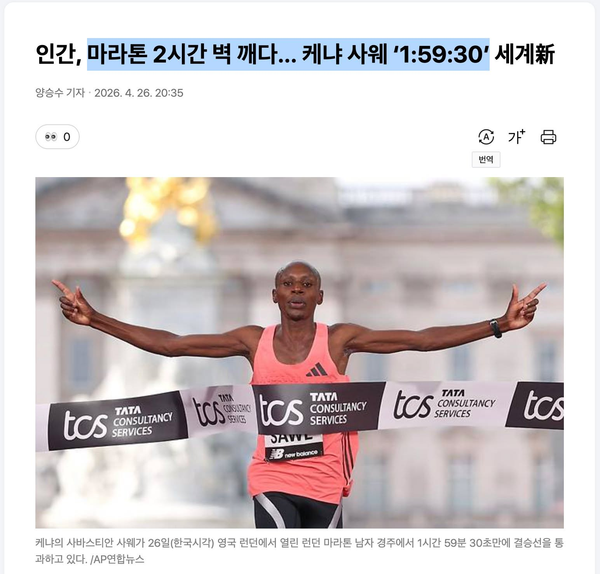

### 4월 26일 (일) 21:34 · Sung Kim shared a link.

🔗 <https://v.daum.net/v/20260426203532310>

### 4월 27일 (월) 13:25 · Upstage 미국 팀 팟캐스트 채널을 팔로우해 주세요.

Upstage 미국 팀 팟캐스트 채널을 팔로우해 주세요. https://lnkd.in/gnHfypy6

human‑in‑the‑loop와 기업용 AI 에이전트에 대해 다룰 예정입니다. 무엇보다 정말 재미있습니다!

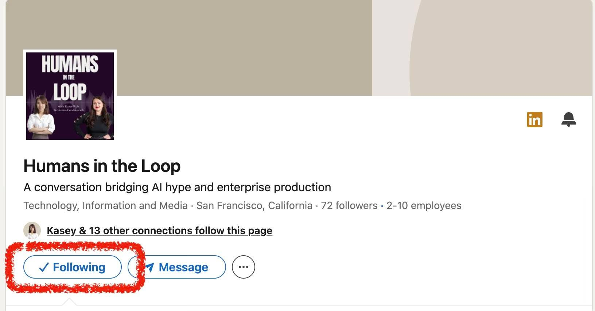

### 4월 28일 (화) 06:30 · Sung Kim shared a link.

🔗 <https://www.linkedin.com/company/humans-in-the-loop-x-ai/posts/?feedView=all&viewAsMember=true>

### 4월 28일 (화) 08:31 · "AI 보안 모델의 핵심은 결국 파운데이션 모델의 성능입니다. 독자적으로…

"AI 보안 모델의 핵심은 결국 파운데이션 모델의 성능입니다. 독자적으로 다룰 수 있는 AI 모델을 보유해야 우리 상황에 맞는 AI 보안 모델과 방어 시스템도 만들 수 있습니다." Kyung-Hoon Bae 너무 좋은 말씀 감사합니다.

Upstage 는 계속해서 최고의 파운데이션 모델의 성능을 위해 매진하겠습니다. 올 여름에 나올 solar-pro4 그리고 하반기 나올 solar-pro5 많은 기대 부탁드립니다.

아울러 "파운데이션 모델의 성능"을 함께 올리실 분들을 모시고 있습니다. https://careers.upstage.ai/ 선지원 후고민입니다.

### 4월 29일 (수) 10:54 · 국내 주요 금융권 C-level 분들을 모시고, 이른 오전 7시부터 AI…

국내 주요 금융권 C-level 분들을 모시고, 이른 오전 7시부터 AI Executive Breakfast (참석율 100% 만석!!!)를 진행했습니다.  Upstage Studio소개하고 또 금융에서 AI Agnet 이야기를 많이 들었습니다.

큰 관심을 받은 AI Studio는 https://studio.upstage.ai/ SaaS 로 바로 사용가능하며, 온프렘, 그리고 클라우드 VPC에 바로 설치됩니다. 지금 바로 사무 AI Agent를 시작해보셔요.

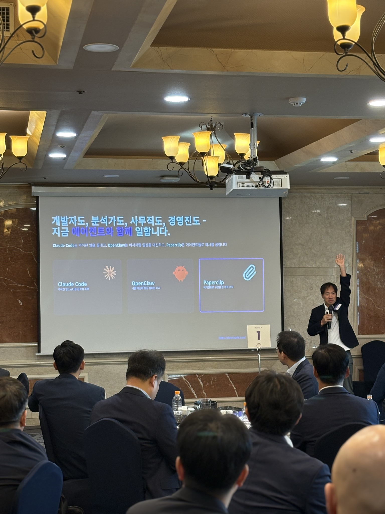 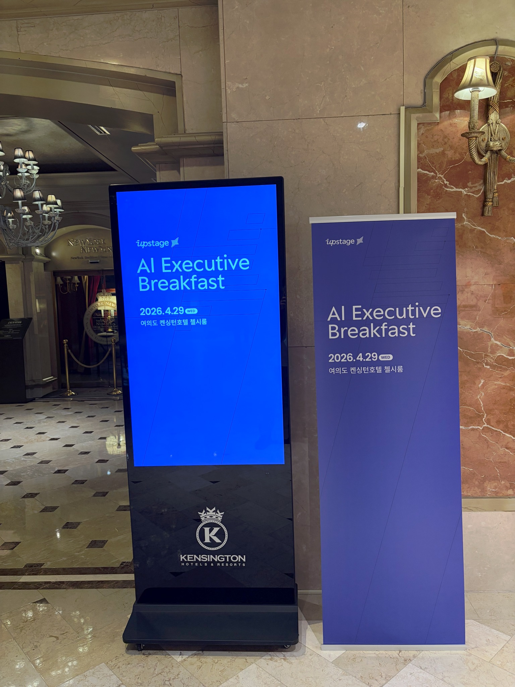 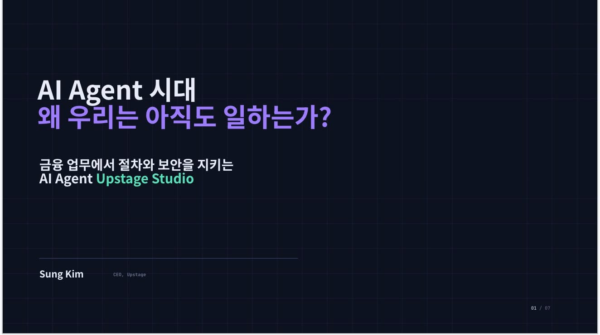 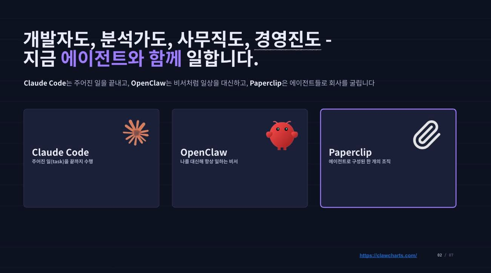 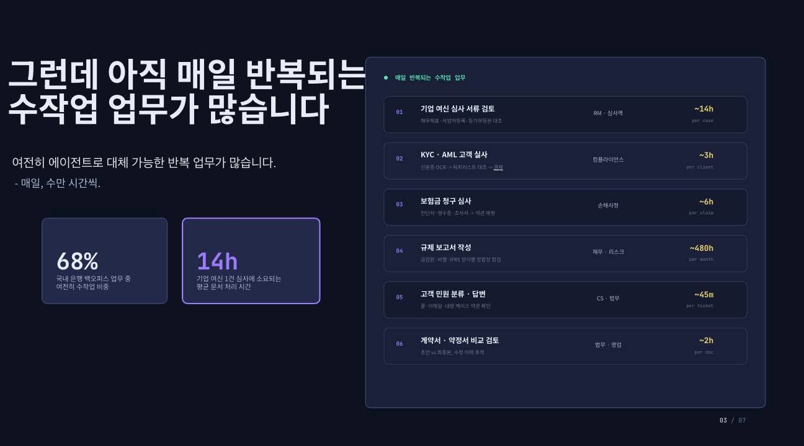 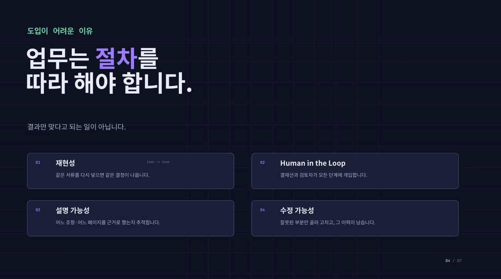 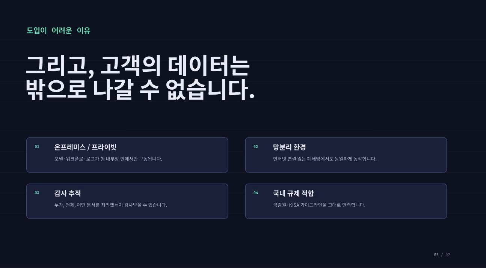 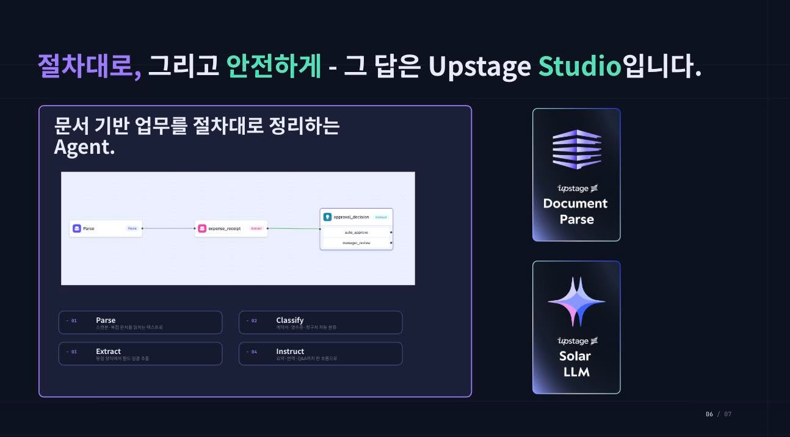 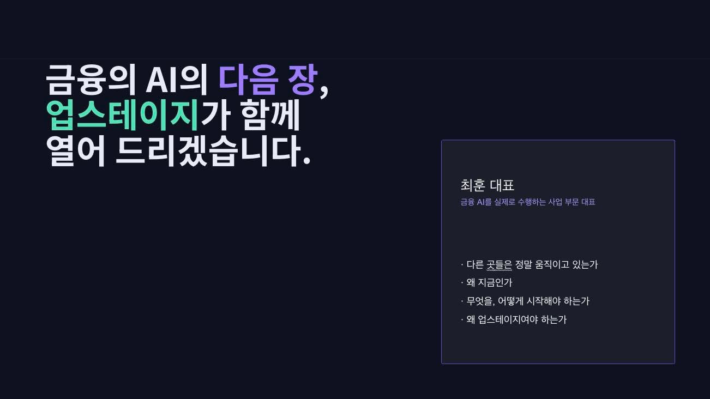
