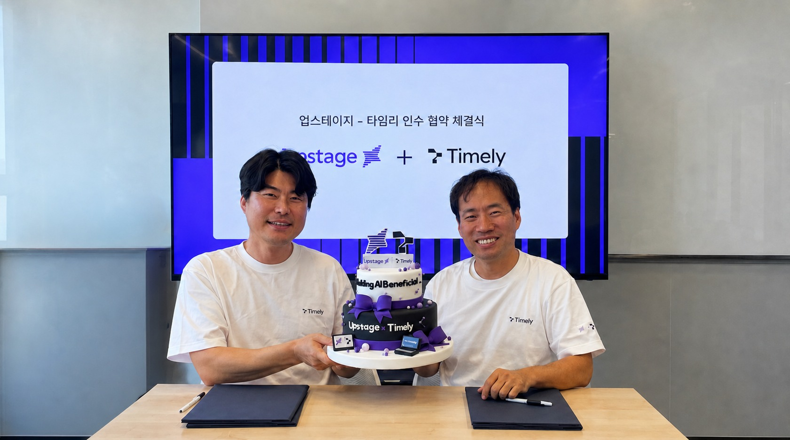
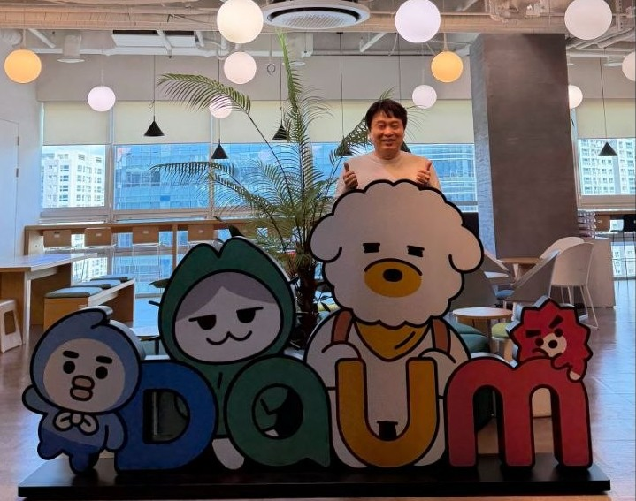
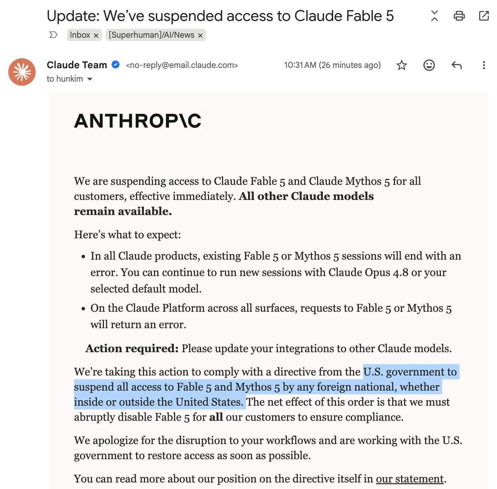
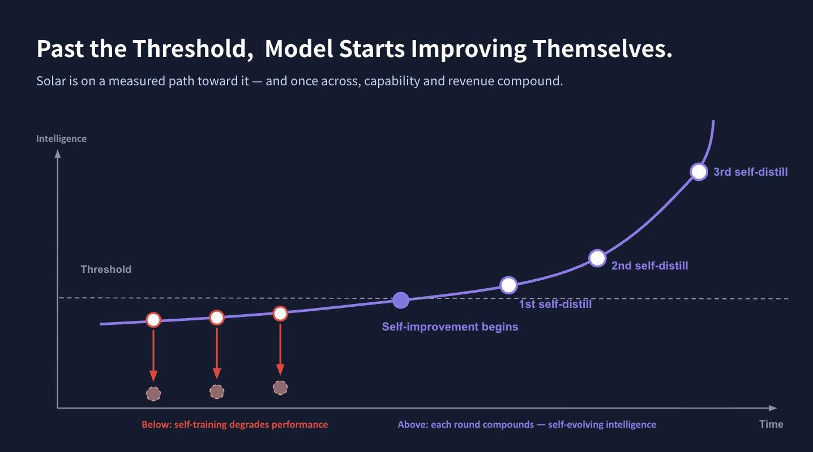
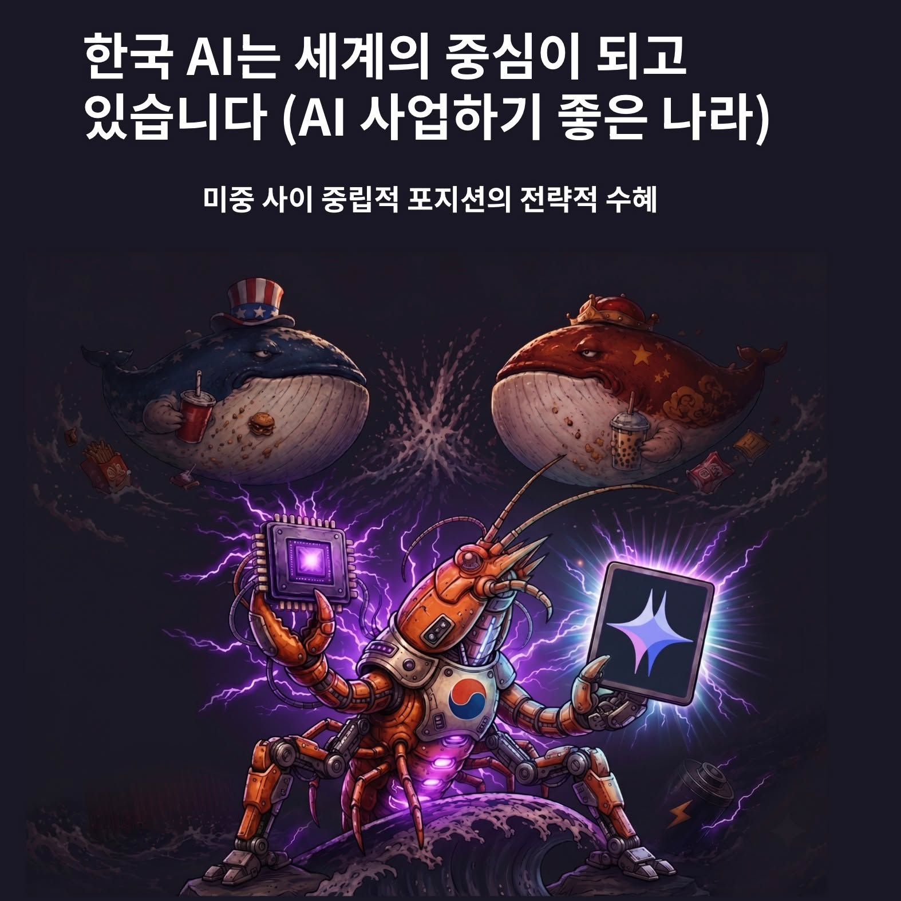
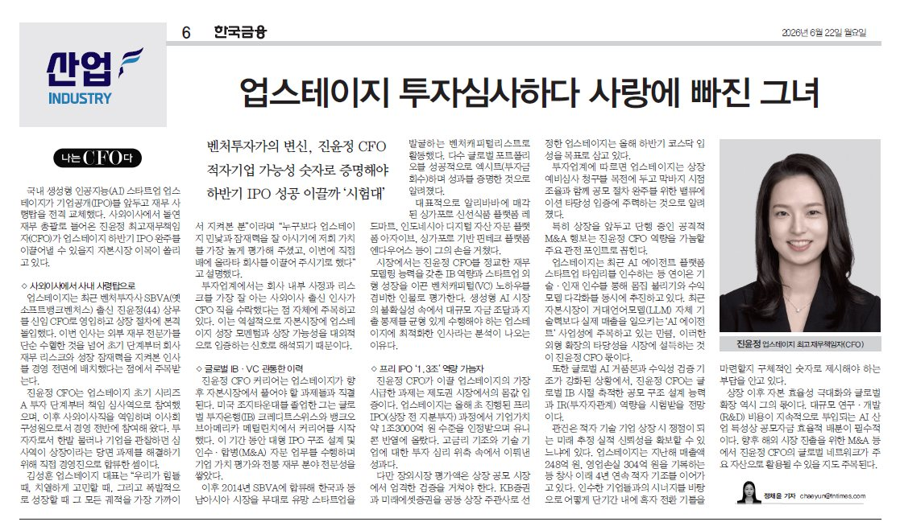
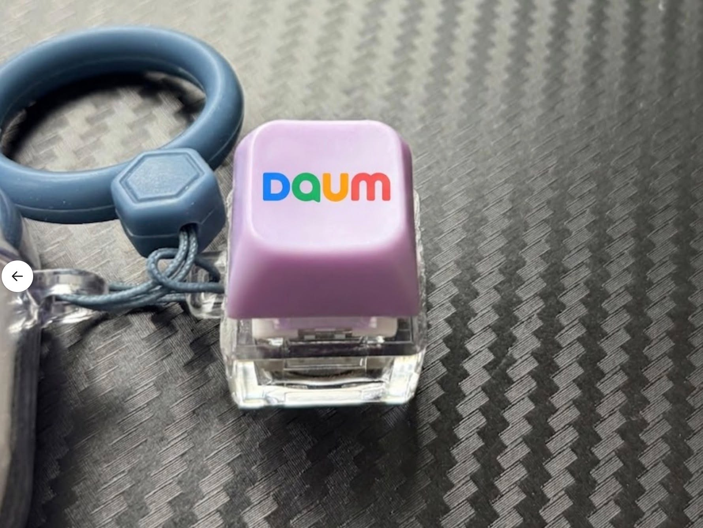

# 2026년 6월

[← 2026년](README.md)

### 6월 9일 (화) 09:02 · Upstage가 AI와 Agent 확산을 위해 타임리를 인수하고 업스테이…

Upstage가 AI와 Agent 확산을 위해 타임리를 인수하고 업스테이지 컴퍼니 한 가족으로 맞이했습니다. 이미 600+ 기관이 활발하게 사용하고 있는 타임리 AI Chat/Agent 서비스를 통해 Solar 모델을 더 확산하고 누구나 쉽게 사용 가능한 더 좋은 서비스를 제공하겠습니다. 모두를 위한 AI 시대를 열어가도록 하겠습니다.

https://timelyai.io 많은 사용 부탁드립니다. 6월 말 더욱 멋지고 새로운 기능으로 업그레이드됩니다.

### 6월 10일 (수) 08:51 · 🌟을 모셨습니다. 1세대 포털 다음Daum은 이제 AI Agent화된 포…

🌟을 모셨습니다. 1세대 포털 다음Daum은 이제 AI Agent화된 포털로 거듭날 준비를 하면서 Daum을 이끌어갈 분을 모셨습니다. 국내 1순위 플랫폼·서비스 리더로 꼽히는 Keonsu Lee 이건수 전 네이버 Glace CIC 대표님께서 드디어 Daum의 새 대표로 전격 합류합니다.

이건수 대표님을 처음 만난 곳은 제가 네이버에서 일할때 한 회의실에서였습니다. AI 기술을 어떤 서비스에 접목할까 고민하면서 모든 사업 대표님들을 찾아 뵙고 있던 중, 당시 네이버 Local/지도 CIC(Glace CIC) 대표님으로 뵈었습니다. AI 기술에 대한 이해가 깊었고, 무엇보다 새로운 기술을 서비스에 녹여 사용자 경험을 한 단계 끌어올리고자 하는 마음이 강하게 느껴졌습니다. "부족한 기술도 되게 만들어 서비스에 녹여낸다" — 이 한 문장이 이건수 대표님을 가장 잘 설명하는 말입니다.

이건수 대표님은 경영학과 출신이면서도 엔지니어로 커리어를 쌓아온 보기 드문 이력의 소유자입니다. 2007년 네이버 입사 후 개발및  광고상품 리더(2008)를 거쳐 2014년 임원으로 승진, 2015년부터는 네이버 MY플레이스(예약·주문) 사업을 총괄하며 업계 1위로 성장시킨 입지전적 인물입니다. 그의 손을 거친 서비스마다 퀀텀 점프가 일어났습니다.

제가 기억하는 몇가지 예만 보더라도 대단합니다:
* 영수증 리뷰: 네이버 지도와 리뷰 생태계의 티핑포인트가 되었던 바로 그 서비스가 이건수 대표님이 만드신 것입니다.  식당을 실제로 다녀온 사람만 리뷰를 남길 수 있게 되면서, 어느 식당에 몇 시에 방문해 어떤 메뉴를 주문했는지 정확한 데이터가 쌓이게 되면서, 신뢰할 수 있는 리뷰 데이터셋이 만들어졌고 네이버 MY 플레이스는 압도적인 1위로 도약했습니다.

* AI Call 서비스: 음성인식·자연어처리·합성을 결합해 식당 예약 전화를 AI가 응대하는 시스템을, 2019년 아웃백을 시작으로 가장 먼저 실서비스에 올렸습니다. 오늘날 네이버 케어콜등으로 발전했습니다.

* 사업장 자동 등록: 사업자등록증을 사진 한 장 찍어 올리면 상호·주소·업종이 자동 추출되어 등록되는 구조를 만들어, 검색 반영 주기를 평균 3일에서 10분으로 단축시켰습니다. 전국 수백만 소상공인의 디지털 진입 장벽을 사실상 없앤 변화였습니다.

* 테이블 주문 — 식당 테이블이 곧 결제 단말: 손님이 테이블 QR을 찍으면 메뉴 확인부터 주문, 네이버페이 결제까지 한 흐름으로 끝나는 서비스를 2019년 그린팩토리 인근에서 처음 시작했습니다. 이후 '스마트주문' → '네이버 주문'으로 진화하며 국내 테이블 오더 시장의 원형이 되었습니다.

이건수 대표님을 모신것은 Daum에도 큰 행운입니다. 개발자 출신으로 기술과 AI에 대한 깊은 이해, 그리고 '안 되는 기술도 서비스에 녹여 되게 만드는' 실행력 — 이 두 가지가 결합되어야만 1세대 포털 Daum을 AI Agent 시대의 포털로 다시 태어나게 할 수 있다고 믿습니다. 이건수 대표님은 그 두 가지를 모두 갖춘 유일한 분입니다. 무엇보다 그 꿈을 함께 꾸어주셨습니다.

검색에서 출발해 사용자의 의도를 이해하고, 행동을 대신해주는 AI Agent 포털. 그 여정의 첫 페이지를 이건수 대표님과 함께 열게 되어 설렙니다. 앞으로의 Daum에 많은 관심과 기대 부탁드립니다.

Daum은 세계 최고 수준의 AI Agent 포털을 꿈꾸며, 그리고 Upstage는 계속해서 누구에게나 AI의 혜택이 돌아가도록 (Making AI Beneficial) 계속 나아가겠습니다.

### 6월 13일 (토) 11:07 · #미국안보위협을 이유로 Fable 5 와 Mythos 5를 미국 시민권자…

#미국안보위협을 이유로 Fable 5 와 Mythos 5를 미국 시민권자가 아닌 모든 사람에게 사용을 금한다는 안내를 받았습니다. 미국의 주요 핵시설, 군사시설도 미국 시민권자만 Access가 가능했었는데요. 이제 LLM을 그 수준의 National Security의 핵심 자산으로 인식한 것 같습니다.

LLM의 이런 빠른 발전 뒤에는 self-improvement가 가능해졌기 때문인데요. Upstage도 빠르게 self-distill/self-improvement가 가능한 지능 확보를 위해 노력하고 있습니다. 곧 좋은 성과를 보여드릴 수 있을 것입니다.

다음 버전의 SolarLLM을 만들기 위해 더 많은 분이 필요합니다. 이 위대한 도전에 함께하실 분들을 계속 모시고 있습니다. 함께해요: https://careers.upstage.ai/en/upstage

 

### 6월 14일 (일) 18:40 · Upstage #SolarPreview 성능이 점점더 좋아지고 있습니다.…

Upstage #SolarPreview 성능이 점점더 좋아지고 있습니다. 정식 출시되는 6말, 7말 더 많이 기대해주셔요. 

"빠른모드 (im-not-ai 모든 패턴을 쓰지 않고, 다빈도의 중요 패턴만 쓰는)에서 Solar-Open2-Preview 가 자주 쓰는 Sonnet 4.6 은 물론, Opus 4.8보다 우수한 결과가 나왔네요!!!!!"

### 6월 17일 (수) 10:27 · 미국과 중국의 AI 지능 경쟁이 격화되고 있는데요. 이런 미중 고래 싸움…

미국과 중국의 AI 지능 경쟁이 격화되고 있는데요. 이런 미중 고래 싸움에 등이 터지지 않고 오히려 고래들을 이기려면?

"할아버지께서 내주신 퀴즈, 정답을 이제야 알았어요. 고래 싸움에서 새우가 이기는 법, 새우 몸집을 키우는 거죠. 고래 싸움에 등이 터지지 않을 만큼. 포기하지만 않는다면, 시간은 새우 편 아닐까요?" -- 재벌집 막내아들(드라마)

메모리, 반도체, 서비스등 풀스펙 AI기반 기술을 무기로 강력한 LLM을 확보하다면, 큰 새우가 되고 오히려 중립적 포지션의 전략적 수혜를 받으면서 크게 성장할 수 있을 것으로 생각합니다. 업스테이지는 앞장서서 강력한 SolarLLM으로 AI 3강에 기여할 수 있도록 하겠습니다.

### 6월 17일 (수) 10:28 · Sung Kim shared a link.

🔗 <https://v.daum.net/v/20260616151633168>

### 6월 23일 (화) 16:26 · Kevin Ko 님 "입사하고 약 3개월 동안 SWE-bench에서 De…

Kevin Ko 님 "입사하고 약 3개월 동안 SWE-bench에서 DeepSeek-v4-Flash, MIMO-v2.5 등 모델들과 경쟁할 수 있는 수준의 성능을 확보했고, 이제는 NL2Repo, ClawEval 등 더욱 실사용에 가까운 문제를 풀어보고자 합니다."

저희 세계 SOTA모델과 어깨를 나란히 하는 모델을 만들고 있습니다. 함께해요! 선지원 후고민!!

### 6월 24일 (수) 08:12 · "업스테이지 투자심사하다 사랑에 빠지다" Upstage 를 알면 알수록 …

"업스테이지 투자심사하다 사랑에 빠지다" Upstage 를 알면 알수록 사랑에 빠질수 밖에 없습니다! Agent 능력 최강의 SolarLLM과 AI기술을 만들기 위해 더 많은 더 좋은 분들을 모시고 있습니다. 함께 해요!

https://careers.upstage.ai/

### 6월 25일 (목) 09:43 · Daum 키캡 소개! 요즘 키캡이 유행인데 저도 가지고 다니면서 심심할 …

Daum 키캡 소개! 요즘 키캡이 유행인데 저도 가지고 다니면서 심심할 때 한번씩 눌러보니 손의 촉감도 새롭고 기분 전환도 되고 좋더라고요. 그래서 Daum 로고가 똭 박힌 멋진 키캡 한정판을 만들었습니다. 다음번에 저를 만나시면 (Daum 앱이 깔려있는지 보고) 하나씩 드리겠습니다.

Daum에서 실시간 트렌드로 오늘의 소식들을 점검하고 다양한 커뮤니티 활동을 할 수 있습니다. 여기에 AI overview, 검색, Agent 등을 추가하여 여러분들이 더욱 쉽게 필요한 정보를 얻고 의견을 나눌 수 있는 장이 되도록 하겠습니다. https://www.daum.net/ 많이 사용해주세요!

