# 2026년 7월

[← 2026년](README.md)

### 7월 1일 (수) 09:56 · Upstage #독파모 'Solar LLM'이 포털 'Daum' 검색에 …

Upstage #독파모 'Solar LLM'이 포털 'Daum' 검색에 적용되었습니다. 

주간 1,000만 명 이상이 찾는 Daum에 Solar LLM이 더해지면서, 누구나 일상에서 손쉽게 AI를 경험할 수 있게 되었습니다. 이제 Daum 검색창에 궁금한 것을 입력하면, 'AI 요약' 베타 서비스가 여러 웹 문서를 Solar LLM으로 분석해 핵심과 근거를 한눈에 정리해 보여줍니다. Solar LLM이 정리한 검색 결과, https://www.daum.net/ 에서 직접 확인해보세요.

Upstage는 Daum을 시작으로 Solar LLM을 더 많은 대국민 서비스로 넓혀, 누구나 일상에서 AI의 효용을 누리는 '모두를 위한 AI' 시대를 열어가겠습니다.

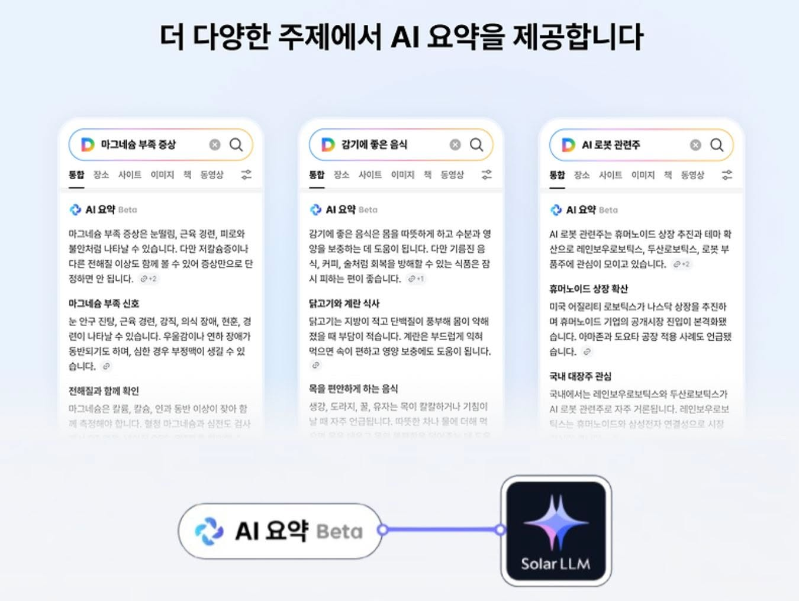
**이미지 캡션:** 이 이미지는 세 개의 AI 요약 카드와 하단에 "AI 요약 Beta" 및 "Solar LLM" 로고를 보여주는 스크린샷입니다. 각 카드는 검색 결과의 요약을 제공하며, 왼쪽 카드에는 "마그네슘 부족 증상"에 대한 정보가 있고, 중간 카드에는 "감기에 좋은 음식"에 대한 정보가 있으며, 오른쪽 카드에는 "AI 로봇 관련주"에 대한 정보가 있습니다. 각 카드에는 제목, AI 요약 섹션, 그리고 추가적인 세부 정보가 포함되어 있습니다. 전반적인 분위기는 정보 제공적이며, AI 기반 요약 서비스의 다양한 기능을 보여주고 있습니다.

### 7월 1일 (수) 19:15 · 존경하는 Kyunghyun Cho 교수님 Daum엡 설치후 키켑선물 드렸…

존경하는 Kyunghyun Cho 교수님 Daum엡 설치후 키켑선물 드렸습니다. 너무 행복해 하시네요. Daum많이 사용해주셔요.

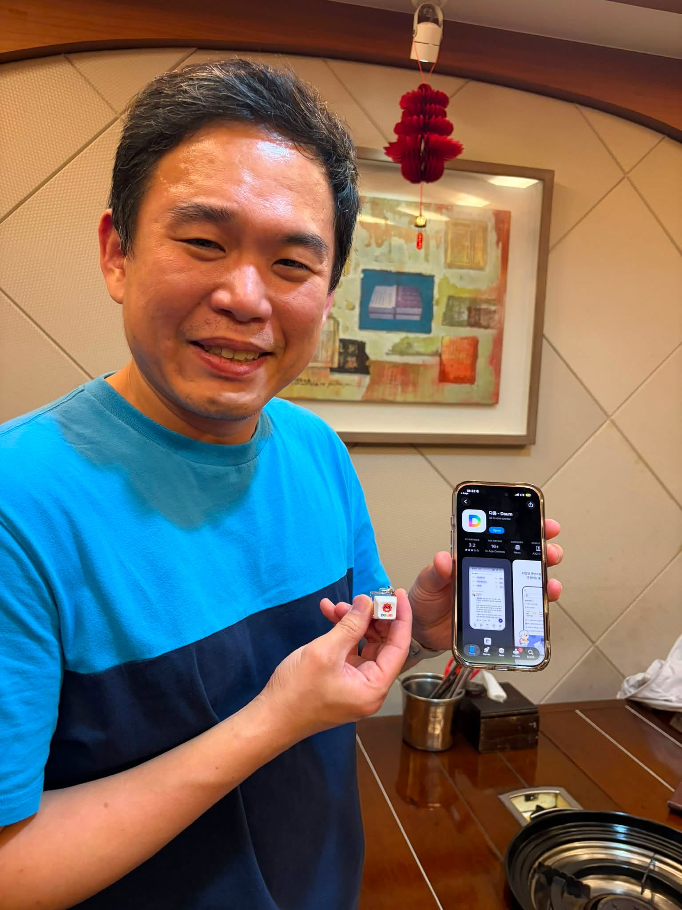
**이미지 캡션:** 한 성인 남성이 밝게 웃으며 카메라를 바라보고 있다. 그는 30대 후반에서 40대 초반으로 보이며, 짧은 검은 머리에 옅은 피부를 가지고 있다. 파란색과 남색이 배색된 티셔츠를 입고 있으며, 왼쪽 손에는 작은 네모난 모양의 키링을, 오른쪽 손에는 스마트폰을 들고 있다. 키링에는 빨간색 동그라미와 함께 하얀색 바탕에 글자가 새겨져 있다. 스마트폰 화면에는 앱 스토어 화면이 보이며, 'Daum'이라는 로고와 함께 앱 이름, 별점, 연령 제한 등의 정보가 표시되어 있다. 배경에는 액자가 걸려 있고, 천장에는 붉은색 장식이 달려 있어 실내 공간임을 알 수 있다. 테이블 위에는 냄비와 수저통 등이 놓여 있어 식당이나 가정집의 식사 공간으로 추정된다. 전체적으로 편안하고 긍정적인 분위기이다.

### 7월 2일 (목) 08:26 · #독파모 #Solar-Open2 API 출시 기념 키캡 선물 이벤트 #S…

#독파모 #Solar-Open2 API 출시 기념 키캡 선물 이벤트 #Solar-Open2가 https://timelyai.io/ 를 통해 출시되었습니다. "사용해보기" 로 무료로 사용할 수 있는데요. 기본적인 챗뿐만 아니라 이번 모델은 에이전트 성능이 높아 다양한 툴 사용을 통한 작업 완수율이 상당히 높습니다. 여러분들의 텔레그램에 에이전트를 붙여 언제 어디서나 작업 지시가 가능합니다.

7월 10일까지 사용해보시고 이 글에 의견 달아 주시는 분 중 10분을 선정하여 요즈음 핫 아이템인 업스테이지 키캡을 드리겠습니다. 많은 이용 부탁드립니다.

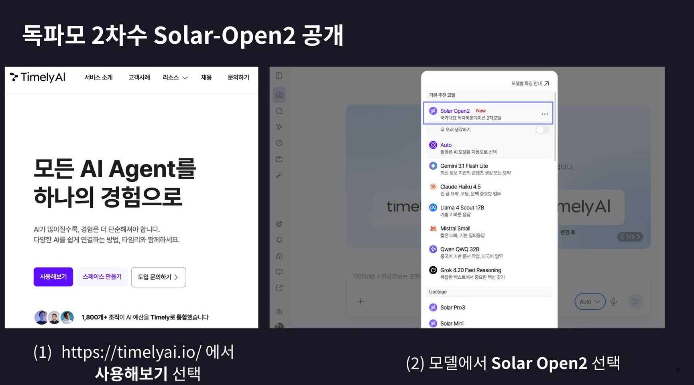
**이미지 캡션:** 이 이미지는 TimelyAI라는 서비스의 웹사이트와 모바일 앱 인터페이스를 보여주는 스크린샷입니다. 상단에는 "독파모 2차수 Solar-Open2 공개"라는 제목이 한국어로 적혀 있으며, 이는 새로운 AI 모델의 출시를 알리는 것으로 보입니다. 왼쪽에는 TimelyAI 웹사이트의 메인 페이지가 표시되어 있으며, "모든 AI Agent를 하나의 경험으로"라는 슬로건과 함께 AI의 단순화된 경험을 강조하는 문구가 있습니다. "사용해보기", "스페이스 만들기", "도입 문의하기"와 같은 버튼이 보이며, 1,800개 이상의 조직이 AI 예산을 Timely로 통합했다는 정보도 함께 제공됩니다. 하단에는 웹사이트 주소와 함께 "사용해보기 선택"이라는 안내 문구가 있습니다. 오른쪽에는 모바일 앱 또는 웹 인터페이스로 추정되는 화면이 있으며, "기본 추천 모델" 목록이 표시됩니다. 이 목록에는 "Solar Open2"가 "New" 태그와 함께 가장 위에 있으며, "국가대표 독자파운데이션 2차모델"이라는 설명이 붙어 있습니다. 그 외에도 "Auto", "Gemini 3.1 Flash Lite", "Claude Haiku 4.5", "Llama 4 Scout 178", "Mistral Small", "Qwen QWQ 32B", "Grok 4.20 Fast Reasoning" 등 다양한 AI 모델들이 나열되어 있습니다. 화면 하단에는 "Auto"라는 드롭다운 메뉴와 함께 대화창으로 보이는 인터페이스가 있습니다. 전체적으로 TimelyAI라는 플랫폼이 다양한 AI 모델을 통합하여 사용자에게 제공하는 서비스임을 보여주는 홍보성 이미지로 해석됩니다.
 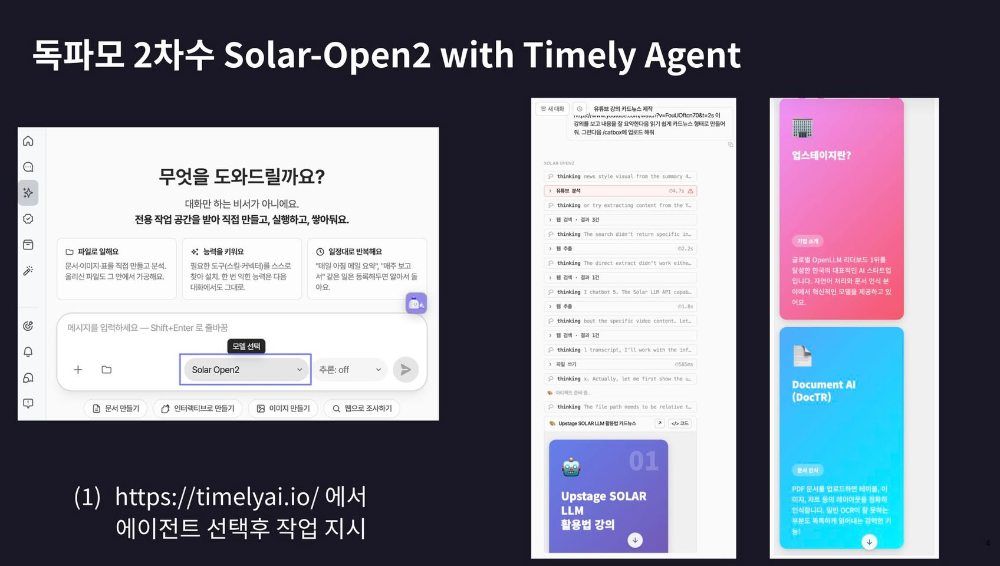
**이미지 캡션:** 이 이미지는 "독파모 2차수 Solar-Open2 with Timely Agent"라는 제목의 프레젠테이션 또는 웹사이트 화면을 보여줍니다. 화면은 크게 세 부분으로 나뉩니다. 왼쪽에는 "무엇을 도와드릴까요?"라는 제목과 함께 사용자가 AI 비서에게 요청할 수 있는 기능들이 아이콘과 함께 설명되어 있습니다. 파일 작업, 능력 강화, 일정 반복 등의 기능이 있으며, 메시지 입력창과 모델 선택 드롭다운 메뉴가 보입니다. 가운데 부분에는 AI와의 대화 기록으로 보이는 스크롤 가능한 창이 있으며, 유튜브 분석, 콘텐츠 추출 등 다양한 작업 요청과 그 결과가 시간과 함께 표시됩니다. 오른쪽에는 "업스테이지란?"이라는 제목의 카드와 "Document AI (DocTR)"라는 제목의 카드가 있습니다. 업스테이지 카드는 글로벌 LLM 리더보드 1위를 달성한 한국의 AI 스타트업임을 소개하고 있으며, Document AI 카드는 PDF 문서에서 테이블, 이미지, 차트 등을 정확하게 인식하는 기능에 대해 설명하고 있습니다. 화면 하단에는 "https://timelyai.io/ 에서 에이전트 선택 후 작업 지시"라는 안내 문구가 있습니다. 전반적으로 AI 기반의 작업 공간 및 문서 처리 솔루션을 소개하는 내용으로 보이며, 기술적인 내용을 다루고 있어 전문적이고 정보 전달 중심의 분위기입니다.
 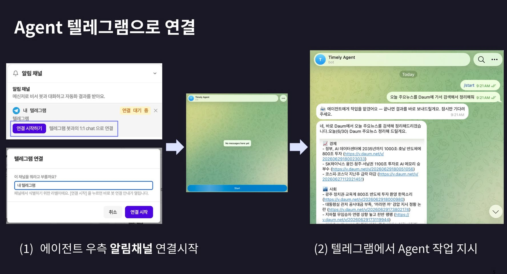
**이미지 캡션:** 이 이미지는 Agent 텔레그램 연결 과정을 보여주는 스크린샷 모음입니다. 왼쪽에는 Agent의 알림 채널과 텔레그램 연결 화면이 표시되어 있으며, 가운데에는 텔레그램 봇과의 연결을 시작하는 과정을 나타내는 화살표가 있습니다. 오른쪽에는 텔레그램 봇인 "Timely Agent"와 사용자가 주고받은 대화 내용이 보입니다. 대화 내용은 "오늘 주요뉴스를 Daum에 가서 검색해서 정리해줘"라는 사용자의 요청과 이에 대한 Agent의 응답으로 구성되어 있으며, 경제 및 사회 분야의 뉴스 기사 링크들이 포함되어 있습니다. 전반적으로 Agent와 텔레그램을 연동하여 정보를 검색하고 요약하는 과정을 시각적으로 설명하고 있습니다.
 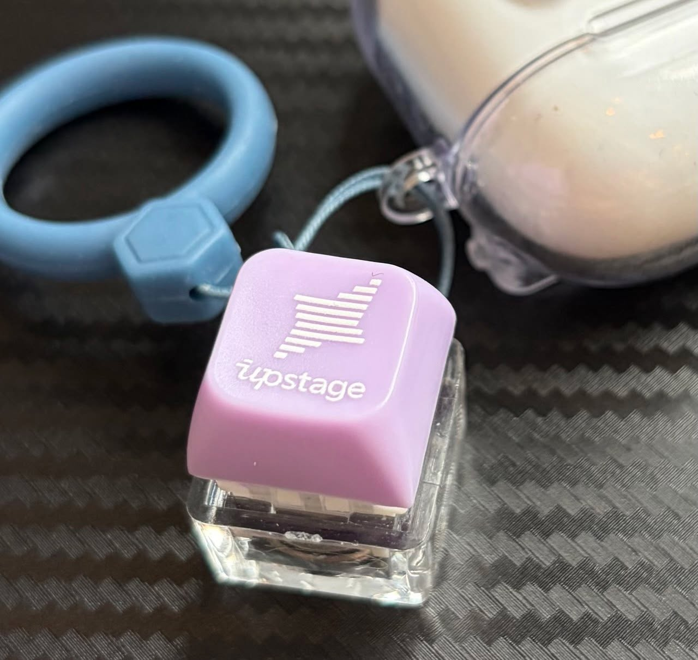
**이미지 캡션:** 사진에는 연보라색 키캡이 투명한 스위치 위에 놓여 있으며, 키캡에는 흰색 로고와 함께 'upstage'라는 글자가 새겨져 있습니다. 키캡에는 파란색 끈이 달려 있고, 이 끈은 파란색 고리 모양의 액세서리에 연결되어 있습니다. 배경에는 반짝이는 내용물이 들어 있는 투명한 케이스가 보입니다. 전체적으로 어두운 회색의 격자무늬 표면 위에 놓여 있으며, 조명은 밝고 선명하여 물체의 질감과 디테일을 잘 보여줍니다. 사진에는 사람이 등장하지 않으며, 사물들은 주로 개인용 전자기기 액세서리나 키보드 관련 부품으로 보입니다. 분위기는 깔끔하고 현대적이며, 제품의 특징을 강조하는 듯한 느낌을 줍니다.

### 7월 2일 (목) 22:34 · #Fable5 VS #SolarOpen2 #Fable5가 돌아온 기념으로…

#Fable5 VS #SolarOpen2 #Fable5가 돌아온 기념으로 재미있는 글이 많이 올라오고 있습니다. 그중 Fable5, GLM5.2, GPT5.5, Opus 4.8에 HTML 3D 랜더링을 시켜 보는 재미있는 prompt를 발견했습니다.

아주 불친절한 프롬프트로 그림을 그리는 것인데요 나머지 중력이나 물리 이런 것은 모델이 알아서 해야 하는 어려운 테스크입니다. 

250B에 불과한 독파모 2차 모델인 SolarOpen2도 도전해 보았습니다. 아직은 Fable5 에 비해 부족하지만 몬스터 트럭은 나쁘지 않습니다.

빨리 최고 모델들 따라잡아 보겠습니다!
---
build three self-contained HTML5 canvas scenes with real physics demos

Prompts:
— A train derailing off a broken bridge into the water
— Two cars jumping off ramps and colliding mid-air over a canyon
— A monster truck crushing a row of parked cars

🎬 동영상 1개 (생략)

### 7월 2일 (목) 22:35 · Sung Kim shared a link.

🔗 <https://x.com/atomic_chat_hq/status/2072446067962978411?s=20>

### 7월 3일 (금) 05:58 · #독파모2차 #SolarOpen2 원샷 ("벽돌깨기 게임 만들어줘" 한번…

#독파모2차 #SolarOpen2 원샷 ("벽돌깨기 게임 만들어줘" 한번 프롬프트)으로 만든 게임. https://solar-open2-test.vercel.app/ Let's play!

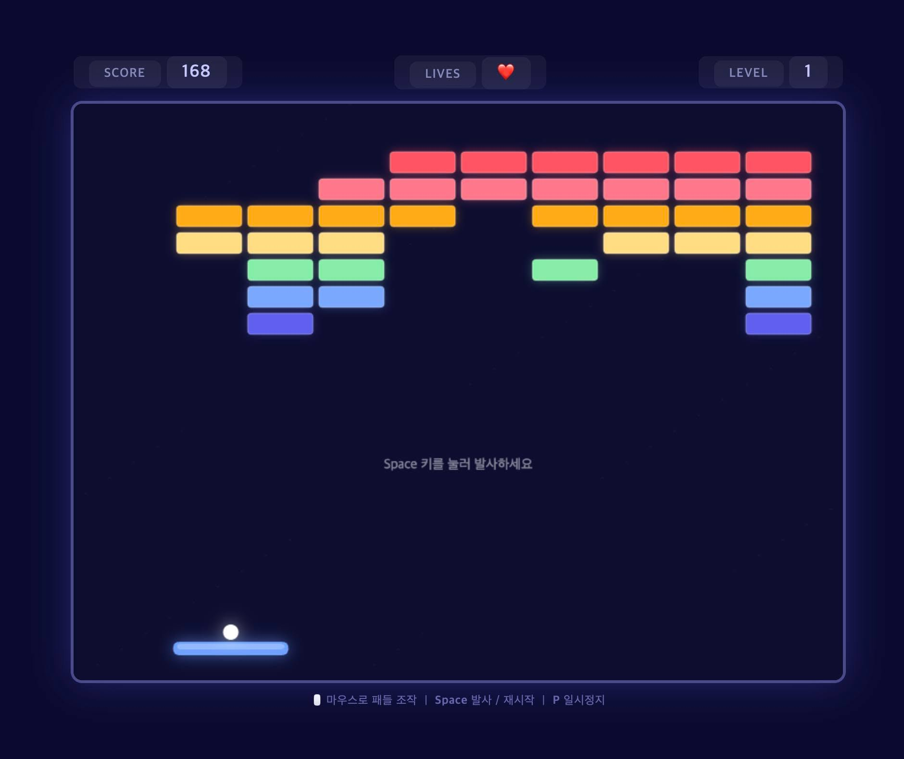
**이미지 캡션:** 이것은 벽돌 깨기 게임의 스크린샷으로, 어두운 파란색 배경에 게임 플레이 영역이 표시됩니다. 화면 상단에는 SCORE 168, LIVES (하트 아이콘과 함께), LEVEL 1이라는 텍스트가 표시되어 게임의 현재 상태를 나타냅니다. 게임 플레이 영역에는 다양한 색상의 벽돌들이 여러 줄로 쌓여 있으며, 빨간색, 주황색, 노란색, 초록색, 파란색 벽돌이 보입니다. 화면 중앙에는 "Space 키를 눌러 발사하세요"라는 한국어 텍스트가 표시되어 있습니다. 화면 하단에는 "마우스로 패들 조작 | Space 발사 / 재시작 | P 일시정지"라는 게임 조작법에 대한 한국어 안내가 있습니다. 게임 화면 하단에는 플레이어가 조작할 수 있는 파란색 패들과 공이 보입니다. 전반적으로 게임의 분위기는 단순하고 복고풍이며, 플레이어의 참여를 유도하는 인터페이스를 가지고 있습니다.

### 7월 3일 (금) 16:34 · 존경하는 Wontae Lee 교수님 뵙고 AI3강등 재미있는 말씀 많이 …

존경하는 Wontae Lee 교수님 뵙고 AI3강등 재미있는 말씀 많이 들었습니다. Daum 엡 설치 확인후 Daum 키켑도 전달 드렸습니다.

Daum엡 설치후 저를 만나시면 키켑선물 드리겠습니다. 선설치, 후고민!

### 7월 4일 (토) 08:31 · 저희  서비스에서 여러 모델을 사용할 수 있도록 일부 Failover 등…

저희 https://timelyai.io/ 서비스에서 여러 모델을 사용할 수 있도록 일부 Failover 등으로 openrouter를 사용하고 있는데 이번 주 주간 토큰 사용량 글로벌 17위를 차지하였습니다. 역시 #1 에이전트 플랫폼인 Hermes가 압도적인 1등이네요.

타임리 https://timelyai.io/ 더 많이 사용해 주시면 저희 순위 더 업업업 해보겠습니다. 토큰을 더 많이 사용하는 #토크노믹스 함께 만들어 가겠습니다.

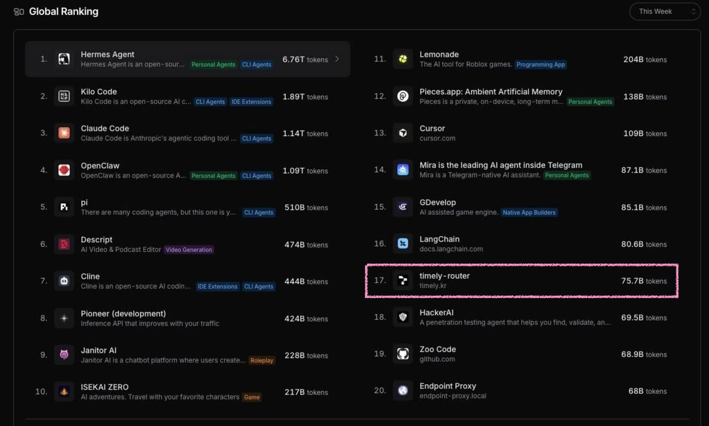
**이미지 캡션:** 이 이미지는 "Global Ranking"이라는 제목의 웹사이트 화면을 보여주며, AI 관련 프로젝트들의 순위를 나타냅니다. 화면은 어두운 테마로 디자인되었으며, 왼쪽에는 1위부터 10위까지의 프로젝트 목록이, 오른쪽에는 11위부터 20위까지의 프로젝트 목록이 표시됩니다. 각 프로젝트는 순위 번호, 아이콘, 이름, 간략한 설명, 관련 태그, 그리고 토큰 수를 포함합니다. 예를 들어, 1위는 "Hermes Agent"로 6.76T 토큰을 기록했으며, 2위는 "Kilo Code"로 1.89T 토큰, 3위는 "Claude Code"로 1.14T 토큰입니다. 17위에는 "timely-router"가 75.7B 토큰으로 표시되어 있으며, 이 항목 주변에 분홍색 하이라이트가 있습니다. 이 화면은 기술 커뮤니티에서 AI 프로젝트의 인기도나 사용량을 나타내는 지표로 사용될 수 있습니다.

### 7월 6일 (월) 11:56 · 7월 10일 판교에서 열리는 Solar Open Day에 여러분을 초대합…

7월 10일 판교에서 열리는 Solar Open Day에 여러분을 초대합니다. https://luma.com/nv57vgh9 선신청, 후고민!

​독자 파운데이션 모델 프로젝트 2차수 모델 Solar Open2를 소개하는 시간을 마련했습니다.

Solar Open2는 지식을 답하는 데서 멈추지 않고 Agent 기능을 충실히 수행하도록 설계되었습니다. Claude Code의 기본 모델을 Solar Open2로 적용하면 일반적인 개발 작업을 무리 없이 수행할 수 있습니다. #1 Agent Platform인 Hermes에서도 매우 잘 동작하고, 별도 설치가 필요 없는 Timely Agent 에서도 높은 작업 완성률을 보여줍니다.

​더불어 이번 Solar Open Day에서는 Daum의 AI Overview, 그리고 Cerebras 칩으로 구동되는 빠른 AI 검색 데모를 가장 먼저 만나보실 수 있습니다.

간단한 데모 후, 식사를 하며 AI 이야기를 나누는 네트워킹 시간이 이어집니다. 참여하시는 분들에게  Solar Open2 무료 early access와 Daum 키캡을 드립니다.

​장소: ​판교역 인근 (정확한 위치는 참여 확정 후 개별 안내드립니다.)

​일정:
4:50pm - 5:00pm: 체크인
​5:00pm - 6:00pm: Solar Open 2 소개 + 라이브 데모
​6:00pm - 7:00pm: 피자 & 네트워킹

※ 안내: 본 행사는 개발자 대상으로 진행됩니다. 장소가 협소한 관계로 정확한 행사 장소는 참여 확정되신 분들께 개별 안내해 드릴 예정입니다.

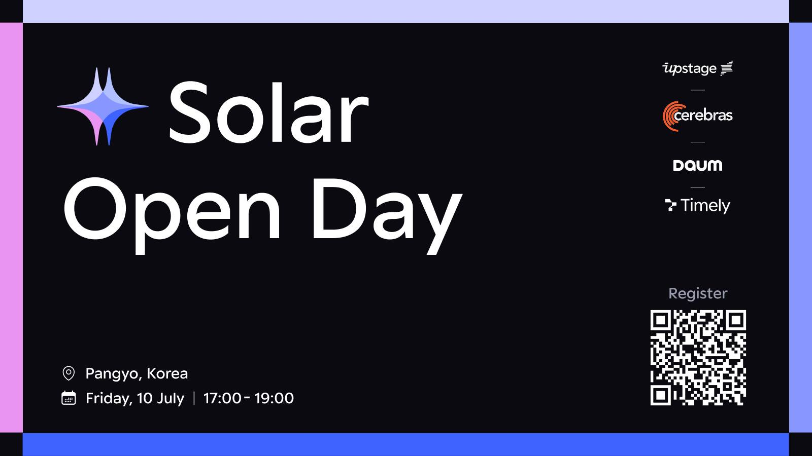
**이미지 캡션:** 이 이미지는 "Solar Open Day"라는 행사를 홍보하는 포스터입니다. 왼쪽 상단에는 네 개의 빛나는 별 모양의 로고가 있고, 그 옆에는 흰색 글씨로 "Solar"와 "Open Day"가 크게 쓰여 있습니다. 배경은 어두운 남색이며, 왼쪽에는 연한 분홍색, 오른쪽에는 연한 보라색의 세로 줄무늬가 있습니다. 오른쪽 상단에는 "upstage", "cerebras", "DAUM", "Timely"라는 로고들이 나열되어 있습니다. 그 아래에는 "Register"라는 글자와 함께 QR 코드가 있습니다. 하단 왼쪽에는 행사 장소로 "Pangyo, Korea"라고 표시되어 있고, 날짜와 시간은 "Friday, 10 July | 17:00 - 19:00"로 명시되어 있습니다. 전체적으로 현대적이고 깔끔한 디자인으로, 기술 관련 행사임을 암시합니다. 사람이나 구체적인 사물은 보이지 않으며, 텍스트 정보와 로고, QR 코드가 주요 요소입니다. 분위기는 정보 전달에 초점을 맞춘 전문적이고 깔끔한 느낌입니다.
 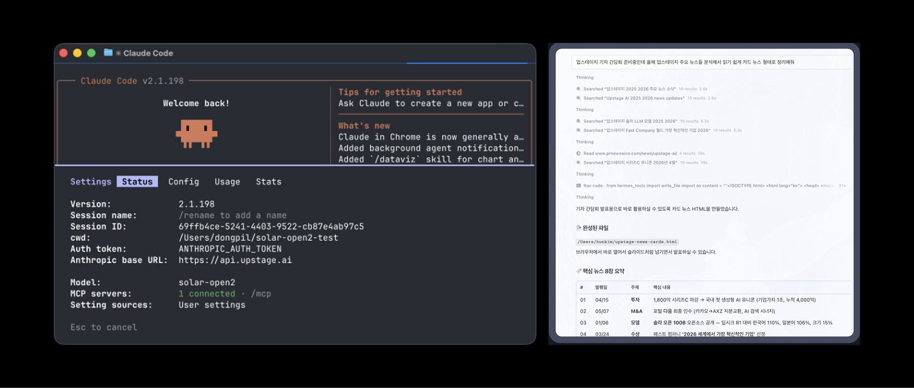
**이미지 캡션:** 이 이미지는 컴퓨터 화면을 캡처한 것으로, 왼쪽에는 "Claude Code"라는 제목의 애플리케이션 창이 있고 오른쪽에는 웹 브라우저 창이 열려 있습니다. 왼쪽 애플리케이션 창은 어두운 테마를 사용하며, 상단에는 빨간색, 녹색, 노란색, 파란색 점으로 이루어진 창 제어 버튼과 "Claude Code"라는 제목이 표시됩니다. 그 아래에는 "Claude Code v2.1.198"이라는 버전 정보와 "Welcome back!"이라는 환영 메시지가 보입니다. 중앙에는 픽셀 아트로 된 작은 캐릭터 이미지가 있습니다. 창의 하단 부분에는 "Settings", "Status", "Config", "Usage", "Stats" 탭이 있으며, 현재 "Status" 탭이 선택되어 있습니다. "Status" 탭 아래에는 "Version", "Session name", "Session ID", "cwd", "Auth token", "Anthropic base URL"과 같은 설정 정보가 나열되어 있고, 그 아래에는 "Model", "MCP servers", "Setting sources"와 같은 추가 정보가 표시됩니다. 오른쪽 웹 브라우저 창은 흰색 배경에 검은색 텍스트로 구성되어 있으며, 상단에는 "업스테이지 기자 간담회 준비중인데 올해 업스테이지 주요 뉴스를 분석해서 읽기 쉽게 카드뉴스 형태로 정리해줘"라는 한국어 텍스트가 있습니다. 그 아래에는 검색 결과와 "Thinking"이라는 텍스트가 반복적으로 나타나며, 일부는 링크로 표시됩니다. 더 아래에는 "완성된 파일"이라는 제목과 함께 파일 경로가 표시되고, "핵심 뉴스 8장 요약"이라는 제목 아래에는 표 형태로 발행일, 주체, 핵심 내용이 정리되어 있습니다. 전반적으로 개발 환경이나 정보 검색 및 요약과 관련된 상황을 보여주는 이미지입니다.
 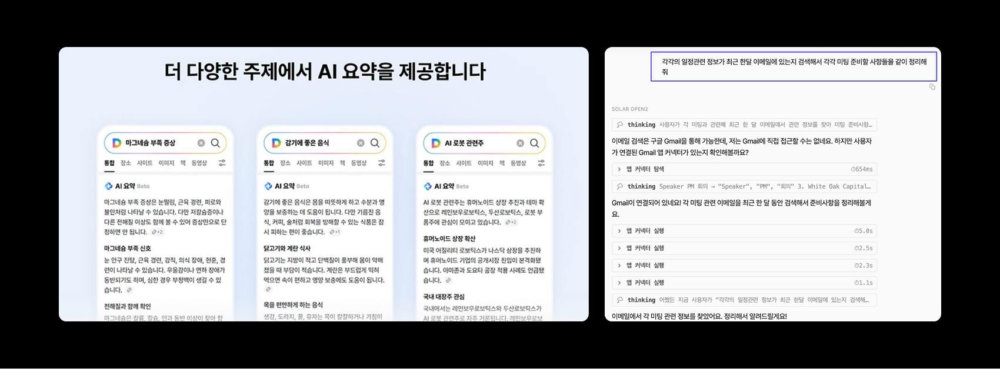
**이미지 캡션:** 화면 왼쪽에는 "더 다양한 주제에서 AI 요약을 제공합니다"라는 제목과 함께 세 개의 검색 결과 카드와 그 아래 AI 요약 내용이 표시되어 있습니다. 각 카드는 "마그네슘 부족 증상", "감기에 좋은 음식", "AI 로봇 관련주"라는 검색어를 포함하고 있으며, 검색 결과에는 통합, 장소, 사이트, 이미지, 책, 동영상 탭이 있습니다. 각 검색어 아래에는 "AI 요약"이라는 제목과 함께 해당 주제에 대한 요약 정보가 제공됩니다. 오른쪽 화면에는 "SOLAR OPENZ"라는 제목 아래 AI 챗봇과의 대화 내용이 표시됩니다. 사용자는 "각각의 일정관련 정보가 최근 한달 이메일에 있는지 검색해서 각각 미팅 준비할 사항들을 같이 정리해줘"라고 요청했고, AI는 Gmail 연동 여부를 확인하고 미팅 관련 이메일을 검색하여 준비 사항을 정리해주겠다고 답변합니다. 대화 내용에는 "thinking"이라는 사용자 이름과 함께 이메일 검색 및 정리 과정에 대한 설명이 포함되어 있으며, 각 검색 결과에 대한 응답 시간(예: 0654ms, 05.8s)도 표시됩니다. 전반적으로 AI 기반 정보 검색 및 요약, 그리고 챗봇을 통한 개인화된 정보 제공 기능을 보여주는 화면입니다.

### 7월 7일 (화) 07:17 · #독파모2 #SolarOpen2로 3D 게임 개발에 도전. Let's p…

#독파모2 #SolarOpen2로 3D 게임 개발에 도전. Let's play: https://solar-open2-archers.vercel.app/  

흩어진 과녁에 활을 쏘는 3D 게임을 Open2로 성공시켰습니다. 아쉽게도 원샷은 아니지만 (이 게임은 sonnet5 등으로도 여러 번 수정을 해야 하는 어려운 문제), 제가 좀 가이드를 해주니 멋진 게임이 되었습니다. https://github.com/hunkim/3D_Archers

클로드코드에 solar-pro2 custom 모델을 세팅하여 개발했습니다. 이번 주 금요일 판교에서 열리는 Solar Open Day에 오시면 세팅 방법 등 데모를 보여 드리겠습니다. https://luma.com/nv57vgh9

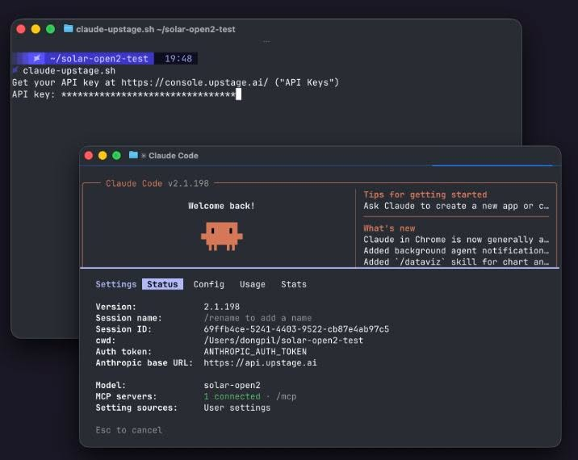
**이미지 캡션:** 어두운 배경의 컴퓨터 화면에는 두 개의 창이 열려 있으며, 위쪽 창은 터미널 창이고 아래쪽 창은 "Claude Code"라는 이름의 애플리케이션 창입니다. 터미널 창에는 "claude-upstage.sh ~/solar-open2-test"라는 텍스트와 함께 현재 시간 "19:48"이 표시되어 있으며, API 키를 얻는 방법에 대한 안내와 함께 API 키가 별표로 가려져 보입니다. 아래쪽 "Claude Code" 창에는 "Claude Code v2.1.198"이라는 버전 정보와 함께 "Welcome back!"이라는 메시지가 표시되어 있습니다. 창의 오른쪽에는 "Tips for getting started"와 "What's new"라는 제목 아래에 Claude 사용에 대한 팁과 최신 업데이트 내용이 나열되어 있습니다. 창 하단에는 "Settings", "Status", "Config", "Usage", "Stats" 탭이 있으며, 현재 "Status" 탭이 선택되어 버전, 세션 이름, 세션 ID, 현재 작업 디렉토리, 인증 토큰, Anthropic 기본 URL, 모델, MCP 서버, 설정 소스 등의 상세 정보가 표시됩니다. 화면에는 사람이 보이지 않으며, 전반적으로 코딩 또는 개발 환경을 보여주는 차분하고 기술적인 분위기입니다.

🎬 동영상 1개 (생략)

### 7월 7일 (화) 09:21 · 종속에서 벗어나 독자적인 AI 생태계의 중심이 되려는 한국의 국가적 프로…

종속에서 벗어나 독자적인 AI 생태계의 중심이 되려는 한국의 국가적 프로젝트를 소개하는 기사에 훌륭한 분들과 함께 소개되어 너무 기분 좋습니다. 특히 성킴, The Builder로 소개된 것이 마음에 듭니다. Upstage, 그리고 SolarLLM 잘 만들어보겠습니다. (기사 링크는 댓글에 있습니다.)

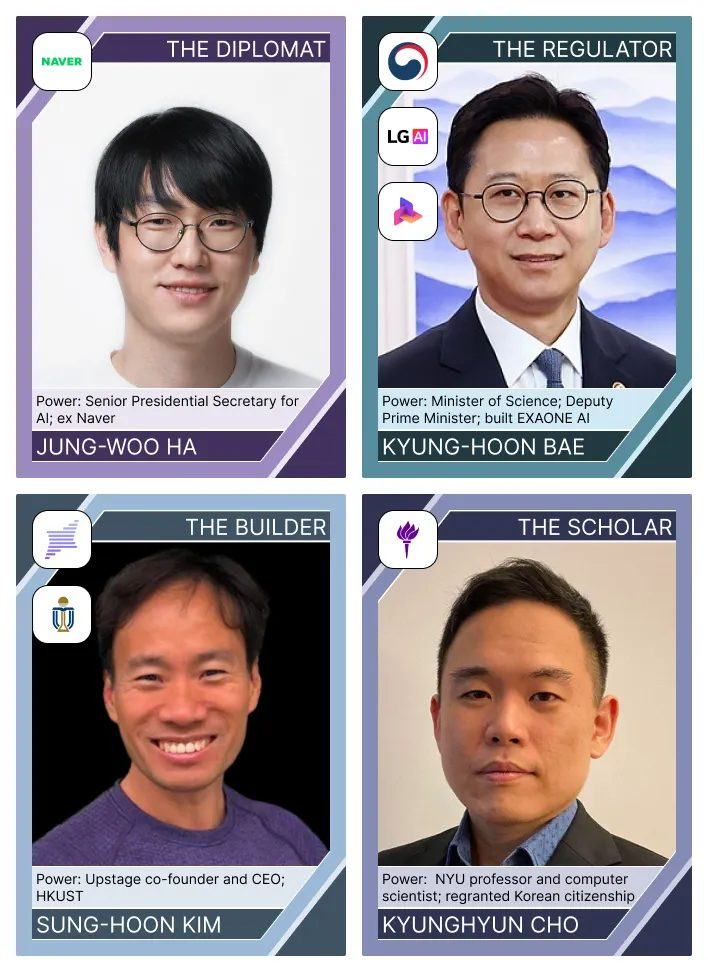
**이미지 캡션:** 이 이미지는 네 개의 카드 형식으로 구성되어 있으며, 각 카드에는 인물 사진과 함께 직책, 이름, 그리고 관련 로고가 포함되어 있습니다. 왼쪽 상단 카드는 "THE DIPLOMAT"라는 제목 아래, 네이버 로고와 함께 안경을 쓴 젊은 성인 남성이 웃는 표정으로 정면을 바라보고 있습니다. 이 남성의 이름은 JUNG-WOO HA이며, "Power: Senior Presidential Secretary for AI; ex Naver"라고 설명되어 있습니다. 왼쪽 하단 카드는 "THE BUILDER"라는 제목 아래, 두 개의 아이콘과 함께 활짝 웃는 중년 성인 남성이 정면을 바라보고 있습니다. 이 남성의 이름은 SUNG-HOON KIM이며, "Power: Upstage co-founder and CEO; HKUST"라고 설명되어 있습니다. 오른쪽 상단 카드는 "THE REGULATOR"라는 제목 아래, 대한민국 정부 로고, LG AI 로고, 그리고 또 다른 AI 관련 로고와 함께 정장을 입고 안경을 쓴 중년 성인 남성이 정면을 바라보고 있습니다. 이 남성의 이름은 KYUNG-HOON BAE이며, "Power: Minister of Science; Deputy Prime Minister; built EXAONE AI"라고 설명되어 있습니다. 오른쪽 하단 카드는 "THE SCHOLAR"라는 제목 아래, 보라색 불꽃 모양 아이콘과 함께 정장을 입은 성인 남성이 정면을 바라보고 있습니다. 이 남성의 이름은 KYUNGHYUN CHO이며, "Power: NYU professor and computer scientist; regranted Korean citizenship"라고 설명되어 있습니다. 각 카드는 고유한 색상 테두리와 배경 디자인을 가지고 있으며, 전체적으로 인물 소개 및 업적을 강조하는 듯한 분위기를 연출합니다.

### 7월 7일 (화) 09:21 · Sung Kim shared a link.

🔗 <https://nosian.substack.com/p/rift-valley-seouls-ai-homecoming>

### 7월 8일 (수) 07:20 · 누가 지능을 제어하는가?

누가 지능을 제어하는가?

"중국, 최첨단 AI 모델 해외 접근 제한 검토." 미국은 이미 지능을 제어하고 있는데, 중국도 곧 그렇게 할 것 같습니다.

Anthropic의 Mythos 접근을 막았다가 풀었고, Fable도 나왔다가 막힌 뒤, 훨씬 약해진 버전이 나왔습니다. Safeguard를 강화한? 안전한? 버전으로.

이제 중국도 같은 길을 걷고 있습니다. 알리바바의 Qwen, 바이트댄스의 Doubao, Z.ai의 GLM-5.2까지 — 자국 최정상 AI 모델의 해외 접근을 막으려 합니다.

이것은 매우 무서운 일입니다.

최고의 지능을 개발하는 나라는 최고의 인공지능을 마음껏 쓸 수 있지만, 그렇지 못한 나라는 통제된 2nd tier AI에 만족해야 합니다.

지능의 활용은 매우 중요합니다. 역사를 보면 사람의 지능을 잘 활용한 나라가 선진국이 되었습니다. 좋은 학교 시스템으로 인재를 키우고, 잘하는 사람에게 역할을 주는 공정한 사회 시스템이 중요한 이유입니다. 한국이 그 예입니다. 그래서 우리는 멋진 나라이고, 자랑스러운 나라입니다.

그런데 이제 사람의 지능보다 더 강력하고, 더 빠르게 발전하는 인공지능의 출현으로 이 인공지능이 국가 운명을 좌우하게 되었습니다.

최상급 AI를 자유롭게 쓰는 나라와 회사가 당연히 앞서나가게 됩니다. 제한된 버전, 안전장치가 과도하게 붙은 버전, '충분히 좋은' 버전에 만족하는 나라와 회사는 뒤처집니다. 그 격차가 한 번 벌어지면, 따라잡기가 어렵습니다.

그래서 우리의 강한 인공지능을 만들어야 합니다. Upstage가 앞장서겠습니다. 세계 최정상 수준의 AI를 향해 끝까지 달리겠습니다. 미중 중심으로 지능을 제어하는 시대에, 반드시 1·2강과 차이 없는 3강으로 따라 붙겠습니다.

누가 지능을 제어할수 있는지가 앞으로 승패를 영원히 가를 것입니다.

#독파모 #SolarOpen2 #AI #국가안보 #지능

**이미지 캡션:** 사진에는 중국의 시진핑 국가주석으로 보이는 성인 남성이 정면을 약간 벗어난 각도로 앉아 있다. 그는 60대 후반에서 70대 초반으로 추정되며, 검은색 머리카락에 흰머리가 섞여 있고, 둥근 얼굴형에 약간의 주름이 있다. 그는 짙은 파란색 정장에 붉은색 패턴의 넥타이를 매고 있으며, 표정은 차분하고 진지해 보인다. 배경에는 동양적인 문양이 그려진 벽과 식물 장식이 보이며, 조명은 부드럽게 연출되어 있다. 사진 하단에는 "시진핑 중국 국가주석/AFPBBNews=뉴스1"이라는 출처 표기와 함께 중국 정부가 최첨단 AI 모델에 대한 해외 접근을 제한하고 국가 안보를 강화하려는 움직임에 대한 기사 내용이 한국어로 작성되어 있다. 전체적으로 진지하고 공식적인 분위기를 풍긴다.
 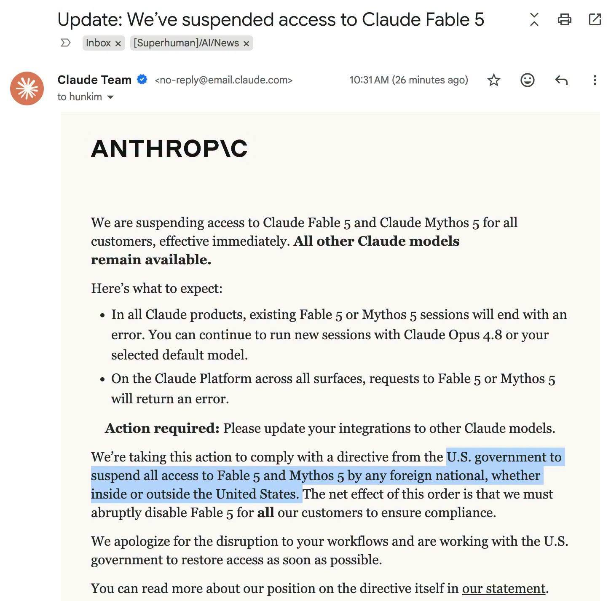
**이미지 캡션:** 이것은 Claude 팀에서 hunkim에게 보낸 이메일로, Claude Fable 5 및 Claude Mythos 5에 대한 접근이 즉시 중단되었음을 알립니다. 이메일은 Claude 팀의 로고와 함께 Claude 팀의 이름, 이메일 주소, 시간 정보가 표시됩니다. 본문에는 "ANTHROPIC"이라는 제목 아래, Claude Fable 5와 Claude Mythos 5에 대한 접근 중단 이유가 미국 정부의 지침 준수 때문이며, 이는 미국 내외의 모든 외국인에게 적용된다고 설명합니다. 또한, 이로 인한 영향을 설명하고 다른 Claude 모델로 업데이트할 것을 요청합니다. 이메일은 전반적으로 공식적이고 정보 전달에 초점을 맞춘 분위기이며, 사용자의 워크플로우에 대한 사과와 함께 문제 해결을 위해 노력하고 있음을 명시합니다.

### 7월 8일 (수) 07:20 · Sung Kim shared a link.

🔗 <https://www.mt.co.kr/world/2026/07/07/2026070720140329283>

### 7월 8일 (수) 13:25 · GeekNews "30 Papers - 일리야 서츠케버 추천 AI 핵심 …

GeekNews "30 Papers - 일리야 서츠케버 추천 AI 핵심 논문 목록 요약" 을 #SolarOpen2 로 모두 다운받아 읽고 요약한 슬라이드입니다. AI를 이해하기 좋은 기본 논문들로 일독을 권합니다. 

https://ai-papers-ppt.vercel.app/

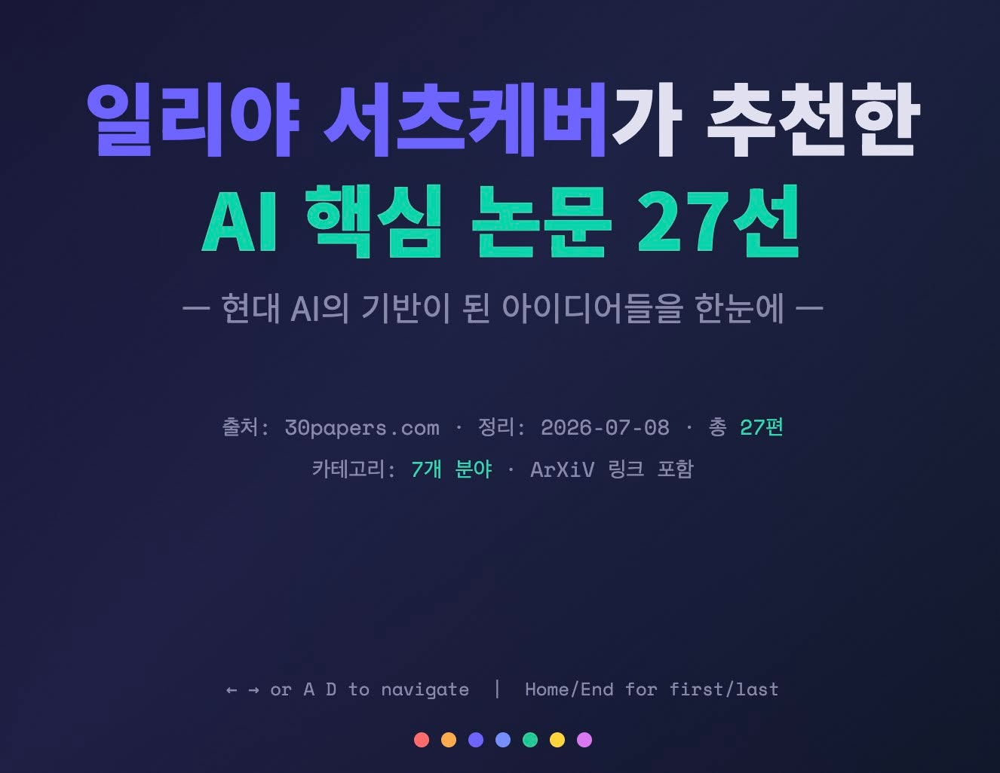
**이미지 캡션:** 이 이미지는 어두운 남색 배경에 텍스트가 표시된 디지털 화면을 보여줍니다. 화면 상단에는 보라색 글씨로 "일리아 서츠케버가 추천한"이라고 쓰여 있고, 그 아래에는 녹색 글씨로 "AI 핵심 논문 27선"이라고 쓰여 있습니다. 이 문구 아래에는 흰색 글씨로 "현대 AI의 기반이 된 아이디어들을 한눈에"라는 부제가 있습니다. 화면 중앙에는 출처, 정리 날짜, 총 논문 수, 카테고리, 그리고 ArXiv 링크 포함 여부에 대한 정보가 흰색 글씨로 나열되어 있습니다. 출처는 "30papers.com"이며, 정리는 "2026-07-08"이고, 총 논문 수는 "27편"입니다. 카테고리는 "7개 분야"이며, "ArXiv 링크 포함"이라고 명시되어 있습니다. 화면 하단에는 "← → or A D to navigate | Home/End for first/last"라는 안내 문구가 흰색 글씨로 표시되어 있으며, 그 아래에는 파란색, 주황색, 노란색, 보라색 점들이 나열되어 있습니다. 이 화면은 AI 분야의 중요한 논문들을 소개하는 프레젠테이션이나 웹페이지의 일부로 보이며, 정보 전달과 탐색을 위한 인터페이스를 제공합니다.
 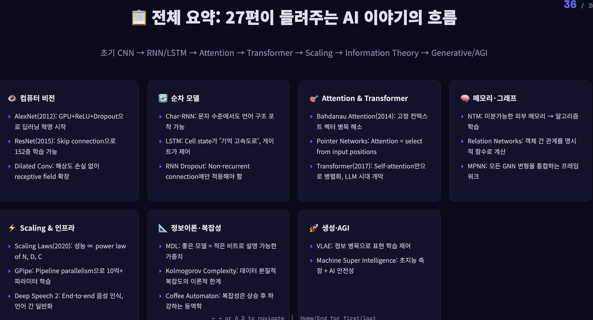
**이미지 캡션:** 이 이미지는 AI 발전의 흐름을 보여주는 요약 슬라이드로, 총 27편의 AI 관련 내용을 다루고 있으며, 컴퓨터 비전, 순차 모델, Attention & Transformer, 메모리·그래프, Scaling & 인프라, 정보이론·복잡성, 생성·AGI의 7가지 주요 카테고리로 나누어 설명하고 있습니다. 각 카테고리에는 해당 분야의 주요 기술이나 개념, 그리고 이를 발전시킨 대표적인 연구들이 나열되어 있습니다. 예를 들어, 컴퓨터 비전 분야에서는 AlexNet, ResNet, Dilated Conv가 언급되었고, 순차 모델 분야에서는 Char-RNN, LSTM, RNN Dropout이 소개되었습니다. Attention & Transformer 섹션에서는 Bahdanau Attention, Pointer Networks, Transformer가 다루어졌으며, 메모리·그래프 분야에서는 NTM, Relation Networks, MPNN이 설명되었습니다. Scaling & 인프라 섹션에서는 Scaling Laws, GPipe, Deep Speech 2가 포함되었고, 정보이론·복잡성 섹션에서는 MDL, Kolmogorov Complexity, Coffee Automaton이 제시되었습니다. 마지막으로 생성·AGI 섹션에서는 VLAE, Machine Super Intelligence가 언급되었습니다. 각 항목은 점선으로 구분된 박스 안에 나열되어 있으며, 전체적으로 어두운 배경에 밝은 글씨로 구성되어 있어 가독성이 높습니다. 슬라이드 상단에는 "전체 요약: 27편이 들려주는 AI 이야기의 흐름"이라는 제목과 함께 AI 발전의 큰 흐름을 나타내는 다이어그램이 표시되어 있습니다.
 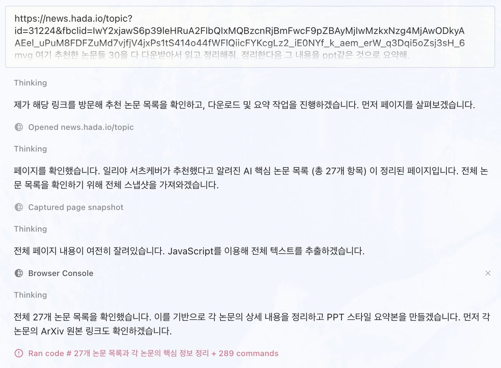
**이미지 캡션:** 이 이미지는 웹 페이지의 스크린샷으로, AI 연구자가 특정 주제에 대한 논문 목록을 수집하고 요약하는 과정을 보여줍니다. 화면 상단에는 "https://news.hada.io/topic?"으로 시작하는 URL이 표시되어 있으며, 그 아래에는 "여기 추천한 논문들 30을 다 다운받아서 읽고 정리해줘, 정리한다음 그 내용을 ppt같은 것으로 요약해."라는 한국어 텍스트가 있습니다. 이 텍스트는 AI에게 특정 작업을 지시하는 것으로 보입니다. 그 아래에는 "Thinking"이라는 제목과 함께 AI의 작업 진행 상황을 나타내는 여러 단계의 텍스트가 나열되어 있습니다. 첫 번째 단계에서는 "제가 해당 링크를 방문해 추천 논문 목록을 확인하고, 다운로드 및 요약 작업을 진행하겠습니다. 먼저 페이지를 살펴보겠습니다."라고 하며, "Opened news.hada.io/topic"이라는 표시가 있습니다. 두 번째 단계에서는 "페이지를 확인했습니다. 일리야 서츠케버가 추천했다고 알려진 AI 핵심 논문 목록 (총 27개 항목) 이 정리된 페이지입니다. 전체 논문 목록을 확인하기 위해 전체 스냅샷을 가져와겠습니다."라고 하며, "Captured page snapshot"이라는 표시가 있습니다. 세 번째 단계에서는 "전체 페이지 내용이 여전히 잘려있습니다. JavaScript를 이용해 전체 텍스트를 추출하겠습니다."라고 하며, "Browser Console"이라는 표시가 있습니다. 마지막 단계에서는 "전체 27개 논문 목록을 확인했습니다. 이를 기반으로 각 논문의 상세 내용을 정리하고 PPT 스타일 요약본을 만들겠습니다. 먼저 각 논문의 ArXiv 원본 링크도 확인하겠습니다."라고 하며, "Ran code #27개 논문 목록과 각 논문의 핵심 정보 정리 + 289 commands"라는 텍스트가 표시되어 있습니다. 전반적으로 이 이미지는 AI 기반의 정보 수집 및 요약 작업이 진행되는 과정을 시각적으로 보여주는 화면 캡처입니다.

### 7월 8일 (수) 13:31 · Sung Kim shared a link.

🔗 <https://ai-papers-ppt.vercel.app/>

### 7월 10일 (금) 21:42 · #SolarOpenDay 많은 분들 함께해주셔서 감사드립니다. 특히 So…

#SolarOpenDay 많은 분들 함께해주셔서 감사드립니다. 특히 Solar X Cerebras X Daum의 데모는 정말 멋졌습니다! 

SolarOpen2 Early Access 신청 해주시면 API를 한달간 무료로 제공해드립니다.  https://go.upstage.ai/4p6SsM0 (확인 후 순차적으로 권한 부여 예정)

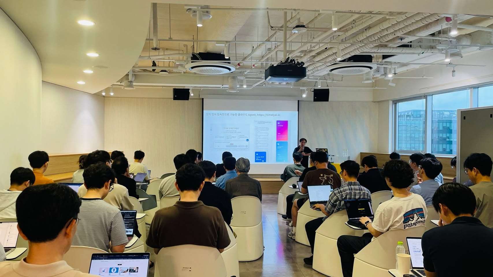
**이미지 캡션:** 이 사진은 강의실에서 열린 발표 또는 교육 세션을 보여줍니다. 화면에는 "설치 없이 접속 가능한 클라우드 Agent, https://timelyai.io"라는 문구와 함께 웹사이트 화면이 표시되어 있습니다. 발표자는 화면 앞에 서서 청중을 향해 설명하고 있으며, 그의 표정은 열정적으로 보입니다. 청중은 대부분 젊은 성인 남성으로, 노트북을 켜고 발표에 집중하거나 필기하는 모습입니다. 그들은 편안한 복장을 하고 있으며, 일부는 캐주얼한 티셔츠를 입고 있습니다. 강의실은 현대적인 디자인으로, 천장에는 조명과 환풍기, 프로젝터가 설치되어 있습니다. 창밖으로는 도시 풍경이 보이며, 전체적으로 차분하고 집중된 분위기입니다.
 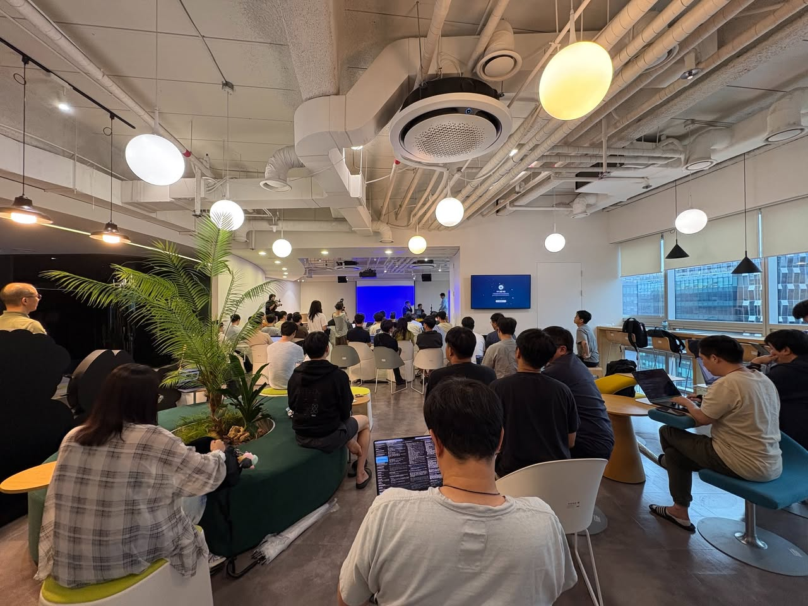
**이미지 캡션:** 이 사진은 현대적인 사무실 공간에서 열리는 강연 또는 발표회 장면을 담고 있으며, 많은 사람들이 좌석에 앉아 강연을 듣고 있다. 사진의 전경에는 회색 체크무늬 셔츠를 입은 성인 여성이 녹색 벤치형 좌석에 앉아 있으며, 그녀의 앞에는 야자수와 같은 식물이 놓여 있다. 그녀의 뒤로는 흰색 티셔츠를 입은 성인 남성이 노트북을 보고 있고, 그의 옆에는 검은색 후드티를 입은 성인 남성이 앉아 있다. 사진의 중앙에는 여러 명의 성인 남성과 여성이 좌석에 앉아 있으며, 대부분 노트북을 사용하거나 강연을 듣고 있다. 일부 사람들은 편안한 복장을 하고 있으며, 표정은 대체로 집중하거나 편안해 보인다. 배경에는 파란색 스크린이 설치되어 있고, 그 앞에는 여러 명의 사람들이 서서 발표를 듣고 있다. 천장에는 원형 조명과 에어컨 장치가 설치되어 있으며, 벽에는 창문이 있어 외부 풍경이 보인다. 전체적으로 차분하고 집중된 분위기이며, 기술 관련 행사나 세미나가 진행되는 듯한 느낌을 준다.
 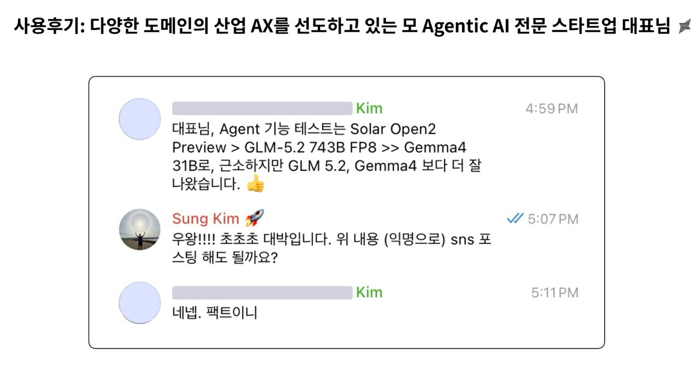
**이미지 캡션:** 화면 상단에는 "사용후기: 다양한 도메인의 산업 AX를 선도하고 있는 모 Agentic AI 전문 스타트업 대표님"이라는 제목이 보이며, 그 아래에는 메신저 대화창이 나타납니다. 대화창 안에는 세 개의 메시지가 순서대로 표시되어 있습니다. 첫 번째 메시지는 "Kim"이라는 이름의 사용자가 보낸 것으로, "대표님, Agent 기능 테스트는 Solar Open2 Preview > GLM-5.2 743B FP8 >> Gemma4 31B로, 근소하지만 GLM 5.2, Gemma4 보다 더 잘 나왔습니다. 👍"라는 내용과 함께 오후 4시 59분이라는 시간이 표시되어 있습니다. 이 사용자의 프로필 사진은 원형의 파란색 아이콘입니다. 두 번째 메시지는 "Sung Kim"이라는 이름의 사용자가 보낸 것으로, "우왕!!!! 초초초 대박입니다. 위 내용 (익명으로) sns 포스팅 해도 될까요?"라는 내용과 함께 로켓 이모티콘이 포함되어 있으며, 오후 5시 7분이라는 시간이 표시되어 있습니다. 이 사용자의 프로필 사진은 원형 안에 사람이 풍선을 들고 서 있는 모습입니다. 세 번째 메시지는 "Kim"이라는 이름의 사용자가 보낸 것으로, "네넵. 팩트이니"라는 내용과 함께 오후 5시 11분이라는 시간이 표시되어 있습니다. 이 사용자의 프로필 사진 역시 원형의 파란색 아이콘입니다. 전반적으로 긍정적이고 활기찬 분위기의 대화가 오가고 있으며, 기술 테스트 결과에 대한 공유와 이를 바탕으로 한 소셜 미디어 포스팅에 대한 문의가 이루어지고 있습니다.
 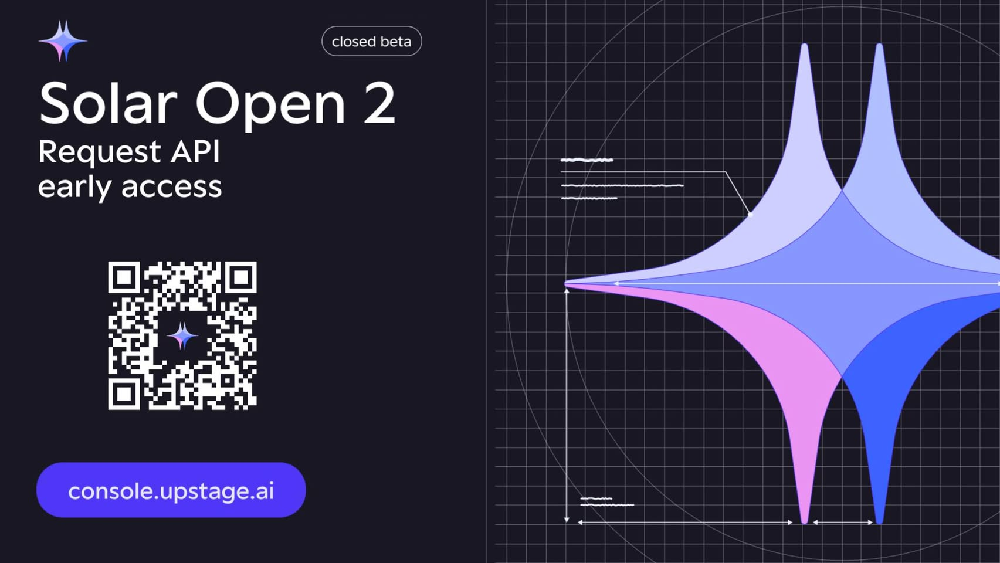
**이미지 캡션:** 이 이미지는 어두운 배경에 "Solar Open 2"라는 제목과 "Request API early access"라는 문구가 흰색으로 표시되어 있으며, 왼쪽 상단에는 파란색과 보라색 별 모양의 로고가 있습니다. 그 아래에는 QR 코드가 있고, QR 코드 아래에는 보라색 버튼에 "console.upstage.ai"라는 텍스트가 있습니다. 오른쪽에는 격자무늬 배경에 여러 색상의 곡선 그래프가 그려져 있으며, 그래프는 두 개의 봉우리 모양으로 대칭을 이루고 있습니다. 이미지 상단에는 "closed beta"라는 작은 타원형 텍스트가 있습니다. 전체적으로 기술적인 느낌을 주는 디자인이며, API 조기 액세스 신청을 유도하는 홍보 이미지로 보입니다.

🎬 동영상 1개 (생략)

### 7월 11일 (토) 06:36 · #Solar가 Cerebras에 올라간 첫번째 모델이 되었습니다. 이를 …

#Solar가 Cerebras에 올라간 첫번째 모델이 되었습니다. 이를 통해 더 빠른 Ultra-Fast AI서비스를 Daum과 함께 만들어 보겠습니다.

https://www.cerebras.ai/blog/cerebras-and-upstage-bring-ultra-fast-ai-to-korea

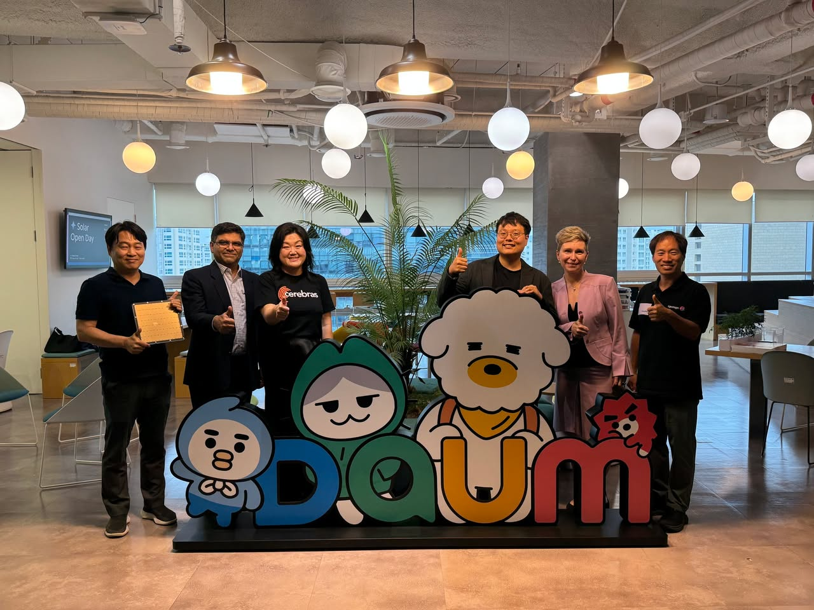
**이미지 캡션:** 이 사진은 현대적인 사무실 공간에서 열린 행사의 모습을 담고 있습니다. 사진 중앙에는 "DAUM"이라는 글자와 함께 귀여운 캐릭터 조형물이 배치되어 있습니다. 왼쪽부터 성인 남성 두 명, 성인 여성 한 명, 그리고 다시 성인 남성 한 명이 서 있습니다. 첫 번째 남성은 검은색 상의와 바지를 입고 있으며, 손에는 네모난 판을 들고 있습니다. 두 번째 남성은 검은색 정장에 흰색 셔츠를 입고 엄지손가락을 치켜세우고 있습니다. 세 번째 인물인 여성은 분홍색 재킷과 바지를 입고 있으며, 목걸이를 착용하고 있습니다. 네 번째 남성은 검은색 상의와 카키색 바지를 입고 있으며, 역시 엄지손가락을 치켜세우고 있습니다. 이들 앞에는 강아지 모양의 캐릭터와 두 개의 작은 캐릭터 조형물이 놓여 있습니다. 배경에는 큰 창문과 함께 도시 풍경이 보이며, 천장에는 여러 개의 조명이 설치되어 있습니다. 전체적으로 밝고 긍정적인 분위기이며, 행사의 성공적인 개최를 축하하는 듯한 모습입니다. 왼쪽 벽에는 "Solar Open Day"라는 문구가 적힌 화면이 보입니다.
 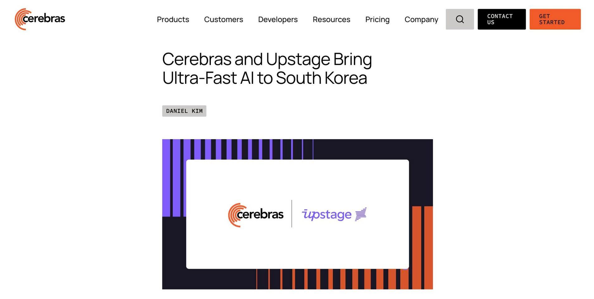
**이미지 캡션:** 화면 상단에는 'cerebras' 로고와 함께 'Products', 'Customers', 'Developers', 'Resources', 'Pricing', 'Company' 메뉴가 보이며, 검색 아이콘, 'CONTACT US', 'GET STARTED' 버튼이 있다. 중앙에는 "Cerebras and Upstage Bring Ultra-Fast AI to South Korea"라는 제목이 있고, 그 아래 'DANIEL KIM'이라는 이름이 표시되어 있다. 제목 아래에는 보라색과 검은색, 주황색 줄무늬 패턴으로 둘러싸인 흰색 사각형 안에 'cerebras'와 'upstage' 로고가 나란히 배치되어 있다. 이 이미지는 기술 관련 웹사이트의 일부로 보이며, 인공지능 분야의 협력을 알리는 내용이다.

🎬 동영상 1개 (생략)

### 7월 11일 (토) 12:54 · #만달러크래딧 #SolarPro4 곧 출시! SolarOpen2의 Age…

#만달러크래딧 #SolarPro4 곧 출시! SolarOpen2의 Agent성능에 많은 분들이 칭찬을 주시는데요. 저희가 더더더 성능을 높인 SolarPro4가 8월초에 출시 됩니다. 이 멋진 Solar-Open2/Pro4를 사용해서 더 멋진 서비스를 만드실 분들을 초대하고 있습니다. 7월은 무료로 Open2 모델을 사용할수 있으며 좋은 서비스를 만드시는 5팀을 선발하여 Solar-Pro4 등에 사용할수 있는 $10,000의 크래딧을 드립니다. 

함께 좋은 서비스, 모두를 위한 AI 서비스 만들어요. 선지원, 후고민!

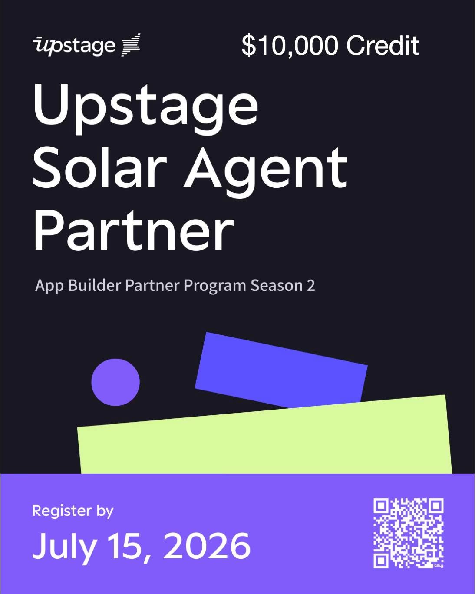
**이미지 캡션:** 이 이미지는 Upstage Solar Agent Partner 프로그램에 대한 홍보 자료로, $10,000 크레딧을 제공하며 App Builder Partner Program Season 2의 일부임을 알리고 있습니다. 배경은 어두운 보라색이며, 중앙에는 "Upstage Solar Agent Partner"라는 흰색 글자가 크고 굵게 쓰여 있고, 그 아래에는 "App Builder Partner Program Season 2"라는 작은 흰색 글자가 있습니다. 상단 좌측에는 "upstage" 로고가, 우측 상단에는 "$10,000 Credit"이라는 문구가 있습니다. 이미지 중앙에는 추상적인 기하학적 도형들이 배치되어 있는데, 보라색 원, 파란색 직사각형, 연두색 사각형이 서로 겹쳐져 있습니다. 하단에는 보라색 배경에 "Register by July 15, 2026"이라는 문구와 함께 QR 코드가 포함되어 있습니다. 이 자료는 프로그램 참여를 독려하는 정보성 및 홍보성 성격을 띠고 있으며, 명확한 마감일을 제시하여 참여를 유도하고 있습니다.
 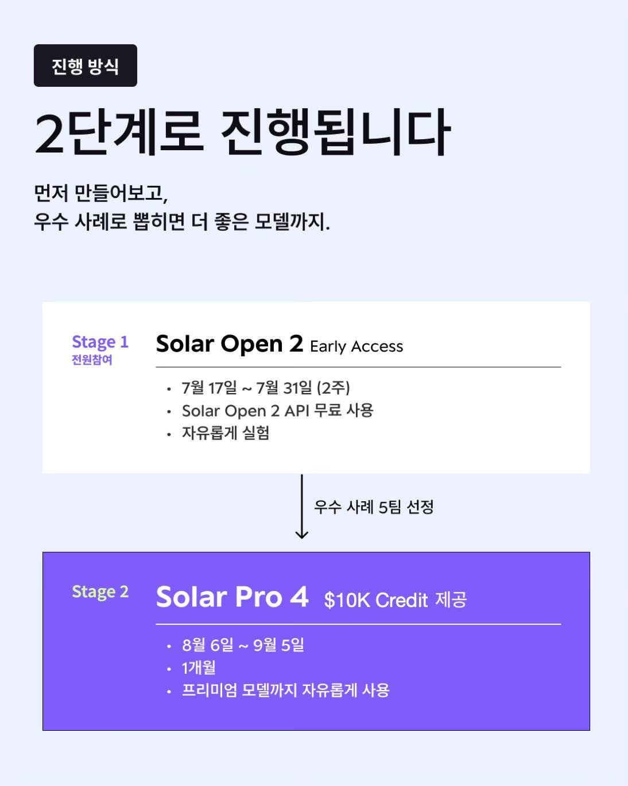
**이미지 캡션:** 이 이미지는 두 단계로 진행되는 프로그램의 진행 방식을 설명하는 그래픽입니다. 상단에는 검은색 배경에 흰색 글씨로 "진행 방식"이라는 제목과 "2단계로 진행됩니다"라는 큰 글씨가 있습니다. 그 아래에는 "먼저 만들어보고, 우수 사례로 뽑히면 더 좋은 모델까지."라는 설명 문구가 있습니다. 화면 중앙에는 연한 보라색 배경의 상자가 있고, 왼쪽에는 "Stage 1"이라는 글자와 "전원참여"라는 문구가 있습니다. 이 상자 안에는 "Solar Open 2 Early Access"라는 제목과 함께 7월 17일부터 7월 31일까지 2주간 진행되며, Solar Open 2 API 무료 사용 및 자유로운 실험이 가능하다는 내용이 점선으로 구분되어 있습니다. Stage 1 상자 아래에는 화살표와 함께 "우수 사례 5팀 선정"이라는 문구가 있습니다. 가장 하단에는 더 진한 보라색 배경의 상자가 있고, 왼쪽에는 "Stage 2"라는 글자가 있습니다. 이 상자 안에는 "Solar Pro 4 $10K Credit 제공"이라는 제목과 함께 8월 6일부터 9월 5일까지 1개월간 진행되며, 프리미엄 모델까지 자유롭게 사용 가능하다는 내용이 점선으로 구분되어 있습니다. 전체적으로 깔끔하고 정보 전달에 초점을 맞춘 디자인입니다.
 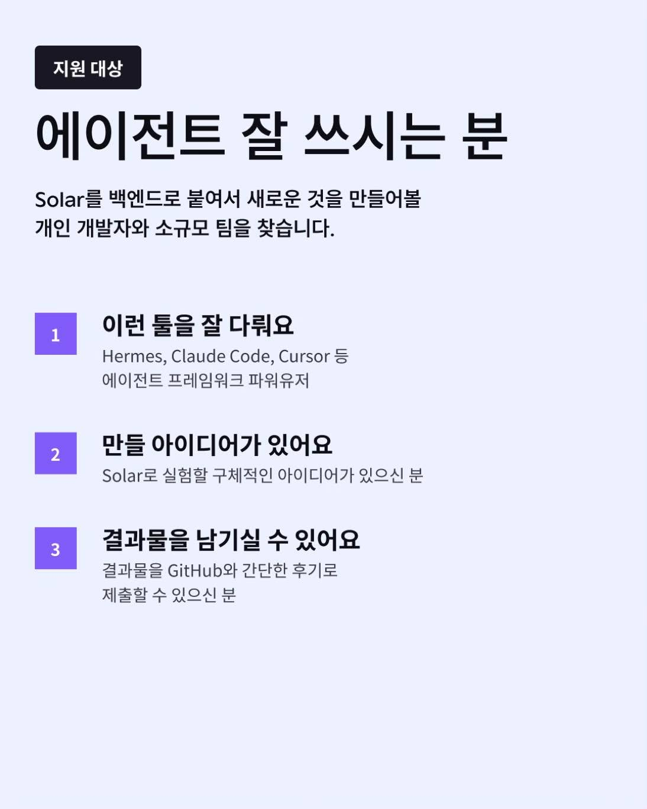
**이미지 캡션:** 이 이미지는 채용 공고의 일부로, "에이전트 잘 쓰시는 분"이라는 제목 아래 지원 대상에 대한 설명이 담겨 있습니다. 배경은 연한 보라색이며, 텍스트는 흰색과 검은색으로 구성되어 있습니다. 상단에는 "지원 대상"이라는 검은색 직사각형 태그가 있습니다. 그 아래에는 "에이전트 잘 쓰시는 분"이라는 큰 글씨가 검은색으로 쓰여 있고, 그 밑에는 "Solar를 백엔드로 붙여서 새로운 것을 만들어볼 개인 개발자와 소규모 팀을 찾습니다."라는 설명이 검은색으로 적혀 있습니다. 이어서 세 가지 항목이 번호와 함께 제시됩니다. 첫 번째 항목은 "이런 툴을 잘 다뤄요"라는 제목과 함께 "Hermes, Claude Code, Cursor 등 에이전트 프레임워크 파워유저"라는 설명이 있습니다. 두 번째 항목은 "만들 아이디어가 있어요"라는 제목과 "Solar로 실험할 구체적인 아이디어가 있으신 분"이라는 설명이 있습니다. 세 번째 항목은 "결과물을 남기실 수 있어요"라는 제목과 "결과물을 GitHub와 간단한 후기로 제출할 수 있으신 분"이라는 설명이 있습니다. 각 항목의 번호는 보라색 사각형 안에 흰색 숫자로 표시되어 있습니다. 전체적으로 깔끔하고 정보 전달에 집중한 디자인입니다.
 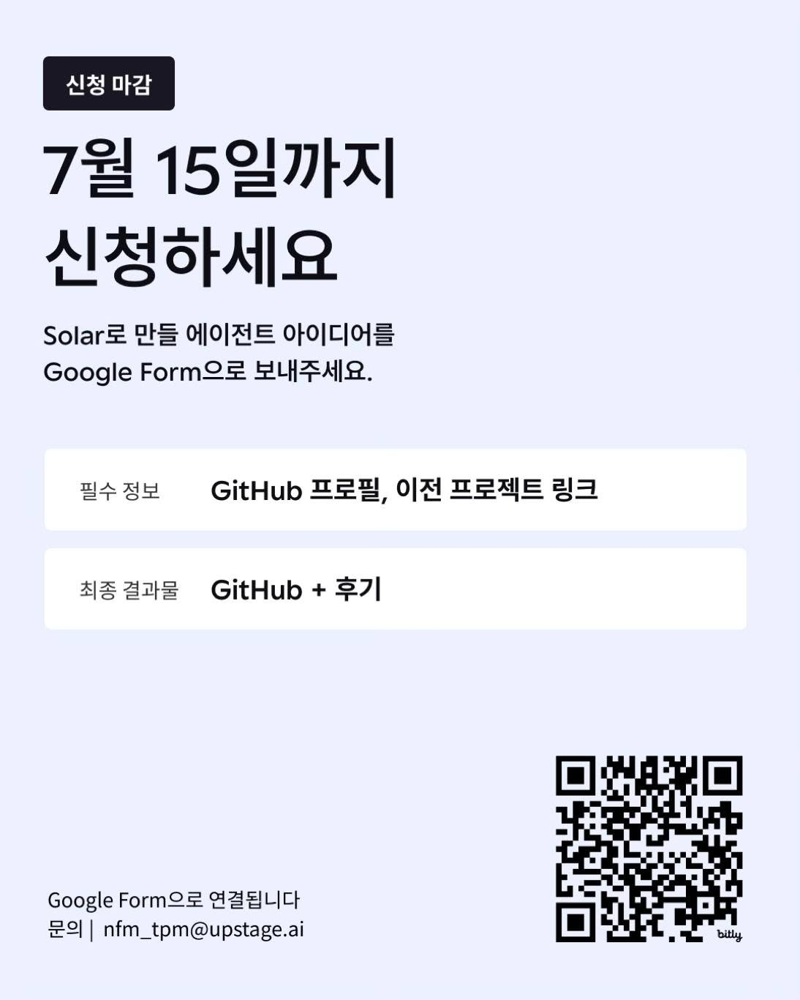
**이미지 캡션:** 이 이미지는 흰색 배경에 검은색과 주황색 글씨로 작성된 공지사항입니다. 상단에는 "신청 마감"이라는 검은색 직사각형 안에 흰색 글씨로 쓰여 있으며, 그 아래에는 "7월 15일까지 신청하세요"라는 큰 글씨가 있습니다. 이어서 "Solar로 만든 에어전트 아이디어를 Google Form으로 보내주세요."라는 안내 문구가 있습니다. 그 아래에는 두 개의 흰색 직사각형이 있으며, 첫 번째 직사각형에는 "필수 정보"와 "GitHub 프로필, 이전 프로젝트 링크"라고 쓰여 있고, 두 번째 직사각형에는 "최종 결과물"과 "GitHub + 후기"라고 쓰여 있습니다. 하단에는 "Google Form으로 연결됩니다"라는 문구와 함께 문의처 이메일 주소 "nfm_tpm@upstage.ai"가 표시되어 있습니다. 오른쪽 하단에는 QR 코드가 있으며, QR 코드 아래에는 "bilty"라는 작은 글씨가 있습니다. 전체적으로 간결하고 명확한 디자인으로, 신청 마감일과 제출해야 할 정보, 그리고 문의처를 안내하는 정보성 공지입니다.

### 7월 12일 (일) 09:05 · #buseybench 라는 재미있는 벤치마크로 #SolarOpen2 테스…

#buseybench 라는 재미있는 벤치마크로 #SolarOpen2 테스트 해보았습니다. Gary Busey의 얼굴을 SVG로 그린다음 얼마나 잘 그렸는지 LLM Judge로 평가하는 것인데요. Solar Open2는 얼굴조합을 못했던 #SolarPro3 에 비해 큰 발전을 이루었습니다. 다른 SOTA 모델들과 함께보는 재미도 있습니다.

Prompt: Create a standalone SVG portrait of Gary Busey's face. Output only valid SVG markup. Do not wrap the SVG in Markdown fences. Do not use external images, links, scripts, CSS imports, or remote assets. Make the portrait recognizable as Gary Busey using vector shapes only. Include face shape, hair, eyes, eyebrows, nose, mouth, teeth, and expressive features. Use a 1024 by 1024 viewBox. Use detailed SVG-native vector techniques: layered paths, gradients, masks, clipping paths, shadows, highlights, blur filters, opacity, and fine strokes. The portrait should be as recognizable and detailed as possible.

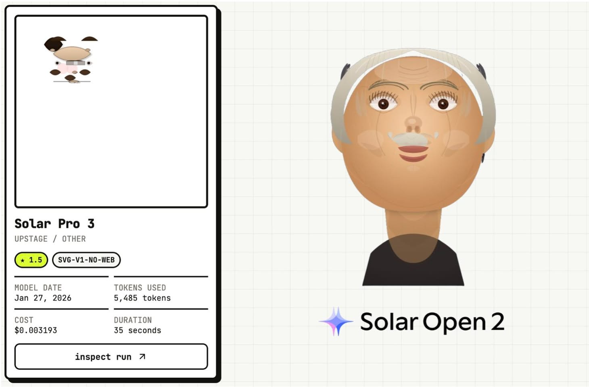
**이미지 캡션:** 화면 왼쪽에는 흰색 테두리 안에 검은색 테두리가 있는 카드 형태의 인터페이스가 보이며, 카드 상단에는 귀여운 소 그림이 그려져 있고, 그 아래에는 "Solar Pro 3"라는 제목과 "UPSTAGE / OTHER"라는 부제가 있다. 또한, "1.5"라는 숫자와 "SVG-V1-NO-WEB"이라는 텍스트가 함께 표시되어 있으며, "MODEL DATE"는 "Jan 27, 2026", "TOKENS USED"는 "5,485 tokens", "COST"는 "$0.003193", "DURATION"은 "35 seconds"라고 기재되어 있다. 카드 하단에는 "inspect run"이라는 버튼이 있다. 화면 오른쪽에는 격자무늬 배경에 둥근 얼굴을 가진 캐릭터가 보인다. 이 캐릭터는 흰색 머리띠를 하고 있으며, 주름진 이마, 큰 눈, 콧수염, 붉은 입술을 가지고 있어 노인 남성으로 추정된다. 검은색 상의를 입고 있으며, 표정은 약간 미소를 짓고 있는 듯하다. 캐릭터 아래에는 반짝이는 보라색과 파란색 별 모양 아이콘과 함께 "Solar Open 2"라는 텍스트가 쓰여 있다. 전체적으로 디지털 인터페이스와 캐릭터 이미지가 함께 표시된 화면으로, 어떤 종류의 프로그램이나 서비스의 일부로 보인다.
 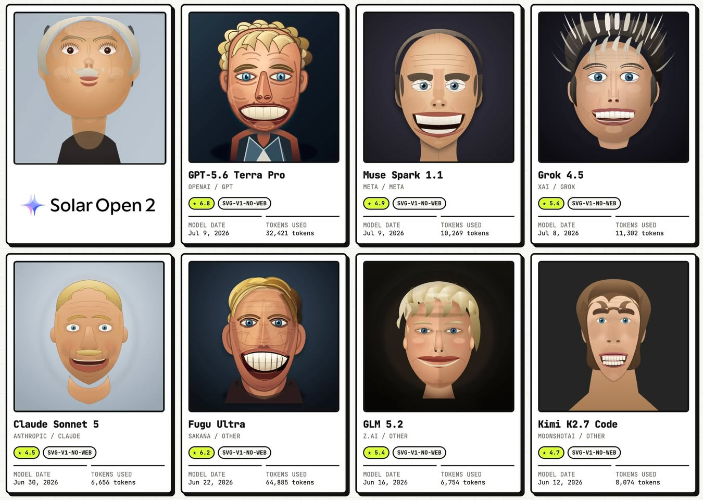
**이미지 캡션:** 이 이미지는 8개의 카드 형식으로 구성된 디지털 아트워크로, 각 카드에는 독특한 스타일의 3D 렌더링된 인물 초상화와 관련 정보가 포함되어 있습니다. 왼쪽 상단의 첫 번째 카드에는 "Solar Open 2"라는 제목과 함께 흰색 머리카락과 옅은 갈색 피부를 가진 중년 여성으로 보이는 인물이 그려져 있으며, 옅은 미소를 띠고 있습니다. 나머지 7개의 카드는 모두 성인 남성으로 보이는 인물들을 특징으로 합니다. 두 번째 카드에는 금발 머리에 파란 눈을 가진 남성이 입을 크게 벌리고 웃는 모습이 담겨 있으며, "GPT-5.6 Terra Pro"라는 제목과 함께 모델 날짜, 토큰 사용량 등의 정보가 표시되어 있습니다. 세 번째 카드에는 대머리에 옅은 갈색 피부를 가진 남성이 입을 크게 벌리고 웃는 모습이 "Muse Spark 1.1"이라는 제목과 함께 나타납니다. 네 번째 카드에는 삐죽삐죽한 검은 머리에 파란 눈을 가진 남성이 입을 크게 벌리고 웃는 모습이 "Grok 4.5"라는 제목과 함께 보입니다. 다섯 번째 카드에는 금발 머리에 파란 눈을 가진 남성이 입을 크게 벌리고 웃는 모습이 "Claude Sonnet 5"라는 제목과 함께 그려져 있습니다. 여섯 번째 카드에는 금발 머리에 파란 눈을 가진 남성이 입을 크게 벌리고 웃는 모습이 "Fugu Ultra"라는 제목과 함께 나타납니다. 일곱 번째 카드에는 금발 머리에 파란 눈을 가진 남성이 입을 살짝 벌리고 있는 모습이 "GLM 5.2"라는 제목과 함께 보입니다. 마지막 여덟 번째 카드에는 옅은 갈색 머리에 파란 눈을 가진 남성이 입을 살짝 벌리고 있는 모습이 "Kimi K2.7 Code"라는 제목과 함께 그려져 있습니다. 각 카드에는 인물의 이름, 개발사 또는 관련 태그, 모델 날짜, 사용된 토큰 수 등의 메타데이터가 포함되어 있으며, 대부분의 인물들은 과장된 표정을 짓고 있어 독특하고 약간은 기괴한 분위기를 자아냅니다. 배경은 각 카드마다 어두운 색조로 통일되어 있으며, 전체적으로 디지털 아트, 인공지능 모델 또는 가상 캐릭터를 홍보하는 듯한 느낌을 줍니다.

### 7월 12일 (일) 09:06 · Sung Kim shared a link.

🔗 <https://www.buseybench.com/methodology>

### 7월 13일 (월) 09:53 · 제품을 만들면서 가장 행복한 순간은 사용해보시고 "좋더라" 말씀 주시는 …

제품을 만들면서 가장 행복한 순간은 사용해보시고 "좋더라" 말씀 주시는 것입니다. #SolarOpen2 정말 좋습니다. Early Access 신청 해주시면 API를 한달간 무료로 제공해드립니다.  https://go.upstage.ai/4p6SsM0 (확인 후 순차적으로 권한 부여 예정)

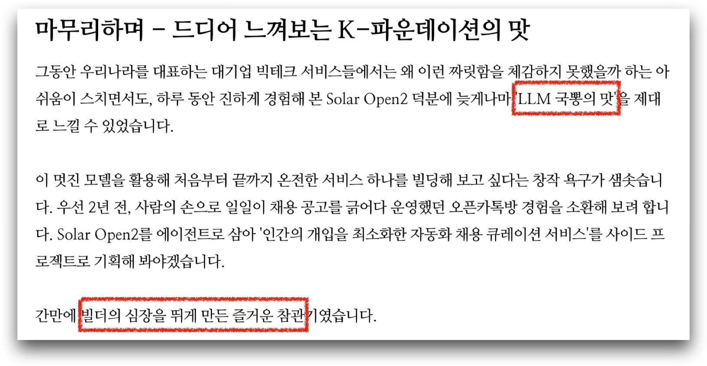
**이미지 캡션:** 이 사진은 흰색 배경에 검은색 글씨로 된 한국어 텍스트 문서의 일부를 보여줍니다. 텍스트는 두 개의 단락으로 나뉘어 있으며, 첫 번째 단락은 "마무리하며 - 드디어 느껴보는 K-파운데이션의 맛"이라는 제목으로 시작합니다. 이 단락은 한국의 빅테크 서비스에 대한 아쉬움과 Solar Open2라는 서비스를 통해 LLM의 가능성을 느꼈다는 내용을 담고 있습니다. 두 번째 단락은 Solar Open2를 활용하여 채용 큐레이션 서비스를 개발하고 싶다는 아이디어를 설명하며, 과거 오픈카톡방에서의 경험을 언급합니다. 마지막 문장은 "간만에 빌더의 심장을 뛰게 만든 즐거운 참관기였습니다."로 마무리됩니다. 텍스트에는 "LLM 국뽕의 맛"이라는 문구가 빨간색 테두리로 강조되어 있습니다. 특별히 보이는 인물이나 사물은 없으며, 문서의 내용으로 보아 IT 기술, 특히 인공지능과 관련된 글임을 알 수 있습니다. 전체적으로 전문적이고 정보 전달에 초점을 맞춘 분위기입니다.
 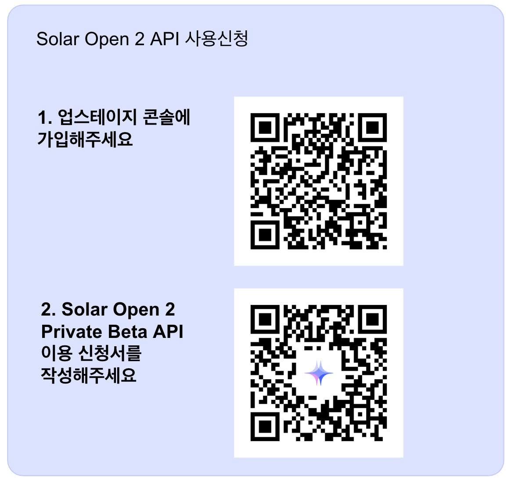
**이미지 캡션:** 이 이미지는 "Solar Open 2 API 사용 신청"이라는 제목 아래 두 가지 신청 절차를 안내하는 화면입니다. 첫 번째 절차는 "1. 업스테이지 콘솔에 가입해주세요"이며, 이에 해당하는 QR 코드가 오른쪽에 표시되어 있습니다. 두 번째 절차는 "2. Solar Open 2 Private Beta API 이용 신청서를 작성해주세요"이며, 이 역시 오른쪽에 해당하는 QR 코드가 있습니다. 두 번째 QR 코드에는 작은 보라색 별 모양 아이콘이 추가되어 있습니다. 화면은 연한 보라색 배경에 흰색 텍스트와 검은색 QR 코드로 구성되어 있으며, 전체적으로 깔끔하고 정보 전달에 집중된 디자인입니다. 사람이나 특정 장소, 사물은 보이지 않으며, 텍스트 외에는 QR 코드라는 디지털 정보만 포함되어 있습니다. 분위기는 안내 및 정보 제공 목적에 맞게 명확하고 간결합니다.

### 7월 13일 (월) 09:54 · Sung Kim shared a link.

🔗 <https://m.blog.naver.com/rwanda/224343695863>

### 7월 13일 (월) 14:31 · Daum AI 서비스에 #SolarLLM 이 들어갔습니다. 그리고 #So…

Daum AI 서비스에 #SolarLLM 이 들어갔습니다. 그리고 #SolarLLM은 Furiosa RNGD에서 돌아 갑니다. #독파모 모델이 국산 NPU에서 돌아가면서 이를 통해 Daum 실제 서비스를 하고 있는것입니다. 정말 멋진일인데요. 어떻게   서비스를 만들고 있는지 Furiosa사 백준호 대표님,  Daum Keonsu Lee 대표님을 모시고 이야기를 나눕니다.

유투브 생중계 누구에게나 열려있으니 오셔서 보시고 질문도 많이 남겨주셔요. 오시는 분들 반갑게 뵙겠습니다. 7월 15일 오전 10시 기억해주셔요!

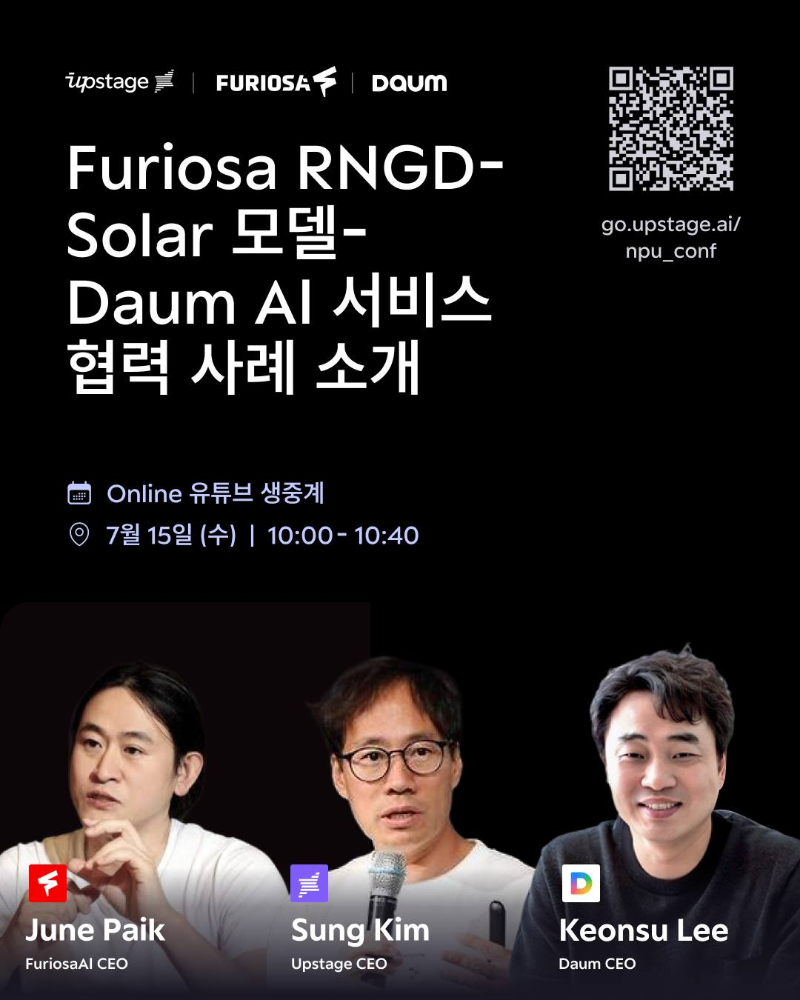
**이미지 캡션:** 이 포스터는 Upstage, Furiosa, Daum 로고와 함께 "Furiosa RNGD-Solar 모델-Daum AI 서비스 협력 사례 소개"라는 제목을 보여줍니다. 행사는 온라인 유튜브 생중계로 7월 15일 토요일 오전 10시부터 10시 40분까지 진행됩니다. 포스터 하단에는 세 명의 남성이 등장하며, 왼쪽부터 June Paik (FuriosaAI CEO), Sung Kim (Upstage CEO), Keonsu Lee (Daum CEO)로 소개됩니다. June Paik은 흰색 티셔츠를 입고 손을 모으고 있으며, Sung Kim은 안경을 쓰고 마이크에 대고 이야기하고 있으며, Keonsu Lee는 검은색 상의를 입고 웃고 있습니다. 배경은 검은색이며, 오른쪽 상단에는 QR 코드와 웹사이트 주소가 있습니다. 전체적으로 행사를 알리는 정보성 포스터입니다.
 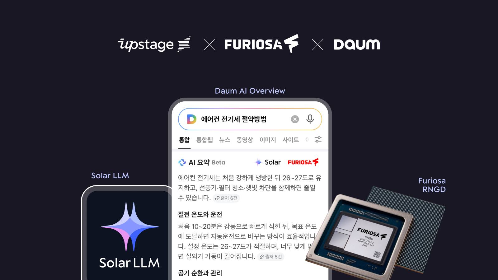
**이미지 캡션:** 어두운 배경에 Upstage, Furiosa, Daum 로고가 나란히 배치되어 있으며, 중앙에는 Daum AI Overview라는 제목과 함께 스마트폰 화면이 보인다. 스마트폰 화면에는 검색창에 '에어컨 전기세 절약방법'이라고 입력되어 있고, 그 아래에는 'AI 요약 Beta'와 'Solar FURIOA'라는 문구가 함께 표시된다. 검색 결과로는 '에어컨 전기세는 처음 강하게 냉방한 뒤 26~27도로 유지하고, 선풍기·필터 청소·햇빛 차단을 함께하면 줄일 수 있습니다.'라는 내용과 '절전 온도와 운전'에 대한 설명이 보인다. 화면 왼쪽에는 'Solar LLM'이라는 문구와 함께 별 모양의 아이콘이 있고, 오른쪽 하단에는 Furiosa RNGO라고 적힌 반도체 칩이 두 개 놓여 있다. 전체적으로 기술과 AI 서비스에 대한 홍보 이미지로 보인다.

### 7월 15일 (수) 06:31 · Upstage #SolarLLM이 #1 에이전트 플랫폼인 #Hermes에…

Upstage #SolarLLM이 #1 에이전트 플랫폼인 #Hermes에 입점했습니다! 이제 (1) Hermes를 다운받고, (2) Upstage API 키를 입력하고, (3) #독파모 2차 모델인 #SolarOpen2를 선택하시면 Hermes에서 바로 슬기로운 에이전트 생활이 가능합니다.

#1 에이전트 Hermes, SolarOpen2랑 같이 사용해보셔요!

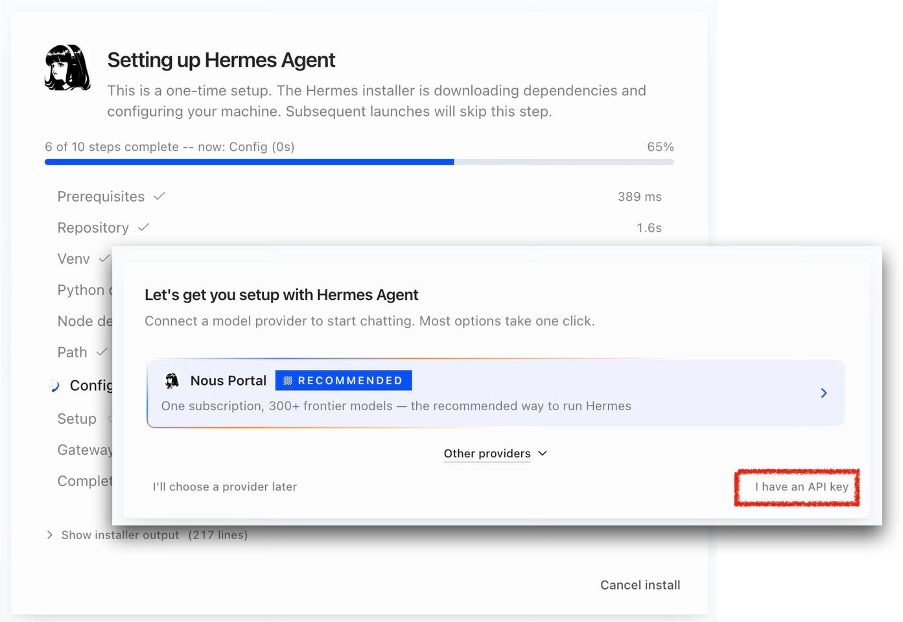
**이미지 캡션:** 이 화면은 "Hermes Agent 설정"이라는 제목의 소프트웨어 설치 과정을 보여줍니다. 화면 상단에는 설치 진행 상황을 나타내는 진행률 표시줄이 있으며, 현재 10단계 중 6단계가 완료되었고 "Config" 단계에 있으며 65% 진행되었음을 알 수 있습니다. "Prerequisites", "Repository", "Venv" 항목 옆에는 완료를 나타내는 체크 표시가 있습니다. 화면 중앙에는 "Hermes Agent 설정"이라는 제목의 팝업 창이 떠 있으며, "모델 제공업체에 연결하여 채팅을 시작하세요. 대부분의 옵션은 클릭 한 번으로 가능합니다."라는 안내 문구가 있습니다. 팝업 창 안에는 "Nous Portal"이라는 추천 제공업체와 함께 "RECOMMENDED"라는 라벨이 붙어 있으며, "One subscription, 300+ frontier models - the recommended way to run Hermes"라는 설명이 있습니다. 그 아래에는 "Other providers"라는 드롭다운 메뉴와 "I'll choose a provider later"라는 옵션이 있습니다. 팝업 창의 오른쪽 하단에는 빨간색 테두리로 강조된 "I have an API key" 버튼이 보입니다. 팝업 창 아래에는 "Cancel install" 버튼이 있습니다. 전반적으로, 이 화면은 사용자가 Hermes Agent를 설정하는 과정에서 모델 제공업체를 선택하거나 API 키를 입력하는 단계를 안내하고 있습니다.
 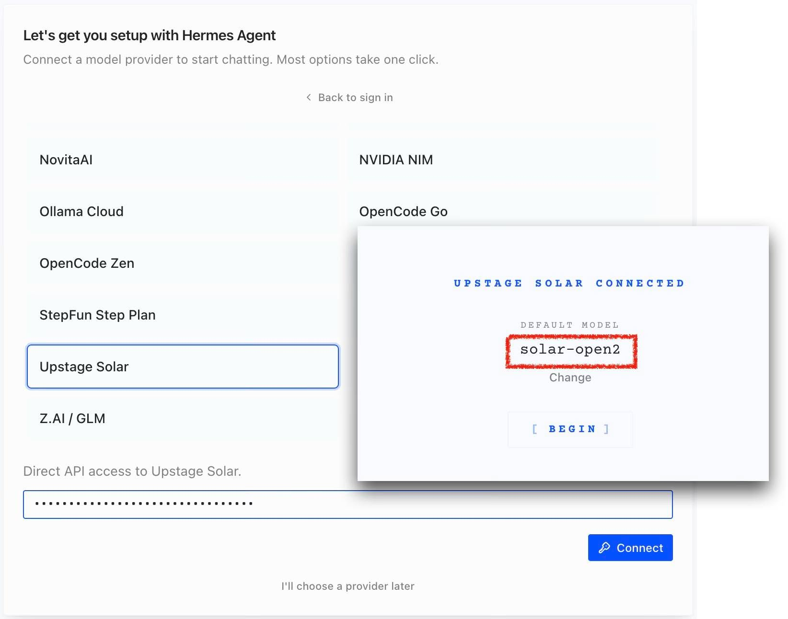
**이미지 캡션:** 이 화면은 "Hermes Agent" 설정을 위한 인터페이스를 보여줍니다. 사용자는 모델 제공자를 선택하여 채팅을 시작할 수 있으며, 대부분의 옵션은 한 번의 클릭으로 선택 가능합니다. 왼쪽에는 NovitaAI, Ollama Cloud, OpenCode Zen, StepFun Step Plan, Upstage Solar, Z.AI / GLM과 같은 여러 모델 제공자 목록이 나열되어 있으며, 현재 "Upstage Solar"가 선택되어 강조 표시되어 있습니다. "Upstage Solar" 아래에는 "Direct API access to Upstage Solar."라는 문구와 함께 API 키를 입력하는 것으로 보이는 점선으로 채워진 입력 필드가 있습니다. 화면 오른쪽에는 팝업 창이 떠 있으며, "UPSTAGE SOLAR CONNECTED"라는 제목과 함께 기본 모델로 "solar-open2"가 선택되어 있음을 보여줍니다. 이 팝업 창에는 모델을 변경할 수 있는 "Change" 옵션과 "BEGIN" 버튼이 있습니다. 화면 하단에는 "I'll choose a provider later"라는 텍스트와 함께 파란색 "Connect" 버튼이 있습니다. 전반적으로 이 화면은 사용자가 AI 모델 제공자를 선택하고 연결하는 초기 설정 과정을 안내하고 있습니다.
 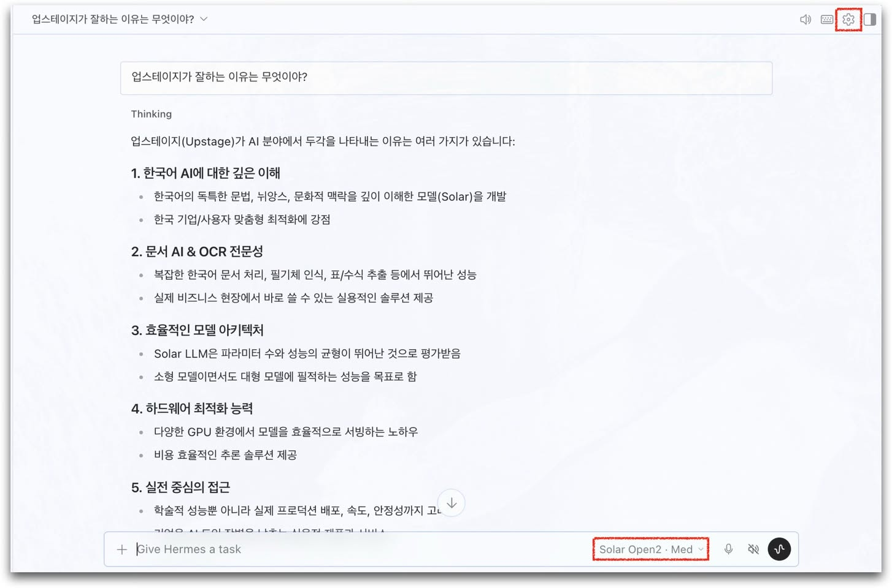
**이미지 캡션:** 화면에는 흰색 배경에 회색 테두리로 둘러싸인 웹사이트 인터페이스가 보이며, 상단에는 "업스테이지가 잘하는 이유는 무엇이야?"라는 질문이 표시되어 있습니다. 그 아래 "Thinking"이라는 제목과 함께 업스테이지가 AI 분야에서 두각을 나타내는 이유를 설명하는 한국어 텍스트가 목록 형태로 나열되어 있습니다. 목록에는 "1. 한국어 AI에 대한 깊은 이해", "2. 문서 AI & OCR 전문성", "3. 효율적인 모델 아키텍처", "4. 하드웨어 최적화 능력", "5. 실전 중심의 접근"과 같은 소제목과 함께 각 항목에 대한 설명이 포함되어 있습니다. 화면 하단에는 "Give Hermes a task"라는 버튼과 "Solar Open2 · Med"라는 텍스트가 보이며, 오른쪽 상단에는 설정 아이콘이 있습니다. 전반적으로 정보 제공 및 질의응답 인터페이스로 보입니다.

### 7월 15일 (수) 06:31 · Sung Kim shared a link.

🔗 <https://hermes-agent.nousresearch.com/>

### 7월 15일 (수) 13:45 · Upstage 가 만든 독자 파운데이션 #SolarLLM의 Furiosa…

Upstage 가 만든 독자 파운데이션 #SolarLLM의 Furiosa가 만든 압도적인성능의 NPU위에서 대국민 포털 #Daum 실 서비스 되는 역사 적인 순간을 기념하기 위한 대담이였습니다.

정말 GPU대비 50% 비용으로 하루 1T 토큰을 생산하고 서비스 해보 도록 하겠습니다. Daum 많이 사용해주셔요!

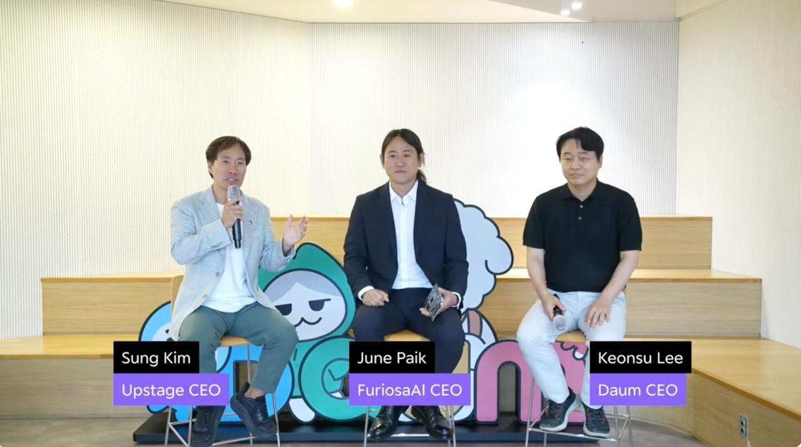
**이미지 캡션:** 세 명의 성인 남성이 무대 위에서 좌담회에 참여하고 있다. 왼쪽 남성은 40대 후반에서 50대 초반으로 보이며, 연한 회색 체크무늬 재킷과 흰색 티셔츠, 녹색 바지를 입고 마이크를 들고 손짓하며 이야기하고 있다. 가운데 남성은 30대 후반에서 40대 초반으로 보이며, 검은색 정장 재킷과 흰색 셔츠, 검은색 바지를 입고 스마트폰으로 보이는 물건을 손에 쥐고 있다. 오른쪽 남성은 40대 후반에서 50대 초반으로 보이며, 검은색 카라 티셔츠와 연한 색 바지를 입고 마이크를 들고 있다. 세 사람 모두 차분하고 진지한 표정으로 좌담회에 임하고 있다. 배경에는 나무 계단과 흰색 벽이 보이며, 무대 앞에는 귀여운 캐릭터 디자인의 대형 조형물이 설치되어 있다. 각 인물 아래에는 이름과 직책이 적힌 텍스트 라벨이 붙어 있으며, 왼쪽부터 'Sung Kim Upstage CEO', 'June Paik FuriosaAI CEO', 'Keonsu Lee Daum CEO'라고 쓰여 있다. 전체적으로 전문적이고 진지한 분위기 속에서 IT 업계 리더들의 대화가 이루어지고 있는 듯한 모습이다.

🎬 동영상 1개 (생략)

### 7월 15일 (수) 13:46 · Sung Kim shared a link.

🔗 <https://www.youtube.com/live/9MOAZc-wsLM?si=-F6iezJjzi_cPv_9>

### 7월 15일 (수) 13:53 · Sung Kim shared a link.

🔗 <https://www.youtube.com/live/9MOAZc-wsLM?si=-F6iezJjzi_cPv_9>

### 7월 15일 (수) 18:48 · #SolarOpen2 테스트 해주시고 또 많은 의견을 주시는데요.  멋진…

#SolarOpen2 테스트 해주시고 또 많은 의견을 주시는데요. https://nahz.org/posts/solar-open2-cerebras/ 멋진 평가를 주셨습니다. 매우 날카로운 분석 감사드립니다. 특히 안정성이 부족하다는 부분 잘 고민해서 #SolarPro4 에 반영해서 해결해 보겠습니다.

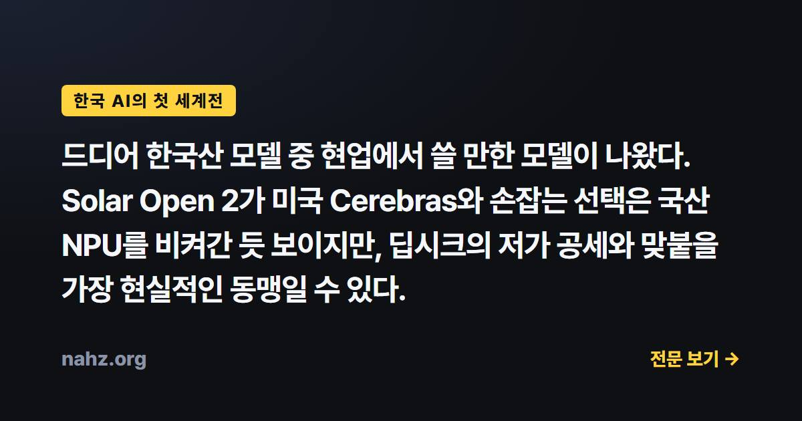
**이미지 캡션:** 이 이미지는 어두운 배경에 흰색과 노란색 텍스트가 포함된 웹사이트의 일부를 보여줍니다. 상단에는 노란색 배경에 "한국 AI의 첫 세계전"이라는 제목이 있습니다. 그 아래에는 "드디어 한국산 모델 중 현업에서 쓸 만한 모델이 나왔다. Solar Open 2가 미국 Cerebras와 손잡는 선택은 국산 NPU를 비켜간 듯 보이지만, 딥시크의 저가 공세와 맞붙을 가장 현실적인 동맹일 수 있다."라는 본문이 흰색으로 표시되어 있습니다. 하단 왼쪽에는 "nahz.org"라는 웹사이트 주소가 흰색으로 표시되어 있고, 하단 오른쪽에는 노란색으로 "전문 보기 →"라는 버튼이 있습니다. 이 이미지는 한국 AI 기술의 발전에 대한 기사를 다루고 있으며, 특히 한국산 AI 모델인 Solar Open 2가 미국 Cerebras와 협력하는 것에 대한 내용을 담고 있습니다. 전반적으로 정보 전달에 초점을 맞춘 진지하고 전문적인 분위기입니다.

### 7월 16일 (목) 12:57 · Sung Kim shared a link.

🔗 <https://go.upstage.ai/4p6SsM0>

### 7월 18일 (토) 13:17 · #바이브코딩 할때 #알면좋은개념 10가지! 요즈음 LLM의 성능이 높아짐…

#바이브코딩 할때 #알면좋은개념 10가지! 요즈음 LLM의 성능이 높아짐에 따라 바이브코딩만 하면 다 만들어 주지만, 프로그램의 기본적인 빌딩 블락이라고 할수 있는 알고리즘과 자료구조의 핵심을 알면 더 효율적인 작업이 가능합니다. 딱 10가지를 추려보았습니다. https://book-nine-orcin.vercel.app/

개념을 바로 설명하는 것이 아니라 이 개념 자체도 바이브코딩 형태로 LLM과 대화하면서 익힐수 있도록 prompt와 예상결과까지 담았습니다. 즉 질문으로 통해 개념을 익히고 문제를 해결하는 방법을 보여 드립니다.

여기 나오는 기본 개념들을 아시면 바이브코딩시 더 멋진 결과가 나올 것입니다. Python코드 포함 우선은 그냥 쓱 읽어보시면 됩니다. 
 
(이 전체 교재 구성과 내용은 #Solar-Open2 와 제가 정리했습니다.)

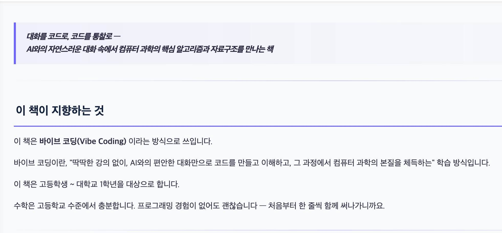
**이미지 캡션:** 이 이미지는 책의 일부 내용을 보여주는 스크린샷으로, 사람이나 장소, 사물은 보이지 않고 텍스트만 있습니다. 텍스트는 "대화를 코드로, 코드를 통찰로 - AI와의 자연스러운 대화 속에서 컴퓨터 과학의 핵심 알고리즘과 자료구조를 만나는 책"이라는 제목과 함께, "이 책이 지향하는 것"이라는 소제목 아래 "이 책은 바이브 코딩(Vibe Coding)이라는 방식으로 쓰입니다. 바이브 코딩이란, '딱딱한 강의 없이, AI와의 편안한 대화만으로 코드를 만들고 이해하고, 그 과정에서 컴퓨터 과학의 본질을 체득하는' 학습 방식입니다. 이 책은 고등학생 ~ 대학교 1학년을 대상으로 합니다. 수학은 고등학교 수준에서 충분합니다. 프로그래밍 경험이 없어도 괜찮습니다 - 처음부터 한 줄씩 함께 써나가니까요."라는 내용으로 구성되어 있습니다. 전반적으로 흰색 배경에 파란색 글씨와 밑줄이 사용되어 깔끔하고 정보 전달에 집중하는 분위기입니다.
 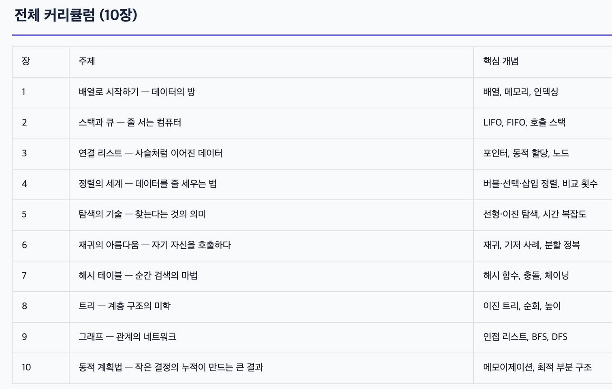
**이미지 캡션:** 이 이미지는 "전체 커리큘럼 (10장)"이라는 제목의 표로, 컴퓨터 과학의 기초 개념들을 다루는 10개의 장으로 구성되어 있습니다. 각 장은 "장", "주제", "핵심 개념"의 세 가지 열로 나뉘어 있으며, 1부터 10까지 번호가 매겨져 있습니다. 1장에서는 "배열로 시작하기 - 데이터의 방"을 주제로 "배열, 메모리, 인덱싱"을 핵심 개념으로 다루고, 2장에서는 "스택과 큐 - 줄 서는 컴퓨터"를 주제로 "LIFO, FIFO, 호출 스택"을, 3장에서는 "연결 리스트 - 사슬처럼 이어진 데이터"를 주제로 "포인터, 동적 할당, 노드"를 다룹니다. 4장에서는 "정렬의 세계 - 데이터를 줄 세우는 법"을 주제로 "버블·선택·삽입 정렬, 비교 횟수"를, 5장에서는 "탐색의 기술 - 찾는다는 것의 의미"를 주제로 "선형·이진 탐색, 시간 복잡도"를 다룹니다. 6장에서는 "재귀의 아름다움 - 자기 자신을 호출하다"를 주제로 "재귀, 기저 사례, 분할 정복"을, 7장에서는 "해시 테이블 - 순간 검색의 마법"을 주제로 "해시 함수, 충돌, 체이닝"을 다룹니다. 8장에서는 "트리 - 계층 구조의 미학"을 주제로 "이진 트리, 순회, 높이"를, 9장에서는 "그래프 - 관계의 네트워크"를 주제로 "인접 리스트, BFS, DFS"를 다룹니다. 마지막으로 10장에서는 "동적 계획법 - 작은 결정의 누적이 만드는 큰 결과"를 주제로 "메모이제이션, 최적 부분 구조"를 다룹니다. 표는 흰색 배경에 검은색 글씨로 작성되었으며, 각 열의 제목은 보라색 밑줄로 구분되어 있습니다. 전체적으로 교육적인 내용을 담고 있는 깔끔한 디자인의 표입니다.
 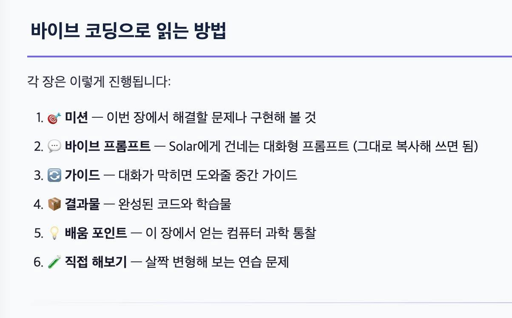
**이미지 캡션:** 이 이미지는 "바이브 코딩으로 읽는 방법"이라는 제목의 슬라이드 또는 문서의 일부로, 각 장이 어떻게 진행되는지에 대한 개요를 보여줍니다. 슬라이드는 흰색 배경에 파란색 제목과 검은색 본문 텍스트로 구성되어 있습니다. 사람이나 배경은 보이지 않으며, 텍스트는 한국어로 작성되어 있습니다. 텍스트는 6가지 항목으로 나열되어 있으며, 각 항목은 번호, 아이콘, 제목, 그리고 간략한 설명으로 이루어져 있습니다. 첫 번째 항목은 "미션"으로, 해당 장에서 해결하거나 구현할 문제에 대한 설명입니다. 두 번째 항목은 "바이브 프롬프트"로, Solar에게 제공할 대화형 프롬프트이며 그대로 복사하여 사용할 수 있다고 명시되어 있습니다. 세 번째 항목은 "가이드"로, 대화가 막혔을 때 도움을 줄 중간 가이드입니다. 네 번째 항목은 "결과물"로, 완성된 코드와 학습물을 의미합니다. 다섯 번째 항목은 "배움 포인트"로, 해당 장에서 얻을 수 있는 컴퓨터 과학 통찰을 나타냅니다. 마지막 여섯 번째 항목은 "직접 해보기"로, 내용을 살짝 변형하여 연습해 볼 수 있는 연습 문제입니다. 전체적으로 교육적이거나 학습 지침을 제공하는 내용으로 보이며, 차분하고 명확한 분위기입니다.

### 7월 19일 (일) 12:15 · 저희 회사에서도 적용 중인 "테스트까지 스스로 하는 소프트웨어 루프" 에…

저희 회사에서도 적용 중인 "테스트까지 스스로 하는 소프트웨어 루프" 에 대한 블로그 글 입니다. https://sungkimup.tistory.com/1

#SolarOpen2의 성능이 올라옴에 따라 Loop에 함께 참여하여 issue를 찾고 코드를 수정하고 있습니다. 개발에 Loop을 구성하신다면 Solar도 참여시켜 주시면 좋은 역할을 할 것입니다.

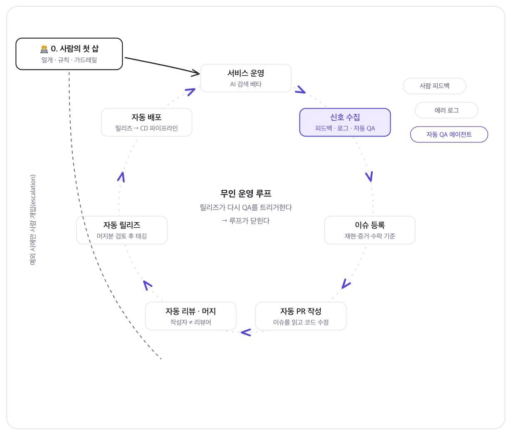
**이미지 캡션:** 이 다이어그램은 AI 검색 베타 서비스 운영의 자동화 및 사람 개입 프로세스를 보여줍니다. 최상단에는 "0. 사람의 첫 삽"이라는 제목으로 얼개, 규칙, 가드레일이 있으며, 이는 프로세스의 초기 설정을 의미합니다. 이어서 "서비스 운영 AI 검색 베타"로 이어지며, 이는 실제 서비스 운영 단계를 나타냅니다. "자동 배포" 단계에서는 릴리즈가 CD 파이프라인을 통해 이루어집니다. "신호 수집" 단계에서는 피드백, 로그, 자동 QA를 통해 서비스 관련 신호가 수집됩니다. 수집된 신호는 "사람 피드백", "에러 로그", "자동 QA 에이전트"로 분류되어 처리될 수 있습니다. "무인 운영 루프"는 릴리즈가 다시 QA를 트리거하고 루프가 닫히는 과정을 설명하며, 이는 자동화된 피드백 루프를 의미합니다. "이슈 등록" 단계에서는 재현 및 증거 수락 기준에 따라 이슈가 등록됩니다. "자동 릴리즈" 단계에서는 머지분 검토 후 태깅이 이루어집니다. "자동 리뷰·머지" 단계에서는 작성자와 리뷰어가 아닌 경우 자동 리뷰 및 머지가 진행됩니다. 마지막으로 "자동 PR 작성" 단계에서는 이슈를 읽고 코드 수정이 이루어집니다. 다이어그램의 왼쪽에는 "예외 시에만 사람 개입(escalation)"이라는 텍스트가 점선으로 표시되어 있으며, 이는 특정 예외 상황 발생 시에만 사람의 개입이 필요함을 나타냅니다. 전반적으로 이 다이어그램은 AI 기반 서비스 운영에서 자동화된 프로세스와 예외적인 상황에서의 사람 개입을 시각적으로 표현하고 있습니다.

### 7월 20일 (월) 05:15 · 와~ 2026년 월드컵 결승전에서 처음으로 도입된 하프타임 쇼에서 감동적…

와~ 2026년 월드컵 결승전에서 처음으로 도입된 하프타임 쇼에서 감동적인 BTS 공연을 보게 될 줄 몰랐습니다. 너무 멋집니다. 한국이 월드컵 결승에 진출한 것과 같은 기쁨입니다!

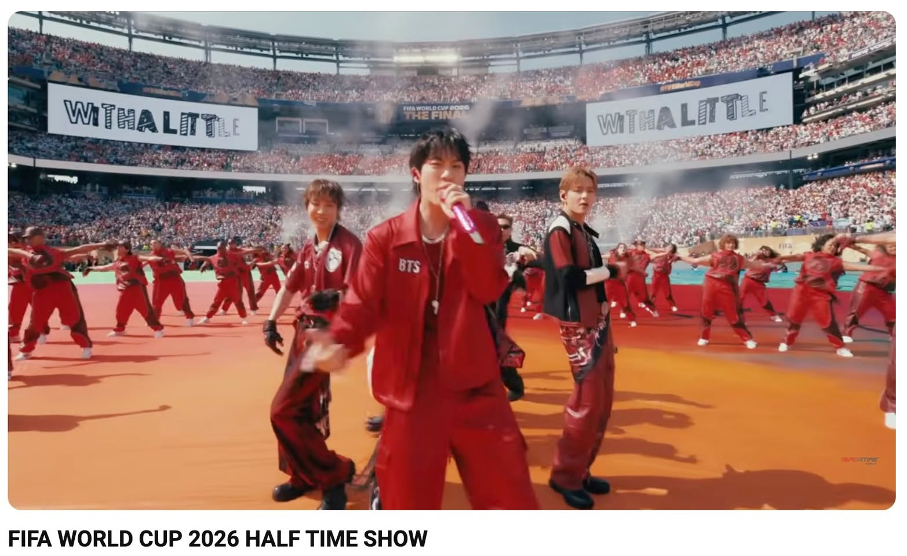
**이미지 캡션:** 이 사진은 2026년 FIFA 월드컵 하프타임 쇼의 한 장면으로, 넓은 경기장 위에 수많은 관중이 앉아 있는 모습이 보인다. 경기장 중앙에는 붉은색 의상을 입은 여러 명의 젊은 남성들이 춤을 추고 있으며, 그중 한 명은 마이크를 들고 노래를 부르고 있다. 이들은 모두 붉은색 재킷과 바지를 입고 있으며, 일부는 검은색 장갑을 끼고 있다. 배경에는 "WITH A LITTLE"이라는 문구가 적힌 대형 스크린이 두 개 걸려 있고, 그 위에는 "FIFA WORLD CUP 2026 THE FINAL"이라는 글자가 보인다. 전체적으로 역동적이고 화려한 분위기이며, 공연이 한창 진행 중임을 알 수 있다.

### 7월 20일 (월) 07:17 · Sung Kim shared a link.

🔗 <https://talk-to-algorithms.vercel.app/>

### 7월 20일 (월) 07:36 · 7월 22일 오후 6시, 드디어 Upstage #독파모2차 #SolarO…

7월 22일 오후 6시, 드디어 Upstage #독파모2차 #SolarOpen2 Weight을 허깅페이스에 공개합니다. 이 기쁜소식을 함께 나누기 위해 허깅페이스, 조코딩, NotaAI, 로톡이 함께 모여 마련한 ‘Open Weight Day’에 여러분들을 초대합니다. https://luma.com/gkkxmw8b

#SolarOpen2 는 250B의 실용적인 사이즈면서도 지식, 수학, 코드, 에이전트 성능이 높아 현업에서 충분히 사용할수 있는 모델입니다. 22일 바로 허깅페이스에서 다운로드하여 사용이 가능합니다. 

행사에서는 저와 Hwalsuk Lee CTO가 Agent를 위해 만든 Solar Open 2에 대해 직접 소개하고, 모델 개발 여정을 공개합니다. #SolarOpen2 Quantization 모델을 만든 Nota의 기술 소개와 클로드 코드, Hermes Agent, 그리고 로톡 법무 서비스의 데모를 통해  Solar Open2의 실사용 사례를 확인하실 수 있습니다.

마지막으로 조코딩 님의 질문들을 통해 재미있는 이야기를 나눌 예정입니다. 행사 후 이어지는 피자&네트워킹까지 즐거운 시간을 함께할 수 있는 이번 행사입니다. 선신청, 후고민! 

(장소가 협소한 관계로 신청하신 모든 분을 모실수 없음을 미리 양해 부탁드립니다. 해당 행사는 조코딩 유튜브 채널 라이브로 보실 수 있습니다.)

🎬 동영상 1개 (생략)

### 7월 20일 (월) 07:41 · 📷 사진 (1장)

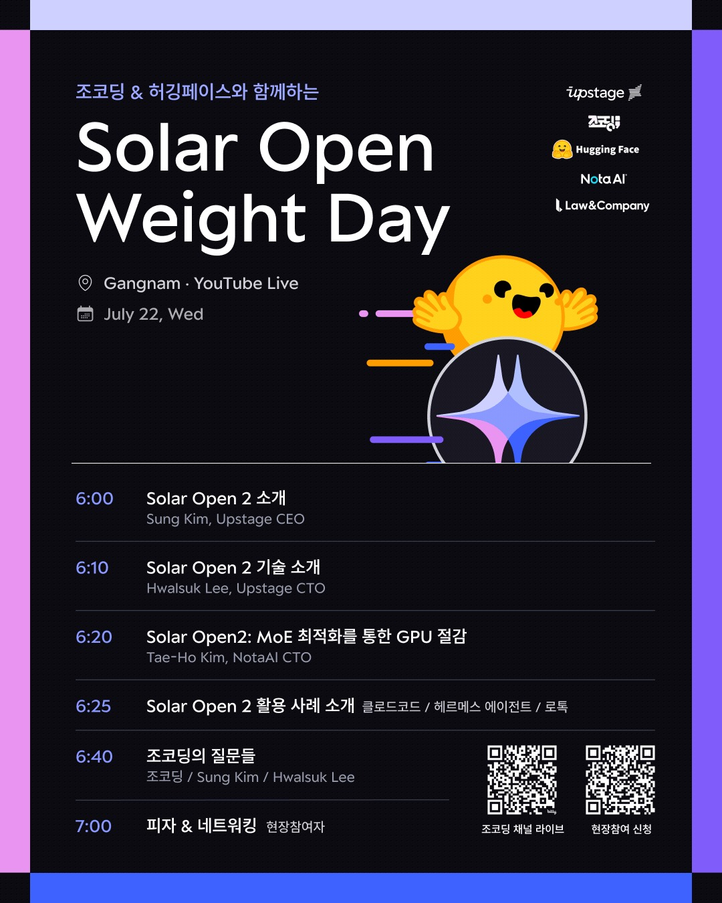
**이미지 캡션:** 이 포스터는 "조코딩 & 허깅페이스와 함께하는 Solar Open Weight Day"라는 행사를 홍보하고 있으며, 행사는 7월 22일 수요일에 강남 유튜브 라이브로 진행된다. 포스터 상단에는 "upstage", "조코딩", "Hugging Face", "Nota AI", "Law&Company" 로고가 보이며, 중앙에는 노란색 캐릭터가 웃으며 팔을 벌리고 있고, 그 아래에는 별 모양의 그래픽이 있다. 포스터 하단에는 시간대별 행사 내용이 상세히 안내되어 있으며, 6시에는 "Solar Open 2 소개" (Sung Kim, Upstage CEO), 6시 10분에는 "Solar Open 2 기술 소개" (Hwalsuk Lee, Upstage CTO), 6시 20분에는 "Solar Open2: MoE 최적화를 통한 GPU 절감" (Tae-Ho Kim, NotaAI CTO), 6시 25분에는 "Solar Open 2 활용 사례 소개" (클로드코드 / 헤르메스 에이전트 / 로톡), 6시 40분에는 "조코딩의 질문들" (조코딩 / Sung Kim / Hwalsuk Lee), 7시에는 "피자 & 네트워킹" (현장참여자) 순서로 진행된다. 또한, "조코딩 채널 라이브"와 "현장 참여 신청"을 위한 QR코드가 함께 제공된다. 전반적으로 행사의 정보 전달에 초점을 맞춘 깔끔하고 현대적인 디자인의 포스터이다.

### 7월 21일 (화) 08:38 · #독파모 #SolarOpen2 기반의 알고리즘 책과의 대화 공유합니다.

#독파모 #SolarOpen2 기반의 알고리즘 책과의 대화 공유합니다. 
https://talk-to-algorithms.vercel.app/ 

개발 관련 일을 하신다면 알고리즘을 이해하는 일은 매우 중요한 기본 뼈대와 같은 일입니다. 바이브 코딩을 하시더라도 알고리듬을 알고 코드를 리뷰하시거나 알고리즘 용어로 AI에 지시하면 더 정확하게 일을 합니다.

알고리즘 책을 무료로 배포해주신 제프 에릭슨교수님께 감사드리며 이 책을 사용해 개발된 이 사이트도 역시 무료로 제공이 됩니다. 알고리즘에 대해 무엇이든 물어 보고 답을 얻을수 있습니다.

제가 이 사이트를 만든 진짜 이유는 교육을 위한 것인데요. 이 사이트를 통해 '오답 생성 학습법'을 진행할 수 있습니다. 이제 답을 찾는 것은 AI 등을 활용해 쉽게 할 수 있지만 배우는 학생들 입장에서 이렇게 찾은 답은 머리에 남지 않습니다. 이 사이트를 통해 답을 찾는 대신 "LLM이 잘못된 답을 내는 질문"을 찾아오는 실습을 할 수 있습니다. 틀린 답을 내는 질문을 찾으려면 많은 질문을 하고 답을 읽어야 합니다. 그 과정에서 학습이 됩니다. 더 나아가 잘못된 답을 책을 읽고 바로잡는 것까지 한다면 더욱 확실한 학습이 될 것입니다.

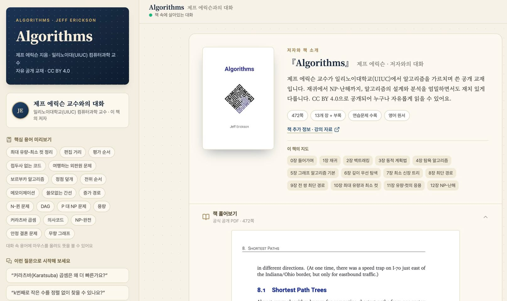
**이미지 캡션:** 이 이미지는 "Algorithms"라는 제목의 책에 대한 웹 페이지의 일부를 보여줍니다. 왼쪽에는 책의 제목, 저자(Jeff Erickson), 출판 정보(일리노이대학교 컴퓨터과학 교수, 자유 공개 교재, CC BY 4.0)가 표시되어 있습니다. 그 아래에는 "핵심 용어 미리보기" 섹션이 있어 책에서 다루는 주요 알고리즘 및 개념(예: 최대 유량-최소 컷 정리, 편집 거리, 보르부카 알고리즘, 메모이제이션, 커라츠바 곱셈 등)을 나열하고 있습니다. 또한, "제프 에릭슨 교수와의 대화"라는 섹션에서는 책의 저자와의 인터뷰나 관련 대화 내용을 볼 수 있음을 암시하며, 몇 가지 질문 예시도 제시되어 있습니다. 오른쪽에는 책의 표지 이미지와 함께 저자 소개, 책의 분량(472쪽, 13개 장 + 부록), 연습문제 수록 여부, 영어 원서 정보 등이 요약되어 있습니다. "이 책의 지도" 섹션에서는 각 장의 제목을 나열하여 책의 전체적인 구성을 보여줍니다. 마지막으로 "책 훑어보기" 섹션에서는 공식 공개 PDF 파일 링크와 함께 책의 일부 내용(8. SHORTEST PATHS)이 영어로 발췌되어 있습니다. 전반적으로 이 페이지는 "Algorithms"라는 책에 대한 정보를 제공하고, 독자들이 책의 내용과 관련된 추가 정보를 얻거나 책을 탐색할 수 있도록 돕는 역할을 합니다. 페이지의 디자인은 깔끔하고 정보 전달에 초점을 맞추고 있으며, 텍스트와 버튼들이 잘 구분되어 있어 사용자가 원하는 정보를 쉽게 찾을 수 있도록 구성되어 있습니다.
 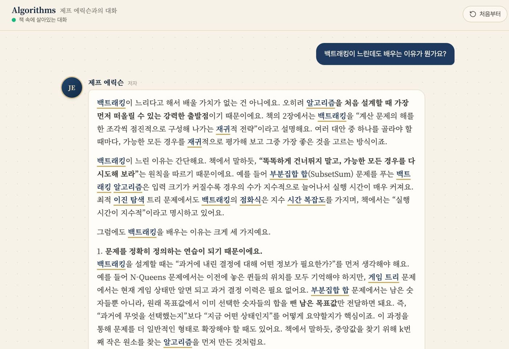
**이미지 캡션:** 이 이미지는 알고리즘 관련 온라인 대화의 일부를 보여주며, 제프 에릭슨이라는 저자가 백트래킹에 대해 설명하는 내용을 담고 있습니다. 화면 상단에는 'Algorithms 제프 에릭슨과의 대화'라는 제목과 '책 속에 살아있는 대화'라는 부제가 있습니다. 대화창에는 "백트래킹이 느린데도 배우는 이유가 뭔가요?"라는 질문이 파란색 말풍선 안에 표시되어 있습니다. 그 아래에는 'JE'라는 이니셜과 함께 제프 에릭슨 저자임을 나타내는 표시가 있고, 그 옆으로 백트래킹의 개념, 장점, 그리고 느린 이유에 대한 설명이 텍스트로 상세하게 작성되어 있습니다. 설명은 백트래킹이 알고리즘 설계의 출발점이 될 수 있으며, 가능한 모든 경우를 재귀적으로 평가하는 방식 때문에 느릴 수 있다고 언급합니다. 또한, 부분집합 합 문제와 최적 이진 탐색 트리 문제를 예로 들며 지수 시간 복잡도를 가진다고 설명합니다. 그럼에도 백트래킹을 배우는 이유로 문제를 정확히 정의하는 연습이 된다는 점을 강조하며, N-Queens 문제, 게임 트리 문제, 부분집합 합 문제를 예시로 들어 설명하고 있습니다. 화면 오른쪽 상단에는 '처음부터'라는 버튼이 보입니다. 전반적으로 정보 전달에 초점을 맞춘 차분하고 학술적인 분위기입니다.
 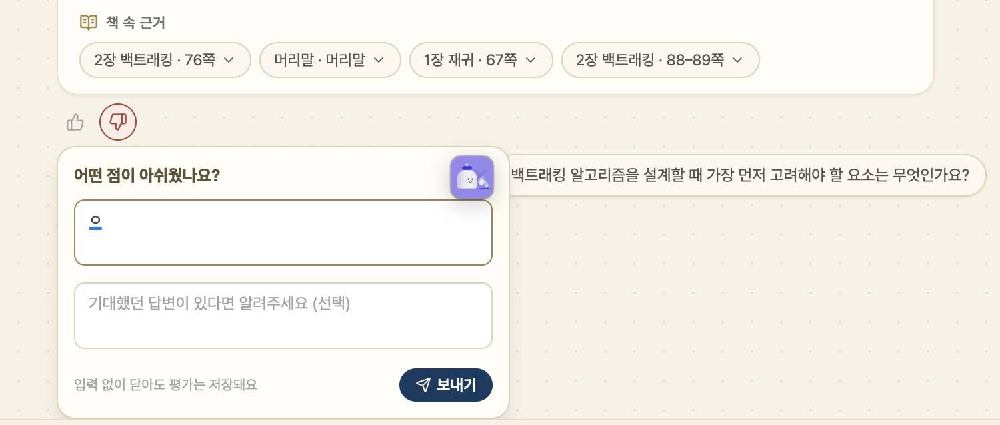
**이미지 캡션:** 이 화면은 책의 특정 부분에 대한 피드백을 남기는 인터페이스로, "책 속 근거"라는 제목 아래 "2장 백트래킹·76쪽", "머리말·머리말", "1장 재귀·67쪽", "2장 백트래킹·88-89쪽"과 같은 책의 특정 섹션이나 페이지를 나타내는 태그들이 표시되어 있습니다. 사용자는 "어떤 점이 아쉬웠나요?"라는 질문에 대한 답변을 입력할 수 있는 텍스트 입력란과 "기대했던 답변이 있다면 알려주세요 (선택)"라는 추가 입력란이 있습니다. 또한, 엄지척과 엄지 내림 아이콘이 있어 피드백에 대한 긍정 또는 부정적인 반응을 표현할 수 있으며, 귀여운 캐릭터 아이콘이 있는 말풍선에는 "백트래킹 알고리즘을 설계할 때 가장 먼저 고려해야 할 요소는 무엇인가요?"라는 질문이 표시되어 있습니다. 화면 하단에는 "입력 없이 닫아도 평가는 저장돼요"라는 안내 문구와 함께 "보내기" 버튼이 있습니다. 전체적으로 사용자 경험 개선을 위한 피드백 수집 과정의 일부로 보이며, 차분하고 정돈된 디자인으로 구성되어 있습니다.

### 7월 23일 (목) 12:25 · #독파모 2차 모델인 #SolarOpen2가 OpenWeight로 공개되…

#독파모 2차 모델인 #SolarOpen2가 OpenWeight로 공개되었습니다. https://huggingface.co/upstage/Solar-Open2-250B 마음껏 사용하시고 추가 튜닝해서 여러분들의 업무에 사용하실 수 있습니다. HF 트랜딩 7위를 달리고 있는데요. #SolarOpen2는 Agent와 특히 OfficeWork에 매우 좋은 모델입니다!

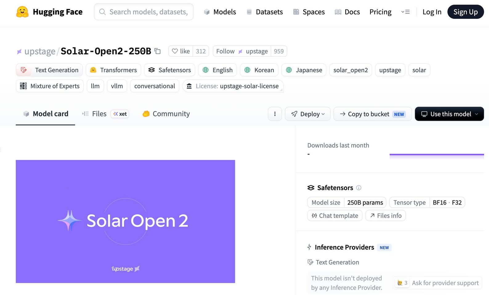
**이미지 캡션:** 이 이미지는 Hugging Face 웹사이트의 한 페이지를 보여주며, Upstage에서 개발한 "Solar-Open2-250B"라는 이름의 언어 모델에 대한 정보를 담고 있습니다. 페이지 상단에는 Hugging Face 로고와 검색창, 그리고 모델, 데이터셋, 스페이스, 문서, 가격, 로그인, 회원가입 등의 메뉴가 보입니다. 중앙에는 "upstage/Solar-Open2-250B"라는 모델 이름과 함께 좋아요, 팔로우 버튼이 있으며, 그 아래에는 "Text Generation", "Transformers", "Safetensors", "English", "Korean", "Japanese", "solar_open2", "upstage", "solar", "Mixture of Experts", "llm", "vllm", "conversational" 등의 태그가 모델의 특징을 나타냅니다. 또한 "License: upstage-solar-license"라는 라이선스 정보도 표시되어 있습니다. 페이지 왼쪽에는 "Model card", "Files", "xet", "Community" 탭이 있으며, 현재 "Model card"가 선택되어 있습니다. 모델 카드 영역에는 보라색 배경에 "Solar Open 2"라는 텍스트와 함께 Upstage 로고가 중앙에 크게 표시되어 있습니다. 오른쪽 영역에는 "Downloads last month"라는 항목과 함께 다운로드 수 그래프가 보이지 않으며, "Safetensors" 섹션에는 모델 크기 "250B params", 텐서 타입 "BF16 F32", "Chat template", "Files info" 등의 정보가 있습니다. 그 아래 "Inference Providers" 섹션에는 "Text Generation"이 표시되어 있으며, "This model isn't deployed by any Inference Provider."라는 메시지와 함께 "Ask for provider support" 버튼이 있습니다. 전반적으로 기술적인 정보를 제공하는 웹 페이지의 모습이며, 차분하고 전문적인 분위기입니다.
 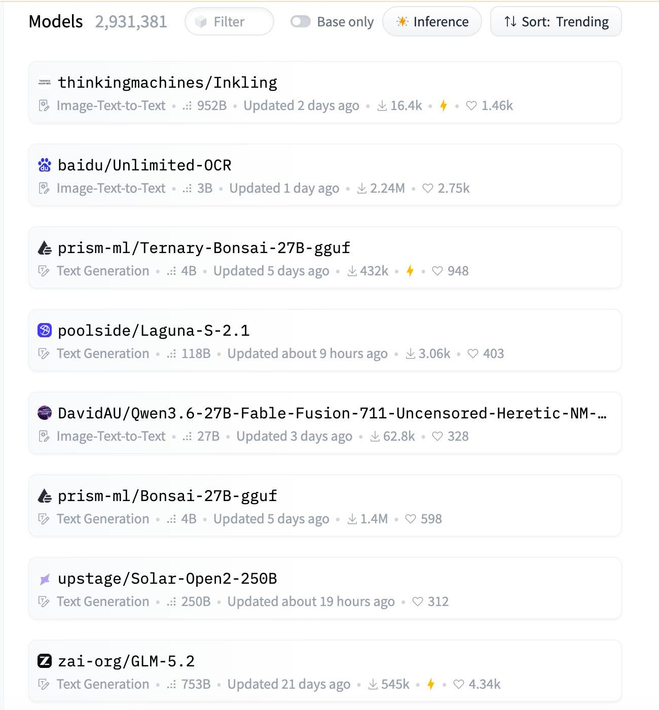
**이미지 캡션:** 이 이미지는 웹사이트의 모델 목록을 보여주며, 각 모델은 이름, 유형, 크기, 업데이트 날짜, 다운로드 수, 좋아요 수를 포함합니다. 목록에는 "thinkingmachines/Inkling", "baidu/Unlimited-OCR", "prism-ml/Ternary-Bonsai-27B-gguf", "poolside/Laguna-S-2.1", "DavidAU/Qwen3.6-27B-Fable-Fusion-711-Uncensored-Heretic-NM-...", "prism-ml/Bonsai-27B-gguf", "upstage/Solar-Open2-250B", "zai-org/GLM-5.2"와 같은 다양한 모델들이 나열되어 있습니다. 각 항목에는 모델의 유형을 나타내는 아이콘과 함께 "Image-Text-to-Text" 또는 "Text Generation"과 같은 텍스트가 표시됩니다. 또한, 각 모델의 크기는 "952B", "3B", "4B", "118B", "27B", "250B", "753B"와 같이 표시되며, 업데이트 날짜는 "Updated 2 days ago", "Updated 1 day ago", "Updated 5 days ago", "Updated about 9 hours ago", "Updated 3 days ago", "Updated about 19 hours ago", "Updated 21 days ago" 등으로 표시됩니다. 다운로드 수는 "16.4k", "2.24M", "432k", "3.06k", "62.8k", "1.4M", "545k" 등으로, 좋아요 수는 "1.46k", "2.75k", "948", "403", "328", "598", "312", "4.34k" 등으로 표시됩니다. 상단에는 "Models 2,931,381", "Filter", "Base only", "Inference", "Sort: Trending"과 같은 필터 및 정렬 옵션이 있습니다. 전반적으로 이 이미지는 인공지능 모델의 라이브러리 또는 저장소를 보여주는 기술적인 인터페이스를 나타냅니다.

### 7월 24일 (금) 08:33 · DeepSeek 창립자 량원펑이 2025년 5월 투자자들과 가진 3시간 …

DeepSeek 창립자 량원펑이 2025년 5월 투자자들과 가진 3시간 44분짜리 미팅 녹취록이 유출되었는데요. 기개가 대단합니다. 특히 'AI는 너무 커서 독점할 수 없다'는 정말 공감됩니다. 정말 더 많은 회사들이 함께 더 큰 파이를 같이 만들면 좋겠습니다.

#SolarOpen2가 12장 슬라이드로 정리했습니다. https://book-nine-orcin.vercel.app/deepseek-liang-wenfeng-slides.html

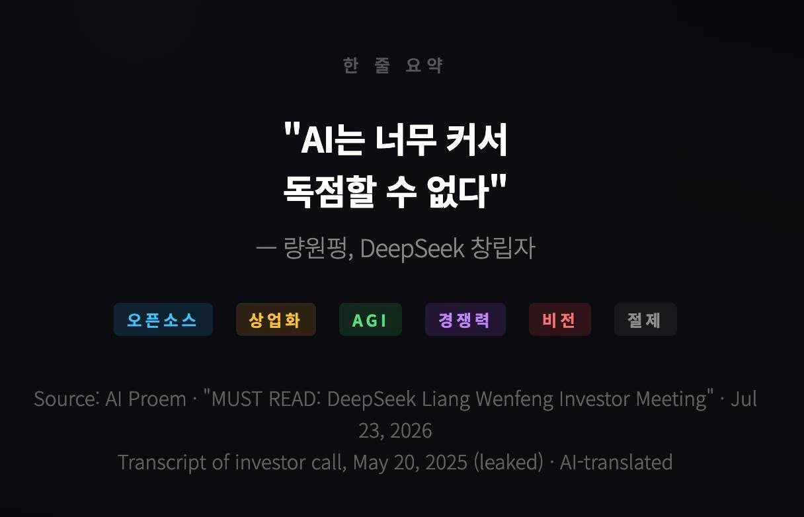
**이미지 캡션:** 어두운 배경에 "한 줄 요약"이라는 텍스트가 상단에 작게 표시되어 있으며, 그 아래에는 큰 글씨로 "AI는 너무 커서 독점할 수 없다"라는 문구가 인용 부호와 함께 강조되어 있습니다. 이 문구 아래에는 "— 량원평, DeepSeek 창립자"라는 텍스트가 있어 발언자를 명시하고 있습니다. 그 아래에는 "오픈 소스", "상업화", "AGI", "경쟁력", "비전", "절제"라는 6개의 태그가 각각 다른 색상의 버튼 형태로 나열되어 있습니다. 가장 하단에는 출처 정보가 영어로 기재되어 있으며, "Source: AI Proem · "MUST READ: DeepSeek Liang Wenfeng Investor Meeting" · Jul 23, 2026"와 "Transcript of investor call, May 20, 2025 (leaked) · AI-translated"라는 텍스트가 보입니다. 전반적으로 정보 전달을 목적으로 하는 화면의 일부로 보이며, AI 기술의 발전과 관련된 내용을 다루고 있음을 짐작할 수 있습니다.

### 7월 24일 (금) 08:56 · 제가 자주보는 허깅뉴스 어제자 모델부분에  뉴스가 올라갔습니다. 그리고 …

제가 자주보는 허깅뉴스 어제자 모델부분에 https://huggingface.co/upstage/Solar-Open2-250B 뉴스가 올라갔습니다. 그리고 HF Model Trending 5위로 올라갔습니다. 좋은 모델입니다. 많이 테스트 하시고 사용해주셔요. 

퀵하게 웹으로 테스트 (7월 30일까지) 가능합니다. http://open2-beta.upstage.ai/

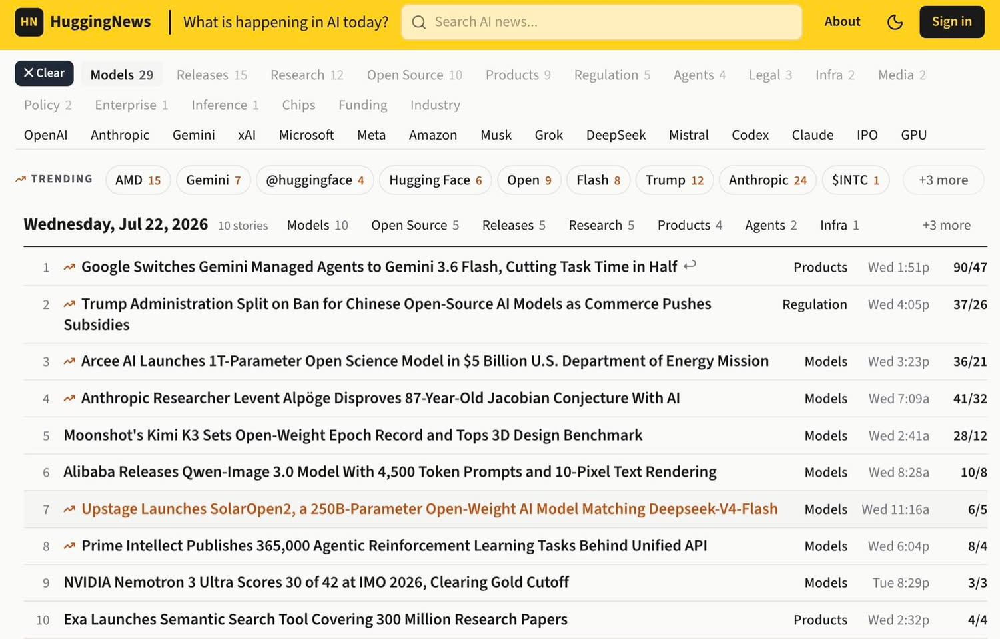
**이미지 캡션:** This is a screenshot of the Hugging News website, displaying a list of AI-related news articles for Wednesday, July 22, 2026. The page features a yellow header with the Hugging News logo, a search bar labeled "Search Al news...", and "About" and "Sign in" buttons. Below the header, there are filter buttons such as "Clear," "Models," "Releases," "Research," "Open Source," "Products," "Regulation," "Agents," "Legal," "Infra," and "Media," along with various AI-related keywords like "OpenAI," "Anthropic," "Gemini," "xAI," "Microsoft," "Meta," "Amazon," "Musk," "Grok," "DeepSeek," "Mistral," "Codex," "Claude," "IPO," and "GPU." A "TRENDING" section lists popular topics with associated counts, including "AMD 15," "Gemini 7," "@huggingface 4," "Hugging Face 6," "Open 9," "Flash 8," "Trump 12," and "Anthropic 24." The main content area presents a chronological list of 10 news stories, each with a number, a title, a category (e.g., "Products," "Regulation," "Models"), a timestamp, and a score. The news titles cover diverse AI developments, such as Google's Gemini updates, a potential ban on Chinese open-source AI models, new AI models from Arcee AI and Alibaba, research breakthroughs from Anthropic, and performance benchmarks from NVIDIA. The overall atmosphere is informative and focused on the latest advancements in the artificial intelligence field.
 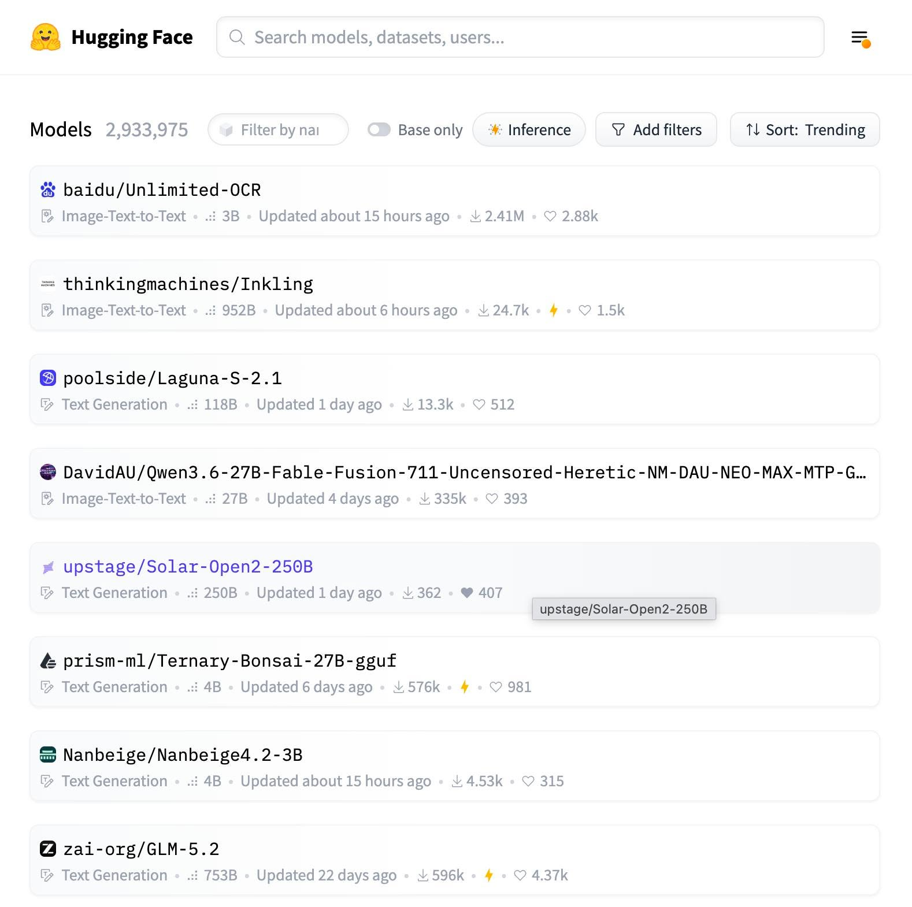
**이미지 캡션:** 이 이미지는 Hugging Face 웹사이트의 모델 검색 결과 페이지를 보여줍니다. 화면 상단에는 "Hugging Face" 로고와 함께 "Search models, datasets, users..."라는 검색창이 있습니다. 그 아래에는 "Models 2,933,975"라는 총 모델 수가 표시되어 있으며, "Filter by nai", "Base only", "Inference", "Add filters", "Sort: Trending"과 같은 필터 및 정렬 옵션 버튼들이 보입니다. 페이지의 주요 내용은 다양한 AI 모델들의 목록으로, 각 모델은 이름, 유형(예: Image-Text-to-Text, Text Generation), 크기(예: 3B, 952B), 업데이트 시점, 다운로드 수, 좋아요 수를 포함하고 있습니다. 예를 들어, "baidu/Unlimited-OCR" 모델은 Image-Text-to-Text 유형으로 3B 크기이며 약 15시간 전에 업데이트되었고 2.41M번 다운로드되었으며 2.88k개의 좋아요를 받았습니다. 다른 모델로는 "thinkingmachines/Inkling", "poolside/Laguna-S-2.1", "DavidAU/Qwen3.6-27B-Fable-Fusion-711-Uncensored-Heretic-NM-DAU-NEO-MAX-MTP-G...", "upstage/Solar-Open2-250B", "prism-ml/Ternary-Bonsai-27B-gguf", "Nanbeige/Nanbeige4.2-3B", "zai-org/GLM-5.2" 등이 있습니다. 각 모델 항목에는 해당 모델의 아이콘, 이름, 유형, 크기, 업데이트 정보, 다운로드 수, 좋아요 수가 표시되어 있습니다. 전반적으로 기술적인 정보를 담고 있는 깔끔하고 정보 중심적인 인터페이스를 보여줍니다.

### 7월 24일 (금) 10:13 · 📷 사진 (1장)

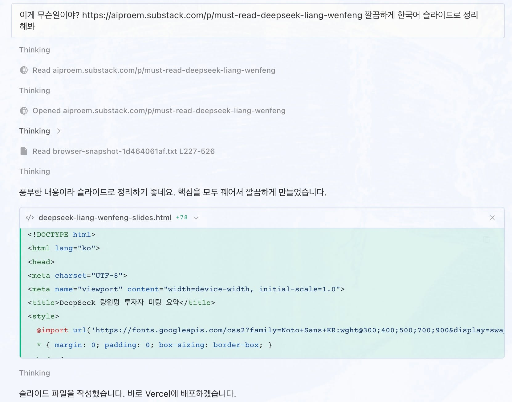
**이미지 캡션:** 화면에는 웹 브라우저의 일부와 코드 편집기 창이 보입니다. 웹 브라우저 부분에는 "이게 무슨일이야? https://aiproem.substack.com/p/must-read-deepseek-liang-wenfeng 깔끔하게 한국어 슬라이드로 정리 해봐"라는 제목과 함께 여러 개의 "Thinking"이라는 텍스트와 함께 링크들이 나열되어 있습니다. 그 아래에는 "풍부한 내용이라 슬라이드로 정리하기 좋네요. 핵심을 모두 꿰어서 깔끔하게 만들었습니다."라는 문구가 보입니다. 코드 편집기 창에는 HTML 코드의 일부가 녹색 배경 위에 표시되어 있으며, `<title>DeepSeek 량원펑 투자자 미팅 요약</title>`라는 텍스트가 포함되어 있습니다. 마지막으로 "슬라이드 파일을 작성했습니다. 바로 Vercel에 배포하겠습니다."라는 문구가 보입니다. 전체적으로 기술적인 작업을 수행하고 있는 상황을 보여주며, 정보 정리 및 웹 배포에 대한 내용이 주를 이룹니다.

### 7월 25일 (토) 06:58 · #SolarOpen2 가 Epoch.AI Notable AI 모델로 선정…

#SolarOpen2 가 Epoch.AI Notable AI 모델로 선정되었습니다. https://huggingface.co/upstage/Solar-Open2-250B 좋은 모델입니다. 많이 사용해주셔요!

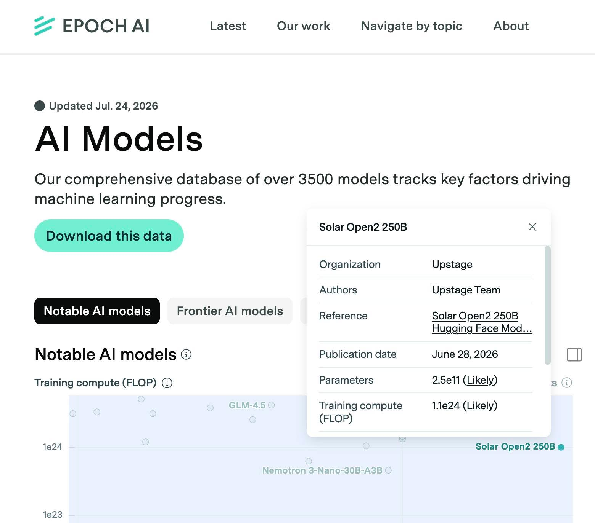
**이미지 캡션:** 이 이미지는 "EPOCH AI"라는 웹사이트의 일부를 보여주며, "AI Models"라는 제목 아래 머신러닝 모델에 대한 포괄적인 데이터베이스를 소개하고 있습니다. 화면 상단에는 "Latest", "Our work", "Navigate by topic", "About"와 같은 메뉴가 보입니다. 메인 콘텐츠 영역에는 "Updated Jul. 24, 2026"이라는 날짜와 함께 "AI Models"라는 큰 제목이 있고, 그 아래에는 "Our comprehensive database of over 3500 models tracks key factors driving machine learning progress."라는 설명 문구가 있습니다. 녹색 버튼에는 "Download this data"라고 쓰여 있습니다. 그 아래에는 "Notable AI models"와 "Frontier AI models"라는 두 개의 탭이 있으며, 현재 "Notable AI models"가 선택되어 있습니다. "Notable AI models"라는 제목 아래에는 "Training compute (FLOP)"에 대한 정보가 그래프 형태로 표시되고 있습니다. 그래프에는 여러 개의 점들이 분포되어 있으며, "GLM-4.5"와 "Nemotron 3-Nano-30B-A3B"와 같은 모델 이름들이 표시되어 있습니다. 오른쪽에는 "Solar Open2 250B"라는 모델에 대한 상세 정보가 팝업 창 형태로 나타나 있습니다. 이 팝업 창에는 "Organization" (Upstage), "Authors" (Upstage Team), "Reference" (Solar Open2 250B Hugging Face Mod...), "Publication date" (June 28, 2026), "Parameters" (2.5e11 (Likely)), "Training compute (FLOP)" (1.1e24 (Likely)) 등의 정보가 포함되어 있습니다. 이미지에는 사람이 직접적으로 보이지는 않으며, 전반적으로 기술적이고 정보 중심적인 분위기를 풍깁니다.

### 7월 25일 (토) 07:17 · 공개후 Jensen Huang의 적절한 글이 올라왔습니다. 오픈웨잇의 이…

https://huggingface.co/upstage/Solar-Open2-250B 공개후 Jensen Huang의 적절한 글이 올라왔습니다. 오픈웨잇의 이로운 점을 강조하는 글인데 무려 Jensen Huang의 첫번째 X post라고 합니다. 

#SolarOpen2 가 만든 요약 슬라이드입니다. https://book-nine-orcin.vercel.app/open-weights-slides.html

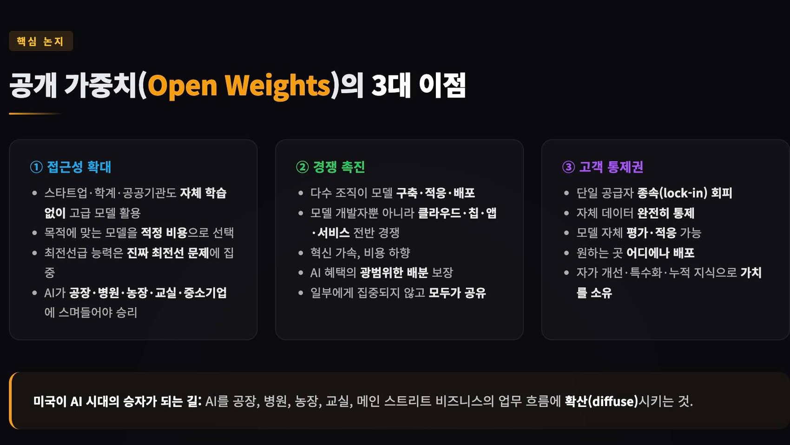
**이미지 캡션:** 이 이미지는 어두운 배경에 밝은 글씨로 "핵심 논지"와 "공개 가중치(Open Weights)의 3대 이점"이라는 제목이 크게 쓰여 있으며, 그 아래에 세 가지 주요 이점을 설명하는 세 개의 섹션이 나열되어 있습니다. 각 섹션은 번호와 함께 "① 접근성 확대", "② 경쟁 촉진", "③ 고객 통제권"이라는 소제목을 가지고 있으며, 각 소제목 아래에는 글머리 기호로 상세 내용이 설명되어 있습니다. 첫 번째 섹션은 스타트업, 학계, 공공기관이 자체 학습 없이 고급 모델을 활용하고, 목적에 맞는 모델을 적정 비용으로 선택하며, 최전선급 능력을 실제 문제에 집중시키고, AI가 다양한 산업 분야에 스며들어야 승리할 수 있다는 내용을 담고 있습니다. 두 번째 섹션은 다수 조직이 모델을 구축, 적응, 배포하고, 모델 개발자뿐만 아니라 클라우드, 칩, 앱, 서비스 전반에 걸쳐 경쟁하며, 혁신을 가속하고 비용을 낮추며, AI 혜택의 광범위한 배분을 보장하고 일부에게 집중되지 않고 모두가 공유해야 한다는 내용을 설명합니다. 세 번째 섹션은 단일 공급자 종속을 회피하고, 자체 데이터를 완전히 통제하며, 모델 자체를 평가하고 적응시킬 수 있고, 원하는 곳 어디에나 배포할 수 있으며, 자가 개선, 특수화, 누적 지식을 통해 가치를 소유할 수 있다는 내용을 제시합니다. 이미지 하단에는 "미국이 AI 시대의 승자가 되는 길: AI를 공장, 병원, 농장, 교실, 메인 스트리트 비즈니스의 업무 흐름에 확산(diffuse)시키는 것."이라는 문장이 쓰여 있습니다. 전반적으로 정보 전달에 초점을 맞춘 프레젠테이션 또는 보고서의 한 페이지로 보이며, 진지하고 전문적인 분위기를 풍깁니다.

### 7월 25일 (토) 11:47 · Sung Kim shared a link.

🔗 <https://huggingface.co/models?other=base_model:quantized:upstage/Solar-Open2-250B>

### 7월 26일 (일) 07:17 · #HF #TOP3 Trending 모델에 올라갔습니다!  좋은 모델입니다…

#HF #TOP3 Trending 모델에 올라갔습니다! https://huggingface.co/upstage/Solar-Open2-250B 좋은 모델입니다. 많이 사용해주셔요.

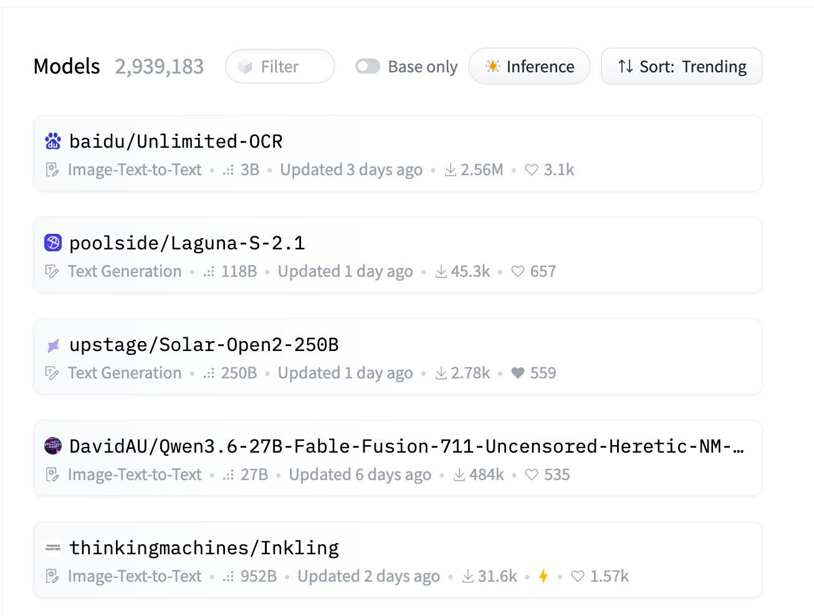
**이미지 캡션:** 이것은 웹사이트의 스크린샷으로, "Models"라는 제목 아래에 여러 인공지능 모델 목록이 표시됩니다. 화면 상단에는 총 모델 수가 2,939,183개임을 나타내는 텍스트와 함께 "Filter", "Base only", "Inference", "Sort: Trending"과 같은 버튼과 옵션이 있습니다. 각 모델은 고유한 아이콘, 이름, 설명 (예: "Image-Text-to-Text", "Text Generation"), 크기 (예: "3B", "118B"), 업데이트 날짜, 다운로드 수 (예: "2.56M", "45.3k") 및 좋아요 수 (예: "3.1k", "657")가 표시됩니다. 특정 인물, 장소, 사물, 보이는 텍스트는 없으며, 전반적으로 기술적인 웹사이트의 인터페이스를 보여주는 차분하고 정보 전달적인 분위기입니다.

### 7월 26일 (일) 17:09 · Agentic Model for Office Productivity 최고…

Agentic Model for Office Productivity 최고 #SolarOpen2! 761K 구독자의 Fahd Mirza 채널에서 Upstage #SolarOpen2 를 사무 생산성(office productivity) 및 문서 집약적 업무(document-intensive work) 관점에서 테스트하는 영상을 자발적으로 올려주셨습니다.

한마디로 #SolarOpen 2가 전반적으로 매우 호의적이고 인상적이라는 평가입니다. 특히 에이전트 워크플로, 코딩, 한국어, 아키텍처 혁신에서 높은 점수를 받았고, 다국어만 약점으로 지적되었습니다. 

좋은 모델입니다. 많이 사용해주셔요!

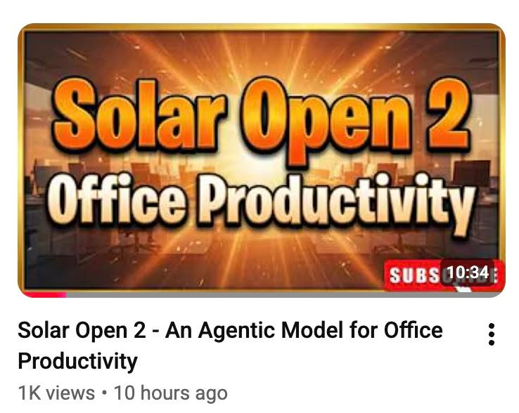
**이미지 캡션:** 이것은 유튜브 영상의 썸네일 이미지로, "Solar Open 2 - An Agentic Model for Office Productivity"라는 제목의 영상임을 나타냅니다. 썸네일 중앙에는 주황색과 노란색 계열의 불꽃 효과와 함께 "Solar Open 2"라는 큰 글씨가 있고, 그 아래에는 "Office Productivity"라는 글씨가 있습니다. 배경에는 사무실 풍경이 흐릿하게 보이며, 책상과 의자들이 놓여 있습니다. 썸네일 오른쪽 하단에는 "SUBS 10:34"라는 텍스트가 있어 구독 버튼과 영상의 재생 시간을 나타내는 것으로 보입니다. 영상의 제목은 "Solar Open 2 - An Agentic Model for Office Productivity"이며, 1000 조회수에 10시간 전에 게시된 영상임을 알 수 있습니다. 전체적으로 영상의 주제가 사무실 생산성에 관한 것임을 시사하며, 강렬한 색감과 텍스트로 시청자의 흥미를 유발하려는 의도가 엿보입니다.
 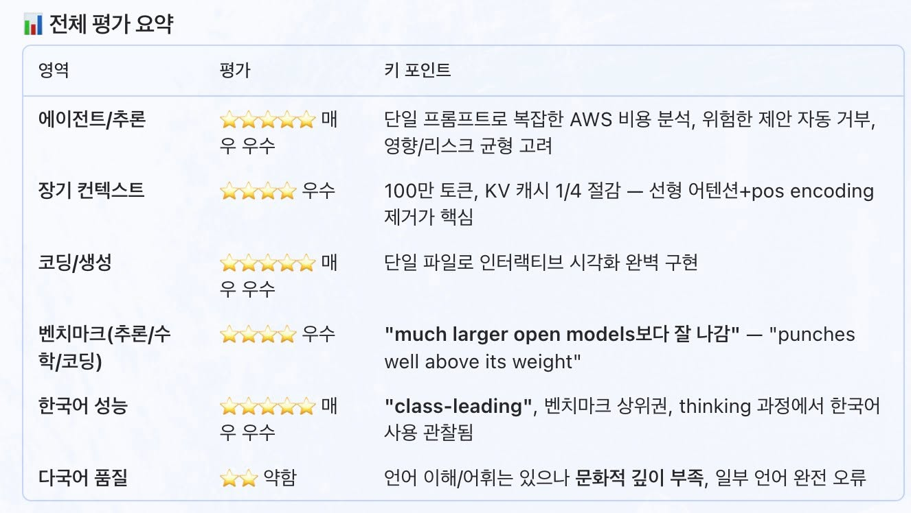
**이미지 캡션:** 이 이미지는 "전체 평가 요약"이라는 제목의 표로, 여러 영역에 대한 평가와 키 포인트를 보여줍니다. 표는 "영역", "평가", "키 포인트" 세 개의 열로 구성되어 있습니다. "영역" 열에는 "에이전트/추론", "장기 컨텍스트", "코딩/생성", "벤치마크(추론/수학/코딩)", "한국어 성능", "다국어 품질"이 나열되어 있습니다. 각 영역 옆의 "평가" 열에는 별점과 함께 "매우 우수", "우수", "약함"과 같은 평가가 표시됩니다. 예를 들어, "에이전트/추론" 영역은 별 5개 중 4개와 함께 "매우 우수"로 평가되었고, "키 포인트"에는 "단일 프롬프트로 복잡한 AWS 비용 분석, 위험한 제안 자동 거부, 영향/리스크 균형 고려"라고 설명되어 있습니다. "장기 컨텍스트"는 별 5개 중 4개로 "우수" 평가를 받았으며, "100만 토큰, KV 캐시 1/4 절감 - 선형 어텐션+pos encoding 제거가 핵심"이라는 키 포인트가 있습니다. "코딩/생성"은 "매우 우수"로 평가되었고, "단일 파일로 인터랙티브 시각화 완벽 구현"이라는 키 포인트가 있습니다. "벤치마크(추론/수학/코딩)"는 "우수"로 평가되었으며, "much larger open models보다 잘 나감"이라는 영어 인용문과 함께 설명됩니다. "한국어 성능"은 "매우 우수"로 평가되었고, "class-leading", 벤치마크 상위권, thinking 과정에서 한국어 사용 관찰됨"이라는 키 포인트가 있습니다. 마지막으로 "다국어 품질"은 "약함"으로 평가되었으며, "언어 이해/어휘는 있으나 문화적 깊이 부족, 일부 언어 완전 오류"라는 키 포인트가 있습니다. 표는 흰색 배경에 회색 선으로 구분되어 있으며, 전반적으로 정보 전달에 초점을 맞춘 깔끔하고 전문적인 분위기를 풍깁니다.
 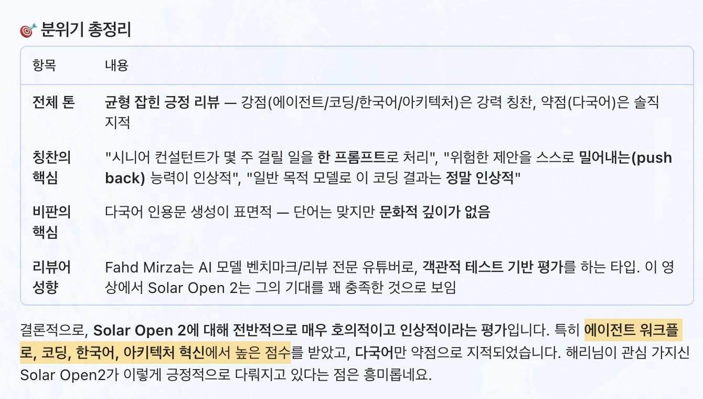
**이미지 캡션:** 이 이미지는 한국어로 작성된 텍스트 문서의 일부로, "분위기 총정리"라는 제목 아래 표 형태로 정보가 정리되어 있습니다. 표는 "항목"과 "내용" 두 개의 열로 구성되어 있으며, "전체 톤", "칭찬의 핵심", "비판의 핵심", "리뷰어 성향"이라는 항목들이 나열되어 있습니다. 각 항목별 내용은 해당 AI 모델 또는 서비스에 대한 평가를 담고 있습니다. "전체 톤" 항목에서는 긍정적인 리뷰와 함께 에이전트, 코딩, 한국어, 아키텍처 측면에서의 강점을 언급하고 다국어 지원은 약점으로 지적하고 있습니다. "칭찬의 핵심"에서는 시니어 컨설턴트가 몇 주 걸릴 일을 프로처럼 처리하고 위험한 제안을 스스로 밀어내는 능력, 일반 목적 모델로서의 코딩 결과가 인상적이라는 내용이 인용되어 있습니다. "비판의 핵심"에서는 다국어 이용 문장 생성이 피상적이며 단어는 맞지만 문화적 깊이가 없다는 점을 지적하고 있습니다. "리뷰어 성향" 항목에서는 Fahd Mirza라는 리뷰어가 AI 모델 벤치마크 및 리뷰 전문 유튜버로서 객관적인 테스트 기반 평가를 하며, Solar Open 2가 그의 기대를 충족시킨 것으로 보인다고 설명합니다. 마지막으로, 결론적으로 Solar Open 2에 대해 전반적으로 매우 호의적이고 인상적이라는 평가이며, 특히 에이전트 워크플로우, 코딩, 한국어, 아키텍처 혁신에서 높은 점수를 받았고 다국어만 약점으로 지적되었으며, 해리님이 관심 가지신 Solar Open 2가 긍정적으로 다뤄지고 있다는 점이 흥미롭다고 마무리하고 있습니다. 전체적으로 정보 전달을 위한 깔끔하고 정돈된 문서의 일부입니다.

### 7월 26일 (일) 17:10 · Sung Kim shared a link.

🔗 <https://www.youtube.com/watch?v=-deLVCuiLaQ&t=2s>

### 7월 26일 (일) 18:04 · Sung Kim shared a link.

🔗 <https://chromewebstore.google.com/detail/b3rys-translate/dgmmidkccokcnofpkbcnmiapkpbmdffe>

### 7월 27일 (월) 11:41 · Sung Kim shared a link.

🔗 <https://github.com/andrewyng/openworker/pull/59>

### 7월 28일 (화) 06:52 · DoHyun Jung 님의 평가: "업스테이지의 AI 모델 #SolarO…

DoHyun Jung 님의 평가: "업스테이지의 AI 모델 #SolarOpen2 는, 사람이 한 번도 개입하지 않은 상태에서 약 3시간 만에 실전 수준의 백엔드 서버를 처음부터 끝까지 혼자 만들어냈다. 공식 테스트 154개를 전부 통과했다."

특히 중간에 DB를 날려서 큰 위기가 있었지만 이를 스스로 복구하여 공식 테스크를 완수하고 테스트를 모두 통과 했습니다.

이제 바이브 코딩을 할수 있는 수준까지 올라왔습니다. #Solar 많이 사용해주셔요. https://huggingface.co/upstage/Solar-Open2-250B

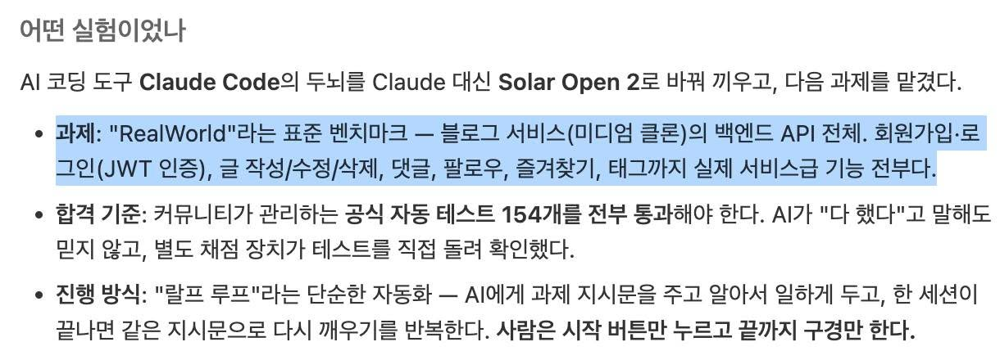
**이미지 캡션:** 이 이미지는 AI 코딩 도구인 Claude Code를 Solar Open 2로 대체하여 진행된 실험에 대한 설명입니다. 실험의 과제는 "RealWorld"라는 표준 벤치마크를 사용하여 블로그 서비스(미디엄 클론)의 백엔드 API 전체를 구현하는 것이며, 여기에는 회원가입, 로그인(JWT 인증), 글 작성/수정/삭제, 댓글, 팔로우, 즐겨찾기, 태그 기능 등 실제 서비스 수준의 기능이 포함됩니다. 합격 기준은 커뮤니티에서 관리하는 154개의 공식 자동 테스트를 모두 통과하는 것이며, AI가 완료했다고 말해도 별도의 채점 장치를 통해 직접 테스트를 실행하여 검증합니다. 진행 방식은 "랄프 루프"라는 단순 자동화로, AI에게 과제 지시문을 주고 알아서 작업하게 한 후, 한 세션이 끝나면 동일한 지시문으로 다시 반복하는 방식입니다. 실험자는 시작 버튼만 누르고 결과물을 지켜봅니다.
 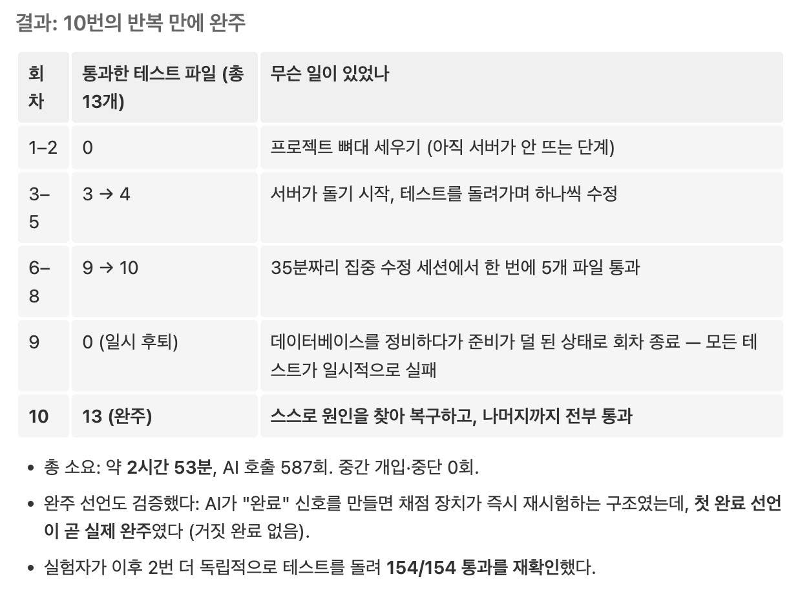
**이미지 캡션:** 이 이미지는 "결과: 10번의 반복 만에 완주"라는 제목의 표와 그 아래 요약글로 구성되어 있습니다. 표는 '회차', '통과한 테스트 파일 (총 13개)', '무슨 일이 있었나' 세 개의 열로 이루어져 있으며, 각 회차별 진행 상황과 특이사항을 기록하고 있습니다. 1회차부터 10회차까지 진행되었으며, 초기에는 프로젝트 뼈대를 세우거나 서버가 준비되지 않은 상태였고, 3회차부터 5회차까지는 서버가 돌기 시작하면서 테스트를 돌려가며 수정하는 과정이 있었습니다. 6회차부터 8회차까지는 35분간 집중 수정 세션을 통해 한 번에 5개 파일을 통과시켰고, 9회차에는 데이터베이스 정비 중 준비가 덜 된 상태로 회차가 종료되어 모든 테스트가 일시적으로 실패했습니다. 마침내 10회차에는 스스로 원인을 찾아 복구하고 나머지까지 전부 통과하며 완주했습니다. 표 아래 요약글에는 총 소요 시간 약 2시간 53분, AI 호출 587회, 중간 개입 및 중단은 0회였다는 정보가 있습니다. 또한, 완주 선언 시 채점 장치가 즉시 재시험하는 구조였는데, 첫 완료 선언이 곧 실제 완주였으며 거짓 완료는 없었다고 명시되어 있습니다. 마지막으로 실험자가 이후 두 번 더 독립적으로 테스트를 진행하여 154/154 통과를 재확인했다는 내용이 포함되어 있습니다. 이 이미지는 특정 테스트 또는 프로젝트의 진행 과정을 기록한 보고서의 일부로 보이며, 사람의 행동이나 표정, 장소, 사물 등은 직접적으로 묘사되지 않고 텍스트 정보만을 제공합니다. 전반적인 분위기는 객관적이고 사실적인 기록을 전달하는 데 중점을 두고 있습니다.

### 7월 28일 (화) 06:53 · Sung Kim shared a link.

🔗 <https://claude.ai/code/artifact/dbaa0342-f152-4953-84ff-6ec5db85550b?via=auto_preview>

### 7월 28일 (화) 07:02 · #광화문에서 만나는 Upstage! 저희가 만든 Solar LLM, Do…

#광화문에서 만나는 Upstage! 저희가 만든 Solar LLM, Document AI, Agent인 Studio 등의 기술로 세상을 이롭게 하는 이야기를 전합니다. 한 예로 월드비전 후원 아동의 손편지가 Upstage 기술 AI를 통해 언어의 장벽을 넘어가는 이야기를 담았습니다.

광화문에 가신다면 업스테이지를 만나보세요.

🎬 동영상 1개 (생략)

### 7월 29일 (수) 09:45 · #SolarOpen2 실서비스 배포할만큼 좋다고 해주셔서 감사합니다.

#SolarOpen2 실서비스 배포할만큼 좋다고 해주셔서 감사합니다. 

https://huggingface.co/upstage/Solar-Open2-250B 좋은 모델입니다. 많이 사용해주셔요!

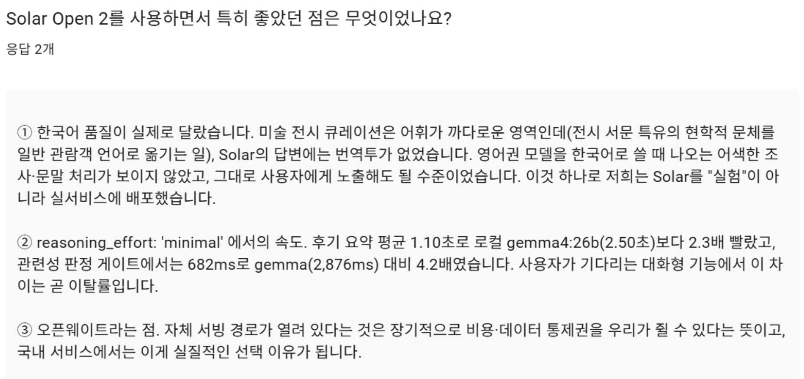
**이미지 캡션:** 이 이미지는 한국어로 작성된 텍스트로, Solar Open 2라는 서비스에 대한 사용자 경험을 공유하는 내용입니다. 구체적으로는 Solar Open 2를 사용하면서 좋았던 점 세 가지를 나열하고 있습니다. 첫 번째 항목에서는 한국어 품질이 실제와 다르지 않으며, 특히 미술 전시 큐레이션과 같이 전문적인 분야에서도 번역투가 느껴지지 않고 자연스러워 사용자에게 그대로 노출해도 될 수준이라고 언급합니다. 두 번째 항목에서는 'reasoning_effort: 'minimal'' 설정에서의 속도와 후기 요약 평균 속도가 1.10초로, 로컬 Gemma4:26b(2.50초) 대비 4.2배 빨랐다고 설명하며, 이는 사용자가 기다리는 대화형 기능에서 큰 차이를 보인다고 합니다. 세 번째 항목에서는 오픈웨이트라는 점과 자체 서빙 경로가 열려 있다는 점이 장기적으로 비용·데이터 통제권을 확보할 수 있다는 의미이며, 국내 서비스에서는 이것이 실질적인 선택 이유가 된다고 말합니다. 전반적으로 텍스트는 정보 전달에 초점을 맞추고 있으며, 특별한 인물이나 장소, 사물은 묘사되지 않고 오직 텍스트 내용만이 제시되어 있습니다. 분위기는 정보 공유 및 분석적인 느낌을 줍니다.

### 7월 29일 (수) 13:50 · #Kimi3 이 압도적인 허깅페이스 트랜딩 1위를 달리고 있지만 #Sol…

#Kimi3 이 압도적인 허깅페이스 트랜딩 1위를 달리고 있지만 #SolarOpen2 역시 3위로 많은 사랑을 받고 있습니다.  https://huggingface.co/upstage/Solar-Open2-250B 좋은 모델입니다. 많이 사용해주셔요! Kimi3 뒤에 딱 붙어 보겠습니다!

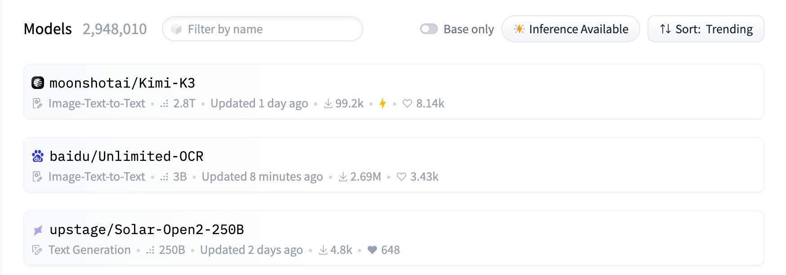
**이미지 캡션:** 이 이미지는 웹사이트의 모델 목록을 보여주며, 총 2,948,010개의 모델이 있음을 나타냅니다. 화면 상단에는 "Models"라는 제목과 함께 총 모델 수가 표시되어 있고, 그 옆에는 "Filter by name"이라는 입력란이 있습니다. 또한 "Base only" 토글 버튼과 "Inference Available" 버튼, 그리고 "Sort: Trending" 옵션이 보입니다. 목록에는 세 개의 모델이 표시되어 있으며, 각 모델은 이름, 유형, 업데이트 시간, 다운로드 수, 그리고 좋아요 수를 포함합니다. 첫 번째 모델은 "moonshotai/Kimi-K3"로, "Image-Text-to-Text" 유형이며 1일 전에 업데이트되었고 99.2k 다운로드와 8.14k 좋아요를 받았습니다. 두 번째 모델은 "baidu/Unlimited-OCR"로, "Image-Text-to-Text" 유형이며 8분 전에 업데이트되었고 2.69M 다운로드와 3.43k 좋아요를 받았습니다. 세 번째 모델은 "upstage/Solar-Open2-250B"로, "Text Generation" 유형이며 2일 전에 업데이트되었고 4.8k 다운로드와 648 좋아요를 받았습니다. 이미지에는 사람이 등장하지 않으며, 배경은 흰색의 깔끔한 웹 인터페이스입니다. 전반적으로 기술적인 정보를 제공하는 화면의 일부로, 모델 검색 및 정렬 기능을 보여주고 있습니다.

### 7월 30일 (목) 17:54 · #문제는학습효율 #SolarDeltaAttention #함께해요 Kimi…

#문제는학습효율 #SolarDeltaAttention #함께해요 Kimi3의 큰 성공뒤에는 학습 효율을 높이는 핵심 기술 중 하나인 Kimi Delta Attention(KDA)이 있었습니다.  KDA는 attention의 decay gate를 channel마다 따로 학습하여 긴 문맥을 더 효율적으로 처리하는 구조입니다.

Upstage에서는 KDA를 뛰어넘는 Solar Delta Attention(SDA) 을 성공적으로 개발했습니다. KDA가 channel마다 하나씩 갖던 decay gate를 channel group이 공유하도록 일반화했습니다. GQA가 여러 query head가 K/V를 공유하듯, SDA는 여러 key channel이 하나의 decay gate를 공유합니다. 이를 통해 계산량은 크게 줄이면서도 모델의 표현력은 유지됩니다.

초기 실험에서 SDA는 기존 KDA Triton 구현 대비 약 3.1배 빠른 커널 속도를 확인했고, 동일한 실험 조건에서 성능 저하 없이 학습되는 결과를 얻었습니다. 아직 진행 중인 연구이지만, SDA가 적용된 Solar 다음 모델이 기대가 되는데요. 이런 새로운 구조를 직접 만들고 검증하실분, 그리고 Kimi3를 비롯한 프론티어 모델을 뛰어넘는 Solar 를 함께 만드실 분들을 모시고 있습니다. https://careers.upstage.ai/ 함께해요! 선지원, 후고민!!

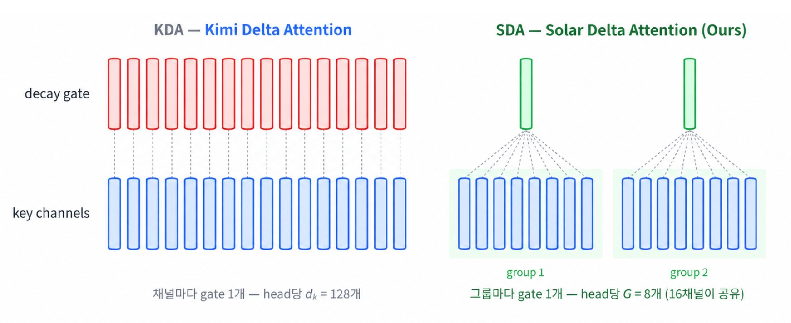
**이미지 캡션:** 이 이미지는 두 가지 어텐션 메커니즘인 KDA(Kimi Delta Attention)와 SDA(Solar Delta Attention)를 비교하는 다이어그램입니다. KDA는 빨간색으로 표시된 'decay gate'와 파란색으로 표시된 'key channels'로 구성되며, 각 'decay gate'가 여러 개의 'key channels'와 연결되는 구조를 보여줍니다. 하단에는 "채널마다 gate 1개 - head당 dk = 128개"라는 설명이 있습니다. 반면 SDA는 녹색으로 표시된 하나의 어텐션 헤드가 여러 개의 'key channels' 그룹과 연결되는 구조를 보여주며, 'group 1'과 'group 2'로 나뉘어 있습니다. 하단에는 "그룹마다 gate 1개 - head당 G = 8개 (16채널이 공유)"라는 설명이 있습니다. 전체적으로 흰색 배경에 파란색, 빨간색, 녹색의 도형과 텍스트로 구성되어 있으며, 기술적인 개념을 시각적으로 설명하는 데 중점을 둔 분위기입니다.
 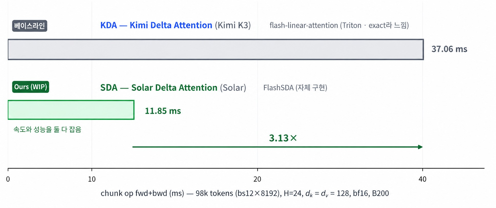
**이미지 캡션:** 이 이미지는 두 가지 어텐션 메커니즘의 성능을 비교하는 그래프입니다. 상단에는 "베이스라인"으로 표시된 첫 번째 항목이 있으며, 이는 "KDA — Kimi Delta Attention (Kimi K3)"과 "flash-linear-attention (Triton · exact라 느낌)"으로 구성되어 있으며 37.06ms의 시간을 소요합니다. 하단에는 "Ours (WIP)"로 표시된 두 번째 항목이 있으며, 이는 "SDA — Solar Delta Attention (Solar)"과 "FlashSDA (자체 구현)"로 구성되어 11.85ms의 시간을 소요합니다. 또한, 두 번째 항목 아래에는 "속도와 성능을 둘 다 잡음"이라는 문구가 있고, 3.13x라는 표시와 함께 긴 녹색 화살표가 오른쪽으로 뻗어 있습니다. 그래프의 x축은 0부터 40까지 표시되어 있으며, "chunk op fwd+bwd (ms) — 98k tokens (bs12×8192), H=24, dk = dv = 128, bf16, B200"이라는 설명이 하단에 기재되어 있습니다. 이 이미지는 기술적인 성능 비교를 보여주는 차트이며, 사람이나 특정 장소는 묘사되지 않았습니다.

### 7월 31일 (금) 08:33 · #고객이좋더라 할때 가장 해복합니다.  좋은 모델입니다. 많이 사용해주셔…

#고객이좋더라 할때 가장 해복합니다. https://huggingface.co/upstage/Solar-Open2-250B 좋은 모델입니다. 많이 사용해주셔요. 곧 API로 모두를 위해 공개할 예정입니다!

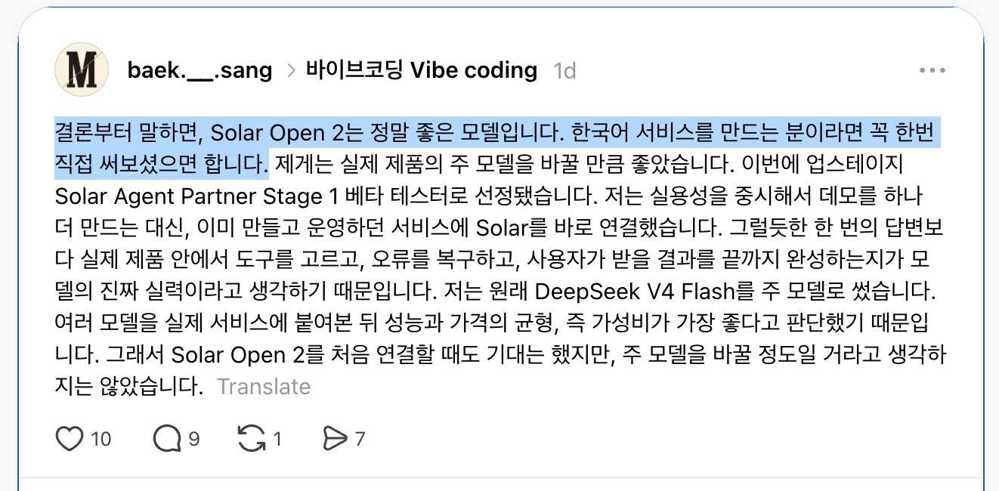
**이미지 캡션:** 화면 상단에는 "M" 로고와 함께 "baek.__.sang"이라는 사용자 이름, 그리고 "바이브코딩 Vibe coding"이라는 게시물 제목이 보입니다. 그 아래에는 한국어로 작성된 긴 텍스트 게시물이 있으며, 일부는 파란색으로 하이라이트되어 있습니다. 텍스트 내용은 "Solar Open 2"라는 모델에 대한 긍정적인 평가와 사용 경험을 공유하는 것으로 보입니다. 특히 한국어 서비스 개발자라면 꼭 사용해 보길 권하고 있으며, 본인이 Solar Agent Partner Stage 1 베타 테스터로 선정되어 직접 사용해 본 경험을 바탕으로 솔직한 의견을 나누고 있습니다. 사용자는 기존에 DeepSeek V4 Flash를 사용했지만, Solar Open 2의 성능과 가격 대비 만족도가 높아 주 모델로 변경할 정도라고 언급합니다. 게시물 하단에는 좋아요 10개, 댓글 9개, 공유 1개, 그리고 다른 아이콘 7개가 표시되어 있습니다. 전체적으로 기술 제품에 대한 리뷰를 공유하는 온라인 커뮤니티 게시물로 보이며, 긍정적이고 정보 전달적인 분위기입니다.

### 7월 31일 (금) 09:02 · #여름 #내장산 너무 좋네요. 단풍때만 와봤는데 여름에도 너무 좋네요. …

#여름 #내장산 너무 좋네요. 단풍때만 와봤는데 여름에도 너무 좋네요. 제일 높은곳에 오르면 주위가 다 아름답게 보입니다!

**이미지 캡션:** 맑은 날씨에 야외에서 셀카를 찍고 있는 성인 남성이 보인다. 남성은 40대 후반에서 50대 초반으로 보이며, 땀에 젖은 짧은 머리와 환하게 웃는 표정이 특징이다. 그는 짙은 녹색의 반팔 티셔츠 위에 검은색 조끼를 착용하고 있으며, 조끼에는 물통이 달려 있다. 남성은 엄지손가락을 치켜세우며 긍정적인 모습을 보여주고 있다. 배경에는 푸른 하늘과 울창한 나무들이 보이며, 왼쪽에는 '봉화산'이라고 쓰여 있는 비석이 있다. 비석에는 '봉화산'이라는 글자와 함께 '봉화초등학교'라는 글씨가 작게 새겨져 있다. 전체적으로 등산이나 트레킹을 마친 후의 성취감과 즐거움이 느껴지는 분위기이다.
 
**이미지 캡션:** 이 사진은 맑고 푸른 하늘 아래 구름이 산봉우리를 뒤덮고 있는 장엄한 산악 풍경을 보여줍니다. 태양은 구름 사이로 빛나며 무지개 빛깔의 후광을 만들어내고, 그 빛은 산비탈을 따라 내려오는 안개와 어우러져 몽환적인 분위기를 자아냅니다. 사진의 전경에는 울창한 녹색 나뭇잎들이 드리워져 있어 마치 숲 속에서 풍경을 내려다보는 듯한 느낌을 줍니다. 멀리 보이는 산들은 짙은 녹색으로 물들어 있으며, 계곡 사이로 옅은 안개가 맴돌고 있습니다. 사진의 왼쪽 하단에는 작은 흰색 물체가 보이는데, 이것이 무엇인지는 명확하지 않지만 비행체일 가능성이 있습니다. 전반적으로 이 사진은 자연의 웅장함과 신비로움을 담고 있으며, 평화롭고 경외로운 분위기를 선사합니다.
 
**이미지 캡션:** 맑고 푸른 하늘 아래, 산봉우리 위로 떠오르는 태양이 두꺼운 구름층을 뚫고 빛줄기를 쏟아내고 있습니다. 태양의 밝은 빛은 구름을 황금빛으로 물들이며 신비로운 분위기를 자아냅니다. 산의 능선은 어둠에 잠겨 실루엣처럼 보이지만, 오른쪽 산비탈은 울창한 녹음으로 뒤덮여 있습니다. 사진에는 사람이 보이지 않으며, 텍스트도 없습니다. 전체적으로 평화롭고 경건한 느낌을 주는 자연 풍경 사진입니다.
 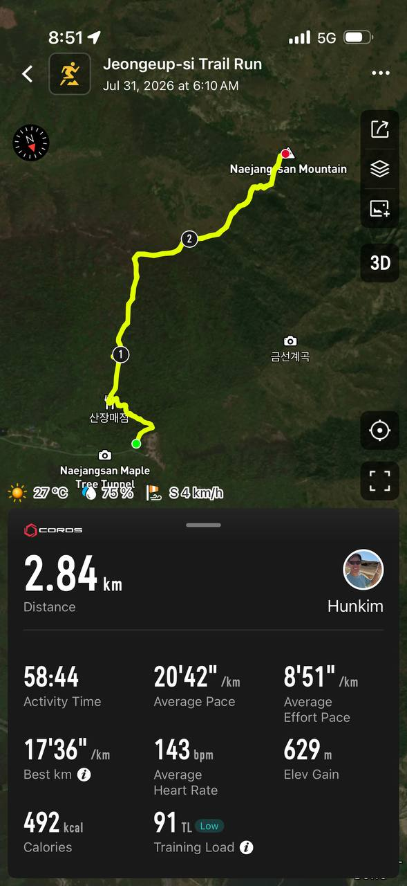
**이미지 캡션:** 이 사진은 스마트폰 화면으로, "Jeongeup-si Trail Run"이라는 제목의 트레일 러닝 기록을 보여준다. 화면 상단에는 날짜와 시간이 2026년 7월 31일 오전 6시 10분으로 표시되어 있으며, 배터리 잔량과 통신 상태도 함께 나타난다. 지도 위에는 노란색 선으로 표시된 러닝 경로가 보이며, "Naejangsan Mountain"과 "금선계곡", "산장매점" 등의 지명이 표시되어 있다. 지도 오른쪽에는 3D 모드 전환 버튼과 현재 위치를 찾는 버튼 등이 보인다. 화면 하단에는 러닝 기록 요약 정보가 표시되어 있는데, 총 거리 2.84km, 활동 시간 58분 44초, 평균 페이스 20분 42초/km, 최고 페이스 17분 36초/km, 평균 심박수 143bpm, 고도 상승 629m, 칼로리 소모 492kcal, 훈련 부하 91(낮음) 등의 정보가 Coros라는 브랜드의 기기로 측정되었음을 알 수 있다. 화면 오른쪽 하단에는 "Hunkim"이라는 이름과 함께 작은 프로필 사진이 보인다. 전반적으로 야외에서 트레일 러닝을 즐기는 활동적인 분위기를 나타낸다.

### 7월 31일 (금) 15:16 · #DUS 기술이 LG AI Research #EXAONE2 에도 사용되었…

#DUS 기술이 LG AI Research #EXAONE2 에도 사용되었다니 정말 기쁩니다. DUS 정말 좋은 기술입니다!

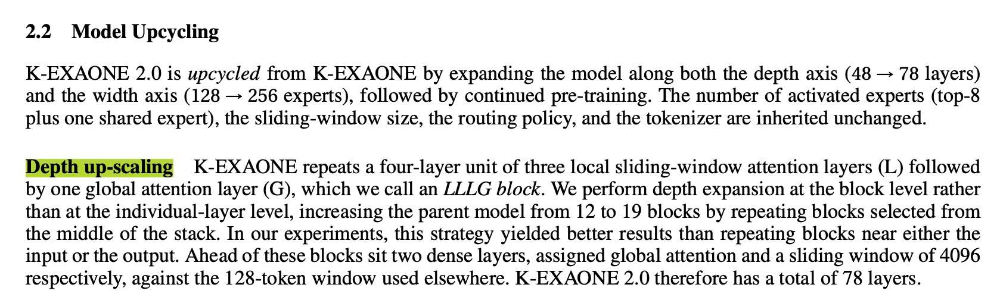
**이미지 캡션:** 이 사진은 컴퓨터 과학 논문의 한 페이지로, "2.2 Model Upcycling"이라는 제목 아래 K-EXAONE 2.0 모델의 업사이클링 방법에 대한 설명이 담겨 있습니다. 텍스트는 두 개의 단락으로 나뉘어 있으며, 첫 번째 단락은 K-EXAONE 2.0이 기존 K-EXAONE 모델을 깊이 축(48에서 78 레이어)과 너비 축(128에서 256 전문가)을 따라 확장하고 지속적인 사전 훈련을 통해 업사이클링되었음을 설명합니다. 활성화된 전문가 수, 슬라이딩 윈도우 크기, 라우팅 정책, 토크나이저는 변경되지 않았다고 언급합니다. 두 번째 단락은 "Depth up-scaling"이라는 제목으로, K-EXAONE이 3개의 지역 슬라이딩 윈도우 어텐션 레이어(L)와 1개의 전역 어텐션 레이어(G)로 구성된 4개 레이어 유닛을 반복하며, 이를 LLLG 블록이라고 부른다고 설명합니다. 이 모델은 개별 레이어 수준이 아닌 블록 수준에서 깊이 확장을 수행하여 부모 모델을 12개에서 19개의 블록으로 확장하며, 이는 스택 중간에서 선택된 블록을 반복함으로써 이루어집니다. 실험 결과, 이 전략은 입력 또는 출력 근처의 블록을 반복하는 것보다 더 나은 결과를 보였으며, 이러한 블록 앞에는 각각 두 개의 밀집 레이어, 할당된 전역 어텐션, 4096개의 슬라이딩 윈도우가 있으며, 이는 다른 곳에서 사용된 128개 토큰 윈도우에 비해 더 큰 값입니다. 따라서 K-EXAONE 2.0은 총 78개의 레이어를 갖습니다. 텍스트의 일부는 형광펜으로 강조 표시되어 있으며, 이는 "Depth up-scaling"이라는 용어입니다. 사진에는 사람이 등장하지 않으며, 배경은 흰색으로, 텍스트는 검은색으로 인쇄되어 있습니다. 전체적으로 학술적인 분위기를 띠고 있습니다.

### 7월 31일 (금) 15:21 · Sung Kim shared a link.

🔗 <https://arxiv.org/abs/2312.15166>

### 7월 31일 (금) 19:36 · LLM은 이제 단순한 코드 생성 능력을 넘어, 모델이 텍스트 기반으로 물…

LLM은 이제 단순한 코드 생성 능력을 넘어, 모델이 텍스트 기반으로 물리 법칙과 시각적 인과관계를 이해하는 것이 중요합니다. #SolarOpen2도 이부분에서 상당한 수준을 보여줍니다. (마지막 무지개는 아쉽네요.)

1. 대포가 블록을 발사해 물리 법칙에 따라 붕괴시키고 자동 재건되는 루프 시뮬레이션.

2. 심해 배경에 물고기 떼, 해파리, 거품이 자동 먹이 루프로 움직이는 캔버스 애니메이션.

3. 섬 풍경이 맑은 날에서 폭풍·번개를 거쳐 무지개로 자동 전환되는 날씨 순환 애니메이션.

🎬 동영상 3개 (생략)
