# 2026년 8월

[← 2026년](README.md)

### 8월 1일 (토) 09:33 · 2주간 사용해보신다음 #SolarOpen2 가 "한국어에 가장 강한 최상…

2주간 사용해보신다음 #SolarOpen2 가 "한국어에 가장 강한 최상위권 코딩 모델" 이라고 말씀주셔서 너무 좋습니다. Solar 많이 사용해주셔요!

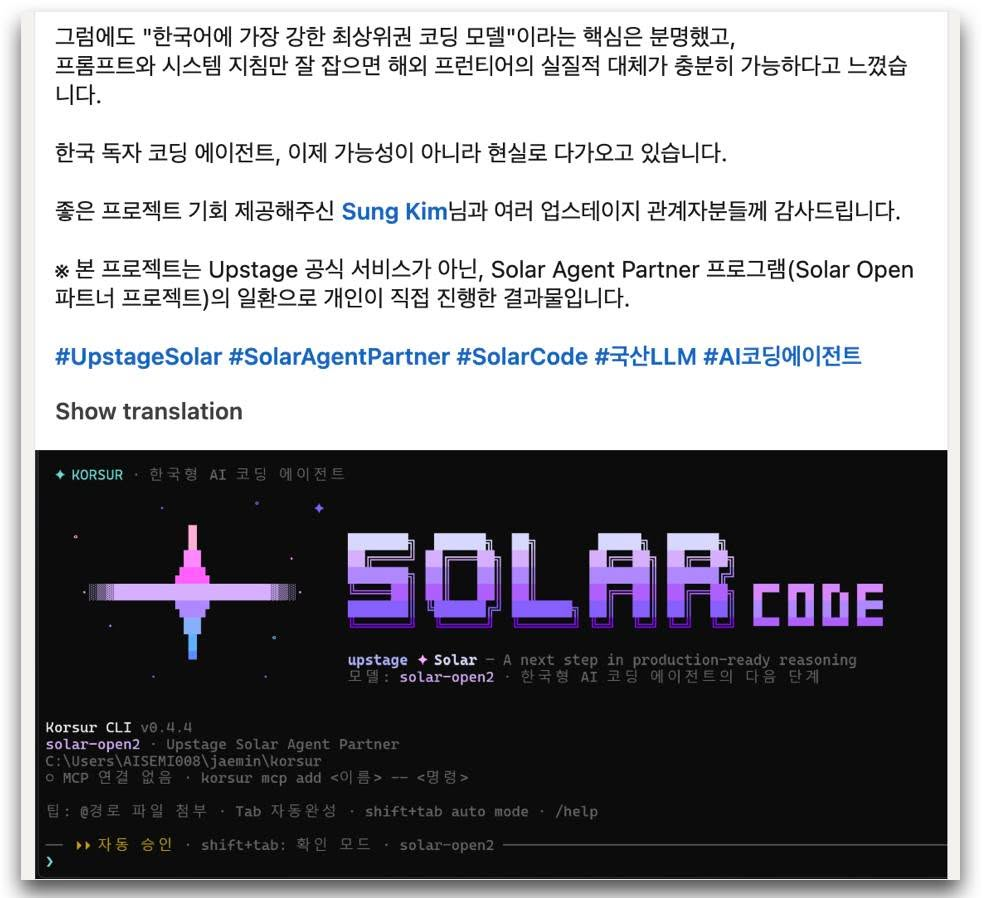
**이미지 캡션:** 이 사진은 컴퓨터 화면의 일부를 캡처한 것으로, 검은색 배경에 보라색과 분홍색 톤의 그래픽과 텍스트가 표시됩니다. 화면 상단에는 한국어로 작성된 글이 있으며, "한국어에 가장 강한 최상위권 코딩 모델"이라는 문구가 눈에 띕니다. 그 아래에는 "한국 독자 코딩 에이전트, 이제 가능성이 아니라 현실로 다가오고 있습니다."라는 문장과 함께 "Sung Kim님"이라는 이름이 언급됩니다. 또한, "Upstage 공식 서비스가 아닌, Solar Agent Partner 프로그램"에 대한 설명도 있습니다. 화면 중앙에는 "#UpstageSolar #SolarAgentPartner #SolarCode #국산LLM #AI코딩에이전트"와 같은 해시태그가 보이며, "Show translation"이라는 버튼도 있습니다. 화면 하단에는 "KORSUR"이라는 로고와 함께 "한국형 AI 코딩 에이전트"라는 문구가 있고, "SOLAR CODE"라는 큰 글씨의 그래픽이 중앙에 배치되어 있습니다. 그 아래에는 "Upstage + Solar - A next step in production-ready reasoning"이라는 영어 문구와 함께 "모델: solar-open2 · 한국형 AI 코딩 에이전트의 다음 단계"라는 한국어 설명이 있습니다. 가장 하단에는 커맨드 라인 인터페이스(CLI)의 일부로 보이는 텍스트가 표시되며, 파일 경로, 명령어, 옵션 등이 나타납니다. 전반적으로 AI 코딩 에이전트와 관련된 프로젝트 발표 또는 소개 자료의 일부로 보이며, 기술적인 내용을 담고 있습니다.

### 8월 1일 (토) 09:33 · Sung Kim shared a link.

🔗 <https://www.linkedin.com/posts/jaemin-jo-1497771b7_upstagesolar-solaragentpartner-solarcode-share-7488964437932957696-SzDM/?utm_source=social_share_send&utm_medium=member_desktop_web&rcm=ACoAADzeNHkBXtkXFhN7G3bsn5sIlingbcZtsUE>

### 8월 1일 (토) 21:03 · #독파모2차 #SolarOpen2 API 7월 Closed 베타 기간 동…

#독파모2차 #SolarOpen2 API 7월 Closed 베타 기간 동안 J 커브  토큰 사용 결과가 나왔습니다! 사용해보시고 좋아서 더 많이 사용해주신 덕분이라고 생각합니다.

8월 3일 오후 6시에 “solar-open2” 베타 서비스가 종료됩니다. 기존 베타 참여자분들은 “solar-pro4”로 모델명을 변경하시면, 더 안정되고 더 고도화된 Solar 사용이 가능합니다.

조금더 테스트를 거친후 8월중 “solar-pro4” 전체 공개 예정입니다. 기대해주세요!

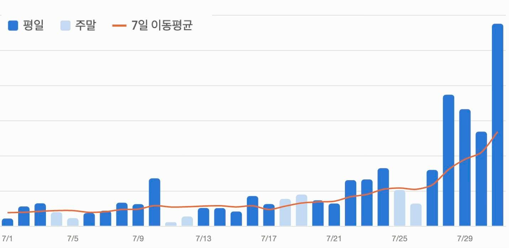
**이미지 캡션:** 이 이미지는 7월 1일부터 7월 29일까지의 데이터를 보여주는 막대 그래프와 꺾은선 그래프입니다. 그래프의 제목은 보이지 않지만, 범례에는 '평일', '주말', '7일 이동평균'이라고 표시되어 있습니다. 파란색 막대는 평일을, 연한 파란색 막대는 주말을 나타내는 것으로 보이며, 꺾은선 그래프는 7일 이동평균을 나타냅니다. x축에는 날짜가 7/1, 7/5, 7/9, 7/13, 7/17, 7/21, 7/25, 7/29 순서로 표시되어 있습니다. 그래프는 전반적으로 7월 중순 이후부터 데이터가 증가하는 추세를 보이며, 특히 7월 말에 급격한 상승을 나타냅니다. 이 그래프는 특정 지표의 일별, 주말별 수치와 그 추세를 시각적으로 보여주며, 데이터 분석이나 추세 파악에 유용합니다.

### 8월 1일 (토) 22:10 · #SolarOpen2 "AI가 상품 통합 방안을 제안해 주는데요, 생각보…

#SolarOpen2 "AI가 상품 통합 방안을 제안해 주는데요, 생각보다 잘 되고 유용합니다."

특히 소상공인에게 도움이 될 수 있다니 너무 좋습니다. 많이 사용해주세요.

### 8월 2일 (일) 21:52 · Sung Kim shared a link.

🔗 <https://joungna.github.io/facebook-archive/>

### 8월 2일 (일) 21:52 · Sung Kim shared a link.

🔗 <https://joungna.github.io/facebook-archive/>

### 8월 3일 (월) 13:53 · #SolarPro4 가 옵니다! Open2 대비 문서 작업, 터미널 수행…

#SolarPro4 가 옵니다! Open2 대비 문서 작업, 터미널 수행, 그리고 멀티턴 도구 사용에서 20~30% 성능 향상이 있었습니다. 그래서 작은 사이즈지만 정말 쓸 만한 좋은 모델입니다. 기존 “solar-open2” 베타 사용자들은 모델명을 “solar-pro4”로 바꿔주시면 됩니다.

#SolarPro4 API는 8월 6일 전체에게 오픈됩니다. https://console.upstage.ai/ 에서 뵙겠습니다.

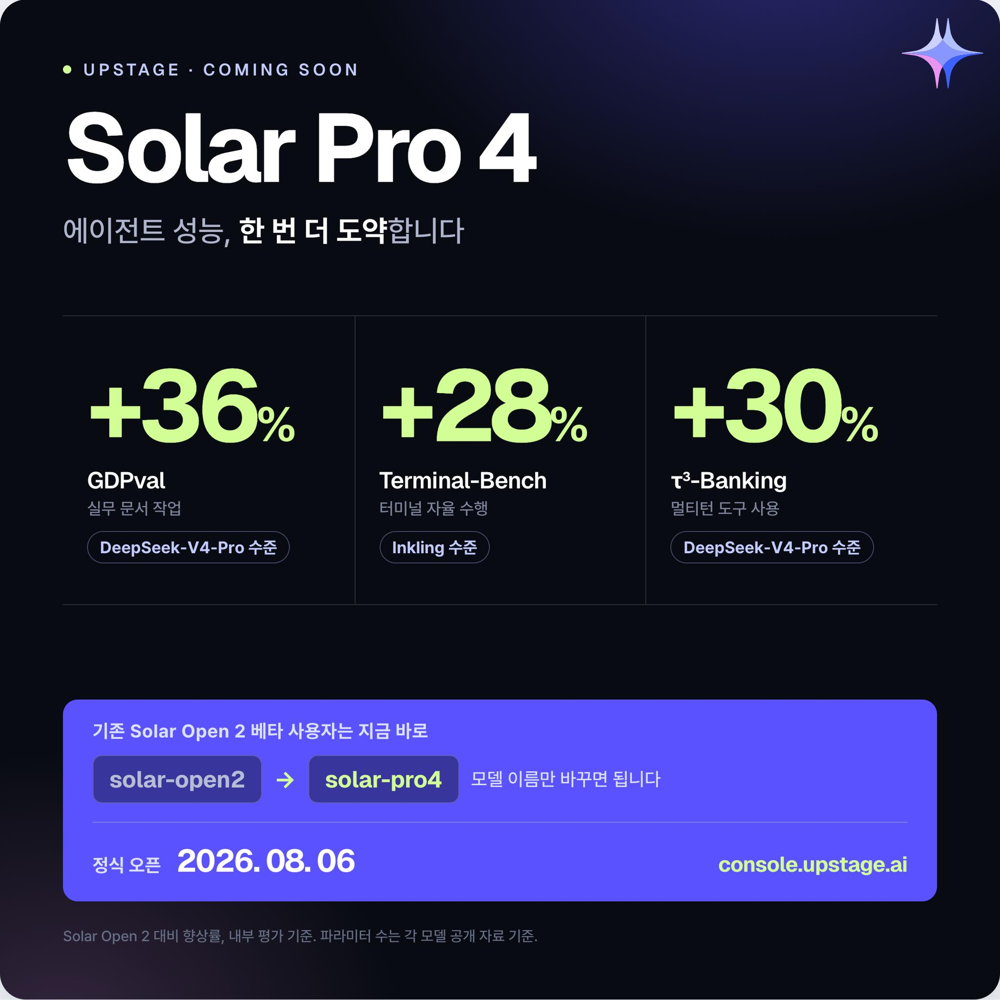
**이미지 캡션:** 어두운 배경에 UPSTAGE COMING SOON이라는 문구와 함께 Solar Pro 4라는 제목이 크게 표시되어 있으며, 그 아래에는 "에이전트 성능, 한 번 더 도약합니다"라는 문구가 있습니다. 화면 중앙에는 세 개의 섹션으로 나뉘어 각각 +36%, +28%, +30%라는 성능 향상률을 보여주고 있으며, 각 섹션에는 GDPval, Terminal-Bench, τ³-Banking이라는 항목과 함께 해당 성능 향상률이 어떤 작업(실무 문서 작업, 터미널 자율 수행, 멀티턴 도구 사용)에 대한 것인지, 그리고 DeepSeek-V4-Pro 수준, Inkling 수준이라는 비교 기준이 명시되어 있습니다. 하단에는 보라색 배경의 영역이 있으며, "기존 Solar Open 2 베타 사용자는 지금 바로 solar-open2 → solar-pro4 모델 이름만 바꾸면 됩니다"라는 안내와 함께 "정식 오픈 2026.08.06"이라는 날짜가 표시되어 있습니다. 또한, "console.upstage.ai"라는 웹사이트 주소와 함께 "Solar Open 2 대비 향상률, 내부 평가 기준. 파라미터 수는 각 모델 공개 자료 기준."이라는 설명이 하단에 작게 기재되어 있습니다. 전체적으로 새로운 AI 모델인 Solar Pro 4의 출시를 알리고 성능 향상을 강조하는 홍보성 이미지입니다.

### 8월 3일 (월) 18:10 · #SolarPro4 먼저 사용해보기

#SolarPro4 먼저 사용해보기

https://loomm.ai/ 데스크탑 AI 에이전트를 설치하시면 #SolarPro4 가 기본 모델로 장착되어 있습니다.

바로 테스트 해보셔요.

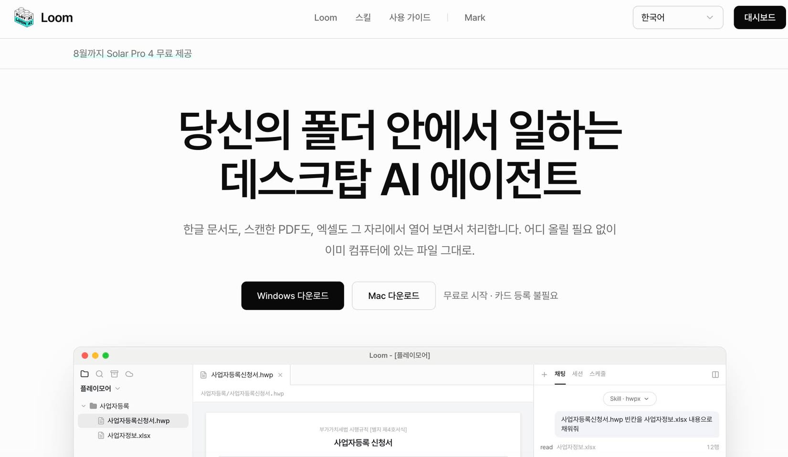
**이미지 캡션:** 이 이미지는 "Loom"이라는 이름의 데스크탑 AI 에이전트 소프트웨어를 홍보하는 웹사이트의 일부를 보여줍니다. 화면 중앙에는 "당신의 폴더 안에서 일하는 데스크탑 AI 에이전트"라는 큰 제목이 있으며, 그 아래에는 "한글 문서도, 스캔한 PDF도, 엑셀도 그 자리에서 열어 보면서 처리합니다. 어디 올릴 필요 없이 이미 컴퓨터에 있는 파일 그대로."라는 설명 문구가 있습니다. 화면 상단에는 "Loom", "스킬", "사용 가이드", "Mark" 등의 메뉴와 "한국어" 언어 선택 드롭다운, "대시보드" 버튼이 보입니다. 또한 "8월까지 Solar Pro 4 무료 제공"이라는 프로모션 문구도 있습니다. 화면 중앙 하단에는 "Windows 다운로드"와 "Mac 다운로드" 버튼이 있으며, "무료로 시작·카드 등록 불필요"라는 문구가 함께 표시됩니다. 하단에는 Loom 소프트웨어의 인터페이스를 시뮬레이션한 화면이 보이며, 파일 탐색기 창에는 "사업자등록" 폴더와 그 안에 "사업자등록신청서.hwp", "사업자정보.xlsx" 파일이 나열되어 있습니다. 또한 채팅 인터페이스처럼 보이는 부분에는 "사업자등록신청서.hwp 빈칸을 사업자정보.xlsx 내용으로 채워줘"라는 사용자의 요청과 함께 "사업자등록 신청서"라는 문서 내용이 일부 표시되어 있습니다. 전반적으로 깔끔하고 현대적인 디자인이며, 사용자가 컴퓨터에 있는 파일을 AI 에이전트를 통해 쉽게 관리하고 처리할 수 있다는 점을 강조하는 분위기입니다.
 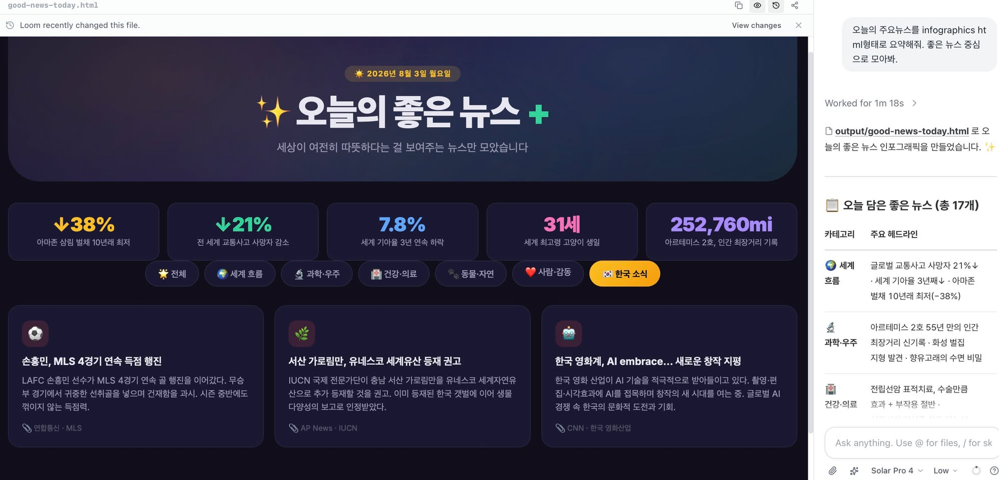
**이미지 캡션:** 이 이미지는 "오늘의 좋은 뉴스"라는 제목의 웹페이지를 보여주며, 2026년 8월 3일 월요일에 게시되었음을 나타냅니다. 페이지는 어두운 배경에 밝은 색상의 텍스트와 아이콘으로 구성되어 있으며, 긍정적인 뉴스 기사들을 요약하여 제공합니다. 상단에는 "오늘의 좋은 뉴스 +"라는 큰 제목과 함께 "세상이 여전히 따뜻하다는 걸 보여주는 뉴스만 모았습니다"라는 부제가 있습니다. 그 아래에는 주요 통계 수치들이 강조되어 표시되는데, 아마존 삼림 벌채 10년래 최저(-38%), 전 세계 교통사고 사망자 감소(-21%), 세계 기아율 3년 연속 하락(-7.8%), 세계 최고령 고양이 생일(31세), 아르테미스 2호 인간 최장거리 기록(252,760마일) 등이 있습니다. 각 통계 아래에는 관련 카테고리 아이콘과 함께 "전체", "세계 흐름", "과학·우주", "건강·의료", "동물·자연", "사람·감동", "한국 소식" 등의 탭이 있어 뉴스를 분류하고 있습니다. 페이지 중앙에는 "오늘 담은 좋은 뉴스 (총 17개)"라는 섹션이 있으며, "카테고리"와 "주요 헤드라인"으로 나뉘어 세계, 과학·우주, 건강·의료 분야의 주요 뉴스를 간략하게 보여줍니다. 또한, 손흥민 선수의 MLS 4경기 연속 득점 소식, 서산 가로림만의 유네스코 세계유산 등재 권고 소식, 한국 영화계의 AI 도입을 통한 새로운 창작 지평에 대한 기사도 포함되어 있습니다. 우측 상단에는 "오늘의 주요뉴스를 infographics 형태로 요약해줘. 좋은 뉴스 중심으로 모아봐."라는 텍스트가 있어, 이 페이지가 AI에 의해 생성되었음을 시사합니다. 페이지 하단에는 검색창과 함께 파일 첨부, 명령어 입력 등의 기능이 표시되어 있습니다. 전반적으로 긍정적이고 희망적인 분위기를 전달하는 뉴스 요약 페이지입니다.

### 8월 4일 (화) 12:50 · Sung Kim shared a link.

🔗 <https://x.com/bindureddy/status/2084355533658874302>

### 8월 4일 (화) 12:51 · Sung Kim shared a link.

🔗 <https://x.com/bindureddy/status/2084355533658874302>

### 8월 4일 (화) 14:00 · #3D는 정말 어렵네요. #SolarPro4로 만들어본 3D 테트리스. …

#3D는 정말 어렵네요. #SolarPro4로 만들어본 3D 테트리스. https://solar-3d-tetris.vercel.app/ 한 줄이 아니라 한 면을 채워야 클리어가 되는데 10번 했는데 한 면도 채우지 못했습니다. 익숙하지 않은 것을 하면 뇌가 발전된다던데 매일 한두 게임씩 해서 한 면 클리어를 목표로 해봐야겠습니다.

(한 면 이상 클리어 하신 분 있으시면 댓글로 알려주셔요)

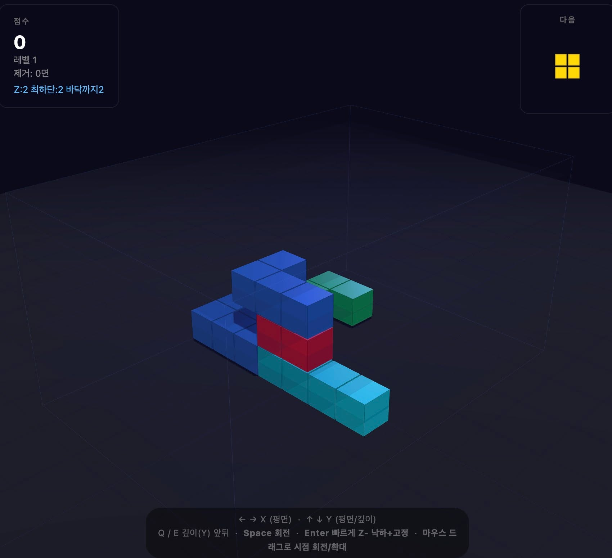
**이미지 캡션:** 어두운 배경의 3D 게임 화면으로, 화면 왼쪽 상단에는 "점수 0", "레벨 1", "제거: 0면", "Z:2 최하단:2 바닥까지2"라는 텍스트가 표시되어 있습니다. 중앙에는 파란색, 빨간색, 청록색, 녹색 블록으로 이루어진 테트리스와 유사한 모양의 3D 구조물이 보입니다. 화면 오른쪽 상단에는 "다음"이라는 텍스트와 함께 노란색 격자 모양의 아이콘이 있습니다. 화면 하단에는 게임 조작법에 대한 텍스트가 나열되어 있으며, "←→ X(평면)", "↑↓ Y(평면/깊이)", "Q/E 깊이(Y) 앞뒤", "Space 회전", "Enter 빠르게 Z- 낙하+고정", "마우스 드래그로 시점 회전/확대" 등의 내용이 포함되어 있습니다. 전체적으로 게임 플레이 화면으로 보이며, 사용자는 블록을 조작하여 게임을 진행하는 것으로 추정됩니다.

### 8월 5일 (수) 11:54 · #SolarPro4 먼저사용해보기! 모든 AI Agent를 하나의 경험으…

#SolarPro4 먼저사용해보기! 모든 AI Agent를 하나의 경험으로 드리는 https://timelyai.io Chat 그리고 Agent에서 바로 #SolarPro4 를 만나 보셔요. 정말 좋은 모델입니다.

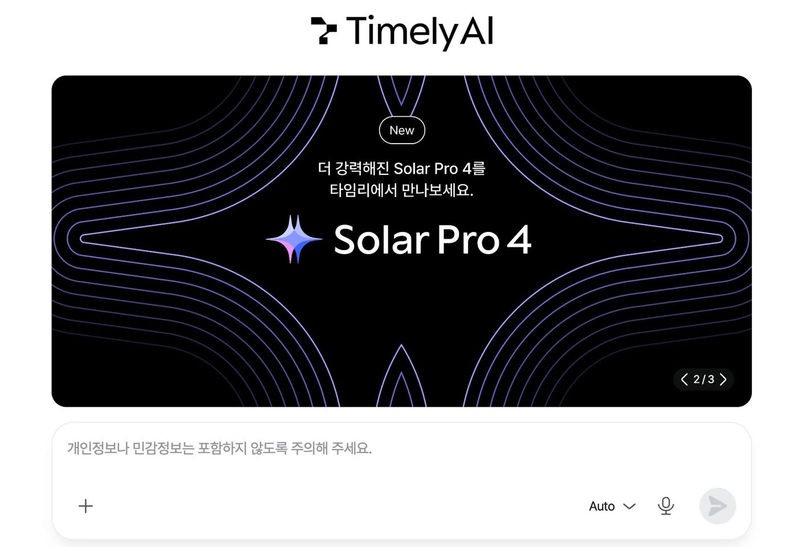
**이미지 캡션:** 이 이미지는 "TimelyAI"라는 로고와 함께 "더 강력해진 Solar Pro 4를 타임리에서 만나보세요."라는 문구가 적힌 광고 배너를 보여줍니다. 배너는 검은색 배경에 보라색의 추상적인 선으로 이루어진 디자인을 특징으로 하며, "Solar Pro 4"라는 제품명이 중앙에 크게 표시되어 있습니다. "New"라는 작은 태그가 "Solar Pro 4" 위에 붙어 있습니다. 배너 하단에는 페이지 번호 "<2/3>"가 표시되어 있어 여러 페이지 중 두 번째 페이지임을 알 수 있습니다. 배너 아래에는 "개인정보나 민감정보는 포함하지 않도록 주의해 주세요."라는 안내 문구가 있으며, 그 아래에는 입력창과 함께 "Auto", 마이크 아이콘, 전송 아이콘이 보입니다. 이 이미지는 새로운 제품인 Solar Pro 4를 홍보하는 온라인 광고의 일부로 보이며, 전체적으로 현대적이고 기술적인 분위기를 풍깁니다.
 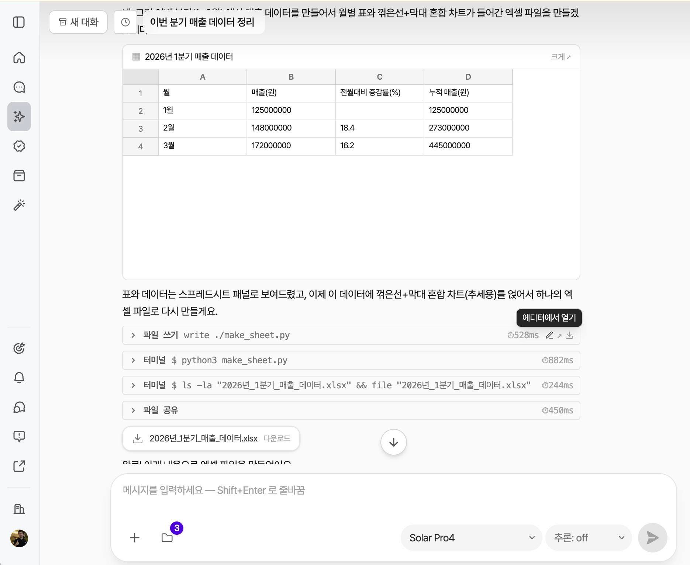
**이미지 캡션:** 화면 중앙에는 '2026년 1분기 매출 데이터'라는 제목의 스프레드시트가 표시되어 있으며, A열에는 월, B열에는 매출(원), C열에는 전월대비 증감률(%), D열에는 누적 매출(원)이 기재되어 있습니다. 스프레드시트 아래에는 '표와 데이터는 스프레드시트 패널로 보여드렸고, 이제 이 데이터에 꺾은선+막대 혼합 차트(추세용)를 얹어서 하나의 엑셀 파일로 다시 만들게요.'라는 설명과 함께 '파일 쓰기', '터미널' 명령어 실행 결과, '파일 공유', '다운로드' 등의 작업 내용이 나열되어 있습니다. 화면 왼쪽에는 여러 아이콘이 있는 사이드바가 있으며, 하단에는 'Solar Pro4'라는 이름과 '추론: off'라는 설정이 보입니다. 전체적으로 코딩 또는 데이터 관련 작업을 진행하는 화면으로 보입니다.

### 8월 5일 (수) 16:50 · "Solar Pro 4 / DeepSeek / GPT Luna / Gro…

"Solar Pro 4 / DeepSeek / GPT Luna / Grok 4.5 맞대결 결과는?" 배움의 달인님의 재미있는 비교 영상. https://www.youtube.com/watch?v=UdttU-Xd2gA 재미있습니다. 

#SolarPro4 속도느린것은 GPU부족 때문인데 내일부터 확 늘어 납니다.

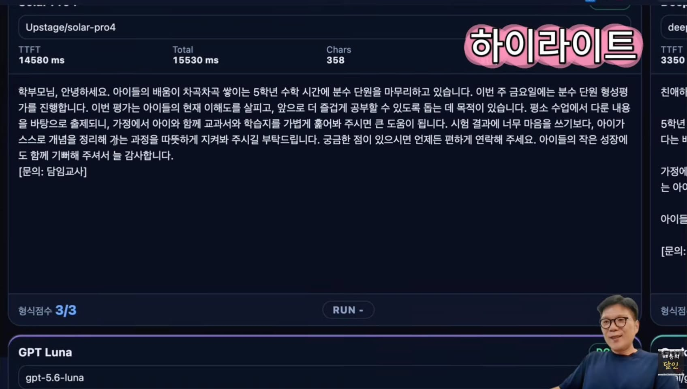
**이미지 캡션:** 화면 오른쪽 하단에는 안경을 쓰고 파란색 티셔츠를 입은 중년 남성이 웃으며 카메라를 바라보고 있으며, 그의 머리 위에는 "배움의 달인"이라는 문구가 적힌 스티커가 붙어 있습니다. 화면 중앙에는 "하이라이트"라는 분홍색 글씨가 쓰여 있고, 그 아래에는 "학부모님, 안녕하세요. 아이들의 배움이 차곡차곡 쌓이는 5학년 수학 시간에 분수 단원을 마무리하고 있습니다. 이번 주 금요일에는 분수 단원 형성평가를 진행합니다. 이번 평가는 아이들의 현재 이해도를 살피고, 앞으로 더 즐겁게 공부할 수 있도록 돕는 데 목적이 있습니다. 평소 수업에서 다룬 내용을 바탕으로 출제되니, 가정에서 아이와 함께 교과서와 학습지를 가볍게 훑어봐 주시면 큰 도움이 됩니다. 시험 결과에 너무 마음을 쓰기보다, 아이가 스스로 개념을 정리해 가는 과정을 따뜻하게 지켜봐 주시길 부탁드립니다. 궁금한 점이 있으시면 언제든 편하게 연락해 주세요. 아이들의 작은 성장에 도 함께 기뻐해 주셔서 늘 감사합니다. [문의: 담임교사]"라는 내용의 글이 보입니다. 화면 상단에는 "Upstage/solar-pro4"라는 텍스트와 함께 TTFT, Total, Chars 수치가 표시되어 있으며, 오른쪽에는 "deep"이라는 텍스트와 함께 TTFT 수치가 보입니다. 화면 하단에는 "형식점수 3/3", "GPT Luna", "gpt-5.6-luna"라는 텍스트와 "RUN -" 버튼이 있습니다. 전반적으로 교육 관련 정보와 함께 긍정적이고 친근한 분위기를 나타냅니다.

### 8월 5일 (수) 20:21 · 📷 사진 (1장)

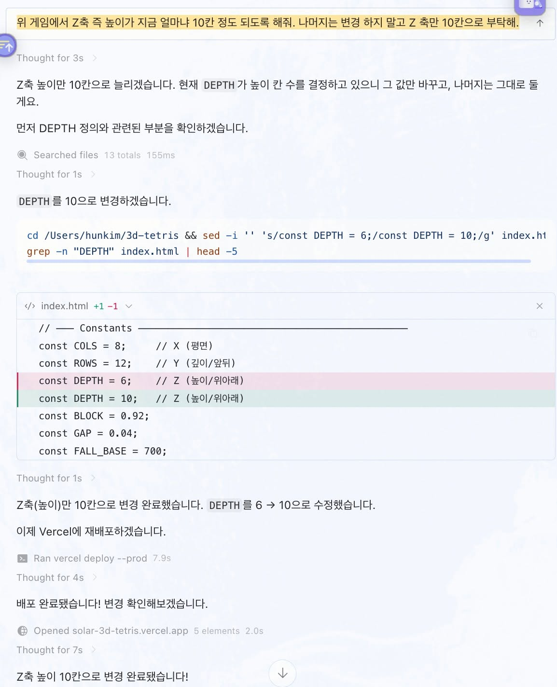
**이미지 캡션:** 화면은 컴퓨터 코드를 편집하고 실행하는 개발 환경을 보여준다. 상단에는 한국어로 작성된 텍스트가 있는데, "위 게임에서 Z축 즉 높이가 지금 얼마냐 10칸 정도 되도록 해줘. 나머지는 변경 하지 말고 Z 축만 10칸으로 부탁해."라고 쓰여 있어 게임의 Z축 높이를 10칸으로 조절해달라는 요청임을 알 수 있다. 그 아래에는 "Thought for 3s"라는 텍스트와 함께 Z축 높이를 10칸으로 늘리고 현재 DEPTH 값이 높이 칸 수를 결정하므로 해당 값을 수정하겠다는 내용이 이어진다. 이후 DEPTH 정의와 관련된 부분을 확인하고, `sed` 명령어를 사용하여 `index.html` 파일에서 `const DEPTH = 6;`을 `const DEPTH = 10;`으로 변경하는 코드가 보인다. 이어서 `index.html` 파일의 일부 코드가 표시되는데, `const DEPTH = 6;` 라인이 분홍색으로 강조되어 있고 바로 아래 `const DEPTH = 10;` 라인이 초록색으로 표시되어 변경되었음을 시각적으로 보여준다. 코드 아래에는 "Z축(높이)만 10칸으로 변경 완료했습니다. DEPTH를 6→ 10으로 수정했습니다. 이제 Vercel에 재배포하겠습니다."라는 텍스트가 나타나고, Vercel 배포가 진행되는 과정과 완료 메시지가 이어진다. 마지막으로 "Z축 높이 10칸으로 변경 완료됐습니다!"라는 최종 확인 메시지가 보인다. 전반적으로 개발자가 게임의 특정 설정을 변경하고 배포하는 과정을 기록한 화면이다.

### 8월 6일 (목) 11:51 · #SolarPro4 정식 오픈! 업스테이지 콘솔에서 바로 키를 받으신 다…

#SolarPro4 정식 오픈! 업스테이지 콘솔에서 바로 키를 받으신 다음, API로, Hermes Agent, 클로드코드 등, 그리고 Agent Chat 데모를 통해 바로 사용 가능합니다. 8월 10일까지 무료입니다.

#SolarPro4는 불과 몇 달 만에 #SolarPro3 대비 최대 4.8배 성능 향상이 있었습니다. 이 속도면 곧 Kimi, Qwen, DeekSeek 부럽지 않은 성능으로 업업업 할 수 있을 것 같습니다.

많은 사용 부탁드립니다.

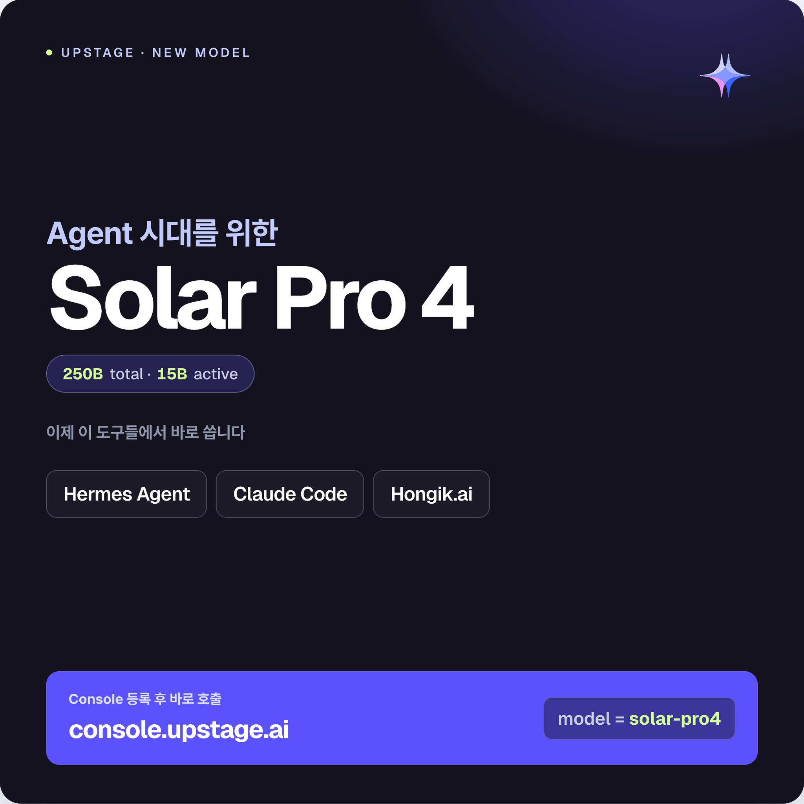
**이미지 캡션:** 이 이미지는 어두운 배경에 UPSTAGE의 새로운 모델인 "Solar Pro 4"를 홍보하는 그래픽 디자인입니다. 화면 상단에는 작은 점과 함께 "UPSTAGE · NEW MODEL"이라는 텍스트가 표시되어 있습니다. 중앙에는 "Agent 시대를 위한"이라는 문구와 함께 크고 굵은 글씨로 "Solar Pro 4"가 강조되어 있습니다. 그 아래에는 "250B total · 15B active"라는 텍스트가 표시되어 모델의 규모를 나타냅니다. 이어서 "이제 이 도구들에서 바로 씁니다"라는 문구가 있으며, 그 아래에는 "Hermes Agent", "Claude Code", "Hongik.ai"라는 세 개의 버튼 또는 링크가 나란히 배치되어 있습니다. 화면 하단에는 보라색 배경에 "Console 등록 후 바로 호출"이라는 안내 문구와 함께 웹사이트 주소 "console.upstage.ai"가 표시되어 있으며, 오른쪽에는 "model = solar-pro4"라는 텍스트가 있습니다. 이미지 오른쪽 상단에는 별 모양의 그래픽이 작게 배치되어 있습니다. 전반적으로 현대적이고 기술적인 분위기를 풍기며, 새로운 AI 모델의 출시를 알리는 광고 이미지로 보입니다.
 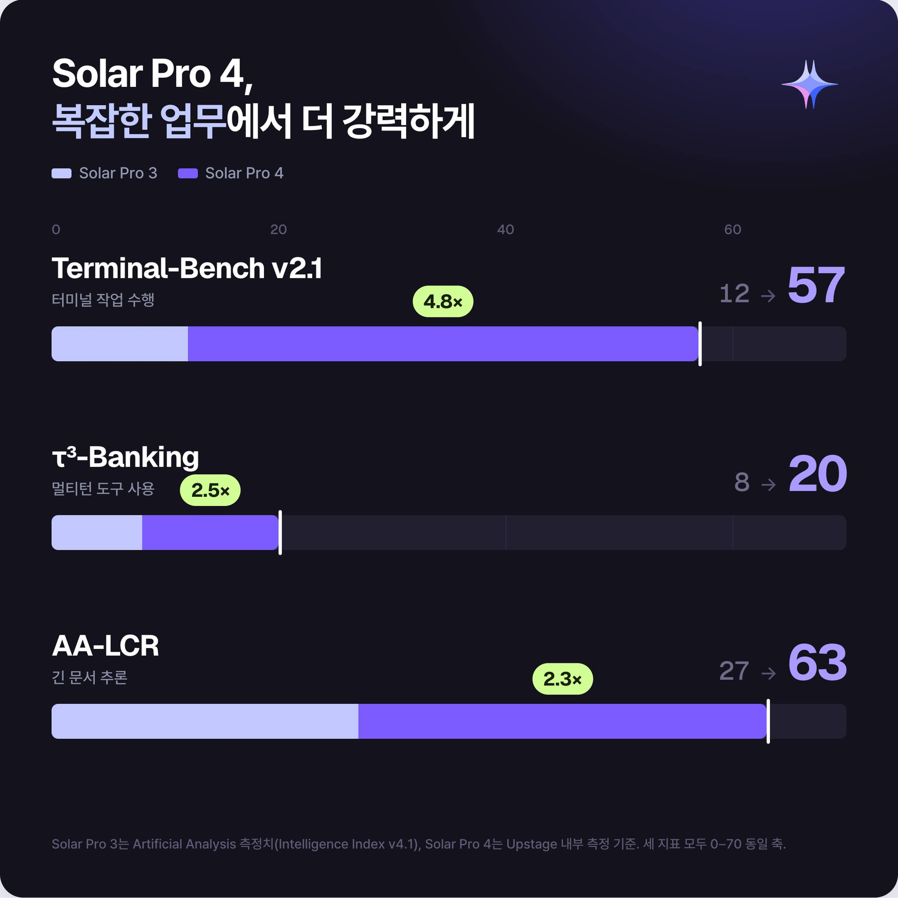
**이미지 캡션:** 이 이미지는 Solar Pro 4가 복잡한 업무에서 더 강력해졌음을 보여주는 그래프입니다. 화면 상단에는 "Solar Pro 4, 복잡한 업무에서 더 강력하게"라는 제목이 흰색으로 쓰여 있고, 오른쪽 상단에는 파란색과 보라색이 섞인 별 모양의 그래픽이 있습니다. 그 아래에는 "Solar Pro 3"와 "Solar Pro 4"를 나타내는 두 개의 색상 막대가 나란히 표시되어 있습니다. 그래프는 세 가지 다른 작업에 대한 성능을 비교하며, 각 작업에는 제목, 설명, 그리고 성능을 나타내는 막대 그래프가 있습니다. 첫 번째 작업은 "Terminal-Bench v2.1"이며, "터미널 작업 수행"이라는 설명과 함께 4.8x라는 수치가 표시되어 있습니다. 이 작업에서 Solar Pro 3는 12에서 57로 성능이 향상되었습니다. 두 번째 작업은 "τ³-Banking"이며, "멀티턴 도구 사용"이라는 설명과 함께 2.5x라는 수치가 표시되어 있습니다. 이 작업에서 Solar Pro 3는 8에서 20으로 성능이 향상되었습니다. 세 번째 작업은 "AA-LCR"이며, "긴 문서 추론"이라는 설명과 함께 2.3x라는 수치가 표시되어 있습니다. 이 작업에서 Solar Pro 3는 27에서 63으로 성능이 향상되었습니다. 그래프의 배경은 어두운 보라색이며, 텍스트는 주로 흰색으로 표시되어 있습니다. 이미지 하단에는 "Solar Pro 3는 Artificial Analysis 측정치(Intelligence Index v4.1), Solar Pro 4는 Upstage 내부 측정 기준. 세 지표 모두 0-70 동일 축."이라는 설명이 흰색으로 작게 쓰여 있습니다. 전체적으로 이 이미지는 Solar Pro 4의 성능 향상을 시각적으로 명확하게 전달하는 데이터 시각화 자료입니다.
 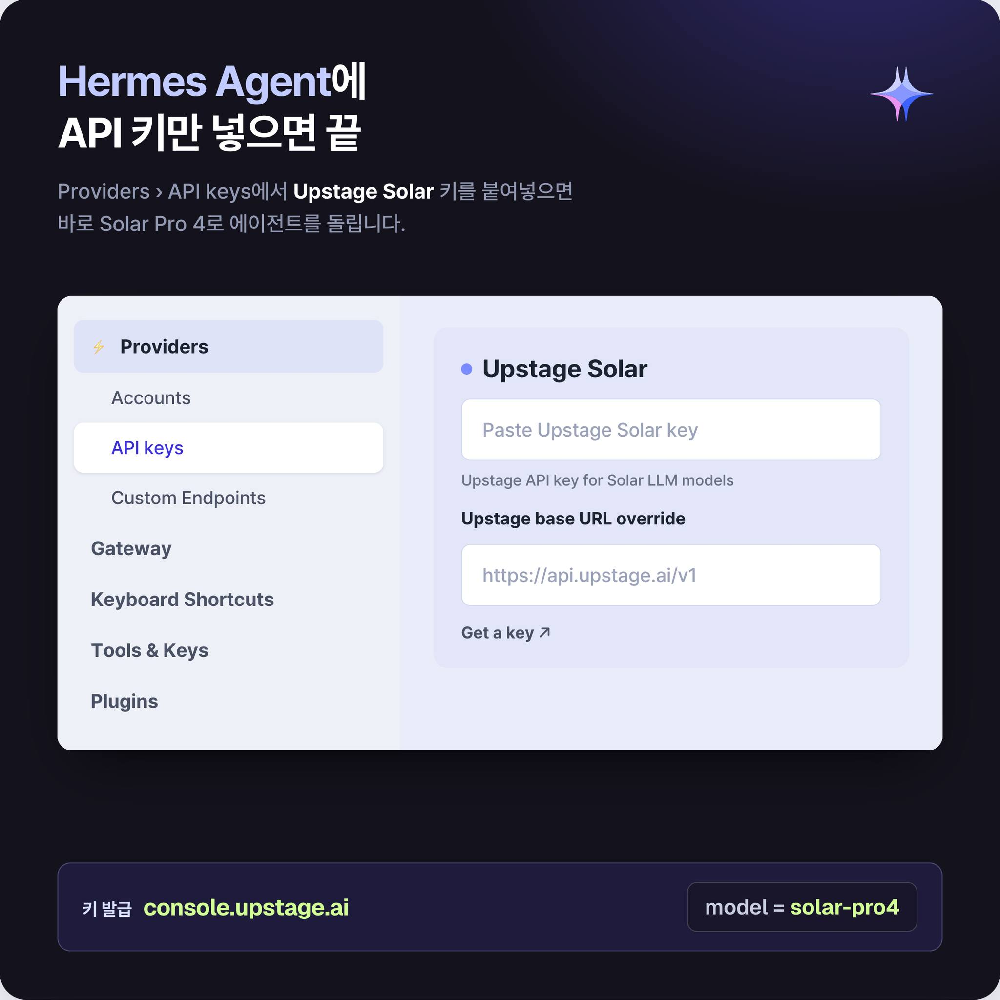
**이미지 캡션:** 이 이미지는 "Hermes Agent에 API 키만 넣으면 끝"이라는 제목과 함께 API 키 설정을 안내하는 웹 인터페이스를 보여줍니다. 화면 중앙에는 두 개의 주요 섹션이 있습니다. 왼쪽 섹션은 "Providers"라는 제목 아래 "Accounts", "API keys", "Custom Endpoints", "Gateway", "Keyboard Shortcuts", "Tools & Keys", "Plugins"와 같은 메뉴 항목을 포함하고 있으며, 현재 "API keys"가 선택되어 강조 표시되어 있습니다. 오른쪽 섹션은 "Upstage Solar"라는 제목으로, "Paste Upstage Solar key"라는 플레이스홀더가 있는 입력란과 "Upstage API key for Solar LLM models"라는 설명이 있습니다. 그 아래에는 "Upstage base URL override"라는 제목과 함께 "https://api.upstage.ai/v1"이 입력된 URL 입력란이 있으며, "Get a key"라는 링크도 보입니다. 화면 하단에는 "키 발급 console.upstage.ai"라는 텍스트와 함께 "model = solar-pro4"라는 정보가 표시됩니다. 전체적으로 어두운 배경에 밝은 색상의 UI 요소들이 배치되어 있으며, 상단에는 별 모양의 그래픽이 있습니다. 이 인터페이스는 사용자가 Upstage Solar API 키를 입력하여 Solar Pro 4 모델을 Hermes Agent에서 사용할 수 있도록 설정하는 과정을 안내하는 것으로 보입니다.
 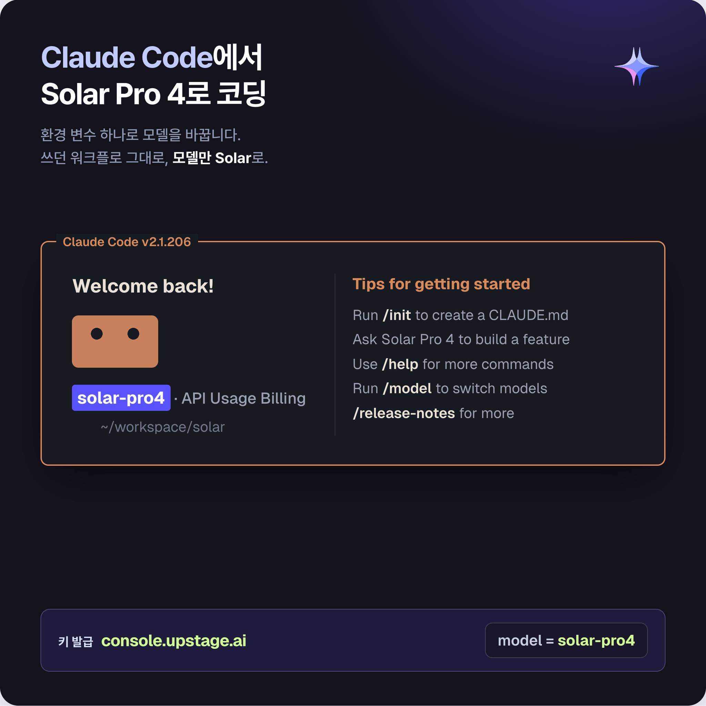
**이미지 캡션:** 이 이미지는 어두운 배경에 밝은 색상의 텍스트와 그래픽 요소가 배치된 웹사이트 또는 애플리케이션의 스크린샷입니다. 상단에는 "Claude Code에서 Solar Pro 4로 코딩"이라는 제목과 함께 "환경 변수 하나로 모델을 바꿉니다. 쓰던 워크플로 그대로, 모델만 Solar로."라는 설명 문구가 있습니다. 중앙에는 "Claude Code v2.1.206"이라는 버전 정보와 함께 "Welcome back!"이라는 인사말이 보입니다. 그 아래에는 주황색의 아이콘과 "solar-pro4 API Usage Billing"이라는 텍스트, 그리고 "~/workspace/solar"라는 경로가 표시되어 있습니다. 오른쪽에는 "Tips for getting started"라는 제목 아래 "Run /init to create a CLAUDE.md", "Ask Solar Pro 4 to build a feature", "Use /help for more commands", "Run /model to switch models", "/release-notes for more"와 같은 시작 팁들이 나열되어 있습니다. 하단에는 "키 발급 console.upstage.ai"라는 텍스트와 함께 "model = solar-pro4"라는 설정 값이 표시되어 있습니다. 전체적으로 개발자 도구 또는 API 관련 서비스의 인터페이스로 보이며, 깔끔하고 현대적인 디자인을 가지고 있습니다.
 
**이미지 캡션:** 이 이미지는 "One more thing"이라는 문구와 함께 "홍익(弘益), Making AI Beneficial"이라는 제목을 보여줍니다. 이는 "널리 인간을 이롭게 한다"는 뜻이며, Solar Pro 4를 누구나 로그인 없이 바로 사용할 수 있도록 열어두었다는 설명이 이어집니다. "8월 말까지 무료·무제한"이라는 프로모션 문구가 강조되어 있으며, 그 아래에는 Solar Chat 인터페이스의 스크린샷이 보입니다. 이 인터페이스에는 "Hello, what shall we look up?"이라는 질문과 "Ask anything"이라는 입력창이 있으며, "Solar Pro 4"와 "Auto"라는 옵션이 표시됩니다. 하단에는 "로그인 없이 열면 바로 Solar Pro 4가 물려 있습니다."라는 문구와 함께 "지금 바로 체험"이라는 버튼이 있고, 가장 하단에는 "chat.hongik.ai"라는 웹사이트 주소가 보입니다. 전체적으로 AI 서비스 홍보를 위한 웹사이트의 일부로 보이며, 깔끔하고 현대적인 디자인과 함께 긍정적이고 혁신적인 분위기를 풍깁니다.

### 8월 6일 (목) 11:54 · Sung Kim shared a link.

🔗 <https://chat.hongik.ai/>

### 8월 6일 (목) 16:14 · Sung Kim shared a link.

🔗 <https://console.upstage.ai/>

### 8월 7일 (금) 00:04 · #SolarPro4 in #Askup 카톡에서 바로 만날수 있는 AskU…

#SolarPro4 in #Askup 카톡에서 바로 만날수 있는 AskUp에 #SolarPro4 가 탑재되었습니다. 정확한 툴콜로 더 빠르고 정확하게 답변합니다. 아직 친구가 아니신분들 (2번째 이미지) QR로 친구해요!

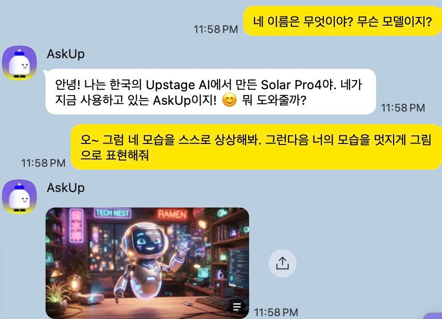
**이미지 캡션:** 이것은 대화형 AI 챗봇 AskUp과의 대화 스크린샷으로, AI 챗봇은 한국어로 소통하고 있으며, 사용자는 AI 챗봇에게 자신의 이름과 모델을 묻고, AI 챗봇은 자신이 Upstage AI에서 만든 Solar Pro4라고 답하며, 사용자는 AI 챗봇에게 자신의 모습을 상상하고 그림으로 표현해달라고 요청합니다. 대화는 11:58 PM에 이루어졌으며, AI 챗봇의 프로필 사진은 귀여운 로봇 아이콘이고, 사용자가 보낸 이미지에는 "TECH NEST"와 "RAMEN"이라는 간판이 있는 미래 지향적인 실내 공간에 서 있는 귀여운 로봇이 그려져 있습니다.
 
**이미지 캡션:** 이 사진은 QR 코드 이미지로, 사람이나 장소, 사물, 텍스트 등 구체적인 시각적 정보는 포함하고 있지 않습니다. QR 코드는 흑백의 작은 사각형 패턴으로 구성되어 있으며, 일반적으로 스마트폰 등으로 스캔하여 특정 웹사이트로 이동하거나 정보를 얻는 데 사용됩니다. 따라서 이 이미지 자체로는 어떠한 분위기나 상황도 파악할 수 없습니다.

### 8월 7일 (금) 08:35 · Sung Kim shared a link.

🔗 <https://github.com/anomalyco/models.dev/blob/dev/providers/upstage/models/solar-pro4.toml>

### 8월 7일 (금) 11:38 · Sung Kim shared a link.

🔗 <https://github.com/can1357/oh-my-pi/pull/7868>

### 8월 7일 (금) 19:02 · 긴 hwp 파일, 이제  과 함께 작업하세요. 무려 127페이지 hwp …

긴 hwp 파일, 이제 https://solar-chat.upstage.ai/ 과 함께 작업하세요. 무려 127페이지 hwp 파일을 읽고 정확한 정보를 찾아오고, 도넛 그래프, 보고서 등을 생성하는 영상 시나리오입니다!

🎬 동영상 1개 (생략)

### 8월 8일 (토) 08:43 · 재미로 보는 #호랑이벤치 요즈음 LLM은 SVG로 어느 정도 이미지를 생…

재미로 보는 #호랑이벤치 요즈음 LLM은 SVG로 어느 정도 이미지를 생성하는 능력을 가지고 있습니다. 이를 이용하여 한글 프롬프트만 보고 조선 민화 까치호랑이를 standalone SVG로 그리고 이를 평가하는 리더보드를 만들어 보았습니다. #SolarPro4도 나름 재미있게 그렸습니다. https://tigerbench.vercel.app/

⚠ Disclaimer: TigerBench는 “한글 프롬프트로 한국의 상징 이미지를 얼마나 잘 그리는가”를 보는 재미 위주의 테스트입니다. 결과는 모델의 일반적인 성능과는 무관할 수 있습니다.

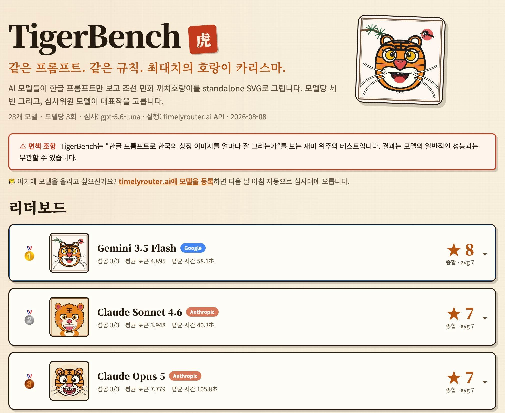
**이미지 캡션:** 화면 상단에는 "TigerBench"라는 제목과 함께 귀여운 호랑이 그림이 있고, 그 아래에는 "같은 프롬프트. 같은 규칙. 최대치의 호랑이 카리스마."라는 문구가 있습니다. 이어서 AI 모델들이 한글 프롬프트만 보고 조선 민화 까치호랑이를 SVG 이미지로 생성하며, 모델당 세 번 그려 심사위원이 대표작을 고른다는 설명이 있습니다. 또한 23개 모델이 참여했고, 모델당 3회 심사가 진행되었으며, 실행 환경과 날짜 정보도 포함되어 있습니다. 화면 중앙에는 면책 조항으로 TigerBench 테스트가 모델의 일반적인 성능과는 무관할 수 있다는 내용과, 모델 등록 안내가 있습니다. 화면 하단에는 "리더보드"라는 제목과 함께 3개의 AI 모델 순위가 표시되어 있습니다. 각 순위에는 모델 이름, 개발사, 성공 횟수, 평균 토큰 수, 평균 시간, 그리고 종합 점수가 별점으로 표시되어 있습니다. 첫 번째 순위는 Gemini 3.5 Flash (Google)로 별 8개, 두 번째 순위는 Claude Sonnet 4.6 (Anthropic)으로 별 7개, 세 번째 순위는 Claude Opus 5 (Anthropic)로 별 7개입니다. 각 모델 옆에는 해당 모델의 아이콘으로 보이는 작은 호랑이 그림이 있습니다. 전반적으로 AI 모델의 이미지 생성 능력을 평가하는 웹사이트의 일부 화면으로 보이며, 밝고 경쾌한 분위기입니다.
 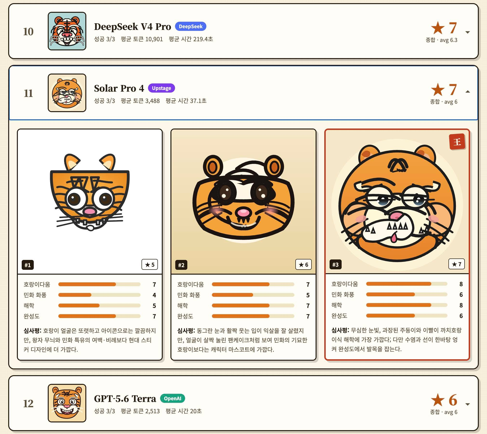
**이미지 캡션:** 이 이미지는 AI 모델의 순위를 보여주는 웹사이트의 일부로, 각 모델의 특징과 평가를 나타내는 카드 형식의 디자인이 특징입니다. 카드에는 모델 이름, 성공률, 평균 토큰 수, 평균 시간 등의 정보가 포함되어 있으며, 각 모델의 특징을 나타내는 귀여운 호랑이 캐릭터 일러스트가 그려져 있습니다. 각 일러스트는 다양한 표정과 스타일로 표현되어 있으며, 모델의 특징을 시각적으로 나타냅니다. 예를 들어, 첫 번째 카드(10번)의 'DeepSeek V4 Pro'는 성공 3/3, 평균 토큰 10,901, 평균 시간 219.4초로 평가되었고, 별 7개 중 7개를 받았습니다. 두 번째 카드(11번)의 'Solar Pro 4'는 성공 3/3, 평균 토큰 3,488, 평균 시간 37.1초로 평가되었으며, 별 7개 중 7개를 받았습니다. 이 카드에는 세 개의 하위 카드도 포함되어 있으며, 각각 '호랑이다움', '민화 화풍', '해학', '완성도'와 같은 항목별 평가와 심사평이 상세하게 기재되어 있습니다. 첫 번째 하위 카드(#1)는 호랑이 얼굴이 또렷하고 아이콘으로 깔끔하지만, 왕자 무늬와 민화 특유의 여백, 비례보다 현대 스티커 디자인에 더 가깝다는 평가를 받았습니다. 두 번째 하위 카드(#2)는 동그란 눈과 활짝 웃는 입이 익살스럽지만, 얼굴이 살짝 눌린 팬케이크처럼 보여 민화의 기묘한 호랑이보다는 캐릭터 마스코트에 가깝다는 평가를 받았습니다. 세 번째 하위 카드(#3)는 무심한 눈빛, 과장된 주둥이와 이빨이 까치호랑이식 해학에 가장 가깝지만, 수염과 선이 완성도에서 발목을 잡는다는 평가를 받았습니다. 마지막으로, 네 번째 카드(12번)의 'GPT-5.6 Terra'는 성공 3/3, 평균 토큰 2,513, 평균 시간 20초로 평가되었고, 별 6개 중 6개를 받았습니다. 전반적으로 이 이미지는 AI 모델의 성능과 특징을 시각적으로 흥미롭게 전달하는 디자인을 보여줍니다.

### 8월 8일 (토) 13:17 · 늘 좋은 글로 인사이트를 나눠 주시는 벤처스퀘어 Myung Seungeu…

늘 좋은 글로 인사이트를 나눠 주시는 벤처스퀘어 Myung Seungeun 대표님께서 #SolarPro4를 직접 써보시고 의견을 남겨 주셨습니다.

#SolarPro4 가 아직 부족한 점이 있지만, 결론적으로 '우수하다'는 평을 해 주셔서 기쁩니다. 부족한 부분을 더 개선해 모두를 위한 AI로 나아가겠습니다. 많이 사용해 주세요. 감사합니다.

### 8월 10일 (월) 10:39 · Upstage의 창업 모토는 'Making AI Beneficial', …

Upstage의 창업 모토는 'Making AI Beneficial', 즉 모두에게 이로운 AI를 만들자는 것이었습니다. 그 정신으로 모두에게 열려 있는 https://chat.hongik.ai/ 이미 많은 분이 사용하시고 좋다고 말씀해 주고 계십니다. 즐겨찾기해 두시고 자주 사용해주세요.

**이미지 캡션:** 어두운 배경에 밝은 색상의 텍스트와 그래픽이 배치된 이미지로, "One more thing"이라는 문구와 함께 "홍익(弘益), Making AI Beneficial"이라는 제목이 크게 쓰여 있습니다. 그 아래에는 "널리 인간을 이롭게 한다는 뜻입니다. Solar Pro 4를 누구나 로그인 없이 바로 써볼 수 있게 열어뒀습니다."라는 설명 문구가 있습니다. 또한 "8월 말까지 무료·무제한"이라는 프로모션 문구가 강조되어 있습니다. 이미지 중앙에는 AI 챗봇 인터페이스가 보이는데, "Solar Chat"이라는 이름과 함께 "Hello, what shall we look up?"이라는 질문이 표시되어 있으며, "Ask anything"이라는 입력창이 있습니다. 하단에는 "로그인 없이 열면 바로 Solar Pro 4가 물려 있습니다."라는 안내 문구와 함께 "지금 바로 체험"이라는 버튼이 있고, 오른쪽 하단에는 "chat.hongik.ai"라는 웹사이트 주소가 표시되어 있습니다. 전체적으로 AI 서비스 홍보를 위한 깔끔하고 현대적인 디자인의 배너 이미지입니다.

### 8월 11일 (화) 09:30 · #SolarPro4를 #OpenRouter (90% 할인)와 #Herme…

#SolarPro4를 #OpenRouter (90% 할인)와 #Hermes (일주일간 무료)에서 만나보세요. OpenRouter를 사용하신다면 지금 바로 모델명만 'upstage/solar-pro4'로 바꾸어 사용하시면 됩니다. Hermes Nous Portal에서 무료 모델들 가운데 'upstage/solar-pro4' 를 사용하시면 오늘 밤 10시부터 일주일간 무료 사용이 가능합니다.

글로벌에서 사용하는 SolarPro4, 함께 많이 사용해주세요.

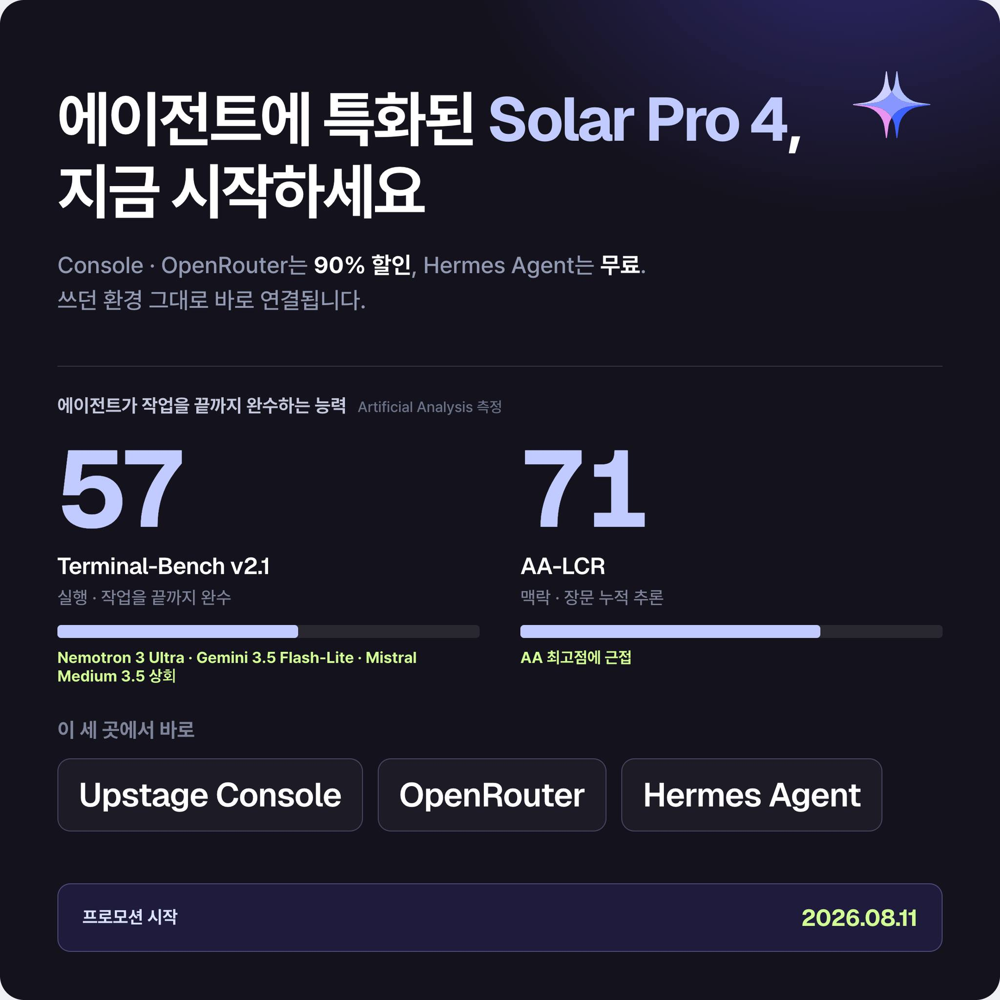
**이미지 캡션:** 이 이미지는 어두운 배경에 밝은 글씨로 구성된 광고 또는 정보성 이미지로, "에이전트에 특화된 Solar Pro 4, 지금 시작하세요"라는 문구가 가장 눈에 띕니다. 그 아래에는 "Console · OpenRouter는 90% 할인, Hermes Agent는 무료. 쓰던 환경 그대로 바로 연결됩니다."라는 내용이 이어집니다. 이미지 중앙에는 두 개의 성능 지표가 제시되어 있는데, 왼쪽에는 "Terminal-Bench v2.1"이라는 항목과 함께 57이라는 숫자가 표시되어 있으며, "실행·작업을 끝까지 완수"라는 설명과 함께 "Nemotron 3 Ultra · Gemini 3.5 Flash-Lite · Mistral Medium 3.5 상회"라는 세부 정보가 있습니다. 오른쪽에는 "AA-LCR"이라는 항목과 71이라는 숫자가 있으며, "맥락·장문 누적 추론"이라는 설명과 함께 "AA 최고점에 근접"이라는 문구가 있습니다. 하단에는 "이 세 곳에서 바로"라는 문구와 함께 "Upstage Console", "OpenRouter", "Hermes Agent"라는 세 개의 버튼 또는 링크가 나열되어 있습니다. 가장 하단에는 "프로모션 시작"이라는 문구와 함께 "2026.08.11"이라는 날짜가 표시되어 있습니다. 이미지 상단 오른쪽에는 별 모양의 그래픽이 있습니다. 전체적으로 기술적인 제품이나 서비스의 홍보를 위한 것으로 보이며, 성능 수치와 할인 정보를 강조하여 사용자들의 관심을 유도하고 있습니다.
 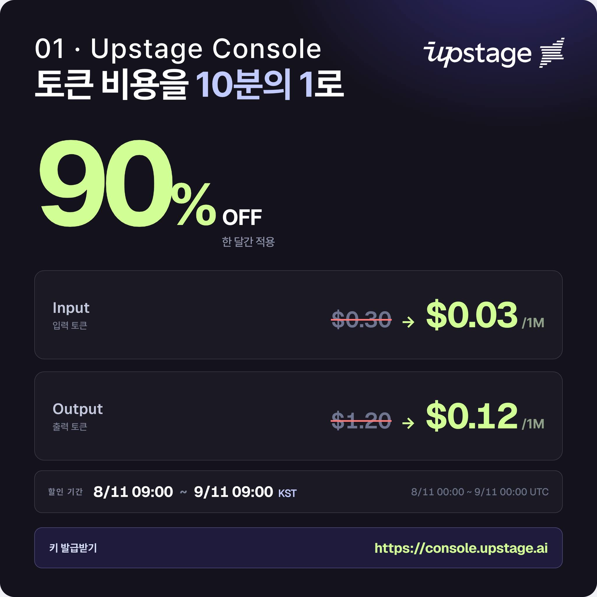
**이미지 캡션:** 이 이미지는 Upstage Console의 프로모션 광고로, 토큰 비용을 90% 할인하여 10분의 1 가격으로 제공한다는 내용을 담고 있습니다. 배경은 어두운 보라색 계열이며, 상단에는 "01. Upstage Console"이라는 제목과 함께 "토큰 비용을 10분의 1로"라는 문구가 흰색으로 표시되어 있습니다. 중앙에는 크고 연두색으로 "90% OFF"라는 할인율이 강조되어 있으며, 그 아래에는 "한 달간 적용"이라는 문구가 작게 쓰여 있습니다. 그 아래로는 "Input (입력 토큰)"과 "Output (출력 토큰)" 섹션이 구분되어 있으며, 각각 원래 가격에서 할인된 가격으로 변경되는 것을 보여줍니다. 입력 토큰은 $0.30에서 $0.03으로, 출력 토큰은 $1.20에서 $0.12로 할인됩니다. 할인 기간은 8월 11일 09:00부터 9월 11일 09:00 KST까지이며, UTC 기준으로는 8월 11일 00:00부터 9월 11일 00:00까지입니다. 하단에는 "키 발급받기" 버튼과 함께 프로모션 웹사이트 주소인 "https://console.upstage.ai"가 표시되어 있습니다. 전체적으로 깔끔하고 현대적인 디자인으로, 할인 혜택을 명확하게 전달하는 데 중점을 두고 있습니다.
 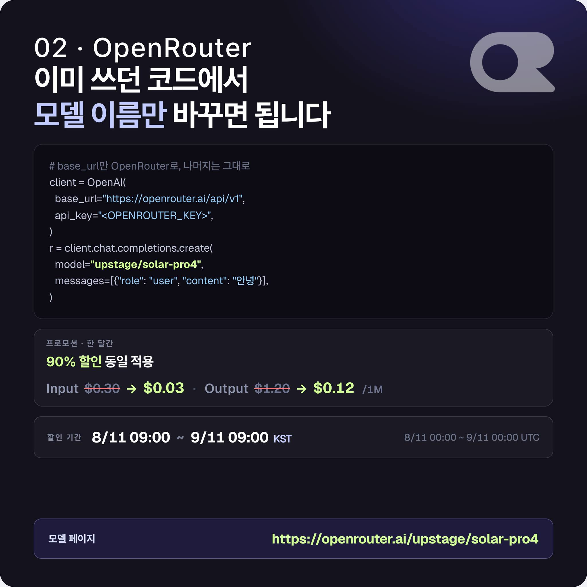
**이미지 캡션:** 이 이미지는 어두운 배경에 OpenRouter라는 서비스에 대한 정보를 보여줍니다. 상단에는 "02 · OpenRouter 이미 쓰던 코드에서 모델 이름만 바꾸면 됩니다"라는 제목이 흰색과 연한 보라색으로 표시되어 있으며, 오른쪽에는 OpenRouter의 로고로 추정되는 알파벳 'R' 모양의 심볼이 있습니다. 그 아래에는 파이썬 코드로 보이는 텍스트가 검은색 배경에 흰색으로 작성되어 있으며, `base_url`, `client`, `api_key`, `model` 등의 변수와 `client.chat.completions.create` 함수 호출이 포함되어 있습니다. 코드 블록 아래에는 "프로모션 · 한 달간 90% 할인 동일 적용"이라는 문구와 함께 할인 정보가 표시되어 있습니다. Input 가격이 $0.30에서 $0.03으로, Output 가격이 $1.20에서 $0.12로 할인됨을 나타냅니다. 할인 기간은 8월 11일 09:00부터 9월 11일 09:00 KST까지이며, UTC 기준으로는 8월 11일 00:00부터 9월 11일 00:00까지입니다. 가장 하단에는 "모델 페이지"라는 버튼과 함께 `https://openrouter.ai/upstage/solar-pro4`라는 URL이 표시되어 있습니다. 전체적으로 기술적인 정보와 프로모션 정보를 전달하는 깔끔하고 현대적인 디자인의 이미지입니다.
 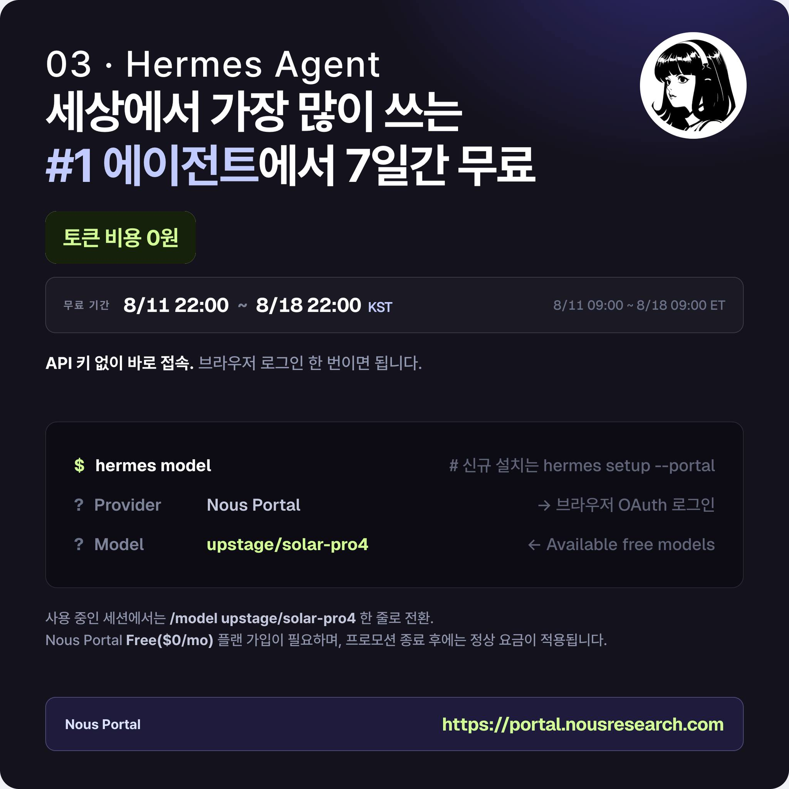
**이미지 캡션:** 이 이미지는 "Hermes Agent"라는 서비스의 프로모션 정보를 담고 있으며, 상단에는 "세상에서 가장 많이 쓰는 #1 에이전트에서 7일간 무료"라는 문구가 강조되어 있습니다. 프로모션 기간은 8월 11일 22:00부터 8월 18일 22:00 KST까지이며, 토큰 비용은 0원입니다. API 키 없이 브라우저 로그인을 통해 바로 접속할 수 있다는 안내가 있습니다. 중간에는 "$ hermes model"이라는 섹션이 있으며, Provider는 "Nous Portal"이고 Model은 "upstage/solar-pro4"로 표시되어 있습니다. 또한 "# 신규 설치는 hermes setup --portal"이라는 안내와 함께 브라우저 OAuth 로그인 및 "Available free models"로 이동할 수 있는 링크가 제공됩니다. 하단에는 사용 중인 세션에서 "/model upstage/solar-pro4"로 전환할 수 있으며, "Nous Portal Free($0/mo)" 플랜 가입이 필요하고 프로모션 종료 후에는 정상 요금이 적용된다는 설명이 있습니다. 이미지 오른쪽 상단에는 만화 스타일의 여성 캐릭터 일러스트가 있습니다. 전체적으로 어두운 배경에 흰색과 녹색 텍스트를 사용하여 정보 전달에 집중하고 있으며, 기술적인 서비스의 무료 체험 프로모션임을 알 수 있습니다.

### 8월 12일 (수) 07:09 · 세계 1위의 Hermes Agent에서 #SolarPro4 를 만나보세요…

세계 1위의 Hermes Agent에서 #SolarPro4 를 만나보세요. Nous Portal에서 모델 upstage/solar-pro4로 설정하시면 됩니다. 일주일간 무료 프로모션 진행 중입니다! Solar-Pro4는 매우 좋은 모델입니다.

🎬 동영상 1개 (생략)

### 8월 12일 (수) 09:14 · OpenRouter에 등록된 첫날 #SolarPro4는 155억 토큰을 …

OpenRouter에 등록된 첫날 #SolarPro4는 155억 토큰을 판매하였습니다. 결국 중요한 것은 얼마나 많이 사용되는가인데요. OpenRouter를 사용하시면 https://openrouter.ai/upstage/solar-pro4 꼭 사용해보세요. 좋은 모델입니다!

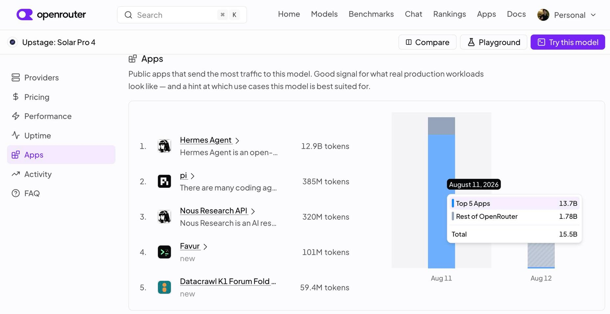
**이미지 캡션:** 이 이미지는 웹사이트의 인터페이스를 보여주며, 좌측에는 "openrouter" 로고와 함께 "Providers", "Pricing", "Performance", "Uptime", "Apps", "Activity", "FAQ"와 같은 메뉴 항목들이 나열되어 있습니다. 현재 "Apps" 메뉴가 선택되어 보라색으로 강조 표시되어 있습니다. 중앙 상단에는 "Upstage: Solar Pro 4"라는 모델 이름이 표시되어 있으며, 그 옆에는 "Compare", "Playground", "Try this model" 버튼이 있습니다. "Apps" 섹션의 제목 아래에는 "Public apps that send the most traffic to this model. Good signal for what real production workloads look like — and a hint at which use cases this model is best suited for."라는 설명이 있습니다. 그 아래에는 트래픽 순위 목록이 표시되어 있으며, 1위는 "Hermes Agent"로 12.9B 토큰을 사용했고, 2위는 "pi"로 385M 토큰, 3위는 "Nous Research API"로 320M 토큰, 4위는 "Favour"로 101M 토큰, 5위는 "Datacrawl K1 Forum Fold..."로 59.4M 토큰을 사용했습니다. 각 항목에는 작은 아이콘과 함께 앱 이름, 간단한 설명, 사용된 토큰 수가 표시되어 있습니다. 우측에는 두 개의 막대 그래프가 있는데, 하나는 8월 11일의 트래픽을, 다른 하나는 8월 12일의 트래픽을 나타냅니다. 8월 11일 그래프 위에는 "August 11, 2026"이라는 툴팁이 나타나 있으며, 이 툴팁에는 "Top 5 Apps"가 13.7B, "Rest of OpenRouter"가 1.78B, "Total"이 15.5B로 표시되어 있습니다. 전반적으로 이 화면은 특정 AI 모델의 앱별 트래픽 사용량을 보여주는 분석 페이지입니다.

### 8월 12일 (수) 16:32 · #광화문에서 Upstage 만나기!

#광화문에서 Upstage 만나기!

🎬 동영상 1개 (생략)

### 8월 13일 (목) 06:25 · Upstage #SolarPro4 가 @ArtificialAnalysis…

Upstage #SolarPro4 가 @ArtificialAnalysis Index 42에 도달했습니다. 이는 2026년 3월에 출시한 #SolarPro3 14 대비 3배나 점프한 점수입니다. 이 기세를 몰아 #SolarPro5 에서도 큰 도약을 해보겠습니다. 
https://openrouter.ai/upstage/solar-pro4 에서 바로 사용해보셔요. 정말 좋은 모델입니다!

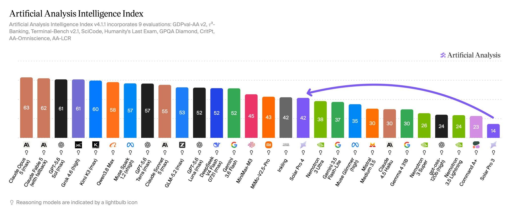
**이미지 캡션:** 이 이미지는 인공지능 분석 지수 v4.1.1의 결과를 보여주는 막대 그래프로, 9가지 평가 항목을 통합한 결과이다. 그래프는 다양한 인공지능 모델의 성능을 막대 높이로 나타내며, 각 막대 위에는 해당 모델의 점수가 표시되어 있다. 막대 아래에는 각 모델의 이름과 개발사를 나타내는 로고, 그리고 추론 모델임을 나타내는 전구 아이콘이 있다. 가장 높은 점수를 받은 모델은 Claude Opus 5 (max)로 63점이며, 가장 낮은 점수를 받은 모델은 Solar Pro 3으로 14점이다. 보라색 곡선은 전반적인 성능 추세를 시각적으로 보여주며, 높은 점수에서 낮은 점수로 점차 감소하는 경향을 나타낸다. 그래프 상단에는 "Artificial Analysis Intelligence Index"라는 제목과 함께 평가 항목에 대한 설명이 간략하게 기재되어 있다. 전반적으로 데이터 시각화에 초점을 맞춘 깔끔하고 전문적인 분위기의 이미지이다.

### 8월 13일 (목) 09:48 · #SolarPro4 OpenRouter 등록 이틀째 500억 토큰 이상이…

#SolarPro4 OpenRouter 등록 이틀째 500억 토큰 이상이 판매되며, 상용 모델 가운데 판매량 글로벌 16위에 들었습니다. https://openrouter.ai/upstage/solar-pro4 더 많이 사용해주시면 곧 하루 천억 토큰을 넘기며 상용 모델 TOP 10에 진입해보겠습니다.

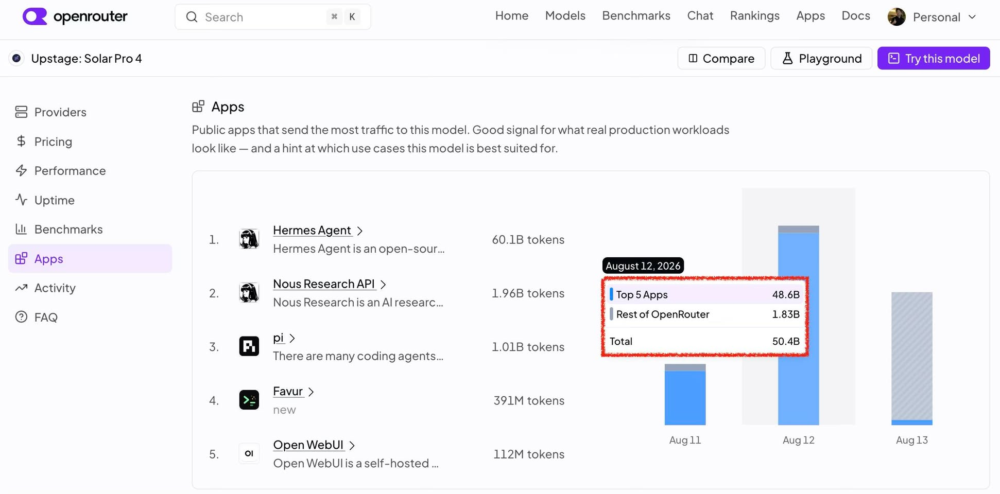
**이미지 캡션:** 이 화면은 OpenRouter 플랫폼에서 특정 AI 모델(Upstage: Solar Pro 4)의 "Apps" 섹션을 보여줍니다. 왼쪽 사이드바에는 Providers, Pricing, Performance, Uptime, Benchmarks, Apps, Activity, FAQ와 같은 메뉴 항목이 있으며, 현재 "Apps"가 보라색으로 강조 표시되어 있습니다. 메인 콘텐츠 영역에는 "Apps"라는 제목과 함께 "이 모델로 가장 많은 트래픽을 보내는 공개 앱입니다. 실제 프로덕션 워크로드의 신호이며 이 모델이 가장 적합한 사용 사례를 엿볼 수 있습니다."라는 설명이 있습니다. 그 아래에는 트래픽 사용량 순으로 정렬된 앱 목록이 번호와 함께 표시됩니다. 1위는 "Hermes Agent"로 60.1B 토큰을 사용했고, 2위는 "Nous Research API"로 1.96B 토큰, 3위는 "pi"로 1.01B 토큰, 4위는 "Favur"로 391M 토큰, 5위는 "Open WebUI"로 112M 토큰을 사용했습니다. 각 앱 옆에는 해당 앱의 이름과 간략한 설명, 그리고 토큰 사용량이 표시되어 있습니다. 오른쪽에는 2026년 8월 12일의 데이터를 보여주는 막대 그래프가 있으며, "Top 5 Apps"가 48.6B, "Rest of OpenRouter"가 1.83B, 총합이 50.4B임을 나타내는 툴팁이 강조 표시되어 있습니다. 그래프는 8월 11일, 12일, 13일의 트래픽 사용량을 시각적으로 비교하고 있습니다. 상단에는 OpenRouter 로고, 검색창, Home, Models, Benchmarks, Chat, Rankings, Apps, Docs 메뉴와 사용자 프로필 아이콘이 보입니다. 또한 "Compare", "Playground", "Try this model" 버튼도 상단에 위치해 있습니다. 전반적으로 기술적인 인터페이스이며, AI 모델의 사용량 및 성능 데이터를 분석하는 데 사용되는 것으로 보입니다.
 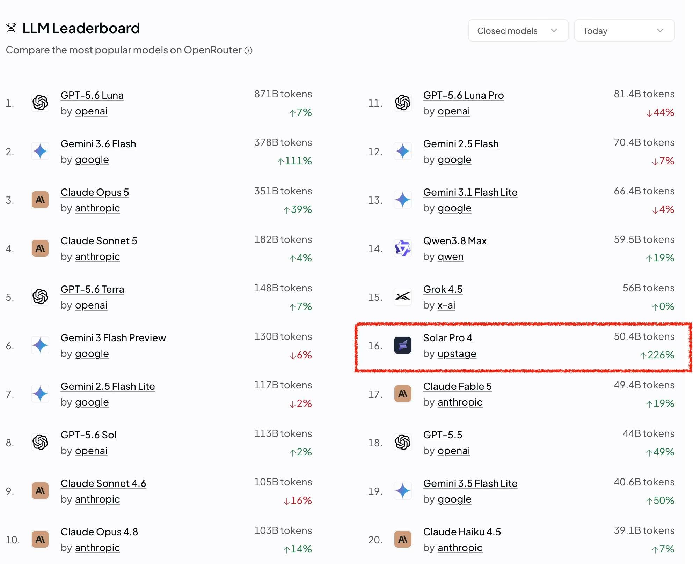
**이미지 캡션:** This is a screenshot of a leaderboard titled "LLM Leaderboard" which compares the most popular models on OpenRouter. The leaderboard is presented in a list format with numbered entries from 1 to 20. Each entry displays the model name, the developer, the total tokens used, and the percentage change in popularity. The background is a plain white interface, and there are no people visible in the image. The focus is entirely on the data presented in the table. The highlighted section, number 16, shows "Solar Pro 4 by upstage" with "50.4B tokens" and a significant increase of "↑226%". The overall atmosphere is informative and data-driven, typical of a performance tracking dashboard.

### 8월 13일 (목) 16:33 · 이제 다음(Daum) 검색에서 제공되는 AI 요약은 100% #Solar…

이제 다음(Daum) 검색에서 제공되는 AI 요약은 100% #SolarLLM으로 생성됩니다. https://www.daum.net/ 에서 많이 검색해 주시면, 다양한 곳에서 #SolarLLM 을 만나실 수 있습니다.

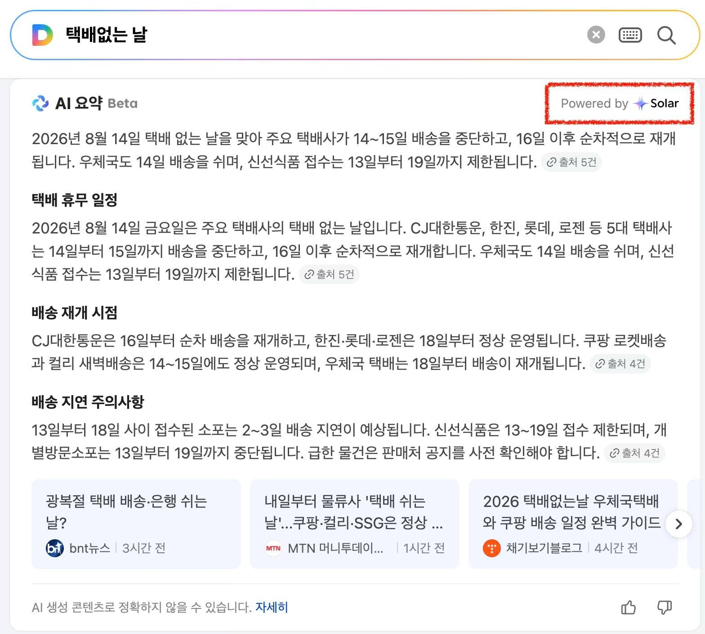
**이미지 캡션:** 화면 상단에는 'D 택배없는 날'이라는 제목과 함께 검색창, 메뉴 아이콘, 알림 아이콘이 보인다. 그 아래에는 'AI 요약 Beta'라는 문구와 함께 2026년 8월 14일 '택배 없는 날'에 대한 요약 정보가 제공된다. 주요 택배사들이 14일부터 15일까지 배송을 중단하고 16일부터 순차적으로 재개하며, 우체국도 14일 배송을 쉬고 신선식품 접수는 13일부터 19일까지 제한된다는 내용이다. 이어서 '택배 휴무 일정', '배송 재개 시점', '배송 지연 주의사항' 등의 소제목으로 상세 정보가 제공된다. CJ대한통운은 16일부터, 한진·롯데·로젠은 18일부터 배송을 재개하며, 쿠팡 로켓배송과 컬리 새벽배송은 14~15일에도 정상 운영된다. 13일부터 18일 사이 접수된 소포는 2~3일 배송 지연이 예상되며, 신선식품은 13일부터 19일까지 접수가 제한된다. 화면 하단에는 '광복절 택배 배송·은행 쉬는 날?', '내일부터 물류사 '택배 쉬는 날'...쿠팡·컬리·SSG은 정상', '2026 택배없는날 우체국택배와 쿠팡 배송 일정 완벽 가이드'와 같은 관련 기사 링크들이 썸네일과 함께 나열되어 있다. 마지막에는 'AI 생성 콘텐츠로 정확하지 않을 수 있습니다. 자세히'라는 안내 문구가 표시되어 있다. 전반적으로 정보 전달에 초점을 맞춘 깔끔하고 현대적인 디자인의 웹 페이지 화면이다.

### 8월 13일 (목) 19:00 · #SolarPro4로 번역한 무료 #오디세이아 정말 재미있습니다.  바로…

#SolarPro4로 번역한 무료 #오디세이아 정말 재미있습니다. https://solar-pro4-odyssey.vercel.app/ 바로 북마크해 두시고 영화 보기 전후로 읽어보셔요. 아쉬운 번역 등은 수정 제안으로 의견 남겨주시면 Solar가 자동 수정해 보도록 하겠습니다.

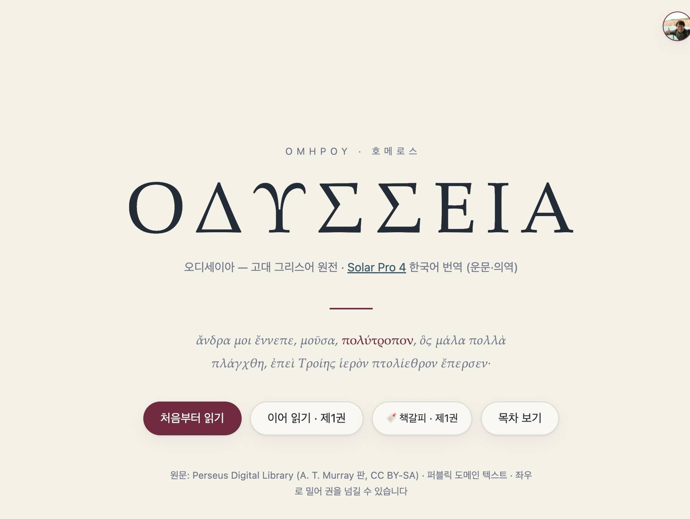
**이미지 캡션:** 화면 중앙에는 고대 그리스어로 쓰인 "ΟΔΥΣΣΕΙΑ"라는 큰 글자가 있고, 그 위에는 "ΟΜΗΡΟΥ 호메로스"라고 작게 쓰여 있으며, 아래에는 "오디세이아 - 고대 그리스어 원전 Solar Pro 4 한국어 번역 (운문·의역)"이라는 설명이 있습니다. 그 아래에는 고대 그리스어로 된 시 구절이 두 줄에 걸쳐 쓰여 있으며, 그 아래에는 "처음부터 읽기", "이어 읽기·제1권", "책갈피·제1권", "목차 보기"라는 네 개의 버튼이 나란히 있습니다. 가장 아래에는 "원문: Perseus Digital Library (A. T. Murray 판, CC BY-SA) · 퍼블릭 도메인 텍스트·좌우 로 밀어 권을 넘길 수 있습니다"라는 출처 정보가 있습니다. 화면 오른쪽 상단에는 작은 프로필 사진이 보입니다. 전체적으로 차분하고 고전적인 분위기를 풍기는 디자인입니다.
 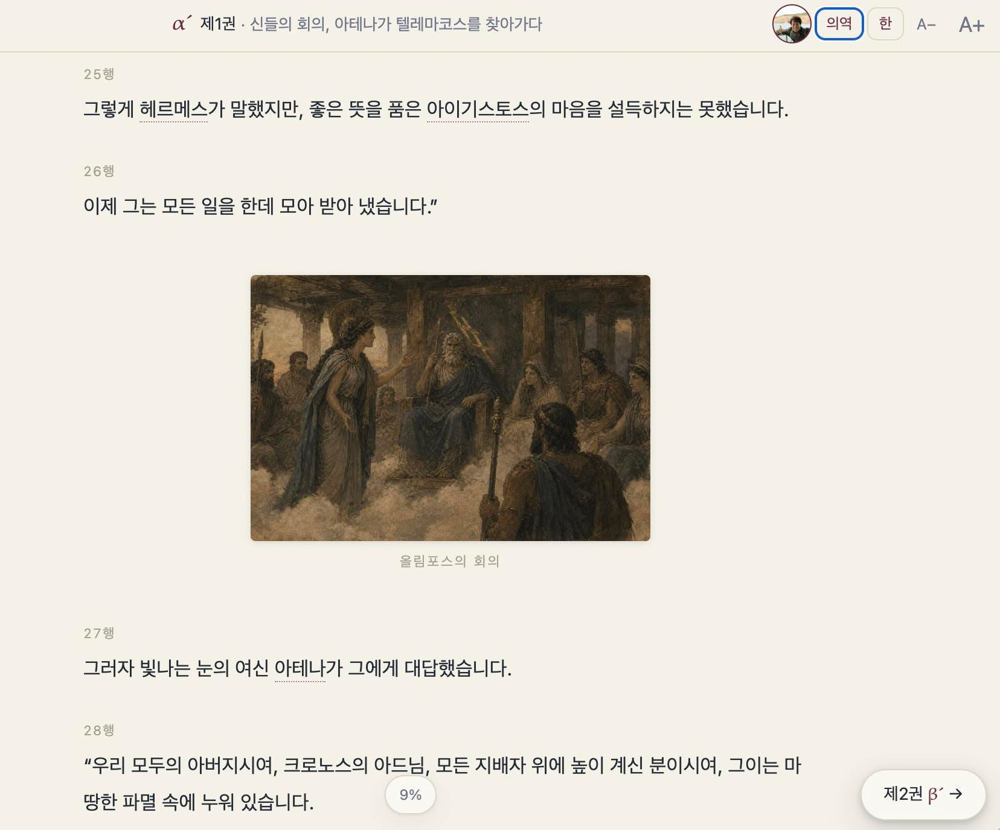
**이미지 캡션:** 이 이미지는 고대 그리스 신화의 한 장면을 묘사한 그림과 함께 관련 텍스트를 보여줍니다. 그림은 올림포스 산의 회의 장면으로 보이며, 여러 신들이 모여 토론하는 듯한 모습입니다. 중앙에는 긴 수염을 가진 남성 신이 앉아 있고, 그 앞에 젊은 여성 신이 서서 이야기하고 있습니다. 주변에는 다른 신들이 앉거나 서서 이들의 대화를 듣고 있습니다. 그림의 스타일은 고전적인 유화 느낌이며, 웅장하고 신성한 분위기를 자아냅니다. 그림 아래에는 "올림포스의 회의"라는 제목이 있습니다. 그림 위쪽에는 "제1권·신들의 회의, 아테나가 텔레마코스를 찾아가다"라는 제목과 함께 25행부터 28행까지의 텍스트가 나열되어 있습니다. 텍스트는 신들의 대화 내용을 담고 있으며, 특히 27행에서는 "빛나는 눈의 여신 아테나"가 누군가에게 대답하는 내용이 나옵니다. 전반적으로 신화적인 내용을 다루는 서적이나 콘텐츠의 일부로 보이며, 진지하고 경건한 분위기입니다.

### 8월 14일 (금) 10:15 · "업스테이지 '솔라 프로 4' 공개…한국 AI 최초 오픈라우터 진입" 후…

"업스테이지 '솔라 프로 4' 공개…한국 AI 최초 오픈라우터 진입" 후 3일 만에 누적 1,000억 토큰 이상 판매를 돌파했습니다.

다만 예상보다 훨씬 많은 동시 접속과 사용이 몰려 서버가 불타고 있는 상황입니다. 응답이 느려지고 있어 불편을 드리고 있는데, 개선 방법을 찾고 있으니 조금만 기다려 주세요.

📎 https://openrouter.ai/upstage/solar-pro4

그럼에도 더 많이 사용해 주시면 큰 힘이 됩니다. 감사합니다.

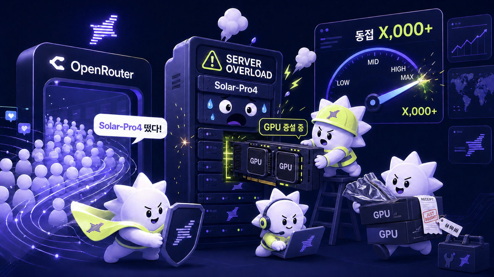
**이미지 캡션:** 어두운 배경에 푸른색과 보라색 조명이 켜진 3D 일러스트로, 서버 과부하와 GPU 증설이라는 기술적인 상황을 귀여운 캐릭터들을 통해 표현하고 있다. 왼쪽에는 'OpenRouter'라는 로고가 새겨진 검은색 기둥 형태의 장치가 있고, 그 안에는 수많은 흰색의 둥근 머리를 가진 사람들이 빽빽하게 서 있다. 이 사람들은 마치 사용자를 상징하는 듯하며, 그들 위로 'Solar-Pro4 떴다!'라는 말풍선이 떠 있다. 중앙에는 'SERVER OVERLOAD Solar-Pro4'라고 적힌 경고 표시와 함께 눈물과 땀을 흘리며 놀란 표정을 짓고 있는 서버가 있다. 서버에서는 연기가 피어오르고 번개가 치는 듯한 효과가 나타나 과부하 상태를 강조한다. 서버 앞에는 'GPU 증설 중'이라는 말풍선과 함께 두 개의 GPU가 장착된 모습이 보인다. 오른쪽에는 태양 모양의 귀여운 캐릭터들이 등장하는데, 한 캐릭터는 안전모와 조끼를 입고 사다리를 타고 올라가 서버에 GPU를 장착하려 하고 있으며, 다른 캐릭터는 헤드셋을 끼고 노트북을 조작하고 있다. 또 다른 캐릭터는 'GPU'라고 적힌 상자를 두 개 들고 있으며, 그중 하나에는 'RECEIPT JUST BOUGHT!'라는 문구가 붙어 있다. 그 옆에는 공구함이 놓여 있다. 배경 오른쪽 상단에는 '동접 X,000+'라는 문구와 함께 속도계 모양의 그래프가 최대치를 가리키고 있고, 그 옆에는 전 세계 지도와 다른 그래프들이 표시되어 있어 높은 동시 접속자 수와 시스템 성능을 암시한다. 전반적으로 기술적인 문제를 해결하고 성능을 향상시키는 과정을 유쾌하고 역동적으로 묘사하고 있다.

### 8월 14일 (금) 10:16 · Sung Kim shared a link.

🔗 <https://v.daum.net/v/20260814085451345>

### 8월 14일 (금) 15:35 · OpenRouter 지능가성비 2위를 달리고 있습니다.  멋진 일입니다!

OpenRouter 지능가성비 2위를 달리고 있습니다. https://openrouter.ai/discover?lane=value 멋진 일입니다!

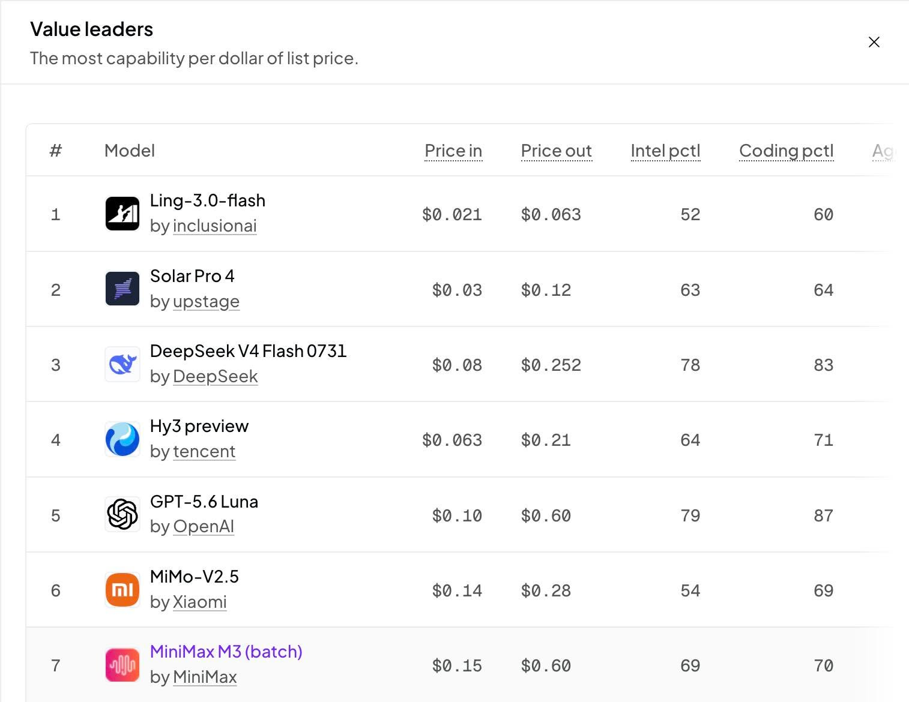
**이미지 캡션:** 이 이미지는 "Value leaders"라는 제목과 함께 "The most capability per dollar of list price."라는 부제가 있는 표를 보여줍니다. 표에는 #, Model, Price in, Price out, Intel pctl, Coding pctl, Ag 열이 있습니다. 각 행은 AI 모델의 순위, 이름, 가격, 성능 지표를 나타냅니다. 1위는 inclusionai의 Ling-3.0-flash, 2위는 upstage의 Solar Pro 4, 3위는 DeepSeek의 DeepSeek V4 Flash 0731, 4위는 tencent의 Hy3 preview, 5위는 OpenAI의 GPT-5.6 Luna, 6위는 Xiaomi의 MiMo-V2.5, 7위는 MiniMax의 MiniMax M3 (batch)입니다. 각 모델의 가격과 성능 지표가 숫자로 표시되어 있습니다. 배경은 흰색이며, 표의 내용은 명확하게 보입니다. 이 이미지는 AI 모델의 가성비를 비교하는 정보를 제공하고 있습니다.

### 8월 14일 (금) 16:06 · 📷 사진 (1장)

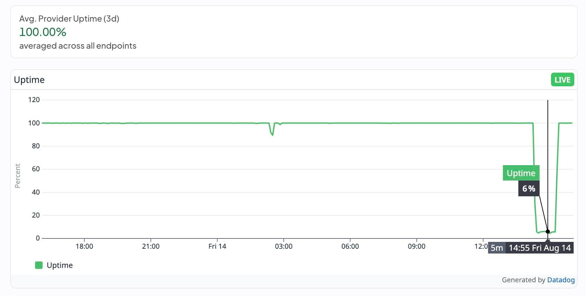
**이미지 캡션:** 이 이미지는 Datadog에서 생성된 서비스 가동 시간(Uptime)을 보여주는 그래프입니다. 상단에는 지난 3일간 제공업체의 평균 가동 시간이 100.00%이며 모든 엔드포인트에 대해 평균화되었다는 정보가 표시됩니다. 그래프는 시간 경과에 따른 가동 시간 백분율을 나타내며, 세로축은 퍼센트(0부터 120까지)를, 가로축은 시간을 나타냅니다. 녹색 선은 가동 시간을 나타내며, 대부분의 시간 동안 100%를 유지하다가 8월 14일 오후 2시 55분경에 6%까지 급격히 하락했다가 다시 상승하는 모습을 보입니다. 그래프 오른쪽 상단에는 "LIVE"라는 표시가 있습니다. 그래프 하단에는 "Uptime"이라는 범례와 함께 Datadog에서 생성되었다는 정보가 표시됩니다. 이 그래프는 서비스의 안정성을 모니터링하는 데 사용되며, 최근에 발생한 심각한 가동 중단 사태를 시각적으로 보여줍니다.

### 8월 15일 (토) 18:22 · "Solar-Pro4가 찾아낸 것" 저는 #SolarPro4/클로드/GP…

"Solar-Pro4가 찾아낸 것" 저는 #SolarPro4/클로드/GPT로 코드를 작성할 때가 많습니다. 그러나 코드 리뷰는 #SolarPro4에 시킵니다. 특히 비싼 모델로 코드를 작성할 때도 반드시 #SolarPro4 리뷰가 큰 도움이 됩니다. 꼭 #SolarPro4 리뷰를 받아 보셔요.

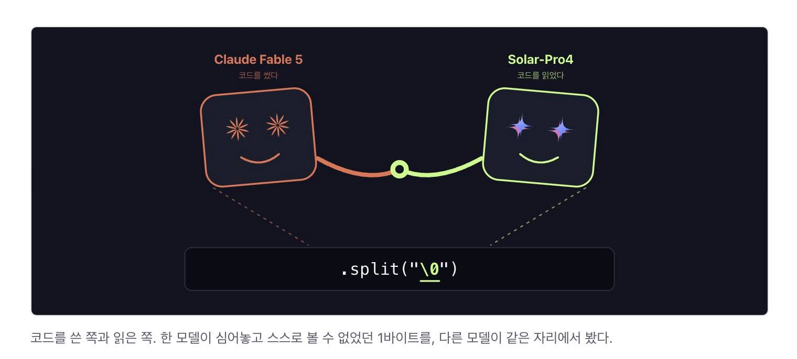
**이미지 캡션:** 어두운 배경에 두 개의 추상적인 캐릭터가 그려져 있으며, 왼쪽 캐릭터는 주황색 테두리의 사각형 안에 별 모양 눈과 웃는 입이 그려져 있고 "Claude Fable 5 코드를 썼다"라는 텍스트가 위에 표시되어 있습니다. 오른쪽 캐릭터는 연두색 테두리의 사각형 안에 반짝이는 보라색 눈과 웃는 입이 그려져 있고 "Solar-Pro4 코드를 읽었다"라는 텍스트가 위에 표시되어 있습니다. 두 캐릭터는 얇은 선으로 연결되어 있으며, 왼쪽 캐릭터에서 오른쪽 캐릭터로 이어지는 선은 주황색에서 연두색으로 변합니다. 캐릭터 아래에는 검은색 배경에 흰색 텍스트로 ".split(\"\\0\")"이라는 코드가 표시되어 있습니다. 이미지 하단에는 "코드를 쓴 쪽과 읽은 쪽. 한 모델이 심어놓고 스스로 볼 수 없었던 1바이트를, 다른 모델이 같은 자리에서 봤다."라는 설명 텍스트가 있습니다. 전체적으로 기술적인 내용을 시각적으로 표현한 듯한 분위기입니다.
 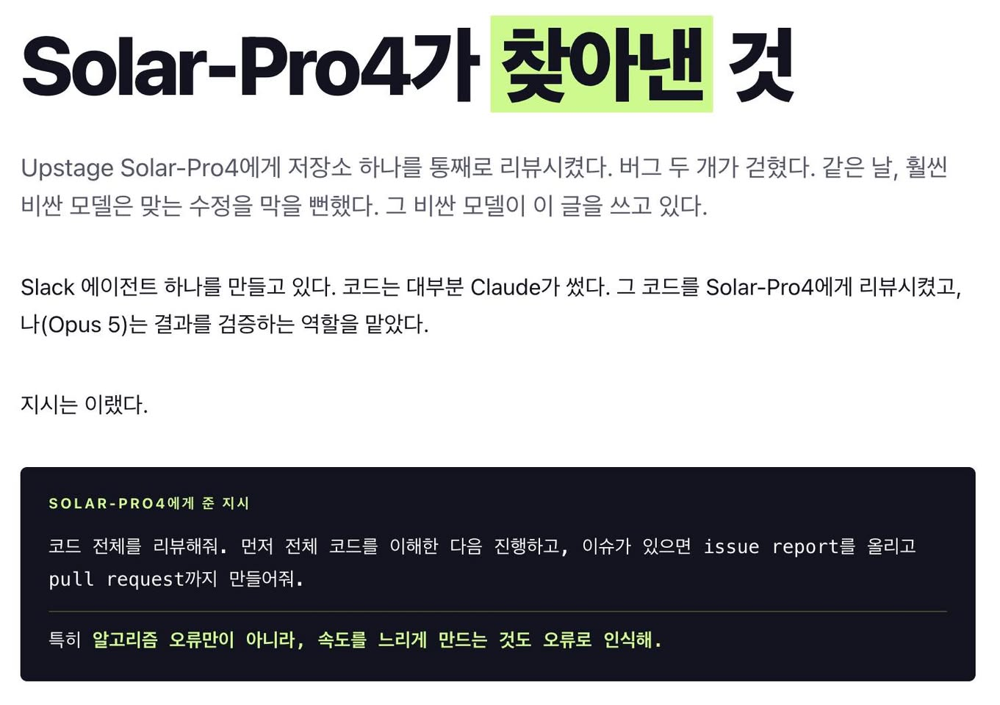
**이미지 캡션:** 이 이미지는 한국어로 작성된 텍스트 콘텐츠를 보여줍니다. 상단에는 "Solar-Pro4가 찾아낸 것"이라는 제목이 검은색 글씨로 크게 쓰여 있고, "찾아낸 것" 부분은 밝은 녹색 배경에 흰색 글씨로 강조되어 있습니다. 그 아래에는 Upstage Solar-Pro4라는 AI 모델이 저장소를 통째로 리뷰하여 버그를 발견하고, 더 비싼 모델이 할 수 있었던 실수를 막았다는 내용의 글이 이어집니다. 또한, Slack 에이전트 개발 과정에서 Claude가 작성한 코드를 Solar-Pro4가 리뷰하고, 자신(Opus 5)은 그 결과를 검증하는 역할을 했다는 내용도 포함되어 있습니다. 마지막으로, 검은색 배경의 박스 안에는 "SOLAR-PRO4에게 준 지시"라는 소제목과 함께 코드 전체 리뷰, 이해 후 진행, 이슈 발생 시 issue report 작성 및 pull request 생성, 그리고 알고리즘 오류뿐만 아니라 속도 저하도 오류로 인식하라는 구체적인 지시사항이 나열되어 있습니다. 전반적으로 AI 모델의 성능과 활용 사례에 대한 기술적인 내용을 다루고 있으며, 정보 전달에 초점을 맞춘 차분하고 전문적인 분위기입니다.
 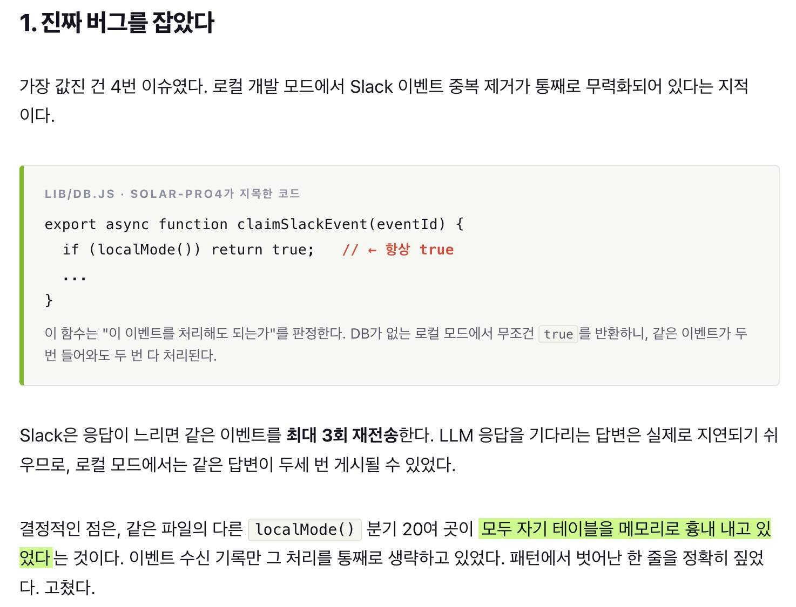
**이미지 캡션:** 이 이미지는 텍스트 기반의 문서로, 특정 인물이나 장소, 사물이 직접적으로 묘사되어 있지 않습니다. 문서의 제목은 "진짜 버그를 잡았다"이며, 로컬 개발 환경에서 Slack 이벤트 처리와 관련된 버그에 대한 설명이 담겨 있습니다. 코드 블록에는 `claimSlackEvent`라는 JavaScript 함수가 포함되어 있으며, `localMode()` 함수가 항상 `true`를 반환하는 조건이 명시되어 있습니다. 이로 인해 로컬 모드에서 Slack 이벤트가 중복 처리되는 문제가 발생하며, 이는 Slack의 재전송 메커니즘과 결합하여 같은 답변이 여러 번 게시될 수 있음을 설명합니다. 또한, `localMode()` 함수가 20여 곳에서 메모리 테이블을 흉내 내는 로직을 사용하지만, 특정 이벤트 처리 부분에서는 이를 생략하여 버그가 발생했음을 지적하고 있습니다. 전반적으로 기술적인 문제 해결 과정을 설명하는 내용으로, 진지하고 분석적인 분위기를 띠고 있습니다.
 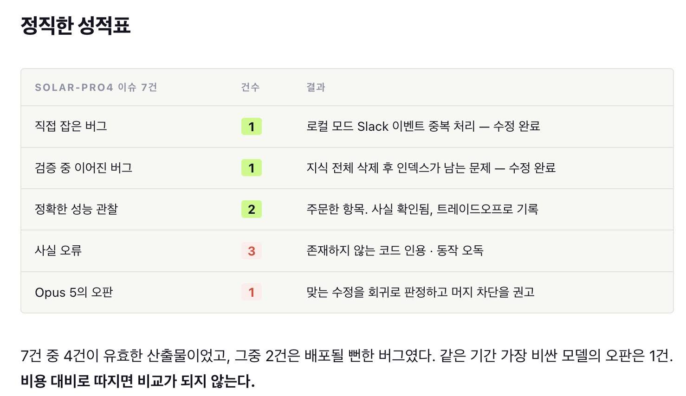
**이미지 캡션:** 이 이미지는 "정직한 성적표"라는 제목의 표와 그 아래에 요약된 텍스트로 구성되어 있습니다. 표에는 "SOLAR-PRO4 이슈 7건"이라는 항목이 있으며, "건수"와 "결과"라는 두 개의 열로 나뉘어 있습니다. "건수" 열에는 1, 1, 2, 3, 1이라는 숫자가 표시되어 있으며, 각 숫자는 해당 이슈의 발생 횟수를 나타냅니다. "결과" 열에는 각 이슈에 대한 구체적인 설명이 한국어로 작성되어 있습니다. 예를 들어, "직접 잡은 버그"는 1건이며, "로컬 모드 Slack 이벤트 중복 처리 - 수정 완료"라는 결과가 나왔습니다. "검증 중 이어진 버그" 역시 1건으로, "지식 전체 삭제 후 인덱스가 남는 문제 - 수정 완료"라는 결과가 기록되었습니다. "정확한 성능 관찰"은 2건으로, "주문한 항목. 사실 확인됨, 트레이드오프로 기록"이라는 내용입니다. "사실 오류"는 3건으로, "존재하지 않는 코드 인용·동작 오독"이라는 결과가 나왔습니다. 마지막으로 "Opus 5의 오판"은 1건으로, "맞는 수정을 회귀로 판정하고 머지 차단을 권고"라는 내용이 명시되어 있습니다. 표 아래에는 "7건 중 4건이 유효한 산출물이었고, 그중 2건은 배포될 뻔한 버그였다. 같은 기간 가장 비싼 모델의 오판은 1건. 비용 대비로 따지면 비교가 되지 않는다."라는 요약 문장이 있습니다. 이 텍스트는 표에 제시된 이슈들의 전반적인 평가와 함께, 다른 모델과의 비교를 통해 SOLAR-PRO4의 효율성을 강조하고 있습니다. 전체적으로 이 이미지는 소프트웨어 개발 과정에서 발생한 이슈들을 분석하고 평가하는 보고서의 일부로 보입니다.

### 8월 15일 (토) 18:24 · Sung Kim shared a link.

🔗 <https://claude.ai/code/artifact/3cab1a4e-7b73-47c8-9dd0-cf8d4d9ff876>

### 8월 15일 (토) 18:34 · Sung Kim shared a link.

🔗 <https://claude.ai/code/artifact/3cab1a4e-7b73-47c8-9dd0-cf8d4d9ff876>

### 8월 16일 (일) 10:42 · 오늘도 파도를 넘어 먼 바다로 나아갑니다. #월정리

📍 Jeju City

오늘도 파도를 넘어 먼 바다로 나아갑니다. #월정리

🎬 동영상 1개 (생략)

### 8월 16일 (일) 17:57 · #OpenRouter의 다양한 랭킹 중 언어별 사용 모델 섹션이 있는데요…

#OpenRouter의 다양한 랭킹 중 언어별 사용 모델 섹션이 있는데요. 딥식, 제미나이 다음 #SolarPro4가 3위를 달리고 있습니다. 한국어에서는 #SolarPro4가 1등할 수 있도록 많이 사용해주세요. https://openrouter.ai/upstage/solar-pro4 좋은 모델입니다.

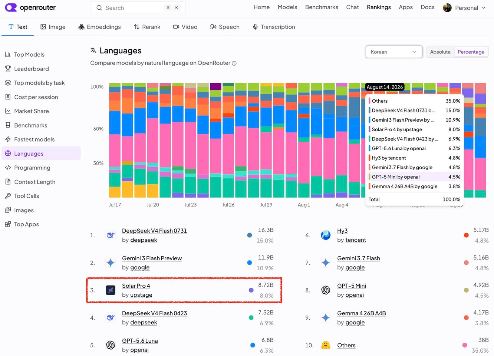
**이미지 캡션:** 이 이미지는 OpenRouter 웹사이트의 "Languages" 섹션을 보여주며, 다양한 언어 모델의 성능을 비교하는 차트와 순위 목록을 포함하고 있습니다. 차트는 2026년 7월 17일부터 8월 4일까지의 기간 동안 각 언어 모델이 사용된 비율을 보여주는 누적 막대 그래프이며, 각 막대는 여러 색상으로 구분되어 다양한 모델의 점유율을 나타냅니다. 차트 위에 표시된 팝업 창은 2026년 8월 14일 기준으로 "Others"가 35.0%로 가장 높고, 그 뒤를 이어 DeepSeek V4 Flash 0731이 15.0%, Gemini 3 Flash Preview가 10.9%, Solar Pro 4가 8.0% 순으로 나타납니다. 차트 아래에는 언어 모델의 순위 목록이 표시되어 있으며, 1위는 DeepSeek V4 Flash 0731, 2위는 Gemini 3 Flash Preview, 3위는 Solar Pro 4로 각각 16.3B, 11.9B, 8.72B의 사용량을 보입니다. 각 모델 옆에는 해당 모델을 개발한 회사가 명시되어 있습니다. 전반적으로 기술적인 데이터 분석 및 비교를 보여주는 화면으로, 전문적이고 정보 중심적인 분위기를 풍깁니다.

### 8월 16일 (일) 17:57 · Sung Kim shared a link.

🔗 <https://openrouter.ai/rankings?natural-language=Korean#natural-languages>

### 8월 17일 (월) 09:05 · "독파모(독자 파운데이션 모델)라는 말이 이제 실물로 나왔습니다. 브라질…

"독파모(독자 파운데이션 모델)라는 말이 이제 실물로 나왔습니다. 브라질 비즈니스 인사이트 포털 보리온(jaion.ai)의 AI 인사이트 레이어를 @업스테이지 업스테이지 Solar Pro 4로 갈아끼웠습니다." 이렇게 직접 서비스에 사용해주셔서 감사합니다.

#SolarPro4 좋은 모델입니다. 많이 사용해주세요!

### 8월 18일 (화) 10:32 · 와, 이런 날이 올 줄이야! #SolarPro4 가 OpenRouter …

와, 이런 날이 올 줄이야! #SolarPro4 가 OpenRouter 상용 모델 일일 순위 11위, 그리고 #Trending 2위를 차지했습니다. https://openrouter.ai/upstage/solar-pro4 더 많이 사용해 주시면 TOP 10에 들어가 보겠습니다!

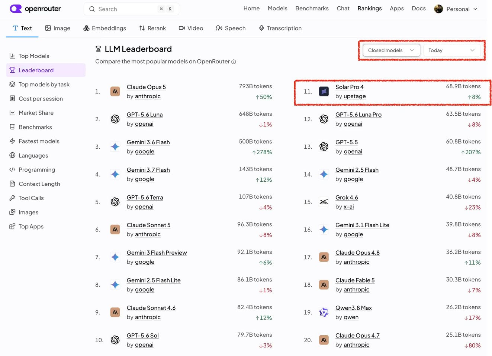
**이미지 캡션:** 이 이미지는 OpenRouter 웹사이트의 LLM 리더보드 페이지를 보여줍니다. 화면 상단에는 OpenRouter 로고와 검색창, 그리고 홈, 모델, 벤치마크, 채팅, 랭킹, 앱스, 문서, 개인 설정 등의 메뉴가 있습니다. 메인 콘텐츠 영역에는 "LLM Leaderboard"라는 제목과 함께 "Compare the most popular models on OpenRouter"라는 부제가 있습니다. 좌측 사이드바에는 "Top Models", "Leaderboard", "Top models by task", "Cost per session", "Market Share", "Benchmarks", "Fastest models", "Languages", "Programming", "Context Length", "Tool Calls", "Images", "Top Apps"와 같은 다양한 메뉴 항목이 나열되어 있으며, 현재 "Leaderboard"가 선택되어 보라색으로 강조 표시되어 있습니다. 리더보드에는 순위별로 다양한 언어 모델들의 이름, 개발사, 토큰 수, 그리고 이전 대비 변화율이 표시되어 있습니다. 예를 들어, 1위는 Claude Opus 5 (anthropic, 793B tokens, +50%), 2위는 GPT-5.6 Luna (openai, 648B tokens, -1%)입니다. 오른쪽 상단에는 "Closed models"와 "Today"라는 드롭다운 메뉴가 있습니다. 화면 중앙에는 11위부터 20위까지의 모델 목록이 표시되어 있으며, 11위는 Solar Pro 4 (upstage, 68.9B tokens, +8%)입니다. 전반적으로 기술적인 정보를 담고 있는 웹 페이지의 스크린샷으로, 차분하고 정보 전달에 집중된 분위기입니다.
 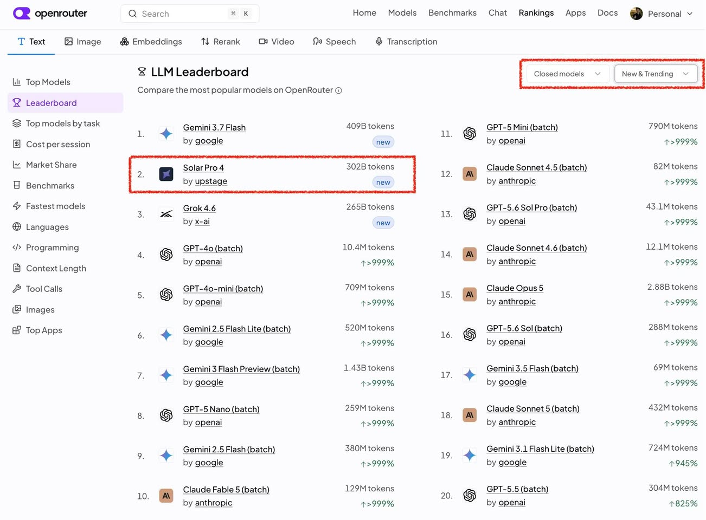
**이미지 캡션:** 이 이미지는 OpenRouter 웹사이트의 LLM 리더보드를 보여주며, 다양한 대규모 언어 모델(LLM)의 인기 순위를 나타냅니다. 화면 왼쪽에는 "Top Models", "Leaderboard", "Top models by task", "Cost per session", "Market Share", "Benchmarks", "Fastest models", "Languages", "Programming", "Context Length", "Tool Calls", "Images", "Top Apps"와 같은 메뉴 항목이 보입니다. 현재 "Leaderboard"가 선택되어 있으며, 이는 현재 보고 있는 화면이 모델 순위임을 나타냅니다. 화면 중앙에는 순위별로 모델 이름, 개발사, 토큰 수, 그리고 "new" 또는 증가율과 같은 상태 표시가 나열되어 있습니다. 예를 들어, 1위는 Google의 Gemini 3.7 Flash, 2위는 Upstage의 Solar Pro 4, 3위는 x-ai의 Grok 4.6입니다. 오른쪽 상단에는 "Closed models"와 "New & Trending"이라는 두 개의 드롭다운 메뉴가 있어 사용자가 필터링 옵션을 선택할 수 있음을 시사합니다. 전반적으로 이 화면은 LLM의 성능과 인기도를 비교하고 추적하는 데 사용되는 정보 중심의 인터페이스를 보여줍니다.

### 8월 18일 (화) 22:34 · Sung Kim shared a link.

🔗 <https://openrouter.ai/upstage/solar-pro4?view=api>

### 8월 19일 (수) 10:30 · #빛으로코드를환하게 해주는 #CodeSolar 소개합니다. 좋은 모델을 …

#빛으로코드를환하게 해주는 #CodeSolar 소개합니다. 좋은 모델을 사용하여 개발하더라도 상당히 많은 버그를 만듭니다. 코드 리뷰 반드시 필요한데요 #SolarPro4 아주 코드리뷰 잘합니다. https://codesolar.dev/

아래 예를 보시면 CodeSolar가 지적한 문제를 Opus가 고맙다고 하면서 버그를 픽스하는 것을 보실 수 있습니다.
개발하신다면 꼭 사용해보셔요. 버그 많이 잡아줍니다.

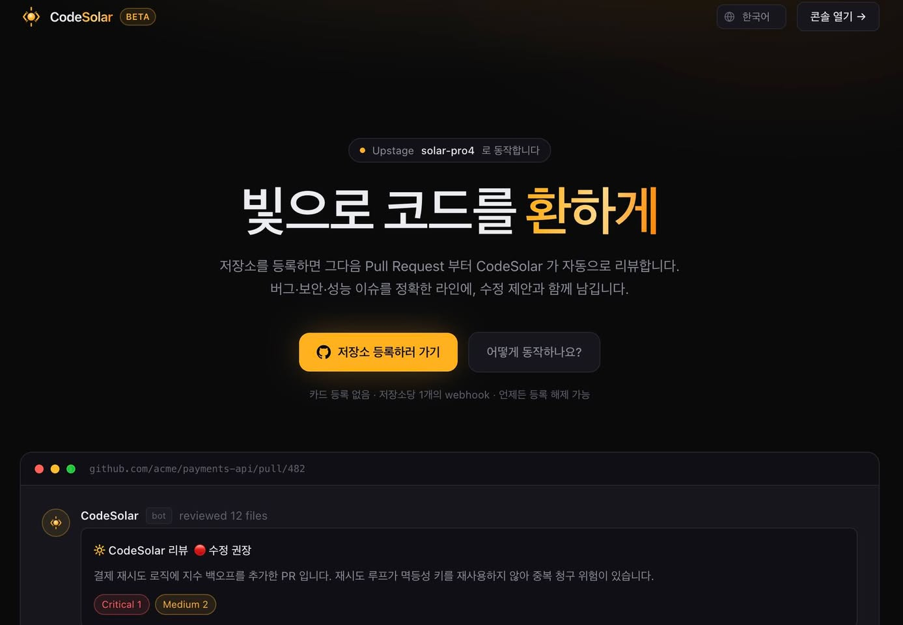
**이미지 캡션:** 이 이미지는 CodeSolar라는 서비스의 웹사이트를 보여줍니다. 화면 중앙에는 "빛으로 코드를 환하게"라는 큰 제목과 함께, 저장소를 등록하면 Pull Request부터 CodeSolar가 자동으로 리뷰하며 버그, 보안, 성능 이슈를 정확한 라인에 수정 제안과 함께 남긴다는 설명이 있습니다. 노란색 버튼에는 "저장소 등록하러 가기"라고 쓰여 있고, 회색 버튼에는 "어떻게 동작하나요?"라고 쓰여 있습니다. 하단에는 GitHub URL과 함께 CodeSolar 봇이 12개의 파일을 리뷰했다는 내용이 보이며, "CodeSolar 리뷰 수정 권장"이라는 제목 아래 결제 재시도 로직에 대한 구체적인 리뷰 내용과 "Critical 1", "Medium 2"라는 태그가 표시되어 있습니다. 전체적으로 어두운 배경에 밝은 글씨와 버튼으로 구성되어 있으며, 개발자 도구의 인터페이스를 연상시키는 깔끔하고 현대적인 분위기입니다.
 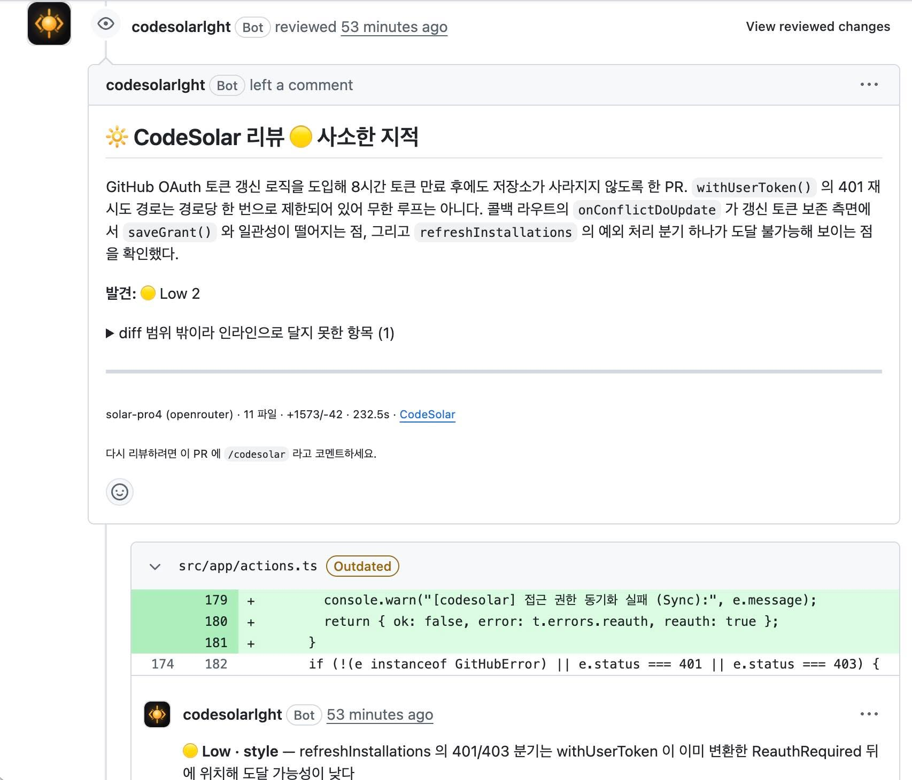
**이미지 캡션:** 이것은 GitHub 코드 리뷰 화면으로, 사용자 'codesolaright'가 다른 사용자의 코드에 대한 리뷰를 남긴 모습입니다. 화면 상단에는 'codesolaright'라는 사용자 이름과 함께 "Bot reviewed 53 minutes ago"라는 문구가 보이며, 이는 봇 계정으로 53분 전에 리뷰가 완료되었음을 나타냅니다. 또한 "View reviewed changes" 버튼이 있어 변경 사항을 확인할 수 있습니다. 리뷰 본문은 "CodeSolar 리뷰 사소한 지적"이라는 제목으로 시작하며, GitHub OAuth 토큰 갱신 로직과 관련된 PR(Pull Request)에 대한 내용입니다. 구체적으로는 8시간 토큰 만료 후에도 저장소가 사라지지 않도록 하는 PR이며, `withUserToken()` 함수의 401 재시도 경로가 경로당 한 번으로 제한되어 무한 루프가 발생하지 않는다는 점을 언급합니다. 또한, 콜백 라우트의 `onConflictDoUpdate`가 갱신 토큰 보존 측면에서 `saveGrant()`와 일관성이 떨어지고, `refreshInstallations`의 예외 처리 분기 하나가 도달 불가능해 보이는 점을 지적하고 있습니다. "발견: Low 2"라는 섹션에서는 "diff 범위 밖이라 인라인으로 달지 못한 항목 (1)"이라고 명시되어 있습니다. 이는 코드 변경 사항(diff)의 범위를 벗어나 인라인으로 직접 코멘트를 달지 못한 항목이 하나 있음을 의미합니다. 그 아래에는 "solar-pro4 (openrouter) 11 파일 +1573/-42 232.5s CodeSolar"라는 정보가 표시되어 있으며, 이는 해당 PR이 `solar-pro4`라는 이름의 오픈 라우터에서 발생했으며, 11개의 파일에 걸쳐 1573개의 라인이 추가되고 42개의 라인이 삭제되었으며, 총 232.5초가 소요되었음을 나타냅니다. "다시 리뷰하려면 이 PR에 /codesolar 라고 코멘트하세요."라는 문구는 리뷰어가 특정 키워드를 사용하여 PR에 코멘트할 수 있음을 안내합니다. 화면 하단에는 코드 블록이 표시되어 있으며, 파일 경로는 `src/app/actions.ts`이고 "Outdated"라는 표시가 있습니다. 코드 블록 안에는 JavaScript 코드가 포함되어 있으며, `console.warn` 함수를 사용하여 "접근 권한 동기화 실패 (Sync)" 메시지를 출력하고, `return` 문을 통해 `ok: false`, `error: t.errors.reauth`, `reauth: true`를 반환하는 로직이 보입니다. 또한, `if` 조건문에서는 `e instanceof GitHubError`가 아니거나 `
 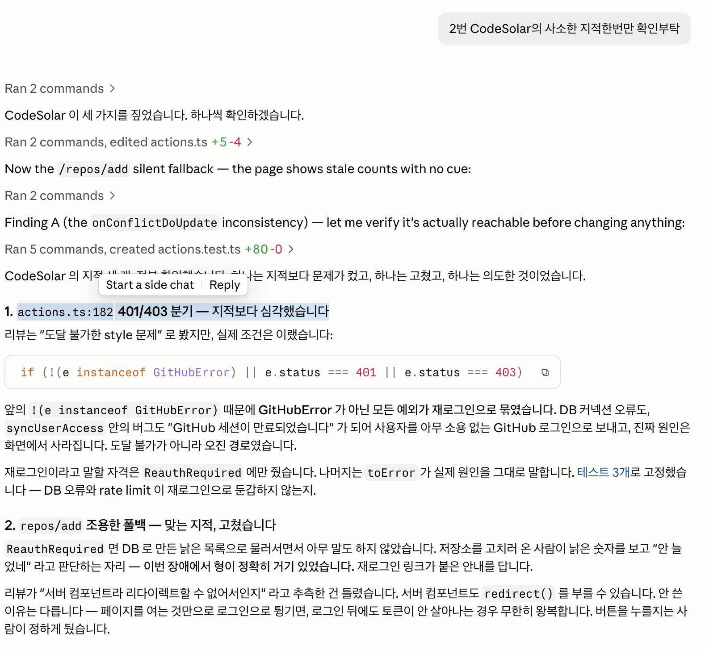
**이미지 캡션:** 이 이미지는 소프트웨어 개발자가 작성한 코드 리뷰 또는 버그 리포트의 일부로 보이며, 한국어로 작성된 텍스트가 대부분을 차지합니다. 화면 중앙에는 코드 스니펫이 포함된 텍스트 블록이 있으며, 그 위아래로 여러 줄의 설명과 질문이 나열되어 있습니다. 텍스트는 주로 코드의 특정 부분에 대한 문제점, 수정 사항, 그리고 그 이유에 대한 논의를 담고 있습니다. "CodeSolar"라는 이름이 언급되며, 이는 개발자나 시스템의 이름일 수 있습니다. 전반적으로 기술적인 내용을 다루는 문서의 일부로, 진지하고 분석적인 분위기입니다.
 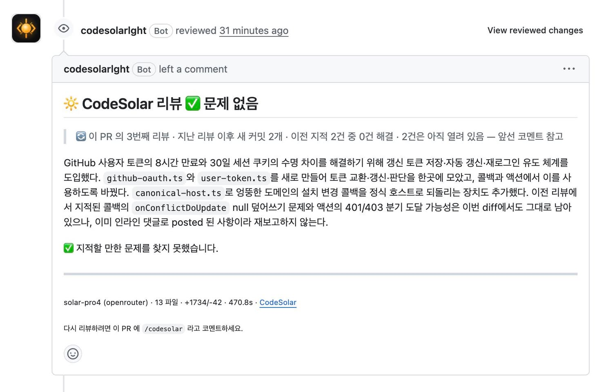
**이미지 캡션:** 이 이미지는 GitHub 코드 리뷰 화면의 일부로, "codesolarlght"라는 사용자가 "CodeSolar"라는 프로젝트에 대한 리뷰를 남긴 내용을 보여줍니다. 리뷰는 긍정적이며 "문제 없음"으로 요약되어 있습니다. 리뷰어는 성인 남성으로 추정되며, GitHub 봇으로 표시되어 있습니다. 리뷰 내용은 GitHub 사용자 토큰의 만료 시간과 세션 쿠키 수명 차이를 해결하기 위한 변경 사항에 대한 설명과 함께, 이전 리뷰에서 지적되었던 문제들이 이번 변경 사항에서도 그대로 남아있지만 이미 인라인 댓글로 논의된 사항이라 재확인하지 않았음을 명시하고 있습니다. 또한, 지적할 만한 새로운 문제를 찾지 못했음을 확인하는 체크 표시가 있습니다. 배경은 웹 기반의 코드 리뷰 인터페이스이며, 코드 파일 정보와 함께 리뷰를 다시 요청하는 안내 문구가 포함되어 있습니다. 전반적으로 기술적인 내용을 다루는 진지하고 전문적인 분위기입니다.

### 8월 20일 (목) 13:42 · 이런 일이? #SolarPro4가 OpenRouter 상용 모델 일일 토…

이런 일이? #SolarPro4가 OpenRouter 상용 모델 일일 토큰 사용량 10위에 올랐습니다! 좋은 모델입니다. https://openrouter.ai/upstage/solar-pro4 더 많이 사용해 주시면 TOP3도 노려보겠습니다.

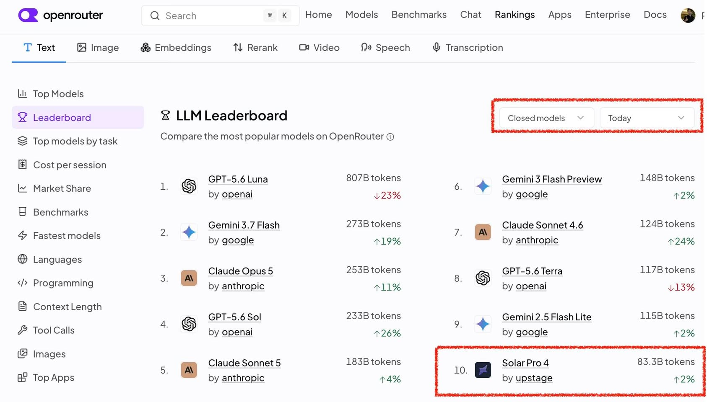
**이미지 캡션:** 이 이미지는 OpenRouter 웹사이트의 LLM 리더보드를 보여주며, 다양한 언어 모델의 인기도를 순위별로 나열하고 있습니다. 화면 왼쪽에는 'Top Models'라는 제목 아래 'Leaderboard', 'Top models by task', 'Cost per session', 'Market Share', 'Benchmarks', 'Fastest models', 'Languages', 'Programming', 'Context Length', 'Tool Calls', 'Images', 'Top Apps'와 같은 메뉴 항목들이 보입니다. 현재 'Leaderboard' 메뉴가 선택되어 보라색으로 강조 표시되어 있습니다. 화면 중앙 상단에는 'LLM Leaderboard'라는 제목과 함께 "Compare the most popular models on OpenRouter"라는 설명이 있습니다. 그 옆에는 'Closed models'와 'Today'라는 두 개의 드롭다운 메뉴가 보이며, 각각 필터링 옵션을 제공하는 것으로 보입니다. 리더보드 목록에는 1위부터 10위까지의 모델들이 표시되어 있으며, 각 모델의 이름, 개발사, 사용된 토큰 수, 그리고 이전 대비 변화율이 나타나 있습니다. 예를 들어, 1위는 OpenAI의 GPT-5.6 Luna로 807B 토큰이 사용되었고 23% 감소했습니다. 10위는 Upstage의 Solar Pro 4로 83.3B 토큰이 사용되었고 2% 증가했습니다. 각 모델 옆에는 해당 모델을 개발한 회사를 나타내는 로고나 약자가 표시되어 있습니다. 예를 들어, OpenAI는 챗GPT 로고, Google은 별 모양 로고, Anthropic은 'AI'가 적힌 갈색 로고를 사용하고 있습니다. 이 화면은 AI 모델의 성능 및 인기도를 비교하고 분석하는 데 사용될 수 있습니다.

### 8월 21일 (금) 12:01 · AMD Lisa Su President and CEO님께서 직접 #독파모…

AMD Lisa Su President and CEO님께서 직접 #독파모 3차수 진출과 #SolarPro4 출시를 축하해주셨습니다. 그리고 물론 저는 계속해서 AMD 칩 만장을 받기 위한 노력을 하고 있습니다. 

#SolarPro4가 정리한 Lisa Su와 Sung Kim 의 대담내용입니다.

1. 국가 sovereign AI 경쟁 3라운드 진출
Upstage가 한국의 국가 sovereign AI 파운데이션 모델 경쟁에 참여해 LG, SK Telecom과 함께 3라운드에 진출했으며, 이 경쟁에서 살아남은 유일한 스타트업입니다.

2. Solar Pro 4 출시 & 폭발적 사용량
신규 상업용 플래그십 Solar Pro 4를 출시했고, OpenRouter에 등록된 지 불과 3일 만에 하루 800억 토큰 소비를 돌파했습니다.

3. AMD와의 엔지니어링 협업 성과
하루 800억 토큰 처리량이 100% AMD 칩에서 이뤄지고 있으며, AMD와 Upstage 엔지니어링 팀이 지난 2개월간 협업하여 추론 처리량을 25% 향상시켰습니다.

4. 한국 AI 생태계 지원 의지
Lisa는 한국 AI 생태계에 대한 강한 지원 의지를 밝혔고, Upstage와 AMD의 협력이 오픈 생태계 기반 혁신의 사례라고 평가했습니다. AMD는 한국 정부와도 오픈 생태계 지원을 위한 MOU를 체결했습니다.

5. 한국에 10,000개 GPU 도입예정
AMD가 Upstage의 강력한 수요에 맞춰 한국에 10,000개의 AMD GPU(칩)를 도입할 예정입니다.

🎬 동영상 1개 (생략)

### 8월 22일 (토) 07:40 · 어제 Lisa Su 대표님과의 대화를 정말 잘 정리해주셔서 감사합니다. …

어제 Lisa Su 대표님과의 대화를 정말 잘 정리해주셔서 감사합니다. https://wikidocs.net/blog/@jaehong/29168/ 그리고 실레콘 벨리 영어까지 정리해주셔서 정말 재미있게 읽었습니다.

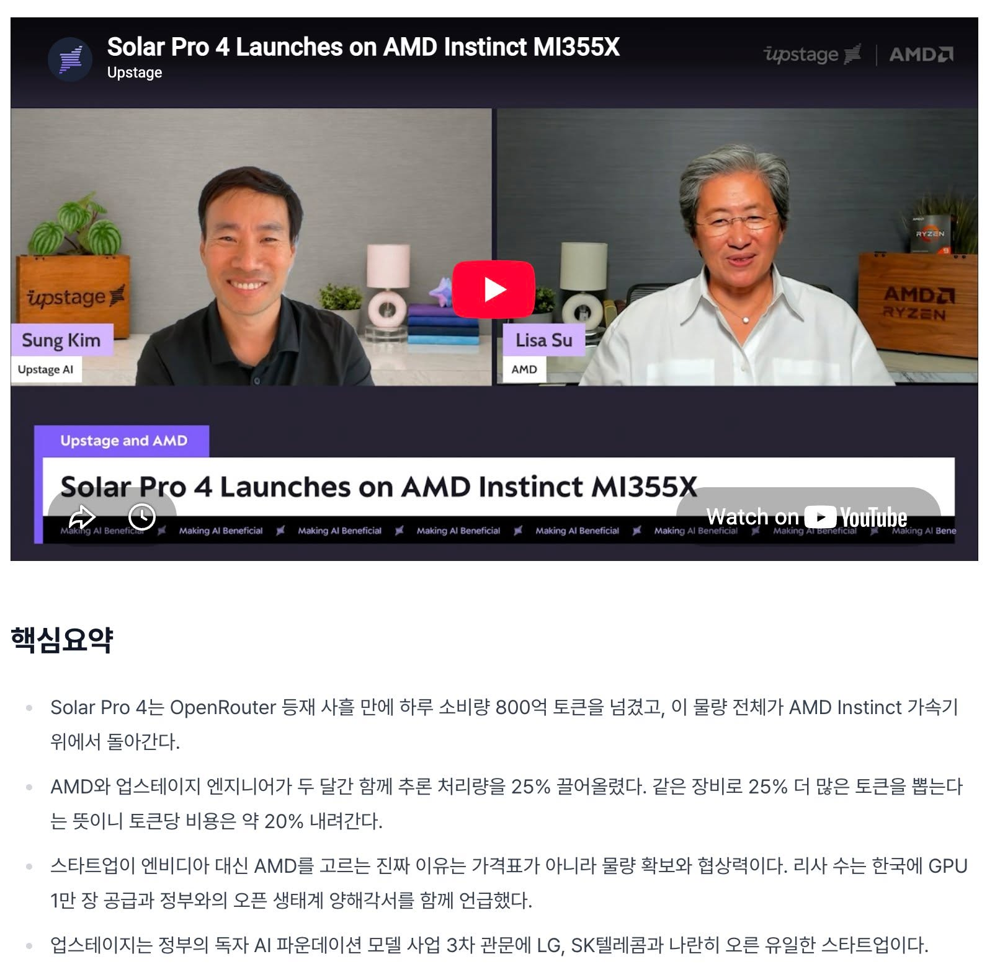
**이미지 캡션:** 화면에는 두 명의 인물이 등장하며, 왼쪽에는 검은색 셔츠를 입은 동양인 성인 남성이, 오른쪽에는 흰색 셔츠를 입은 동양인 성인 여성이 보인다. 남성은 미소를 띠고 있으며, 여성은 부드러운 표정으로 카메라를 응시하고 있다. 배경에는 식물, 조명, 책 등이 놓여 있으며, AMD 로고가 새겨진 나무 상자도 보인다. 화면 상단에는 "Solar Pro 4 Launches on AMD Instinct MI355X"라는 제목과 함께 "Upstage"와 "AMD" 로고가 표시되어 있다. 화면 하단에는 "핵심요약"이라는 제목 아래 네 가지 요점이 한국어로 작성되어 있으며, "Watch on YouTube"라는 문구와 함께 유튜브 시청을 유도하는 버튼이 있다. 전반적으로 기술 발표 또는 제품 소개와 관련된 영상의 일부로 보이며, 진지하면서도 긍정적인 분위기를 풍긴다.
 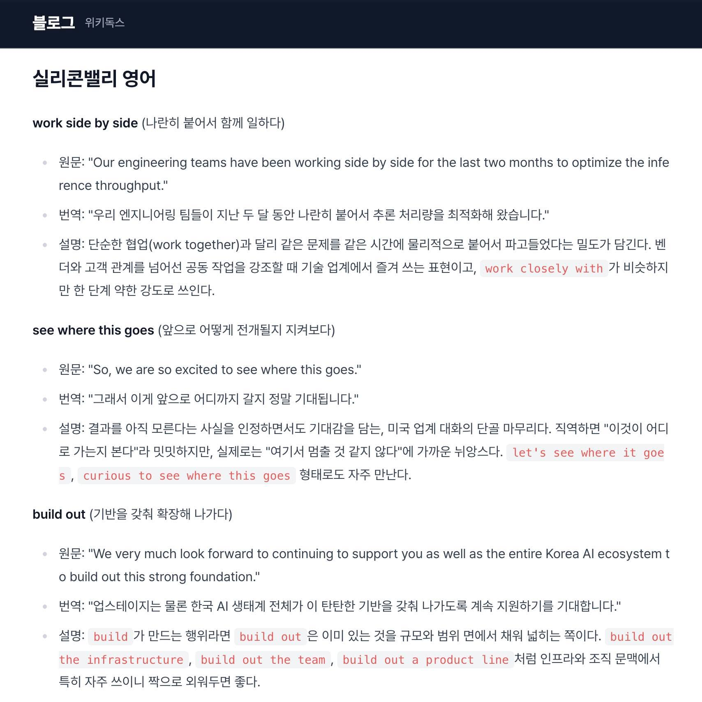
**이미지 캡션:** 이 이미지는 한국어 블로그 게시물의 일부로, 실리콘밸리에서 자주 사용되는 영어 표현들을 소개하고 있습니다. 화면 상단에는 "블로그 위키독스"라는 로고가 보이며, 그 아래에는 "실리콘밸리 영어"라는 제목이 있습니다. 본문은 세 가지 영어 표현을 중심으로 구성되어 있습니다. 첫 번째는 "work side by side (나란히 붙어서 함께 일하다)"로, 원문, 번역, 그리고 이 표현이 단순한 협업을 넘어 물리적으로 함께 문제를 파고드는 밀도를 나타낸다는 설명이 포함되어 있습니다. 두 번째는 "see where this goes (앞으로 어떻게 전개될지 지켜보다)"로, 결과에 대한 기대감을 표현하는 미국 업계의 관용적인 표현임을 설명하고 있습니다. 세 번째는 "build out (기반을 갖춰 확장해 나가다)"로, 이미 있는 것을 규모와 범위 면에서 채워 넓히는 것을 의미하며, 특히 인프라, 팀, 제품 라인 등과 함께 자주 사용된다는 설명이 있습니다. 각 표현마다 원문 영어 문장, 한국어 번역, 그리고 해당 표현의 뉘앙스와 사용 맥락에 대한 상세한 설명이 점선으로 구분되어 제공됩니다. 전체적으로 정보 전달에 초점을 맞춘 깔끔하고 정돈된 레이아웃을 보여줍니다.

### 8월 22일 (토) 08:54 · 배경훈 부총리 겸 과학기술정보통신부 장관 님의 멋진 말씀을 #SolarP…

배경훈 부총리 겸 과학기술정보통신부 장관 님의 멋진 말씀을 #SolarPro4로 3줄 요약 + 12개 챕터로 요약해 보았습니다. 

https://oaken-koan-d96e.here.now/
독자 AI 모델이 필요하고 모두를 위한 AI로 격차를 해소해야 한다는 말씀 너무 감사합니다.

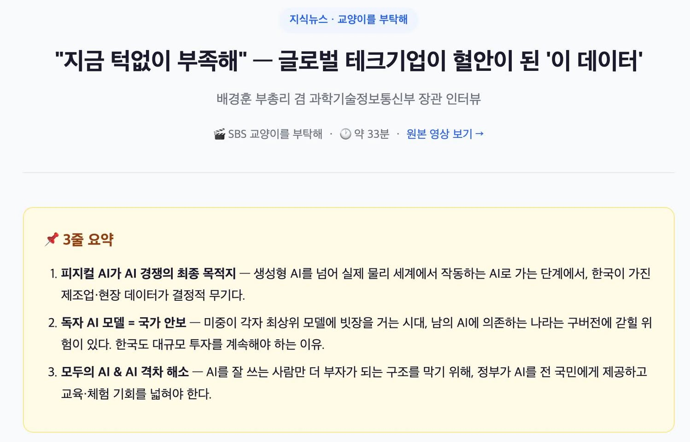
**이미지 캡션:** 이 이미지는 "지금 턱없이 부족해"라는 제목의 기사 일부를 보여주며, 글로벌 테크 기업들이 특정 데이터에 혈안이 되어 있다는 내용을 담고 있습니다. 기사는 배경훈 부총리 겸 과학기술정보통신부 장관의 인터뷰 내용을 바탕으로 하며, SBS 교양이를 부탁해 채널에서 약 33분 분량의 원본 영상을 볼 수 있다는 정보가 함께 제공됩니다. 기사 하단에는 "3줄 요약"이라는 제목으로 세 가지 핵심 내용이 요약되어 있습니다. 첫 번째 요약은 피지컬 AI가 AI 경쟁의 최종 목적지이며, 한국이 가진 제조업·현장 데이터가 중요한 역할을 할 것이라고 설명합니다. 두 번째 요약은 독자적인 AI 모델 구축이 국가 안보와 직결되며, 미중 경쟁 속에서 AI 의존은 위험할 수 있으므로 한국도 대규모 투자가 필요함을 강조합니다. 마지막 세 번째 요약은 AI 격차 해소를 위해 정부가 AI를 전 국민에게 제공하고 교육·체험 기회를 확대해야 한다는 내용을 담고 있습니다. 전반적으로 AI 기술과 데이터의 중요성, 그리고 한국의 AI 경쟁력 강화 방안에 대한 정보를 전달하는 뉴스 기사의 일부로 보입니다.

### 8월 22일 (토) 08:59 · Sung Kim shared a link.

🔗 <https://oaken-koan-d96e.here.now/>

### 8월 23일 (일) 12:48 · #SolarPro4 OpenRouter 상용 모델 중 9위를 차지했습니다…

#SolarPro4 OpenRouter 상용 모델 중 9위를 차지했습니다. 좋은 모델입니다. 많이 사용해주세요. https://openrouter.ai/upstage/solar-pro4 (주말이라 사용이 조금 내려갔지만 다시 주중 100B 목표로 달려봅니다.)

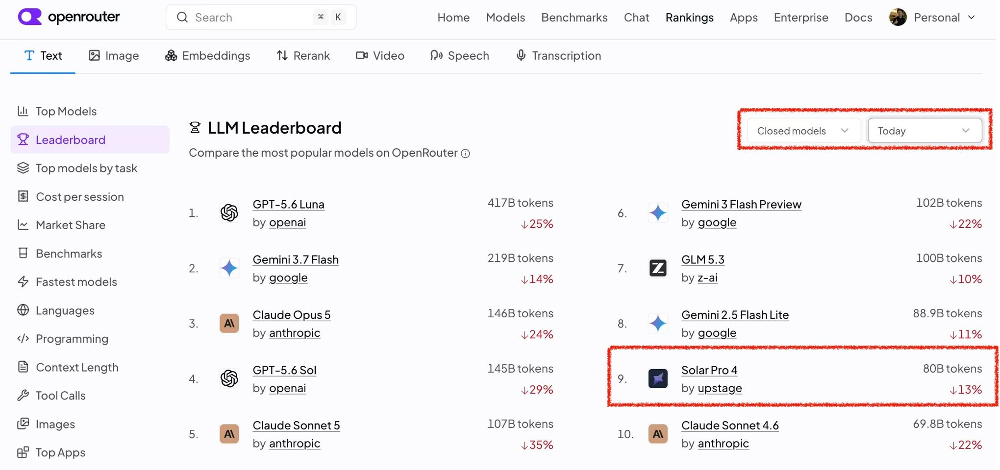
**이미지 캡션:** 이 이미지는 OpenRouter 웹사이트의 LLM 리더보드를 보여줍니다. 화면 왼쪽에는 "Top Models", "Leaderboard", "Top models by task", "Cost per session", "Market Share", "Benchmarks", "Fastest models", "Languages", "Programming", "Context Length", "Tool Calls", "Images", "Top Apps"와 같은 메뉴 항목이 나열되어 있으며, 현재 "Leaderboard"가 선택되어 보라색으로 강조 표시되어 있습니다. 화면 중앙에는 "LLM Leaderboard"라는 제목과 함께 "Compare the most popular models on OpenRouter"라는 설명이 있습니다. 그 아래에는 순위별로 모델 목록이 표시되어 있으며, 각 모델에는 순위 번호, 로고, 모델 이름, 개발사, 사용된 토큰 수, 그리고 이전 대비 변화율이 표시됩니다. 예를 들어, 1위는 OpenAI의 GPT-5.6 Luna로 417B 토큰을 사용했으며 25% 감소했습니다. 9위에는 Upstage의 Solar Pro 4가 80B 토큰을 사용하며 13% 감소한 것으로 표시되어 있으며, 이 항목은 빨간색 테두리로 강조되어 있습니다. 화면 오른쪽 상단에는 "Closed models"와 "Today"라는 두 개의 드롭다운 메뉴가 있으며, 현재 "Closed models"와 "Today"가 선택되어 있습니다. 화면 상단에는 OpenRouter 로고, 검색창, 그리고 "Home", "Models", "Benchmarks", "Chat", "Rankings", "Apps", "Enterprise", "Docs", "Personal"과 같은 네비게이션 링크가 있습니다. 전반적으로 기술적인 웹사이트의 인터페이스를 보여주는 스크린샷입니다.

### 8월 23일 (일) 16:48 · #SolarPro4가 가장 잘하는 영역 중 하나인 자연스러운 글쓰기를 M…

#SolarPro4가 가장 잘하는 영역 중 하나인 자연스러운 글쓰기를 MCP로 바로 연결해서 (하루 100콜) 무료로 사용하실 수 있습니다.

"이 MCP 서버 설치해 줘 — https://human-proofreader-mcp.vercel.app"

한줄이면 됩니다.

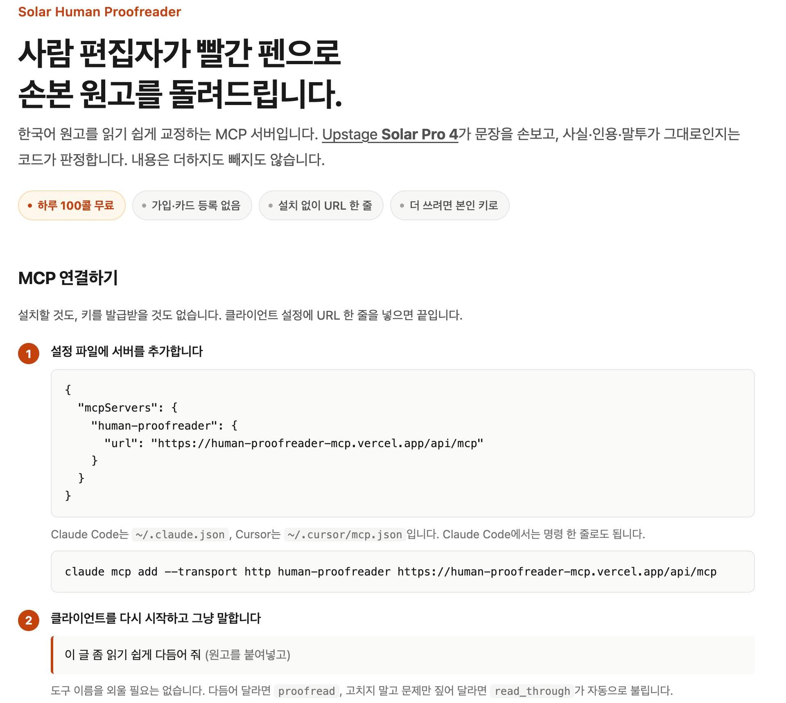
**이미지 캡션:** 이 이미지는 "Solar Human Proofreader"라는 서비스의 웹페이지 일부를 보여줍니다. 상단에는 "사람 편집자가 빨간 펜으로 손본 원고를 돌려드립니다."라는 큰 제목이 있고, 그 아래에는 서비스에 대한 설명이 한국어로 작성되어 있습니다. 서비스는 한국어 원고를 쉽게 교정하는 MCP 서버를 사용하며, Upstage Solar Pro 4가 문장을 검토하고 사실, 인용, 말투 등을 코드가 판정한다고 설명합니다. 또한, "하루 100콜 무료", "가입·카드 등록 없음", "설치 없이 URL 한 줄", "더 쓰려면 본인 키로"와 같은 기능 버튼들이 보입니다. "MCP 연결하기" 섹션에서는 설치나 키 발급 없이 클라이언트 설정에 URL 한 줄만 넣으면 된다고 안내합니다. 첫 번째 단계로 "설정 파일에 서버를 추가합니다"라는 설명과 함께 JSON 형식의 설정 코드가 표시됩니다. 이 코드에는 "mcpServers" 아래에 "human-proofreader"라는 이름으로 "url"이 "https://human-proofreader-mcp.vercel.app/api/mcp"로 설정되어 있습니다. 이어서 "Claude Code는 ~/.claude.json, Cursor는 ~/.cursor/mcp.json 입니다. Claude Code에서는 명령 한 줄로도 됩니다."라는 설명과 함께 명령줄 인터페이스(CLI)에서 사용할 수 있는 명령어 예시인 "claude mcp add --transport http human-proofreader https://human-proofreader-mcp.vercel.app/api/mcp"가 제시됩니다. 두 번째 단계는 "클라이언트를 다시 시작하고 그냥 말합니다"이며, 사용자가 "이 글 좀 읽기 쉽게 다듬어 줘 (원고를 붙여넣고)"라고 말하는 예시가 제공됩니다. 마지막으로, "도구 이름을 외울 필요는 없습니다. 다듬어 달라면 proofread, 고치지 말고 문제만 짚어 달라면 read_through 가 자동으로 불립니다."라는 안내 문구가 있습니다. 전반적으로 이 페이지는 "Solar Human Proofreader"라는 서비스의 설치 및 사용 방법을 안내하는 튜토리얼 페이지로 보이며, 기술적인 내용을 포함하고 있습니다. 배경은 흰색이며, 텍스트는 검은색과 회색으로 구성되어 있습니다. 특별히 사람이나 사물이 등장하지는 않고, 텍스트와 코드 블록 위주로 구성되어 있습니다. 분위기는 정보 전달에 초점을 맞춘 차분하고 명확한 느낌입니다.
 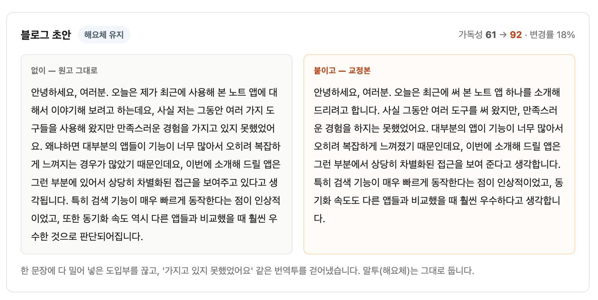
**이미지 캡션:** 이 이미지는 블로그 게시물의 초안과 교정본을 보여주는 스크린샷입니다. 화면 상단에는 "블로그 초안"이라는 제목과 "해요체 유지"라는 태그가 있습니다. 그 옆에는 "가독성 61→92·변경률 18%"라는 텍스트가 있습니다. 화면은 두 개의 열로 나뉘어 있으며, 왼쪽 열에는 "없이 - 원고 그대로"라는 제목 아래 초안이, 오른쪽 열에는 "붙이고 - 교정본"이라는 제목 아래 교정본이 있습니다. 두 텍스트 모두 노트 앱에 대한 소개글이며, 앱의 검색 속도와 동기화 속도가 빠르다는 점을 장점으로 언급하고 있습니다. 하단에는 "한 문장에 다 밀어 넣은 도입부를 끊고, '가지고 있지 못했었어요' 같은 번역투를 걷어냈습니다. 말투(해요체)는 그대로 둡니다."라는 설명이 있습니다. 이미지에는 사람이 등장하지 않으며, 배경은 흰색입니다. 전반적으로 텍스트 편집 및 개선 과정을 보여주는 문서의 일부로 보입니다.
 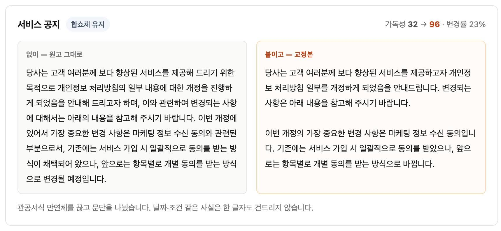
**이미지 캡션:** 이 이미지는 웹페이지의 일부로, "서비스 공지"라는 제목과 함께 "합쇼체 유지"라는 부제가 표시되어 있습니다. 페이지 상단에는 "가독성 32 → 96 · 변경률 23%"라는 정보가 나타나 있습니다. 본문은 두 개의 열로 나뉘어 있으며, 왼쪽 열은 "없이 - 원고 그대로"라는 제목으로, 오른쪽 열은 "붙이고 - 교정본"이라는 제목으로 구성되어 있습니다. 두 열 모두 고객에게 더 나은 서비스를 제공하기 위해 개인정보 처리방침의 일부를 개정하게 되었음을 알리는 내용입니다. 특히, 마케팅 정보 수신 동의 방식이 기존의 일괄 동의에서 항목별 개별 동의 방식으로 변경된다는 점을 강조하고 있습니다. 하단에는 "관공서식 만연체를 끊고 문단을 나눴습니다. 날짜·조건 같은 사실은 한 글자도 건드리지 않습니다."라는 문구가 있습니다. 전반적으로 정보 전달을 목적으로 하는 공지사항의 형태로, 딱딱한 관공서식 문체를 개선하려는 의도가 엿보입니다.
 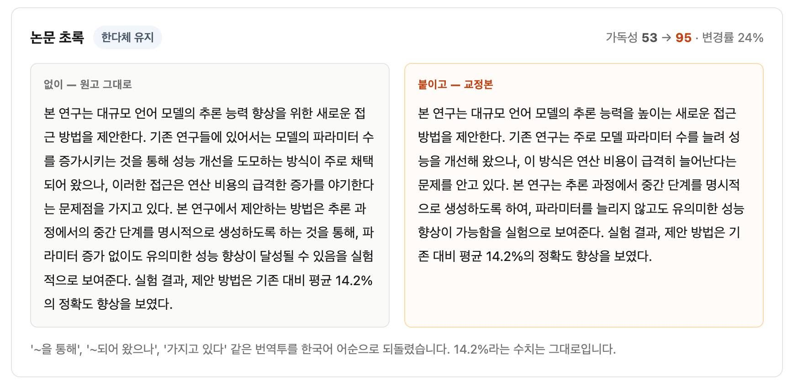
**이미지 캡션:** 이 이미지는 두 개의 텍스트 블록으로 구성된 문서의 일부를 보여줍니다. 왼쪽 블록은 "논문 초록"이라는 제목 아래 "한다체 유지"라는 하위 제목과 함께 "없이 - 원고 그대로"라는 내용으로 시작합니다. 이 텍스트는 대규모 언어 모델의 추론 능력 향상을 위한 새로운 접근 방식을 제안하는 연구에 대해 설명하며, 기존 연구들이 파라미터 수를 늘리는 방식이 연산 비용을 증가시킨다는 문제점을 지적합니다. 본 연구에서 제안하는 방법은 중간 단계를 명시적으로 생성하여 파라미터 증가 없이 성능을 향상시키며, 실험 결과 기존 대비 평균 14.2%의 정확도 향상을 보였다고 언급합니다. 오른쪽 블록은 "붙이고 - 교정본"이라는 제목과 함께 "가독성 53 → 95 · 변경률 24%"라는 정보를 포함하고 있습니다. 이 텍스트는 왼쪽 블록과 유사한 내용을 담고 있으며, 대규모 언어 모델의 추론 능력 향상을 위한 새로운 접근 방식을 제안하고, 기존 방식의 문제점을 지적하며, 제안 방법이 파라미터 증가 없이 성능 향상을 가져온다는 점을 강조합니다. 마지막으로, 이미지 하단에는 "'~을 통해', '~되어 왔으나', '가지고 있다' 같은 번역투를 한국어 어순으로 되돌렸습니다. 14.2%라는 수치는 그대로입니다."라는 문구가 있어, 텍스트 수정 및 번역에 대한 설명임을 알 수 있습니다. 전반적으로, 이 이미지는 학술 논문의 초록 또는 교정본의 일부를 보여주며, 언어 모델 연구에 대한 내용을 다루고 있습니다.

### 8월 26일 (수) 12:36 · 대표적인 Super Agent 기반 올인원 AI 워크스페이스 #Gensp…

대표적인 Super Agent 기반 올인원 AI 워크스페이스 #Genspark 에 #SolarPro4 가 올라갔습니다. Genspark을 사용하시면 AI Chat에서 꼭 찾아보셔요. AI Chat을 시작으로 전체 플랫폼에 적용됩니다.

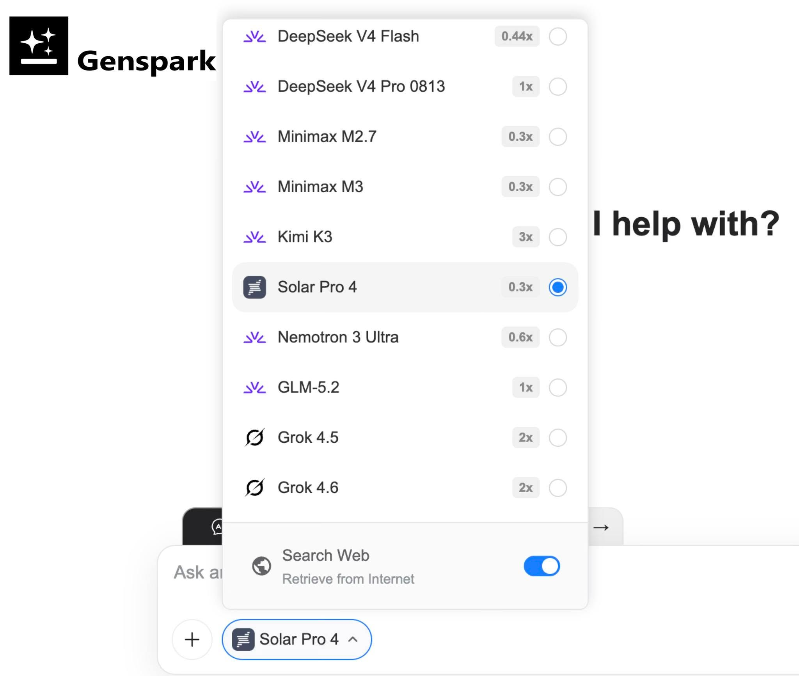
**이미지 캡션:** 이 이미지는 웹사이트의 사용자 인터페이스를 보여주며, "Genspark"라는 로고와 함께 "I help with?"라는 문구가 오른쪽에 표시되어 있습니다. 왼쪽 상단에는 검은색 배경에 흰색 별 모양 아이콘이 있고, 그 옆에 "Genspark"라는 글자가 있습니다. 화면 중앙에는 여러 AI 모델의 목록이 드롭다운 메뉴 형태로 나타나 있으며, 각 모델 이름 옆에는 배율(예: 0.44x, 1x, 0.3x)과 선택 버튼이 있습니다. 현재 "Solar Pro 4" 모델이 선택되어 있으며, 해당 모델 옆의 배율은 0.3x이고 파란색으로 채워진 원형 선택 버튼이 표시되어 있습니다. 목록 하단에는 "Search Web" 옵션이 있으며, "Retrieve from Internet"이라는 설명과 함께 파란색 토글 스위치가 켜져 있습니다. 그 아래에는 "Ask al"이라는 입력창과 "+" 버튼이 보이며, "+" 버튼 옆에는 다시 "Solar Pro 4"라는 선택된 모델이 표시되어 있습니다. 전체적으로 사용자가 AI 모델을 선택하고 웹 검색 기능을 활성화하는 과정을 보여주는 인터페이스로, 깔끔하고 현대적인 디자인입니다.
 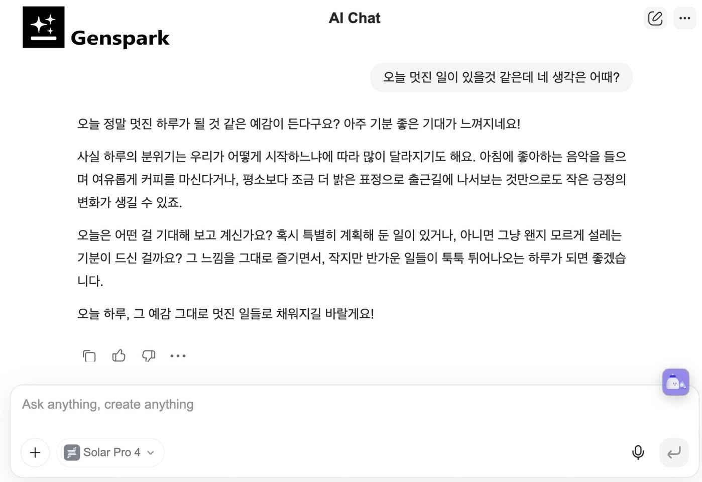
**이미지 캡션:** 이 화면은 AI 챗봇과의 대화 인터페이스를 보여줍니다. 화면 상단에는 "Genspark"라는 로고와 함께 "AI Chat"이라는 제목이 표시되어 있습니다. 중앙에는 AI 챗봇이 사용자에게 "오늘 멋진 일이 있을 것 같은데 네 생각은 어때?"라고 묻는 메시지 풍선이 있습니다. 그 아래에는 AI 챗봇이 "오늘 정말 멋진 하루가 될 것 같은 예감이 든다구요? 아주 기분 좋은 기대가 느껴지네요! 사실 하루의 분위기는 우리가 어떻게 시작하느냐에 따라 많이 달라지기도 해요. 아침에 좋아하는 음악을 들으며 여유롭게 커피를 마신다거나, 평소보다 조금 더 밝은 표정으로 출근길에 나서보는 것만으로도 작은 긍정의 변화가 생길 수 있죠. 오늘은 어떤 걸 기대해 보고 계신가요? 혹시 특별히 계획해 둔 일이 있거나, 아니면 그냥 왠지 모르게 설레는 기분이 드신 걸까요? 그 느낌을 그대로 즐기면서, 작지만 반가운 일들이 툭툭 튀어나오는 하루가 되면 좋겠습니다. 오늘 하루, 그 예감 그대로 멋진 일들로 채워지길 바랄게요!"라고 답하는 내용이 이어집니다. 대화창 하단에는 좋아요, 싫어요, 댓글 등의 아이콘과 함께 "Ask anything, create anything"이라는 입력창이 보이며, 그 옆에는 "Solar Pro 4"라는 AI 모델 이름이 표시되어 있습니다. 전반적으로 긍정적이고 희망적인 분위기를 띠고 있습니다.

### 8월 28일 (금) 07:25 · 코드를 작성하신다면, 특히 AI로 코드를 작성하신다면 #Solar 빛으로…

코드를 작성하신다면, 특히 AI로 코드를 작성하신다면 #Solar 빛으로 코드를 환하게 해주는 https://codesolar.dev/ 로 버그를 잡으셔요. github repos 등록만 하시면 됩니다.

저희 회사에서 사용 중인데 벌써 128건의 중요 이슈를 fix 했습니다. #CodeSolar가 없었다면 이 버그들이 그대로 시스템에 들어갈 뻔했습니다. 꼭 사용해보셔요.

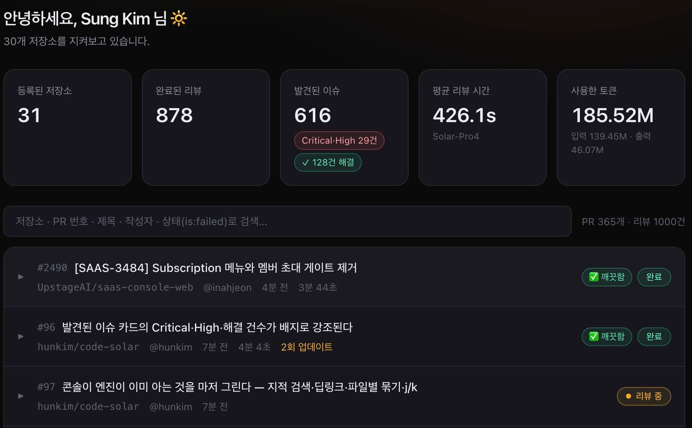
**이미지 캡션:** 이 이미지는 소프트웨어 개발 프로젝트의 대시보드를 보여주며, 한국어로 "안녕하세요, Sung Kim 님"이라는 인사말과 함께 "30개 저장소를 지켜보고 있습니다."라는 문구가 상단에 표시되어 있습니다. 화면 중앙에는 다섯 개의 주요 지표가 카드 형태로 나열되어 있는데, 각각 "등록된 저장소 31", "완료된 리뷰 878", "발견된 이슈 616 (Critical-High 29건, 128건 해결)", "평균 리뷰 시간 426.1초 (Solar-Pro4)", "사용한 토큰 185.52M (입력 139.45M, 출력 46.07M)"을 나타냅니다. 이 카드들 아래에는 "저장소·PR 번호·제목·작성자·상태(is:failed)로 검색..."이라는 검색창이 있으며, 그 아래에는 최근 활동 목록이 표시됩니다. 목록에는 "#2490 [SAAS-3484] Subscription 메뉴와 멤버 초대 게이트 제거"라는 제목의 항목이 UpstageAI/saas-console-web 저장소에서 @inahjeon 사용자에 의해 4분 전에 생성되었고, 3분 44초 전에 완료되었음을 보여주는 버튼과 함께 나타납니다. 다음으로 "#96 발견된 이슈 카드의 Critical-High·해결 건수가 배지로 강조된다"라는 제목의 항목이 hunkim/code-solar 저장소에서 @hunkim 사용자에 의해 7분 전에 생성되었고, 4분 4초 전에 2회 업데이트되었으며, "깨끗함"과 "완료" 버튼이 있습니다. 마지막으로 "#97 콘솔이 엔진이 이미 아는 것을 마저 그린다 — 지적 검색·딥링크·파일별 묶기·j/k"라는 제목의 항목이 hunkim/code-solar 저장소에서 @hunkim 사용자에 의해 7분 전에 생성되었고, "리뷰 중"이라는 상태 표시와 함께 나타납니다. 화면 오른쪽 상단에는 "PR 365개·리뷰 1000건"이라는 추가 정보가 보입니다. 전반적으로 이 대시보드는 개발 프로젝트의 진행 상황과 이슈 관리 현황을 시각적으로 제공하며, 어두운 배경에 밝은 텍스트와 아이콘을 사용하여 가독성을 높였습니다.
 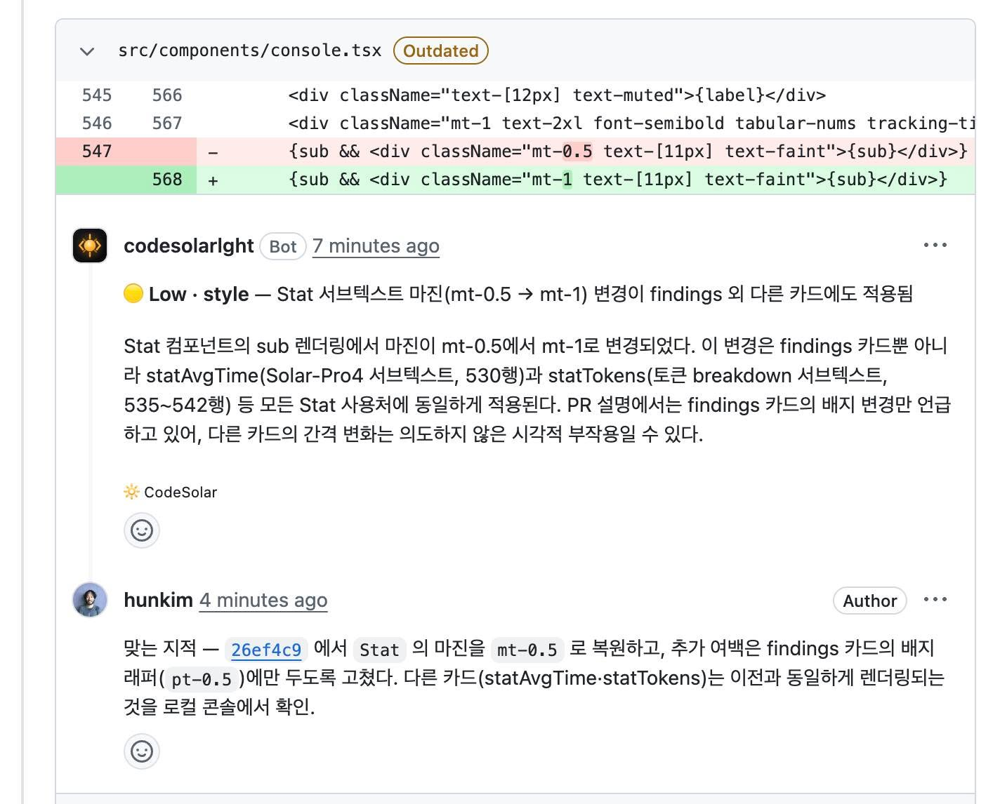
**이미지 캡션:** 화면 상단에는 코드 편집기 화면이 보이며, `src/components/console.tsx` 파일의 일부가 표시되고 있다. 줄 번호 545부터 547까지의 코드가 강조 표시되어 있으며, 특히 547번 줄은 분홍색으로 하이라이트되어 있다. 그 아래에는 `codesolarlght`라는 사용자가 "Low style - Stat 서브텍스트 마진(mt-0.5 → mt-1) 변경이 findings 외 다른 카드에도 적용됨"이라는 제목으로 댓글을 작성했다. 댓글 내용은 Stat 컴포넌트의 sub 렌더링에서 마진이 mt-0.5에서 mt-1로 변경되었으며, 이 변경이 findings 카드뿐 아니라 다른 카드에도 적용되었음을 설명하고 있다. 또한, PR 설명에서는 findings 카드만 언급되어 있어 다른 카드의 간격 변화는 의도치 않은 부작용일 수 있다고 덧붙였다. 이어서 `hunkim`이라는 사용자가 "맞는 지적 - 26ef4c9 에서 Stat 의 마진을 mt-0.5로 복원하고, 추가 여백은 findings 카드의 배지 래퍼(pt-0.5)에만 두도록 고쳤다. 다른 카드(statAvgTime-statTokens)는 이전과 동일하게 렌더링되는 것을 로컬 콘솔에서 확인."이라는 댓글을 작성했다. 두 댓글 모두 코드 변경 사항에 대한 논의를 담고 있으며, 기술적인 내용을 다루고 있어 개발 관련 커뮤니티의 대화로 보인다. 전체적으로 차분하고 정보 전달에 집중하는 분위기이다.

### 8월 28일 (금) 10:09 · #100B #꿈은이루어진다  OpenRouter에서 하루 100B 토큰 …

#100B #꿈은이루어진다  OpenRouter에서 하루 100B 토큰 판매를 해보고 싶었는데 2026년 8월 27일 더디어 100B 달성했습니다. 모두 #SolarPro4 를 많이 사용해주신 여러분들 덕분입니다.

계속 200B, 300B, 1T 까지 업업업 해보겠습니다. https://openrouter.ai/upstage/solar-pro4 더 많이 사용해주셔요.

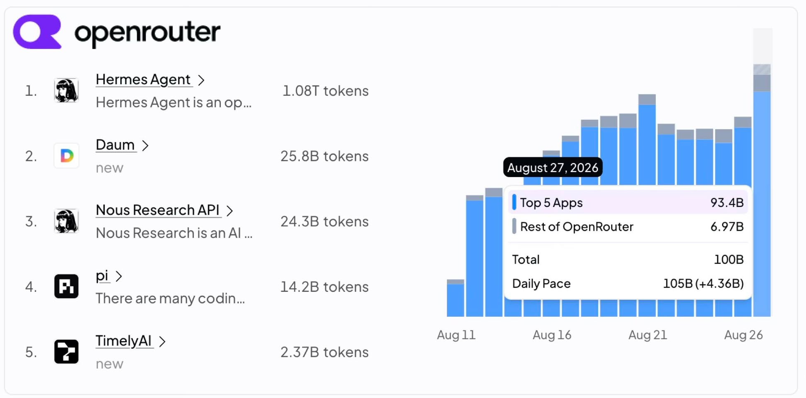
**이미지 캡션:** 화면에는 "openrouter"라는 로고와 함께 AI 모델 사용량을 보여주는 순위 목록과 막대 그래프가 표시됩니다. 목록에는 1위부터 5위까지의 항목이 있으며, 각 항목에는 순위 번호, 앱 아이콘, 앱 이름, 간단한 설명, 그리고 사용된 토큰 수가 표시됩니다. 1위는 "Hermes Agent"로 1.08T 토큰을 사용했으며, 2위는 "Daum"으로 25.8B 토큰, 3위는 "Nous Research API"로 24.3B 토큰, 4위는 "pi"로 14.2B 토큰, 5위는 "TimelyAI"로 2.37B 토큰을 사용했습니다. 앱 아이콘으로는 1위와 3위가 동일한 여성 캐릭터 이미지이고, 2위는 'D' 글자가 있는 아이콘, 4위는 검은색 배경에 흰색 기하학적 패턴, 5위는 검은색 배경에 흰색 기하학적 패턴으로 4위와 유사하지만 약간 다릅니다. 화면 오른쪽에는 8월 11일부터 26일까지의 토큰 사용량을 보여주는 누적 막대 그래프가 있습니다. 그래프 위에는 "August 27, 2026"이라는 날짜가 표시된 툴팁이 있으며, 이 툴팁에는 "Top 5 Apps"가 93.4B, "Rest of OpenRouter"가 6.97B, "Total"이 100B, "Daily Pace"가 105B(+4.36B)라고 표시되어 있습니다. 그래프의 막대는 파란색과 회색으로 구성되어 있으며, 파란색은 "Top 5 Apps"를, 회색은 "Rest of OpenRouter"를 나타내는 것으로 보입니다. 전반적으로 이 화면은 AI 모델 사용량 데이터를 시각적으로 보여주는 대시보드 또는 분석 페이지의 일부로 보이며, 긍정적이고 성장하는 추세를 나타내는 분위기입니다.

### 8월 28일 (금) 10:25 · #독파모 로 만든 모델 #모두의AI  로 완성합니다. 업스테이지가 모델을…

#독파모 로 만든 모델 #모두의AI  로 완성합니다. 업스테이지가 모델을 제공하고, Daum이 포털 서비스로 함께하는 KT 컨소시엄이 ‘모두의 AI’ 프로젝트 사업자로 선정되었습니다. 2030년까지 정부와 함께 모두를 위한 AI 시대, 1인 1 Agent 시대를 열어갑니다.

많은 기대를 해주셔도 좋습니다. #SolarLLM도 많이 사용해 주시면서 부족한 부분 의견을 주시면 빠르게 반영하여 만족할 만한 모델과 서비스로 보답하겠습니다.

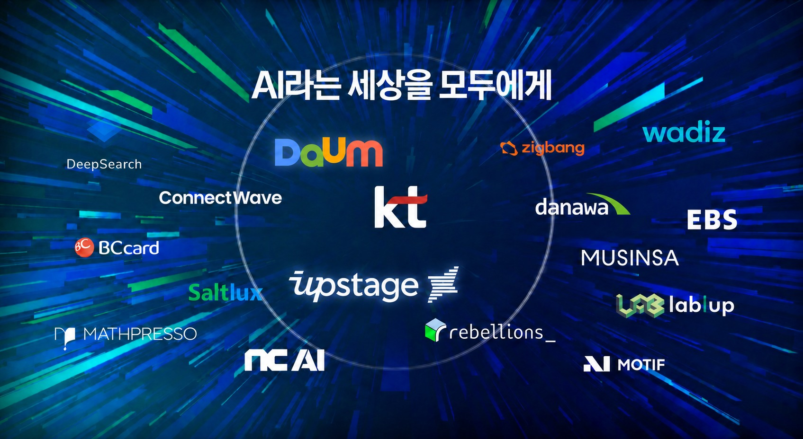
**이미지 캡션:** 이 이미지는 "AI라는 세상을 모두에게"라는 문구와 함께 여러 기업 로고들이 원형으로 배치된 그래픽입니다. 배경은 푸른색과 녹색의 빛줄기가 뻗어나가는 듯한 추상적인 디자인으로, 미래지향적이고 역동적인 분위기를 연출합니다. 중앙에는 KT, Daum, Upstage와 같은 한국의 주요 IT 기업 로고들이 크게 자리 잡고 있으며, 그 주변으로 Wadiz, Zigbang, Danawa, EBS, Musinsa, Lablup, Motif, Mathpresso, DeepSearch, ConnectWave, BCCard, Saltlux, NCAI, Rebellions_ 등 다양한 분야의 기업 로고들이 배치되어 있습니다. 이미지에는 사람이 등장하지 않으며, 텍스트는 주로 기업 로고와 상단의 한국어 문구로 구성되어 있습니다. 전반적으로 인공지능 기술을 통해 다양한 기업들이 협력하여 더 나은 세상을 만들어가고자 하는 비전을 보여주는 듯한 느낌을 줍니다.

### 8월 29일 (토) 12:08 · 독립된 기관에서 #SolarPro4 성능이 좋다고 평가해주셨습니다. 아직…

독립된 기관에서 #SolarPro4 성능이 좋다고 평가해주셨습니다. 아직 KIMI3보다는 낮지만 많이 사용해주시면 빨리 따라가 보겠습니다. #SolarPro4 좋은 모델입니다.

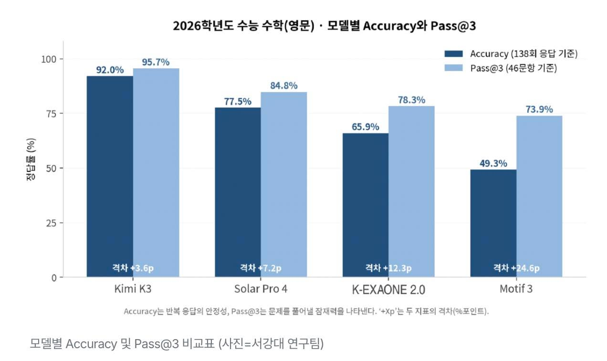
**이미지 캡션:** 이 이미지는 2026학년도 수능 수학(영문) 과목에 대한 모델별 Accuracy와 Pass@3 지표를 비교하는 막대 그래프입니다. 그래프는 네 개의 모델(Kimi K3, Solar Pro 4, K-EXAONE 2.0, Motif 3)에 대해 두 가지 지표를 보여줍니다. 파란색 막대는 Accuracy(138회 응답 기준)를 나타내며, 연한 파란색 막대는 Pass@3(46문항 기준)를 나타냅니다. Y축은 정답률(%)을 나타내며 0부터 100까지 표시됩니다. 각 모델별로 Accuracy와 Pass@3의 정확도 수치가 막대 위에 표시되어 있으며, 두 지표 간의 격차(%포인트)도 막대 하단에 표시되어 있습니다. 예를 들어, Kimi K3 모델은 Accuracy 92.0%, Pass@3 95.7%이며, 격차는 +3.6p입니다. Solar Pro 4 모델은 Accuracy 77.5%, Pass@3 84.8%이며, 격차는 +7.2p입니다. K-EXAONE 2.0 모델은 Accuracy 65.9%, Pass@3 78.3%이며, 격차는 +12.3p입니다. Motif 3 모델은 Accuracy 49.3%, Pass@3 73.9%이며, 격차는 +24.6p입니다. 그래프 하단에는 Accuracy는 반복 응답의 안정성을, Pass@3는 문제를 풀어낼 잠재력을 나타낸다는 설명과 함께 '+Xp'는 두 지표의 격차(%포인트)임을 명시하고 있습니다. 이미지의 제목은 "2026학년도 수능 수학(영문) ㆍ모델별 Accuracy와 Pass@3"이며, 사진 출처는 "서강대 연구팀"으로 표기되어 있습니다. 전반적으로 차분하고 정보 전달에 집중된 분위기이며, 교육 및 AI 모델 성능 평가와 관련된 내용을 담고 있습니다.

### 8월 29일 (토) 12:08 · Sung Kim shared a link.

🔗 <https://www.aitimes.com/news/articleView.html?idxno=214456>

### 8월 30일 (일) 17:33 · LLM의 가장 많은 use case는 여전히 문서에서 원하는 *정답*을 …

LLM의 가장 많은 use case는 여전히 문서에서 원하는 *정답*을 빠르게 찾는 것입니다. Upstage에서 최근 출시한 가볍고 빠른 Embeddings2 그리고 파일만 주시면 RAG를 구현하고 SolarPro4를 호출하여 정답을 찾아 주는 FileSearch API를 공개합니다.

몇 줄의 코드로 원하는 RAG가 완성됩니다. 또는 바이브코딩시 https://console.upstage.ai/llms.txt 만 주시면 알아서 만들어 줄 것입니다.

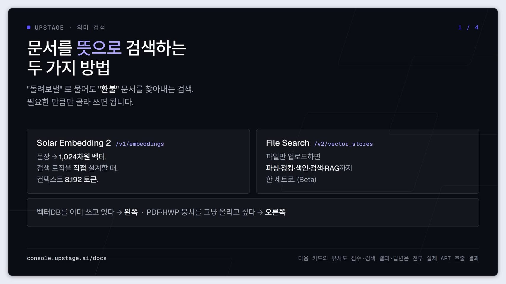
**이미지 캡션:** 어두운 배경에 보라색과 흰색 텍스트로 구성된 웹 페이지 화면으로, "문서를 뜻으로 검색하는 두 가지 방법"이라는 제목 아래 "돌려보낼"이라는 단어로도 "환불" 문서를 찾아내는 검색 기능에 대한 설명이 있다. 화면은 두 개의 주요 섹션으로 나뉘는데, 왼쪽에는 "Solar Embedding 2"라는 제목과 함께 문장을 1,024차원 벡터로 변환하고 검색 로직을 직접 설계할 수 있으며 컨텍스트 8,192 토큰을 지원한다는 내용이 적혀 있다. 오른쪽에는 "File Search"라는 제목과 함께 파일만 업로드하면 파싱, 청킹, 색인, 검색, RAG까지 한 세트로 제공된다는 설명이 있다. 하단에는 "벡터DB를 이미 쓰고 있다"면 왼쪽으로, "PDF, HWP 뭉치를 그냥 올리고 싶다"면 오른쪽으로 이동하라는 안내가 있으며, 페이지 하단에는 "console.upstage.ai/docs"라는 URL과 함께 "다음 카드의 유사도 점수·검색 결과·답변은 전부 실제 API 호출 결과"라는 문구가 보인다. 화면 우측 상단에는 "1/4"이라는 페이지 번호가 표시되어 있다. 전체적으로 기술적인 정보를 전달하는 깔끔하고 현대적인 디자인의 인터페이스이다.
 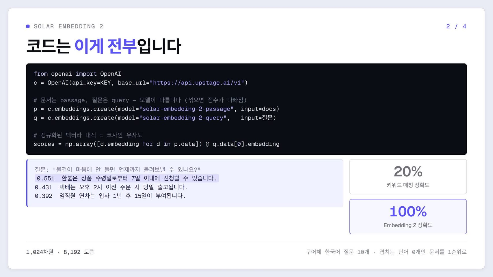
**이미지 캡션:** 이 이미지는 프로그래밍 코드와 관련 텍스트를 보여주는 슬라이드입니다. 중앙에는 파란색 배경에 흰색 글씨로 "코드는 이게 전부입니다"라는 제목이 있고, 그 아래에는 검은색 배경에 파란색 글씨로 파이썬 코드가 표시되어 있습니다. 코드는 OpenAI 라이브러리를 사용하여 임베딩을 생성하는 과정을 보여줍니다. 코드 블록 아래에는 한국어로 된 질문과 세 개의 답변이 점수와 함께 나열되어 있습니다. 질문은 "물건이 마음에 안 들면 언제까지 돌려보낼 수 있나요?"이며, 답변들은 각각 0.551, 0.431, 0.392의 점수를 받았습니다. 오른쪽에는 "20% 키워드 매칭 정확도"와 "100% Embedding 2 정확도"라는 텍스트가 포함된 두 개의 흰색 상자가 있습니다. 이미지 상단 오른쪽에는 "2 / 4"라는 페이지 번호가 표시되어 있습니다. 하단에는 "1,024차원 · 8,192 토큰"이라는 텍스트와 함께 "구어체 한국어 질문 10개 · 겹치는 단어 0개 · 문서를 1순위로"라는 추가 정보가 있습니다. 전체적으로 기술적인 내용을 설명하는 프레젠테이션의 한 슬라이드로 보이며, AI 모델의 임베딩 성능을 보여주는 것으로 추정됩니다.
 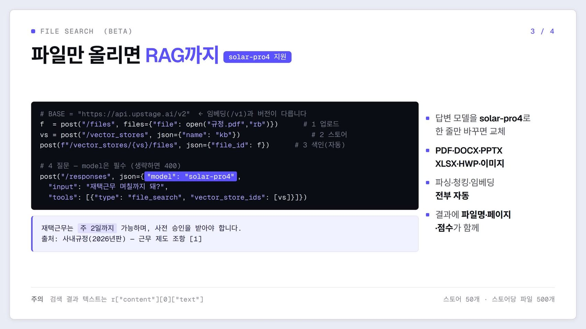
**이미지 캡션:** 이 이미지는 "파일만 올리면 RAG까지 solar-pro4 지원"이라는 제목의 프레젠테이션 슬라이드 또는 문서의 일부로, 프로그래밍 코드와 함께 RAG(Retrieval-Augmented Generation) 시스템의 파일 처리 및 질의 기능을 설명하고 있습니다. 이미지에는 사람이 등장하지 않으며, 배경은 깔끔한 흰색과 코드 블록을 위한 어두운 배경으로 구성되어 있습니다. 코드 블록에는 API 엔드포인트, 파일 업로드, 벡터 스토어 생성, 그리고 질문에 대한 응답을 생성하는 과정이 파이썬 코드로 나타나 있습니다. 특히 "규정.pdf"라는 파일이 업로드되고, "kb"라는 이름의 벡터 스토어가 생성되며, "재택근무 며칠까지 돼?"라는 질문에 "solar-pro4" 모델이 응답하는 예시가 포함되어 있습니다. 코드 아래에는 "재택근무는 주 2일까지 가능하며, 사전 승인을 받아야 합니다."라는 텍스트와 출처 정보가 명시되어 있습니다. 오른쪽에는 "답변 모델을 solar-pro4로 한 줄만 바꾸면 교체", "PDF-DOCX-PPTX XLSX-HWP-이미지", "파싱·청킹·임베딩 전부 자동", "결과에 파일명·페이지·점수가 함께"와 같은 기능적 이점을 설명하는 글머리 기호 목록이 있습니다. 전체적으로 기술적인 내용을 전달하는 정보성 콘텐츠이며, 차분하고 전문적인 분위기를 풍깁니다.
 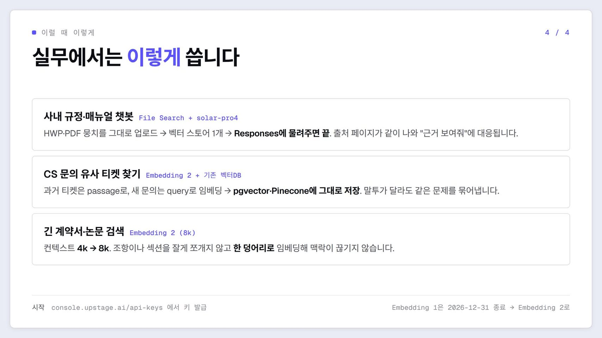
**이미지 캡션:** 화면에는 "실무에서는 이렇게 씁니다"라는 제목과 함께 세 가지 사용 사례가 나열되어 있으며, 각 사례는 제목, 설명, 그리고 관련된 기술 스택을 포함하고 있습니다. 첫 번째 사례는 "사내 규정·매뉴얼 챗봇"으로, HWP 및 PDF 파일을 업로드하여 벡터 스토어에 저장하고, 질문 시 출처 페이지와 함께 답변을 제공하는 방식입니다. 두 번째 사례는 "CS 문의 유사 티켓 찾기"로, 과거 티켓은 passage로, 새 문의는 query로 임베딩하여 pgvector-Pinecone에 저장하고, 말투가 달라도 유사한 문제를 찾아내는 기능입니다. 세 번째 사례는 "긴 계약서·논문 검색"으로, 컨텍스트를 4k에서 8k로 확장하여 조항이나 섹션을 분할하지 않고 임베딩하여 맥락이 끊기지 않도록 하는 방식입니다. 화면 하단에는 "시작 console.upstage.ai/api-keys 에서 키 발급"이라는 문구와 함께 페이지 번호 "4/4"가 표시되어 있습니다. 전반적으로 기술적인 내용을 설명하는 인터페이스로, 정보 전달에 초점을 맞춘 깔끔하고 현대적인 디자인입니다.

### 8월 31일 (월) 10:01 · 우왕! #TOP7 여러분들이 많이 사용해주셔서 #SolarPro4 일일 …

우왕! #TOP7 여러분들이 많이 사용해주셔서 #SolarPro4 일일 토큰 사용량 115B를 넘어서면서 TOP7 까지 올라갔습니다. 200B, 300B 넘어 1T를 넘어 TOP3에 들어가 보고 싶습니다. https://openrouter.ai/upstage/solar-pro4 많이 사용해주세요.

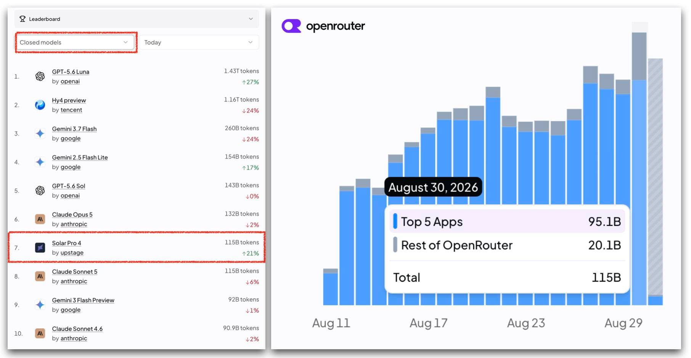
**이미지 캡션:** 화면 왼쪽에는 "Leaderboard"라는 제목과 함께 "Closed models"라는 드롭다운 메뉴가 보이며, 그 옆에는 "Today"라는 텍스트가 있다. 리더보드에는 1위부터 10위까지 AI 모델들의 순위, 이름, 개발사, 토큰 수, 그리고 전일 대비 증감률이 나열되어 있다. 7위에는 "Solar Pro 4 by upstage"가 115B 토큰과 21% 상승률로 표시되어 빨간색 테두리로 강조되어 있다. 화면 오른쪽에는 "openrouter" 로고와 함께 막대그래프가 있다. 이 그래프는 8월 11일부터 8월 29일까지의 데이터를 보여주며, 파란색 막대는 "Top 5 Apps"를, 회색 막대는 "Rest of OpenRouter"를 나타낸다. 그래프 위에 "August 30, 2026"이라는 날짜가 표시되어 있으며, 그래프 아래에는 "Top 5 Apps"가 95.1B, "Rest of OpenRouter"가 20.1B, 그리고 "Total"이 115B로 요약되어 있다. 전반적으로 AI 모델의 성능 및 사용량 데이터를 시각적으로 보여주는 화면이다.
