# 2026년 9월

[← 2026년](README.md)

### 9월 1일 (화) 08:44 · #1 Hermes Agent Free Promotion을 9월 15일까지…

#1 Hermes Agent Free Promotion을 9월 15일까지 연장합니다. Hermes에서 선택을 받기 위해 80% 할인, 무료 프로모션이 아주 많은 가운데 #SolarPro4가 3위를 달리고 있습니다. 많이 사용해 주세요. https://hermes-agent.nousresearch.com/ 에서 바로 시작하실 수 있습니다.

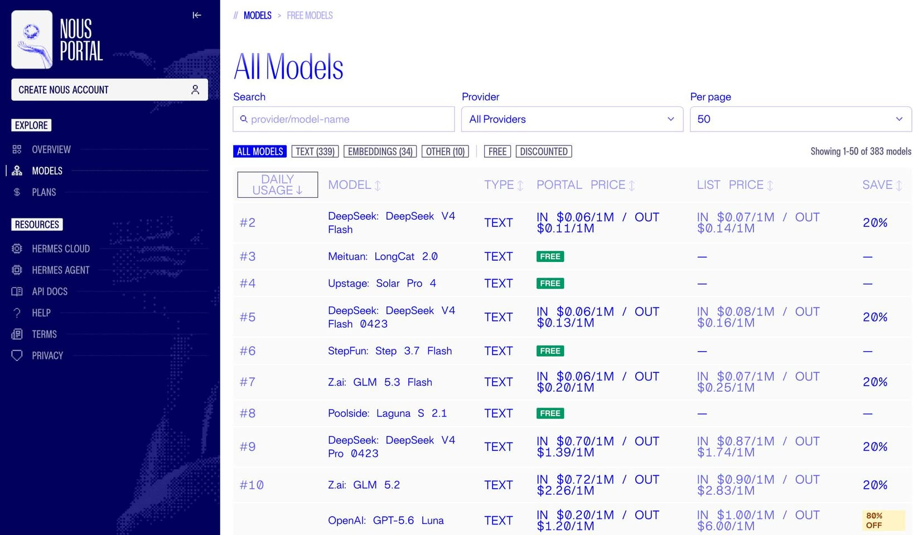
**이미지 캡션:** 이 이미지는 Nous Portal 웹사이트의 "All Models" 페이지를 보여줍니다. 왼쪽에는 파란색 배경에 "Nous Portal" 로고와 함께 "CREATE NOUS ACCOUNT" 버튼, 그리고 "EXPLORE" 및 "RESOURCES" 섹션이 있습니다. "EXPLORE" 섹션에는 "OVERVIEW", "MODELS", "PLANS"가 있으며, "RESOURCES" 섹션에는 "HERMES CLOUD", "HERMES AGENT", "API DOCS", "HELP", "TERMS", "PRIVACY"가 있습니다. 페이지 중앙에는 "All Models"이라는 제목과 함께 검색창, 제공업체 선택 드롭다운 메뉴, 페이지당 표시 항목 수를 설정하는 드롭다운 메뉴가 있습니다. 그 아래에는 "ALL MODELS", "TEXT (339)", "EMBEDDINGS (34)", "OTHER (10)", "FREE", "DISCOUNTED" 탭이 있으며, 현재 "ALL MODELS" 탭이 선택되어 있습니다. 모델 목록은 순위, 모델 이름, 유형, 포털 가격, 리스트 가격, 저장율 순으로 표시됩니다. 목록에는 DeepSeek: DeepSeek V4 Flash, Meituan: LongCat 2.0, Upstage: Solar Pro 4, DeepSeek: DeepSeek V4 Flash 0423, StepFun: Step 3.7 Flash, Z.ai: GLM 5.3 Flash, Poolside: Laguna S 2.1, DeepSeek: DeepSeek V4 Pro 0423, Z.ai: GLM 5.2, OpenAI: GPT-5.6 Luna 등의 모델이 포함되어 있으며, 일부 모델은 무료 또는 할인된 가격으로 제공됩니다. 페이지 하단에는 "Showing 1-50 of 383 models"이라는 텍스트가 표시됩니다. 전반적으로 기술적인 웹사이트의 인터페이스를 보여주는 이미지입니다.
 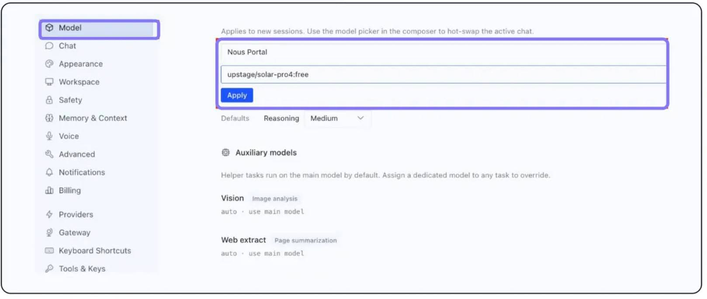
**이미지 캡션:** 이 이미지는 컴퓨터 화면의 일부를 보여주며, 왼쪽에는 "Model", "Chat", "Appearance", "Workspace", "Safety", "Memory & Context", "Voice", "Advanced", "Notifications", "Billing", "Providers", "Gateway", "Keyboard Shortcuts", "Tools & Keys"와 같은 메뉴 항목이 세로로 나열되어 있습니다. 이 중 "Model" 항목이 보라색 테두리로 강조되어 선택된 상태임을 나타냅니다. 오른쪽에는 "Applies to new sessions. Use the model picker in the composer to hot-swap the active chat."라는 설명과 함께 "Nous Portal"이라는 제목 아래에 "upstage/solar-pro4:free"라는 텍스트가 입력된 필드와 "Apply" 버튼이 보입니다. 그 아래에는 "Defaults", "Reasoning", "Medium"이라는 탭이 있으며, "Auxiliary models"이라는 섹션이 있습니다. 이 섹션에는 "Helper tasks run on the main model by default. Assign a dedicated model to any task to override."라는 설명과 함께 "Vision Image analysis" 및 "Web extract Page summarization" 옵션이 있으며, 각 옵션 아래에는 "auto use main model"이라는 텍스트가 표시되어 있습니다. 전체적으로 사용자 인터페이스의 설정 화면으로 보이며, 인공지능 모델을 선택하고 관리하는 기능을 보여주고 있습니다.

### 9월 2일 (수) 07:01 · 9월 반가운 소식입니다. OpenRouter 이번주 기준 Upstage …

9월 반가운 소식입니다. OpenRouter 이번주 기준 Upstage 모델이 시장 점유율 3.9%로 6위를 달리고 있습니다. 많이 사용해 주시면 2자릿수 점유율로 3위권에 진입해 보겠습니다. https://openrouter.ai/upstage/solar-pro4

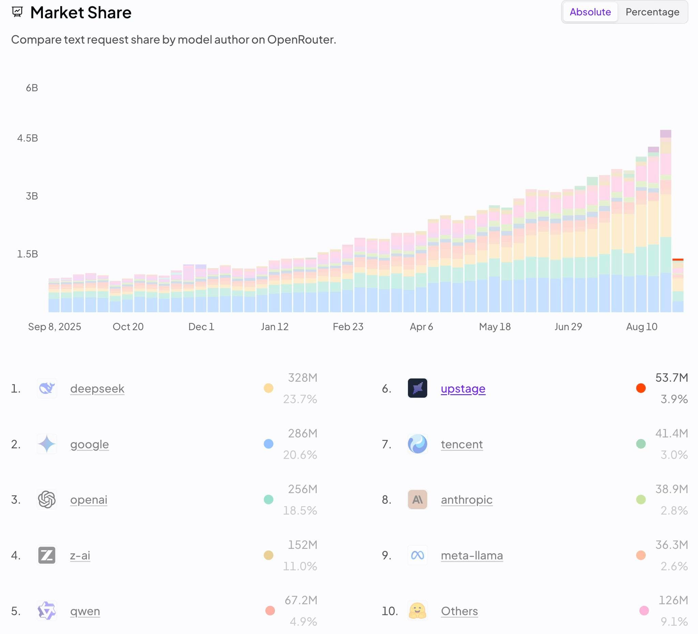
**이미지 캡션:** 이 이미지는 OpenRouter에서 모델 작성자별 텍스트 요청 점유율을 비교하는 시장 점유율 차트입니다. 차트는 2025년 9월 8일부터 2025년 8월 10일까지의 기간을 보여주며, 텍스트 요청 점유율은 1.5B에서 6B까지 증가하는 추세를 나타냅니다. 차트 아래에는 10개의 모델 작성자 순위가 표시되어 있으며, 각 작성자별 점유율과 백분율이 함께 제공됩니다. 1위는 deepseek로 328M의 점유율과 23.7%의 백분율을 차지하고 있으며, 2위는 google, 3위는 openai 순입니다. 6위는 upstage, 7위는 tencent, 8위는 anthropic, 9위는 meta-llama, 10위는 Others입니다. 각 항목 옆에는 해당 모델 작성자를 나타내는 로고와 함께 점유율 및 백분율이 표시되어 있습니다. 차트의 색상은 각 모델 작성자를 구분하는 데 사용되었으며, 전반적으로 긍정적인 성장세를 보여줍니다.

### 9월 4일 (금) 14:20 · 학계와 산업을 넘나들며 새로운 기술이 실제 산업의 변화로 이어지도록 앞장…

학계와 산업을 넘나들며 새로운 기술이 실제 산업의 변화로 이어지도록 앞장서 오신 Gu-Min Jeong 교수님을 Upstage AI혁신부사장/자문교수로 1년간 모시게 되었습니다.

공교롭게도 합류 직전 IFA 2026 현장에서 쓰신 글에서도 AI 에이전트 시대와 함께 #SolarPro4 를 소개해 주셨네요. 😊

좋은 AI를 만드는 것을 넘어, 더 많은 산업과 더 많은 사람들에게 Upstage AI가 활용될 수 있도록 함께하겠습니다.

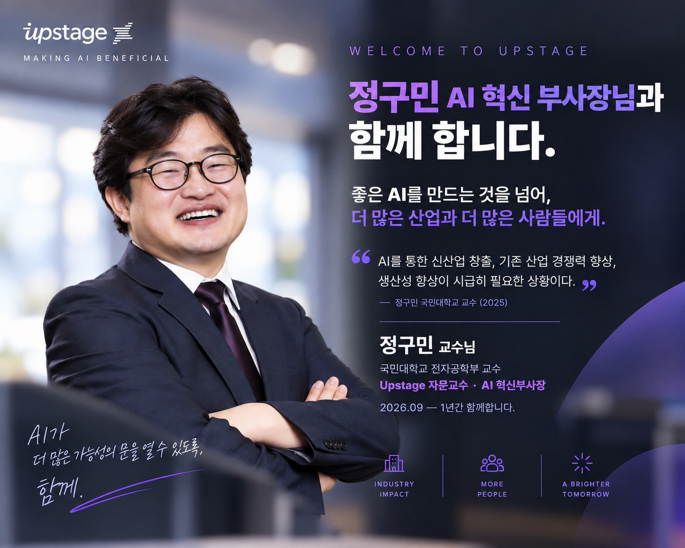
**이미지 캡션:** 이 사진은 한국어로 된 텍스트와 함께 한 명의 성인 남성을 보여줍니다. 남성은 약 40대에서 50대로 보이며, 검은색 머리카락에 둥근 안경을 쓰고 있습니다. 그는 짙은 남색 정장에 흰색 셔츠와 보라색 넥타이를 착용하고 있으며, 팔짱을 낀 채 환하게 웃고 있습니다. 배경은 흐릿하게 처리된 사무실 내부로 보이며, 보라색과 남색이 어우러진 그래픽 디자인이 특징입니다. 사진 왼쪽 하단에는 "AI가 더 많은 가능성의 문을 열 수 있도록, 함께."라는 문구가 보라색 필기체로 쓰여 있습니다. 오른쪽에는 "WELCOME TO UPSTAGE"라는 문구와 함께 "정구민 AI 혁신 부사장님과 함께 합니다."라는 큰 제목이 있습니다. 그 아래에는 정구민 교수의 인용문과 약력이 기재되어 있으며, "INDUSTRY IMPACT", "MORE PEOPLE", "A BRIGHTER TOMORROW"라는 세 가지 아이콘과 문구가 하단에 배치되어 있습니다. 전반적으로 긍정적이고 희망적인 분위기를 전달하며, AI 기술의 발전과 확산을 강조하는 메시지를 담고 있습니다.

### 9월 5일 (토) 09:15 · (광고 등을 통해) 코드 개발 완전 무료를 표방하는 Freebuff가 #…

(광고 등을 통해) 코드 개발 완전 무료를 표방하는 Freebuff가 #SolarPro4 를 테스트하고 있습니다. 많이 사용해 주시면 Freebuff에서 정식 채택 + 오픈라우터 업업업 가능합니다. https://freebuff.com/ 선사용, 후 고민!

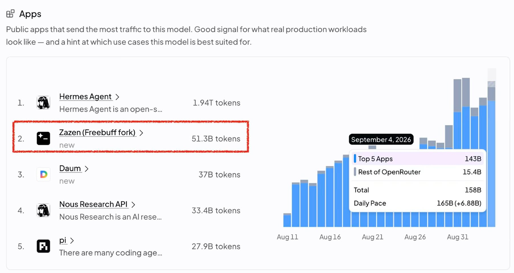
**이미지 캡션:** 이 이미지는 "Apps"라는 제목 아래에 AI 모델에 가장 많은 트래픽을 보내는 공개 앱 목록과 해당 트래픽을 시각화한 그래프를 보여줍니다. 목록에는 순위, 앱 이름, 간단한 설명 및 토큰 사용량이 포함됩니다. 1위는 "Hermes Agent"로 1.94T 토큰을 사용하며, 2위는 "Zazen (Freebuff fork)"로 51.3B 토큰을 사용합니다. 3위는 "Daum"으로 37B 토큰, 4위는 "Nous Research API"로 33.4B 토큰, 5위는 "pi"로 27.9B 토큰을 사용합니다. 그래프는 8월 11일부터 9월 4일까지의 일별 토큰 사용량을 보여주며, "Top 5 Apps"와 "Rest of OpenRouter"로 구분되어 있습니다. 9월 4일 기준 "Top 5 Apps"는 143B, "Rest of OpenRouter"는 15.4B를 사용했으며, 총 158B의 토큰이 사용되었고 일일 페이스는 165B(+6.88B)로 나타납니다. 이미지에는 사람이나 특정 장소가 묘사되어 있지 않으며, 전반적으로 데이터 분석 및 시각화에 초점을 맞춘 기술적인 분위기입니다.
 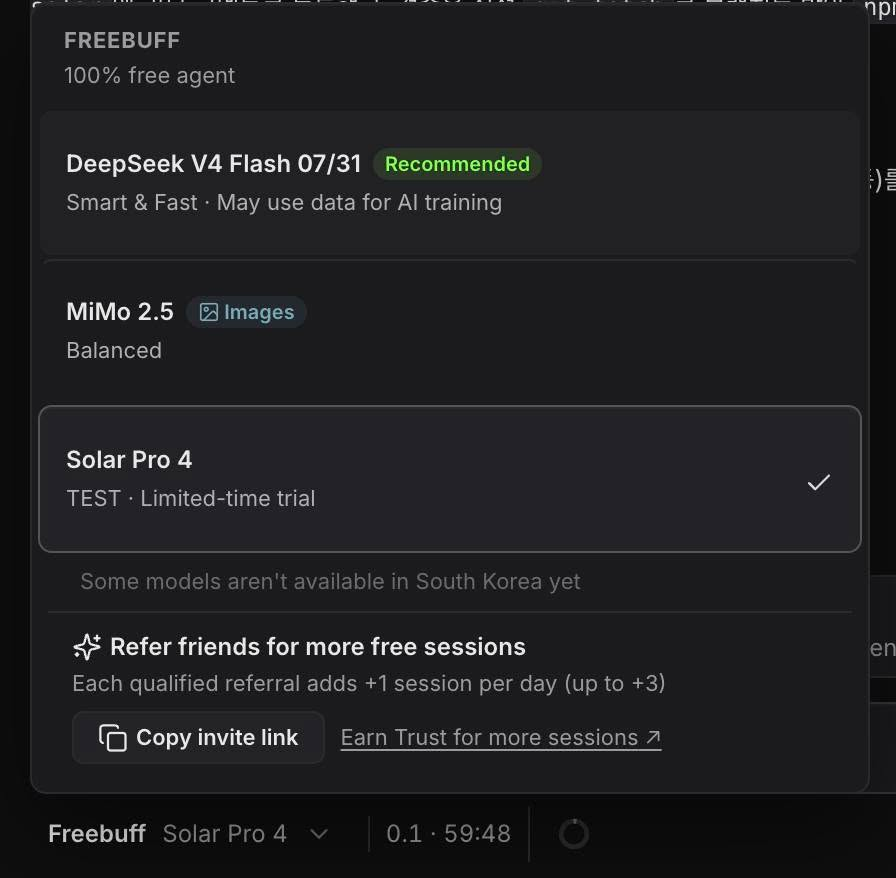
**이미지 캡션:** 이것은 컴퓨터 화면의 일부를 보여주는 스크린샷으로, 어두운 테마의 인터페이스를 특징으로 합니다. 화면 상단에는 "FREEBUFF 100% free agent"라는 텍스트가 보입니다. 그 아래에는 여러 AI 모델 목록이 표시됩니다. 첫 번째는 "DeepSeek V4 Flash 07/31 Recommended"로, "Smart & Fast · May use data for AI training"이라는 설명이 붙어 있습니다. 다음은 "MiMo 2.5 Images Balanced"입니다. 현재 선택된 모델은 "Solar Pro 4 TEST · Limited-time trial"로, 체크 표시가 되어 있습니다. 이 모델 아래에는 "Some models aren't available in South Korea yet"라는 메시지가 있습니다. 그 아래에는 "Refer friends for more free sessions"라는 제목과 함께 친구 추천 시 추가 세션이 제공된다는 설명이 있습니다. "Copy invite link" 버튼과 "Earn Trust for more sessions"라는 링크도 보입니다. 화면 하단에는 "Freebuff Solar Pro 4 0.1 59:48"이라는 텍스트와 함께 로딩 아이콘으로 보이는 원형 아이콘이 있습니다. 전반적으로 이 화면은 사용자가 AI 모델을 선택하고 관리하며 추가 세션을 얻을 수 있는 서비스의 일부로 보입니다.

### 9월 7일 (월) 07:33 · OpenRouter 일일 토큰 사용량 250B 달성을 눈앞에 두면서 새로…

OpenRouter 일일 토큰 사용량 250B 달성을 눈앞에 두면서 새로운 큰손이 등장했습니다. 바로 https://freebuff.com/ 인데요. 광고를 보면서 사용자는 무료로 LLM을 사용하고, 광고비를 통해 Upstage에 비용을 지불하는 사업 모델입니다.

그리고 하네스도 상당히 잘되어 있어서 개발을 완수해줍니다. 제 감상으로는 freebuff > 클로드코드입니다. 무료 SolarPro4 @freebuff 많이 사용해주셔요. 무료로 사용하셔도 Upstage에는 입금이 됩니다.

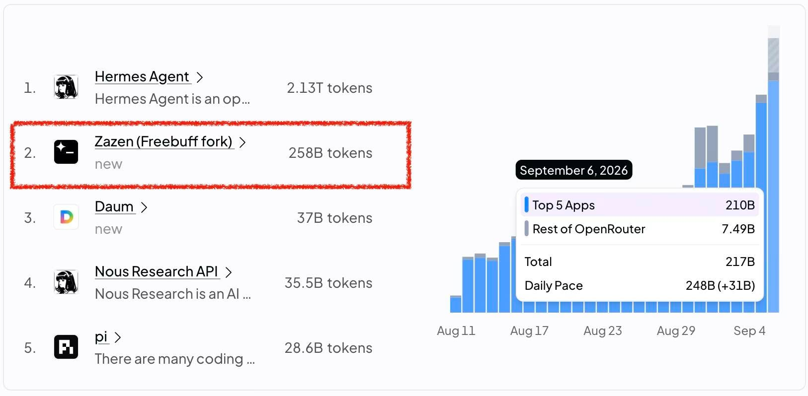
**이미지 캡션:** 이 사진은 컴퓨터 화면의 일부를 캡처한 것으로, 왼쪽에는 순위 목록이 있고 오른쪽에는 막대 그래프가 있습니다. 왼쪽 목록에는 1위부터 5위까지의 항목이 있으며, 각 항목에는 번호, 아이콘, 이름, 설명, 그리고 토큰 수가 표시됩니다. 1위는 "Hermes Agent"로 2.13T 토큰을 보유하고 있으며, 2위는 "Zazen (Freebuff fork)"로 258B 토큰을 보유하고 있습니다. 3위는 "Daum"으로 37B 토큰, 4위는 "Nous Research API"로 35.5B 토큰, 5위는 "pi"로 28.6B 토큰을 보유하고 있습니다. 각 항목의 아이콘은 해당 서비스나 프로젝트를 나타내는 것으로 보이며, 일부는 로고나 간단한 그림입니다. 오른쪽에는 2026년 9월 6일을 기준으로 한 막대 그래프가 표시되어 있으며, 그래프는 "Top 5 Apps", "Rest of OpenRouter", "Total", "Daily Pace"와 같은 항목별 데이터와 함께 날짜별 추세를 보여줍니다. 그래프의 막대는 파란색과 회색으로 구성되어 있으며, 날짜는 8월 11일부터 9월 4일까지 표시됩니다. 전반적으로 이 화면은 어떤 시스템이나 플랫폼에서 사용되는 토큰 사용량 또는 관련 데이터를 시각적으로 보여주는 것으로 보이며, 특정 항목(2위 Zazen)이 빨간색 사각형으로 강조되어 있습니다.
 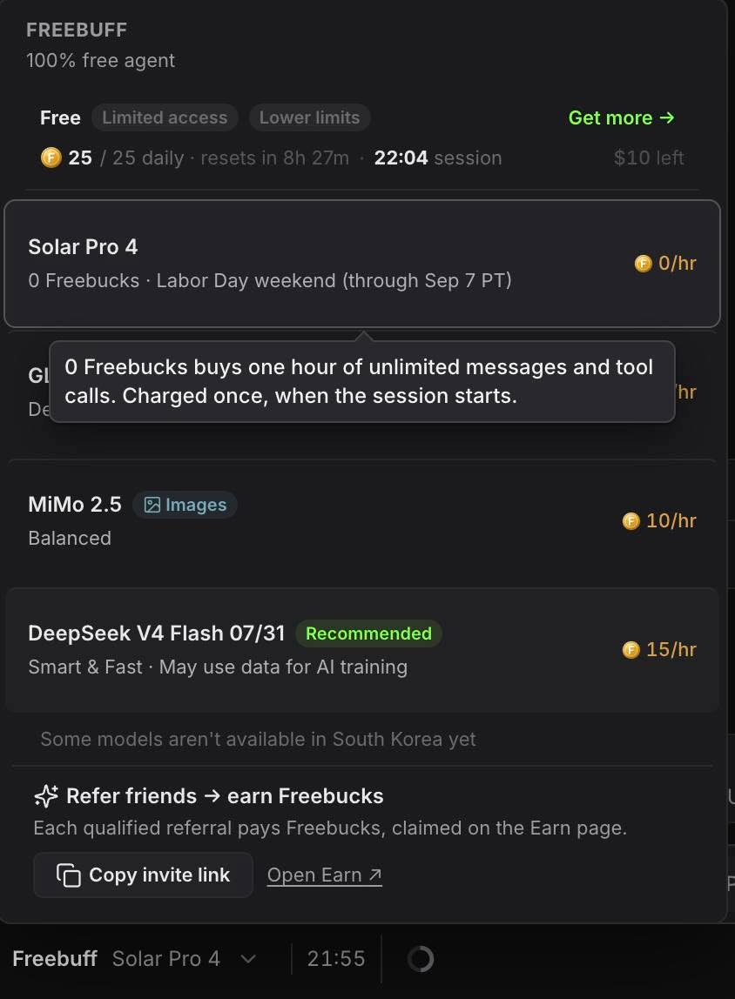
**이미지 캡션:** 이것은 Freebuff라는 앱의 인터페이스를 보여주는 스크린샷으로, 사용자는 다양한 AI 모델을 무료 또는 유료로 사용할 수 있습니다. 화면 상단에는 "FREEBUFF"라는 로고와 함께 "100% free agent"라는 문구가 표시되어 있습니다. 그 아래에는 "Free", "Limited access", "Lower limits"라는 세 가지 옵션이 있으며, 현재 "Free" 옵션이 선택되어 있습니다. 또한, "25 / 25 daily"라는 문구와 함께 일일 사용량 제한이 표시되어 있으며, "resets in 8h 27m"으로 리셋까지 남은 시간을 알 수 있습니다. "22:04 session"은 현재 세션 시간을 나타내며, "$10 left"는 남은 크레딧을 의미하는 것으로 보입니다. 화면 중앙에는 여러 AI 모델 옵션이 나열되어 있습니다. 첫 번째는 "Solar Pro 4"로, "0 Freebucks"로 노동절 주말 동안 사용할 수 있으며 시간당 0 Freebucks가 소요됩니다. 그 아래에는 "0 Freebucks buys one hour of unlimited messages and tool calls. Charged once, when the session starts."라는 설명이 있습니다. 두 번째는 "MiMo 2.5"로, "Balanced"라는 설명과 함께 시간당 10 Freebucks가 소요됩니다. 세 번째는 "DeepSeek V4 Flash 07/31"로, "Recommended" 태그가 붙어 있으며 "Smart & Fast"라는 설명과 함께 시간당 15 Freebucks가 소요됩니다. 이 모델은 AI 학습에 데이터를 사용할 수 있다고 명시되어 있습니다. 또한, "Some models aren't available in South Korea yet"라는 문구가 있어 일부 모델은 한국에서 사용이 제한될 수 있음을 알 수 있습니다. 화면 하단에는 "Refer friends → earn Freebucks"라는 문구와 함께 친구 추천을 통해 Freebucks를 얻을 수 있다는 내용이 있습니다. "Each qualified referral pays Freebucks, claimed on the Earn page."라고 설명되어 있으며, "Copy invite link"와 "Open Earn" 버튼이 있습니다. 가장 하단에는 "Freebuff Solar Pro 4 21:55"라는 정보와 함께 로딩 중임을 나타내는 원형 아이콘이 표시되어 있습니다. 전반적으로 어두운 배경에 밝은 텍스트와 아이콘을 사용하여 가독성을 높였으며, 정보 전달에 초점을 맞춘 깔끔한 디자인입니다.

### 9월 7일 (월) 14:07 · #독파모 모델인 #SolarPro4 가 오픈라우터에서 일일 토큰 사용량 …

#독파모 모델인 #SolarPro4 가 오픈라우터에서 일일 토큰 사용량 250B 그리고 일일 사용량 전체 12위, 상용모델 5위 달성의 의미를 생각해보았습니다. 서빙 GPU의 한계로 일일 250B가 한계인 상황인데 한계까지 가득 채운 것입니다. 매우 기쁜날입니다.

---
1. 싸고 쓸만한 모델은 시장에서 선택된다 — 90% 할인된 가격이 아닌, 진짜 가성비로 승부한 결과, 출시 1개월 만에 Closed 모델 5위, 전체 모델 12위까지 성장. 특히 +21%의 성장률은 전체 상위권 중 최고
 
2. 에이전트가 새로운 전장이다 — Hermes Agent 내 사용 모델 1위(2.15T/월간)는 AI가 단순 챗봇을 넘어 실제 작업을 수행하는 에이전트로 진화하고 있으며, 이 영역에서 특화된 모델이 가치를 인정받는다는 증거 입니다.

3. 정부 독자파운데이션 모델의 글로벌 경쟁력 입증 — Solar Pro 4는 독파모 프로젝트를 통해 만들어진 순수 국산 LLM으로, 외국 베이스 모델 의존 없이 Upstage 에서 독자적으로 설계·훈련했습니다. 이런 독자파운데이션 모델이 OpenRouter라는 글로벌 무대에서 Closed 모델 5위·전체 12위를 기록한 것은 정부 R&D 투자가 실질적인 글로벌 성과로 결실

#SolarPro4와 함께 작성한 자세한 내용: https://aware-gazebo-bxhn.here.now/

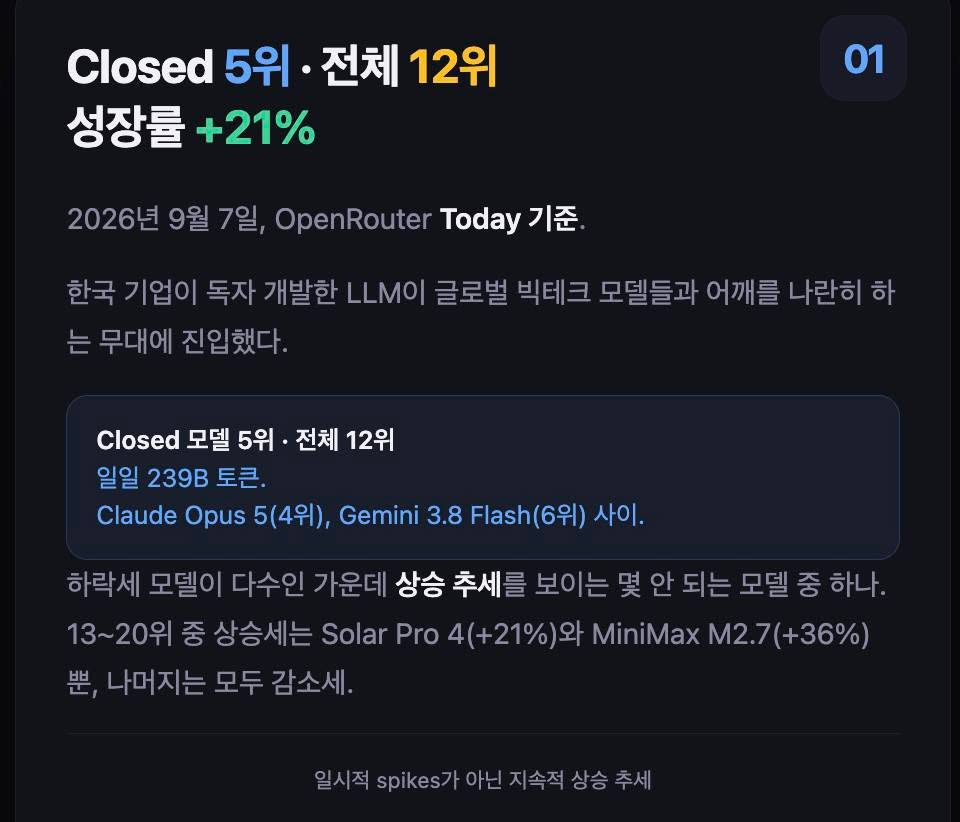
**이미지 캡션:** 이 이미지는 어두운 배경에 흰색과 노란색 텍스트로 구성된 스크린샷으로, 한국어 텍스트가 주로 표시되어 있습니다. 상단에는 "Closed 5위·전체 12위"라는 제목과 함께 "성장률 +21%"라는 문구가 노란색으로 강조되어 있습니다. 그 아래에는 "2026년 9월 7일, OpenRouter Today 기준."이라는 날짜와 출처 정보가 있습니다. 이어서 "한국 기업이 독자 개발한 LLM이 글로벌 빅테크 모델들과 어깨를 나란히 하는 무대에 진입했다."라는 문장이 이어집니다. 중앙에는 파란색 배경의 박스가 있으며, "Closed 모델 5위·전체 12위"라는 제목과 "일일 239B 토큰."이라는 정보가 있습니다. 또한 "Claude Opus 5(4위), Gemini 3.8 Flash(6위) 사이."라는 텍스트가 포함되어 있어, 특정 모델들의 순위와 성능을 나타내는 것으로 보입니다. 그 아래에는 "하락세 모델이 다수인 가운데 상승 추세를 보이는 몇 안 되는 모델 중 하나."라는 설명과 함께, "13~20위 중 상승세는 Solar Pro 4(+21%)와 MiniMax M2.7(+36%) 뿐, 나머지는 모두 감소세."라는 구체적인 순위와 성장률 정보가 나열되어 있습니다. 가장 하단에는 "일시적 spikes가 아닌 지속적 상승 추세"라는 문구가 작게 표시되어 있습니다. 전반적으로 인공지능 모델의 성능 및 순위에 대한 분석 정보를 담고 있으며, 기술 동향에 대한 보고서나 뉴스 기사의 일부로 보입니다. 이미지에는 사람이 등장하지 않으며, 텍스트와 숫자, 순위 정보가 주를 이룹니다.
 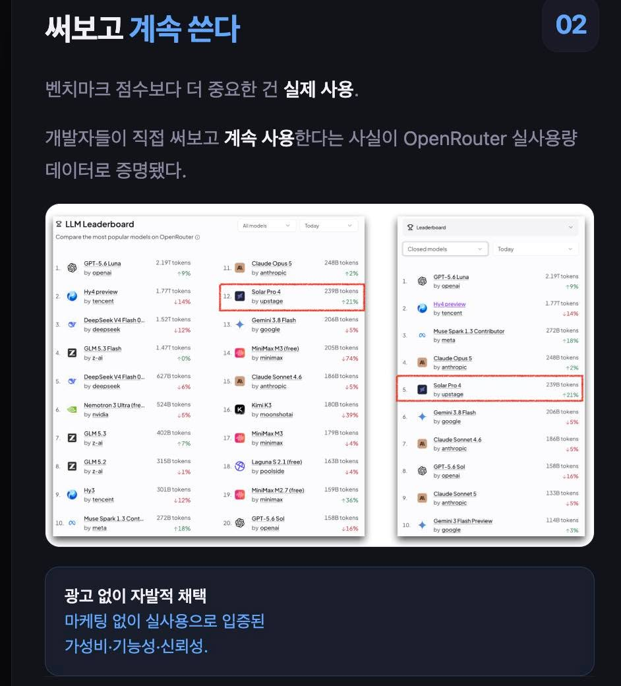
**이미지 캡션:** 화면 중앙에는 두 개의 리더보드 화면이 나란히 표시되어 있으며, 왼쪽은 "LLM Leaderboard"라는 제목으로 OpenRouter에서 가장 인기 있는 모델들을 비교하고 있고, 오른쪽은 "Leaderboard"라는 제목으로 "Closed models"라는 필터가 적용된 리더보드입니다. 두 리더보드 모두 모델 이름, 개발사, 토큰 사용량, 그리고 전주 대비 증감률을 보여줍니다. 왼쪽 리더보드에는 1위부터 20위까지의 모델이 나열되어 있으며, 오른쪽 리더보드에는 1위부터 10위까지의 모델이 나열되어 있습니다. 두 리더보드 모두 "Today"라는 시간 필터가 적용되어 있습니다. 화면 상단에는 "써보고 계속 쓴다"라는 큰 제목과 함께 "벤치마크 점수보다 더 중요한 건 실제 사용."이라는 부제가 있고, 그 아래에는 "개발자들이 직접 써보고 계속 사용한다는 사실이 OpenRouter 실사용량 데이터로 증명됐다."라는 문구가 있습니다. 화면 하단에는 "광고 없이 자발적 채택", "마케팅 없이 실사용으로 입증된", "가성비·기능성·신뢰성."이라는 문구가 검은색 배경에 흰색 글씨로 표시되어 있습니다. 전체적으로 정보 전달에 초점을 맞춘 디자인이며, 데이터 시각화를 통해 LLM 모델의 실제 사용량을 강조하고 있습니다.
 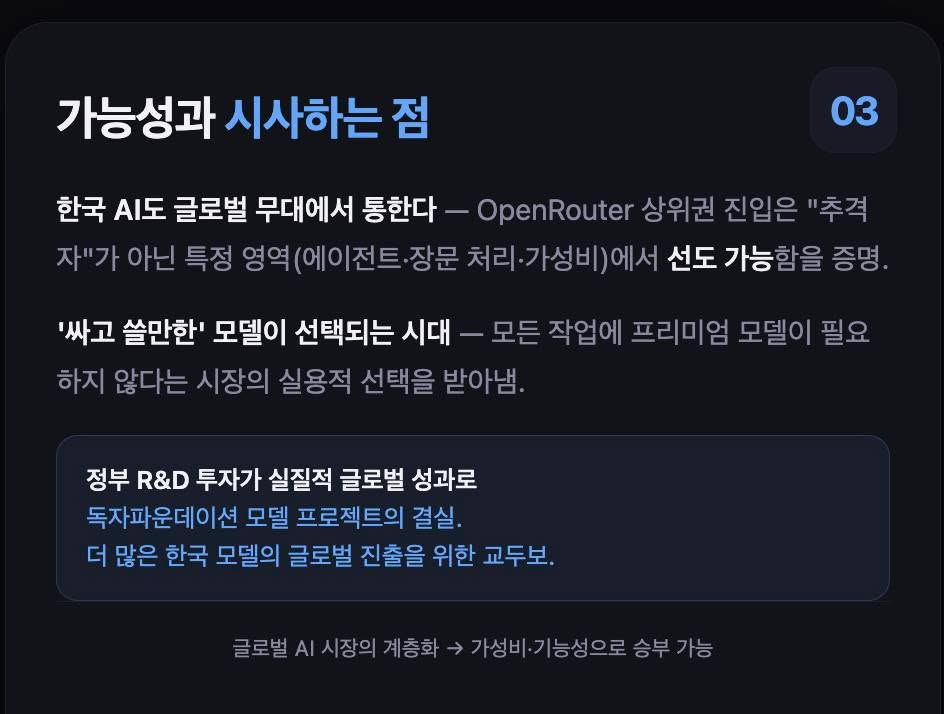
**이미지 캡션:** 이 이미지는 어두운 배경에 흰색과 파란색 텍스트로 구성된 디지털 화면의 일부를 보여줍니다. 화면 상단에는 "가능성과 시사하는 점"이라는 제목이 파란색으로 쓰여 있고, 오른쪽 상단에는 "03"이라는 숫자가 파란색으로 표시되어 있습니다. 그 아래에는 한국어로 된 여러 문장이 나열되어 있으며, AI 기술의 글로벌 경쟁력과 시장 동향에 대한 내용을 담고 있습니다. 첫 번째 문단은 한국 AI가 글로벌 무대에서 경쟁력을 갖추고 있으며, 특정 영역에서는 선도적인 가능성을 보여준다는 내용을 언급합니다. 두 번째 문단은 '싸고 쓸만한' 모델이 선택되는 시대가 도래했으며, 모든 작업에 고가의 프리미엄 모델이 필요하지 않다는 시장의 실용적인 선택을 반영한다는 점을 설명합니다. 세 번째 부분은 정부의 R&D 투자가 실질적인 글로벌 성과로 이어지고 있으며, 이는 독자적인 파운데이션 모델 프로젝트의 결실이자 더 많은 한국 모델의 글로벌 진출을 위한 발판이 될 것이라는 내용을 담고 있습니다. 마지막 줄에는 글로벌 AI 시장의 계층화 속에서 가성비와 기능성으로 승부할 수 있다는 전망을 제시합니다. 화면에는 사람이나 구체적인 사물은 보이지 않으며, 텍스트 기반의 정보 전달에 초점을 맞춘 인터페이스입니다. 전반적으로 정보 전달에 집중된 차분하고 전문적인 분위기를 풍깁니다.
 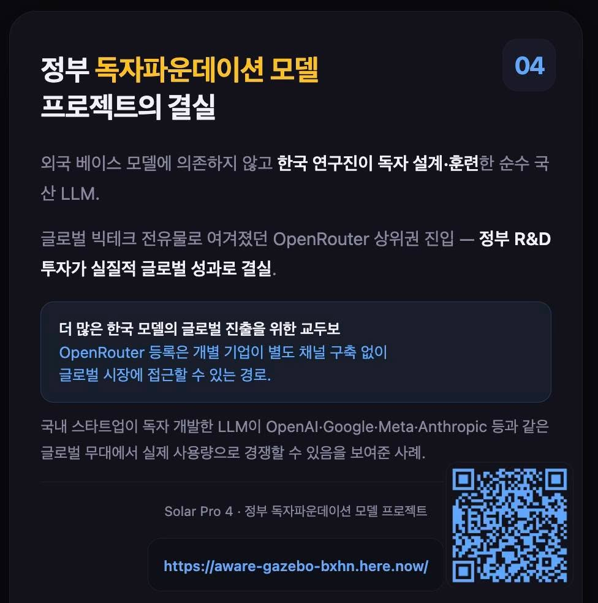
**이미지 캡션:** 이 이미지는 한국어로 작성된 텍스트 기반의 정보 카드입니다. 상단에는 "정부 독자파운데이션 모델 프로젝트의 결실"이라는 제목이 노란색으로 강조되어 있으며, 오른쪽 상단에는 파란색 배경에 흰색 숫자로 "04"가 표시되어 있습니다. 본문 내용은 한국 연구진이 독자적으로 설계하고 훈련한 순수 국산 LLM(거대 언어 모델)에 대한 성과를 설명하고 있습니다. 글로벌 빅테크 기업들의 전유물로 여겨졌던 OpenRouter 상위권에 진입했으며, 이는 정부 R&D 투자가 실질적인 글로벌 성과로 이어졌음을 보여준다고 합니다. 또한, OpenRouter 등록이 개별 기업들이 별도의 채널 구축 없이 글로벌 시장에 접근할 수 있는 교두보 역할을 하여, 국내 스타트업이 개발한 LLM이 OpenAI, Google, Meta, Anthropic 등과 같은 글로벌 기업들과 경쟁할 수 있는 가능성을 보여준 사례라고 언급하고 있습니다. 하단에는 "Solar Pro 4 · 정부 독자파운데이션 모델 프로젝트"라는 문구와 함께 QR 코드, 그리고 "https://aware-gazebo-bxhn.here.now/"라는 웹사이트 주소가 포함되어 있습니다. 이미지에는 사람이 등장하지 않으며, 배경은 단순한 흰색 또는 회색으로 보입니다. 전체적으로 정보 전달에 초점을 맞춘 깔끔하고 현대적인 디자인입니다.

### 9월 9일 (수) 08:51 · 아시아·태평양 지역 최대 규모의 스마트시티 국제 행사인 2026 월드 스…

아시아·태평양 지역 최대 규모의 스마트시티 국제 행사인 2026 월드 스마트시티 엑스포(World Smart City Expo, WSCE)에 참가합니다.

저는 AI 네이티브 시티가 되기 위해 지금 있는 데이터를 바로 에이전트에 붙여서 행정, 교통, 에너지, 복지가 하나의 두뇌처럼 실시간 연동하며 도시 전체를 능동적으로 최적화하는 것에 대해 이야기합니다. 또한 독파모 모델인 SolarPro4가 AI 네이티브 시티의 브레인 역할도 바로 할 수 있다는 점도 강조할 예정입니다.

오시는 분들 모두 반갑게 뵙겠습니다.

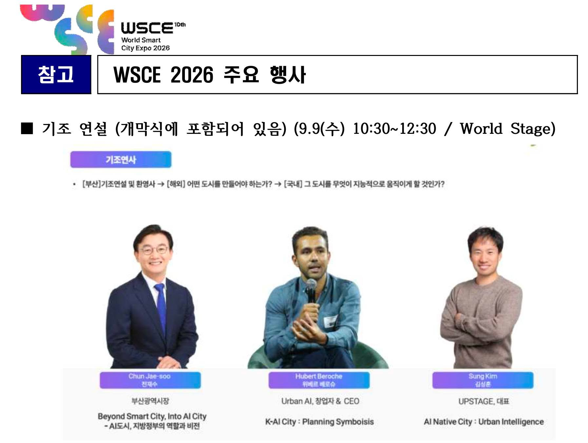
**이미지 캡션:** 이 사진은 WSCE 2026 주요 행사의 일부를 보여주는 이미지로, 좌측 상단에는 "WSCE 10th World Smart City Expo 2026"이라는 로고가 있으며, 그 아래에는 "참고"라는 파란색 배경의 글자가 있다. 중앙에는 "WSCE 2026 주요 행사"라는 제목이 흰색 배경에 검은색 글자로 쓰여 있다. 그 아래에는 검은색 점으로 표시된 "기조 연설 (개막식에 포함되어 있음) (9.9(수) 10:30~12:30 / World Stage)"라는 내용이 있으며, 보라색 배경의 "기조연사" 버튼이 있다. 이어서 "[부산] 기조연설 및 환영사 → [해외] 어떤 도시를 만들어야 하는가? → [국내] 그 도시를 무엇이 지능적으로 움직이게 할 것인가?"라는 질문이 포함된 설명이 있다. 사진 하단에는 세 명의 남성이 각각 연설자로서 소개되고 있다. 가장 왼쪽에 있는 남성은 파란색 정장을 입고 파란색 넥타이를 맨 모습이며, 안경을 쓰고 환하게 웃고 있다. 그의 이름은 "Chun Jae-soo 전재수"이며, "부산광역시장"으로서 "Beyond Smart City, Into AI City - AI도시, 지방정부의 역할과 비전"이라는 주제로 발표한다. 중앙에 있는 남성은 청색 셔츠를 입고 마이크를 잡고 있으며, 약간 놀란 듯한 표정으로 말하고 있다. 그의 이름은 "Hubert Beroche 위베르베로슈"이며, "Urban AI, 창업자 & CEO"로서 "K-AI City: Planning Symboisis"라는 주제로 발표한다. 가장 오른쪽에 있는 남성은 회색 스웨터를 입고 팔짱을 낀 채 카메라를 보며 미소 짓고 있다. 그의 이름은 "Sung Kim 김성훈"이며, "UPSTAGE, 대표"로서 "AI Native City: Urban Intelligence"라는 주제로 발표한다. 전체적으로 행사의 정보와 연설자들을 소개하는 깔끔하고 전문적인 분위기이다.
 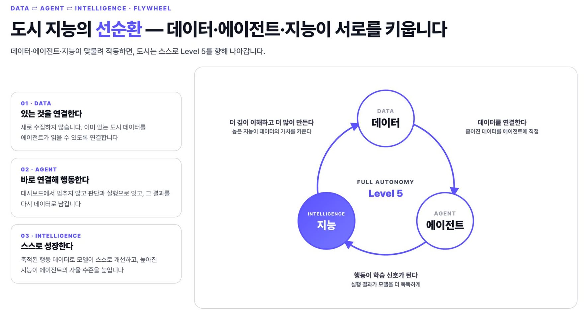
**이미지 캡션:** 이 이미지는 도시 지능의 선순환 구조를 설명하는 인포그래픽으로, 데이터, 에이전트, 지능이 서로를 키우는 과정을 보여준다. 상단에는 "DATA ⇌ AGENT ⇌ INTELLIGENCE ⇌ FLYWHEEL"이라는 문구와 함께 "도시 지능의 선순환 — 데이터·에이전트·지능이 서로를 키웁니다"라는 제목이 있다. 그 아래에는 "데이터·에이전트·지능이 맞물려 작동하면, 도시는 스스로 Level 5를 향해 나아갑니다."라는 부제가 있다. 왼쪽에는 세 가지 주요 개념에 대한 설명이 박스로 나뉘어 제시되어 있다. 첫 번째 박스는 "01. DATA: 있는 것을 연결한다"로, "새로 수집하지 않습니다. 이미 있는 도시 데이터를 에이전트가 읽을 수 있도록 연결합니다."라고 설명한다. 두 번째 박스는 "02. AGENT: 바로 연결해 행동한다"로, "대시보드에서 멈추지 않고 판단과 실행으로 잇고, 그 결과를 다시 데이터로 남깁니다."라고 설명한다. 세 번째 박스는 "03. INTELLIGENCE: 스스로 성장한다"로, "축적된 행동 데이터로 모델이 스스로 개선하고, 높아진 지능이 에이전트의 자율 수준을 높입니다."라고 설명한다. 오른쪽에는 이 세 가지 요소가 순환하는 다이어그램이 그려져 있다. 'DATA (데이터)'라는 보라색 원이 있고, 그 옆에는 "데이터를 연결한다"라는 설명과 함께 "흩어진 데이터를 에이전트에 직접"이라는 부연 설명이 있다. 'DATA'에서 'AGENT (에이전트)'로 향하는 화살표가 있으며, 'AGENT' 옆에는 "행동이 학습 신호가 된다"라는 설명과 함께 "실행 결과가 모델을 더 똑똑하게"라는 부연 설명이 있다. 'AGENT'에서 'INTELLIGENCE (지능)'로 향하는 화살표가 있으며, 'INTELLIGENCE' 옆에는 "더 깊이 이해하고 더 많이 만든다"라는 설명과 함께 "높은 지능이 데이터의 가치를 키운다"라는 부연 설명이 있다. 'INTELLIGENCE'에서 다시 'DATA'로 향하는 화살표가 있다. 'INTELLIGENCE' 원 안에는 "FULL AUTONOMY Level 5"라는 문구가 있고, 'AGENT' 원 안에는 "AGENT"라는 글자와 함께 "에이전트"라는 단어가 쓰여 있다. 전체적으로 흰색 배경에 보라색과 파란색 계열의 그래픽 요소들이 사용되어 깔끔하고 현대적인 느낌을 준다. 이미지에는 사람이 등장하지 않으며, 텍스트는 모두 한국어로 되어
 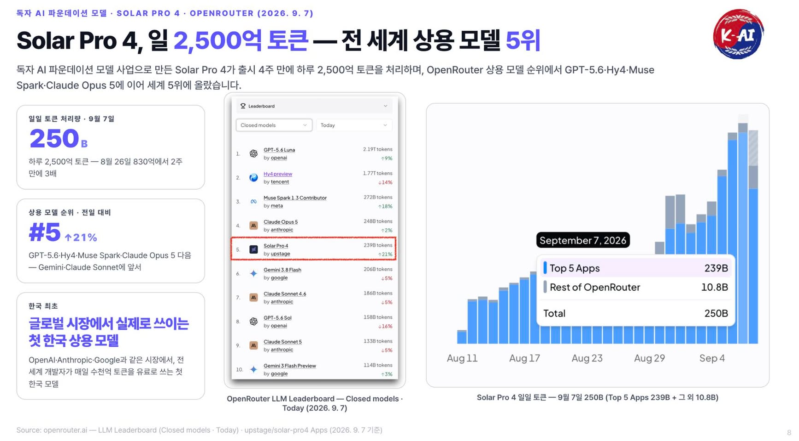
**이미지 캡션:** 이 이미지는 한국어 AI 파운데이션 모델인 Solar Pro 4가 출시 4주 만에 OpenRouter 상용 모델 순위에서 세계 5위에 올랐다는 내용을 담고 있으며, 2026년 9월 7일 기준 일일 토큰 처리량이 250B(2,500억)에 달한다는 점을 강조합니다. 화면 왼쪽 상단에는 "Solar Pro 4, 일 2,500억 토큰 — 전 세계 상용 모델 5위"라는 제목과 함께, Solar Pro 4가 GPT-5.6-Hy4-Muse Spark-Claude Opus 5에 이어 Gemini-Claude Sonnet보다 앞서 5위를 차지했다는 설명이 있습니다. 또한, "한국 최초 글로벌 시장에서 실제로 쓰이는 첫 한국 상용 모델"이라는 문구와 함께 OpenAI, Anthropic, Google과 같은 시장에서 전 세계 개발자들이 매일 수천억 토큰을 유료로 사용하는 첫 한국 모델임을 소개합니다. 화면 중앙에는 OpenRouter LLM Leaderboard의 일부가 표시되어 있으며, GPT-5.6 Luna, Hy4 preview, Muse Spark 1.3 Contributor, Claude Opus 5에 이어 Solar Pro 4가 5위로 239B 토큰을 처리하고 전일 대비 21% 상승했음을 보여줍니다. 오른쪽에는 2026년 9월 7일을 기준으로 Top 5 Apps가 239B, Rest of OpenRouter가 10.8B로 총 250B의 토큰이 처리되었음을 나타내는 막대그래프와 요약 정보가 있습니다. 전반적으로 기술적인 성과를 알리는 정보성 콘텐츠이며, 긍정적이고 발전적인 분위기를 나타냅니다.

### 9월 9일 (수) 15:52 · Upstage #SolarPro4, 이제 Cline 과 함께 합니다. 9…

Upstage #SolarPro4, 이제 Cline 과 함께 합니다. 9월 15일까지 무료 프로모션을 합니다. 

예로 아래 줄이면 테트리스가 나옵니다.
npm i -g cline
cline auth   # Free → Solar Pro 4
cline "index.html 하나로 테트리스 만들어줘"

전체 과정은 이미지 참고 👇
#SolarPro4 #Upstage #Cline

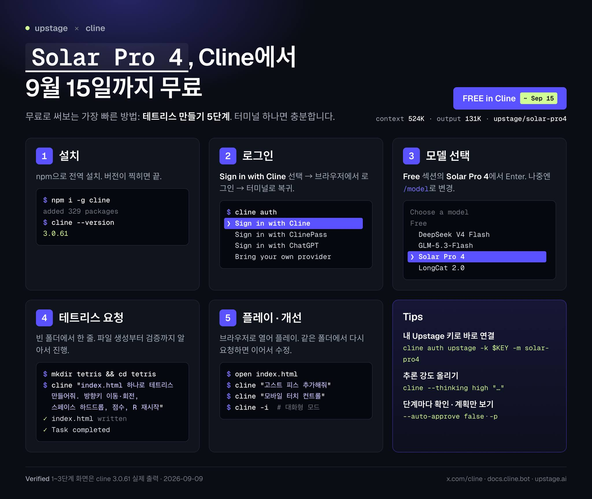
**이미지 캡션:** 이 이미지는 Upstage와 Cline이 협력하여 Solar Pro 4를 9월 15일까지 무료로 제공한다는 내용을 담고 있습니다. 화면은 어두운 배경에 밝은 글씨로 구성되어 있으며, 여러 개의 섹션으로 나뉘어 있습니다. 상단에는 "upstage x cline" 로고와 함께 "Solar Pro 4, Cline에서 9월 15일까지 무료"라는 제목이 크게 표시되어 있습니다. 그 아래에는 "무료로 써보는 가장 빠른 방법: 테트리스 만들기 5단계. 터미널 하나면 충분합니다."라는 설명 문구가 있습니다. 화면은 총 5개의 섹션으로 구성되어 있습니다. 섹션 1 '설치'는 npm을 이용한 Cline의 전역 설치 방법과 버전을 보여줍니다. `$ npm i -g cline` 명령어가 실행된 후 `added 329 packages`와 `cline --version 3.0.61`이 표시됩니다. 섹션 2 '로그인'은 Cline에 로그인하는 방법을 설명하며, 'Sign in with Cline', 'Sign in with ClinePass', 'Sign in with ChatGPT', 'Bring your own provider'와 같은 옵션이 나열되어 있습니다. 섹션 3 '모델 선택'은 Free 섹션의 Solar Pro 4 모델을 선택하는 과정을 보여주며, 'Choose a model' 아래에 'Free', 'DeepSeek V4 Flash', 'GLM-5.3-Flash', 'Solar Pro 4', 'LongCat 2.0' 옵션이 있으며, 'Solar Pro 4'가 선택된 상태입니다. 섹션 4 '테트리스 요청'은 빈 폴더에서 테트리스 게임을 생성하고 수정하는 과정을 보여줍니다. `$ mkdir tetris && cd tetris` 명령어로 디렉토리를 생성하고 이동한 후, `$ cline "index.html 하나로 테트리스 만들어줘. 방향키 이동·회전, 스페이스 하드드롭, 점수, R 재시작"` 명령어로 게임 생성을 요청합니다. 이후 `index.html written`과 `Task completed`로 작업 완료를 알립니다. 섹션 5 '플레이·개선'은 생성된 테트리스 게임을 브라우저에서 열고 기능을 개선하는 과정을 보여줍니다. `$ open index.html`로 게임을 실행하고, `$ cline "고스트 피스 추가해줘"`, `$ cline "모바일 터치 컨트롤"`, `$ cline -i #대화형 모드` 명령어로 기능을 추가하거나 수정합니다. 화면 오른쪽 하단에는 'Tips' 섹션이 있으며, '내 Upstage 키로 바로 연결'이라는 제목 아래에 `cline auth upstage -k $KEY -m solar-pro4` 명령어가 제시되어 있습니다. 또한 '추론 강

### 9월 10일 (목) 05:57 · 오늘 새벽 Apple의 Iphone Duo가 발표되었는데요. 어떻게 보셨…

오늘 새벽 Apple의 Iphone Duo가 발표되었는데요. 어떻게 보셨나요?

저도 고민이 되어 #SolarPro4에게 비교를 시켜보았습니다. https://subtle-marvel-nct3.here.now/ 

📌 한 줄 요약:
이미 Apple 생태계를 쓰고 있고, 폴더블에서 Apple Pencil(하반기)·iPad 앱까지 쓰고 싶다면 → iPhone Duo.

가벼운 무게(201g), 빠른 45W 충전, 지금 당장 필요하고, Android의 자유도가 더 중요하다면 → Galaxy Z Fold 8.

#SolarPro4 정리및 요약잘합니다!

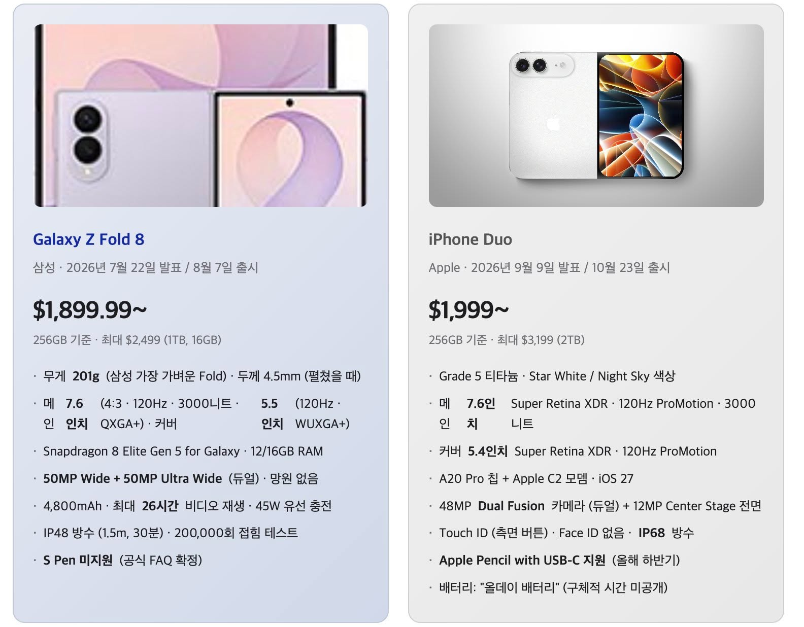
**이미지 캡션:** 이 이미지는 두 개의 스마트폰 제품 정보를 나란히 보여주는 웹페이지의 일부로, 왼쪽에는 삼성의 'Galaxy Z Fold 8'이, 오른쪽에는 애플의 'iPhone Duo'가 소개되어 있습니다. 두 제품 모두 2026년에 출시될 예정이며, 각각의 주요 사양과 가격 정보가 상세하게 기재되어 있습니다. Galaxy Z Fold 8은 2026년 7월 22일 발표 및 8월 7일 출시 예정이며, 가격은 1,899.99달러부터 시작합니다. 주요 사양으로는 201g의 가벼운 무게, 4.5mm의 얇은 두께, 7.6인치와 5.5인치 두 개의 디스플레이, Snapdragon 8 Elite Gen 5 칩셋, 50MP 듀얼 카메라, 4,800mAh 배터리, IP48 방수 기능 등이 언급되어 있습니다. 반면 iPhone Duo는 2026년 9월 9일 발표 및 10월 23일 출시 예정이며, 가격은 1,999달러부터 시작합니다. 주요 사양으로는 Grade 5 티타늄 소재, Star White 및 Night Sky 색상, 7.6인치와 5.4인치 디스플레이, A20 Pro 칩, 48MP 듀얼 카메라, Touch ID, IP68 방수 기능, 그리고 Apple Pencil 지원 등이 특징으로 제시되어 있습니다. 두 제품 모두 256GB 모델을 기준으로 하며, 더 높은 용량의 옵션과 가격도 함께 표기되어 있습니다. 전반적으로 제품의 디자인, 성능, 기능 등을 비교하며 구매를 고려하는 사용자들에게 유용한 정보를 제공하는 화면입니다.

### 9월 10일 (목) 09:08 · 세상에서 가장 큰 어묵 꼬치! 어묵 좋아하는 사람으로써 너무 행복하네…

세상에서 가장 큰 어묵 꼬치! 어묵 좋아하는 사람으로써 너무 행복하네요. #해운대

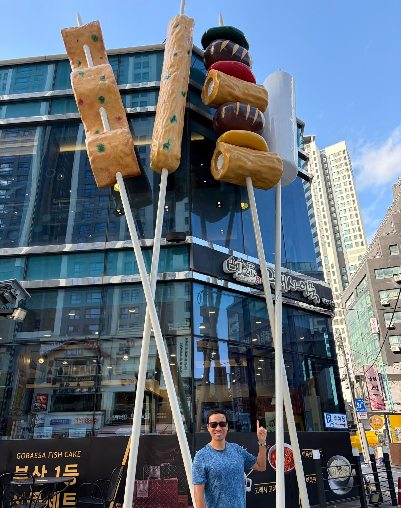
**이미지 캡션:** 한 성인 남성이 푸른색 티셔츠와 선글라스를 착용하고 밝게 웃으며 오른손 검지를 위로 향해 가리키고 있다. 그는 한국의 유명한 어묵 가게인 '고래사 어묵' 앞에 서 있으며, 가게 건물은 현대적인 디자인의 유리 외벽으로 되어 있고 여러 층으로 이루어져 있다. 건물 앞에는 거대한 어묵 모형들이 여러 개 세워져 있는데, 각 모형은 여러 개의 어묵 조각이 꼬치에 꿰어진 형태로, 실제 어묵의 질감과 색감을 사실적으로 표현하고 있다. 남성 뒤편으로는 가게의 간판과 함께 'GORAESA FISH CAKE', '고래사 꼬치', '어묵면' 등의 한국어와 영어로 된 텍스트가 보인다. 주변에는 다른 건물들과 도로, 신호등, 주차장 표지판 등이 보이며, 전반적으로 맑은 날씨 속에서 활기찬 도시의 분위기를 느낄 수 있다.

### 9월 11일 (금) 10:01 · #300B #3위 #SolarPro4가 OpenRouter에서 일일 30…

#300B #3위 #SolarPro4가 OpenRouter에서 일일 300B 토큰 사용량에 근접하면서 Closed 모델 일일 3위에 올라갔습니다. https://openrouter.ai/upstage/solar-pro4 좋은 모델입니다. 많이 사용해주세요! 500B 넘고 1T 넘어 보겠습니다.

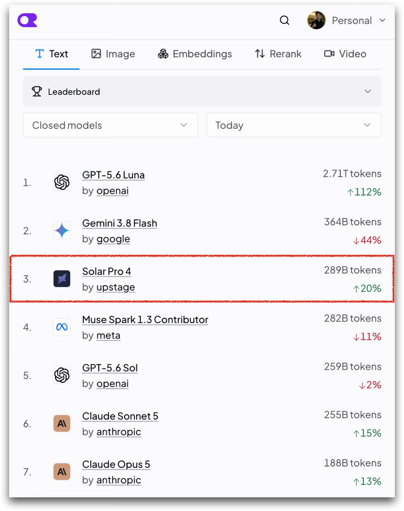
**이미지 캡션:** 이 화면은 인공지능 모델의 성능을 비교하는 리더보드를 보여줍니다. 상단에는 검색, 이미지, 임베딩, 재순위, 비디오와 같은 다양한 기능 버튼이 있으며, 현재 '리더보드'가 선택되어 있습니다. 리더보드에는 'Closed models'와 'Today'라는 필터가 적용되어 있으며, 현재 날짜 기준으로 닫힌 모델들의 순위를 보여줍니다. 순위 목록에는 각 모델의 이름, 개발사, 토큰 수, 그리고 전날 대비 성능 변화율이 표시됩니다. 1위는 OpenAI의 GPT-5.6 Luna로 2.71T 토큰을 사용하며 112% 상승했고, 2위는 Google의 Gemini 3.8 Flash로 364B 토큰을 사용하며 44% 하락했습니다. 3위는 Upstage의 Solar Pro 4로 289B 토큰을 사용하며 20% 상승했습니다. 이 외에도 Meta의 Muse Spark 1.3 Contributor, OpenAI의 GPT-5.6 Sol, Anthropic의 Claude Sonnet 5, Claude Opus 5 등의 모델들이 순위에 올라 있습니다. 전반적으로 기술적인 정보를 담고 있는 깔끔하고 현대적인 인터페이스입니다.

### 9월 12일 (토) 07:16 · 오늘 엔비디아에서 여러 AI 플랫폼을 총괄하는 매디슨 황 Madison …

오늘 엔비디아에서 여러 AI 플랫폼을 총괄하는 매디슨 황 Madison Huang 님의 초청으로 엔비디아 본사를 찾았습니다.

만나자마자 "LLM 잘하는 업스테이지, 우리가 무엇을 도와주면 될까"라는 직구 질문으로 시작하셔서 Upstage 관련해 5가지 이야기를 나눴는데요. 모두 긍정적으로 검토해주시겠다고 하셨습니다. 그리고 앞으로 Upstage 관련 이메일에는 본인들도 다 넣어 달라고 하실 정도로 큰 관심을 보여주셨습니다.

다음에 한국에 오시면 K 스타트업 깐부치킨 같은 것도 하자고 말씀해주셔서 기대됩니다.

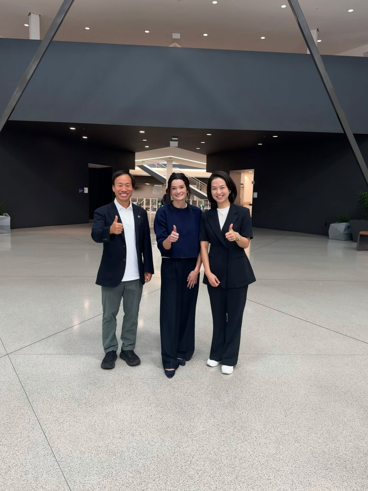
**이미지 캡션:** 세 명의 사람이 실내 공간에서 엄지손가락을 치켜세우며 포즈를 취하고 있다. 왼쪽에는 흰색 셔츠에 검은색 재킷, 회색 바지를 입은 성인 남성이 서 있고, 가운데에는 남색 상의와 바지를 입은 성인 여성이, 오른쪽에는 검은색 정장을 입은 성인 여성이 서 있다. 세 사람 모두 밝게 웃으며 긍정적인 표정을 짓고 있다. 배경은 현대적인 건축 양식의 넓은 로비로, 높은 천장과 검은색 구조물, 그리고 밝은 조명이 특징이다. 바닥은 회색 계열의 테라조 재질로 되어 있으며, 공간은 깔끔하고 정돈된 느낌을 준다. 전체적으로 밝고 활기찬 분위기를 연출하고 있다.

### 9월 13일 (일) 07:53 · Active 단 3B(전체 35B)로 #SolarPro4 성능에 근접하는…

Active 단 3B(전체 35B)로 #SolarPro4 성능에 근접하는 #SolarMini4, 출시를 앞두고 무료 Preview를 공개합니다.

아래 폼으로 신청하신 뒤 'solar-mini4-preview'로 모델을 호출하시면 됩니다. 많이 써주실수록 정식 버전이 더 좋아집니다.
https://docs.google.com/forms/d/e/1FAIpQLSeRi6gvjcro4lkK_SEnvesiOlNMYGl1bo7OvBsDO6NCNCrzJQ/viewform

작지만 웬만한 Agent 기능은 다 해내고, 아주 빠릅니다. 선사용 후고민!

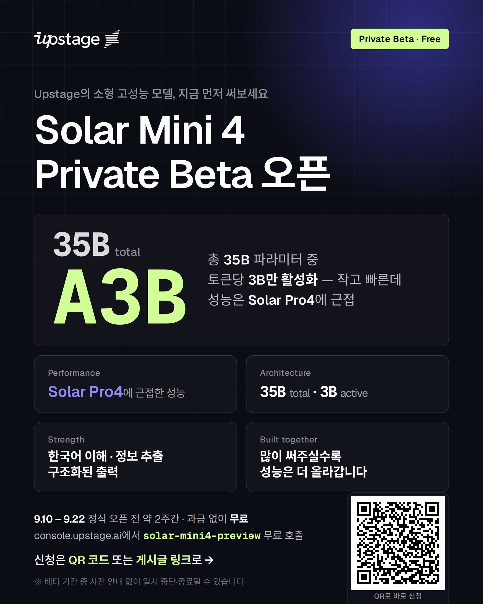
**이미지 캡션:** 이 이미지는 Upstage의 소형 고성능 모델인 Solar Mini 4의 Private Beta 오픈을 알리는 홍보 이미지입니다. 상단에는 Upstage 로고와 함께 "Private Beta · Free"라는 문구가 표시되어 있습니다. 중앙에는 "Solar Mini 4 Private Beta 오픈"이라는 큰 제목이 흰색 글씨로 쓰여 있으며, 그 아래에는 "35B total A3B"라는 문구가 녹색과 흰색으로 강조되어 있습니다. 이어서 "총 35B 파라미터 중 토큰당 3B만 활성화 - 작고 빠른데 성능은 Solar Pro4에 근접"이라는 설명이 있습니다. 하단에는 두 개의 정보 박스가 나란히 배치되어 있습니다. 왼쪽 박스에는 "Performance"라는 제목 아래 "Solar Pro4에 근접한 성능"이라고 쓰여 있고, 오른쪽 박스에는 "Architecture"라는 제목 아래 "35B total · 3B active"라고 쓰여 있습니다. 그 아래에는 또 다른 두 개의 정보 박스가 있습니다. 왼쪽 박스에는 "Strength"라는 제목 아래 "한국어 이해·정보 추출 구조화된 출력"이라고 쓰여 있고, 오른쪽 박스에는 "Built together"라는 제목 아래 "많이 써주실수록 성능은 더 올라갑니다"라고 쓰여 있습니다. 이미지 하단에는 "9.10-9.22 정식 오픈 전 약 2주간 · 과금 없이 무료"라는 안내와 함께 "console.upstage.ai에서 solar-mini4-preview 무료 호출"이라는 내용이 있습니다. 신청 방법으로는 "신청은 QR 코드 또는 게시글 링크로 →"라는 문구와 함께 QR 코드가 우측 하단에 배치되어 있으며, QR 코드 아래에는 "QR로 바로 신청"이라고 쓰여 있습니다. 이미지 하단에는 "※ 베타 기간 중 사전 안내 없이 일시 중단·종료될 수 있습니다"라는 주의 문구가 있습니다. 전반적으로 어두운 배경에 밝은 색상의 텍스트를 사용하여 정보 전달에 집중한 디자인이며, 기술적인 내용을 간결하게 요약하여 보여주고 있습니다.

### 9월 16일 (수) 15:00 · 업스테이지를 초기 투자자이신 Songyee Yoon 대표님이 업스테이지를…

업스테이지를 초기 투자자이신 Songyee Yoon 대표님이 업스테이지를 방문하시고 앞뒤로 #SolarPro4 응원해주셨습니다. 

https://openrouter.ai/upstage/solar-pro4 좋은 모델입니다. 많이 사용해주세요.

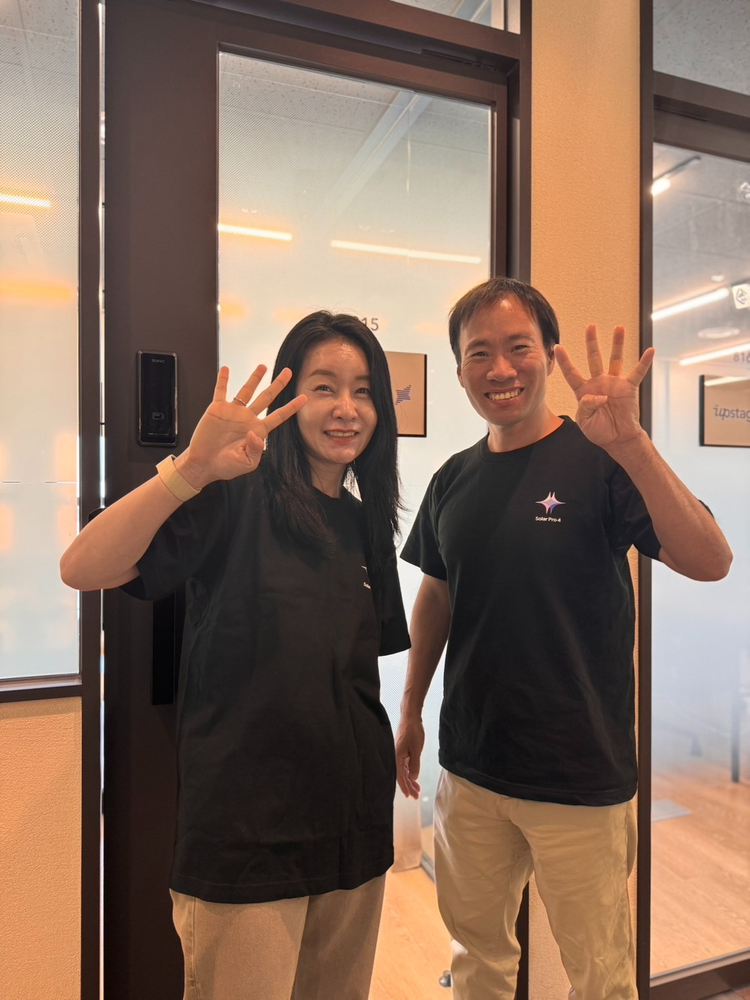
**이미지 캡션:** 사진에는 성인 여성 한 명과 성인 남성 한 명이 서 있다. 여성은 30대 후반에서 40대 초반으로 보이며, 검은색 반팔 티셔츠와 베이지색 바지를 입고 있다. 그녀는 긴 검은색 머리를 하고 있으며, 밝게 웃으며 손가락 네 개를 펼쳐 보이고 있다. 남성은 30대 후반에서 40대 초반으로 보이며, 검은색 반팔 티셔츠와 베이지색 바지를 입고 있다. 그의 머리는 짧고 검은색이며, 환하게 웃으며 손가락 네 개를 펼쳐 보이고 있다. 두 사람 모두 편안하고 긍정적인 표정을 짓고 있다. 배경은 사무실 내부로 보이며, 유리문과 벽이 보인다. 유리문에는 '15'라는 숫자가 적혀 있고, 벽에는 'upstage'라는 글자가 보인다. 전반적으로 밝고 활기찬 분위기이며, 동료 간의 친근한 모습을 담고 있는 것으로 보인다.
 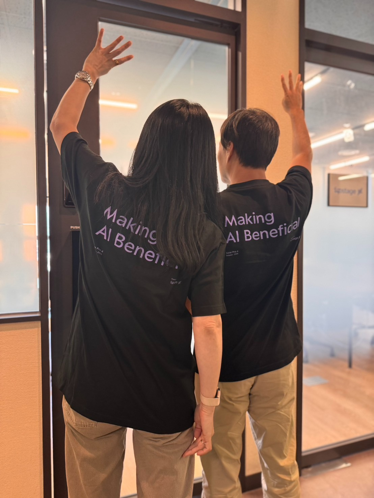
**이미지 캡션:** 이 사진에는 검은색 티셔츠를 입은 두 사람이 유리문을 향해 서서 오른손을 들고 있는 모습이 담겨 있습니다. 왼쪽의 사람은 긴 검은색 머리를 하고 있으며, 손목에는 은색 시계를 차고 있습니다. 오른쪽의 사람은 짧은 갈색 머리를 하고 있습니다. 두 사람 모두 연한 베이지색 바지를 입고 있으며, 티셔츠 뒷면에는 보라색 글씨로 "Making AI Beneficial"이라는 문구가 적혀 있습니다. 이들은 사무실 내부로 보이는 장소에 있으며, 배경에는 유리문과 사무실 내부의 모습이 희미하게 보입니다. 전반적으로 긍정적이고 협력적인 분위기를 나타내는 듯한 모습입니다.

### 9월 17일 (목) 13:25 · 바이브 코딩이 쉬워질수록 테스트와 코드 리뷰는 더 중요합니다. AI가 빠…

바이브 코딩이 쉬워질수록 테스트와 코드 리뷰는 더 중요합니다. AI가 빠르게 코드를 만들고 수정할수록, 사실 더 많은 버그가 생성되고 있는 것입니다. “잘 돌아가는 것 같은 느낌적 느낌에서 ”에서 끝내면 나중에 큰일이 납니다. 테스트로 검증하고, 다른 AI의 시선으로 다시 리뷰하는 과정은 필수! 

그래서 #TCDD (Test × CodeReview Driven Development) SKILL을 만들어 공개합니다. LOOP: Test → Code → Test → Freebuff + Solar Pro 4 Review → 수정 → 다시 Test & Review. 테스트와 리뷰가 모두 끝나야 DONE입니다.

설치는 여러분의 코딩 에이전트에게 https://github.com/hunkim/TCDD 를 주고 “이 SKILL 설치해줘”라고 하면 됩니다. 그러면 이후 코딩부터 TCDD 루프를 따르게 할 수 있습니다. Freebuff는 FREE CODING AGENT라 무료로 부담 없이 사용가능합니다. 선사용 후고민!

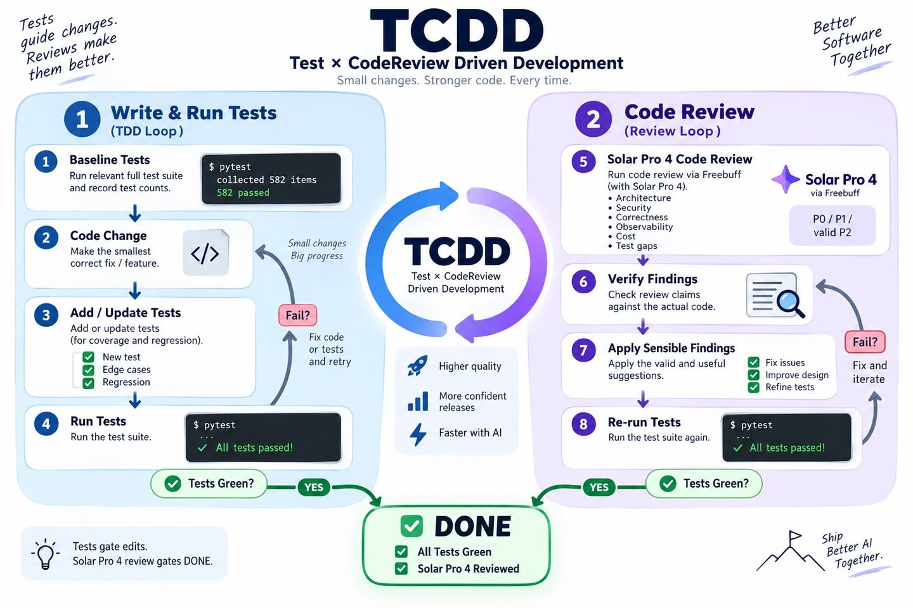
**이미지 캡션:** 이 이미지는 TCDD(Test x CodeReview Driven Development)라는 개발 방법론을 설명하는 플로우차트입니다. 왼쪽에는 "Write & Run Tests"라는 제목의 TDD 루프가 있으며, 1단계 "Baseline Tests"에서는 전체 테스트 스위트를 실행하고 테스트 수를 기록하며, 2단계 "Code Change"에서는 가장 작은 수정 또는 기능을 적용하고, 3단계 "Add/Update Tests"에서는 커버리지 및 회귀 테스트를 추가하거나 업데이트하며, 4단계 "Run Tests"에서는 테스트 스위트를 다시 실행합니다. 테스트가 통과하면(Tests Green? YES) "DONE"으로 이어집니다. 테스트가 실패하면 "Fail? Fix code or tests and retry"라는 메시지가 표시됩니다. 오른쪽에는 "Code Review"라는 제목의 리뷰 루프가 있으며, 5단계 "Solar Pro 4 Code Review"에서는 Freebuff와 Solar Pro 4를 사용하여 코드 리뷰를 수행하고, 6단계 "Verify Findings"에서는 리뷰 주장을 실제 코드와 대조하며, 7단계 "Apply Sensible Findings"에서는 유효하고 유용한 제안을 적용하고, 8단계 "Re-run Tests"에서는 테스트 스위트를 다시 실행합니다. 이 루프에서도 테스트가 통과하면(Tests Green? YES) "DONE"으로 이어지고, 실패하면 "Fail? Fix and iterate"라는 메시지가 표시됩니다. 중앙에는 TCDD의 핵심 개념을 나타내는 원형 다이어그램이 있으며, "Higher quality", "More confident releases", "Faster with AI"와 같은 이점들이 표시됩니다. 하단에는 "Tests gate edits. Solar Pro 4 review gates DONE."이라는 문구와 함께 전구 아이콘이 있고, 오른쪽 하단에는 산봉우리와 깃발이 그려진 "Ship Better AI Together."라는 문구가 있습니다. 전반적으로 이 이미지는 테스트 주도 개발과 코드 리뷰를 결합하여 소프트웨어 품질을 향상시키는 프로세스를 시각적으로 명확하게 보여줍니다.
 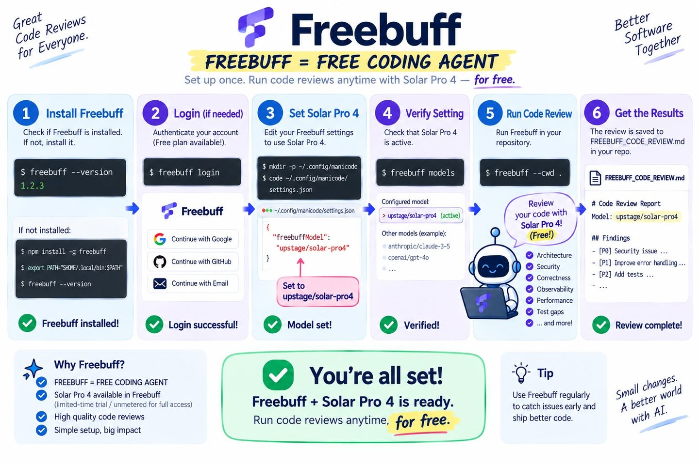
**이미지 캡션:** 이 이미지는 Freebuff라는 무료 코딩 에이전트의 설정 및 사용 방법을 단계별로 설명하는 인포그래픽입니다. 상단에는 Freebuff 로고와 함께 "Great Code Reviews for Everyone."이라는 문구가 파란색 붓글씨로 쓰여 있고, "Better Software Together"라는 문구도 함께 있습니다. 중앙에는 Freebuff가 무료 코딩 에이전트이며 Solar Pro 4를 사용하여 무료로 코드 검토를 수행할 수 있다는 설명이 있습니다. 이미지의 주요 부분은 6단계로 나뉘어 있으며, 각 단계는 번호가 매겨진 원과 해당 설명으로 구성됩니다. 1단계 "Install Freebuff"에서는 Freebuff 설치 여부를 확인하고 설치하는 방법을 보여줍니다. 2단계 "Login (if needed)"에서는 계정을 인증하는 방법을 설명하며 Google, GitHub, 이메일로 로그인할 수 있습니다. 3단계 "Set Solar Pro 4"에서는 Freebuff 설정을 편집하여 Solar Pro 4를 사용하도록 하는 방법을 보여줍니다. 4단계 "Verify Setting"에서는 Solar Pro 4가 활성화되었는지 확인하는 방법을 설명합니다. 5단계 "Run Code Review"에서는 저장소에서 Freebuff를 실행하는 방법을 보여주며, 귀여운 로봇 캐릭터가 노트북을 사용하며 코드 검토를 수행하는 모습을 묘사합니다. 6단계 "Get the Results"에서는 검토 결과가 FREEBUFF_CODE_REVIEW.md 파일에 저장된다는 것을 보여줍니다. 하단에는 "Why Freebuff?"라는 섹션에서 Freebuff의 장점을 나열하고, "You're all set!"이라는 메시지와 함께 Freebuff와 Solar Pro 4가 준비되었음을 알립니다. 또한, "Tip" 섹션에서는 Freebuff를 정기적으로 사용하여 문제를 조기에 발견하고 더 나은 코드를 출시하라는 조언을 제공합니다. 마지막으로 "Small changes. A better world with AI."라는 문구가 이미지의 오른쪽 하단에 쓰여 있습니다. 전체적으로 밝고 긍정적인 분위기이며, 기술적인 내용을 쉽게 이해할 수 있도록 시각적으로 구성되어 있습니다.

### 9월 22일 (화) 07:12 · #Jev 대신 #SolarMini4Jev 를 사용해보셔요. Jev 라는 …

#Jev 대신 #SolarMini4Jev 를 사용해보셔요. Jev 라는 구조화된 판단만 내는 Decision 모델이 상당히 인기인데요. 주어진 state에 대해 예/아니오 (noul),  N개중 하나 선택 (choice), 1~10단계 척도 (score)를 json으로 바로 보내 주는 간단한 모델입니다.  

이걸로 무엇을 할수 있냐고요? 활용도가 어마어마 합니다. 고객지원 티켓 분류·우선순위, 에이전트 툴콜 위험도 확인, 모델 라우팅, 콘텐츠 모더레이션. LLM 가드레일, 출력갑 스코어링, 컨텍스트 압축(히스토리 keep/drop), 대량 분류·랭킹, 코드/PR 위험도 평가, 에이전트 다음 행동 선택 등등등 무수히 많습니다. 그리고 한 요청에 여러 질문을 병렬로 넣을 수 있어서, “분류 + 긴급도 + 가드 3개”를 한 번의 답으로 얻을수도 있습니다.

이런 멋진 Jev의 구조화된 판단을 내는 System One API를 #SolarMini4로 만들어 보았습니다. 그리고 얼마나 잘하나 정확도 (Grok 4.6 Judge)를 살펴보니 놀라운 결과가 나왔습니다. 약 400개의 문제에 대해 Jev가 94.2% 정확하게 답한것이 배해 무려 SolarMini4-Jev는 98.4%. 특히 한국어 입력에 대해서는 98.8 대 93.9로 SomarMini4의 압승입니다.

다만 #SolarMini4Jev 는 평균 1.2초가 걸려 0.4초대인 Jev에 비해 조금 느리다는 것이 흠이지만 GPU등 보강으로 sub 1초 달성해보겠습니다. 조금 기다려도 정확하게 구조화된 판단이 필요하시면 #SolarMini4Jev 를 사용해보세요. 

https://github.com/hunkim/solar-mini4-jev wrapper 코드와 실험, 그리고 간단한 데모를 살펴보셔요.

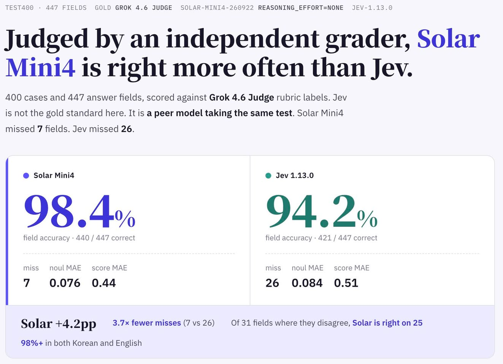
**이미지 캡션:** 이 이미지는 두 개의 인공지능 모델인 Solar Mini4와 Jev 1.13.0의 성능을 비교하는 웹페이지의 일부를 보여줍니다. 상단에는 "독립적인 평가자에 의해 평가된 Solar Mini4가 Jev보다 더 자주 맞습니다."라는 제목이 있습니다. 그 아래에는 400개의 사례와 447개의 답변 필드에 대해 Grok 4.6 Judge 루브릭 레이블을 사용하여 평가했으며, Jev는 골드 스탠더드가 아니며 같은 테스트를 치른 동등한 모델이라고 설명합니다. Solar Mini4는 7개의 필드를 놓쳤고 Jev는 26개의 필드를 놓쳤습니다. 화면 중앙에는 두 모델의 성능을 비교하는 두 개의 카드형 섹션이 있습니다. 왼쪽에는 Solar Mini4가 98.4%의 필드 정확도를 보이며 440/447개의 답변을 맞혔고, 놓친 필드는 7개, noul MAE는 0.076, score MAE는 0.44입니다. 오른쪽에는 Jev 1.13.0이 94.2%의 필드 정확도를 보이며 421/447개의 답변을 맞혔고, 놓친 필드는 26개, noul MAE는 0.084, score MAE는 0.51입니다. 하단에는 Solar Mini4가 Jev보다 4.2%p 더 높은 성능을 보이며 3.7배 적은 실수를 했고(7개 대 26개), 31개의 의견 불일치 필드 중 Solar가 25개에서 더 정확했다고 명시되어 있습니다. 또한 Solar Mini4는 한국어와 영어 모두에서 98% 이상의 정확도를 보인다고 언급되어 있습니다. 배경은 흰색이며, 텍스트는 주로 검은색과 파란색, 녹색으로 표시되어 있습니다. 이 이미지는 데이터 분석 및 AI 모델 성능 비교에 대한 정보를 제공합니다.

### 9월 22일 (화) 07:36 · Sung Kim shared a link.

🔗 <https://github.com/ziozzang/hearim>

### 9월 22일 (화) 10:45 · #SolarPro4 OpenRouter 판매량 3위 돌풍에 대해 좋은 기…

#SolarPro4 OpenRouter 판매량 3위 돌풍에 대해 좋은 기사, 감사드립니다.

https://openrouter.ai/upstage/solar-pro4 좋은 모델입니다. 많이 사용해주셔요.

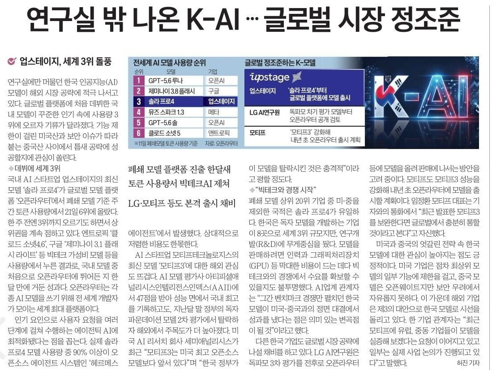
**이미지 캡션:** 이 사진은 한국의 인공지능(AI) 모델들이 글로벌 시장에 진출하는 현황을 다룬 신문 기사이다. 사진 중앙에는 '연구실 밖 나온 K-AI… 글로벌 시장 정조준'이라는 제목이 크게 쓰여 있으며, 그 아래에는 '업스테이지, 세계 3위 돌풍', '전세계 AI 모델 사용량 순위', '글로벌 정조준하는 K-모델' 등의 소제목과 함께 관련 내용이 담긴 기사 본문이 여러 단락으로 나뉘어 배치되어 있다. 기사 본문에는 한국 AI 스타트업인 업스테이지의 '솔라 프로4' 모델이 글로벌 플랫폼 '오픈라우터'에서 사용량 순위 6위에 올랐다는 내용과 함께, LG AI연구원의 '모티프3' 모델에 대한 해외의 관심도 높다는 내용이 담겨 있다. 또한, 미국과 중국의 AI 모델 전략과 달리 한국 모델이 제3의 대안으로 부상하고 있다는 분석도 포함되어 있다. 사진의 배경은 신문 지면으로, 텍스트가 주를 이루고 있으며, 일부에는 태극기 문양과 K-AI라는 글자가 디자인된 이미지도 포함되어 있다. 전반적으로 정보 전달에 초점을 맞춘 딱딱하고 진지한 분위기이다.

### 9월 22일 (화) 10:46 · Sung Kim shared a link.

🔗 <https://v.daum.net/v/20260921183852897>

### 9월 22일 (화) 18:35 · 📷 사진 (1장)

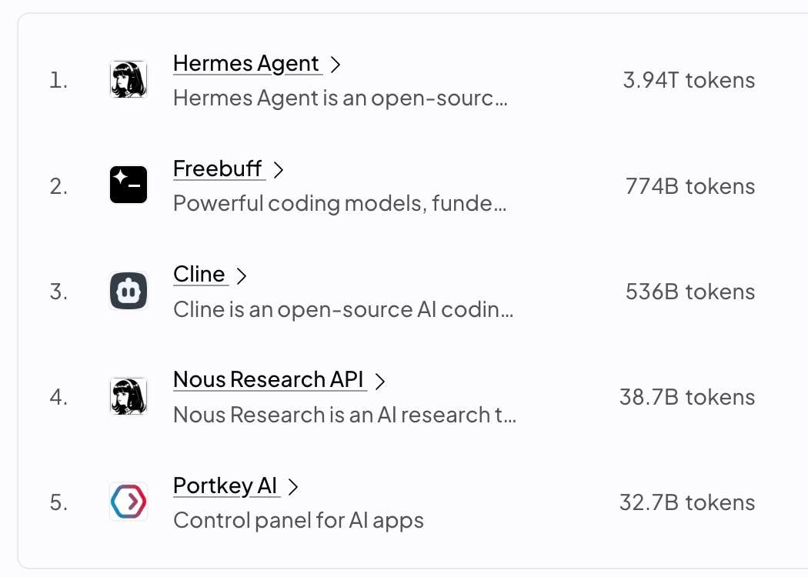
**이미지 캡션:** 이 이미지는 순위 목록을 보여주며, 각 항목은 번호, 아이콘, 이름, 설명 및 토큰 수를 포함합니다. 1위는 "Hermes Agent"로, "Hermes Agent is an open-sourc..."라는 설명과 함께 3.94T 토큰을 가지고 있습니다. 2위는 "Freebuff"로, "Powerful coding models, funde..."라는 설명과 함께 774B 토큰을 가지고 있습니다. 3위는 "Cline"으로, "Cline is an open-source Al codin..."라는 설명과 함께 536B 토큰을 가지고 있습니다. 4위는 "Nous Research API"로, "Nous Research is an Al research t..."라는 설명과 함께 38.7B 토큰을 가지고 있습니다. 5위는 "Portkey AI"로, "Control panel for Al apps"라는 설명과 함께 32.7B 토큰을 가지고 있습니다. 각 항목에는 이름 옆에 화살표 아이콘이 있어 클릭 가능한 링크임을 나타냅니다. 전반적으로 이 이미지는 기술 또는 AI 관련 프로젝트의 순위를 보여주는 목록으로 보이며, 각 항목의 중요성이나 규모를 토큰 수를 통해 나타내고 있습니다.

### 9월 24일 (목) 06:37 · 서울창조경제혁신센터 모든 입주·관계 기업에 퓨리오사Chip에 올라간 Up…

서울창조경제혁신센터 모든 입주·관계 기업에 퓨리오사Chip에 올라간 Upstage 모든 AI 서비스를 아이티동아와 함께 무료로 제공할 예정입니다.

입주 기업은 바로 연락 주시거나 서울창조경제혁신센터를 통해 연락 주시면 됩니다.

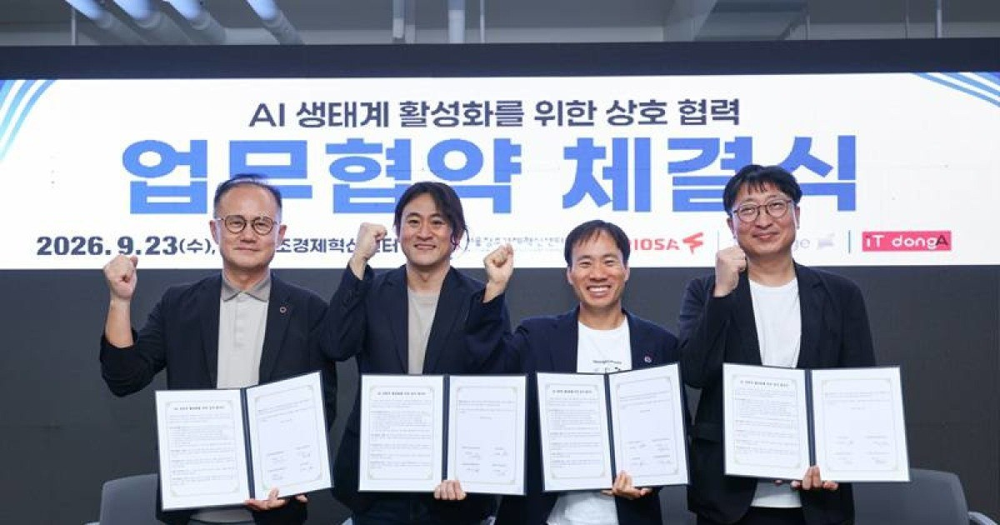
**이미지 캡션:** 네 명의 성인 남성이 무대 앞에서 서류를 들고 주먹을 쥐어 올리며 포즈를 취하고 있다. 이들은 모두 정장 재킷을 입고 있으며, 가운데 두 명은 캐주얼한 셔츠를, 양 끝의 두 명은 셔츠 위에 칼라가 있는 얇은 재킷을 입고 있다. 왼쪽 첫 번째 남성은 안경을 쓰고 있으며, 가운데 두 남성은 웃고 있고, 오른쪽 남성도 안경을 쓰고 미소를 짓고 있다. 배경에는 "AI 생태계 활성화를 위한 상호 협력 업무협약 체결식"이라는 큰 글씨가 파란색과 흰색으로 쓰여 있으며, 그 아래에는 "2026.9.23(수)"라는 날짜와 함께 여러 로고가 보인다. 이 행사는 협력 계약 체결을 기념하는 것으로 보이며, 전반적으로 성공적이고 긍정적인 분위기를 나타낸다.

### 9월 24일 (목) 06:37 · Sung Kim shared a link.

🔗 <https://v.daum.net/v/20260923193300742>

### 9월 25일 (금) 10:50 · 앉아 있는 시간이 너무 많은 건 아닐까 하는 생각에 전동 스탠딩 데스크를…

앉아 있는 시간이 너무 많은 건 아닐까 하는 생각에 전동 스탠딩 데스크를 살까 말까 망설였는데요. 그런데 가격이 AI 한 달 이용료보다도 저렴하게 내려갔더라고요. 직접 조립해야 한다는 점은 조금 부담이었지만, 설명서가 쉽고 조립도 쉬웠을 뿐 아니라 부품을 잘못 조립할 수 없게 (impossible to fail) 설계되어 있어서 오히려 재미있게 조립할 수 있었습니다.

하루 중 절반을 넘게 앉아서 보내시는 분들께 특히 좋을 것 같습니다. 이 글도 지금 서서 작성하고 있습니다. ^^

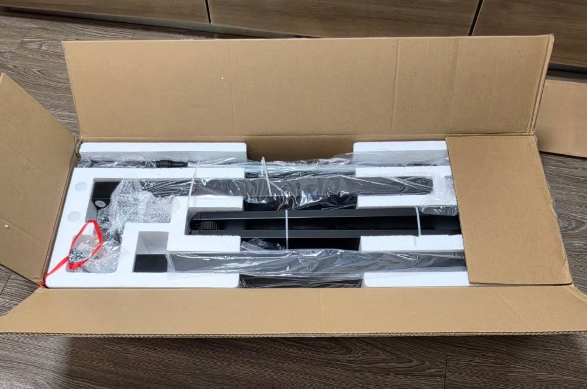
**이미지 캡션:** 열린 갈색 골판지 상자 안에 검은색 물체가 흰색 스티로폼 완충재와 투명 비닐 포장재로 보호되어 들어 있습니다. 상자 바닥에는 나무 질감의 바닥재가 보이며, 상자 뒤쪽으로는 가구로 보이는 물체가 희미하게 보입니다. 상자 안의 물체는 길고 납작한 형태로, 여러 개의 부품으로 구성된 것으로 추정됩니다. 왼쪽 상단에는 빨간색 끈이 달린 작은 은색 물체가 보입니다. 전체적으로 새 제품을 개봉한 직후의 상황으로 보이며, 깔끔하고 정돈된 분위기입니다.
 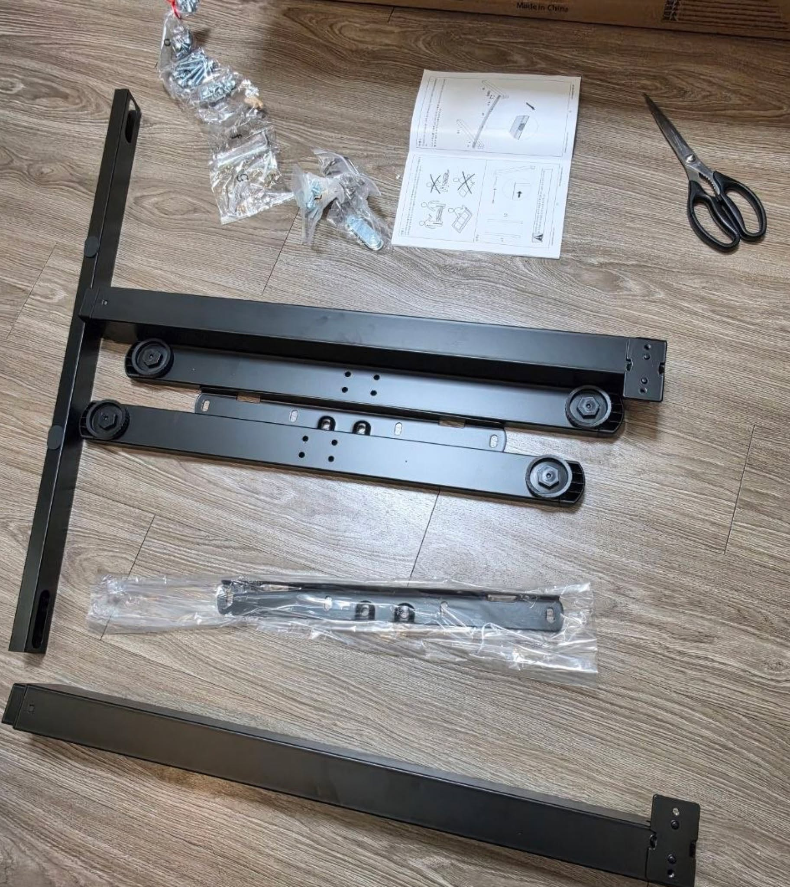
**이미지 캡션:** 이 사진은 조립을 기다리는 검은색 금속 프레임 부품과 나사, 설명서, 가위가 나무 바닥에 놓여 있는 모습을 보여줍니다. 사진에는 사람이 보이지 않습니다. 검은색 금속 부품들은 길고 납작한 막대 모양이며, 일부에는 바퀴가 달려 있습니다. 나사는 여러 개의 작은 비닐봉지에 담겨 있으며, 조립 설명서는 펼쳐져 있습니다. 가위는 검은색이며 날카로운 모양입니다. 배경은 나무 무늬의 바닥이며, 상자 일부가 가장자리에 보입니다. 전반적으로 조립을 시작하기 전의 준비된 상태를 나타내는 분위기입니다.
 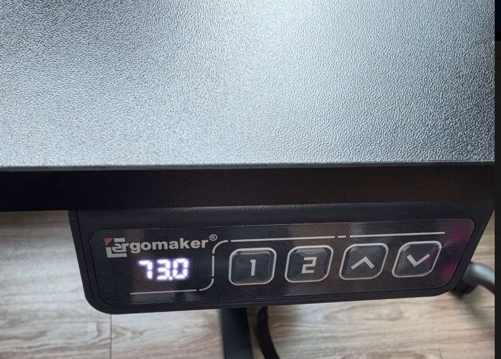
**이미지 캡션:** 이 사진은 높이 조절 책상의 제어판을 클로즈업한 것으로, 회색의 거친 질감으로 된 책상 상판 아래에 검은색 제어판이 보인다. 제어판에는 "Ergomaker" 로고와 함께 숫자 "73.0"이 표시된 디지털 디스플레이가 있으며, 이는 책상의 현재 높이(아마도 센티미터 단위)를 나타내는 것으로 보인다. 그 옆에는 "1"과 "2"가 새겨진 두 개의 버튼이 있고, 그 뒤에는 위쪽 화살표가 있는 버튼과 체크 표시가 있는 버튼이 있다. 이 버튼들은 책상의 높이를 조절하거나 미리 설정된 높이를 저장하는 데 사용될 것으로 추정된다. 배경에는 나무 바닥이 보이며, 사진의 전체적인 분위기는 기능적이고 현대적인 사무 환경을 연상시킨다. 사람이나 특정 행동은 보이지 않으며, 텍스트는 브랜드 이름과 숫자, 그리고 버튼 기호뿐이다.

### 9월 25일 (금) 15:37 · 📷 사진 (1장)

**이미지 캡션:** 이 사진은 어두운 배경에 "ergomaker"라는 로고와 함께 숫자 "320"이 희미하게 빛나는 모습이 담겨 있습니다. 로고는 흰색 글자로 되어 있으며, 'e'와 'r' 사이에 빨간색 삼각형 모양의 디자인이 있습니다. 로고 옆에는 등록 상표 기호인 '®'가 보입니다. 숫자 "320"은 밝은 보라색 빛을 띠며, 마치 디지털 디스플레이에 나타난 것처럼 보입니다. 전체적으로 기계나 장치의 일부를 클로즈업한 듯한 느낌을 주며, 기술적이거나 산업적인 분위기를 풍깁니다. 사람이나 구체적인 장소는 보이지 않습니다.

### 9월 26일 (토) 06:18 · #AskUp with #SolarMini4 성능은 유지하면서 속도는 3.…

#AskUp with #SolarMini4 성능은 유지하면서 속도는 3.5배 빨라졌습니다. 카톡에서 쉽게 질문하고 즉답을 받을 수 있습니다. 바로 사용해보셔요. https://pf.kakao.com/_BhxkWxj

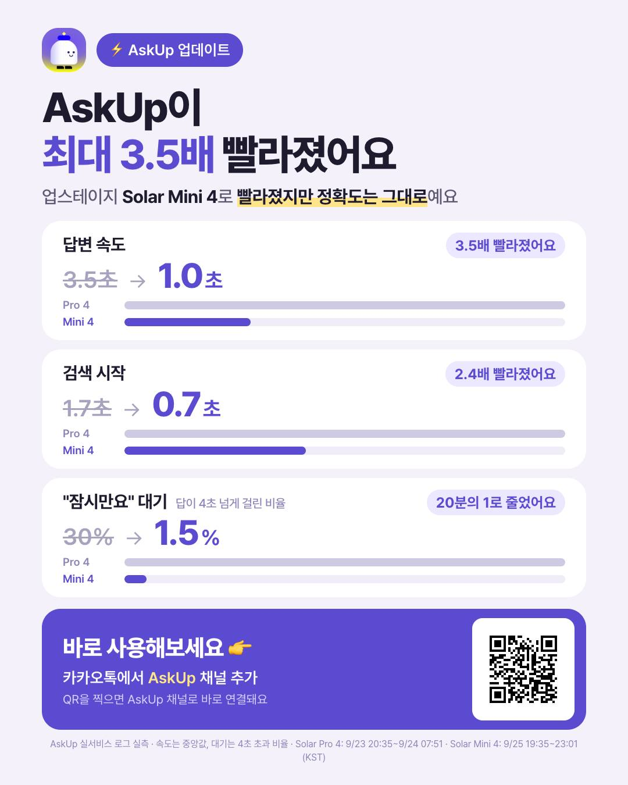
**이미지 캡션:** 이 이미지는 AskUp 서비스의 업데이트 내용을 담은 홍보 이미지로, AskUp이 최대 3.5배 빨라졌다는 점을 강조하고 있습니다. 상단에는 AskUp 로고와 함께 "AskUp 업데이트"라는 문구가 보입니다. 메인 제목은 "AskUp이 최대 3.5배 빨라졌어요"이며, 부제로는 "업스테이지 Solar Mini 4로 빨라졌지만 정확도는 그대로예요"라고 적혀 있습니다. 이미지는 세 가지 주요 지표를 통해 성능 향상을 보여줍니다. 첫 번째는 "답변 속도"로, 기존 3.5초에서 1.0초로 단축되었으며, 이는 3.5배 빨라진 결과입니다. 두 번째는 "검색 시작" 속도로, 1.7초에서 0.7초로 줄어들어 2.4배 빨라졌습니다. 세 번째는 "잠시만요" 대기 시간, 즉 답변이 4초 넘게 걸린 비율로, 30%에서 1.5%로 크게 감소하여 20분의 1로 줄었다는 점을 보여줍니다. 각 지표 옆에는 Pro 4와 Mini 4라는 두 가지 모델에 대한 비교 그래프가 함께 제시되어 있습니다. 이미지 하단에는 "바로 사용해보세요"라는 문구와 함께 카카오톡에서 AskUp 채널을 추가하는 방법을 안내하고 있습니다. QR 코드를 스캔하면 AskUp 채널로 바로 연결된다는 설명이 있으며, QR 코드 이미지가 오른쪽에 배치되어 있습니다. 전반적으로 밝고 긍정적인 분위기이며, 서비스의 성능 개선을 명확하고 시각적으로 전달하여 사용자들의 이용을 유도하는 목적을 가지고 있습니다. 이미지의 배경은 연한 보라색과 흰색이 조화롭게 사용되었으며, 텍스트는 가독성이 높은 폰트로 작성되었습니다. 이미지 하단에는 실측 데이터의 출처와 측정 기간에 대한 정보가 작게 기재되어 있습니다.
